# LangGraph Wiki

Comprehensive documentation for the LangGraph framework, covering its architecture, features, usage, and deployment.

## Table of Contents

- [Introduction to LangGraph](#introduction-to-langgraph)
- [Core Concepts](#core-concepts)
- [Quickstart Guide](#quickstart-guide)
- [Graph Structure and Components](#graph-structure-and-components)
- [Durable Execution and Checkpointing](#durable-execution-and-checkpointing)
- [Pregel Algorithm Implementation](#pregel-algorithm-implementation)
- [Configuration and Customization](#configuration-and-customization)
- [Runtime and Execution](#runtime-and-execution)
- [Persistence and Memory](#persistence-and-memory)
- [Tracing and Debugging with LangSmith](#tracing-and-debugging-with-langsmith)
- [Examples and Use Cases](#examples-and-use-cases)
- [LangGraph CLI](#langgraph-cli)

---

<a name="introduction-to-langgraph"></a>

<details>
<summary>Relevant source files</summary>

The following files were used as context for generating this wiki page:

- [https://github.com/langchain-ai/langgraph/blob/main/README.md](https://github.com/langchain-ai/langgraph/blob/main/README.md)
</details>

# Introduction to LangGraph

LangGraph is a low-level orchestration framework designed for building, managing, and deploying long-running, stateful agents. It provides the infrastructure needed to create robust and scalable agent systems, without abstracting away the underlying prompts or architecture. LangGraph integrates seamlessly with LangChain and LangSmith, offering a comprehensive suite of tools for LLM application development. Sources: [https://github.com/langchain-ai/langgraph/blob/main/README.md](README.md)

LangGraph focuses on providing core benefits such as durable execution, human-in-the-loop integration, comprehensive memory management, debugging with LangSmith, and production-ready deployment. It allows developers to create agents that can persist through failures, incorporate human oversight, maintain both short-term and long-term memory, and be easily debugged and deployed. Sources: [https://github.com/langchain-ai/langgraph/blob/main/README.md](README.md)

## Core Benefits

LangGraph offers several key advantages for building and deploying long-running, stateful workflows and agents. Sources: [https://github.com/langchain-ai/langgraph/blob/main/README.md](README.md)

*   **Durable Execution:** LangGraph enables the creation of agents that can withstand failures and run for extended periods. The system automatically resumes execution from the point where it left off, ensuring continuity. Sources: [https://github.com/langchain-ai/langgraph/blob/main/README.md](Durable execution)
*   **Human-in-the-Loop:** The framework facilitates the integration of human oversight into agent workflows. Users can inspect and modify the agent's state at any point during execution, allowing for real-time intervention and guidance. Sources: [https://github.com/langchain-ai/langgraph/blob/main/README.md](Human-in-the-loop)
*   **Comprehensive Memory:** LangGraph supports the creation of stateful agents with both short-term and long-term memory capabilities. This allows agents to maintain context across sessions and reason more effectively. Sources: [https://github.com/langchain-ai/langgraph/blob/main/README.md](Comprehensive memory)
*   **Debugging with LangSmith:** Integration with LangSmith provides deep visibility into complex agent behavior. Visualization tools trace execution paths, capture state transitions, and provide detailed runtime metrics for debugging and optimization. Sources: [https://github.com/langchain-ai/langgraph/blob/main/README.md](Debugging with LangSmith)
*   **Production-Ready Deployment:** LangGraph is designed for scalable infrastructure to handle the challenges of stateful, long-running workflows, enabling confident deployment of sophisticated agent systems. Sources: [https://github.com/langchain-ai/langgraph/blob/main/README.md](Production-ready deployment)

## LangGraph Ecosystem

LangGraph integrates with other LangChain products to provide a comprehensive development environment for LLM applications. Sources: [https://github.com/langchain-ai/langgraph/blob/main/README.md](LangGraph’s ecosystem)

*   **LangSmith:** Used for agent evaluation and observability. It helps debug poor-performing LLM app runs, evaluate agent trajectories, gain visibility in production, and improve performance over time. Sources: [https://github.com/langchain-ai/langgraph/blob/main/README.md](LangSmith)
*   **LangSmith Deployment:** Provides a deployment platform for long-running, stateful workflows. It allows users to discover, reuse, configure, and share agents across teams, and iterate quickly with visual prototyping in LangGraph Studio. Sources: [https://github.com/langchain-ai/langgraph/blob/main/README.md](LangSmith Deployment)
*   **LangChain:** Offers integrations and composable components to streamline LLM application development. Sources: [https://github.com/langchain-ai/langgraph/blob/main/README.md](LangChain)

## Simple Workflow Example

The following example demonstrates how to create a simple workflow using LangGraph:

```python
from langgraph.graph import START, StateGraph
from typing_extensions import TypedDict


class State(TypedDict):
    text: str


def node_a(state: State) -> dict:
    return {"text": state["text"] + "a"}


def node_b(state: State) -> dict:
    return {"text": state["text"] + "b"}


graph = StateGraph(State)
graph.add_node("node_a", node_a)
graph.add_node("node_b", node_b)
graph.add_edge(START, "node_a")
graph.add_edge("node_a", "node_b")

print(graph.compile().invoke({"text": ""}))
# {'text': 'ab'}
```

This code defines a simple graph with two nodes (`node_a` and `node_b`) that append "a" and "b" to the input text, respectively. The graph is then compiled and invoked with an initial state of `{"text": ""}`, resulting in the output `{'text': 'ab'}`. Sources: [https://github.com/langchain-ai/langgraph/blob/main/README.md](README.md)

### Workflow Diagram

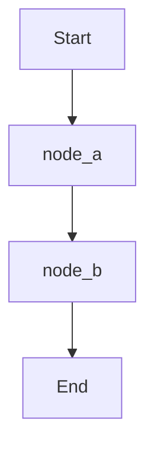

## Additional Resources

LangGraph provides various resources to help developers get started and build advanced agent systems. Sources: [https://github.com/langchain-ai/langgraph/blob/main/README.md](Additional resources)

*   **Guides:** Quick code snippets for topics such as streaming, adding memory & persistence, and design patterns. Sources: [https://github.com/langchain-ai/langgraph/blob/main/README.md](Guides)
*   **Reference:** Detailed reference on core classes, methods, how to use the graph and checkpointing APIs, and higher-level prebuilt components. Sources: [https://github.com/langchain-ai/langgraph/blob/main/README.md](Reference)
*   **Examples:** Guided examples on getting started with LangGraph. Sources: [https://github.com/langchain-ai/langgraph/blob/main/README.md](Examples)
*   **LangChain Forum:** A community forum to connect with other developers and share questions, ideas, and feedback. Sources: [https://github.com/langchain-ai/langgraph/blob/main/README.md](LangChain Forum)
*   **LangChain Academy:** A free, structured course to learn the basics of LangGraph. Sources: [https://github.com/langchain-ai/langgraph/blob/main/README.md](LangChain Academy)
*   **Case studies:** Examples of how industry leaders use LangGraph to ship AI applications at scale. Sources: [https://github.com/langchain-ai/langgraph/blob/main/README.md](Case studies)

## Conclusion

LangGraph is a powerful framework for building and deploying long-running, stateful agents. Its core benefits, ecosystem integrations, and comprehensive resources make it a valuable tool for developers looking to create sophisticated LLM applications. Sources: [https://github.com/langchain-ai/langgraph/blob/main/README.md](README.md)


---

<a name="core-concepts"></a>

<details>
<summary>Relevant source files</summary>

The following files were used as context for generating this wiki page:

- [https://github.com/langchain-ai/langgraph/blob/main/docs/docs/concepts/why-langgraph.md](https://github.com/langchain-ai/langgraph/blob/main/docs/docs/concepts/why-langgraph.md)
- [https://github.com/langchain-ai/langgraph/blob/main/docs/docs/concepts/langgraph_components.md](https://github.com/langchain-ai/langgraph/blob/main/docs/docs/concepts/langgraph_components.md)
- [https://github.com/langchain-ai/langgraph/blob/main/docs/docs/concepts/application_structure.md](https://github.com/langchain-ai/langgraph/blob/main/docs/docs/concepts/application_structure.md)
</details>

# Core Concepts

LangGraph is a framework designed for building powerful and adaptable AI agents. It provides developers with the tools to create reliable, controllable, and extensible agentic applications. Key features include support for long-running workflows, low-level primitives for customization, and first-class streaming capabilities.

This page outlines the core concepts behind LangGraph, including its benefits, key components, and application structure. Understanding these concepts is crucial for effectively developing and deploying LangGraph applications.

## Why LangGraph?

LangGraph offers several advantages for developers building AI agents:

*   **Reliability and Controllability:** LangGraph enables developers to steer agent actions using moderation checks and human-in-the-loop approvals. It also persists context for long-running workflows, ensuring agents stay on track. `Sources: [https://github.com/langchain-ai/langgraph/blob/main/docs/docs/concepts/why-langgraph.md]`
*   **Low-Level and Extensible:** The framework provides low-level primitives that allow for extensive customization, freeing developers from rigid abstractions. This enables the design of scalable multi-agent systems with agents tailored to specific roles. `Sources: [https://github.com/langchain-ai/langgraph/blob/main/docs/docs/concepts/why-langgraph.md]`
*   **First-Class Streaming Support:** LangGraph offers token-by-token streaming and streaming of intermediate steps, providing users with real-time visibility into agent reasoning and actions. `Sources: [https://github.com/langchain-ai/langgraph/blob/main/docs/docs/concepts/why-langgraph.md]`

## LangGraph Components

The LangGraph platform comprises several components that facilitate the development, deployment, debugging, and monitoring of LangGraph applications. `Sources: [https://github.com/langchain-ai/langgraph/blob/main/docs/docs/concepts/langgraph_components.md]`

*   **LangGraph Server:** Defines an opinionated API and architecture for deploying agentic applications. `Sources: [https://github.com/langchain-ai/langgraph/blob/main/docs/docs/concepts/langgraph_components.md]`
*   **LangGraph CLI:** A command-line interface for interacting with a local LangGraph instance. `Sources: [https://github.com/langchain-ai/langgraph/blob/main/docs/docs/concepts/langgraph_components.md]`
*   **LangGraph Studio:** A specialized IDE for visualizing, interacting with, and debugging LangGraph applications locally. `Sources: [https://github.com/langchain-ai/langgraph/blob/main/docs/docs/concepts/langgraph_components.md]`
*   **Python/JS SDK:** Provides a programmatic way to interact with deployed LangGraph applications. `Sources: [https://github.com/langchain-ai/langgraph/blob/main/docs/docs/concepts/langgraph_components.md]`
*   **Remote Graph:** Allows interaction with deployed LangGraph applications as if they were running locally. `Sources: [https://github.com/langchain-ai/langgraph/blob/main/docs/docs/concepts/langgraph_components.md]`
*   **LangGraph Control Plane:** The UI and APIs for creating and updating LangGraph Servers. `Sources: [https://github.com/langchain-ai/langgraph/blob/main/docs/docs/concepts/langgraph_components.md]`
*   **LangGraph Data Plane:** Consists of LangGraph Servers, their infrastructure, and a "listener" application that polls for updates from the Control Plane. `Sources: [https://github.com/langchain-ai/langgraph/blob/main/docs/docs/concepts/langgraph_components.md]`

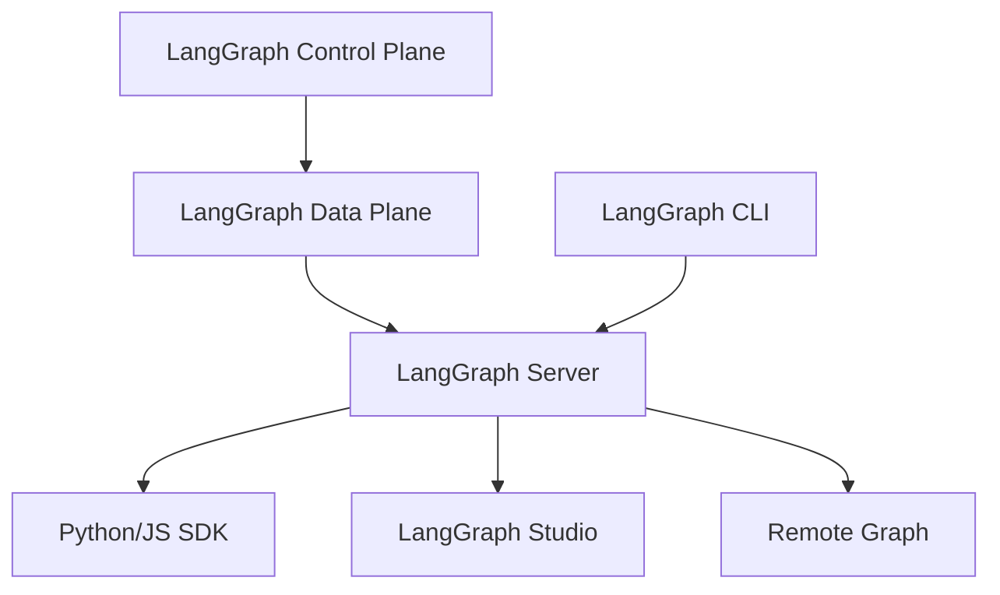

## Application Structure

A LangGraph application typically consists of graphs, a configuration file (`langgraph.json`), a dependencies file, and an optional `.env` file for environment variables. `Sources: [https://github.com/langchain-ai/langgraph/blob/main/docs/docs/concepts/application_structure.md]`

### Key Components

To deploy using the LangGraph Platform, the following components are essential: `Sources: [https://github.com/langchain-ai/langgraph/blob/main/docs/docs/concepts/application_structure.md]`

1.  **Configuration File (`langgraph.json`):** Specifies dependencies, graphs, and environment variables. `Sources: [https://github.com/langchain-ai/langgraph/blob/main/docs/docs/concepts/application_structure.md]`
2.  **Graphs:** Implement the application's logic. `Sources: [https://github.com/langchain-ai/langgraph/blob/main/docs/docs/concepts/application_structure.md]`
3.  **Dependencies File:** Lists the packages required to run the application (e.g., `requirements.txt`, `pyproject.toml`, or `package.json`). `Sources: [https://github.com/langchain-ai/langgraph/blob/main/docs/docs/concepts/application_structure.md]`
4.  **Environment Variables:** Define the environment variables needed for the application to run. `Sources: [https://github.com/langchain-ai/langgraph/blob/main/docs/docs/concepts/application_structure.md]`

### Configuration File Details

The `langgraph.json` file is crucial for specifying the application's configuration. `Sources: [https://github.com/langchain-ai/langgraph/blob/main/docs/docs/concepts/application_structure.md]` It includes:

*   **dependencies:** A list of required packages or local directories.
*   **graphs:** A mapping of graph names to their file paths and variable/function names.
*   **env:** Specifies the path to a `.env` file or defines environment variables directly.

#### Example (`langgraph.json`)

```json
{
  "dependencies": ["langchain_openai", "./your_package"],
  "graphs": {
    "my_agent": "./your_package/your_file.py:agent"
  },
  "env": "./.env"
}
```

### Dependencies

LangGraph applications rely on external packages or libraries. The dependencies must be specified in a file like `requirements.txt` (Python) or `package.json` (JavaScript/TypeScript) and referenced in the `langgraph.json` file. `Sources: [https://github.com/langchain-ai/langgraph/blob/main/docs/docs/concepts/application_structure.md]`

### Graphs

The `graphs` section in `langgraph.json` defines the graphs that will be available in the deployed application. Each graph is identified by a unique name and a path to either the compiled graph or a function that creates the graph. `Sources: [https://github.com/langchain-ai/langgraph/blob/main/docs/docs/concepts/application_structure.md]`

### Environment Variables

Environment variables can be configured in the `env` section of the `langgraph.json` file or in the deployment environment. `Sources: [https://github.com/langchain-ai/langgraph/blob/main/docs/docs/concepts/application_structure.md]`

## Conclusion

LangGraph provides a robust framework for building AI agents with reliability, controllability, and extensibility. Understanding its core components and application structure is essential for effective development and deployment. By leveraging the LangGraph Server, CLI, Studio, and SDK, developers can create powerful and adaptable AI applications.


---

<a name="quickstart-guide"></a>

<details>
<summary>Relevant source files</summary>

The following files were used as context for generating this wiki page:

- [https://github.com/langchain-ai/langgraph/blob/main/docs/docs/index.md](https://github.com/langchain-ai/langgraph/blob/main/docs/docs/index.md)
- [https://github.com/langchain-ai/langgraph/blob/main/docs/docs/tutorials/get-started/1-build-basic-chatbot.md](https://github.com/langchain-ai/langgraph/blob/main/docs/docs/tutorials/get-started/1-build-basic-chatbot.md)
</details>

# Quickstart Guide

This guide provides a quick introduction to LangGraph by walking you through the process of building a basic chatbot. The chatbot will respond directly to user messages using a language model. This guide will cover the essential steps, from setting up the environment to running the chatbot and visualizing the underlying graph structure. This basic chatbot serves as a foundation for more advanced tutorials that introduce key LangGraph concepts and capabilities.

## Building a Basic Chatbot

This section details the steps to create a simple chatbot using LangGraph.

### Prerequisites

Before starting, ensure you have access to an LLM that supports tool-calling features, such as OpenAI, Anthropic, or Google Gemini. `Sources: [https://github.com/langchain-ai/langgraph/blob/main/docs/docs/tutorials/get-started/1-build-basic-chatbot.md](Prerequisites)`

### Installation

Install the necessary packages using pip, npm, yarn, pnpm or bun:

:::python

```bash
pip install -U langgraph langsmith
```

:::

:::js
=== "npm"

    ```bash
    npm install @langchain/langgraph @langchain/core zod
    ```

=== "yarn"

    ```bash
    yarn add @langchain/langgraph @langchain/core zod
    ```

=== "pnpm"

    ```bash
    pnpm add @langchain/langgraph @langchain/core zod
    ```

=== "bun"

    ```bash
    bun add @langchain/langgraph @langchain/core zod
    ```

:::

It is recommended to sign up for LangSmith to debug, test, and monitor LangGraph projects. `Sources: [https://github.com/langchain-ai/langgraph/blob/main/docs/docs/tutorials/get-started/1-build-basic-chatbot.md](Install packages)`

### Creating a `StateGraph`

A `StateGraph` defines the structure of the chatbot as a state machine. Nodes represent the LLM and functions the chatbot can call, while edges specify transitions between these functions. `Sources: [https://github.com/langchain-ai/langgraph/blob/main/docs/docs/tutorials/get-started/1-build-basic-chatbot.md](Create a StateGraph)`

:::python

```python
from typing import Annotated

from typing_extensions import TypedDict

from langgraph.graph import StateGraph, START, END
from langgraph.graph.message import add_messages


class State(TypedDict):
    # Messages have the type "list". The `add_messages` function
    # in the annotation defines how this state key should be updated
    # (in this case, it appends messages to the list, rather than overwriting them)
    messages: Annotated[list, add_messages]


graph_builder = StateGraph(State)
```

:::

:::js

```typescript
import { StateGraph, MessagesZodState, START } from "@langchain/langgraph";
import { z } from "zod";

const State = z.object({ messages: MessagesZodState.shape.messages });

const graph = new StateGraph(State).compile();
```

:::

The graph handles receiving the current `State` as input, outputting updates to the state, and appending updates to the `messages` list. `Sources: [https://github.com/langchain-ai/langgraph/blob/main/docs/docs/tutorials/get-started/1-build-basic-chatbot.md](Create a StateGraph)`

### Adding a Node

Nodes represent units of work. The following code adds a "chatbot" node that uses a chat model to generate responses. `Sources: [https://github.com/langchain-ai/langgraph/blob/main/docs/docs/tutorials/get-started/1-build-basic-chatbot.md](Add a node)`

First, select a chat model:

:::python



<!---
```python
from langchain.chat_models import init_chat_model

llm = init_chat_model("anthropic:claude-3-5-sonnet-latest")
```
-->

:::

:::js

```typescript
import { ChatOpenAI } from "@langchain/openai";
// or import { ChatAnthropic } from "@langchain/anthropic";

const llm = new ChatOpenAI({
  model: "gpt-4o",
  temperature: 0,
});
```

:::

Incorporate the chat model into a simple node:

:::python

```python

def chatbot(state: State):
    return {"messages": [llm.invoke(state["messages"])]}


# The first argument is the unique node name
# The second argument is the function or object that will be called whenever
# the node is used.
graph_builder.add_node("chatbot", chatbot)
```

:::

:::js

```typescript hl_lines="7-9"
import { StateGraph, MessagesZodState, START } from "@langchain/langgraph";
import { z } from "zod";

const State = z.object({ messages: MessagesZodState.shape.messages });

const graph = new StateGraph(State)
  .addNode("chatbot", async (state: z.infer<typeof State>) => {
    return { messages: [await llm.invoke(state.messages)] };
  })
  .compile();
```

:::

The `chatbot` node function takes the current `State` as input and returns a dictionary containing an updated `messages` list. `Sources: [https://github.com/langchain-ai/langgraph/blob/main/docs/docs/tutorials/get-started/1-build-basic-chatbot.md](Add a node)`

### Adding Entry and Exit Points

An entry point tells the graph where to start, and an exit point indicates where to finish. `Sources: [https://github.com/langchain-ai/langgraph/blob/main/docs/docs/tutorials/get-started/1-build-basic-chatbot.md](Add an entry point)`

:::python

```python
graph_builder.add_edge(START, "chatbot")
```

:::

:::js

```typescript hl_lines="10"
import { StateGraph, MessagesZodState, START } from "@langchain/langgraph";
import { z } from "zod";

const State = z.object({ messages: MessagesZodState.shape.messages });

const graph = new StateGraph(State)
  .addNode("chatbot", async (state: z.infer<typeof State>) => {
    return { messages: [await llm.invoke(state.messages)] };
  })
  .addEdge(START, "chatbot")
  .compile();
```

:::

:::python

```python
graph_builder.add_edge("chatbot", END)
```

:::

:::js

```typescript hl_lines="11"
import { StateGraph, MessagesZodState, START, END } from "@langchain/langgraph";
import { z } from "zod";

const State = z.object({ messages: MessagesZodState.shape.messages });

const graph = new StateGraph(State)
  .addNode("chatbot", async (state: z.infer<typeof State>) => {
    return { messages: [await llm.invoke(state.messages)] };
  })
  .addEdge(START, "chatbot")
  .addEdge("chatbot", END)
  .compile();
```

:::

### Compiling the Graph

Compile the graph using the `compile()` method. `Sources: [https://github.com/langchain-ai/langgraph/blob/main/docs/docs/tutorials/get-started/1-build-basic-chatbot.md](Compile the graph)`

:::python

```python
graph = graph_builder.compile()
```

:::

:::js

```typescript hl_lines="12"
import { StateGraph, MessagesZodState, START, END } from "@langchain/langgraph";
import { z } from "zod";

const State = z.object({ messages: MessagesZodState.shape.messages });

const graph = new StateGraph(State)
  .addNode("chatbot", async (state: z.infer<typeof State>) => {
    return { messages: [await llm.invoke(state.messages)] };
  })
  .addEdge(START, "chatbot")
  .addEdge("chatbot", END)
  .compile();
```

:::

### Visualizing the Graph (Optional)

The graph can be visualized using the `get_graph` method and a draw method. `Sources: [https://github.com/langchain-ai/langgraph/blob/main/docs/docs/tutorials/get-started/1-build-basic-chatbot.md](Visualize the graph (optional))`

:::python
```python
from IPython.display import Image, display

try:
    display(Image(graph.get_graph().draw_mermaid_png()))
except Exception:
    # This requires some extra dependencies and is optional
    pass
```

:::

:::js
```typescript
import * as fs from "node:fs/promises";

const drawableGraph = await graph.getGraphAsync();
const image = await drawableGraph.drawMermaidPng();
const imageBuffer = new Uint8Array(await image.arrayBuffer());

await fs.writeFile("basic-chatbot.png", imageBuffer);
```

:::

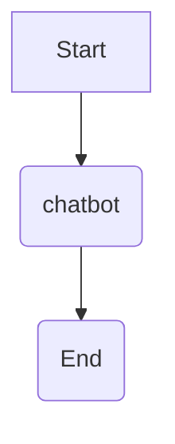

### Running the Chatbot

The following code runs the chatbot, taking user input and generating responses. `Sources: [https://github.com/langchain-ai/langgraph/blob/main/docs/docs/tutorials/get-started/1-build-basic-chatbot.md](Run the chatbot)`

:::python

```python
def stream_graph_updates(user_input: str):
    for event in graph.stream({"messages": [{"role": "user", "content": user_input}]}):
        for value in event.values():
            print("Assistant:", value["messages"][-1].content)


while True:
    try:
        user_input = input("User: ")
        if user_input.lower() in ["quit", "exit", "q"]:
            print("Goodbye!")
            break
        stream_graph_updates(user_input)
    except:
        # fallback if input() is not available
        user_input = "What do you know about LangGraph?"
        print("User: " + user_input)
        stream_graph_updates(user_input)
        break
```

:::

:::js

```typescript
import { HumanMessage } from "@langchain/core/messages";

async function streamGraphUpdates(userInput: string) {
  const stream = await graph.stream({
    messages: [new HumanMessage(userInput)],
  });

import * as readline from "node:readline/promises";
import { StateGraph, MessagesZodState, START, END } from "@langchain/langgraph";
import { ChatOpenAI } from "@langchain/openai";
import { z } from "zod";

const llm = new ChatOpenAI({ model: "gpt-4o-mini" });

const State = z.object({ messages: MessagesZodState.shape.messages });

const graph = new StateGraph(State)
  .addNode("chatbot", async (state: z.infer<typeof State>) => {
    return { messages: [await llm.invoke(state.messages)] };
  })
  .addEdge(START, "chatbot")
  .addEdge("chatbot", END)
  .compile();

async function generateText(content: string) {
  const stream = await graph.stream(
    { messages: [{ type: "human", content }] },
    { streamMode: "values" }
  );

  for await (const event of stream) {
    for (const value of Object.values(event)) {
      console.log(
        "Assistant:",
        value.messages[value.messages.length - 1].content
      );
    const lastMessage = event.messages.at(-1);
    if (lastMessage?.getType() === "ai") {
      console.log(`Assistant: ${lastMessage.text}`);
    }
  }
}

const prompt = readline.createInterface({
  input: process.stdin,
  output: process.stdout,
});

while (true) {
  const human = await prompt.question("User: ");
  if (["quit", "exit", "q"].includes(human.trim())) break;
  await generateText(human || "What do you know about LangGraph?");
}

prompt.close();
```

:::

## Conclusion

This guide demonstrated how to build a basic chatbot using LangGraph. The chatbot takes user input and generates responses using an LLM. The next step is to add a web search tool to expand the bot's knowledge. `Sources: [https://github.com/langchain-ai/langgraph/blob/main/docs/docs/tutorials/get-started/1-build-basic-chatbot.md](Next steps)`


---

<a name="graph-structure-and-components"></a>

<details>
<summary>Relevant source files</summary>

The following files were used as context for generating this wiki page:

- [https://github.com/langchain-ai/langgraph/blob/main/libs/langgraph/langgraph/graph/__init__.py](https://github.com/langchain-ai/langgraph/blob/main/libs/langgraph/langgraph/graph/__init__.py)
- [https://github.com/langchain-ai/langgraph/blob/main/libs/langgraph/langgraph/graph/state.py](https://github.com/langchain-ai/langgraph/blob/main/libs/langgraph/langgraph/graph/state.py)
- [https://github.com/langchain-ai/langgraph/blob/main/libs/langgraph/langgraph/channels/base.py](https://github.com/langchain-ai/langgraph/blob/main/libs/langgraph/langgraph/channels/base.py)
</details>

# Graph Structure and Components

This page details the structure and components of the graph implementation within the `langgraph` library. It focuses on the `StateGraph` and `CompiledStateGraph` classes, their interactions, and the underlying mechanisms for managing state and control flow within a graph-based execution environment. The page also covers the concept of channels for inter-node communication.

## StateGraph: Building the Graph

The `StateGraph` class serves as a builder for creating graphs where nodes communicate by reading from and writing to a shared state. It provides methods for adding nodes, edges, and conditional transitions, and for compiling the graph into an executable form. `StateGraph` is a generic class, parameterized by the state type (`StateT`), context type (`ContextT`), input type (`InputT`), and output type (`OutputT`). Sources: [https://github.com/langchain-ai/langgraph/blob/main/libs/langgraph/langgraph/graph/state.py](StateGraph class)

### Core Attributes

*   **`state_schema`**: Defines the schema for the shared state of the graph. Sources: [https://github.com/langchain-ai/langgraph/blob/main/libs/langgraph/langgraph/graph/state.py](StateGraph.__init__)
*   **`context_schema`**: Defines the schema for the runtime context, providing immutable data to nodes. Sources: [https://github.com/langchain-ai/langgraph/blob/main/libs/langgraph/langgraph/graph/state.py](StateGraph.__init__)
*   **`input_schema`**: Defines the schema for the input to the graph. Sources: [https://github.com/langchain-ai/langgraph/blob/main/libs/langgraph/langgraph/graph/state.py](StateGraph.__init__)
*   **`output_schema`**: Defines the schema for the output from the graph. Sources: [https://github.com/langchain-ai/langgraph/blob/main/libs/langgraph/langgraph/graph/state.py](StateGraph.__init__)
*   **`nodes`**: A dictionary storing the nodes of the graph, where keys are node names and values are `StateNodeSpec` objects. Sources: [https://github.com/langchain-ai/langgraph/blob/main/libs/langgraph/langgraph/graph/state.py](StateGraph.__init__)
*   **`edges`**: A set of tuples representing directed edges between nodes. Sources: [https://github.com/langchain-ai/langgraph/blob/main/libs/langgraph/langgraph/graph/state.py](StateGraph.__init__)
*   **`branches`**: A dictionary that stores conditional branches for each node. Sources: [https://github.com/langchain-ai/langgraph/blob/main/libs/langgraph/langgraph/graph/state.py](StateGraph.__init__)
*   **`channels`**: A dictionary that stores the channels used for communication between nodes. Sources: [https://github.com/langchain-ai/langgraph/blob/main/libs/langgraph/langgraph/graph/state.py](StateGraph.__init__)
*   **`managed`**: A dictionary that stores managed values. Sources: [https://github.com/langchain-ai/langgraph/blob/main/libs/langgraph/langgraph/graph/state.py](StateGraph.__init__)

### Key Methods

*   **`add_node(node, action, *, input_schema)`**: Adds a node to the graph. The `node` argument can be a string (node name) or a `StateNode` object. The `action` argument is the callable or runnable associated with the node. The `input_schema` defines the input schema for the node. Sources: [https://github.com/langchain-ai/langgraph/blob/main/libs/langgraph/langgraph/graph/state.py](StateGraph.add_node)
*   **`add_edge(start_key, end_key)`**: Adds a directed edge from the `start_key` node to the `end_key` node. Sources: [https://github.com/langchain-ai/langgraph/blob/main/libs/langgraph/langgraph/graph/state.py](StateGraph.add_edge)
*   **`add_conditional_edges(source, path, path_map)`**: Adds a conditional edge from the `source` node to other nodes, based on the result of the `path` callable. The `path_map` argument maps the possible return values of `path` to node names. Sources: [https://github.com/langchain-ai/langgraph/blob/main/libs/langgraph/langgraph/graph/state.py](StateGraph.add_conditional_edges)
*   **`compile(checkpointer, *, cache, store, interrupt_before, interrupt_after, debug, name)`**: Compiles the `StateGraph` into a `CompiledStateGraph` object, which can be executed. Sources: [https://github.com/langchain-ai/langgraph/blob/main/libs/langgraph/langgraph/graph/state.py](StateGraph.compile)

### StateNodeSpec

The `StateNodeSpec` class encapsulates the properties of a node within the `StateGraph`. It includes the runnable, metadata, input schema, retry policy, cache policy, and destination nodes. Sources: [https://github.com/langchain-ai/langgraph/blob/main/libs/langgraph/langgraph/graph/state.py](StateGraph.add_node)

### Example

```python
from typing_extensions import TypedDict

from langchain_core.runnables import RunnableConfig
from langgraph.graph import START, StateGraph


class State(TypedDict):
    x: int


def my_node(state: State, config: RunnableConfig) -> State:
    return {"x": state["x"] + 1}


builder = StateGraph(State)
builder.add_node(my_node)  # node name will be 'my_node'
builder.add_edge(START, "my_node")
graph = builder.compile()
graph.invoke({"x": 1})
# {'x': 2}
```

### Graph Building Flow

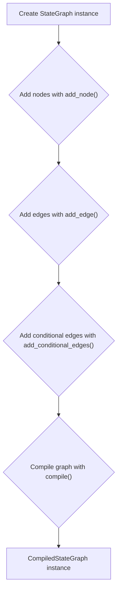

## CompiledStateGraph: Executing the Graph

The `CompiledStateGraph` class represents the compiled and executable form of a `StateGraph`. It inherits from `Pregel` and implements the `Runnable` interface, allowing it to be invoked, streamed, and run asynchronously. Sources: [https://github.com/langchain-ai/langgraph/blob/main/libs/langgraph/langgraph/graph/state.py](CompiledStateGraph class)

### Key Attributes

*   **`builder`**: A reference to the original `StateGraph` instance used to create the compiled graph. Sources: [https://github.com/langchain-ai/langgraph/blob/main/libs/langgraph/langgraph/graph/state.py](CompiledStateGraph.__init__)
*   **`schema_to_mapper`**: A dictionary mapping schema types to functions that coerce the state dictionary to the schema class. Sources: [https://github.com/langchain-ai/langgraph/blob/main/libs/langgraph/langgraph/graph/state.py](CompiledStateGraph.__init__)
*   **`nodes`**: A dictionary of `PregelNode` objects, representing the nodes in the compiled graph. Sources: [https://github.com/langchain-ai/langgraph/blob/main/libs/langgraph/langgraph/graph/state.py](CompiledStateGraph.attach_node)
*   **`channels`**: A dictionary of `BaseChannel` objects, representing the communication channels between nodes. Sources: [https://github.com/langchain-ai/langgraph/blob/main/libs/langgraph/langgraph/graph/state.py](CompiledStateGraph.attach_node)

### Key Methods

*   **`attach_node(key, node)`**: Attaches a node to the compiled graph, creating a `PregelNode` instance. Sources: [https://github.com/langchain-ai/langgraph/blob/main/libs/langgraph/langgraph/graph/state.py](CompiledStateGraph.attach_node)
*   **`attach_edge(starts, end)`**: Attaches an edge to the compiled graph, configuring the communication channels between the `starts` and `end` nodes. Sources: [https://github.com/langchain-ai/langgraph/blob/main/libs/langgraph/langgraph/graph/state.py](CompiledStateGraph.attach_edge)
*   **`attach_branch(start, name, branch)`**: Attaches a conditional branch to the compiled graph, configuring the conditional transitions from the `start` node. Sources: [https://github.com/langchain-ai/langgraph/blob/main/libs/langgraph/langgraph/graph/state.py](CompiledStateGraph.attach_branch)

### Data Flow

The `CompiledStateGraph` uses channels to manage the flow of data between nodes. Each node reads from its input channels, performs its operation, and writes to its output channels. The `Pregel` class handles the execution of the graph, iterating over the nodes and updating the channels until the graph reaches a terminal state.

### Channel Types

The `langgraph` library provides several channel types for managing state and control flow:

*   **`BaseChannel`**: Abstract base class for all channels. Sources: [https://github.com/langchain-ai/langgraph/blob/main/libs/langgraph/langgraph/channels/base.py](BaseChannel class)
    *   `ValueType`: The type of the value stored in the channel. Sources: [https://github.com/langchain-ai/langgraph/blob/main/libs/langgraph/langgraph/channels/base.py](BaseChannel.ValueType)
    *   `UpdateType`: The type of the update received by the channel. Sources: [https://github.com/langchain-ai/langgraph/blob/main/libs/langgraph/langgraph/channels/base.py](BaseChannel.UpdateType)
    *   `get()`: Returns the current value of the channel. Sources: [https://github.com/langchain-ai/langgraph/blob/main/libs/langgraph/langgraph/channels/base.py](BaseChannel.get)
    *   `update(values)`: Updates the channel's value with the given sequence of updates. Sources: [https://github.com/langchain-ai/langgraph/blob/main/libs/langgraph/langgraph/channels/base.py](BaseChannel.update)
*   **`EphemeralValue`**: A channel that stores a single value that is consumed after being read. Sources: [https://github.com/langchain-ai/langgraph/blob/main/libs/langgraph/langgraph/graph/state.py](CompiledStateGraph.attach_node)
*   **`LastValue`**: A channel that stores the last value written to it. Sources: [https://github.com/langchain-ai/langgraph/blob/main/libs/langgraph/langgraph/graph/state.py](CompiledStateGraph.attach_node)
*   **`LastValueAfterFinish`**: A channel that stores the last value written to it and persists after the graph finishes executing. Sources: [https://github.com/langchain-ai/langgraph/blob/main/libs/langgraph/langgraph/graph/state.py](CompiledStateGraph.attach_node)
*   **`NamedBarrierValue`**: A channel that acts as a barrier, waiting for all specified nodes to complete before releasing its value. Sources: [https://github.com/langchain-ai/langgraph/blob/main/libs/langgraph/langgraph/graph/state.py](CompiledStateGraph.attach_edge)
*   **`NamedBarrierValueAfterFinish`**: A channel that acts as a barrier and persists after the graph finishes executing. Sources: [https://github.com/langchain-ai/langgraph/blob/main/libs/langgraph/langgraph/graph/state.py](CompiledStateGraph.attach_edge)
*   **`BinaryOperatorAggregate`**: A channel that aggregates values using a binary operator. Sources: [https://github.com/langchain-ai/langgraph/blob/main/libs/langgraph/langgraph/graph/state.py](CompiledStateGraph.attach_node)

### Channel Communication

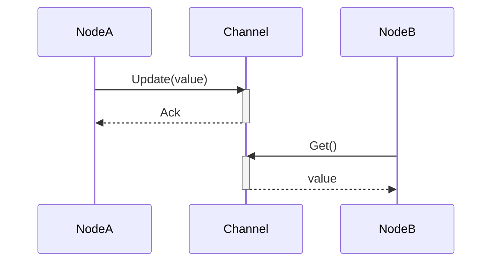

## Conclusion

The `StateGraph` and `CompiledStateGraph` classes provide a powerful framework for building and executing graph-based applications. By using shared state and channels for communication, these classes enable complex workflows to be defined and executed in a modular and scalable manner. The `StateGraph` facilitates the construction of the graph, while the `CompiledStateGraph` handles the execution, leveraging channels for inter-node communication and state management.


---

<a name="durable-execution-and-checkpointing"></a>

<details>
<summary>Relevant source files</summary>

The following files were used as context for generating this wiki page:

- [https://github.com/langchain-ai/langgraph/blob/main/docs/docs/concepts/durable_execution.md](https://github.com/langchain-ai/langgraph/blob/main/docs/docs/concepts/durable_execution.md)
- [https://github.com/langchain-ai/langgraph/blob/main/libs/checkpoint/langgraph/checkpoint/base/__init__.py](https://github.com/langchain-ai/langgraph/blob/main/libs/checkpoint/langgraph/checkpoint/base/__init__.py)
- [https://github.com/langchain-ai/langgraph/blob/main/libs/checkpoint-postgres/langgraph/checkpoint/postgres/base.py](https://github.com/langchain-ai/langgraph/blob/main/libs/checkpoint-postgres/langgraph/checkpoint/postgres/base.py)
</details>

# Durable Execution and Checkpointing

Durable execution is a technique that allows a process or workflow to save its progress at specific points, enabling it to pause and resume later from where it left off. This is particularly useful in scenarios involving human interaction or long-running tasks that may encounter interruptions. LangGraph provides built-in persistence to support durable execution, ensuring that the state of each execution step is saved to a durable store. Sources: [https://github.com/langchain-ai/langgraph/blob/main/docs/docs/concepts/durable_execution.md](https://github.com/langchain-ai/langgraph/blob/main/docs/docs/concepts/durable_execution.md)

This wiki page provides a comprehensive overview of durable execution and checkpointing in LangGraph, covering the requirements, determinism, durability modes, and how to resume workflows. It also explains how to use tasks within nodes to ensure proper checkpointing and consistent replay.

## Requirements for Durable Execution

To enable durable execution in LangGraph, the following requirements must be met:

1.  **Enable Persistence:** A [checkpointer](./persistence.md#checkpointer-libraries) must be specified to save the workflow's progress. Sources: [https://github.com/langchain-ai/langgraph/blob/main/docs/docs/concepts/durable_execution.md](https://github.com/langchain-ai/langgraph/blob/main/docs/docs/concepts/durable_execution.md)
2.  **Specify Thread Identifier:** A [thread identifier](./persistence.md#threads) must be provided when executing a workflow to track the execution history of a specific instance. Sources: [https://github.com/langchain-ai/langgraph/blob/main/docs/docs/concepts/durable_execution.md](https://github.com/langchain-ai/langgraph/blob/main/docs/docs/concepts/durable_execution.md)
3.  **Wrap Non-Deterministic Operations in Tasks:** Non-deterministic operations (e.g., random number generation) or operations with side effects (e.g., API calls, file writes) should be wrapped inside `@[tasks][task]` to prevent them from being repeated when a workflow is resumed. Sources: [https://github.com/langchain-ai/langgraph/blob/main/docs/docs/concepts/durable_execution.md](https://github.com/langchain-ai/langgraph/blob/main/docs/docs/concepts/durable_execution.md)

## Determinism and Consistent Replay

When a workflow is resumed, it replays all steps from an appropriate [starting point](#starting-points-for-resuming-workflows) until it reaches the point where it was stopped. Therefore, it's crucial to ensure that the workflow is deterministic and can be consistently replayed. Sources: [https://github.com/langchain-ai/langgraph/blob/main/docs/docs/concepts/durable_execution.md](https://github.com/langchain-ai/langgraph/blob/main/docs/docs/concepts/durable_execution.md)

To achieve determinism and consistent replay, follow these guidelines:

-   **Avoid Repeating Work:** Wrap operations with side effects in separate **tasks** to prevent them from being repeated upon resumption. Sources: [https://github.com/langchain-ai/langgraph/blob/main/docs/docs/concepts/durable_execution.md](https://github.com/langchain-ai/langgraph/blob/main/docs/docs/concepts/durable_execution.md)
-   **Encapsulate Non-Deterministic Operations:** Wrap any code that might yield non-deterministic results inside **tasks** or **nodes**. Sources: [https://github.com/langchain-ai/langgraph/blob/main/docs/docs/concepts/durable_execution.md](https://github.com/langchain-ai/langgraph/blob/main/docs/docs/concepts/durable_execution.md)
-   **Use Idempotent Operations:** Ensure that side effects are idempotent, meaning that retrying an operation has the same effect as executing it once. This is especially important for data writes. Sources: [https://github.com/langchain-ai/langgraph/blob/main/docs/docs/concepts/durable_execution.md](https://github.com/langchain-ai/langgraph/blob/main/docs/docs/concepts/durable_execution.md)

## Durability Modes

LangGraph supports three durability modes that allow you to balance performance and data consistency:

-   `"exit"`: Changes are persisted only when graph execution completes. Sources: [https://github.com/langchain-ai/langgraph/blob/main/docs/docs/concepts/durable_execution.md](https://github.com/langchain-ai/langgraph/blob/main/docs/docs/concepts/durable_execution.md)
-   `"async"`: Changes are persisted asynchronously while the next step executes. Sources: [https://github.com/langchain-ai/langgraph/blob/main/docs/docs/concepts/durable_execution.md](https://github.com/langchain-ai/langgraph/blob/main/docs/docs/concepts/durable_execution.md)
-   `"sync"`: Changes are persisted synchronously before the next step starts. Sources: [https://github.com/langchain-ai/langgraph/blob/main/docs/docs/concepts/durable_execution.md](https://github.com/langchain-ai/langgraph/blob/main/docs/docs/concepts/durable_execution.md)

A higher durability mode adds more overhead to the workflow execution.

| Durability Mode | Description | Performance | Data Consistency |
|---|---|---|---|
| `"exit"` | Changes persisted only on completion | Best | Least |
| `"async"` | Changes persisted asynchronously | Good | Good |
| `"sync"` | Changes persisted synchronously | Lower | High |

## Using tasks in nodes

If a [node](./low_level.md#nodes) contains multiple operations, converting each operation into a **task** can simplify the process compared to refactoring the operations into individual nodes. Sources: [https://github.com/langchain-ai/langgraph/blob/main/docs/docs/concepts/durable_execution.md](https://github.com/langchain-ai/langgraph/blob/main/docs/docs/concepts/durable_execution.md)

The following example demonstrates how to use tasks within nodes:

:::python
=== "Original"

    ```python
    from typing import NotRequired
    from typing_extensions import TypedDict
    import uuid

    from langgraph.checkpoint.memory import InMemorySaver
    from langgraph.graph import StateGraph, START, END
    import requests

    # Define a TypedDict to represent the state
    class State(TypedDict):
        url: str
        result: NotRequired[str]

    def call_api(state: State):
        """Example node that makes an API request."""
        # highlight-next-line
        result = requests.get(state['url']).text[:100]  # Side-effect
        return {
            "result": result
        }

    # Create a StateGraph builder and add a node for the call_api function
    builder = StateGraph(State)
    builder.add_node("call_api", call_api)

    # Connect the start and end nodes to the call_api node
    builder.add_edge(START, "call_api")
    builder.add_edge("call_api", END)

    # Specify a checkpointer
    checkpointer = InMemorySaver()

    # Compile the graph with the checkpointer
    graph = builder.compile(checkpointer=checkpointer)

    # Define a config with a thread ID.
    thread_id = uuid.uuid4()
    config = {"configurable": {"thread_id": thread_id}}

    # Invoke the graph
    graph.invoke({"url": "https://www.example.com"}, config)
    ```

=== "With task"

    ```python
    from typing import NotRequired
    from typing_extensions import TypedDict
    import uuid

    from langgraph.checkpoint.memory import InMemorySaver
    from langgraph.func import task
    from langgraph.graph import StateGraph, START, END
    import requests

    # Define a TypedDict to represent the state
    class State(TypedDict):
        urls: list[str]
        result: NotRequired[list[str]]


    @task
    def _make_request(url: str):
        """Make a request."""
        # highlight-next-line
        return requests.get(url).text[:100]

    def call_api(state: State):
        """Example node that makes an API request."""
        # highlight-next-line
        requests = [_make_request(url) for url in state['urls']]
        results = [request.result() for request in requests]
        return {
            "results": results
        }

    # Create a StateGraph builder and add a node for the call_api function
    builder = StateGraph(State)
    builder.add_node("call_api", call_api)

    # Connect the start and end nodes to the call_api node
    builder.add_edge(START, "call_api")
    builder.add_edge("call_api", END)

    # Specify a checkpointer
    checkpointer = InMemorySaver()

    # Compile the graph with the checkpointer
    graph = builder.compile(checkpointer=checkpointer)

    # Define a config with a thread ID.
    thread_id = uuid.uuid4()
    config = {"configurable": {"thread_id": thread_id}}

    # Invoke the graph
    graph.invoke({"urls": ["https://www.example.com"]}, config)
    ```

:::

:::js
=== "Original"

    ```typescript
    import { StateGraph, START, END } from "@langchain/langgraph";
    import { MemorySaver } from "@langchain/langgraph";
    import { v4 as uuidv4 } from "uuid";
    import { z } from "zod";

    // Define a Zod schema to represent the state
    const State = z.object({
      url: z.string(),
      result: z.string().optional(),
    });

    const callApi = async (state: z.infer<typeof State>) => {
      // highlight-next-line
      const response = await fetch(state.url);
      const text = await response.text();
      const result = text.slice(0, 100); // Side-effect
      return {
        result,
      };
    };

    // Create a StateGraph builder and add a node for the callApi function
    const builder = new StateGraph(State)
      .addNode("callApi", callApi)
      .addEdge(START, "callApi")
      .addEdge("callApi", END);

    // Specify a checkpointer
    const checkpointer = new MemorySaver();

    // Compile the graph with the checkpointer
    const graph = builder.compile({ checkpointer });

    // Define a config with a thread ID.
    const threadId = uuidv4();
    const config = { configurable: { thread_id: threadId } };

    // Invoke the graph
    await graph.invoke({ url: "https://www.example.com" }, config);
    ```

=== "With task"

    ```typescript
    import { StateGraph, START, END } from "@langchain/langgraph";
    import { MemorySaver } from "@langchain/langgraph";
    import { task } from "@langchain/langgraph";
    import { v4 as uuidv4 } from "uuid";
    import { z } from "zod";

    // Define a Zod schema to represent the state
    const State = z.object({
      urls: z.array(z.string()),
      results: z.array(z.string()).optional(),
    });

    const makeRequest = task("makeRequest", async (url: string) => {
      // highlight-next-line
      const response = await fetch(url);
      const text = await response.text();
      return text.slice(0, 100);
    });

    const callApi = async (state: z.infer<typeof State>) => {
      // highlight-next-line
      const requests = state.urls.map((url) => makeRequest(url));
      const results = await Promise.all(requests);
      return {
        results,
      };
    };

    // Create a StateGraph builder and add a node for the callApi function
    const builder = new StateGraph(State)
      .addNode("callApi", callApi)
      .addEdge(START, "callApi")
      .addEdge("callApi", END);

    // Specify a checkpointer
    const checkpointer = new MemorySaver();

    // Compile the graph with the checkpointer
    const graph = builder.compile({ checkpointer });

    // Define a config with a thread ID.
    const threadId = uuidv4();
    const config = { configurable: { thread_id: threadId } };

    // Invoke the graph
    await graph.invoke({ urls: ["https://www.example.com"] }, config);
    ```

:::

## Resuming Workflows

Durable execution allows workflows to be resumed in the following scenarios:

-   **Pausing and Resuming Workflows:** Use the @[interrupt][interrupt] function to pause a workflow and the @[Command] primitive to resume it. Sources: [https://github.com/langchain-ai/langgraph/blob/main/docs/docs/concepts/durable_execution.md](https://github.com/langchain-ai/langgraph/blob/main/docs/docs/concepts/durable_execution.md)
-   **Recovering from Failures:** Automatically resume workflows from the last successful checkpoint after an exception. Sources: [https://github.com/langchain-ai/langgraph/blob/main/docs/docs/concepts/durable_execution.md](https://github.com/langchain-ai/langgraph/blob/main/docs/docs/concepts/durable_execution.md)

## Starting Points for Resuming Workflows

The starting point for resuming a workflow depends on the API used:

-   **StateGraph (Graph API):** The starting point is the beginning of the [**node**](./low_level.md#nodes) where execution stopped. Sources: [https://github.com/langchain-ai/langgraph/blob/main/docs/docs/concepts/durable_execution.md](https://github.com/langchain-ai/langgraph/blob/main/docs/docs/concepts/durable_execution.md)
-   **Functional API:** The starting point is the beginning of the [**entrypoint**](./functional_api.md#entrypoint) where execution stopped. Sources: [https://github.com/langchain-ai/langgraph/blob/main/docs/docs/concepts/durable_execution.md](https://github.com/langchain-ai/langgraph/blob/main/docs/docs/concepts/durable_execution.md)
-   **Subgraphs:** If a subgraph call is made inside a node, the starting point will be the **parent** node that called the subgraph that was halted. Inside the subgraph, the starting point will be the specific [**node**](./low_level.md#nodes) where execution stopped. Sources: [https://github.com/langchain-ai/langgraph/blob/main/docs/docs/concepts/durable_execution.md](https://github.com/langchain-ai/langgraph/blob/main/docs/docs/concepts/durable_execution.md)

## Checkpoint Saver

The `BaseCheckpointSaver` class provides the foundation for creating graph checkpointers in LangGraph. Checkpointers enable LangGraph agents to persist their state within and across multiple interactions. Sources: [https://github.com/langchain-ai/langgraph/blob/main/libs/checkpoint/langgraph/checkpoint/base/__init__.py](https://github.com/langchain-ai/langgraph/blob/main/libs/checkpoint/langgraph/checkpoint/base/__init__.py)

### Key Components of Checkpoint Saver

*   **Serializer:** The `serde` attribute, an instance of `SerializerProtocol`, handles the encoding and decoding of checkpoints. The default serializer is `JsonPlusSerializer`. Sources: [https://github.com/langchain-ai/langgraph/blob/main/libs/checkpoint/langgraph/checkpoint/base/__init__.py](https://github.com/langchain-ai/langgraph/blob/main/libs/checkpoint/langgraph/checkpoint/base/__init__.py)
*   **Configuration:** The `config_specs` property defines the configuration options for the checkpoint saver. Sources: [https://github.com/langchain-ai/langgraph/blob/main/libs/checkpoint/langgraph/checkpoint/base/__init__.py](https://github.com/langchain-ai/langgraph/blob/main/libs/checkpoint/langgraph/checkpoint/base/__init__.py)

### Key Methods of Checkpoint Saver

| Method | Description |
|---|---|
| `get(config: RunnableConfig)` | Fetches a checkpoint using the given configuration. |
| `get_tuple(config: RunnableConfig)` | Fetches a checkpoint tuple using the given configuration. |
| `list(config: RunnableConfig \| None, *, filter: dict[str, Any] \| None = None, before: RunnableConfig \| None = None, limit: int \| None = None)` | Lists checkpoints that match the given criteria. |
| `put(config: RunnableConfig, checkpoint: Checkpoint, metadata: CheckpointMetadata, new_versions: ChannelVersions)` | Stores a checkpoint with its configuration and metadata. |
| `put_writes(config: RunnableConfig, writes: Sequence[tuple[str, Any]], task_id: str, task_path: str = "")` | Stores intermediate writes linked to a checkpoint. |
| `delete_thread(thread_id: str)` | Deletes all checkpoints and writes associated with a specific thread ID. |
| `aget(config: RunnableConfig)` | Asynchronously fetches a checkpoint using the given configuration. |
| `aget_tuple(config: RunnableConfig)` | Asynchronously fetches a checkpoint tuple using the given configuration. |
| `alist(config: RunnableConfig \| None, *, filter: dict[str, Any] \| None = None, before: RunnableConfig \| None = None, limit: int \| None = None)` | Asynchronously lists checkpoints that match the given criteria. |
| `aput(config: RunnableConfig, checkpoint: Checkpoint, metadata: CheckpointMetadata, new_versions: ChannelVersions)` | Asynchronously stores a checkpoint with its configuration and metadata. |
| `aput_writes(config: RunnableConfig, writes: Sequence[tuple[str, Any]], task_id: str, task_path: str = "")` | Asynchronously stores intermediate writes linked to a checkpoint. |
| `adelete_thread(thread_id: str)` | Asynchronously deletes all checkpoints and writes associated with a specific thread ID. |
| `get_next_version(self, current: V \| None, channel: None)` | Generates the next version ID for a channel. |

## Postgres Checkpoint Saver

The `BasePostgresSaver` class extends `BaseCheckpointSaver` to provide checkpointing functionality using a PostgreSQL database. Sources: [https://github.com/langchain-ai/langgraph/blob/main/libs/checkpoint-postgres/langgraph/checkpoint/postgres/base.py](https://github.com/langchain-ai/langgraph/blob/main/libs/checkpoint-postgres/langgraph/checkpoint/postgres/base.py)

### Key Features of Postgres Checkpoint Saver

*   **Database Migrations:** The `MIGRATIONS` list contains SQL statements for creating and updating the database schema. Sources: [https://github.com/langchain-ai/langgraph/blob/main/libs/checkpoint-postgres/langgraph/checkpoint/postgres/base.py](https://github.com/langchain-ai/langgraph/blob/main/libs/checkpoint-postgres/langgraph/checkpoint/postgres/base.py)
*   **SQL Queries:** The class defines various SQL queries for selecting, inserting, and updating checkpoint data in the database. Sources: [https://github.com/langchain-ai/langgraph/blob/main/libs/checkpoint-postgres/langgraph/checkpoint/postgres/base.py](https://github.com/langchain-ai/langgraph/blob/main/libs/checkpoint-postgres/langgraph/checkpoint/postgres/base.py)
*   **Blob Handling:** The class provides methods for loading and dumping binary data (blobs) associated with checkpoints. Sources: [https://github.com/langchain-ai/langgraph/blob/main/libs/checkpoint-postgres/langgraph/checkpoint/postgres/base.py](https://github.com/langchain-ai/langgraph/blob/main/libs/checkpoint-postgres/langgraph/checkpoint/postgres/base.py)

### Data Flow Diagram

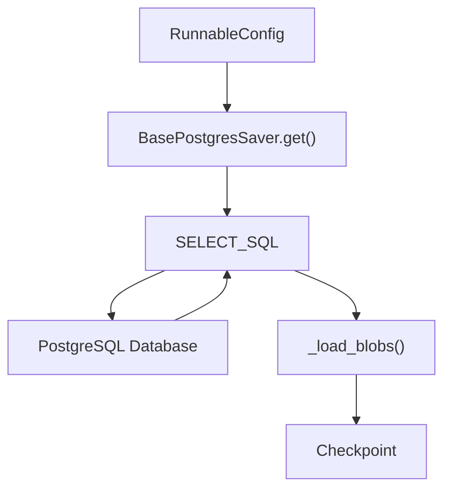

This diagram illustrates the data flow when fetching a checkpoint using the `BasePostgresSaver`. The `RunnableConfig` is used to construct a SQL query (`SELECT_SQL`), which retrieves data from the PostgreSQL database. The retrieved data is then processed by `_load_blobs()` to reconstruct the `Checkpoint` object.

## Conclusion

Durable execution and checkpointing are essential for building robust and resilient LangGraph workflows. By enabling persistence, ensuring determinism, and using appropriate durability modes, you can create workflows that can be paused, resumed, and recovered from failures. The `BaseCheckpointSaver` and `BasePostgresSaver` classes provide the necessary tools for implementing checkpointing in your LangGraph applications.


---

<a name="pregel-algorithm-implementation"></a>

<details>
<summary>Relevant source files</summary>

The following files were used as context for generating this wiki page:

- [https://github.com/langchain-ai/langgraph/blob/main/libs/langgraph/langgraph/pregel/__init__.py](https://github.com/langchain-ai/langgraph/blob/main/libs/langgraph/langgraph/pregel/__init__.py)
- [https://github.com/langchain-ai/langgraph/blob/main/libs/langgraph/langgraph/pregel/_algo.py](https://github.com/langchain-ai/langgraph/blob/main/libs/langgraph/langgraph/pregel/_algo.py)
- [https://github.com/langchain-ai/langgraph/blob/main/docs/docs/concepts/pregel.md](https://github.com/langchain-ai/langgraph/blob/main/docs/docs/concepts/pregel.md)
</details>

# Pregel Algorithm Implementation

The Pregel algorithm implementation in LangGraph provides a runtime environment for managing the execution of graph-based applications. It combines actors (represented as `PregelNode` instances) and channels for communication, organizing execution into steps that follow the Bulk Synchronous Parallel (BSP) model. This approach enables efficient, large-scale parallel computation within LangGraph.

This wiki page details the architecture, key components, and execution flow of the Pregel implementation, including the roles of actors, channels, and the step-by-step process of planning, execution, and updating within the Pregel runtime. It also covers the high-level APIs, such as `StateGraph` and the functional API, that simplify the creation of Pregel applications.

## Overview of the Pregel Runtime

The Pregel runtime in LangGraph manages the execution of LangGraph applications by combining actors and channels. Actors, implemented as `PregelNode` instances, read data from and write data to channels. The runtime organizes the application's execution into multiple steps, adhering to the Pregel algorithm's Bulk Synchronous Parallel (BSP) model. Sources: [https://github.com/langchain-ai/langgraph/blob/main/docs/docs/concepts/pregel.md](lines 17-21)

Each step in the Pregel execution consists of three distinct phases:

1.  **Plan:** Determines which actors to execute in the current step based on channel subscriptions and updates. Sources: [https://github.com/langchain-ai/langgraph/blob/main/docs/docs/concepts/pregel.md](lines 23-25)
2.  **Execution:** Executes the selected actors in parallel until completion, failure, or timeout. Channel updates are not visible to actors until the next step. Sources: [https://github.com/langchain-ai/langgraph/blob/main/docs/docs/concepts/pregel.md](lines 25-27)
3.  **Update:** Updates the channels with the values written by the actors during the execution phase. Sources: [https://github.com/langchain-ai/langgraph/blob/main/docs/docs/concepts/pregel.md](lines 27-28)

This process repeats until no actors are selected for execution or a maximum number of steps is reached. Sources: [https://github.com/langchain-ai/langgraph/blob/main/docs/docs/concepts/pregel.md](lines 28-29)

## Key Components

### Pregel Class

The `Pregel` class is the core runtime component that manages the execution of LangGraph applications. It orchestrates the planning, execution, and updating phases of each step in the Pregel algorithm. Sources: [https://github.com/langchain-ai/langgraph/blob/main/libs/langgraph/langgraph/pregel/__init__.py](Pregel)

### PregelNode (Actors)

`PregelNode` instances represent actors within the Pregel runtime. Each node subscribes to specific channels, reads data from them, and writes data to other channels. `PregelNode` implements LangChain's `Runnable` interface. Sources: [https://github.com/langchain-ai/langgraph/blob/main/docs/docs/concepts/pregel.md](lines 31-33)

### Channels

Channels facilitate communication between `PregelNode` instances. Each channel has a value type, an update type, and an update function. LangGraph provides several built-in channel types: Sources: [https://github.com/langchain-ai/langgraph/blob/main/docs/docs/concepts/pregel.md](lines 35-37)

*   **LastValue:** Stores the last value sent to the channel. Sources: [https://github.com/langchain-ai/langgraph/blob/main/docs/docs/concepts/pregel.md](lines 39-40)
*   **Topic:** A PubSub topic for sending multiple values between actors. Sources: [https://github.com/langchain-ai/langgraph/blob/main/docs/docs/concepts/pregel.md](lines 40-42)
*   **BinaryOperatorAggregate:** Stores a persistent value updated by applying a binary operator. Sources: [https://github.com/langchain-ai/langgraph/blob/main/docs/docs/concepts/pregel.md](lines 42-44)

### NodeBuilder

The `NodeBuilder` class provides a convenient way to construct `PregelNode` instances. It allows specifying the channels to subscribe to, the function to execute, and the channels to write to. Sources: [https://github.com/langchain-ai/langgraph/blob/main/libs/langgraph/langgraph/pregel/__init__.py](NodeBuilder)

## Core Algorithm Logic

The `_algo.py` file contains the core logic for the Pregel algorithm implementation. It includes functions for preparing tasks, applying writes, and managing the execution flow.

### `prepare_next_tasks` Function

This function prepares the set of tasks that will make up the next Pregel step. It determines which nodes should be executed based on channel updates and subscriptions. Sources: [https://github.com/langchain-ai/langgraph/blob/main/libs/langgraph/langgraph/pregel/_algo.py](prepare_next_tasks)

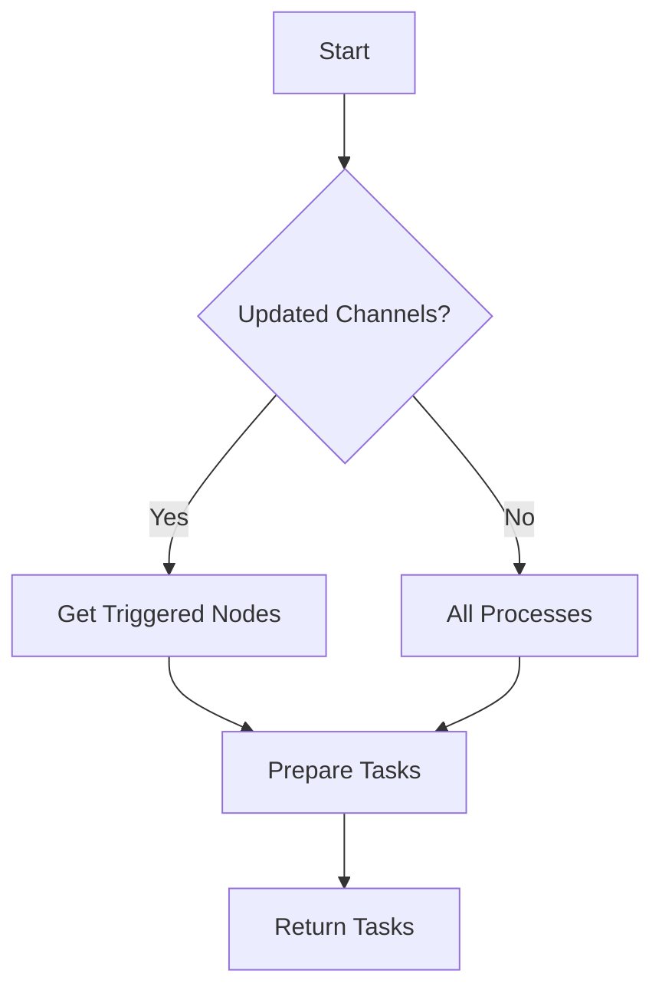

### `apply_writes` Function

This function applies the writes from a set of tasks to the checkpoint and channels. It updates the channel versions and manages the state of the Pregel execution. Sources: [https://github.com/langchain-ai/langgraph/blob/main/libs/langgraph/langgraph/pregel/_algo.py](apply_writes)

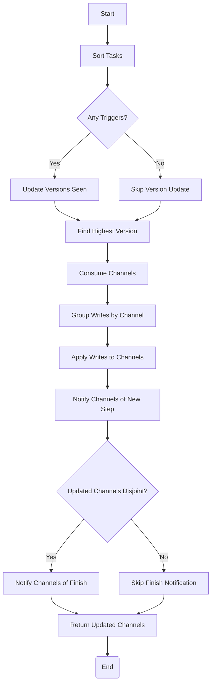

### Data Structures

| Data Structure | Description |
|---|---|
| `Checkpoint` | Represents the state of the Pregel execution at a given step. |
| `PregelTask` | Represents a task to be executed by a `PregelNode`. |
| `PregelExecutableTask` | Represents a task ready for execution, containing the node, input, and configuration. |
| `Send` | Represents a message to be sent to another node. |
| `ChannelVersions` | A dictionary mapping channel names to their current versions. |

## High-Level APIs

LangGraph provides high-level APIs, including `StateGraph` and the functional API, to simplify the creation of Pregel applications. Sources: [https://github.com/langchain-ai/langgraph/blob/main/docs/docs/concepts/pregel.md](lines 188-190)

### StateGraph (Graph API)

The `StateGraph` API allows defining a graph of nodes and edges. Compiling the graph automatically creates the Pregel application. Sources: [https://github.com/langchain-ai/langgraph/blob/main/docs/docs/concepts/pregel.md](lines 192-195)

### Functional API

The functional API uses the `@entrypoint` decorator to create a Pregel application from a function. Sources: [https://github.com/langchain-ai/langgraph/blob/main/docs/docs/concepts/pregel.md](lines 288-290)

## Conclusion

The Pregel algorithm implementation in LangGraph provides a robust and efficient runtime environment for graph-based applications. By combining actors and channels and organizing execution into synchronized steps, it enables large-scale parallel computation. The high-level APIs further simplify the creation and management of Pregel applications, making it easier to build complex workflows within LangGraph.


---

<a name="configuration-and-customization"></a>

<details>
<summary>Relevant source files</summary>

The following files were used as context for generating this wiki page:

- [https://github.com/langchain-ai/langgraph/blob/main/libs/langgraph/langgraph/config.py](https://github.com/langchain-ai/langgraph/blob/main/libs/langgraph/langgraph/config.py)
- [https://github.com/langchain-ai/langgraph/blob/main/docs/docs/concepts/langgraph_cli.md](https://github.com/langchain-ai/langgraph/blob/main/docs/docs/concepts/langgraph_cli.md)
- [https://github.com/langchain-ai/langgraph/blob/main/libs/cli/langgraph_cli/config.py](https://github://github.com/langchain-ai/langgraph/blob/main/libs/cli/langgraph_cli/config.py)
</details>

# Configuration and Customization

This page provides an overview of the configuration and customization options available within the LangGraph framework. It covers both runtime configuration within LangGraph graphs and the configuration of the LangGraph CLI for building and deploying LangGraph applications. The goal is to provide a comprehensive guide to tailoring LangGraph to specific needs, whether it's adjusting graph behavior at runtime or customizing the deployment environment.

This includes details on accessing runtime configurations, utilizing the LangGraph CLI, and understanding the various configuration parameters available for customizing LangGraph applications.

## LangGraph Runtime Configuration

LangGraph provides mechanisms to access configuration settings at runtime within graph nodes and tasks. This allows for dynamic behavior and customization based on the environment and context.

### Accessing Configuration

The `langgraph.config` module provides functions to access runtime configuration:

*   **`get_config()`**: Retrieves the `RunnableConfig` associated with the current runnable context. This configuration can contain settings relevant to the execution of the graph. `Sources: [https://github.com/langchain-ai/langgraph/blob/main/libs/langgraph/langgraph/config.py](get_config)`
*   **`get_store()`**: Accesses the LangGraph store from within a graph node or entrypoint task. This store can be used to persist and retrieve data during graph execution. `Sources: [https://github.com/langchain-ai/langgraph/blob/main/libs/langgraph/langgraph/config.py](get_store)`
*   **`get_stream_writer()`**: Retrieves the `StreamWriter` instance, allowing graph nodes and tasks to write data to a stream during execution. `Sources: [https://github.com/langchain-ai/langgraph/blob/main/libs/langgraph/langgraph/config.py](get_stream_writer)`

**Example:**

```python
from langgraph.config import get_store

def my_node(state):
    my_store = get_store()
    # ... use my_store ...
```

### Configuration Limitations

*   **Async Context (Python < 3.11):** In asynchronous environments with Python versions older than 3.11, `get_store()` and `get_stream_writer()` may not function correctly due to limitations with `contextvar` propagation. `Sources: [https://github.com/langchain-ai/langgraph/blob/main/libs/langgraph/langgraph/config.py](get_store)`

## LangGraph CLI Configuration

The LangGraph CLI provides tools for building, developing, and deploying LangGraph applications. It uses a configuration file (typically `langgraph.json`) to define the structure and dependencies of the application. `Sources: [https://github.com/langchain-ai/langgraph/blob/main/libs/cli/langgraph_cli/config.py](validate_config_file)`

### Installation

The LangGraph CLI can be installed using pip or Homebrew: `Sources: [https://github.com/langchain-ai/langgraph/blob/main/docs/docs/concepts/langgraph_cli.md](Installation)`

```bash
pip install langgraph-cli
```

or

```bash
brew install langgraph-cli
```

For JavaScript, use npm, yarn, pnpm, or bun: `Sources: [https://github.com/langchain-ai/langgraph/blob/main/docs/docs/concepts/langgraph_cli.md](Installation)`

```bash
npm install @langchain/langgraph-cli
```

### CLI Commands

The LangGraph CLI offers several commands for managing LangGraph applications: `Sources: [https://github.com/langchain-ai/langgraph/blob/main/docs/docs/concepts/langgraph_cli.md](Commands)`

| Command | Description |
|---|---|---|
| `langgraph build` | Builds a Docker image for deployment. |
| `langgraph dev` | Starts a development server. |
| `langgraph dockerfile` | Generates a Dockerfile for custom deployments. |
| `langgraph up` | Starts a local instance of the LangGraph API server in a Docker container. |

### Configuration File (langgraph.json)

The `langgraph.json` file defines the configuration for the LangGraph application. It includes settings for:

*   **Graphs:** Specifies the graph definitions, including the path to the graph file and the attribute containing the graph object. `Sources: [https://github.com/langchain-ai/langgraph/blob/main/libs/cli/langgraph_cli/config.py](_update_graph_paths)`
*   **Dependencies:** Lists the Python dependencies required by the application. Local dependencies (specified with a leading `.`) are also supported. `Sources: [https://github.com/langchain-ai/langgraph/blob/main/libs/cli/langgraph_cli/config.py](_assemble_local_deps)`
*   **Node.js Version:** Specifies the Node.js version to use for JavaScript-based graphs. `Sources: [https://github.com/langchain-ai/langgraph/blob/main/libs/cli/langgraph_cli/config.py](validate_config)`
*   **Python Version:** Specifies the Python version to use. `Sources: [https://github.com/langchain-ai/langgraph/blob/main/libs/cli/langgraph_cli/config.py](validate_config)`
*   **Base Image:** Defines the base Docker image to use for building the application. `Sources: [https://github.com/langchain-ai/langgraph/blob/main/libs/cli/langgraph_cli/config.py](default_base_image)`
*   **Image Distro:** Specifies the Linux distribution for the Docker image. `Sources: [https://github.com/langchain-ai/langgraph/blob/main/libs/cli/langgraph_cli/config.py](validate_config)`
*   **Environment Variables:** Sets environment variables for the application. `Sources: [https://github.com/langchain-ai/langgraph/blob/main/libs/cli/langgraph_cli/config.py](python_config_to_docker)`
*   **Store Configuration:** Configures the LangGraph store. `Sources: [https://github.com/langchain-ai/langgraph/blob/main/libs/cli/langgraph_cli/config.py](python_config_to_docker)`
*   **Auth Configuration:** Configures authentication for the LangGraph API. `Sources: [https://github.com/langchain-ai/langgraph/blob/main/libs/cli/langgraph_cli/config.py](python_config_to_docker)`
*   **Encryption Configuration:** Configures encryption for sensitive data. `Sources: [https://github.com/langchain-ai/langgraph/blob/main/libs/cli/langgraph_cli/config.py](python_config_to_docker)`
*   **HTTP Configuration:** Configures HTTP settings, including custom app paths. `Sources: [https://github.com/langchain-ai/langgraph/blob/main/libs/cli/langgraph_cli/config.py](python_config_to_docker)`
*   **Webhooks Configuration:** Configures webhooks for the LangGraph application. `Sources: [https://github.com/langchain-ai/langgraph/blob/main/libs/cli/langgraph_cli/config.py](python_config_to_docker)`
*   **Checkpointer Configuration:** Configures the checkpointer for saving graph state. `Sources: [https://github.com/langchain-ai/langgraph/blob/main/libs/cli/langgraph_cli/config.py](python_config_to_docker)`
*   **UI Configuration:** Configures the LangGraph UI. `Sources: [https://github.com/langchain-ai/langgraph/blob/main/libs/cli/langgraph_cli/config.py](python_config_to_docker)`

### Configuration Validation

The `validate_config` function in `langgraph_cli/config.py` validates the configuration dictionary. It checks for: `Sources: [https://github.com/langchain-ai/langgraph/blob/main/libs/cli/langgraph_cli/config.py](validate_config)`

*   Required fields (e.g., `graphs`, `dependencies`).
*   Valid version formats for Node.js and Python.
*   Supported values for `image_distro` and `pip_installer`.
*   Correct format for module paths (e.g., `<module>:<attribute>`).

### Local Dependencies

Local dependencies are specified in the `dependencies` list with a leading `.`. The CLI handles these dependencies by: `Sources: [https://github.com/langchain-ai/langgraph/blob/main/libs/cli/langgraph_cli/config.py](_assemble_local_deps)`

*   Detecting real packages (with `pyproject.toml` or `setup.py`).
*   Creating "faux" packages for directories without packaging metadata.
*   Installing requirements from `requirements.txt` files.
*   Updating graph paths to reflect the in-container location of the dependencies.

### Dockerfile Generation

The `config_to_docker` function generates a Dockerfile based on the configuration. It handles: `Sources: [https://github.com/langchain-ai/langgraph/blob/main/libs/cli/langgraph_cli/config.py](config_to_docker)`

*   Selecting the appropriate base image.
*   Installing Python and Node.js dependencies.
*   Copying local dependencies into the container.
*   Setting environment variables.
*   Defining the working directory.

### Example Configuration (langgraph.json)

```json
{
  "graphs": {
    "my_graph": "./my_graph.py:my_graph"
  },
  "dependencies": [
    "langchain",
    "."
  ],
  "python_version": "3.11"
}
```

### Updating Graph Paths

The `_update_graph_paths` function remaps the graph's import path to the correct in-container path. This is crucial because local directories are copied into `/deps/` subdirectories during the Docker build process. `Sources: [https://github.com/langchain-ai/langgraph/blob/main/libs/cli/langgraph_cli/config.py](_update_graph_paths)`

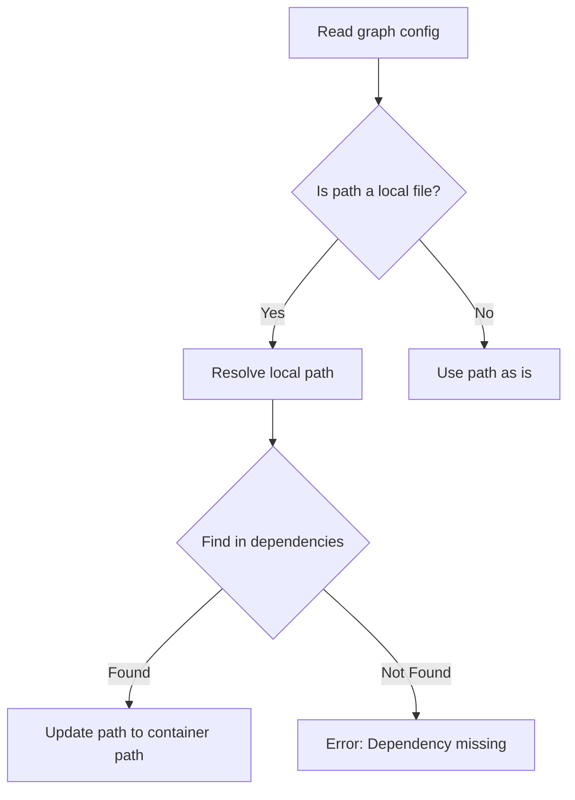

### Configuration for Authentication, Encryption, HTTP, Webhooks, and Checkpointing

The LangGraph CLI allows for configuring authentication, encryption, HTTP settings, webhooks, and checkpointing through the `langgraph.json` file. These configurations are then injected into the Docker image as environment variables.

## Conclusion

Configuration and customization are key aspects of the LangGraph framework. By understanding the runtime configuration options and the LangGraph CLI, developers can tailor LangGraph applications to meet specific requirements and deployment scenarios. The `langgraph.json` file serves as the central point for defining the application's structure, dependencies, and runtime behavior.


---

<a name="runtime-and-execution"></a>

<details>
<summary>Relevant source files</summary>

The following files were used as context for generating this wiki page:

- [https://github.com/langchain-ai/langgraph/blob/main/libs/langgraph/langgraph/runtime.py](https://github.com/langchain-ai/langgraph/blob/main/libs/langgraph/langgraph/runtime.py)
- [https://github.com/langchain-ai/langgraph/blob/main/libs/langgraph/langgraph/pregel/_executor.py](https://github.com/langchain-ai/langgraph/blob/main/libs/langgraph/langgraph/pregel/_executor.py)
</details>

# Runtime and Execution

This page details the runtime environment and execution mechanisms within LangGraph. It covers the `Runtime` class, which provides context and utilities for graph execution, and the `BackgroundExecutor` classes, which manage the execution of tasks in the background, both synchronously and asynchronously. The goal is to provide a comprehensive understanding of how LangGraph manages the execution of its graphs and the associated runtime context.

## Runtime Context

The `Runtime` class in LangGraph provides a mechanism for managing context and utilities during graph execution. It encapsulates run-scoped context, persistence, and streaming capabilities. `Sources: [https://github.com/langchain-ai/langgraph/blob/main/libs/langgraph/langgraph/runtime.py](Runtime class)`

### Key Components of Runtime

*   **Context:** The `context` attribute holds static information relevant to the graph run, such as user IDs or database connections. This allows nodes within the graph to access necessary dependencies. `Sources: [https://github.com/langchain-ai/langgraph/blob/main/libs/langgraph/langgraph/runtime.py](context attribute)`
*   **Store:** The `store` attribute provides a persistence layer for the graph run, enabling memory and state management. `Sources: [https://github.com/langchain-ai/langgraph/blob/main/libs/langgraph/langgraph/runtime.py](store attribute)`
*   **Stream Writer:** The `stream_writer` attribute is a function that writes to a custom stream, allowing for real-time monitoring and logging of the graph's execution. `Sources: [https://github.com/langchain-ai/langgraph/blob/main/libs/langgraph/langgraph/runtime.py](stream_writer attribute)`
*   **Previous:** The `previous` attribute stores the previous return value for a given thread, and is available when using the functional API with a checkpointer. `Sources: [https://github.com/langchain-ai/langgraph/blob/main/libs/langgraph/langgraph/runtime.py](previous attribute)`

### Runtime Methods

*   **`merge(other: Runtime[ContextT]) -> Runtime[ContextT]`:** This method merges two `Runtime` instances, prioritizing values from the `other` runtime if they are provided. If a value is not provided in the `other` runtime, the value from the current runtime is used. `Sources: [https://github.com/langchain-ai/langgraph/blob/main/libs/langgraph/langgraph/runtime.py](merge method)`
*   **`override(**overrides: Unpack[_RuntimeOverrides[ContextT]]) -> Runtime[ContextT]`:** This method creates a new `Runtime` instance with specified overrides, replacing the existing values. `Sources: [https://github.com/langchain-ai/langgraph/blob/main/libs/langgraph/langgraph/runtime.py](override method)`

### Using the Runtime

The `get_runtime` function retrieves the `Runtime` instance associated with the current graph run. It can optionally take a `context_schema` argument for type hinting. `Sources: [https://github.com/langchain-ai/langgraph/blob/main/libs/langgraph/langgraph/runtime.py](get_runtime function)`

```python
from langgraph.runtime import get_runtime

runtime = get_runtime()
user_id = runtime.context.user_id if runtime.context else None
```

### Data Model: _RuntimeOverrides

| Parameter | Type | Description |
|---|---|---|
| `context` | `ContextT` | The context for the graph run. |
| `store` | `BaseStore | None` | The store for persistence and memory. |
| `stream_writer` | `StreamWriter` | Function to write to a custom stream. |
| `previous` | `Any` | The previous return value for the given thread. |

## Background Execution

LangGraph utilizes background executors to manage the execution of tasks, both synchronously and asynchronously. This allows for concurrent execution of nodes within the graph, improving performance and responsiveness.

### BackgroundExecutor (Synchronous)

The `BackgroundExecutor` class is a context manager that runs synchronous tasks in the background using a thread pool executor. `Sources: [https://github.com/langchain-ai/langgraph/blob/main/libs/langgraph/langgraph/pregel/_executor.py](BackgroundExecutor class)`

#### Key Features

*   **Task Submission:** The `submit` method adds a callable to the executor's queue. `Sources: [https://github.com/langchain-ai/langgraph/blob/main/libs/langgraph/langgraph/pregel/_executor.py](submit method)`
*   **Cancellation:** Tasks can be cancelled on exit if the `__cancel_on_exit__` flag is set to `True`.
*   **Exception Handling:** Exceptions raised by tasks can be re-raised on exit if the `__reraise_on_exit__` flag is set to `True`.
*   **Context Propagation:** Uses `copy_context` to propagate the context to the background thread. `Sources: [https://github.com/langchain-ai/langgraph/blob/main/libs/langgraph/langgraph/pregel/_executor.py](copy_context)`

#### Usage

```python
from langgraph.pregel._executor import BackgroundExecutor
from langchain_core.runnables import RunnableConfig

config = RunnableConfig()

with BackgroundExecutor(config) as submit:
    future = submit(my_function, arg1, arg2, __name__="My Function")
    result = future.result()
```

### AsyncBackgroundExecutor (Asynchronous)

The `AsyncBackgroundExecutor` class is a context manager that runs asynchronous tasks in the background using the current event loop. `Sources: [https://github.com/langchain-ai/langgraph/blob/main/libs/langgraph/langgraph/pregel/_executor.py](AsyncBackgroundExecutor class)`

#### Key Features

*   **Task Submission:** The `submit` method creates an asyncio task for the given coroutine. `Sources: [https://github.com/langchain-ai/langgraph/blob/main/libs/langgraph/langgraph/pregel/_executor.py](submit method)`
*   **Cancellation:** Tasks can be cancelled on exit if the `__cancel_on_exit__` flag is set to `True`.
*   **Exception Handling:** Exceptions raised by tasks can be re-raised on exit if the `__reraise_on_exit__` flag is set to `True`. `CancelledError` exceptions are ignored.
*   **Concurrency Limiting:** Supports limiting the maximum number of concurrent tasks using an `asyncio.Semaphore`.
*   **Context Propagation:** Uses `copy_context` to propagate the context to the background task. `Sources: [https://github.com/langchain-ai/langgraph/blob/main/libs/langgraph/langgraph/pregel/_executor.py](copy_context)`

#### Usage

```python
import asyncio
from langgraph.pregel._executor import AsyncBackgroundExecutor
from langchain_core.runnables import RunnableConfig

async def main():
    config = RunnableConfig()

    async with AsyncBackgroundExecutor(config) as submit:
        future = submit(my_coroutine, arg1, arg2, __name__="My Coroutine")
        result = await future

asyncio.run(main())
```

### Execution Flow

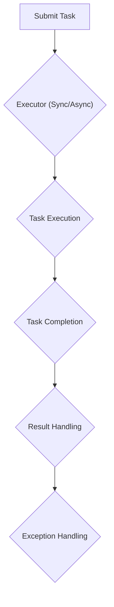

### Functions

*   **`gated(semaphore: asyncio.Semaphore, coro: Coroutine[None, None, T]) -> T`:** A coroutine that waits for a semaphore before running another coroutine, used for concurrency control in the `AsyncBackgroundExecutor`. `Sources: [https://github.com/langchain-ai/langgraph/blob/main/libs/langgraph/langgraph/pregel/_executor.py](gated function)`
*   **`next_tick(fn: Callable[P, T], *args: P.args, **kwargs: P.kwargs) -> T`:** A function that yields control to other threads before running another function, used to prevent blocking in the `BackgroundExecutor`. `Sources: [https://github.com/langchain-ai/langgraph/blob/main/libs/langgraph/langgraph/pregel/_executor.py](next_tick function)`

## Conclusion

The `Runtime` and `BackgroundExecutor` classes are essential components of LangGraph's execution model. The `Runtime` provides a flexible and extensible way to manage context and utilities during graph execution, while the `BackgroundExecutor` classes enable concurrent execution of tasks, improving performance and responsiveness. Understanding these components is crucial for building and deploying LangGraph applications.


---

<a name="persistence-and-memory"></a>

<details>
<summary>Relevant source files</summary>

The following files were used as context for generating this wiki page:

- [https://github.com/langchain-ai/langgraph/blob/main/docs/docs/concepts/persistence.md](https://github.com/langchain-ai/langgraph/blob/main/docs/docs/concepts/persistence.md)
- [https://github.com/langchain-ai/langgraph/blob/main/examples/persistence.ipynb](https://github.com/langchain-ai/langgraph/blob/main/examples/persistence.ipynb)
- [https://github.com/langchain-ai/langgraph/blob/main/libs/checkpoint/langgraph/store/base/__init__.py](https://github.com/langchain-ai/langgraph/blob/main/libs/checkpoint/langgraph/store/base/__init__.py)
</details>

# Persistence and Memory

LangGraph provides mechanisms for persistence and memory management, enabling features like human-in-the-loop workflows, conversation history, time travel, and fault tolerance. This is achieved through checkpointers and stores. Checkpointers save the state of the graph at each super-step, while stores provide a way to persist information across threads. This document details the concepts, components, and usage of persistence and memory within LangGraph.

## Persistence with Checkpointers and Threads

LangGraph's persistence layer is built upon checkpointers, which save the graph state at every super-step. These checkpoints are associated with a `thread`, allowing access to the graph's state after execution. This enables powerful capabilities such as human-in-the-loop interaction, memory retention, time travel, and fault tolerance. Sources: [https://github.com/langchain-ai/langgraph/blob/main/docs/docs/concepts/persistence.md](https://github.com/langchain-ai/langgraph/blob/main/docs/docs/concepts/persistence.md)

### Threads

A thread is a unique identifier assigned to each sequence of runs. The state of the graph is persisted to the thread during execution. To use a checkpointer, a `thread_id` must be specified in the `configurable` portion of the config. Sources: [https://github.com/langchain-ai/langgraph/blob/main/docs/docs/concepts/persistence.md](https://github.com/langchain-ai/langgraph/blob/main/docs/docs/concepts/persistence.md)

```python
{"configurable": {"thread_id": "1"}}
```

```typescript
{
  configurable: {
    thread_id: "1";
  }
}
```

The current and historical state of a thread can be retrieved using the LangGraph API. A thread must be created before executing a run to persist state. Sources: [https://github.com/langchain-ai/langgraph/blob/main/docs/docs/concepts/persistence.md](https://github.com/langchain-ai/langgraph/blob/main/docs/docs/concepts/persistence.md)

### Checkpoints

A checkpoint is a snapshot of the graph state at a particular point in time. It is represented by a `StateSnapshot` object, which includes the following key properties: Sources: [https://github.com/langchain-ai/langgraph/blob/main/docs/docs/concepts/persistence.md](https://github.com/langchain-ai/langgraph/blob/main/docs/docs/concepts/persistence.md)

*   `config`: Config associated with this checkpoint.
*   `metadata`: Metadata associated with this checkpoint.
*   `values`: Values of the state channels at this point in time.
*   `next`: A tuple of the node names to execute next in the graph.
*   `tasks`: A tuple of `PregelTask` objects that contain information about next tasks to be executed.

Checkpoints are persisted and can be used to restore the state of a thread at a later time. Sources: [https://github.com/langchain-ai/langgraph/blob/main/docs/docs/concepts/persistence.md](https://github.com/langchain-ai/langgraph/blob/main/docs/docs/concepts/persistence.md)

### Retrieving State

To interact with the saved graph state, a `thread_id` must be specified. The latest state can be viewed by calling `graph.get_state(config)`. This returns a `StateSnapshot` object corresponding to the latest checkpoint associated with the thread ID. A specific checkpoint can be retrieved by including a `checkpoint_id` in the config. Sources: [https://github.com/langchain-ai/langgraph/blob/main/docs/docs/concepts/persistence.md](https://github.com/langchain-ai/langgraph/blob/main/docs/docs/concepts/persistence.md)

```python
# get the latest state snapshot
config = {"configurable": {"thread_id": "1"}}
graph.get_state(config)

# get a state snapshot for a specific checkpoint_id
config = {"configurable": {"thread_id": "1", "checkpoint_id": "1ef663ba-28fe-6528-8002-5a559208592c"}}
graph.get_state(config)
```

```typescript
// get the latest state snapshot
const config = { configurable: { thread_id: "1" } };
await graph.getState(config);

// get a state snapshot for a specific checkpoint_id
const config = {
  configurable: {
    thread_id: "1",
    checkpoint_id: "1ef663ba-28fe-6528-8002-5a559208592c",
  },
};
await graph.getState(config);
```

The full history of the graph execution for a given thread can be retrieved by calling `graph.get_state_history(config)`. This returns a list of `StateSnapshot` objects associated with the thread ID, ordered chronologically with the most recent checkpoint first. Sources: [https://github.com/langchain-ai/langgraph/blob/main/docs/docs/concepts/persistence.md](https://github.com/langchain-ai/langgraph/blob/main/docs/docs/concepts/persistence.md)

```python
config = {"configurable": {"thread_id": "1"}}
list(graph.get_state_history(config))
```

```typescript
const config = { configurable: { thread_id: "1" } };
for await (const state of graph.getStateHistory(config)) {
  console.log(state);
}
```

### Replaying Graph Executions

LangGraph allows replaying prior graph executions by invoking a graph with a `thread_id` and a `checkpoint_id`. This replays the previously executed steps before the checkpoint corresponding to the `checkpoint_id` and executes the steps after the checkpoint. Sources: [https://github.com/langchain-ai/langgraph/blob/main/docs/docs/concepts/persistence.md](https://github.com/langchain-ai/langgraph/blob/main/docs/docs/concepts/persistence.md)

```python
config = {"configurable": {"thread_id": "1", "checkpoint_id": "0c62ca34-ac19-445d-bbb0-5b4984975b2a"}}
graph.invoke(None, config=config)
```

```typescript
const config = {
  configurable: {
    thread_id: "1",
    checkpoint_id: "0c62ca34-ac19-445d-bbb0-5b4984975b2a",
  },
};
await graph.invoke(null, config);
```

### Updating State

The graph state can be edited using `graph.update_state()`. This method accepts a `config` containing the `thread_id`, `values` to update the state, and optionally `as_node` to specify the node from which the update originates. Sources: [https://github.com/langchain-ai/langgraph/blob/main/docs/docs/concepts/persistence.md](https://github.com/langchain-ai/langgraph/blob/main/docs/docs/concepts/persistence.md)

## Memory Store

The `Store` interface provides a mechanism to retain information across threads. This is useful for scenarios like chatbots where user information needs to be persisted across multiple conversations. Sources: [https://github.com/langchain-ai/langgraph/blob/main/docs/docs/concepts/persistence.md](https://github.com/langchain-ai/langgraph/blob/main/docs/docs/concepts/persistence.md)

### Basic Usage

The `InMemoryStore` can be used to store information in memory. Memories are namespaced by a tuple. The `store.put` method saves memories to the store, and the `store.search` method retrieves memories. Sources: [https://github.com/langchain-ai/langgraph/blob/main/docs/docs/concepts/persistence.md](https://github.com/langchain-ai/langgraph/blob/main/docs/docs/concepts/persistence.md)

```python
from langgraph.store.memory import InMemoryStore
in_memory_store = InMemoryStore()

user_id = "1"
namespace_for_memory = (user_id, "memories")

memory_id = str(uuid.uuid4())
memory = {"food_preference" : "I like pizza"}
in_memory_store.put(namespace_for_memory, memory_id, memory)

memories = in_memory_store.search(namespace_for_memory)
memories[-1].dict()
```

```typescript
import { MemoryStore } from "@langchain/langgraph";

const memoryStore = new MemoryStore();

const userId = "1";
const namespaceForMemory = [userId, "memories"];

import { v4 as uuidv4 } from "uuid";

const memoryId = uuidv4();
const memory = { food_preference: "I like pizza" };
await memoryStore.put(namespaceForMemory, memoryId, memory);

const memories = await memoryStore.search(namespaceForMemory);
memories[memories.length - 1];
```

Each memory is an `Item` with attributes like `value`, `key`, `namespace`, `created_at`, and `updated_at`. Sources: [https://github.com/langchain-ai/langgraph/blob/main/libs/checkpoint/langgraph/store/base/__init__.py](https://github.com/langchain-ai/langgraph/blob/main/libs/checkpoint/langgraph/store/base/__init__.py)

```python
class Item:
    """Represents a stored item with metadata.
    """
```

### Semantic Search

The store also supports semantic search, allowing you to find memories based on meaning rather than exact matches. To enable this, configure the store with an embedding model. Sources: [https://github.com/langchain-ai/langgraph/blob/main/docs/docs/concepts/persistence.md](https://github.com/langchain-ai/langgraph/blob/main/docs/docs/concepts/persistence.md)

```python
from langchain.embeddings import init_embeddings

store = InMemoryStore(
    index={
        "embed": init_embeddings("openai:text-embedding-3-small"),  # Embedding provider
        "dims": 1536,                              # Embedding dimensions
        "fields": ["food_preference", "$"]              # Fields to embed
    }
)
```

```typescript
import { OpenAIEmbeddings } from "@langchain/openai";

const store = new InMemoryStore({
  index: {
    embeddings: new OpenAIEmbeddings({ model: "text-embedding-3-small" }),
    dims: 1536,
    fields: ["food_preference", "$"], // Fields to embed
  },
});
```

### Using in LangGraph

The `in_memory_store` works with the checkpointer to save state to threads and store information across threads. The graph is compiled with both the checkpointer and the `in_memory_store`. Sources: [https://github.com/langchain-ai/langgraph/blob/main/docs/docs/concepts/persistence.md](https://github.com/langchain-ai/langgraph/blob/main/docs/docs/concepts/persistence.md)

```python
from langgraph.checkpoint.memory import InMemorySaver

# We need this because we want to enable threads (conversations)
checkpointer = InMemorySaver()

# ... Define the graph ...

# Compile the graph with the checkpointer and store
graph = graph.compile(checkpointer=checkpointer, store=in_memory_store)
```

```typescript
import { MemorySaver } from "@langchain/langgraph";

// We need this because we want to enable threads (conversations)
const checkpointer = new MemorySaver();

// ... Define the graph ...

// Compile the graph with the checkpointer and store
const graph = workflow.compile({ checkpointer, store: memoryStore });
```

The `in_memory_store` and `user_id` can be accessed in any node by passing `store: BaseStore` and `config: RunnableConfig` as node arguments. Sources: [https://github.com/langchain-ai/langgraph/blob/main/docs/docs/concepts/persistence.md](https://github.com/langchain-ai/langgraph/blob/main/docs/docs/concepts/persistence.md)

```python
def update_memory(state: MessagesState, config: RunnableConfig, *, store: BaseStore):

    # Get the user id from the config
    user_id = config["configurable"]["user_id"]

    # Namespace the memory
    namespace = (user_id, "memories")

    # ... Analyze conversation and create a new memory

    # Create a new memory ID
    memory_id = str(uuid.uuid4())

    # We create a new memory
    store.put(namespace, memory_id, {"memory": memory})
```

```typescript
import {
  LangGraphRunnableConfig,
  BaseStore,
  MessagesZodState,
} from "@langchain/langgraph";
import { z } from "zod";

const updateMemory = async (
  state: z.infer<typeof MessagesZodState>,
  config: LangGraphRunnableConfig,
  store: BaseStore
) => {
  // Get the user id from the config
  const userId = config.configurable?.user_id;

  // Namespace the memory
  const namespace = [userId, "memories"];

  // ... Analyze conversation and create a new memory

  // Create a new memory ID
  const memoryId = uuidv4();

  // We create a new memory
  await store.put(namespace, memoryId, { memory });
};
```

### BaseStore Interface

The `BaseStore` class defines the interface for persistent key-value stores. It supports operations like `get`, `search`, `put`, and `delete`. It also supports asynchronous versions of these operations. Sources: [https://github.com/langchain-ai/langgraph/blob/main/libs/checkpoint/langgraph/store/base/__init__.py](https://github.com/langchain-ai/langgraph/blob/main/libs/checkpoint/langgraph/store/base/__init__.py)

```python
class BaseStore(ABC):
    """Abstract base class for persistent key-value stores.
    """
```

| Method | Description |
|---|---|
| `batch(ops: Iterable[Op])` | Executes multiple operations synchronously in a single batch. |
| `abatch(self, ops: Iterable[Op])` | Executes multiple operations asynchronously in a single batch. |
| `get(namespace: tuple[str, ...], key: str)` | Retrieves a single item. |
| `search(namespace_prefix: tuple[str, ...])` | Searches for items within a namespace prefix. |
| `put(namespace: tuple[str, ...], key: str, value: dict[str, Any])` | Stores or updates an item in the store. |
| `delete(namespace: tuple[str, ...], key: str)` | Deletes an item. |
| `list_namespaces(...)` | Lists and filters namespaces in the store. |
| `aget(namespace: tuple[str, ...], key: str)` | Asynchronously retrieves a single item. |
| `asearch(namespace_prefix: tuple[str, ...])` | Asynchronously searches for items within a namespace prefix. |
| `aput(namespace: tuple[str, ...], key: str, value: dict[str, Any])` | Asynchronously stores or updates an item in the store. |
| `adelete(namespace: tuple[str, ...], key: str)` | Asynchronously deletes an item. |
| `alist_namespaces(...)` | Asynchronously lists and filters namespaces in the store. |

### Checkpointer Libraries

LangGraph provides several checkpointer implementations: Sources: [https://github.com/langchain-ai/langgraph/blob/main/docs/docs/concepts/persistence.md](https://github.com/langchain-ai/langgraph/blob/main/docs/docs/concepts/persistence.md)

*   `langgraph-checkpoint`: The base interface for checkpointer savers and serialization/deserialization. Includes in-memory checkpointer implementation.
*   `langgraph-checkpoint-sqlite`: An implementation that uses SQLite database.
*   `langgraph-checkpoint-postgres`: An advanced checkpointer that uses Postgres database, used in LangGraph Platform.

### Checkpointer Interface

Each checkpointer conforms to the `BaseCheckpointSaver` interface and implements the following methods: Sources: [https://github.com/langchain-ai/langgraph/blob/main/docs/docs/concepts/persistence.md](https://github.com/langchain-ai/langgraph/blob/main/docs/docs/concepts/persistence.md)

*   `.put`: Store a checkpoint with its configuration and metadata.
*   `.put_writes`: Store intermediate writes linked to a checkpoint.
*   `.get_tuple`: Fetch a checkpoint tuple using for a given configuration (`thread_id` and `checkpoint_id`).
*   `.list`: List checkpoints that match a given configuration and filter criteria.

## Capabilities Enabled by Persistence and Memory

### Human-in-the-loop

Checkpointers facilitate human-in-the-loop workflows by allowing humans to inspect, interrupt, and approve graph steps. Sources: [https://github.com/langchain-ai/langgraph/blob/main/docs/docs/concepts/persistence.md](https://github.com/langchain-ai/langgraph/blob/main/docs/docs/concepts/persistence.md)

### Memory

Checkpointers allow for memory between interactions, enabling conversation history. Sources: [https://github.com/langchain-ai/langgraph/blob/main/docs/docs/concepts/persistence.md](https://github.com/langchain-ai/langgraph/blob/main/docs/docs/concepts/persistence.md)

### Time Travel

Checkpointers allow for time travel, allowing users to replay prior graph executions and fork the graph state at arbitrary checkpoints. Sources: [https://github.com/langchain-ai/langgraph/blob/main/docs/docs/concepts/persistence.md](https://github.com/langchain-ai/langgraph/blob/main/docs/docs/concepts/persistence.md)

### Fault-tolerance

Checkpointing provides fault-tolerance and error recovery, allowing the graph to be restarted from the last successful step. Sources: [https://github.com/langchain-ai/langgraph/blob/main/docs/docs/concepts/persistence.md](https://github.com/langchain-ai/langgraph/blob/main/docs/docs/concepts/persistence.md)

## Conclusion

LangGraph's persistence and memory mechanisms, powered by checkpointers and stores, are essential for building robust and interactive applications. These features enable human-in-the-loop workflows, maintain conversation history, allow for debugging and exploration through time travel, and provide fault tolerance. By leveraging these capabilities, developers can create more sophisticated and reliable LangGraph applications.


---

<a name="tracing-and-debugging-with-langsmith"></a>

<details>
<summary>Relevant source files</summary>

The following files were used as context for generating this wiki page:

- [https://github.com/langchain-ai/langgraph/blob/main/docs/docs/concepts/tracing.md](https://github.com/langchain-ai/langgraph/blob/main/docs/docs/concepts/tracing.md)
- [https://github.com/langchain-ai/langgraph/blob/main/libs/langgraph/tests/fake_tracer.py](https://github.com/langchain-ai/langgraph/blob/main/libs/langgraph/tests/fake_tracer.py)
</details>

# Tracing and Debugging with LangSmith

Tracing is a crucial aspect of understanding and debugging complex applications. LangSmith provides a platform to visualize the execution steps of an application, allowing developers to identify bottlenecks, errors, and areas for improvement. This page outlines how to use LangSmith for tracing and debugging, and introduces the `FakeTracer` class for testing purposes.

## Introduction to Tracing with LangSmith

Tracing involves tracking the series of steps an application takes from input to output. Each step is represented as a "run." LangSmith allows you to visualize these runs, providing insights into application performance and behavior. By enabling tracing, you can debug locally running applications, evaluate performance, and monitor application health. `Sources: [https://github.com/langchain-ai/langgraph/blob/main/docs/docs/concepts/tracing.md](https://github.com/langchain-ai/langgraph/blob/main/docs/docs/concepts/tracing.md)`

To get started with LangSmith, you need to sign up for a free account. Once you have an account, you can enable tracing for your application and begin collecting data. LangSmith offers various tools and dashboards to analyze traces and gain valuable insights. `Sources: [https://github.com/langchain-ai/langgraph/blob/main/docs/docs/concepts/tracing.md](https://github.com/langchain-ai/langgraph/blob/main/docs/docs/concepts/tracing.md)`

## Using LangSmith for Debugging and Monitoring

LangSmith provides several key features for debugging and monitoring applications:

-   **Debugging Locally Running Applications:** LangSmith allows you to debug applications running locally by visualizing the execution trace. `Sources: [https://github.com/langchain-ai/langgraph/blob/main/docs/docs/concepts/tracing.md](https://github.com/langchain-ai/langgraph/blob/main/docs/docs/concepts/tracing.md)`
-   **Evaluating Application Performance:** You can evaluate the performance of your application by analyzing the traces in LangSmith. This helps identify slow or inefficient components. `Sources: [https://github.com/langchain-ai/langgraph/blob/main/docs/docs/concepts/tracing.md](https://github.com/langchain-ai/langgraph/blob/main/docs/docs/concepts/tracing.md)`
-   **Monitoring Application Health:** LangSmith provides dashboards to monitor the health of your application and identify potential issues. `Sources: [https://github.com/langchain-ai/langgraph/blob/main/docs/docs/concepts/tracing.md](https://github.com/langchain-ai/langgraph/blob/main/docs/docs/concepts/tracing.md)`

## FakeTracer: A Tool for Testing

The `FakeTracer` class is a utility for testing LangChain applications. It records LangChain executions and replaces run IDs with deterministic UUIDs for snapshotting. This allows for consistent and repeatable tests. `Sources: [https://github.com/langchain-ai/langgraph/blob/main/libs/langgraph/tests/fake_tracer.py](FakeTracer class)`

### Architecture of FakeTracer

The `FakeTracer` class inherits from `BaseTracer` and overrides the `_persist_run` method to store run data. It uses a UUID mapping to replace run IDs with deterministic UUIDs, ensuring consistent test results. `Sources: [https://github.com/langchain-ai/langgraph/blob/main/libs/langgraph/tests/fake_tracer.py](FakeTracer class)`

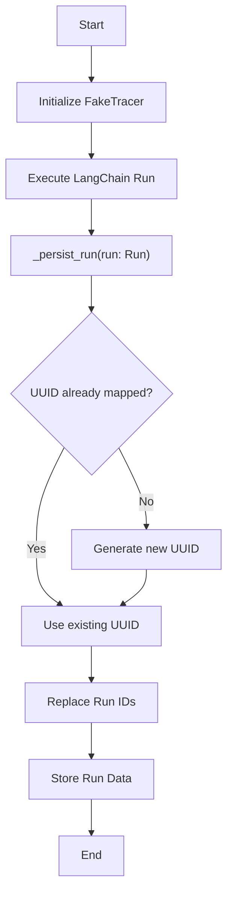

### Key Components and Functions

| Component | Description |
|---|---|
| `runs` | A list to store the `Run` objects. |
| `uuids_map` | A dictionary to map original UUIDs to deterministic UUIDs. |
| `uuids_generator` | A generator that yields a sequence of deterministic UUIDs. |
| `_replace_uuid(uuid: UUID)` | Replaces a UUID with a deterministic UUID from the `uuids_map`. |
| `_persist_run(run: Run)` | Persists a run by replacing its UUIDs and storing it in the `runs` list. |
| `flattened_runs()` | Returns a flattened list of all runs, including child runs. |
| `run_ids` | Returns a list of run IDs. |

### Data Flow in FakeTracer

1.  **Initialization:** The `FakeTracer` is initialized with empty lists and dictionaries to store run data and UUID mappings. `Sources: [https://github.langchain-ai/langgraph/blob/main/libs/langgraph/tests/fake_tracer.py](__init__ function)`
2.  **Run Execution:** When a LangChain run is executed, the `_persist_run` method is called with the `Run` object. `Sources: [https://github.langchain-ai/langgraph/blob/main/libs/langgraph/tests/fake_tracer.py](_persist_run function)`
3.  **UUID Replacement:** The `_replace_uuid` method is used to replace the original UUIDs in the `Run` object with deterministic UUIDs. If a UUID is not already in the `uuids_map`, a new deterministic UUID is generated and added to the map. `Sources: [https://github.langchain-ai/langgraph/blob/main/libs/langgraph/tests/fake_tracer.py](_replace_uuid function)`
4.  **Data Storage:** The modified `Run` object is then stored in the `runs` list.
5.  **Accessing Runs:** The `flattened_runs` method can be used to retrieve a flattened list of all runs, including child runs. The `run_ids` property returns a list of run IDs. `Sources: [https://github.langchain-ai/langgraph/blob/main/libs/langgraph/tests/fake_tracer.py](flattened_runs function)`

## Conclusion

Tracing and debugging are essential for building robust and reliable applications. LangSmith provides a powerful platform for visualizing and analyzing application traces, enabling developers to identify and resolve issues quickly. The `FakeTracer` class offers a valuable tool for testing LangChain applications by providing deterministic and repeatable traces. By leveraging these tools, developers can improve the performance and stability of their applications.


---

<a name="examples-and-use-cases"></a>

<details>
<summary>Relevant source files</summary>

The following files were used as context for generating this wiki page:

- [https://github.com/langchain-ai/langgraph/blob/main/examples/README.md](https://github.com/langchain-ai/langgraph/blob/main/examples/README.md)
- [https://github.com/langchain-ai/langgraph/blob/main/examples/async.ipynb](https://github.com/langchain-ai/langgraph/blob/main/examples/async.ipynb)
- [https://github.com/langchain-ai/langgraph/blob/main/examples/branching.ipynb](https://github.com/langchain-ai/langgraph/blob/main/examples/branching.ipynb)
</details>

# Examples and Use Cases

This page provides an overview of the examples available for LangGraph and their intended use. The examples serve as practical demonstrations of LangGraph's capabilities and how to implement specific functionalities. It's important to note that the `examples/` directory is not intended for documentation purposes. All new documentation should be added to the `docs/docs/` directory. Sources: [https://github.com/langchain-ai/langgraph/blob/main/examples/README.md](https://github.com/langchain-ai/langgraph/blob/main/examples/README.md)

The examples currently available showcase asynchronous operations and branching within LangGraph. These examples have been migrated to the `docs/docs/how-tos/` directory within the LangGraph documentation. This page will provide a brief overview of these examples and their purpose.

## Available Examples

### Asynchronous Operations

The `async.ipynb` notebook demonstrates how to perform asynchronous operations within LangGraph. This is useful for tasks that involve waiting for external resources or performing long-running computations without blocking the main thread. The notebook has been moved to the documentation. Sources: [https://github.com/langchain-ai/langgraph/blob/main/examples/async.ipynb](https://github.com/langchain-ai/langgraph/blob/main/examples/async.ipynb)

### Branching

The `branching.ipynb` notebook illustrates how to implement branching logic within a LangGraph. Branching allows the graph to take different paths based on certain conditions, enabling more complex and dynamic workflows. The notebook has been moved to the documentation. Sources: [https://github.com/langchain-ai/langgraph/blob/main/examples/branching.ipynb](https://github.com/langchain-ai/langgraph/blob/main/examples/branching.ipynb)

## Conclusion

The examples directory provides practical demonstrations of LangGraph's features, including asynchronous operations and branching. While the examples themselves are located in the `docs/docs/how-tos/` directory, this page serves as a guide to the available examples and their purpose. Remember that the `examples/` directory is not the place for documentation. Sources: [https://github.com/langchain-ai/langgraph/blob/main/examples/README.md](https://github.com/langchain-ai/langgraph/blob/main/examples/README.md)


---

<a name="langgraph-cli"></a>

<details>
<summary>Relevant source files</summary>

The following files were used as context for generating this wiki page:

- [https://github.com/langchain-ai/langgraph/blob/main/libs/cli/langgraph_cli/cli.py](https://github.com/langchain-ai/langgraph/blob/main/libs/cli/langgraph_cli/cli.py)
- [https://github.com/langchain-ai/langgraph/blob/main/libs/cli/README.md](https://github.com/langchain-ai/langgraph/blob/main/libs/cli/README.md)
- [https://github.com/langchain-ai/langgraph/blob/main/docs/docs/concepts/langgraph_cli.md](https://github.com/langchain-ai/langgraph/blob/main/docs/docs/concepts/langgraph_cli.md)
</details>

# LangGraph CLI

The LangGraph Command Line Interface (CLI) is a versatile tool designed to streamline the development, building, and deployment of LangGraph applications. It provides a set of commands to initialize new projects, run development servers with hot reloading, build Docker images for deployment, and generate Dockerfiles for custom deployments. The CLI aims to simplify the process of creating and managing LangGraph applications, whether for local development or production environments.

The CLI supports configuration through a `langgraph.json` file, allowing users to specify dependencies, graph definitions, environment variables, and other settings. It also integrates with Docker for containerization, enabling consistent and reproducible deployments. The LangGraph CLI is available for both Python and JavaScript LangGraph projects, offering a unified interface for managing LangGraph applications across different platforms.

## Installation

The LangGraph CLI can be installed using pip. For development mode with hot reloading, install with the `inmem` extra.
```bash
pip install langgraph-cli
```
For development mode with hot reloading:
```bash
pip install "langgraph-cli[inmem]"
```
Sources: [https://github.com/langchain-ai/langgraph/blob/main/libs/cli/README.md](Installation)

## Commands

The LangGraph CLI provides several commands to manage LangGraph applications.

### `langgraph new`

This command creates a new LangGraph project from a template.
```bash
langgraph new [PATH] --template TEMPLATE_NAME
```
Sources: [https://github.com/langchain-ai/langgraph/blob/main/libs/cli/README.md](langgraph new)

### `langgraph dev`

This command runs the LangGraph API server in development mode with hot reloading. It's ideal for rapid development and testing.
```bash
langgraph dev [OPTIONS]
  --host TEXT                 Host to bind to (default: 127.0.0.1)
  --port INTEGER             Port to bind to (default: 2024)
  --no-reload               Disable auto-reload
  --debug-port INTEGER      Enable remote debugging
  --no-browser             Skip opening browser window
  -c, --config FILE        Config file path (default: langgraph.json)
```
Sources: [https://github.com/langchain-ai/langgraph/blob/main/libs/cli/README.md](langgraph dev)

### `langgraph up`

This command launches the LangGraph API server in a Docker container. It requires Docker to be running locally and either a LangSmith API key for local development or a LangGraph Cloud license key for production use.
```bash
langgraph up [OPTIONS]
  -p, --port INTEGER        Port to expose (default: 8123)
  --wait                   Wait for services to start
  --watch                  Restart on file changes
  --verbose               Show detailed logs
  -c, --config FILE       Config file path
  -d, --docker-compose    Additional services file
```
Sources: [https://github.com/langchain-ai/langgraph/blob/main/libs/cli/README.md](langgraph up)

### `langgraph build`

This command builds a Docker image for the LangGraph API server. The resulting image can be directly deployed.
```bash
langgraph build -t IMAGE_TAG [OPTIONS]
  --platform TEXT          Target platforms (e.g., linux/amd64,linux/arm64)
  --pull / --no-pull      Use latest/local base image
  -c, --config FILE       Config file path
```
Sources: [https://github.com/langchain-ai/langgraph/blob/main/libs/cli/README.md](langgraph build)

### `langgraph dockerfile`

This command generates a Dockerfile that can be used to build images for and deploy instances of the LangGraph API server. This is useful for custom deployments or further customization of the Dockerfile.
```bash
langgraph dockerfile SAVE_PATH [OPTIONS]
  -c, --config FILE       Config file path
```
Sources: [https://github.com/langchain-ai/langgraph/blob/main/libs/cli/README.md](langgraph dockerfile)

## Configuration File (langgraph.json)

The LangGraph CLI uses a `langgraph.json` file to configure the application. This file specifies dependencies, graph definitions, environment variables, and other settings. Sources: [https://github.com/langchain-ai/langgraph/blob/main/libs/cli/README.md](Configuration)

The `langgraph.json` file should contain the following keys:

*   **dependencies**: An array of dependencies for the LangGraph API server. Dependencies can be local packages (e.g., `"./local_package"`) or package names (e.g., `"langchain_openai"`). The special dependency `"."` will look for local python packages, as well as `pyproject.toml`, `setup.py` or `requirements.txt` in the app directory. Sources: [https://github.com/langchain-ai/langgraph/blob/main/libs/cli/cli.py](OPT_CONFIG)
*   **graphs**: A mapping from graph ID to the path where the compiled graph is defined (e.g., `"my_graph_id": "./your_package/your_file.py:variable"`). The variable should be an instance of `langgraph.graph.graph.CompiledGraph`. Sources: [https://github.com/langchain-ai/langgraph/blob/main/libs/cli/cli.py](OPT_CONFIG)
*   **env**: (Optional) Path to a `.env` file or a mapping from environment variable to its value. Sources: [https://github.com/langchain-ai/langgraph/blob/main/libs/cli/cli.py](OPT_CONFIG)
*   **python_version**: (Optional) The Python version to use (3.11, 3.12, or 3.13). Defaults to 3.11. Sources: [https://github.com/langchain-ai/langgraph/blob/main/libs/cli/cli.py](OPT_CONFIG)
*   **pip_config_file**: (Optional) Path to a pip config file. Sources: [https://github.com/langchain-ai/langgraph/blob/main/libs/cli/cli.py](OPT_CONFIG)
*   **dockerfile_lines**: (Optional) An array of additional lines to add to the Dockerfile following the import from the parent image. Sources: [https://github.com/langchain-ai/langgraph/blob/main/libs/cli/cli.py](OPT_CONFIG)

Example `langgraph.json` file:

```json
{
    "dependencies": [
        "langchain_openai",
        "./your_package"
    ],
    "graphs": {
        "my_graph_id": "./your_package/your_file.py:variable"
    },
    "env": "./.env"
}
```
Sources: [https://github.com/langchain-ai/langgraph/blob/main/libs/cli/cli.py](OPT_CONFIG)

## Core Functions

### `up` command

The `up` command launches the LangGraph API server using Docker Compose. It reads the configuration from the `langgraph.json` file and the optional `docker-compose.yml` file. It pulls the necessary Docker images, builds the application image, and starts the containers. Sources: [https://github.com/langchain-ai/langgraph/blob/main/libs/cli/cli.py](up)

```python
@OPT_RECREATE
@OPT_PULL
@OPT_PORT
@OPT_DOCKER_COMPOSE
@OPT_CONFIG
@OPT_VERBOSE
@OPT_DEBUGGER_PORT
@OPT_DEBUGGER_BASE_URL
@OPT_WATCH
@OPT_POSTGRES_URI
@OPT_API_VERSION
@click.option(
    "--image",
    type=str,
    default=None,
    help="Docker image to use for the langgraph-api service. If specified, skips building and uses this image directly."
    " Useful if you want to test against an image already built using `langgraph build`.",
)
@click.option(
    "--base-image",
    default=None,
    help="Base image to use for the LangGraph API server. Pin to specific versions using version tags. Defaults to langchain/langgraph-api or langchain/langgraphjs-api."
    "\n\n    \b\nExamples:\n    --base-image langchain/langgraph-server:0.2.18  # Pin to a specific patch version"
    "\n    --base-image langchain/langgraph-server:0.2  # Pin to a minor version (Python)",
)
@click.option(
    "--wait",
    is_flag=True,
    help="Wait for services to start before returning. Implies --detach",
)
@cli.command(help="🚀 Launch LangGraph API server.")
@log_command
def up(
    config: pathlib.Path,
    docker_compose: pathlib.Path | None,
    port: int,
    recreate: bool,
    pull: bool,
    watch: bool,
    wait: bool,
    verbose: bool,
    debugger_port: int | None,
    debugger_base_url: str | None,
    postgres_uri: str | None,
    api_version: str | None,
    image: str | None,
    base_image: str | None,
):
    # ... implementation ...
```

### `build` command

The `build` command builds a Docker image for the LangGraph API server. It uses the `docker build` command with a Dockerfile generated from the `langgraph.json` configuration. Sources: [https://github.com/langchain-ai/langgraph/blob/main/libs/cli/cli.py](build)

```python
@OPT_CONFIG
@OPT_PULL
@click.option(
    "--tag",
    "-t",
    help="""Tag for the docker image.

    \b
    Example:
        langgraph build -t my-image

    \b
    """,
    required=True,
)
@click.option(
    "--base-image",
    help="Base image to use for the LangGraph API server. Pin to specific versions using version tags. Defaults to langchain/langgraph-api or langchain/langgraphjs-api."
    "\n\n    \b\nExamples:\n    --base-image langchain/langgraph-server:0.2.18  # Pin to a specific patch version"
    "\n    --base-image langchain/langgraph-server:0.2  # Pin to a minor version (Python)",
)
@OPT_API_VERSION
@click.option(
    "--install-command",
    help="Custom install command to run from the build context root. If not provided, auto-detects based on package manager files.",
)
@click.option(
    "--build-command",
    help="Custom build command to run from the langgraph.json directory. If not provided, uses default build process.",
)
@click.argument("docker_build_args", nargs=-1, type=click.UNPROCESSED)
@cli.command(
    help="📦 Build LangGraph API server Docker image.",
    context_settings=dict(
        ignore_unknown_options=True,
    ),
)
@log_command
def build(
    config: pathlib.Path,
    docker_build_args: Sequence[str],
    base_image: str | None,
    api_version: str | None,
    pull: bool,
    tag: str,
    install_command: str | None,
    build_command: str | None,
):
    # ... implementation ...
```

### `dockerfile` command

The `dockerfile` command generates a Dockerfile for the LangGraph API server. It reads the configuration from the `langgraph.json` file and generates a Dockerfile that can be used to build a Docker image. It also provides an option to generate a `docker-compose.yml` file and a `.dockerignore` file for running the LangGraph API server with Docker Compose. Sources: [https://github.com/langchain-ai/langgraph/blob/main/libs/cli/cli.py](dockerfile)

```python
@OPT_CONFIG
@click.argument("save_path", type=click.Path(resolve_path=True))
@cli.command(
    help="🐳 Generate a Dockerfile for the LangGraph API server, with Docker Compose options."
)
@click.option(
    # Add a flag for adding a docker-compose.yml file as part of the output
    "--add-docker-compose",
    help=(
        "Add additional files for running the LangGraph API server with "
        "docker-compose. These files include a docker-compose.yml, .env file, "
        "and a .dockerignore file."
    ),
    is_flag=True,
)
@click.option(
    "--base-image",
    help="Base image to use for the LangGraph API server. Pin to specific versions using version tags. Defaults to langchain/langgraph-api or langchain/langgraphjs-api."
    "\n\n    \b\nExamples:\n    --base-image langchain/langgraph-server:0.2.18  # Pin to a specific patch version"
    "\n    --base-image langchain/langgraph-server:0.2  # Pin to a minor version (Python)",
)
@OPT_API_VERSION
@log_command
def dockerfile(
    save_path: str,
    config: pathlib.Path,
    add_docker_compose: bool,
    base_image: str | None = None,
    api_version: str | None = None,
) -> None:
    # ... implementation ...
```

### `dev` command

The `dev` command runs the LangGraph API server in development mode with hot reloading and debugging support. It uses the `langgraph_api.cli.run_server` function to start the server. Sources: [https://github.com/langchain-ai/langgraph/blob/main/libs/cli/cli.py](dev)

```python
@click.option(
    "--host",
    default="127.0.0.1",
    help="Network interface to bind the development server to. Default 127.0.0.1 is recommended for security. Only use 0.0.0.0 in trusted networks",
)
@click.option(
    "--port",
    default=2024,
    type=int,
    help="Port number to bind the development server to. Example: langgraph dev --port 8000",
)
@click.option(
    "--no-reload",
    is_flag=True,
    help="Disable automatic reloading when code changes are detected",
)
@click.option(
    "--config",
    type=click.Path(exists=True),
    default="langgraph.json",
    help="Path to configuration file declaring dependencies, graphs and environment variables",
)
@click.option(
    "--n-jobs-per-worker",
    default=None,
    type=int,
    help="Maximum number of concurrent jobs each worker process can handle. Default: 10",
)
@click.option(
    "--no-browser",
    is_flag=True,
    help="Skip automatically opening the browser when the server starts",
)
@click.option(
    "--debug-port",
    default=None,
    type=int,
    help="Enable remote debugging by listening on specified port. Requires debugpy to be installed",
)
@click.option(
    "--wait-for-client",
    is_flag=True,
    help="Wait for a debugger client to connect to the debug port before starting the server",
    default=False,
)
@click.option(
    "--studio-url",
    type=str,
    default=None,
    help="URL of the LangGraph Studio instance to connect to. Defaults to https://smith.langchain.com",
)
@click.option(
    "--allow-blocking",
    is_flag=True,
    help="Don't raise errors for synchronous I/O blocking operations in your code.",
    default=False,
)
@click.option(
    "--tunnel",
    is_flag=True,
    help="Expose the local server via a public tunnel (in this case, Cloudflare) "
    "for remote frontend access. This avoids issues with browsers "
    "or networks blocking localhost connections.",
    default=False,
)
@click.option(
    "--server-log-level",
    type=str,
    default="WARNING",
    help="Set the log level for the API server.",
)
@cli.command(
    "dev",
    help="🏃‍♀️‍➡️ Run LangGraph API server in development mode with hot reloading and debugging support",
)
@log_command
def dev(
    host: str,
    port: int,
    no_reload: bool,
    config: str,
    n_jobs_per_worker: int | None,
    no_browser: bool,
    debug_port: int | None,
    wait_for_client: bool,
    studio_url: str | None,
    allow_blocking: bool,
    tunnel: bool,
    server_log_level: str,
):
    # ... implementation ...
```

## Docker Integration

The LangGraph CLI heavily relies on Docker for containerization and deployment. The `up`, `build`, and `dockerfile` commands all interact with Docker to manage LangGraph applications.

### Dockerfile Generation

The `dockerfile` command generates a Dockerfile based on the `langgraph.json` configuration. The generated Dockerfile includes instructions for installing dependencies, copying the application code, and starting the LangGraph API server. Sources: [https://github.com/langchain-ai/langgraph/blob/main/libs/cli/cli.py](dockerfile)

The generated Dockerfile uses a base image, which can be specified using the `--base-image` option. If no base image is specified, the CLI defaults to `langchain/langgraph-api` or `langchain/langgraphjs-api`. Sources: [https://github.com/langchain-ai/langgraph/blob/main/libs/cli/cli.py](OPT_CONFIG)

### Docker Compose

The `up` command uses Docker Compose to manage the LangGraph API server and its dependencies. It generates a `docker-compose.yml` file that defines the services, networks, and volumes required to run the application. Sources: [https://github.com/langchain-ai/langgraph/blob/main/libs/cli/cli.py](up)

The `docker-compose.yml` file includes the LangGraph API server, a database for checkpointing and storage, and any other services specified in the `docker-compose` option.

## Conclusion

The LangGraph CLI provides a comprehensive set of tools for developing, building, and deploying LangGraph applications. It simplifies the process of creating and managing LangGraph projects, whether for local development or production environments. By leveraging Docker for containerization, the CLI ensures consistent and reproducible deployments across different platforms.


---
