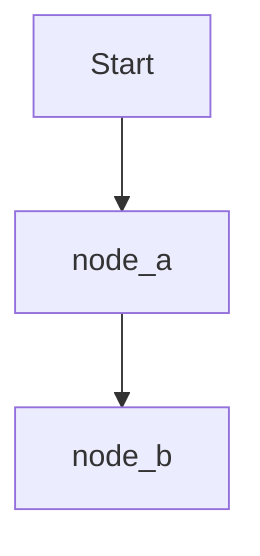
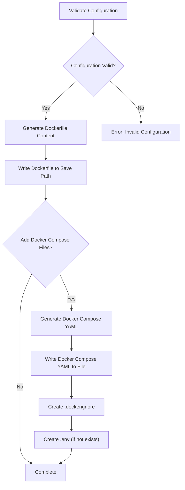
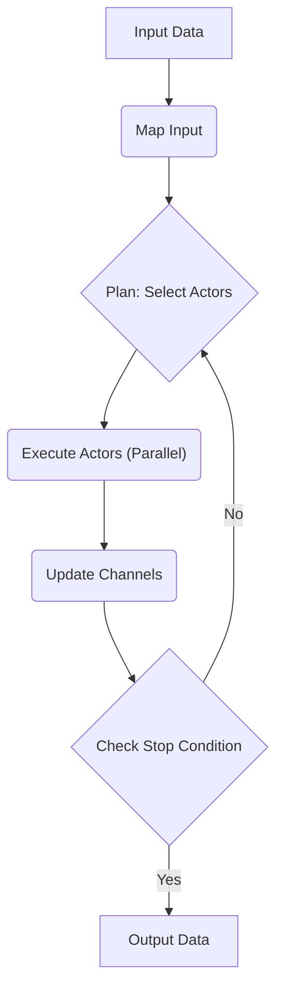
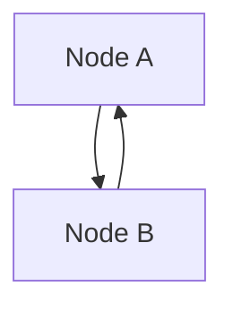

# LangGraph 위키

LangGraph는 장기 실행, 상태 저장 에이전트를 구축, 관리 및 배포하기 위한 로우 레벨 오케스트레이션 프레임워크입니다.

## Table of Contents

- [소개](#소개)
- [빠른 시작](#빠른-시작)
- [핵심 이점](#핵심-이점)
- [지속적인 실행](#지속적인-실행)
- [사람 개입](#사람-개입)
- [메모리](#메모리)
- [예제](#예제)
- [LangGraph CLI](#langgraph-cli)
- [아키텍처](#아키텍처)
- [기여](#기여)
- [문제 해결](#문제-해결)
- [LangGraph Cloud](#langgraph-cloud)

---

<a name="소개"></a>

<details>
<summary>Relevant source files</summary>

The following files were used as context for generating this wiki page:

- [https://github.com/langchain-ai/langgraph/blob/main/README.md](https://github.com/langchain-ai/langgraph/blob/main/README.md)
</details>

# 소개

LangGraph는 장기 실행, 상태 저장 에이전트를 구축, 관리 및 배포하기 위한 로우 레벨 오케스트레이션 프레임워크입니다. Klarna, Replit, Elastic 등 미래를 만들어가는 회사에서 신뢰하며 사용하고 있습니다. LangGraph는 프롬프트나 아키텍처를 추상화하지 않고, 다음과 같은 핵심 이점을 제공합니다. 내결함성 실행, 휴먼-인-더-루프, 포괄적인 메모리, LangSmith를 통한 디버깅, 프로덕션 준비 배포 등을 지원합니다. `Sources: [https://github.com/langchain-ai/langgraph/blob/main/README.md](README.md)`

LangGraph는 독립적으로 사용할 수도 있지만, LangChain 제품과 원활하게 통합되어 개발자에게 에이전트 구축을 위한 완벽한 도구 모음을 제공합니다. LangSmith, LangSmith Deployment, LangChain과 함께 사용하여 LLM 애플리케이션 개발을 개선할 수 있습니다. `Sources: [https://github.com/langchain-ai/langgraph/blob/main/README.md](README.md)`

## LangGraph 시작하기

### 설치

LangGraph를 설치하려면 다음 명령을 실행합니다.

```
pip install -U langgraph
```
`Sources: [https://github.com/langchain-ai/langgraph/blob/main/README.md](README.md)`

### 간단한 워크플로우 생성

다음은 간단한 워크플로우를 생성하는 예제 코드입니다.

```python
from langgraph.graph import START, StateGraph
from typing_extensions import TypedDict


class State(TypedDict):
    text: str


def node_a(state: State) -> dict:
    return {"text": state["text"] + "a"}


def node_b(state: State) -> dict:
    return {"text": state["text"] + "b"}


graph = StateGraph(State)
graph.add_node("node_a", node_a)
graph.add_node("node_b", node_b)
graph.add_edge(START, "node_a")
graph.add_edge("node_a", "node_b")

print(graph.compile().invoke({"text": ""}))
# {'text': 'ab'}
```
`Sources: [https://github.com/langchain-ai/langgraph/blob/main/README.md](README.md)`

이 코드는 `node_a`와 `node_b`라는 두 개의 노드를 가진 간단한 그래프를 생성합니다. `node_a`는 입력 텍스트에 "a"를 추가하고, `node_b`는 입력 텍스트에 "b"를 추가합니다. 그래프는 `START` 노드에서 시작하여 `node_a`로 이동한 다음 `node_b`로 이동합니다. 최종 결과는 "ab"입니다.

### 핵심 이점

LangGraph는 다음과 같은 핵심 이점을 제공합니다.

*   **내구성이 뛰어난 실행:** 실패를 극복하고 장기간 실행될 수 있는 에이전트를 구축하고, 중단된 지점에서 자동으로 다시 시작할 수 있습니다. `Sources: [https://github.com/langchain-ai/langgraph/blob/main/README.md](Durable execution)`
*   **휴먼-인-더-루프:** 실행 중 언제든지 에이전트 상태를 검사하고 수정하여 사람의 감독을 원활하게 통합합니다. `Sources: [https://github.com/langchain-ai/langgraph/blob/main/README.md](Human-in-the-loop)`
*   **포괄적인 메모리:** 진행 중인 추론을 위한 단기 작업 메모리와 세션 간의 장기 지속 메모리를 모두 사용하여 진정으로 상태 저장 에이전트를 만듭니다. `Sources: [https://github.com/langchain-ai/langgraph/blob/main/README.md](Comprehensive memory)`
*   **LangSmith를 사용한 디버깅:** 실행 경로를 추적하고, 상태 전환을 캡처하고, 자세한 런타임 메트릭을 제공하는 시각화 도구를 통해 복잡한 에이전트 동작에 대한 심층적인 가시성을 확보합니다. `Sources: [https://github.com/langchain-ai/langgraph/blob/main/README.md](Debugging with LangSmith)`
*   **프로덕션 준비 배포:** 상태 저장, 장기 실행 워크플로의 고유한 문제를 처리하도록 설계된 확장 가능한 인프라를 통해 정교한 에이전트 시스템을 자신 있게 배포합니다. `Sources: [https://github.com/langchain-ai/langgraph/blob/main/README.md](Production-ready deployment)`

### LangGraph 에코시스템

LangGraph는 LangChain 제품과 통합되어 LLM 애플리케이션 개발을 위한 도구 모음을 제공합니다.

*   **LangSmith:** 에이전트 평가 및 관찰 가능성에 유용합니다. 성능이 낮은 LLM 앱 실행을 디버깅하고, 에이전트 궤적을 평가하고, 프로덕션에서 가시성을 확보하고, 시간이 지남에 따라 성능을 개선합니다. `Sources: [https://github.com/langchain-ai/langgraph/blob/main/README.md](LangSmith)`
*   **LangSmith Deployment:** 장기 실행, 상태 저장 워크플로를 위한 특수 구축된 배포 플랫폼을 통해 에이전트를 쉽게 배포하고 확장합니다. 팀 간에 에이전트를 검색, 재사용, 구성 및 공유하고 LangGraph Studio에서 시각적 프로토타입 제작을 통해 빠르게 반복합니다. `Sources: [https://github.com/langchain-ai/langgraph/blob/main/README.md](LangSmith Deployment)`
*   **LangChain:** LLM 애플리케이션 개발을 간소화하기 위한 통합 및 구성 가능한 구성 요소를 제공합니다. `Sources: [https://github.com/langchain-ai/langgraph/blob/main/README.md](LangChain)`

## 추가 자료

*   **가이드:** 스트리밍, 메모리 및 지속성 추가, 디자인 패턴(예: 분기, 서브 그래프 등)과 같은 주제에 대한 빠르고 실행 가능한 코드 스니펫입니다. `Sources: [https://github.com/langchain-ai/langgraph/blob/main/README.md](Guides)`
*   **참조:** 핵심 클래스, 메서드, 그래프 및 체크포인트 API 사용 방법, 고급 사전 구축 구성 요소에 대한 자세한 참조입니다. `Sources: [https://github.com/langchain-ai/langgraph/blob/main/README.md](Reference)`
*   **예제:** LangGraph 시작에 대한 안내 예제입니다. `Sources: [https://github.com/langchain-ai/langgraph/blob/main/README.md](Examples)`
*   **LangChain 포럼:** 커뮤니티와 연결하고 모든 기술 질문, 아이디어 및 피드백을 공유합니다. `Sources: [https://github.com/langchain-ai/langgraph/blob/main/README.md](LangChain Forum)`
*   **LangChain Academy:** 무료 구조화된 과정에서 LangGraph의 기본 사항을 배웁니다. `Sources: [https://github.com/langchain-ai/langgraph/blob/main/README.md](LangChain Academy)`
*   **사례 연구:** 업계 리더가 LangGraph를 사용하여 AI 애플리케이션을 대규모로 제공하는 방법을 들어보십시오. `Sources: [https://github.com/langchain-ai/langgraph/blob/main/README.md](Case studies)`

## 결론

LangGraph는 장기 실행, 상태 저장 에이전트를 구축, 관리 및 배포하기 위한 강력한 프레임워크입니다. LangChain 에코시스템과 통합되어 LLM 애플리케이션 개발을 위한 완벽한 도구 모음을 제공합니다.


---

<a name="빠른-시작"></a>

<details>
<summary>Relevant source files</summary>

The following files were used as context for generating this wiki page:

- [https://github.com/langchain-ai/langgraph/blob/main/README.md](https://github.com/langchain-ai/langgraph/blob/main/README.md)
</details>

# 빠른 시작

LangGraph는 장기 실행, 상태 저장 에이전트를 구축, 관리 및 배포하기 위한 로우 레벨 오케스트레이션 프레임워크입니다. 이 문서는 LangGraph를 빠르게 시작하는 방법을 안내합니다. LangGraph는 LangChain 제품과 원활하게 통합되어 LLM 애플리케이션 개발을 위한 완벽한 도구 모음을 제공합니다.

## 설치

LangGraph를 설치하려면 다음 명령을 실행합니다.

```
pip install -U langgraph
```
Sources: [https://github.com/langchain-ai/langgraph/blob/main/README.md](lines 15-17)

## 간단한 워크플로우 생성

다음은 간단한 워크플로우를 생성하는 예제 코드입니다.

```python
from langgraph.graph import START, StateGraph
from typing_extensions import TypedDict


class State(TypedDict):
    text: str


def node_a(state: State) -> dict:
    return {"text": state["text"] + "a"}


def node_b(state: State) -> dict:
    return {"text": state["text"] + "b"}


graph = StateGraph(State)
graph.add_node("node_a", node_a)
graph.add_node("node_b", node_b)
graph.add_edge(START, "node_a")
graph.add_edge("node_a", "node_b")

print(graph.compile().invoke({"text": ""}))
# {'text': 'ab'}
```
Sources: [https://github.com/langchain-ai/langgraph/blob/main/README.md](lines 19-37)

이 코드는 `State`라는 상태를 정의하고, `node_a`와 `node_b`라는 두 개의 노드를 정의합니다. `node_a`는 상태의 `text` 필드에 "a"를 추가하고, `node_b`는 상태의 `text` 필드에 "b"를 추가합니다. 그런 다음 `StateGraph`를 사용하여 그래프를 만들고, 노드를 추가하고, 에지를 추가합니다. 마지막으로 그래프를 컴파일하고 실행하여 결과를 출력합니다.

### 코드 설명

1.  **상태 정의:**
    ```python
    class State(TypedDict):
        text: str
    ```
    `State`는 `text`라는 문자열 필드를 가지는 TypedDict입니다. 이 상태는 그래프의 노드 간에 전달되는 데이터를 나타냅니다. Sources: [https://github.com/langchain-ai/langgraph/blob/main/README.md](lines 22-24)

2.  **노드 정의:**
    ```python
    def node_a(state: State) -> dict:
        return {"text": state["text"] + "a"}


    def node_b(state: State) -> dict:
        return {"text": state["text"] + "b"}
    ```
    `node_a`와 `node_b`는 그래프의 노드를 나타내는 함수입니다. 각 함수는 `State` 객체를 입력으로 받아 딕셔너리를 반환합니다. `node_a`는 입력 상태의 `text` 필드에 "a"를 추가하고, `node_b`는 입력 상태의 `text` 필드에 "b"를 추가합니다. Sources: [https://github.com/langchain-ai/langgraph/blob/main/README.md](lines 26-31)

3.  **그래프 생성 및 노드/에지 추가:**
    ```python
    graph = StateGraph(State)
    graph.add_node("node_a", node_a)
    graph.add_node("node_b", node_b)
    graph.add_edge(START, "node_a")
    graph.add_edge("node_a", "node_b")
    ```
    `StateGraph`를 사용하여 그래프를 생성하고, `add_node` 메서드를 사용하여 노드를 추가하고, `add_edge` 메서드를 사용하여 에지를 추가합니다. `START`는 그래프의 시작 노드를 나타냅니다. Sources: [https://github.com/langchain-ai/langgraph/blob/main/README.md](lines 33-37)

4.  **그래프 컴파일 및 실행:**
    ```python
    print(graph.compile().invoke({"text": ""}))
    # {'text': 'ab'}
    ```
    `compile` 메서드를 사용하여 그래프를 컴파일하고, `invoke` 메서드를 사용하여 그래프를 실행합니다. `invoke` 메서드는 초기 상태를 입력으로 받아 최종 상태를 반환합니다. Sources: [https://github.com/langchain-ai/langgraph/blob/main/README.md](lines 39-41)

### 워크플로우 시각화

다음은 위 코드의 워크플로우를 시각화한 다이어그램입니다.



## LangChain 에이전트

LangChain의 `create_agent`를 사용하여 에이전트를 빠르게 구축하려면 [LangChain 에이전트 문서](https://docs.langchain.com/oss/python/langchain/agents)를 참조하십시오. Sources: [https://github.com/langchain-ai/langgraph/blob/main/README.md](lines 43-45)

## 추가 자료

*   [LangGraph Quickstart](https://docs.langchain.com/oss/python/langgraph/quickstart)
*   [Guides](https://docs.langchain.com/oss/python/langgraph/guides): 스트리밍, 메모리 및 지속성 추가, 디자인 패턴(예: 분기, 서브그래프 등)과 같은 주제에 대한 빠른 코드 스니펫. Sources: [https://github.com/langchain-ai/langgraph/blob/main/README.md](lines 69-71)
*   [Reference](https://reference.langchain.com/python/langgraph/): 핵심 클래스, 메서드, 그래프 및 체크포인트 API 사용 방법, 고급 사전 구축 구성 요소에 대한 자세한 참조. Sources: [https://github.com/langchain-ai/langgraph/blob/main/README.md](lines 72-74)
*   [Examples](https://docs.langchain.com/oss/python/langgraph/agentic-rag): LangGraph 시작에 대한 가이드 예제. Sources: [https://github.com/langchain-ai/langgraph/blob/main/README.md](lines 75-76)
*   [LangChain Forum](https://forum.langchain.com/): 커뮤니티와 연결하고 모든 기술 질문, 아이디어 및 피드백을 공유하십시오. Sources: [https://github.com/langchain-ai/langgraph/blob/main/README.md](lines 77-79)
*   [LangChain Academy](https://academy.langchain.com/courses/intro-to-langgraph): 무료 구조화된 과정에서 LangGraph의 기본 사항을 배우십시오. Sources: [https://github.com/langchain-ai/langgraph/blob/main/README.md](lines 80-81)
*   [Case studies](https://www.langchain.com/built-with-langgraph): 업계 리더가 LangGraph를 사용하여 AI 애플리케이션을 대규모로 제공하는 방법을 들어보십시오. Sources: [https://github.com/langchain-ai/langgraph/blob/main/README.md](lines 82-83)

## 결론

이 문서는 LangGraph를 빠르게 시작하는 방법을 제공합니다. LangGraph는 장기 실행, 상태 저장 에이전트를 구축, 관리 및 배포하기 위한 강력한 프레임워크입니다. LangChain 제품과 원활하게 통합되어 LLM 애플리케이션 개발을 위한 완벽한 도구 모음을 제공합니다.


---

<a name="핵심-이점"></a>

<details>
<summary>Relevant source files</summary>

The following files were used as context for generating this wiki page:

- [https://github.com/langchain-ai/langgraph/blob/main/README.md](https://github.com/langchain-ai/langgraph/blob/main/README.md)
- [https://github.com/langchain-ai/langgraph/blob/main/docs/docs/concepts/durable_execution.md](https://github.com/langchain-ai/langgraph/blob/main/docs/docs/concepts/durable_execution.md)
- [https://github.com/langchain-ai/langgraph/blob/main/docs/docs/concepts/human_in_the_loop.md](https://github.com/langchain-ai/langgraph/blob/main/docs/docs/concepts/human_in_the_loop.md)
- [https://github.com/langchain-ai/langgraph/blob/main/docs/docs/concepts/memory.md](https://github.com/langchain-ai/langgraph/blob/main/docs/docs/concepts/memory.md)
</details>

# 핵심 이점

LangGraph는 장기 실행, 상태 저장 에이전트를 구축, 관리 및 배포하기 위한 로우 레벨 오케스트레이션 프레임워크입니다. 프롬프트나 아키텍처를 추상화하지 않으며 다음과 같은 핵심 이점을 제공합니다.

## 주요 이점

LangGraph는 장기 실행, 상태 저장 워크플로우 또는 에이전트를 위한 로우 레벨 지원 인프라를 제공합니다. LangGraph는 프롬프트나 아키텍처를 추상화하지 않으며 다음과 같은 핵심 이점을 제공합니다. Sources: [https://github.com/langchain-ai/langgraph/blob/main/README.md](README.md)

-   **지속적인 실행 (Durable execution):** 실패를 극복하고 장기간 실행될 수 있는 에이전트를 구축하여 중단된 시점부터 자동으로 재개합니다. Sources: [https://github.com/langchain-ai/langgraph/blob/main/README.md](README.md), [https://github.com/langchain-ai/langgraph/blob/main/docs/docs/concepts/durable_execution.md](https://github.com/langchain-ai/langgraph/blob/main/docs/docs/concepts/durable_execution.md)
-   **Human-in-the-loop:** 실행 중 언제든지 에이전트 상태를 검사하고 수정하여 사람의 감독을 원활하게 통합합니다. Sources: [https://github.com/langchain-ai/langgraph/blob/main/README.md](README.md), [https://github.com/langchain-ai/langgraph/blob/main/docs/docs/concepts/human_in_the_loop.md](https://github.com/langchain-ai/langgraph/blob/main/docs/docs/concepts/human_in_the_loop.md)
-   **종합적인 메모리 (Comprehensive memory):** 지속적인 추론을 위한 단기 작업 메모리와 세션 간의 장기 지속 메모리를 모두 사용하여 진정한 상태 저장 에이전트를 만듭니다. Sources: [https://github.com/langchain-ai/langgraph/blob/main/README.md](README.md), [https://github.com/langchain-ai/langgraph/blob/main/docs/docs/concepts/memory.md](https://github.com/langchain-ai/langgraph/blob/main/docs/docs/concepts/memory.md)
-   **LangSmith를 사용한 디버깅:** 실행 경로를 추적하고, 상태 전환을 캡처하고, 자세한 런타임 메트릭을 제공하는 시각화 도구를 통해 복잡한 에이전트 동작에 대한 심층적인 가시성을 확보합니다. Sources: [https://github.com/langchain-ai/langgraph/blob/main/README.md](README.md)
-   **Production-ready 배포:** 상태 저장, 장기 실행 워크플로우의 고유한 과제를 처리하도록 설계된 확장 가능한 인프라를 통해 정교한 에이전트 시스템을 자신 있게 배포합니다. Sources: [https://github.com/langchain-ai/langgraph/blob/main/README.md](README.md)

## 지속적인 실행 (Durable Execution)

**지속적인 실행**은 프로세스 또는 워크플로우가 주요 시점에서 진행 상황을 저장하여 일시 중지했다가 중단된 위치에서 정확히 다시 시작할 수 있도록 하는 기술입니다. 이는 사용자가 계속하기 전에 프로세스를 검사, 유효성 검사 또는 수정할 수 있는 [human-in-the-loop](./human_in_the_loop.md) 시나리오와 LLM 호출 시간 초과와 같은 중단 또는 오류가 발생할 수 있는 장기 실행 작업에서 특히 유용합니다. 완료된 작업을 보존함으로써 지속적인 실행은 상당한 지연 후에도 (예: 일주일 후) 이전 단계를 다시 처리하지 않고도 프로세스를 재개할 수 있도록 합니다. Sources: [https://github.com/langchain-ai/langgraph/blob/main/docs/docs/concepts/durable_execution.md](https://github.com/langchain-ai/langgraph/blob/main/docs/docs/concepts/durable_execution.md)

LangGraph의 내장 [persistence](./persistence.md) 레이어는 워크플로우에 대한 지속적인 실행을 제공하여 각 실행 단계의 상태가 지속적인 저장소에 저장되도록 합니다. 이 기능은 시스템 오류 또는 [human-in-the-loop](./human_in_the_loop.md) 상호 작용으로 인해 워크플로우가 중단된 경우 마지막으로 기록된 상태에서 재개할 수 있도록 보장합니다. Sources: [https://github.com/langchain-ai/langgraph/blob/main/docs/docs/concepts/durable_execution.md](https://github.com/langchain-ai/langgraph/blob/main/docs/docs/concepts/durable_execution.md)

### 요구 사항

LangGraph에서 지속적인 실행을 활용하려면 다음이 필요합니다. Sources: [https://github.com/langchain-ai/langgraph/blob/main/docs/docs/concepts/durable_execution.md](https://github.com/langchain-ai/langgraph/blob/main/docs/docs/concepts/durable_execution.md)

1.  워크플로우 진행 상황을 저장할 [checkpointer](./persistence.md#checkpointer-libraries)를 지정하여 워크플로우에서 [persistence](./persistence.md)를 활성화합니다.
2.  워크플로우를 실행할 때 [thread identifier](./persistence.md#threads)를 지정합니다. 이렇게 하면 특정 워크플로우 인스턴스에 대한 실행 기록이 추적됩니다.
3.  비결정적 작업 (예: 난수 생성) 또는 부작용이 있는 작업 (예: 파일 쓰기, API 호출)을 @[tasks][task] 내부에 래핑하여 워크플로우가 재개될 때 이러한 작업이 특정 실행에 대해 반복되지 않고 대신 결과가 지속성 레이어에서 검색되도록 합니다. 자세한 내용은 [Determinism and Consistent Replay](#determinism-and-consistent-replay)를 참조하십시오.

### 결정론 및 일관된 재생 (Determinism and Consistent Replay)

워크플로우 실행을 재개하면 코드는 실행이 중지된 **동일한 코드 줄**에서 재개되지 않습니다. 대신, 중단된 위치에서 다시 시작할 적절한 [starting point](#starting-points-for-resuming-workflows)를 식별합니다. 즉, 워크플로우는 중지된 지점에 도달할 때까지 [starting point](#starting-points-for-resuming-workflows)에서 모든 단계를 재생합니다. Sources: [https://github.com/langchain-ai/langgraph/blob/main/docs/docs/concepts/durable_execution.md](https://github.com/langchain-ai/langgraph/blob/main/docs/docs/concepts/durable_execution.md)

결과적으로 지속적인 실행을 위한 워크플로우를 작성할 때 비결정적 작업 (예: 난수 생성) 및 부작용이 있는 작업 (예: 파일 쓰기, API 호출)을 [tasks](./functional_api.md#task) 또는 [nodes](./low_level.md#nodes) 내부에 래핑해야 합니다. Sources: [https://github.com/langchain-ai/langgraph/blob/main/docs/docs/concepts/durable_execution.md](https://github.com/langchain-ai/langgraph/blob/main/docs/docs/concepts/durable_execution.md)

워크플로우가 결정적이고 일관되게 재생될 수 있도록 하려면 다음 지침을 따르십시오. Sources: [https://github.com/langchain-ai/langgraph/blob/main/docs/docs/concepts/durable_execution.md](https://github.com/langchain-ai/langgraph/blob/main/docs/docs/concepts/durable_execution.md)

-   **작업 반복 방지:** [node](./low_level.md#nodes)에 부작용이 있는 여러 작업 (예: 로깅, 파일 쓰기 또는 네트워크 호출)이 포함된 경우 각 작업을 별도의 **task**로 래핑합니다. 이렇게 하면 워크플로우가 재개될 때 작업이 반복되지 않고 결과가 지속성 레이어에서 검색됩니다.
-   **비결정적 작업 캡슐화:** 비결정적 결과를 생성할 수 있는 코드 (예: 난수 생성)를 **tasks** 또는 **nodes** 내부에 래핑합니다. 이렇게 하면 재개 시 워크플로우가 동일한 결과로 정확한 기록된 단계 시퀀스를 따릅니다.
-   **멱등성 작업 사용:** 가능한 경우 부작용 (예: API 호출, 파일 쓰기)이 멱등성인지 확인합니다. 즉, 워크플로우에서 실패 후 작업이 다시 시도되면 처음 실행된 것과 동일한 효과가 있습니다. 이는 데이터 쓰기를 초래하는 작업에 특히 중요합니다. **task**가 시작되었지만 성공적으로 완료되지 못한 경우 워크플로우의 재개는 일관성을 유지하기 위해 기록된 결과를 사용하여 **task**를 다시 실행합니다. 의도하지 않은 중복을 방지하기 위해 멱등성 키를 사용하거나 기존 결과를 확인하여 원활하고 예측 가능한 워크플로우 실행을 보장합니다.

### 내구성 모드 (Durability modes)

LangGraph는 애플리케이션 요구 사항에 따라 성능과 데이터 일관성의 균형을 맞출 수 있는 세 가지 내구성 모드를 지원합니다. 내구성 모드는 내구성이 가장 낮은 것부터 가장 높은 것 순으로 다음과 같습니다. Sources: [https://github.com/langchain-ai/langgraph/blob/main/docs/docs/concepts/durable_execution.md](https://github.com/langchain-ai/langgraph/blob/main/docs/docs/concepts/durable_execution.md)

-   [`"exit"`](#exit)
-   [`"async"`](#async)
-   [`"sync"`](#sync)

내구성이 높은 모드는 워크플로우 실행에 더 많은 오버헤드를 추가합니다. Sources: [https://github.com/langchain-ai/langgraph/blob/main/docs/docs/concepts/durable_execution.md](https://github.com/langchain-ai/langgraph/blob/main/docs/docs/concepts/durable_execution.md)

#### `"exit"`

그래프 실행이 완료될 때만 변경 사항이 유지됩니다 (성공적으로 또는 오류와 함께). 이는 장기 실행 그래프에 가장 적합한 성능을 제공하지만 중간 상태가 저장되지 않으므로 실행 중 오류에서 복구하거나 그래프 실행을 중단할 수 없습니다. Sources: [https://github.com/langchain-ai/langgraph/blob/main/docs/docs/concepts/durable_execution.md](https://github.com/langchain-ai/langgraph/blob/main/docs/docs/concepts/durable_execution.md)

#### `"async"`

다음 단계가 실행되는 동안 변경 사항이 비동기적으로 유지됩니다. 이는 우수한 성능과 내구성을 제공하지만 프로세스가 실행 중에 충돌하는 경우 체크포인트가 기록되지 않을 위험이 약간 있습니다. Sources: [https://github.com/langchain-ai/langgraph/blob/main/docs/docs/concepts/durable_execution.md](https://github.com/langchain-ai/langgraph/blob/main/docs/docs/concepts/durable_execution.md)

#### `"sync"`

다음 단계가 시작되기 전에 변경 사항이 동기적으로 유지됩니다. 이렇게 하면 모든 체크포인트가 실행을 계속하기 전에 기록되어 성능 오버헤드 비용으로 높은 내구성을 제공합니다. Sources: [https://github.com/langchain-ai/langgraph/blob/main/docs/docs/concepts/durable_execution.md](https://github.com/langchain-ai/langgraph/blob/main/docs/docs/concepts/durable_execution.md)

### 워크플로우 재개 (Resuming Workflows)

워크플로우에서 지속적인 실행을 활성화한 후에는 다음 시나리오에 대해 실행을 재개할 수 있습니다. Sources: [https://github.com/langchain-ai/langgraph/blob/main/docs/docs/concepts/durable_execution.md](https://github.com/langchain-ai/langgraph/blob/main/docs/docs/concepts/durable_execution.md)

-   **워크플로우 일시 중지 및 재개:** @[interrupt][interrupt] 함수를 사용하여 특정 지점에서 워크플로우를 일시 중지하고 @[Command] 기본 요소를 사용하여 업데이트된 상태로 워크플로우를 재개합니다. 자세한 내용은 [**Human-in-the-Loop**](./human_in_the_loop.md)를 참조하십시오.
-   **오류로부터 복구:** 예외 (예: LLM 공급자 중단) 후 마지막 성공적인 체크포인트에서 워크플로우를 자동으로 재개합니다. 여기에는 입력 값으로 `None`을 제공하여 동일한 스레드 식별자로 워크플로우를 실행하는 것이 포함됩니다 (기능 API를 사용한 이 [example](../how-tos/use-functional-api.md#resuming-after-an-error) 참조).

### 워크플로우 재개 시작점 (Starting Points for Resuming Workflows)

-   @[StateGraph (Graph API)][StateGraph]를 사용하는 경우 시작점은 실행이 중지된 [**node**](./low_level.md#nodes)의 시작 부분입니다. Sources: [https://github.com/langchain-ai/langgraph/blob/main/docs/docs/concepts/durable_execution.md](https://github.com/langchain-ai/langgraph/blob/main/docs/docs/concepts/durable_execution.md)
-   노드 내에서 서브 그래프 호출을 수행하는 경우 시작점은 중단된 서브 그래프를 호출한 **parent** 노드입니다. 서브 그래프 내부에서 시작점은 실행이 중지된 특정 [**node**](./low_level.md#nodes)입니다.
-   기능 API를 사용하는 경우 시작점은 실행이 중지된 [**entrypoint**](./functional_api.md#entrypoint)의 시작 부분입니다.

## Human-in-the-loop

에이전트 또는 워크플로우에서 도구 호출을 검토, 편집 및 승인하려면 [LangGraph의 human-in-the-loop 기능](../how-tos/human_in_the_loop/add-human-in-the-loop.md)을 사용하여 워크플로우의 어느 시점에서든 사람의 개입을 활성화합니다. 이는 모델 출력이 유효성 검사, 수정 또는 추가 컨텍스트가 필요한 대규모 언어 모델 (LLM) 기반 애플리케이션에서 특히 유용합니다. Sources: [https://github.com/langchain-ai/langgraph/blob/main/docs/docs/concepts/human_in_the_loop.md](https://github.com/langchain-ai/langgraph/blob/main/docs/docs/concepts/human_in_the_loop.md)

### 주요 기능

*   **지속적인 실행 상태:** 인터럽트는 그래프 상태를 저장하는 LangGraph의 [persistence](./persistence.md) 레이어를 사용하여 재개할 때까지 그래프 실행을 무기한 일시 중지합니다. 이는 LangGraph가 각 단계 후에 그래프 상태를 체크포인트하므로 시스템이 실행 컨텍스트를 유지하고 나중에 워크플로우를 재개하여 중단된 위치에서 계속할 수 있기 때문에 가능합니다. 이는 시간 제약 없이 비동기식 사람 검토 또는 입력을 지원합니다. Sources: [https://github.com/langchain-ai/langgraph/blob/main/docs/docs/concepts/human_in_the_loop.md](https://github.com/langchain-ai/langgraph/blob/main/docs/docs/concepts/human_in_the_loop.md)

    그래프를 일시 중지하는 방법에는 두 가지가 있습니다.

    -   [동적 인터럽트](../how-tos/human_in_the_loop/add-human-in-the-loop.md#pause-using-interrupt): 그래프의 현재 상태를 기반으로 특정 노드 내부에서 그래프를 일시 중지하려면 `interrupt`를 사용합니다.
    -   [정적 인터럽트](../how-tos/human_in_the_loop/add-human-in-the-loop.md#debug-with-interrupts): 노드가 실행되기 전이나 후에 미리 정의된 지점에서 그래프를 일시 중지하려면 `interrupt_before` 및 `interrupt_after`를 사용합니다.

*   **유연한 통합 지점:** Human-in-the-loop 로직은 워크플로우의 어느 지점에서든 도입할 수 있습니다. 이를 통해 API 호출 승인, 출력 수정 또는 대화 안내와 같은 대상 사람 참여가 가능합니다. Sources: [https://github.com/langchain-ai/langgraph/blob/main/docs/docs/concepts/human_in_the_loop.md](https://github.com/langchain-ai/langgraph/blob/main/docs/docs/concepts/human_in_the_loop.md)

### 패턴

`interrupt` 및 `Command`를 사용하여 구현할 수 있는 네 가지 일반적인 디자인 패턴이 있습니다. Sources: [https://github.com/langchain-ai/langgraph/blob/main/docs/docs/concepts/human_in_the_loop.md](https://github.com/langchain-ai/langgraph/blob/main/docs/docs/concepts/human_in_the_loop.md)

-   [승인 또는 거부](../how-tos/human_in_the_loop/add-human-in-the-loop.md#approve-or-reject): API 호출과 같은 중요한 단계 전에 그래프를 일시 중지하여 작업을 검토하고 승인합니다. 작업이 거부되면 그래프가 단계를 실행하지 못하도록 하고 잠재적으로 대체 작업을 수행할 수 있습니다. 이 패턴은 종종 사람의 입력을 기반으로 그래프를 라우팅하는 것을 포함합니다.
-   [그래프 상태 편집](../how-tos/human_in_the_loop/add-human-in-the-loop.md#review-and-edit-state): 그래프를 일시 중지하여 그래프 상태를 검토하고 편집합니다. 이는 실수를 수정하거나 추가 정보로 상태를 업데이트하는 데 유용합니다. 이 패턴은 종종 사람의 입력으로 상태를 업데이트하는 것을 포함합니다.
-   [도구 호출 검토](../how-tos/human_in_the_loop/add-human-in-the-loop.md#review-tool-calls): 도구 실행 전에 LLM에서 요청한 도구 호출을 검토하고 편집하기 위해 그래프를 일시 중지합니다.
-   [사람 입력 유효성 검사](../how-tos/human_in_the_loop/add-human-in-the-loop.md#validate-human-input): 다음 단계를 진행하기 전에 사람 입력을 유효성 검사하기 위해 그래프를 일시 중지합니다.

## 종합적인 메모리 (Comprehensive memory)

[메모리](../how-tos/memory/add-memory.md)는 이전 상호 작용에 대한 정보를 기억하는 시스템입니다. AI 에이전트의 경우 메모리는 이전 상호 작용을 기억하고, 피드백에서 배우고, 사용자 기본 설정에 적응할 수 있기 때문에 매우 중요합니다. 에이전트가 수많은 사용자 상호 작용으로 더 복잡한 작업을 처리함에 따라 이 기능은 효율성과 사용자 만족도 모두에 필수적입니다. Sources: [https://github.com/langchain-ai/langgraph/blob/main/docs/docs/concepts/memory.md](https://github.com/langchain-ai/langgraph/blob/main/docs/docs/concepts/memory.md)

이 개념 가이드에서는 회상 범위에 따라 두 가지 유형의 메모리를 다룹니다. Sources: [https://github.com/langchain-ai/langgraph/blob/main/docs/docs/concepts/memory.md](https://github.com/langchain-ai/langgraph/blob/main/docs/docs/concepts/memory.md)

-   [단기 메모리](#short-term-memory) 또는 [thread](persistence.md#threads) 범위 메모리는 세션 내에서 메시지 기록을 유지하여 진행 중인 대화를 추적합니다. LangGraph는 에이전트의 [state](low_level.md#state)의 일부로 단기 메모리를 관리합니다. 상태는 [checkpointer](persistence.md#checkpoints)를 사용하여 데이터베이스에 유지되므로 스레드를 언제든지 재개할 수 있습니다. 단기 메모리는 그래프가 호출되거나 단계가 완료되면 업데이트되고 각 단계의 시작 부분에서 상태가 읽혀집니다.
-   [장기 메모리](#long-term-memory)는 세션 간에 사용자별 또는 애플리케이션 수준 데이터를 저장하고 대화형 스레드 _전반에 걸쳐_ 공유됩니다. _언제든지_ 그리고 _어떤 스레드에서든_ 회상할 수 있습니다. 메모리는 단일 스레드 ID 내에서뿐만 아니라 모든 사용자 지정 네임스페이스로 범위가 지정됩니다. LangGraph는 장기 메모리를 저장하고 회상할 수 있도록 [stores](persistence.md#memory-store) ([reference doc](https://langchain-ai.github.io/langgraph/reference/store/#langgraph.store.base.BaseStore))를 제공합니다.

### 단기 메모리 (Short-term memory)

[단기 메모리](../how-tos/memory/add-memory.md#add-short-term-memory)를 사용하면 애플리케이션이 단일 [thread](persistence.md#threads) 또는 대화 내에서 이전 상호 작용을 기억할 수 있습니다. [thread](persistence.md#threads)는 이메일이 단일 대화에서 메시지를 그룹화하는 방식과 유사하게 세션에서 여러 상호 작용을 구성합니다. Sources: [https://github.com/langchain-ai/langgraph/blob/main/docs/docs/concepts/memory.md](https://github.com/langchain-ai/langgraph/blob/main/docs/docs/concepts/memory.md)

LangGraph는 스레드 범위 체크포인트를 통해 유지되는 에이전트 상태의 일부로 단기 메모리를 관리합니다. 이 상태에는 일반적으로 업로드된 파일, 검색된 문서 또는 생성된 아티팩트와 같은 다른 상태 저장 데이터와 함께 대화 기록이 포함될 수 있습니다. 이를 그래프 상태에 저장함으로써 봇은 주어진 대화에 대한 전체 컨텍스트에 액세스하는 동시에 다른 스레드 간의 분리를 유지할 수 있습니다. Sources: [https://github.com/langchain-ai/langgraph/blob/main/docs/docs/concepts/memory.md](https://github.com/langchain-ai/langgraph/blob/main/docs/docs/concepts/memory.md)

### 장기 메모리 (Long-term memory)

LangGraph의 [장기 메모리](../how-tos/memory/add-memory.md#add-long-term-memory)를 사용하면 시스템이 서로 다른 대화 또는 세션에서 정보를 유지할 수 있습니다. **스레드 범위**인 단기 메모리와 달리 장기 메모리는 사용자 지정 "네임스페이스" 내에 저장됩니다. Sources: [https://github.com/langchain-ai/langgraph/blob/main/docs/docs/concepts/memory.md](https://github.com/langchain-ai/langgraph/blob/main/docs/docs/concepts/memory.md)

장기 메모리는 모든 경우에 적용할 수 있는 단일 솔루션이 없는 복잡한 문제입니다. 그러나 다음 질문은 다양한 기술을 탐색하는 데 도움이 되는 프레임워크를 제공합니다. Sources: [https://github.com/langchain-ai/langgraph/blob/main/docs/docs/concepts/memory.md](https://github.com/langchain-ai/langgraph/blob/main/docs/docs/concepts/memory.md)

-   [메모리 유형은 무엇입니까?](#memory-types) 인간은 사실 ([semantic memory](#semantic-memory)), 경험 ([episodic memory](#episodic-memory)) 및 규칙 ([procedural memory](#procedural-memory))을 기억하기 위해 메모리를 사용합니다. AI 에이전트는 동일한 방식으로 메모리를 사용할 수 있습니다. 예를 들어 AI 에이전트는 작업을 수행하기 위해 사용자에 대한 특정 사실을 기억하기 위해 메모리를 사용할 수 있습니다.
-   [언제 메모리를 업데이트하시겠습니까?](#writing-memories) 메모리는 에이전트의 애플리케이션 로직의 일부로 업데이트할 수 있습니다 (예: "on the hot path"). 이 경우 에이전트는 일반적으로 사용자에게 응답하기 전에 사실을 기억하기로 결정합니다. 또는 메모리는 백그라운드 작업 (백그라운드/비동기적으로 실행되고 메모리를 생성하는 로직)으로 업데이트할 수 있습니다. [아래 섹션](#writing-memories)에서 이러한 접근 방식 간의 절충점을 설명합니다.

#### 메모리 유형 (Memory types)

다양한 애플리케이션에는 다양한 유형의 메모리가 필요합니다. 비록 비유가 완벽하지는 않지만 [인간 메모리 유형](https://www.psychologytoday.com/us/basics/memory/types-of-memory?ref=blog.langchain.dev)을 검토하는 것은 통찰력이 있을 수 있습니다. 일부 연구 (예: [CoALA paper](https://arxiv.org/pdf/2309.02427))에서는 이러한 인간 메모리 유형을 AI 에이전트에서 사용되는 메모리 유형에 매핑하기도 했습니다. Sources: [https://github.com/langchain-ai/langgraph/blob/main/docs/docs/concepts/memory.md](https://github.com/langchain-ai/langgraph/blob/main/docs/docs/concepts/memory.md)

| 메모리 유형 | 저장된 내용 | 인간 예시 | 에이전트 예시 |
|---|---|---|---|
| [Semantic](#semantic-memory) | 사실 | 학교에서 배운 것 | 사용자에 대한 사실 |
| [Episodic](#episodic-memory) | 경험 | 내가 한 일 | 과거 에이전트 작업 |
| [Procedural](#procedural-memory) | 지침 | 본능 또는 운동 기술 | 에이전트 시스템 프롬프트 |

#### Semantic memory

인간과 AI 에이전트 모두에서 [Semantic memory](https://en.wikipedia.org/wiki/Semantic_memory)는 특정 사실과 개념의 유지를 포함합니다. 인간의 경우 학교에서 배운 정보와 개념 및 그 관계에 대한 이해를 포함할 수 있습니다. AI 에이전트의 경우 Semantic memory는 과거 상호 작용에서 사실이나 개념을 기억하여 애플리케이션을 개인화하는 데 자주 사용됩니다. Sources: [https://github.com/langchain-ai/langgraph/blob/main/docs/docs/concepts/memory.md](https://github.com/langchain-ai/langgraph/blob/main/docs/docs/concepts/memory.md)

##### 프로필 (Profile)

Semantic memory는 다양한 방식으로 관리할 수 있습니다. 예를 들어 메모리는 사용자, 조직 또는 기타 엔터티 (에이전트 자체 포함)에 대한 잘 범위가 지정되고 특정 정보의 단일하고 지속적으로 업데이트되는 "프로필"일 수 있습니다. 프로필은 일반적으로 도메인을 나타내기 위해 선택한 다양한 키-값 쌍이 있는 JSON 문서일 뿐입니다. Sources: [https://github.com/langchain-ai/langgraph/blob/main/docs/docs/concepts/memory.md](https://github.com/langchain-ai/langgraph/blob/main/docs/docs/concepts/memory.md)

프로필을 기억할 때마다 프로필을 **업데이트**해야 합니다. 결과적으로 이전 프로필을 전달하고 [모델에 새 프로필을 생성하도록 요청](https://github.com/langchain-ai/memory-template)하거나 [JSON 패치](https://github.com/hinthornw/trustcall)를 이전 프로필에 적용해야 합니다. 프로필이 커질수록 오류가 발생하기 쉬우며 메모리 스키마가 유효하게 유지되도록 문서를 생성할 때 프로필을 여러 문서로 분할하거나 **엄격한** 디코딩을 사용하는 것이 좋습니다.

##### 컬렉션 (Collection)

또는 메모리는 시간이 지남에 따라 지속적으로 업데이트되고 확장되는 문서 모음일 수 있습니다. 각 개별 메모리는 더 좁은 범위로 지정하고 생성하기가 더 쉬울 수 있습니다. 즉, 시간이 지남에 따라 정보를 **잃을** 가능성이 적습니다. LLM은 새로운 정보에 대한 _새로운_ 객체를 생성하는 것이 기존 프로필과 새로운 정보를 조정하는 것보다 쉽습니다. 결과적으로 문서 컬렉션은 [다운스트림에서 더 높은 회상](https://en.wikipedia.org/wiki/Precision_and_recall)으로 이어지는 경향이 있습니다. Sources: [https://github.com/langchain-ai/langgraph/blob/main/docs/docs/concepts/memory.md](https://github.com/langchain-ai/langgraph/blob/main/docs/docs/concepts/memory.md)

그러나 이는 메모리 업데이트에 대한 일부 복잡성을 이동시킵니다. 이제 모델은 목록에서 기존 항목을 _삭제_하거나 _업데이트_해야 하며 이는 까다로울 수 있습니다. 또한 일부 모델은 과도하게 삽입하는 것을 기본값으로 하고 다른 모델은 과도하게 업데이트하는 것을 기본값으로 할 수 있습니다. 이를 관리하는 한 가지 방법은 [Trustcall](https://github.com/hinthornw/trustcall) 패키지를 참조하고 동작을 조정하는 데 도움이 되도록 평가 (예: [LangSmith](https://docs.smith.langchain.com/tutorials/Developers/evaluation)와 같은 도구 사용)를 고려하십시오.

문서 컬렉션으로 작업하면 목록에 대한 메모리 **검색**에 대한 복잡성도 이동합니다. `Store`는 현재 [semantic search](https://langchain-ai.github.io/langgraph/reference/store/#langgraph.store.base.SearchOp.query)와 [콘텐츠별 필터링](https://langchain-ai.github.io/langgraph/reference/store/#langgraph.store.base.SearchOp.filter)을 모두 지원합니다.

마지막으로 메모리 컬렉션을 사용하면 모델에 포괄적인 컨텍스트를 제공하기가 어려울 수 있습니다. 개별 메모리가 특정 스키마를 따를 수 있지만 이 구조는 메모리 간의 전체 컨텍스트 또는 관계를 캡처하지 못할 수 있습니다. 결과적으로 이러한 메모리를 사용하여 응답을 생성할 때 모델은 통합 프로필 접근 방식에서 더 쉽게 사용할 수 있는 중요한 컨텍스트 정보가 부족할 수 있습니다.

메모리 관리 접근 방식에 관계없이 핵심은 에이전트가 Semantic memory를 사용하여 [응답을 근거](https://python.langchain.com/docs/concepts/rag/)한다는 것입니다. 이는 종종 더 개인화되고 관련성이 높은 상호 작용으로 이어집니다.

#### Episodic memory

인간과 AI 에이전트 모두에서 [Episodic memory](https://en.wikipedia.org/wiki/Episodic_memory)는 과거 이벤트 또는 작업을 회상하는 것을 포함합니다. [CoALA paper](https://arxiv.org/pdf/2309.02427)는 이를 잘 구성합니다. 사실은 Semantic memory에 쓸 수 있지만 _경험_은 Episodic memory에 쓸 수 있습니다. AI 에이전트의 경우 Episodic memory는 에이전트가 작업을 수행하는 방법을 기억하는 데 자주 사용됩니다. Sources: [https://github.com/langchain-ai/langgraph/blob/main/docs/docs/concepts/memory.md](https://github.com/langchain-ai/langgraph/blob/main/docs/docs/concepts/memory.md)

실제로 Episodic memory는 종종 [few-shot example prompting](https://python.langchain.com/docs/concepts/few_shot_prompting/)을 통해 구현됩니다. 여기서 에이전트는 과거 시퀀스에서 학습하여 작업을 올바르게 수행합니다. "말하는" 것보다 "보여주는" 것이 더 쉬운 경우가 있으며 LLM은 예제에서 잘 학습합니다. Few-shot learning을 사용하면 의도한 동작을 설명하기 위해 입력-출력 예제로 프롬프트를 업데이트하여 LLM을 ["프로그래밍"](https://x.com/karpathy/status/1627366413840322562)할 수 있습니다. 다양한 [best-practices](https://python.langchain.com/docs/concepts/#1-generating-examples)를 사용하여 few-shot 예제를 생성할 수 있지만 종종 문제는 사용자 입력을 기반으로 가장 관련성이 높은 예제를 선택하는 데 있습니다.

#### Procedural memory

인간과 AI 에이전트 모두에서 [Procedural memory](https://en.wikipedia.org/wiki/Procedural_memory)는 작업을 수행하는 데 사용되는 규칙을 기억하는 것을 포함합니다. 인간의 경우 Procedural memory는 기본적인 운동 기술과 균형을 통해 자전거를 타는 것과 같이 작업을 수행하는 방법에 대한 내면화된 지식과 같습니다. 반면에 Episodic memory는 훈련 바퀴 없이 자전거를 성공적으로 처음 탔을 때 또는 경치 좋은 경로를 통한 기억에 남는 자전거 타기와 같은 특정 경험을 회상하는 것을 포함합니다. AI 에이전트의 경우 Procedural memory는 에이전트의 기능을 집합적으로 결정하는 모델 가중치, 에이전트 코드 및 에이전트 프롬프트의 조합입니다. Sources: [https://github.com/langchain-ai/langgraph/blob/main/docs/docs/concepts/memory.md](https://github.com/langchain-ai/langgraph/blob/main/docs/docs/concepts/memory.md)

실제로 에이전트가 모델 가중치를 수정하거나 코드를 다시 작성하는 것은 상당히 드뭅니다. 그러나 에이전트가 자체 프롬프트를 수정하는 것이 더 일반적입니다. Sources: [https://github.com/langchain-ai/langgraph/blob/main/docs/docs/concepts/memory.md](https://github.com/langchain-ai/langgraph/blob/main/docs/docs/concepts/memory.md)

에이전트 지침을 개선하는 효과적인 접근 방식 중 하나는 ["Reflection"](https://blog.langchain.dev/reflection-agents/) 또는 메타 프롬프트를 사용하는 것입니다. 여기에는 최근 대화 또는 명시적인 사용자 피드백과 함께 현재 지침 (예: 시스템 프롬프트)으로 에이전트를 프롬프트하는 것이 포함됩니다. 그런 다음 에이

---

<a name="지속적인-실행"></a>

<details>
<summary>Relevant source files</summary>

The following files were used as context for generating this wiki page:

- [https://github.com/langchain-ai/langgraph/blob/main/docs/docs/concepts/durable_execution.md](https://github.com/langchain-ai/langgraph/blob/main/docs/docs/concepts/durable_execution.md)
</details>

# 지속적인 실행

**지속적인 실행**은 프로세스 또는 워크플로우가 주요 시점에서 진행 상황을 저장하여 일시 중지했다가 중단된 지점에서 정확히 다시 시작할 수 있도록 하는 기술입니다. 이는 사용자가 계속하기 전에 프로세스를 검사, 유효성 검사 또는 수정할 수 있는 [human-in-the-loop](./human_in_the_loop.md) 시나리오와 중단 또는 오류가 발생할 수 있는 장기 실행 작업(예: LLM 호출 시간 초과)에 특히 유용합니다. 완료된 작업을 보존함으로써 지속적인 실행은 상당한 지연(예: 일주일 후) 후에도 이전 단계를 다시 처리하지 않고 프로세스를 재개할 수 있도록 합니다. Sources: [https://github.com/langchain-ai/langgraph/blob/main/docs/docs/concepts/durable_execution.md](https://github.com/langchain-ai/langgraph/blob/main/docs/docs/concepts/durable_execution.md)

LangGraph의 내장 [persistence](./persistence.md) 레이어는 워크플로우에 대한 지속적인 실행을 제공하여 각 실행 단계의 상태가 지속적인 저장소에 저장되도록 합니다. 이 기능은 시스템 오류 또는 [human-in-the-loop](./human_in_the_loop.md) 상호 작용으로 인해 워크플로우가 중단된 경우 마지막으로 기록된 상태에서 재개할 수 있도록 보장합니다. Sources: [https://github.com/langchain-ai/langgraph/blob/main/docs/docs/concepts/durable_execution.md](https://github.com/langchain-ai/langgraph/blob/main/docs/docs/concepts/durable_execution.md)

!!! tip

    LangGraph를 checkpointer와 함께 사용하는 경우 이미 지속적인 실행이 활성화되어 있습니다. 중단 또는 오류 후에도 언제든지 워크플로우를 일시 중지하고 재개할 수 있습니다.
    지속적인 실행을 최대한 활용하려면 워크플로우가 [deterministic](#determinism-and-consistent-replay) 및 [idempotent](#determinism-and-consistent-replay)하도록 설계하고 모든 부작용 또는 비결정적 작업을 [tasks](./functional_api.md#task) 내부에 래핑하십시오. [StateGraph (Graph API)](./low_level.md) 및 [Functional API](./functional_api.md) 모두에서 [tasks](./functional_api.md#task)를 사용할 수 있습니다. Sources: [https://github.com/langchain-ai/langgraph/blob/main/docs/docs/concepts/durable_execution.md](https://github.com/langchain-ai/langgraph/blob/main/docs/docs/concepts/durable_execution.md)

## 요구 사항

LangGraph에서 지속적인 실행을 활용하려면 다음이 필요합니다. Sources: [https://github.com/langchain-ai/langgraph/blob/main/docs/docs/concepts/durable_execution.md](https://github.com/langchain-ai/langgraph/blob/main/docs/docs/concepts/durable_execution.md)

1. 워크플로우 진행 상황을 저장할 [checkpointer](./persistence.md#checkpointer-libraries)를 지정하여 워크플로우에서 [persistence](./persistence.md)를 활성화합니다.
2. 워크플로우를 실행할 때 [thread identifier](./persistence.md#threads)를 지정합니다. 이렇게 하면 특정 워크플로우 인스턴스에 대한 실행 기록이 추적됩니다.

:::python

3. 워크플로우가 재개될 때 이러한 작업이 특정 실행에 대해 반복되지 않고 대신 해당 결과가 지속성 레이어에서 검색되도록 하려면 비결정적 작업(예: 난수 생성) 또는 부작용이 있는 작업(예: 파일 쓰기, API 호출)을 @[tasks][task] 내부에 래핑합니다. 자세한 내용은 [Determinism and Consistent Replay](#determinism-and-consistent-replay)를 참조하십시오.

:::

:::js

3. 워크플로우가 재개될 때 이러한 작업이 특정 실행에 대해 반복되지 않고 대신 해당 결과가 지속성 레이어에서 검색되도록 하려면 비결정적 작업(예: 난수 생성) 또는 부작용이 있는 작업(예: 파일 쓰기, API 호출)을 @[tasks][task] 내부에 래핑합니다. 자세한 내용은 [Determinism and Consistent Replay](#determinism-and-consistent-replay)를 참조하십시오.

:::

## 결정론 및 일관된 재생

워크플로우 실행을 재개하면 코드는 실행이 중지된 **동일한 코드 줄**에서 재개되지 않습니다. 대신 중단된 위치에서 다시 시작할 적절한 [starting point](#starting-points-for-resuming-workflows)를 식별합니다. 즉, 워크플로우는 중지된 지점에 도달할 때까지 [starting point](#starting-points-for-resuming-workflows)에서 모든 단계를 재생합니다. Sources: [https://github.com/langchain-ai/langgraph/blob/main/docs/docs/concepts/durable_execution.md](https://github.com/langchain-ai/langgraph/blob/main/docs/docs/concepts/durable_execution.md)

결과적으로 지속적인 실행을 위해 워크플로우를 작성할 때 비결정적 작업(예: 난수 생성)과 부작용이 있는 작업(예: 파일 쓰기, API 호출)을 [tasks](./functional_api.md#task) 또는 [nodes](./low_level.md#nodes) 내부에 래핑해야 합니다. Sources: [https://github.com/langchain-ai/langgraph/blob/main/docs/docs/concepts/durable_execution.md](https://github.com/langchain-ai/langgraph/blob/main/docs/docs/concepts/durable_execution.md)

워크플로우가 결정적이고 일관되게 재생될 수 있도록 하려면 다음 지침을 따르십시오. Sources: [https://github.com/langchain-ai/langgraph/blob/main/docs/docs/concepts/durable_execution.md](https://github.com/langchain-ai/langgraph/blob/main/docs/docs/concepts/durable_execution.md)

- **작업 반복 방지**: [node](./low_level.md#nodes)에 부작용이 있는 여러 작업(예: 로깅, 파일 쓰기 또는 네트워크 호출)이 포함된 경우 각 작업을 별도의 **task**로 래핑합니다. 이렇게 하면 워크플로우가 재개될 때 작업이 반복되지 않고 해당 결과가 지속성 레이어에서 검색됩니다.
- **비결정적 작업 캡슐화:** 비결정적 결과를 생성할 수 있는 코드(예: 난수 생성)를 **tasks** 또는 **nodes** 내부에 래핑합니다. 이렇게 하면 재개 시 워크플로우가 동일한 결과로 정확한 기록된 단계 시퀀스를 따릅니다.
- **멱등성 작업 사용**: 가능한 경우 부작용(예: API 호출, 파일 쓰기)이 멱등성인지 확인합니다. 즉, 워크플로우에서 오류가 발생한 후 작업을 다시 시도하면 처음 실행했을 때와 동일한 효과가 있습니다. 이는 데이터 쓰기를 초래하는 작업에 특히 중요합니다. **task**가 시작되었지만 성공적으로 완료되지 못한 경우 워크플로우 재개는 **task**를 다시 실행하여 기록된 결과를 사용하여 일관성을 유지합니다. 의도하지 않은 중복을 방지하기 위해 멱등성 키를 사용하거나 기존 결과를 확인하여 원활하고 예측 가능한 워크플로우 실행을 보장합니다.

:::python
피해야 할 함정의 몇 가지 예는 기능적 API의 [Common Pitfalls](./functional_api.md#common-pitfalls) 섹션을 참조하십시오. 여기서는 이러한 문제를 피하기 위해 **tasks**를 사용하여 코드를 구성하는 방법을 보여줍니다. 동일한 원칙이 @[StateGraph (Graph API)][StateGraph]에도 적용됩니다.
:::

:::js
피해야 할 함정의 몇 가지 예는 기능적 API의 [Common Pitfalls](./functional_api.md#common-pitfalls) 섹션을 참조하십시오. 여기서는 이러한 문제를 피하기 위해 **tasks**를 사용하여 코드를 구성하는 방법을 보여줍니다. 동일한 원칙이 @[StateGraph (Graph API)][StateGraph]에도 적용됩니다.
:::

## 내구성 모드

LangGraph는 애플리케이션 요구 사항에 따라 성능과 데이터 일관성의 균형을 맞출 수 있는 세 가지 내구성 모드를 지원합니다. 내구성 모드는 내구성이 가장 낮은 것부터 가장 높은 것 순으로 다음과 같습니다. Sources: [https://github.com/langchain-ai/langgraph/blob/main/docs/docs/concepts/durable_execution.md](https://github.com/langchain-ai/langgraph/blob/main/docs/docs/concepts/durable_execution.md)

- [`"exit"`](#exit)
- [`"async"`](#async)
- [`"sync"`](#sync)

내구성이 높은 모드는 워크플로우 실행에 더 많은 오버헤드를 추가합니다. Sources: [https://github.com/langchain-ai/langgraph/blob/main/docs/docs/concepts/durable_execution.md](https://github.com/langchain-ai/langgraph/blob/main/docs/docs/concepts/durable_execution.md)

!!! version-added "Added in version 0.6.0"

    `checkpoint_during` (v0.6.0에서 더 이상 사용되지 않음) 대신 `durability` 매개변수를 사용하여 지속성 정책 관리를 수행합니다.
    
    * `durability="async"`는 `checkpoint_during=True`를 대체합니다.
    * `durability="exit"`는 `checkpoint_during=False`를 대체합니다.
    
    다음 매핑을 사용하여 지속성 정책 관리를 수행합니다.

    * `checkpoint_during=True` -> `durability="async"`
    * `checkpoint_during=False` -> `durability="exit"`

### `"exit"`

그래프 실행이 완료될 때만(성공적으로 또는 오류와 함께) 변경 사항이 유지됩니다. 이는 장기 실행 그래프에 가장 적합한 성능을 제공하지만 중간 상태가 저장되지 않으므로 중간 실행 오류에서 복구하거나 그래프 실행을 중단할 수 없습니다. Sources: [https://github.com/langchain-ai/langgraph/blob/main/docs/docs/concepts/durable_execution.md](https://github.com/langchain-ai/langgraph/blob/main/docs/docs/concepts/durable_execution.md)

### `"async"`

다음 단계가 실행되는 동안 변경 사항이 비동기적으로 유지됩니다. 이는 우수한 성능과 내구성을 제공하지만 실행 중에 프로세스가 충돌하는 경우 체크포인트가 기록되지 않을 위험이 약간 있습니다. Sources: [https://github.com/langchain-ai/langgraph/blob/main/docs/docs/concepts/durable_execution.md](https://github.com/langchain-ai/langgraph/blob/main/docs/docs/concepts/durable_execution.md)

### `"sync"`

다음 단계가 시작되기 전에 변경 사항이 동기적으로 유지됩니다. 이렇게 하면 모든 체크포인트가 실행을 계속하기 전에 기록되어 성능 오버헤드가 약간 발생하더라도 높은 내구성을 제공합니다. Sources: [https://github.com/langchain-ai/langgraph/blob/main/docs/docs/concepts/durable_execution.md](https://github.com/langchain-ai/langgraph/blob/main/docs/docs/concepts/durable_execution.md)

그래프 실행 메서드를 호출할 때 내구성 모드를 지정할 수 있습니다. Sources: [https://github.com/langchain-ai/langgraph/blob/main/docs/docs/concepts/durable_execution.md](https://github.com/langchain-ai/langgraph/blob/main/docs/docs/concepts/durable_execution.md)

:::python

```python
graph.stream(
    {"input": "test"}, 
    durability="sync"
)
```

:::

## 노드에서 작업 사용

[node](./low_level.md#nodes)에 여러 작업이 포함된 경우 각 작업을 개별 노드로 리팩터링하는 대신 각 작업을 **task**로 변환하는 것이 더 쉬울 수 있습니다. Sources: [https://github.com/langchain-ai/langgraph/blob/main/docs/docs/concepts/durable_execution.md](https://github.com/langchain-ai/langgraph/blob/main/docs/docs/concepts/durable_execution.md)

:::python
=== "Original"

    ```python
    from typing import NotRequired
    from typing_extensions import TypedDict
    import uuid

    from langgraph.checkpoint.memory import InMemorySaver
    from langgraph.graph import StateGraph, START, END
    import requests

    # Define a TypedDict to represent the state
    class State(TypedDict):
        url: str
        result: NotRequired[str]

    def call_api(state: State):
        """Example node that makes an API request."""
        # highlight-next-line
        result = requests.get(state['url']).text[:100]  # Side-effect
        return {
            "result": result
        }

    # Create a StateGraph builder and add a node for the call_api function
    builder = StateGraph(State)
    builder.add_node("call_api", call_api)

    # Connect the start and end nodes to the call_api node
    builder.add_edge(START, "call_api")
    builder.add_edge("call_api", END)

    # Specify a checkpointer
    checkpointer = InMemorySaver()

    # Compile the graph with the checkpointer
    graph = builder.compile(checkpointer=checkpointer)

    # Define a config with a thread ID.
    thread_id = uuid.uuid4()
    config = {"configurable": {"thread_id": thread_id}}

    # Invoke the graph
    graph.invoke({"url": "https://www.example.com"}, config)
    ```

=== "With task"

    ```python
    from typing import NotRequired
    from typing_extensions import TypedDict
    import uuid

    from langgraph.checkpoint.memory import InMemorySaver
    from langgraph.func import task
    from langgraph.graph import StateGraph, START, END
    import requests

    # Define a TypedDict to represent the state
    class State(TypedDict):
        urls: list[str]
        result: NotRequired[list[str]]


    @task
    def _make_request(url: str):
        """Make a request."""
        # highlight-next-line
        return requests.get(url).text[:100]

    def call_api(state: State):
        """Example node that makes an API request."""
        # highlight-next-line
        requests = [_make_request(url) for url in state['urls']]
        results = [request.result() for request in requests]
        return {
            "results": results
        }

    # Create a StateGraph builder and add a node for the call_api function
    builder = StateGraph(State)
    builder.add_node("call_api", call_api)

    # Connect the start and end nodes to the call_api node
    builder.add_edge(START, "call_api")
    builder.add_edge("call_api", END)

    # Specify a checkpointer
    checkpointer = InMemorySaver()

    # Compile the graph with the checkpointer
    graph = builder.compile(checkpointer=checkpointer)

    # Define a config with a thread ID.
    thread_id = uuid.uuid4()
    config = {"configurable": {"thread_id": thread_id}}

    # Invoke the graph
    graph.invoke({"urls": ["https://www.example.com"]}, config)
    ```

:::

:::js
=== "Original"

    ```typescript
    import { StateGraph, START, END } from "@langchain/langgraph";
    import { MemorySaver } from "@langchain/langgraph";
    import { v4 as uuidv4 } from "uuid";
    import { z } from "zod";

    // Define a Zod schema to represent the state
    const State = z.object({
      url: z.string(),
      result: z.string().optional(),
    });

    const callApi = async (state: z.infer<typeof State>) => {
      // highlight-next-line
      const response = await fetch(state.url);
      const text = await response.text();
      const result = text.slice(0, 100); // Side-effect
      return {
        result,
      };
    };

    // Create a StateGraph builder and add a node for the callApi function
    const builder = new StateGraph(State)
      .addNode("callApi", callApi)
      .addEdge(START, "callApi")
      .addEdge("callApi", END);

    // Specify a checkpointer
    const checkpointer = new MemorySaver();

    // Compile the graph with the checkpointer
    const graph = builder.compile({ checkpointer });

    // Define a config with a thread ID.
    const threadId = uuidv4();
    const config = { configurable: { thread_id: threadId } };

    // Invoke the graph
    await graph.invoke({ url: "https://www.example.com" }, config);
    ```

=== "With task"

    ```typescript
    import { StateGraph, START, END } from "@langchain/langgraph";
    import { MemorySaver } from "@langchain/langgraph";
    import { task } from "@langchain/langgraph";
    import { v4 as uuidv4 } from "uuid";
    import { z } from "zod";

    // Define a Zod schema to represent the state
    const State = z.object({
      urls: z.array(z.string()),
      results: z.array(z.string()).optional(),
    });

    const makeRequest = task("makeRequest", async (url: string) => {
      // highlight-next-line
      const response = await fetch(url);
      const text = await response.text();
      return text.slice(0, 100);
    });

    const callApi = async (state: z.infer<typeof State>) => {
      // highlight-next-line
      const requests = state.urls.map((url) => makeRequest(url));
      const results = await Promise.all(requests);
      return {
        results,
      };
    };

    // Create a StateGraph builder and add a node for the callApi function
    const builder = new StateGraph(State)
      .addNode("callApi", callApi)
      .addEdge(START, "callApi")
      .addEdge("callApi", END);

    // Specify a checkpointer
    const checkpointer = new MemorySaver();

    // Compile the graph with the checkpointer
    const graph = builder.compile({ checkpointer });

    // Define a config with a thread ID.
    const threadId = uuidv4();
    const config = { configurable: { thread_id: threadId } };

    // Invoke the graph
    await graph.invoke({ urls: ["https://www.example.com"] }, config);
    ```

:::

## 워크플로우 재개

워크플로우에서 지속적인 실행을 활성화한 후에는 다음 시나리오에 대해 실행을 재개할 수 있습니다. Sources: [https://github.com/langchain-ai/langgraph/blob/main/docs/docs/concepts/durable_execution.md](https://github.com/langchain-ai/langgraph/blob/main/docs/docs/concepts/durable_execution.md)

:::python

- **워크플로우 일시 중지 및 재개:** @[interrupt][interrupt] 함수를 사용하여 특정 지점에서 워크플로우를 일시 중지하고 @[Command] primitive를 사용하여 업데이트된 상태로 워크플로우를 재개합니다. 자세한 내용은 [**Human-in-the-Loop**](./human_in_the_loop.md)를 참조하십시오.
- **오류로부터 복구:** 예외(예: LLM 공급자 중단) 후 마지막으로 성공한 체크포인트에서 워크플로우를 자동으로 재개합니다. 여기에는 입력 값으로 `None`을 제공하여 동일한 스레드 식별자로 워크플로우를 실행하는 것이 포함됩니다(기능적 API를 사용하는 이 [example](../how-tos/use-functional-api.md#resuming-after-an-error) 참조).

  :::

:::js

- **워크플로우 일시 중지 및 재개:** @[interrupt][interrupt] 함수를 사용하여 특정 지점에서 워크플로우를 일시 중지하고 @[Command] primitive를 사용하여 업데이트된 상태로 워크플로우를 재개합니다. 자세한 내용은 [**Human-in-the-Loop**](./human_in_the_loop.md)를 참조하십시오.
- **오류로부터 복구:** 예외(예: LLM 공급자 중단) 후 마지막으로 성공한 체크포인트에서 워크플로우를 자동으로 재개합니다. 여기에는 입력 값으로 `null`을 제공하여 동일한 스레드 식별자로 워크플로우를 실행하는 것이 포함됩니다(기능적 API를 사용하는 이 [example](../how-tos/use-functional-api.md#resuming-after-an-error) 참조).

  :::

## 워크플로우 재개 시작점

:::python

- @[StateGraph (Graph API)][StateGraph]를 사용하는 경우 시작점은 실행이 중지된 [**node**](./low_level.md#nodes)의 시작 부분입니다.
- 노드 내에서 서브그래프 호출을 수행하는 경우 시작점은 중단된 서브그래프를 호출한 **parent** 노드입니다.
  서브그래프 내부에서 시작점은 실행이 중지된 특정 [**node**](./low_level.md#nodes)입니다.
- Functional API를 사용하는 경우 시작점은 실행이 중지된 [**entrypoint**](./functional_api.md#entrypoint)의 시작 부분입니다.

  :::

:::js

- [StateGraph (Graph API)](./low_level.md)를 사용하는 경우 시작점은 실행이 중지된 [**node**](./low_level.md#nodes)의 시작 부분입니다.
- 노드 내에서 서브그래프 호출을 수행하는 경우 시작점은 중단된 서브그래프를 호출한 **parent** 노드입니다.
  서브그래프 내부에서 시작점은 실행이 중지된 특정 [**node**](./low_level.md#nodes)입니다.
- Functional API를 사용하는 경우 시작점은 실행이 중지된 [**entrypoint**](./functional_api.md#entrypoint)의 시작 부분입니다.

  :::


---

<a name="사람-개입"></a>

<details>
<summary>Relevant source files</summary>

The following files were used as context for generating this wiki page:

- [https://github.com/langchain-ai/langgraph/blob/main/docs/docs/concepts/human_in_the_loop.md](https://github.com/langchain-ai/langgraph/blob/main/docs/docs/concepts/human_in_the_loop.md)
- [https://github.com/langchain-ai/langgraph/blob/main/docs/docs/how-tos/human_in_the_loop/add-human-in-the-loop.md](https://github.com/langchain-ai/langgraph/blob/main/docs/docs/how-tos/human_in_the_loop/add-human-in-the-loop.md)
- [https://github.com/langchain-ai/langgraph/blob/main/docs/docs/how-tos/human_in_the_loop/time-travel.md](https://github.com/langchain-ai/langgraph/blob/main/docs/docs/how-tos/human_in_the_loop/time-travel.md)
- [https://github.com/langchain-ai/langgraph/blob/main/docs/docs/how-tos/human_in_the_loop/wait-user-input.ipynb](https://github.com/langchain-ai/langgraph/blob/main/docs/docs/how-tos/human_in_the_loop/wait-user-input.ipynb)
</details>

# 사람 개입

LangGraph에서 사람 개입(Human-in-the-loop, HIL)은 에이전트 또는 워크플로우에서 도구 호출을 검토, 편집 및 승인할 수 있도록 지원하는 기능입니다. 모델 출력이 유효성 검사, 수정 또는 추가 컨텍스트가 필요한 대규모 언어 모델(LLM) 기반 애플리케이션에서 특히 유용합니다. LangGraph는 워크플로우의 어느 지점에서나 사람의 개입을 가능하게 하는 기능을 제공합니다.

`interrupt` 함수를 사용하여 그래프를 일시 중지하고 사람의 입력을 기다릴 수 있습니다. LangGraph의 지속성 레이어를 사용하여 그래프 상태를 저장하고, 사용자가 재개할 때까지 그래프 실행을 무기한으로 일시 중지합니다. 이 페이지에서는 LangGraph에서 사람 개입을 활성화하고 사용하는 방법에 대해 설명합니다.

## 주요 기능

*   **영구 실행 상태**: LangGraph의 [지속성](./persistence.md) 레이어를 사용하여 그래프 상태를 저장하고, 사용자가 재개할 때까지 그래프 실행을 무기한으로 일시 중지합니다. 그래프는 각 단계 후에 그래프 상태를 체크포인트하므로 시스템은 실행 컨텍스트를 유지하고 나중에 워크플로우를 재개하여 중단된 위치에서 계속할 수 있습니다. 이는 시간 제약 없이 비동기식 사람 검토 또는 입력을 지원합니다. Sources: [https://github.com/langchain-ai/langgraph/blob/main/docs/docs/concepts/human_in_the_loop.md](Persistent execution state)

    그래프를 일시 중지하는 방법에는 두 가지가 있습니다.

    *   [동적 인터럽트](../how-tos/human_in_the_loop/add-human-in-the-loop.md#pause-using-interrupt): 그래프의 현재 상태에 따라 특정 노드 내에서 그래프를 일시 중지하려면 `interrupt`를 사용합니다.
    *   [정적 인터럽트](../how-tos/human_in_the_loop/add-human-in-the-loop.md#debug-with-interrupts): 노드가 실행되기 전이나 후에 미리 정의된 지점에서 그래프를 일시 중지하려면 `interrupt_before` 및 `interrupt_after`를 사용합니다.

    ```mermaid
    graph TD
        A["Start"] --> B["Step 1"];
        B --> C["Step 2"];
        C --> D["Step 3"];
        D --> E["End"];
        style D fill:#f9f,stroke:#333,stroke-width:2px
    ```

    3단계 전에 중단점이 있는 3단계 순차적 그래프의 예입니다. Sources: [https://github.com/langchain-ai/langgraph/blob/main/docs/docs/concepts/human_in_the_loop.md](Static interrupts)

*   **유연한 통합 지점**: 워크플로우의 어느 지점에서나 사람 개입 로직을 도입할 수 있습니다. 이를 통해 API 호출 승인, 출력 수정 또는 대화 안내와 같은 대상이 지정된 사람의 참여가 가능합니다. Sources: [https://github.com/langchain-ai/langgraph/blob/main/docs/docs/concepts/human_in_the_loop.md](Flexible integration points)

## 인터럽트 사용

`interrupt` 함수를 사용하여 그래프를 일시 중지하고 사람의 입력을 기다릴 수 있습니다. 인터럽트는 LangGraph의 [지속성](../../concepts/persistence.md) 레이어를 사용하여 그래프 상태를 저장하고, 사용자가 재개할 때까지 그래프 실행을 무기한으로 일시 중지합니다. Sources: [https://github.com/langchain-ai/langgraph/blob/main/docs/docs/how-tos/human_in_the_loop/add-human-in-the-loop.md](Enable human intervention)

### 동적 인터럽트

동적 인터럽트(동적 중단점이라고도 함)는 그래프의 현재 상태에 따라 트리거됩니다. 적절한 위치에서 @[`interrupt` 함수][interrupt]를 호출하여 동적 인터럽트를 설정할 수 있습니다. 그래프가 일시 중지되어 사람의 개입이 가능하고, 입력과 함께 그래프가 재개됩니다. 승인, 편집 또는 추가 컨텍스트 수집과 같은 작업에 유용합니다. Sources: [https://github.com/langchain-ai/langgraph/blob/main/docs/docs/how-tos/human_in_the_loop/add-human-in-the-loop.md#pause-using-interrupt]

```python
from langgraph.types import interrupt, Command

def human_node(state: State):
    value = interrupt(
        {
            "text_to_revise": state["some_text"]
        }
    )
    return {
        "some_text": value
    }


graph = graph_builder.compile(checkpointer=checkpointer)

# Run the graph until the interrupt is hit.
config = {"configurable": {"thread_id": "some_id"}}
result = graph.invoke({"some_text": "original text"}, config=config)
print(result['__interrupt__'])
# > [
# >    Interrupt(
# >       value={'text_to_revise': 'original text'},
# >       resumable=True,
# >       ns=['human_node:6ce9e64f-edef-fe5d-f7dc-511fa9526960']
# >    )
# > ]

print(graph.invoke(Command(resume="Edited text"), config=config))
# > {'some_text': 'Edited text'}
```
Sources: [https://github.com/langchain-ai/langgraph/blob/main/docs/docs/how-tos/human_in_the_loop/add-human-in-the-loop.md#pause-using-interrupt]

### Command 프리미티브를 사용하여 재개

`interrupt` 함수가 그래프 내에서 사용되면 실행이 해당 지점에서 일시 중지되고 사용자 입력을 기다립니다. Sources: [https://github.com/langchain-ai/langgraph/blob/main/docs/docs/how-tos/human_in_the_loop/add-human-in-the-loop.md#resume-using-the-command-primitive]

:::python
To resume execution, use the @[`Command`][Command] primitive, which can be supplied via the `invoke` or `stream` methods. The graph resumes execution from the beginning of the node where `interrupt(...)` was initially called. This time, the `interrupt` function will return the value provided in `Command(resume=value)` rather than pausing again. All code from the beginning of the node to the `interrupt` will be re-executed.

```python
# Resume graph execution by providing the user's input.
graph.invoke(Command(resume={"age": "25"}), thread_config)
```

:::

## 일반적인 패턴

`interrupt` 및 `Command`를 사용하여 구현할 수 있는 다양한 디자인 패턴이 있습니다. Sources: [https://github.com/langchain-ai/langgraph/blob/main/docs/docs/concepts/human_in_the_loop.md](Patterns)

### 승인 또는 거부

중요한 단계(예: API 호출) 전에 그래프를 일시 중지하여 작업을 검토하고 승인합니다. 작업이 거부되면 그래프가 단계를 실행하지 못하도록 하고 잠재적으로 대체 작업을 수행할 수 있습니다. Sources: [https://github.com/langchain-ai/langgraph/blob/main/docs/docs/concepts/human_in_the_loop.md](Patterns)

```python
from typing import Literal
from langgraph.types import interrupt, Command

def human_approval(state: State) -> Command[Literal["some_node", "another_node"]]:
    is_approved = interrupt(
        {
            "question": "Is this correct?",
            # Surface the output that should be
            # reviewed and approved by the human.
            "llm_output": state["llm_output"]
        }
    )

    if is_approved:
        return Command(goto="some_node")
    else:
        return Command(goto="another_node")

# Add the node to the graph in an appropriate location
# and connect it to the relevant nodes.
graph_builder.add_node("human_approval", human_approval)
graph = graph_builder.compile(checkpointer=checkpointer)

# After running the graph and hitting the interrupt, the graph will pause.
# Resume it with either an approval or rejection.
thread_config = {"configurable": {"thread_id": "some_id"}}
graph.invoke(Command(resume=True), config=thread_config)
```
Sources: [https://github.com/langchain-ai/langgraph/blob/main/docs/docs/how-tos/human_in_the_loop/add-human-in-the-loop.md#approve-or-reject]

### 상태 검토 및 편집

사람이 그래프의 상태를 검토하고 편집할 수 있습니다. 이는 실수를 수정하거나 추가 정보로 상태를 업데이트하는 데 유용합니다. Sources: [https://github.com/langchain-ai/langgraph/blob/main/docs/docs/concepts/human_in_the_loop.md](Patterns)

```python
from langgraph.types import interrupt

def human_editing(state: State):
    ...
    result = interrupt(
        # Interrupt information to surface to the client.
        # Can be any JSON serializable value.
        {
            "task": "Review the output from the LLM and make any necessary edits.",
            "llm_generated_summary": state["llm_generated_summary"]
        }
    )

    # Update the state with the edited text
    return {
        "llm_generated_summary": result["edited_text"]
    }

# Add the node to the graph in an appropriate location
# and connect it to the relevant nodes.
graph_builder.add_node("human_editing", human_editing)
graph = graph_builder.compile(checkpointer=checkpointer)

...

# After running the graph and hitting the interrupt, the graph will pause.
# Resume it with the edited text.
thread_config = {"configurable": {"thread_id": "some_id"}}
graph.invoke(
    Command(resume={"edited_text": "The edited text"}),
    config=thread_config
)
```
Sources: [https://github.com/langchain-ai/langgraph/blob/main/docs/docs/how-tos/human_in_the_loop/add-human-in-the-loop.md#review-and-edit-state]

### 도구 호출 검토

LLM이 요청한 도구 호출을 도구 실행 전에 검토하고 편집합니다. Sources: [https://github.com/langchain-ai/langgraph/blob/main/docs/docs/concepts/human_in_the_loop.md](Patterns)

```python
from langgraph.checkpoint.memory import InMemorySaver
from langgraph.types import interrupt
from langgraph.prebuilt import create_react_agent

# An example of a sensitive tool that requires human review / approval
def book_hotel(hotel_name: str):
    """Book a hotel"""
    response = interrupt(
        f"Trying to call `book_hotel` with args {{'hotel_name': {hotel_name}}}. "
        "Please approve or suggest edits."
    )
    if response["type"] == "accept":
        pass
    elif response["type"] == "edit":
        hotel_name = response["args"]["hotel_name"]
    else:
        raise ValueError(f"Unknown response type: {response['type']}")
    return f"Successfully booked a stay at {hotel_name}."

checkpointer = InMemorySaver()

agent = create_react_agent(
    model="anthropic:claude-3-5-sonnet-latest",
    tools=[book_hotel],
    checkpointer=checkpointer,
)
```
Sources: [https://github.com/langchain-ai/langgraph/blob/main/docs/docs/how-tos/human_in_the_loop/add-human-in-the-loop.md#review-tool-calls]

### 사람 입력 유효성 검사

다음 단계를 진행하기 전에 사람 입력을 검증합니다. Sources: [https://github.com/langchain-ai/langgraph/blob/main/docs/docs/concepts/human_in_the_loop.md](Patterns)

```python
from langgraph.types import interrupt

def human_node(state: State):
    """Human node with validation."""
    question = "What is your age?"

    while True:
        answer = interrupt(question)

        # Validate answer, if the answer isn't valid ask for input again.
        if not isinstance(answer, int) or answer < 0:
            question = f"'{answer} is not a valid age. What is your age?"
            answer = None
            continue
        else:
            # If the answer is valid, we can proceed.
            break

    print(f"The human in the loop is {answer} years old.")
    return {
        "age": answer
    }
```
Sources: [https://github.com/langchain-ai/langgraph/blob/main/docs/docs/how-tos/human_in_the_loop/add-human-in-the-loop.md#validate-human-input]

## 타임 트래블 사용

LangGraph에서 [타임 트래블](../../concepts/time-travel.md)을 사용하려면 다음 단계를 따르세요. Sources: [https://github.com/langchain-ai/langgraph/blob/main/docs/docs/how-tos/human_in_the_loop/time-travel.md]

1.  **그래프 실행**: @[`invoke`][CompiledStateGraph.invoke] 또는 @[`stream`][CompiledStateGraph.stream] 메서드를 사용하여 초기 입력으로 그래프를 실행합니다.
2.  **기존 스레드에서 체크포인트 식별**: @[`get_state_history()`][get_state_history] 메서드를 사용하여 특정 `thread_id`에 대한 실행 기록을 검색하고 원하는 `checkpoint_id`를 찾습니다. 또는 실행을 일시 중지할 노드 앞에 [인터럽트](../../how-tos/human_in_the_loop/add-human-in-the-loop.md)를 설정합니다. 그런 다음 해당 인터럽트까지 기록된 가장 최근의 체크포인트를 찾을 수 있습니다.
3.  **(선택 사항) 그래프 상태 업데이트**: @[`update_state`][update_state] 메서드를 사용하여 체크포인트에서 그래프의 상태를 수정하고 대체 상태에서 실행을 재개합니다.
4.  **체크포인트에서 실행 재개**: `invoke` 또는 `stream` 메서드를 사용하여 입력으로 `None`을 사용하고 적절한 `thread_id` 및 `checkpoint_id`가 포함된 구성을 사용합니다.

## 고려 사항

사람 개입을 사용할 때 몇 가지 고려해야 할 사항이 있습니다. Sources: [https://github.com/langchain-ai/langgraph/blob/main/docs/docs/how-tos/human_in_the_loop/add-human-in-the-loop.md#considerations]

### 부작용이 있는 코드와 함께 사용

API 호출과 같은 부작용이 있는 코드는 `interrupt` 뒤에 두거나 별도의 노드에 배치하여 노드가 재개될 때마다 다시 트리거되므로 중복을 방지합니다. Sources: [https://github.com/langchain-ai/langgraph/blob/main/docs/docs/how-tos/human_in_the_loop/add-human-in-the-loop.md#using-with-code-with-side-effects]

### 함수로 호출되는 하위 그래프와 함께 사용

하위 그래프를 함수로 호출할 때 상위 그래프는 `interrupt`가 트리거된 하위 그래프가 호출된 **노드의 시작 부분**부터 실행을 재개합니다. 마찬가지로 **하위 그래프**는 `interrupt()` 함수가 호출된 **노드의 시작 부분**부터 재개됩니다. Sources: [https://github.com/langchain-ai/langgraph/blob/main/docs/docs/how-tos/human_in_the_loop/add-human-in-the-loop.md#using-with-subgraphs-called-as-functions]

### 단일 노드에서 여러 인터럽트 사용

**단일** 노드 내에서 여러 인터럽트를 사용하는 것은 [사람 입력 유효성 검사](#validate-human-input)와 같은 패턴에 유용할 수 있습니다. 그러나 동일한 노드에서 여러 인터럽트를 사용하면 주의해서 처리하지 않으면 예기치 않은 동작이 발생할 수 있습니다. Sources: [https://github.com/langchain-ai/langgraph/blob/main/docs/docs/how-tos/human_in_the_loop/add-human-in-the-loop.md#using-multiple-interrupts-in-a-single-node]

## 디버깅

그래프를 디버깅하고 테스트하려면 [정적 인터럽트](../../concepts/human_in_the_loop.md#key-capabilities)(정적 중단점이라고도 함)를 사용하여 그래프 실행을 한 번에 한 노드씩 단계별로 실행하거나 특정 노드에서 그래프 실행을 일시 중지합니다. 정적 인터럽트는 노드가 실행되기 전이나 후에 정의된 지점에서 트리거됩니다. 컴파일 시간 또는 런타임에 `interrupt_before` 및 `interrupt_after`를 지정하여 정적 인터럽트를 설정할 수 있습니다. Sources: [https://github.com/langchain-ai/langgraph/blob/main/docs/docs/how-tos/human_in_the_loop/add-human-in-the-loop.md#debug-with-interrupts]

## 결론

LangGraph의 사람 개입 기능은 LLM 기반 애플리케이션의 유연성과 제어력을 향상시키는 데 중요한 역할을 합니다. `interrupt` 함수와 `Command` 프리미티브를 사용하여 워크플로우에 사람의 개입을 통합함으로써 모델 출력을 검증하고, 실수를 수정하며, 추가 컨텍스트를 제공할 수 있습니다. 이러한 기능은 다양한 디자인 패턴을 지원하며, LangGraph를 사용하여 보다 강력하고 신뢰할 수 있는 에이전트 및 워크플로우를 구축할 수 있도록 지원합니다.


---

<a name="메모리"></a>

<details>
<summary>Relevant source files</summary>

The following files were used as context for generating this wiki page:

- [https://github.com/langchain-ai/langgraph/blob/main/docs/docs/concepts/memory.md](https://github.com/langchain-ai/langgraph/blob/main/docs/docs/concepts/memory.md)
- [https://github.com/langchain-ai/langgraph/blob/main/docs/docs/how-tos/memory/add-memory.md](https://github.com/langchain-ai/langgraph/blob/main/docs/docs/how-tos/memory/add-memory.md)
- [https://github.com/langchain-ai/langgraph/blob/main/docs/docs/how-tos/memory/semantic-search.ipynb](https://github.com/langchain-ai/langgraph/blob/main/docs/docs/how-tos/memory/semantic-search.ipynb)
</details>

# 메모리

AI 에이전트에게 메모리는 이전 상호 작용에 대한 정보를 기억하고, 피드백으로부터 학습하며, 사용자 선호도에 적응하는 데 필수적입니다. LangGraph는 AI 애플리케이션에서 이러한 메모리 기능을 구현하고 관리하는 데 필요한 도구와 개념을 제공합니다. 이 페이지에서는 LangGraph에서 메모리를 사용하는 방법과 다양한 유형의 메모리, 관리 기법, 스토리지 옵션에 대해 설명합니다.

LangGraph는 크게 두 가지 유형의 메모리를 지원합니다: 단기 메모리와 장기 메모리. 단기 메모리는 현재 세션 내에서 이루어지는 대화의 흐름을 추적하는 데 사용되며, 장기 메모리는 여러 세션에 걸쳐 지속되는 사용자별 또는 애플리케이션 수준의 데이터를 저장하는 데 사용됩니다. 이러한 메모리 유형을 효과적으로 활용하면 AI 에이전트의 효율성과 사용자 만족도를 크게 향상시킬 수 있습니다.

## 단기 메모리

단기 메모리는 단일 스레드 또는 대화 내에서 이전 상호 작용을 기억하는 데 사용됩니다. LangGraph는 스레드 범위의 체크포인트를 통해 유지되는 에이전트 상태의 일부로 단기 메모리를 관리합니다. 이 상태에는 일반적으로 대화 기록과 업로드된 파일, 검색된 문서 또는 생성된 아티팩트와 같은 기타 상태 저장 데이터가 포함될 수 있습니다.

### 단기 메모리 관리

대화 기록은 단기 메모리의 가장 일반적인 형태이며, 긴 대화는 현재 LLM(Large Language Model)에게 어려움을 줄 수 있습니다. 전체 기록이 LLM의 컨텍스트 창에 맞지 않아 복구할 수 없는 오류가 발생할 수 있습니다. 컨텍스트 창이 제한되어 있고 토큰이 풍부한 메시지 목록이 비용이 많이 들 수 있으므로 많은 애플리케이션에서 오래된 정보를 수동으로 제거하거나 잊어버리는 기술을 사용하면 유용할 수 있습니다. Sources: [https://github.com/langchain-ai/langgraph/blob/main/docs/docs/concepts/memory.md](Manage short-term memory)

다음은 단기 메모리를 관리하는 데 사용할 수 있는 몇 가지 일반적인 기술입니다.

*   **메시지 트리밍:** LLM의 컨텍스트 창 크기를 초과하지 않도록 메시지 기록에서 처음 또는 마지막 N개의 메시지를 제거합니다. Sources: [https://github.com/langchain-ai/langgraph/blob/main/docs/docs/how-tos/memory/add-memory.md](Trim messages)
*   **메시지 삭제:** LangGraph 상태에서 메시지를 영구적으로 삭제합니다. Sources: [https://github.com/langchain-ai/langgraph/blob/main/docs/docs/how-tos/memory/add-memory.md](Delete messages)
*   **메시지 요약:** 이전 메시지를 요약하고 요약으로 대체합니다. Sources: [https://github.com/langchain-ai/langgraph/blob/main/docs/docs/how-tos/memory/add-memory.md](Summarize messages)
*   **체크포인트 관리:** 메시지 기록을 저장하고 검색하기 위해 체크포인트를 사용합니다. Sources: [https://github.com/langchain-ai/langgraph/blob/main/docs/docs/how-tos/memory/add-memory.md](Manage checkpoints)
*   **사용자 정의 전략:** 메시지 필터링 등과 같은 사용자 정의 전략을 사용하여 메모리를 관리합니다. Sources: [https://github.com/langchain-ai/langgraph/blob/main/docs/docs/how-tos/memory/add-memory.md](Manage short-term memory)

### 단기 메모리 추가

다음은 LangGraph에서 단기 메모리를 추가하는 방법의 예입니다.

:::python

```python
# highlight-next-line
from langgraph.checkpoint.memory import InMemorySaver
from langgraph.graph import StateGraph

# highlight-next-line
checkpointer = InMemorySaver()

builder = StateGraph(...)
# highlight-next-line
graph = builder.compile(checkpointer=checkpointer)

graph.invoke(
    {"messages": [{"role": "user", "content": "hi! i am Bob"}]},
    # highlight-next-line
    {"configurable": {"thread_id": "1"}},
)
```

:::

:::js

```typescript
import { MemorySaver, StateGraph } from "@langchain/langgraph";

const checkpointer = new MemorySaver();

const builder = new StateGraph(...);
const graph = builder.compile({ checkpointer });

await graph.invoke(
  { messages: [{ role: "user", content: "hi! i am Bob" }] },
  { configurable: { thread_id: "1" } }
);
```

:::
Sources: [https://github.com/langchain-ai/langgraph/blob/main/docs/docs/how-tos/memory/add-memory.md](Add short-term memory)

### 도구에서 단기 메모리 읽기

LangGraph를 사용하면 에이전트가 도구 내부에서 단기 메모리(상태)에 액세스할 수 있습니다. Sources: [https://github.com/langchain-ai/langgraph/blob/main/docs/docs/how-tos/memory/add-memory.md#read-short-term](Read short-term memory in tools)

:::python

```python
from typing import Annotated
from langgraph.prebuilt import InjectedState, create_react_agent

class CustomState(AgentState):
    # highlight-next-line
    user_id: str

def get_user_info(
    # highlight-next-line
    state: Annotated[CustomState, InjectedState]
) -> str:
    """Look up user info."""
    # highlight-next-line
    user_id = state["user_id"]
    return "User is John Smith" if user_id == "user_123" else "Unknown user"

agent = create_react_agent(
    model="anthropic:claude-3-7-sonnet-latest",
    tools=[get_user_info],
    # highlight-next-line
    state_schema=CustomState,
)

agent.invoke({
    "messages": "look up user information",
    # highlight-next-line
    "user_id": "user_123"
})
```

:::

:::js

```typescript
import { tool } from "@langchain/core/tools";
import { z } from "zod";
import {
  MessagesZodState,
  LangGraphRunnableConfig,
} from "@langchain/langgraph";
import { createReactAgent } from "@langchain/langgraph/prebuilt";

const CustomState = z.object({
  messages: MessagesZodState.shape.messages,
  userId: z.string(),
});

const getUserInfo = tool(
  async (_, config: LangGraphRunnableConfig) => {
    const userId = config.configurable?.userId;
    return userId === "user_123" ? "User is John Smith" : "Unknown user";
  },
  {
    name: "get_user_info",
    description: "Look up user info.",
    schema: z.object({}),
  }
);

const agent = createReactAgent({
  llm: model,
  tools: [getUserInfo],
  stateSchema: CustomState,
});

await agent.invoke({
  messages: [{ role: "user", content: "look up user information" }],
  userId: "user_123",
});
```

:::
Sources: [https://github.com/langchain-ai/langgraph/blob/main/docs/docs/how-tos/memory/add-memory.md#read-short-term](Read short-term memory in tools)

### 도구에서 단기 메모리 쓰기

실행 중에 에이전트의 단기 메모리(상태)를 수정하려면 도구에서 직접 상태 업데이트를 반환할 수 있습니다. 이는 중간 결과를 유지하거나 후속 도구 또는 프롬프트에서 정보에 액세스할 수 있도록 하는 데 유용합니다. Sources: [https://github.com/langchain-ai/langgraph/blob/main/docs/docs/how-tos/memory/add-memory.md#write-short-term](Write short-term memory from tools)

:::python

```python
from typing import Annotated
from langchain_core.tools import InjectedToolCallId
from langchain_core.runnables import RunnableConfig
from langchain_core.messages import ToolMessage
from langgraph.prebuilt import InjectedState, create_react_agent
from langgraph.prebuilt.chat_agent_executor import AgentState
from langgraph.types import Command

class CustomState(AgentState):
    # highlight-next-line
    user_name: str

def update_user_info(
    tool_call_id: Annotated[str, InjectedToolCallId],
    config: RunnableConfig
) -> Command:
    """Look up and update user info."""
    user_id = config["configurable"].get("user_id")
    name = "John Smith" if user_id == "user_123" else "Unknown user"
    # highlight-next-line
    return Command(update={
        # highlight-next-line
        "user_name": name,
        # update the message history
        "messages": [
            ToolMessage(
                "Successfully looked up user information",
                tool_call_id=tool_call_id
            )
        ]
    })

def greet(
    # highlight-next-line
    state: Annotated[CustomState, InjectedState]
) -> str:
    """Use this to greet the user once you found their info."""
    user_name = state["user_name"]
    return f"Hello {user_name}!"

agent = create_react_agent(
    model="anthropic:claude-3-7-sonnet-latest",
    tools=[update_user_info, greet],
    # highlight-next-line
    state_schema=CustomState
)

agent.invoke(
    {"messages": [{"role": "user", "content": "greet the user"}]},
    # highlight-next-line
    config={"configurable": {"user_id": "user_123"}}
)
```

:::

:::js

```typescript
import { tool } from "@langchain/core/tools";
import { z } from "zod";
import {
  MessagesZodState,
  LangGraphRunnableConfig,
  Command,
} from "@langchain/langgraph";
import { createReactAgent } from "@langchain/langgraph/prebuilt";

const CustomState = z.object({
  messages: MessagesZodState.shape.messages,
  userName: z.string().optional(),
});

const updateUserInfo = tool(
  async (_, config: LangGraphRunnableConfig) => {
    const userId = config.configurable?.userId;
    const name = userId === "user_123" ? "John Smith" : "Unknown user";
    return new Command({
      update: {
        userName: name,
        // update the message history
        messages: [
          {
            role: "tool",
            content: "Successfully looked up user information",
            tool_call_id: config.toolCall?.id,
          },
        ],
      },
    });
  },
  {
    name: "update_user_info",
    description: "Look up and update user info.",
    schema: z.object({}),
  }
);

const greet = tool(
  async (_, config: LangGraphRunnableConfig) => {
    const userName = config.configurable?.userName;
    return `Hello ${userName}!`;
  },
  {
    name: "greet",
    description: "Use this to greet the user once you found their info.",
    schema: z.object({}),
  }
);

const agent = createReactAgent({
  llm: model,
  tools: [updateUserInfo, greet],
  stateSchema: CustomState,
});

await agent.invoke(
  { messages: [{ role: "user", content: "greet the user" }] },
  { configurable: { userId: "user_123" } }
);
```

:::
Sources: [https://github.com/langchain-ai/langgraph/blob/main/docs/docs/how-tos/memory/add-memory.md#write-short-term](Write short-term memory from tools)

## 장기 메모리

장기 메모리는 여러 대화 또는 세션에 걸쳐 정보를 유지하는 데 사용됩니다. 단기 메모리와 달리 장기 메모리는 사용자 정의 "네임스페이스" 내에 저장됩니다. Sources: [https://github.com/langchain-ai/langgraph/blob/main/docs/docs/concepts/memory.md](Long-term memory)

### 메모리 유형

다양한 애플리케이션에는 다양한 유형의 메모리가 필요합니다. 인간의 기억 유형을 검토하면 통찰력을 얻을 수 있습니다. Sources: [https://github.com/langchain-ai/langgraph/blob/main/docs/docs/concepts/memory.md#memory-types](Memory types)

*   **의미 기억 (Semantic memory):** 사실과 개념을 저장합니다. 예를 들어, 사용자에 대한 사실을 기억하는 데 사용할 수 있습니다. Sources: [https://github.com/langchain-ai/langgraph/blob/main/docs/docs/concepts/memory.md#semantic-memory](Semantic memory)
*   **에피소드 기억 (Episodic memory):** 과거 이벤트 또는 작업을 회상합니다. 예를 들어, 에이전트가 작업을 수행하는 방법을 기억하는 데 사용할 수 있습니다. Sources: [https://github.com/langchain-ai/langgraph/blob/main/docs/docs/concepts/memory.md#episodic-memory](Episodic memory)
*   **절차 기억 (Procedural memory):** 작업을 수행하는 데 사용되는 규칙을 기억합니다. 예를 들어, 에이전트의 시스템 프롬프트를 저장하는 데 사용할 수 있습니다. Sources: [https://github.com/langchain-ai/langgraph/blob/main/docs/docs/concepts/memory.md#procedural-memory](Procedural memory)

### 메모리 쓰기

에이전트가 메모리를 쓰는 데는 두 가지 주요 방법이 있습니다.

*   **핫 패스 (In the hot path):** 런타임 중에 메모리를 생성합니다. 이 접근 방식은 실시간 업데이트를 허용하지만 에이전트 대기 시간을 늘릴 수 있습니다. Sources: [https://github.com/langchain-ai/langgraph/blob/main/docs/docs/concepts/memory.md#in-the-hot-path](In the hot path)
*   **백그라운드 (In the background):** 별도의 백그라운드 작업으로 메모리를 생성합니다. 이 접근 방식은 기본 애플리케이션의 대기 시간을 제거하지만 메모리 쓰기 빈도를 결정해야 합니다. Sources: [https://github.com/langchain-ai/langgraph/blob/main/docs/docs/concepts/memory.md#in-the-background](In the background)

### 메모리 스토리지

LangGraph는 장기 메모리를 [스토어](persistence.md#memory-store)에 JSON 문서로 저장합니다. 각 메모리는 사용자 정의 `namespace`(폴더와 유사) 및 고유한 `key`(파일 이름과 유사)로 구성됩니다. 네임스페이스에는 종종 사용자 또는 조직 ID 또는 정보를 구성하기 쉽게 만드는 기타 레이블이 포함됩니다. 이 구조를 통해 메모리를 계층적으로 구성할 수 있습니다. 그런 다음 콘텐츠 필터를 통해 교차 네임스페이스 검색이 지원됩니다. Sources: [https://github.com/langchain-ai/langgraph/blob/main/docs/docs/concepts/memory.md#memory-storage](Memory storage)

:::python

```python
from langgraph.store.memory import InMemoryStore


def embed(texts: list[str]) -> list[list[float]]:
    # Replace with an actual embedding function or LangChain embeddings object
    return [[1.0, 2.0] * len(texts)]


# InMemoryStore saves data to an in-memory dictionary. Use a DB-backed store in production use.
store = InMemoryStore(index={"embed": embed, "dims": 2})
user_id = "my-user"
application_context = "chitchat"
namespace = (user_id, application_context)
store.put(
    namespace,
    "a-memory",
    {
        "rules": [
            "User likes short, direct language",
            "User only speaks English & python",
        ],
        "my-key": "my-value",
    },
)
# get the "memory" by ID
item = store.get(namespace, "a-memory")
# search for "memories" within this namespace, filtering on content equivalence, sorted by vector similarity
items = store.search(
    namespace, filter={"my-key": "my-value"}, query="language preferences"
)
```

:::

:::js

```typescript
import { InMemoryStore } from "@langchain/langgraph";

const embed = (texts: string[]): number[][] => {
    // Replace with an actual embedding function or LangChain embeddings object
    return texts.map(() => [1.0, 2.0]);
};

// InMemoryStore saves data to an in-memory dictionary. Use a DB-backed store in production use.
const store = new InMemoryStore({ index: { embed, dims: 2 } });
const userId = "my-user";
const applicationContext = "chitchat"
const namespace = [userId, applicationContext];

await store.put(
    namespace,
    "a-memory",
    {
        rules": [
            "User likes short, direct language",
            "User only speaks English & TypeScript",
        ],
        "my-key": "my-value",
    }
);

// get the "memory" by ID
const item = await store.get(namespace, "a-memory");

// search for "memories" within this namespace, filtering on content equivalence, sorted by vector similarity
const items = await store.search(
    namespace, 
    { 
        filter: { "my-key": "my-value" }, 
        query: "language preferences" 
    }
);
```

:::
Sources: [https://github.com/langchain-ai/langgraph/blob/main/docs/docs/concepts/memory.md#memory-storage](Memory storage)

### 장기 메모리 추가

다음은 LangGraph에서 장기 메모리를 추가하는 방법의 예입니다.

:::python

```python
# highlight-next-line
from langgraph.store.memory import InMemoryStore
from langgraph.graph import StateGraph

# highlight-next-line
store = InMemoryStore()

builder = StateGraph(...)
# highlight-next-line
graph = builder.compile(store=store)
```

:::

:::js

```typescript
import { InMemoryStore, StateGraph } from "@langchain/langgraph";

const store = new InMemoryStore();

const builder = new StateGraph(...);
const graph = builder.compile({ store });
```

:::
Sources: [https://github.com/langchain-ai/langgraph/blob/main/docs/docs/how-tos/memory/add-memory.md](Add long-term memory)

### 도구에서 장기 메모리 읽기

:::python

```python title="A tool the agent can use to look up user information"
from langchain_core.runnables import RunnableConfig
from langgraph.config import get_store
from langgraph.prebuilt import create_react_agent
from langgraph.store.memory import InMemoryStore

# highlight-next-line
store = InMemoryStore() # (1)!

# highlight-next-line
store.put(  # (2)!
    ("users",),  # (3)!
    "user_123",  # (4)!
    {
        "name": "John Smith",
        "language": "English",
    } # (5)!
)

def get_user_info(config: RunnableConfig) -> str:
    """Look up user info."""
    # Same as that provided to `create_react_agent`
    # highlight-next-line
    store = get_store() # (6)!
    user_id = config["configurable"].get("user_id")
    # highlight-next-line
    user_info = store.get(("users",), user_id) # (7)!
    return str(user_info.value) if user_info else "Unknown user"

agent = create_react_agent(
    model="anthropic:claude-3-7-sonnet-latest",
    tools=[get_user_info],
    # highlight-next-line
    store=store # (8)!
)

# Run the agent
agent.invoke(
    {"messages": [{"role": "user", "content": "look up user information"}]},
    # highlight-next-line
    config={"configurable": {"user_id": "user_123"}}
)
```

:::

:::js

```typescript title="A tool the agent can use to look up user information"
import { tool } from "@langchain/core/tools";
import { z } from "zod";
import { LangGraphRunnableConfig, InMemoryStore } from "@langchain/langgraph";
import { createReactAgent } from "@langchain/langgraph/prebuilt";

const store = new InMemoryStore(); // (1)!

await store.put(
  // (2)!
  ["users"], // (3)!
  "user_123", // (4)!
  {
    name: "John Smith",
    language: "English",
  } // (5)!
);

const getUserInfo = tool(
  async (_, config: LangGraphRunnableConfig) => {
    /**Look up user info.*/
    // Same as that provided to `createReactAgent`
    const store = config.store; // (6)!
    const userId = config.configurable?.userId;
    const userInfo = await store?.get(["users"], userId); // (7)!
    return userInfo?.value ? JSON.stringify(userInfo.value) : "Unknown user";
  },
  {
    name: "get_user_info",
    description: "Look up user info.",
    schema: z.object({}),
  }
);

const agent = createReactAgent({
  llm: model,
  tools: [getUserInfo],
  store, // (8)!
});

// Run the agent
await agent.invoke(
  { messages: [{ role: "user", content: "look up user information" }] },
  { configurable: { userId: "user_123" } }
);
```

:::
Sources: [https://github.com/langchain-ai/langgraph/blob/main/docs/docs/how-tos/memory/add-memory.md#read-long-term](Read long-term memory in tools)

### 도구에서 장기 메모리 쓰기

:::python

```python title="Example of a tool that updates user information"
from typing_extensions import TypedDict

from langgraph.config import get_store
from langchain_core.runnables import RunnableConfig
from langgraph.prebuilt import create_react_agent
from langgraph.store.memory import InMemoryStore

store = InMemoryStore() # (1)!

class UserInfo(TypedDict): # (2)!
    name: str

def save_user_info(user_info: UserInfo, config: RunnableConfig) -> str: # (3)!
    """Save user info."""
    # Same as that provided to `create_react_agent`
    # highlight-next-line
    store = get_store() # (4)!
    user_id = config["configurable"].get("user_id")
    # highlight-next-line
    store.put(("users",), user_id, user_info) # (5)!
    return "Successfully saved user info."

agent = create_react_agent(
    model="anthropic:claude-3-7-sonnet-latest",
    tools=[save_user_info],
    # highlight-next-line
    store=store
)

# Run the agent
agent.invoke(
    {"messages": [{"role": "user", "content": "My name is John Smith"}]},
    # highlight-next-line
    config={"configurable": {"user_id": "user_123"}} # (6)!
)

# You can access the store directly to get the value
store.get(("users",), "user_123").value
```

:::

:::js

```typescript title="Example of a tool that updates user information"
import { tool } from "@langchain/core/tools";
import { z } from "zod";
import { LangGraphRunnableConfig, InMemoryStore } from "@langchain/langgraph";
import { createReactAgent } from "@langchain/langgraph/prebuilt";

const store = new InMemoryStore(); // (1)!

const UserInfo = z.object({
  // (2)!
  name: z.string(),
});

const saveUserInfo = tool(
  async (
    userInfo: z.infer<typeof UserInfo>,
    config: LangGraphRunnableConfig
  ) => {
    // (3)!
    /**Save user info.*/
    // Same as that provided to `createReactAgent`
    const store = config.store; // (4)!
    const userId = config.configurable?.userId;
    await store?.put(["users"], userId, userInfo); // (5)!
    return "Successfully saved user info.";
  },
  {
    name: "save_user_info",
    description: "Save user info.",
    schema: UserInfo,
  }
);

const agent = createReactAgent({
  llm: model,
  tools: [saveUserInfo],
  store,
});

// Run the agent
await agent.invoke(
  { messages: [{ role: "user", content: "My name is John Smith" }] },
  { configurable: { userId: "user_123" } } // (6)!
);

// You can access the store directly to get the value
const result = await store.get(["users"], "user_123");
console.log(result?.value);
```

:::
Sources: [https://github.com/langchain-ai/langgraph/blob/main/docs/docs/how-tos/memory/add-memory.md#write-long-term](Write long-term memory from tools)

### 시맨틱 검색 사용

그래프 에이전트가 의미 유사성으로 스토어에서 항목을 검색할 수 있도록 그래프의 메모리 스토어에서 시맨틱 검색을 활성화합니다. Sources: [https://github.com/langchain-ai/langgraph/blob/main/docs/docs/how-tos/memory/add-memory.md#use-semantic-search](Use semantic search)

:::python

```python
from langchain.embeddings import init_embeddings
from langgraph.store.memory import InMemoryStore

# Create store with semantic search enabled
embeddings = init_embeddings("openai:text-embedding-3-small")
store = InMemoryStore(
    index={
        "embed": embeddings,
        "dims": 1536,
    }
)

store.put(("user_123", "memories"), "1", {"text": "I love pizza"})
store.put(("user_123", "memories"), "2", {"text": "I am a plumber"})

items = store.search(
    ("user_123", "memories"), query="I'm hungry", limit=1
)
```

:::

:::js

```typescript
import { OpenAIEmbeddings } from "@langchain/openai";
import { InMemoryStore } from "@langchain/langgraph";

// Create store with semantic search enabled
const embeddings = new OpenAIEmbeddings({ model: "text-embedding-3-small" });
const store = new InMemoryStore({
  index: {
    embeddings,
    dims: 1536,
  },
});

await store.put(["user_123", "memories"], "1", { text: "I love pizza" });
await store.put(["user_123", "memories"], "2", { text: "I am a plumber" });

const items = await store.search(["user_123", "memories"], {
  query: "I'm hungry",
  limit: 1,
});
```

:::
Sources: [https://github.com/langchain-ai/langgraph/blob/main/docs/docs/how-tos/memory/add-memory.md#use-semantic-search](Use semantic search)

다음은 LangGraph 메모리 스토어에서 시맨틱 검색을 사용하는 방법에 대한 예입니다.

```python
from langchain.embeddings import init_embeddings
from langgraph.store.memory import InMemoryStore

# 시맨틱 검색이 활성화된 스토어 생성
embeddings = init_embeddings("openai:text-embedding-3-small")
store = InMemoryStore(
    index={
        "embed": embeddings,
        "dims": 1536,
    }
)

store.put(("user_123", "memories"), "1", {"text": "I love pizza"})
store.put(("user_123", "memories"), "2", {"text": "I am a plumber"})

items = store.search(
    ("user_123", "memories"), query="I'm hungry", limit=1
)
```
Sources: [https://github.com/langchain-ai/langgraph/blob/main/docs/docs/how-tos/memory/semantic-search.ipynb](https://github.com/langchain-ai/langgraph/blob/main/docs/docs/how-tos/memory/semantic-search.ipynb)

## 결론

LangGraph는 AI 에이전트의 메모리 관리를 위한 강력한 도구를 제공합니다. 단기 메모리와 장기 메모리를 모두 지원하며, 다양한 메모리 관리 기법과 스토리지 옵션을 제공합니다. 이러한 기능을 활용하면 AI 에이전트의 효율성과 사용자 만족도를 크게 향상시킬 수 있습니다.

---

<a name="예제"></a>

<details>
<summary>Relevant source files</summary>

The following files were used as context for generating this wiki page:

- [https://github.com/langchain-ai/langgraph/blob/main/examples/README.md](https://github.com/langchain-ai/langgraph/blob/main/examples/README.md)
- [https://github.com/langchain-ai/langgraph/blob/main/examples/async.ipynb](https://github.com/langchain-ai/langgraph/blob/main/examples/async.ipynb)
- [https://github.com/langchain-ai/langgraph/blob/main/examples/branching.ipynb](https://github.com/langchain-ai/langgraph/blob/main/examples/branching.ipynb)
</details>

# 예제

이 문서는 LangGraph 프로젝트 내의 `examples` 디렉토리에 대한 개요를 제공합니다. 이 디렉토리의 목적은 LangGraph의 다양한 기능을 보여주는 예제 코드를 제공하는 것입니다. 이 문서에서는 `examples` 디렉토리의 구조와 포함된 예제의 종류에 대해 설명합니다.

`examples` 디렉토리는 LangGraph를 사용하는 방법을 배우고 실험하는 데 유용한 리소스입니다. 그러나 `examples` 디렉토리는 공식 문서를 위한 것이 아니며, 새로운 문서는 `docs/docs/` 디렉토리에 추가해야 합니다. 이 문서는 예제 디렉토리의 목적과 위치를 명확히 합니다.

## 예제 디렉토리 구조

`examples` 디렉토리에는 LangGraph의 다양한 사용 사례를 보여주는 여러 예제 파일이 포함되어 있습니다. 현재 제공된 파일은 다음과 같습니다.

*   `README.md`: `examples` 디렉토리에 대한 간단한 설명이 포함되어 있습니다.
*   `async.ipynb`: 비동기 작업과 관련된 예제입니다.
*   `branching.ipynb`: 분기 로직을 사용하는 예제입니다.

### `README.md`

`README.md` 파일은 `examples` 디렉토리의 목적을 설명하고, 이 디렉토리가 공식 문서가 아니라는 점을 강조합니다. 새로운 문서는 `docs/docs/` 디렉토리에 추가해야 합니다. `Sources: [https://github.com/langchain-ai/langgraph/blob/main/examples/README.md](README.md)`

### `async.ipynb`

`async.ipynb` 파일은 비동기 작업과 관련된 예제를 포함하는 Jupyter Notebook입니다. 이 파일은 `docs/docs/how-tos/async.ipynb`로 이동되었습니다. `Sources: [https://github.com/langchain-ai/langgraph/blob/main/examples/async.ipynb](async.ipynb)`

### `branching.ipynb`

`branching.ipynb` 파일은 분기 로직을 사용하는 예제를 포함하는 Jupyter Notebook입니다. 이 파일은 `docs/docs/how-tos/branching.ipynb`로 이동되었습니다. `Sources: [https://github.com/langchain-ai/langgraph/blob/main/examples/branching.ipynb](branching.ipynb)`

## 결론

`examples` 디렉토리는 LangGraph의 다양한 기능을 보여주는 유용한 리소스입니다. 이 디렉토리에는 비동기 작업 및 분기 로직과 관련된 예제가 포함되어 있습니다. 그러나 이 디렉토리는 공식 문서를 위한 것이 아니며, 새로운 문서는 `docs/docs/` 디렉토리에 추가해야 합니다.


---

<a name="langgraph-cli"></a>

<details>
<summary>Relevant source files</summary>

The following files were used as context for generating this wiki page:

- [https://github.com/langchain-ai/langgraph/blob/main/libs/cli/README.md](https://github.com/langchain-ai/langgraph/blob/main/libs/cli/README.md)
- [https://github.com/langchain-ai/langgraph/blob/main/libs/cli/langgraph_cli/cli.py](https://github.com/langchain-ai/langgraph/blob/main/libs/cli/langgraph_cli/cli.py)
- [https://github.com/langchain-ai/langgraph/blob/main/docs/docs/concepts/langgraph_cli.md](https://github.com/langchain-ai/langgraph/blob/main/docs/docs/concepts/langgraph_cli.md)
</details>

# LangGraph CLI

LangGraph CLI는 LangGraph 애플리케이션을 생성, 개발 및 배포하기 위한 공식 명령줄 인터페이스입니다. 로컬에서 [LangGraph API 서버](./langgraph_server.md)를 빌드하고 실행하는 데 사용됩니다. 이 서버는 그래프의 실행, 스레드, 어시스턴트 등에 대한 모든 API 엔드포인트와 체크포인팅 및 스토리지를 위한 관리형 데이터베이스를 포함하여 에이전트를 실행하는 데 필요한 기타 서비스를 포함합니다.

이 도구는 Docker를 사용하여 애플리케이션을 컨테이너화하고, 개발 모드에서 빠른 반복을 지원하며, 사용자 정의 배포를 위한 Dockerfile 생성을 용이하게 합니다. 또한 구성 파일을 통해 종속성, 그래프 정의 및 환경 변수를 관리할 수 있습니다.

## 설치

LangGraph CLI는 pip를 통해 설치할 수 있습니다. 개발 모드에서는 자동 재로딩을 지원합니다.

```bash
pip install langgraph-cli
```

개발 모드 (자동 재로딩 활성화):

```bash
pip install "langgraph-cli[inmem]"
```

## 명령어

LangGraph CLI는 다음과 같은 주요 명령어를 제공합니다.

*   `langgraph new`: 템플릿에서 새 LangGraph 프로젝트를 생성합니다.
*   `langgraph dev`: 자동 재로딩을 사용하여 개발 모드에서 LangGraph API 서버를 실행합니다.
*   `langgraph up`: Docker를 사용하여 LangGraph API 서버를 실행합니다.
*   `langgraph build`: LangGraph 애플리케이션을 위한 Docker 이미지를 빌드합니다.
*   `langgraph dockerfile`: 사용자 정의 배포를 위한 Dockerfile을 생성합니다.

### `langgraph new` 🌱

템플릿에서 새 LangGraph 프로젝트를 생성합니다. `Sources: [https://github.com/langchain-ai/langgraph/blob/main/libs/cli/cli.py](new function)`

```bash
langgraph new [PATH] --template TEMPLATE_NAME
```

### `langgraph dev` 🏃‍♀️

자동 재로딩을 사용하여 개발 모드에서 LangGraph API 서버를 실행합니다. `Sources: [https://github.com/langchain-ai/langgraph/blob/main/libs/cli/cli.py](dev function)`

```bash
langgraph dev [OPTIONS]
  --host TEXT                 Host to bind to (default: 127.0.0.1)
  --port INTEGER             Port to bind to (default: 2024)
  --no-reload               Disable auto-reload
  --debug-port INTEGER      Enable remote debugging
  --no-browser             Skip opening browser window
  -c, --config FILE        Config file path (default: langgraph.json)
```

### `langgraph up` 🚀

Docker를 사용하여 LangGraph API 서버를 실행합니다. `Sources: [https://github.com/langchain-ai/langgraph/blob/main/libs/cli/cli.py](up function)`

```bash
langgraph up [OPTIONS]
  -p, --port INTEGER        Port to expose (default: 8123)
  --wait                   Wait for services to start
  --watch                  Restart on file changes
  --verbose               Show detailed logs
  -c, --config FILE       Config file path
  -d, --docker-compose    Additional services file
```

### `langgraph build`

LangGraph 애플리케이션을 위한 Docker 이미지를 빌드합니다. `Sources: [https://github.com/langchain-ai/langgraph/blob/main/libs/cli/cli.py](build function)`

```bash
langgraph build -t IMAGE_TAG [OPTIONS]
  --platform TEXT          Target platforms (e.g., linux/amd64,linux/arm64)
  --pull / --no-pull      Use latest/local base image
  -c, --config FILE       Config file path
```

### `langgraph dockerfile`

사용자 정의 배포를 위한 Dockerfile을 생성합니다. `Sources: [https://github.com/langchain-ai/langgraph/blob/main/libs/cli/cli.py](dockerfile function)`

```bash
langgraph dockerfile SAVE_PATH [OPTIONS]
  -c, --config FILE       Config file path
```

## 구성

CLI는 다음과 같은 주요 설정과 함께 `langgraph.json` 구성 파일을 사용합니다. `Sources: [https://github.com/langchain-ai/langgraph/blob/main/libs/cli/cli.py](OPT_CONFIG)`

```json
{
  "dependencies": ["langchain_openai", "./your_package"],  // 필수: 패키지 종속성
  "graphs": {
    "my_graph": "./your_package/file.py:graph"            // 필수: 그래프 정의
  },
  "env": "./.env",                                        // 선택 사항: 환경 변수
  "python_version": "3.11",                               // 선택 사항: Python 버전 (3.11/3.12)
  "pip_config_file": "./pip.conf",                        // 선택 사항: pip 구성
  "dockerfile_lines": []                                  // 선택 사항: 추가 Dockerfile 명령어
}
```

| 속성 | 설명 | 필수 여부 |
|---|---|---|
| `dependencies` | LangGraph API 서버에 필요한 패키지 종속성 목록입니다. "."은 로컬 Python 패키지, pyproject.toml, setup.py 또는 앱 디렉터리의 requirements.txt를 찾습니다. | 필수 |
| `graphs` | 그래프 ID에서 컴파일된 그래프가 정의된 경로로의 매핑입니다 (예: ./your\_package/your\_file.py:variable, 여기서 "variable"은 langgraph.graph.graph.CompiledGraph의 인스턴스임). | 필수 |
| `env` | (선택 사항) .env 파일의 경로 또는 환경 변수에서 해당 값으로의 매핑입니다. | 선택 사항 |
| `python_version` | (선택 사항) 3.11, 3.12 또는 3.13. 기본값은 3.11입니다. | 선택 사항 |
| `pip_config_file` | (선택 사항) pip 구성 파일의 경로입니다. | 선택 사항 |
| `dockerfile_lines` | (선택 사항) 상위 이미지에서 가져온 후 Dockerfile에 추가할 추가 줄의 배열입니다. | 선택 사항 |

## Dockerfile 생성 흐름



## 결론

LangGraph CLI는 LangGraph 애플리케이션을 개발, 빌드 및 배포하기 위한 강력한 도구입니다. Docker 통합, 개발 모드 및 구성 파일 지원을 통해 개발 프로세스를 간소화하고 다양한 배포 시나리오를 지원합니다.


---

<a name="아키텍처"></a>

<details>
<summary>Relevant source files</summary>

The following files were used as context for generating this wiki page:

- [https://github.com/langchain-ai/langgraph/blob/main/libs/langgraph/langgraph/graph/__init__.py](https://github.com/langchain-ai/langgraph/blob/main/libs/langgraph/langgraph/graph/__init__.py)
- [https://github.com/langchain-ai/langgraph/blob/main/libs/langgraph/langgraph/pregel/main.py](https://github.com/langchain-ai/langgraph/blob/main/libs/langgraph/langgraph/pregel/main.py)
- [https://github.com/langchain-ai/langgraph/blob/main/docs/docs/concepts/application_structure.md](https://github.com/langchain-ai/langgraph/blob/main/docs/docs/concepts/application_structure.md)
</details>

# 아키텍처

LangGraph는 액터 모델과 채널을 결합하여 애플리케이션의 런타임 동작을 관리하는 프레임워크입니다. Pregel 알고리즘과 벌크 동기 병렬(Bulk Synchronous Parallel, BSP) 모델을 기반으로 애플리케이션 실행을 여러 단계로 구성합니다. 이 페이지에서는 LangGraph 애플리케이션의 아키텍처와 핵심 구성 요소, 데이터 흐름을 자세히 설명합니다.

LangGraph는 노드(액터)와 채널 간의 상호 작용을 정의하고, 각 단계에서 어떤 노드를 실행할지 결정하며, 노드 간의 데이터 흐름을 관리합니다. 이를 통해 복잡한 워크플로우를 효율적으로 실행하고, 상태를 관리하며, 다양한 스트리밍 모드를 지원합니다.

## LangGraph 애플리케이션 구조

LangGraph 애플리케이션은 하나 이상의 그래프, 구성 파일(`langgraph.json`), 종속성 지정 파일, 선택적으로 환경 변수를 지정하는 `.env` 파일로 구성됩니다. `Sources: [https://github.com/langchain-ai/langgraph/blob/main/docs/docs/concepts/application_structure.md](https://github.com/langchain-ai/langgraph/blob/main/docs/docs/concepts/application_structure.md)`

### 파일 구조

LangGraph 애플리케이션의 일반적인 파일 구조는 다음과 같습니다. `Sources: [https://github.com/langchain-ai/langgraph/blob/main/docs/docs/concepts/application_structure.md](https://github.com/langchain-ai/langgraph/blob/main/docs/docs/concepts/application_structure.md)`

```plaintext
my-app/
├── my_agent # 모든 프로젝트 코드가 여기에 위치
│   ├── utils # 그래프 유틸리티
│   │   ├── __init__.py
│   │   ├── tools.py # 그래프 도구
│   │   ├── nodes.py # 그래프 노드 함수
│   │   └── state.py # 그래프 상태 정의
│   ├── __init__.py
│   └── agent.py # 그래프 구성 코드
├── .env # 환경 변수
├── requirements.txt # 패키지 종속성
└── langgraph.json # LangGraph 구성 파일
```

### 구성 파일 (`langgraph.json`)

`langgraph.json` 파일은 LangGraph 애플리케이션을 배포하는 데 필요한 종속성, 그래프, 환경 변수 및 기타 설정을 지정하는 JSON 파일입니다. `Sources: [https://github.com/langchain-ai/langgraph/blob/main/docs/docs/concepts/application_structure.md#configuration-file-concepts](https://github.com/langchain-ai/langgraph/blob/main/docs/docs/concepts/application_structure.md#configuration-file-concepts)`

```json
{
  "dependencies": ["langchain_openai", "./your_package"],
  "graphs": {
    "my_agent": "./your_package/your_file.py:agent"
  },
  "env": "./.env"
}
```

### 종속성

LangGraph 애플리케이션은 다른 Python 패키지에 의존할 수 있습니다. `Sources: [https://github.com/langchain-ai/langgraph/blob/main/docs/docs/concepts/application_structure.md#dependencies](https://github.com/langchain-ai/langgraph/blob/main/docs/docs/concepts/application_structure.md#dependencies)` 종속성은 `requirements.txt` 또는 `pyproject.toml` 파일에 지정됩니다.

### 그래프

`graphs` 키를 사용하여 배포된 LangGraph 애플리케이션에서 사용할 수 있는 그래프를 지정합니다. `Sources: [https://github.com/langchain-ai/langgraph/blob/main/docs/docs/concepts/application_structure.md#graphs](https://github.com/langchain-ai/langgraph/blob/main/docs/docs/concepts/application_structure.md#graphs)` 각 그래프는 이름과 그래프를 만드는 함수가 정의된 경로로 식별됩니다.

### 환경 변수

`env` 키를 사용하여 로컬에서 LangGraph 애플리케이션을 실행하는 데 필요한 환경 변수를 구성합니다. `Sources: [https://github.com/langchain-ai/langgraph/blob/main/docs/docs/concepts/application_structure.md#environment-variables](https://github.com/langchain-ai/langgraph/blob/main/docs/docs/concepts/application_structure.md#environment-variables)`

## Pregel 클래스

`Pregel` 클래스는 LangGraph 애플리케이션의 런타임 동작을 관리하는 핵심 클래스입니다. `Sources: [https://github.com/langchain-ai/langgraph/blob/main/libs/langgraph/langgraph/pregel/main.py](Pregel class)` 액터(PregelNode)와 채널을 결합하여 애플리케이션을 구성하고, Pregel 알고리즘에 따라 실행 단계를 관리합니다.

### 주요 속성

| 속성 | 타입 | 설명 |
|---|---|---|
| `nodes` | `dict[str, PregelNode]` | 그래프의 노드 (액터)를 저장하는 딕셔너리입니다. 각 노드는 이름으로 식별됩니다. |
| `channels` | `dict[str, BaseChannel \| ManagedValueSpec]` | 노드 간 통신에 사용되는 채널을 저장하는 딕셔너리입니다. |
| `stream_mode` | `StreamMode` | 출력 스트리밍 모드를 지정합니다. 기본값은 `"values"`입니다. |
| `output_channels` | `str \| Sequence[str]` | 출력 채널을 지정합니다. |
| `input_channels` | `str \| Sequence[str]` | 입력 채널을 지정합니다. |
| `checkpointer` | `Checkpointer` | 그래프 상태를 저장하고 로드하는 데 사용되는 Checkpointer입니다. |
| `store` | `BaseStore \| None` | SharedValues에 사용되는 메모리 저장소입니다. |
| `cache` | `BaseCache \| None` | 노드 결과를 저장하는 데 사용되는 캐시입니다. |

### 주요 메서드

*   **`__init__(...)`**: `Pregel` 클래스의 생성자입니다. 노드, 채널, 스트리밍 모드, 입출력 채널, Checkpointer 등을 초기화합니다. `Sources: [https://github.com/langchain-ai/langgraph/blob/main/libs/langgraph/langgraph/pregel/main.py](Pregel.__init__ function)`
*   **`stream(...)`**: 그래프 단계를 스트리밍합니다. 입력을 받아 그래프를 실행하고, 각 단계의 출력을 스트리밍합니다. `Sources: [https://github.com/langchain-ai/langgraph/blob/main/libs/langgraph/langgraph/pregel/main.py](Pregel.stream function)`
*   **`invoke(...)`**: 그래프를 실행하고 최종 결과를 반환합니다. `Sources: [https://github.com/langchain-ai/langgraph/blob/main/libs/langgraph/langgraph/pregel/main.py](Pregel.invoke function)`
*   **`get_graph(...)`**: 계산 그래프의 시각적 표현을 반환합니다. `Sources: [https://github.com/langchain-ai/langgraph/blob/main/libs/langgraph/langgraph/pregel/main.py](Pregel.get_graph function)`
*   **`get_state(...)`**: 그래프의 현재 상태를 반환합니다. `Sources: [https://github.com/langchain-ai/langgraph/blob/main/libs/langgraph/langgraph/pregel/main.py](Pregel.get_state function)`
*   **`bulk_update_state(...)`**: 그래프 상태에 대한 업데이트를 일괄적으로 적용합니다. `Sources: [https://github.com/langchain-ai/langgraph/blob/main/libs/langgraph/langgraph/pregel/main.py](Pregel.bulk_update_state function)`

### Pregel 실행 단계

Pregel은 각 단계를 다음과 같은 세 단계로 구성합니다. `Sources: [https://github.com/langchain-ai/langgraph/blob/main/libs/langgraph/langgraph/pregel/main.py](Pregel class)`

1.  **Plan**: 이 단계에서 실행할 액터를 결정합니다. 예를 들어, 첫 번째 단계에서는 특수 입력 채널을 구독하는 액터를 선택하고, 후속 단계에서는 이전 단계에서 업데이트된 채널을 구독하는 액터를 선택합니다.
2.  **Execution**: 선택된 모든 액터를 병렬로 실행합니다. 모든 액터가 완료되거나, 하나가 실패하거나, 제한 시간에 도달할 때까지 실행합니다. 이 단계에서는 채널 업데이트가 다음 단계까지 액터에게 보이지 않습니다.
3.  **Update**: 이 단계에서 액터가 작성한 값으로 채널을 업데이트합니다.

이러한 단계는 실행할 액터가 없거나 최대 단계 수에 도달할 때까지 반복됩니다.

### 데이터 흐름



## NodeBuilder 클래스

`NodeBuilder` 클래스는 `PregelNode`를 구성하는 데 사용되는 빌더 클래스입니다. `Sources: [https://github.com/langchain-ai/langgraph/blob/main/libs/langgraph/langgraph/pregel/main.py](NodeBuilder class)` 채널 구독, 노드 실행, 채널 쓰기, 메타데이터 추가 등의 기능을 제공합니다.

### 주요 메서드

*   **`subscribe_only(channel: str)`**: 단일 채널을 구독합니다. `Sources: [https://github.com/langchain-ai/langgraph/blob/main/libs/langgraph/langgraph/pregel/main.py](NodeBuilder.subscribe_only function)`
*   **`subscribe_to(*channels: str, read: bool = True)`**: 여러 채널을 구독합니다. `Sources: [https://github.com/langchain-ai/langgraph/blob/main/libs/langgraph/langgraph/pregel/main.py](NodeBuilder.subscribe_to function)`
*   **`do(node: RunnableLike)`**: 노드를 추가합니다. `Sources: [https://github.com/langchain-ai/langgraph/blob/main/libs/langgraph/langgraph/pregel/main.py](NodeBuilder.do function)`
*   **`write_to(*channels: str  |  ChannelWriteEntry, **kwargs: _WriteValue)`**: 채널 쓰기를 추가합니다. `Sources: [https://github.com/langchain-ai/langgraph/blob/main/libs/langgraph/langgraph/pregel/main.py](NodeBuilder.write_to function)`
*   **`build()`**: `PregelNode`를 빌드합니다. `Sources: [https://github.com/langchain-ai/langgraph/blob/main/libs/langgraph/langgraph/pregel/main.py](NodeBuilder.build function)`

## 결론

LangGraph는 액터 모델과 채널을 기반으로 복잡한 워크플로우를 구성하고 실행하는 데 유용한 프레임워크입니다. `Pregel` 클래스는 런타임 동작을 관리하고, `NodeBuilder` 클래스는 노드를 구성하는 데 사용됩니다. LangGraph는 다양한 스트리밍 모드와 Checkpointer를 통해 유연하고 안정적인 애플리케이션 개발을 지원합니다.


---

<a name="기여"></a>

<details>
<summary>Relevant source files</summary>

The following files were used as context for generating this wiki page:

- [https://github.com/langchain-ai/langgraph/blob/main/.github/CONTRIBUTING.md](https://github.com/langchain-ai/langgraph/blob/main/.github/CONTRIBUTING.md)
</details>

# 기여

LangGraph 프로젝트에 기여하는 방법에 대한 정보입니다. 오픈 소스 프로젝트로서, 새로운 기능, 개선된 인프라, 더 나은 문서화, 버그 수정 등 모든 기여를 환영합니다.

## 기여 방법

LangGraph에 기여하는 방법은 [기여 가이드](https://docs.langchain.com/oss/python/contributing)를 참조하십시오. Sources: [https://github.com/langchain-ai/langgraph/blob/main/.github/CONTRIBUTING.md](https://docs.langchain.com/oss/python/contributing)

## 결론

LangGraph는 활발히 개발 중인 오픈 소스 프로젝트이며, 여러분의 기여를 통해 더욱 발전할 수 있습니다. 기여 가이드를 참고하여 LangGraph 발전에 동참해 주십시오. Sources: [https://github.langchain-ai/langgraph/blob/main/.github/CONTRIBUTING.md](https://docs.langchain.com/oss/python/contributing)


---

<a name="문제-해결"></a>

<details>
<summary>Relevant source files</summary>

The following files were used as context for generating this wiki page:

- [https://github.com/langchain-ai/langgraph/blob/main/docs/docs/troubleshooting/errors/index.md](https://github.com/langchain-ai/langgraph/blob/main/docs/docs/troubleshooting/errors/index.md)
- [https://github.com/langchain-ai/langgraph/blob/main/docs/docs/troubleshooting/errors/GRAPH_RECURSION_LIMIT.md](https://github.com/langchain-ai/langgraph/blob/main/docs/docs/troubleshooting/errors/GRAPH_RECURSION_LIMIT.md)
</details>

# 문제 해결

이 페이지는 LangGraph를 사용하여 빌드하는 동안 발생할 수 있는 일반적인 오류를 해결하는 방법에 대한 가이드를 제공합니다. 아래에 언급된 오류는 코드에서 발생할 때 아래 코드 중 하나에 해당하는 `lc_error_code` 속성을 갖습니다. Sources: [https://github.com/langchain-ai/langgraph/blob/main/docs/docs/troubleshooting/errors/index.md](https://github.com/langchain-ai/langgraph/blob/main/docs/docs/troubleshooting/errors/index.md)

## GRAPH_RECURSION_LIMIT

`StateGraph`가 중지 조건에 도달하기 전에 최대 단계 수에 도달했습니다. 이는 아래 예제 코드와 같이 무한 루프로 인해 발생하는 경우가 많습니다. Sources: [https://github.com/langchain-ai/langgraph/blob/main/docs/docs/troubleshooting/errors/GRAPH_RECURSION_LIMIT.md](https://github.com/langchain-ai/langgraph/blob/main/docs/docs/troubleshooting/errors/GRAPH_RECURSION_LIMIT.md)

```python
class State(TypedDict):
    some_key: str

builder = StateGraph(State)
builder.add_node("a", ...)
builder.add_node("b", ...)
builder.add_edge("a", "b")
builder.add_edge("b", "a")
...

graph = builder.compile()
```

```typescript
import { StateGraph } from "@langchain/langgraph";
import { z } from "zod";

const State = z.object({
  someKey: z.string(),
});

const builder = new StateGraph(State)
  .addNode("a", ...)
  .addNode("b", ...)
  .addEdge("a", "b")
  .addEdge("b", "a")
  ...

const graph = builder.compile();
```

그러나 복잡한 그래프는 기본 제한에 도달할 수 있습니다.

## 문제 해결

- 그래프가 많은 반복을 거치지 않을 것으로 예상되는 경우 사이클이 있을 수 있습니다. 무한 루프에 대한 논리를 확인하십시오. Sources: [https://github.com/langchain-ai/langgraph/blob/main/docs/docs/troubleshooting/errors/GRAPH_RECURSION_LIMIT.md](https://github.com/langchain-ai/langgraph/blob/main/docs/docs/troubleshooting/errors/GRAPH_RECURSION_LIMIT.md)

```python
graph.invoke({...}, {"recursion_limit": 100})
```

```typescript
await graph.invoke({...}, { recursionLimit: 100 });
```

- 복잡한 그래프가 있는 경우 그래프를 호출할 때 `config` 객체에 더 높은 `recursion_limit` 값을 전달할 수 있습니다. Sources: [https://github.com/langchain-ai/langgraph/blob/main/docs/docs/troubleshooting/errors/GRAPH_RECURSION_LIMIT.md](https://github.com/langchain-ai/langgraph/blob/main/docs/docs/troubleshooting/errors/GRAPH_RECURSION_LIMIT.md)

### 예시: 무한 루프 그래프



### 예시: recursion_limit 설정 (Python)

```python
graph.invoke({...}, {"recursion_limit": 100})
```

### 예시: recursionLimit 설정 (TypeScript)

```typescript
await graph.invoke({...}, { recursionLimit: 100 });
```

## 기타 오류

다음은 문제 해결에 도움이 되는 다른 오류 목록입니다. Sources: [https://github.com/langchain-ai/langgraph/blob/main/docs/docs/troubleshooting/errors/index.md](https://github.com/langchain-ai/langgraph/blob/main/docs/docs/troubleshooting/errors/index.md)

- [INVALID_CONCURRENT_GRAPH_UPDATE](./INVALID_CONCURRENT_GRAPH_UPDATE.md)
- [INVALID_GRAPH_NODE_RETURN_VALUE](./INVALID_GRAPH_NODE_RETURN_VALUE.md)
- [MULTIPLE_SUBGRAPHS](./MULTIPLE_SUBGRAPHS.md)
- [INVALID_CHAT_HISTORY](./INVALID_CHAT_HISTORY.md)

## 결론

이 페이지에서는 LangGraph를 사용하는 동안 발생할 수 있는 일반적인 오류를 해결하는 방법에 대한 지침을 제공했습니다. 특히 `GRAPH_RECURSION_LIMIT` 오류와 이를 해결하는 방법에 대해 자세히 설명했습니다. 다른 오류에 대한 링크도 제공했습니다.


---

<a name="langgraph-cloud"></a>

<details>
<summary>Relevant source files</summary>

The following files were used as context for generating this wiki page:

- [https://github.com/langchain-ai/langgraph/blob/main/docs/docs/cloud/quick_start.md](https://github.com/langchain-ai/langgraph/blob/main/docs/docs/cloud/quick_start.md)
- [https://github.com/langchain-ai/langgraph/blob/main/docs/docs/cloud/deployment/cloud.md](https://github.com/langchain-ai/langgraph/blob/main/docs/docs/cloud/deployment/cloud.md)
- [https://github.com/langchain-ai/langgraph/blob/main/docs/docs/concepts/langgraph_cloud.md](https://github.com/langchain-ai/langgraph/blob/main/docs/docs/concepts/langgraph_cloud.md)
</details>

# LangGraph Cloud

LangGraph Cloud는 LangGraph 애플리케이션을 배포하고 관리하기 위한 완전 관리형 SaaS(Software as a Service) 솔루션입니다. 이 페이지에서는 LangGraph Cloud의 아키텍처, 배포 방법, 주요 기능 및 사용 방법에 대해 설명합니다. LangGraph Cloud를 사용하면 인프라 관리에 대한 부담 없이 LangGraph 애플리케이션을 쉽게 배포하고 확장할 수 있습니다.

## 개요

LangGraph Cloud는 LangChain에서 제공하는 클라우드 기반 배포 옵션으로, 제어 평면과 데이터 평면을 모두 LangChain의 클라우드 환경에서 관리합니다. 이를 통해 사용자는 인프라 프로비저닝 및 관리에 대한 걱정 없이 LangGraph 애플리케이션을 배포하고 실행할 수 있습니다. LangGraph Cloud는 개발 및 프로덕션 환경 모두를 지원하며, LangSmith UI를 통해 배포를 생성, 관리 및 모니터링할 수 있는 기능을 제공합니다. `Sources: [https://github.com/langchain-ai/langgraph/blob/main/docs/docs/concepts/langgraph_cloud.md](https://github.com/langchain-ai/langgraph/blob/main/docs/docs/concepts/langgraph_cloud.md)`

## 아키텍처

LangGraph Cloud는 제어 평면과 데이터 평면으로 구성됩니다. `Sources: [https://github.com/langchain-ai/langgraph/blob/main/docs/docs/concepts/langgraph_cloud.md](https://github.com/langchain-ai/langgraph/blob/main/docs/docs/concepts/langgraph_cloud.md)`

*   **제어 평면:** 배포 및 리비전을 생성하고 관리하기 위한 UI 및 API를 제공합니다. 여기에는 LangSmith UI를 통해 접근할 수 있는 배포 관리 기능과 GitHub 연동 기능이 포함됩니다.
*   **데이터 평면:** LangGraph 서버, Postgres, Redis 등과 같은 런타임 구성 요소를 포함합니다. 데이터 평면은 제어 평면의 상태와 배포를 조정하는 "리스너"를 포함합니다.

```mermaid
graph TD
    subgraph LangChain Cloud
        ControlPlane["Control Plane UI/APIs"]
        DataPlane["Data Plane (LangGraph Servers, DBs)"]
    end

    ControlPlane --> DataPlane: "Reconciles Deployments"
```

## 배포 방법

LangGraph Cloud에 배포하려면 다음 단계를 따르세요.

### 1. 전제 조건

*   GitHub 계정: 애플리케이션 코드는 GitHub 리포지토리에 있어야 합니다. `Sources: [https://github.com/langchain-ai/langgraph/blob/main/docs/docs/cloud/quick_start.md](https://github.com/langchain-ai/langgraph/blob/main/docs/docs/cloud/quick_start.md)`
*   LangSmith 계정: LangSmith UI를 사용하여 배포를 관리합니다. `Sources: [https://github.com/langchain-ai/langgraph/blob/main/docs/docs/cloud/quick_start.md](https://github.com/langchain-ai/langgraph/blob/main/docs/docs/cloud/quick_start.md)`
*   로컬에서 LangGraph API가 실행되는지 확인합니다. `Sources: [https://github.com/langchain-ai/langgraph/blob/main/docs/docs/cloud/deployment/cloud.md](https://github.com/langchain-ai/langgraph/blob/main/docs/docs/cloud/deployment/cloud.md)`

### 2. GitHub 리포지토리 생성

LangGraph 애플리케이션 코드를 GitHub 리포지토리에 업로드합니다. [`new-langgraph-project` 템플릿](https://github.com/langchain-ai/react-agent)을 사용하여 시작할 수 있습니다. `Sources: [https://github.com/langchain-ai/langgraph/blob/main/docs/docs/cloud/quick_start.md](https://github.com/langchain-ai/langgraph/blob/main/docs/docs/cloud/quick_start.md)`

### 3. LangSmith UI에서 배포 생성

1.  LangSmith UI에 로그인합니다. `Sources: [https://github.com/langchain-ai/langgraph/blob/main/docs/docs/cloud/quick_start.md](https://github.com/langchain-ai/langgraph/blob/main/docs/docs/cloud/quick_start.md)`
2.  왼쪽 사이드바에서 **Deployments**를 선택합니다. `Sources: [https://github.com/langchain-ai/langgraph/blob/main/docs/docs/cloud/quick_start.md](https://github.com/langchain-ai/langgraph/blob/main/docs/docs/cloud/quick_start.md)`
3.  **+ New Deployment** 버튼을 클릭합니다. `Sources: [https://github.com/langchain-ai/langgraph/blob/main/docs/docs/cloud/quick_start.md](https://github.com/langchain-ai/langgraph/blob/main/docs/docs/cloud/quick_start.md)`
4.  필요한 필드를 채웁니다.
    *   GitHub 리포지토리를 선택합니다. 처음 사용하는 경우 **Import from GitHub** 버튼을 클릭하여 GitHub 계정을 연결합니다. `Sources: [https://github.com/langchain-ai/langgraph/blob/main/docs/docs/cloud/quick_start.md](https://github.com/langchain-ai/langgraph/blob/main/docs/docs/cloud/quick_start.md)`
    *   배포 이름을 지정합니다. `Sources: [https://github.com/langchain-ai/langgraph/blob/main/docs/docs/cloud/deployment/cloud.md](https://github.com/langchain-ai/langgraph/blob/main/docs/docs/cloud/deployment/cloud.md)`
    *   Git 브랜치를 지정합니다. `Sources: [https://github.com/langchain-ai/langgraph/blob/main/docs/docs/cloud/deployment/cloud.md](https://github.com/langchain-ai/langgraph/blob/main/docs/docs/cloud/deployment/cloud.md)`
    *   LangGraph API 구성 파일 경로를 지정합니다 (예: `langgraph.json`). `Sources: [https://github.com/langchain-ai/langgraph/blob/main/docs/docs/cloud/deployment/cloud.md](https://github.com/langchain-ai/langgraph/blob/main/docs/docs/cloud/deployment/cloud.md)`
    *   **Automatically update deployment on push to branch** 옵션을 선택하여 브랜치에 푸시할 때 자동으로 배포를 업데이트할지 여부를 결정합니다. `Sources: [https://github.com/langchain-ai/langgraph/blob/main/docs/docs/cloud/deployment/cloud.md](https://github.com/langchain-ai/langgraph/blob/main/docs/docs/cloud/deployment/cloud.md)`
    *   배포 유형을 선택합니다 (`Development` 또는 `Production`). `Sources: [https://github.com/langchain-ai/langgraph/blob/main/docs/docs/cloud/deployment/cloud.md](https://github.com/langchain-ai/langgraph/blob/main/docs/docs/cloud/deployment/cloud.md)`
    *   **Shareable through LangGraph Studio** 옵션을 선택하여 LangGraph Studio를 통해 배포를 공유할지 여부를 결정합니다. `Sources: [https://github.com/langchain-ai/langgraph/blob/main/docs/docs/cloud/deployment/cloud.md](https://github.com/langchain-ai/langgraph/blob/main/docs/docs/cloud/deployment/cloud.md)`
    *   환경 변수 및 비밀을 지정합니다. `Sources: [https://github.com/langchain-ai/langgraph/blob/main/docs/docs/cloud/deployment/cloud.md](https://github.com/langchain-ai/langgraph/blob/main/docs/docs/cloud/deployment/cloud.md)`
5.  **Submit**을 클릭하여 배포를 시작합니다. `Sources: [https://github.com/langchain-ai/langgraph/blob/main/docs/docs/cloud/quick_start.md](https://github.com/langchain-ai/langgraph/blob/main/docs/docs/cloud/quick_start.md)`

### 4. 배포 테스트

배포가 완료되면 LangGraph Studio에서 애플리케이션을 테스트하거나 API URL을 사용하여 API를 직접 테스트할 수 있습니다. `Sources: [https://github.com/langchain-ai/langgraph/blob/main/docs/docs/cloud/quick_start.md](https://github.com/langchain-ai/langgraph/blob/main/docs/docs/cloud/quick_start.md)`

#### API 테스트 예시 (Python SDK - Async)

```python
from langgraph_sdk import get_client

client = get_client(url="your-deployment-url", api_key="your-langsmith-api-key")

async for chunk in client.runs.stream(
    None,  # Threadless run
    "agent", # Name of assistant. Defined in langgraph.json.
    input={
        "messages": [{
            "role": "human",
            "content": "What is LangGraph?",
        }],
    },
    stream_mode="updates",
):
    print(f"Receiving new event of type: {chunk.event}...")
    print(chunk.data)
    print("\n\n")
```

`Sources: [https://github.com/langchain-ai/langgraph/blob/main/docs/docs/cloud/quick_start.md](https://github.com/langchain-ai/langgraph/blob/main/docs/docs/cloud/quick_start.md)`

## 추가 기능

*   **새 리비전 생성:** 기존 배포에 대한 새 리비전을 생성하여 코드 변경 사항을 배포할 수 있습니다. `Sources: [https://github.com/langchain-ai/langgraph/blob/main/docs/docs/cloud/deployment/cloud.md](https://github.com/langchain-ai/langgraph/blob/main/docs/docs/cloud/deployment/cloud.md)`
*   **빌드 및 서버 로그 보기:** 각 리비전에 대한 빌드 및 서버 로그를 볼 수 있습니다. `Sources: [https://github.com/langchain-ai/langgraph/blob/main/docs/docs/cloud/deployment/cloud.md](https://github.com/langchain-ai/langgraph/blob/main/docs/docs/cloud/deployment/cloud.md)`
*   **배포 메트릭 보기:** 배포 메트릭을 모니터링할 수 있습니다. `Sources: [https://github.com/langchain-ai/langgraph/blob/main/docs/docs/cloud/deployment/cloud.md](https://github.com/langchain-ai/langgraph/blob/main/docs/docs/cloud/deployment/cloud.md)`
*   **배포 설정:** Git 브랜치 및 자동 업데이트 설정을 포함한 배포 설정을 업데이트할 수 있습니다. `Sources: [https://github.com/langchain-ai/langgraph/blob/main/docs/docs/cloud/deployment/cloud.md](https://github.com/langchain-ai/langgraph/blob/main/docs/docs/cloud/deployment/cloud.md)`
*   **GitHub 리포지토리 추가 또는 제거:** LangChain의 `hosted-langserve` GitHub 앱에 대한 리포지토리 액세스를 수정할 수 있습니다. `Sources: [https://github.com/langchain-ai/langgraph/blob/main/docs/docs/cloud/deployment/cloud.md](https://github.com/langchain-ai/langgraph/blob/main/docs/docs/cloud/deployment/cloud.md)`
*   **IP 주소 화이트리스팅:** 2025년 1월 6일 이후에 생성된 `LangGraph Platform` 배포의 모든 트래픽은 NAT 게이트웨이를 통과합니다. 배포 지역에 따라 화이트리스트에 추가해야 할 여러 개의 고정 IP 주소가 있습니다. `Sources: [https://github.com/langchain-ai/langgraph/blob/main/docs/docs/cloud/deployment/cloud.md](https://github.com/langchain-ai/langgraph/blob/main/docs/docs/cloud/deployment/cloud.md)`

## 결론

LangGraph Cloud는 LangGraph 애플리케이션을 클라우드 환경에 배포하고 관리하는 데 필요한 모든 기능을 제공하는 강력한 플랫폼입니다. 이 가이드에 설명된 단계를 따르면 LangGraph Cloud를 사용하여 애플리케이션을 쉽게 배포하고 확장할 수 있습니다.


---
