# Wiki As Readme Project Wiki

Comprehensive documentation for the Wiki As Readme project, covering its features, usage, architecture, and development guidelines.

## Table of Contents

- [Project Overview](#project-overview)
- [Universal Compatibility](#universal-compatibility)
- [Core Features Explained](#core-features-explained)
- [GitHub Action Integration](#github-action-integration)
- [Local Deployment with Docker](#local-deployment-with-docker)
- [Local Python Development Guide](#local-python-development-guide)
- [Server Deployment and Webhooks](#server-deployment-and-webhooks)
- [Configuration and Environment Variables](#configuration-and-environment-variables)
- [Public API Reference](#public-api-reference)
- [System Architecture Overview](#system-architecture-overview)
- [Contributing and Development](#contributing-and-development)

---

<a name="project-overview"></a>

<details>
<summary>Relevant source files</summary>

The following files were used as context for generating this wiki page:

- [README.md](README.md)
- [action.yml](action.yml)
</details>

# Project Overview

## Introduction

**Wiki As Readme** is a versatile AI-powered documentation tool designed to transform any codebase into a comprehensive wiki within minutes. It aims to be the most flexible solution available, adapting to various LLM models, Git platforms, and deployment environments. The project's core mission is to provide a "drop-in" documentation solution that deeply analyzes code context, generates logical structures, and produces detailed content, including architecture overviews, installation guides, API references, and visual diagrams.

This tool supports a wide array of Large Language Models (LLMs), from commercial APIs like OpenAI and Google Gemini to local models via Ollama, and integrates seamlessly with cloud-based Git repositories (GitHub, GitLab, Bitbucket) as well as local file systems. Its deployment flexibility allows it to be used in CI/CD pipelines, Docker containers, as a long-running service, or as a command-line utility.

Sources: [README.md](Introduction section)

## Core Philosophy: Universal Compatibility

Wiki As Readme is built on the principle of "true pluggability," allowing users to choose how, where, and with what technology it operates. This universal compatibility is categorized into three main pillars:

### 1. Model Agnostic (Powered by LiteLLM)

The tool leverages LiteLLM to provide a unified interface for over 100 LLMs, ensuring broad support for various AI models.
*   **Commercial APIs:** Integrates with Google Vertex AI (Gemini), OpenAI (GPT-4), Anthropic (Claude), and xAI (Grok).
*   **Open/Local Models:** Supports Ollama, OpenRouter, and HuggingFace models.
*   **On-Premise:** Can connect securely to private, self-hosted LLM endpoints.

Sources: [README.md](Model Agnostic section)

### 2. Platform Agnostic

Wiki As Readme can analyze code from diverse source control platforms.
*   **Cloud Repositories:** Works seamlessly with GitHub, GitLab, and Bitbucket.
*   **Local Development:** Capable of analyzing code directly from a local file system, eliminating the need to push changes.
*   **Private/Enterprise:** Offers full support for private instances and self-hosted Git servers.

Sources: [README.md](Platform Agnostic section)

### 3. Deployment Agnostic

The tool is designed for flexible deployment across various operational contexts.
*   **CI/CD Integration:** Can be easily incorporated into CI/CD pipelines, such as GitHub Actions.
*   **Containerization:** Deployable via Docker Compose for isolated environments.
*   **Service Deployment:** Can run as a long-running API server with webhook support.
*   **CLI Utility:** Usable as a local command-line tool during development.

Sources: [README.md](Deployment Agnostic section)

## Key Features

Wiki As Readme provides a suite of features designed to automate and enhance documentation generation:

*   **Deep Context Analysis:** Analyzes the project's file structure and inter-file relationships to build a comprehensive understanding of the architecture before generating content.
*   **Smart Structure Generation:** Automatically determines a logical hierarchy for the documentation, organizing it into sections and pages.
*   **Comprehensive Content:** Generates detailed pages covering architecture overviews, installation instructions, and API references.
*   **Automatic Diagrams:** Creates Mermaid.js diagrams (Flowcharts, Sequence diagrams, Class diagrams) to visually represent project architecture and logic.
*   **Hybrid Output:** Produces both individual Markdown files suitable for a wiki and a single consolidated `README.md` file.
*   **Async & Scalable:** Built with FastAPI and AsyncIO to ensure non-blocking, efficient generation of documentation, even for large projects.

Sources: [README.md](Core Features section)

## Usage Modes

The project is designed to be pluggable, offering several usage modes to fit different workflows and environments.

### 1. GitHub Action (Recommended)

The GitHub Action allows for automated documentation updates within a CI/CD pipeline. It can be configured to run on `push` events or manually via `workflow_dispatch`.

#### Workflow Configuration

A typical GitHub Actions workflow (`.github/workflows/update-wiki.yml`) involves checking out the code, optionally setting up GCP credentials, running the `Wiki-As-Readme` Docker action, cleaning up credentials, and finally committing or creating a pull request with the generated `WIKI.md`.

Sources: [README.md](GitHub Action section), [action.yml](Root)

```yaml
name: Wiki-As-Readme As Action

on:
  push:
    branches: [main]
    paths-ignore: ['README.md', 'WIKI.md', '.github/workflows/update-wiki.yml']
  workflow_dispatch:
    inputs:
      language: { description: 'Language code', default: 'en' }
      llm_provider: { description: 'LLM Provider', default: 'google' }
      model_name: { description: 'Model Name', default: 'gemini-2.5-flash' }
      sync_to_notion: { description: 'Sync to Notion?', type: boolean, default: false }
      commit_method: { description: 'How to apply changes', type: choice, options: ['push', 'pull-request'], default: 'push' }
```
Sources: [README.md](GitHub Action section)

#### Action Inputs

The `action.yml` defines the configurable inputs for the GitHub Action:

| Input Name | Description | Default |
|---|---|---|
| `language` | Language for the generated content (e.g., `ko`, `en`) | `en` |
| `wiki_output_path` | File path to save the generated wiki content | `WIKI.md` |
| `llm_provider` | LLM provider (`google`, `openai`, `anthropic`, etc.) | `google` |
| `model_name` | Specific model name to use | `gemini-2.5-flash` |
| `openai_api_key` | OpenAI API Key | |
| `anthropic_api_key` | Anthropic API Key | |
| `openrouter_api_key` | OpenRouter API Key | |
| `xai_api_key` | xAI API Key | |
| `git_api_token` | GitHub/GitLab API Token for private repos | |
| `gcp_project_name` | GCP Project Name | |
| `gcp_model_location` | GCP Model Location | |
| `google_application_credentials` | GCP Service Account JSON Key (Content or Path) | |
| `llm_base_url` | Custom base URL for LLM API | |
| `use_structured_output` | Whether to use structured JSON output | `true` |
| `temperature` | LLM temperature (0.0 to 1.0) | `0.0` |
| `max_retries` | Max retry attempts | `3` |
| `max_concurrency` | Max parallel LLM calls | `5` |
| `ignored_patterns` | JSON array of glob patterns to ignore | `[]` |

Sources: [action.yml](inputs section)

#### Trigger Mechanisms

The GitHub Action can be triggered in two primary ways:

| Trigger | When | Commit Method | Settings |
|---|---|---|---|
| **`push`** | Code is pushed to `main` branch | Always **Direct Push** | Uses defaults (language: `en`, model: `gemini-2.5-flash`) |
| **`workflow_dispatch`** | Manually from the "Actions" tab | Choose **Push** or **Pull Request** | Customizable per run |

Sources: [README.md](How it triggers table)

#### Commit Methods

The action supports two ways to apply changes back to the repository:

*   **Direct Push:** (Default for `push` events or when `push` is selected) The generated `WIKI.md` is committed directly to the current branch. This is suitable for automated workflows where documentation should always be in sync.
*   **Pull Request:** (Only via manual `workflow_dispatch` trigger) A new branch is created, the `WIKI.md` is committed to it, and a Pull Request is automatically opened. This is ideal for team workflows requiring review before merging.

Sources: [README.md](Commit Method sections)

#### Required Secrets

Depending on the LLM provider and features like Notion sync, specific GitHub Secrets are required:

| Secret | Required | Description |
|---|---|---|
| `GOOGLE_APPLICATION_CREDENTIALS` | If using Google/Vertex AI | GCP service account JSON key |
| `GCP_PROJECT_NAME` | If using Google/Vertex AI | Vertex AI project ID |
| `GCP_MODEL_LOCATION` | If using Google/Vertex AI | Vertex AI region |
| `OPENAI_API_KEY` | If using OpenAI | OpenAI API key |
| `ANTHROPIC_API_KEY` | If using Anthropic | Anthropic API key |
| `NOTION_API_KEY` | If Notion sync enabled | Notion integration token |
| `NOTION_DATABASE_ID` | If Notion sync enabled | Target Notion database ID |

`GITHUB_TOKEN` is automatically provided by GitHub Actions and requires `contents: write` and `pull-requests: write` permissions.

Sources: [README.md](Required Secrets table)

#### GitHub Action Workflow Diagram

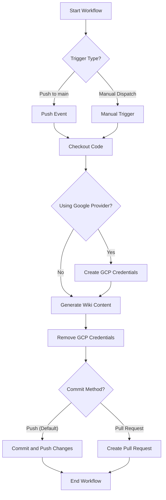
Sources: [README.md](GitHub Action section)

### 2. Docker Compose (Local)

For local execution with a UI, Docker Compose provides an easy setup:
1.  **Configure `.env`**: Copy `.env.example` to `.env` and set API keys and optional Notion sync settings.
2.  **Run**: `docker-compose up --build`
3.  **Access**: Web UI at `http://localhost:8501`, API Docs at `http://localhost:8000/docs`.

Sources: [README.md](Docker Compose section)

### 3. Local Python Development

For developers modifying the source code:
1.  **Prerequisites**: Python 3.12+, `uv`.
2.  **Clone & Install**: `git clone ...`, `cd wiki-as-readme`, `uv sync`, `source .venv/bin/activate`.
3.  **Configure `.env`**: Copy `.env.example` to `.env`.
4.  **Run Backend**: `uv run uvicorn src.server:app --reload --port 8000`.
5.  **Run Frontend**: `uv run streamlit run src/app.py`.

Sources: [README.md](Local Python Development section)

### 4. Server & Webhooks

The API server can be deployed as a long-running service to handle requests or webhooks.
*   **Endpoint**: `POST /api/v1/webhook/github`
*   **Payload**: Standard GitHub push event payload.
*   **Behavior**: Triggers a background task to generate the wiki and commit it back (requires `GIT_API_TOKEN`).

Sources: [README.md](Server & Webhooks section)

## Configuration Reference (`.env`)

The application's behavior is configured via environment variables, typically set in a `.env` file.

| Category | Variable | Description | Default |
|---|---|---|---|
| **LLM** | `LLM_PROVIDER` | `google`, `openai`, `anthropic`, `xai`, `openrouter`, `ollama` | `google` |
| | `MODEL_NAME` | Specific model identifier | `gemini-2.5-flash` |
| | `LLM_BASE_URL` | Custom base URL (e.g., for Ollama or proxies) | — |
| | `USE_STRUCTURED_OUTPUT` | Use native JSON mode (requires model support) | `true` |
| | `temperature` | LLM randomness (0.0 = deterministic, 1.0 = creative) | `0.0` |
| | `max_retries` | Retry count for failed LLM requests | `3` |
| | `max_concurrency` | Max parallel LLM calls (prevents rate limits) | `5` |
| **Auth** | `OPENAI_API_KEY` | OpenAI API Key | — |
| | `ANTHROPIC_API_KEY` | Anthropic API Key | — |
| | `OPENROUTER_API_KEY` | OpenRouter API Key | — |
| | `XAI_API_KEY` | xAI API Key | — |
| | `GIT_API_TOKEN` | GitHub/GitLab PAT for private repos | — |
| **GCP** | `GCP_PROJECT_NAME` | Vertex AI Project ID | — |
| | `GCP_MODEL_LOCATION` | Vertex AI Region | — |
| **Output** | `language` | Wiki language (`ko`, `en`, `ja`, etc.) | `en` |
| | `WIKI_OUTPUT_PATH` | Path to save generated wiki | `./WIKI.md` |
| | `LOCAL_REPO_PATH` | Local repo path for Docker mounting | `.` |
| | `IGNORED_PATTERNS` | **JSON array** of glob patterns to exclude from analysis | (see `config.py`) |
| **Notion** | `NOTION_SYNC_ENABLED` | Sync to Notion after generation | `false` |
| | `NOTION_API_KEY` | Notion Integration Token | — |
| | `NOTION_DATABASE_ID` | Target Notion Database ID | — |
| **Webhook** | `GITHUB_WEBHOOK_SECRET` | HMAC secret for webhook signature verification | — |

Sources: [README.md](Configuration Reference table)

## API Reference

The backend API is built with FastAPI, offering interactive Swagger documentation at `http://localhost:8000/docs`.

### Wiki Generation Endpoints

*   **`POST /api/v1/wiki/generate/file`**: Starts a background task to generate the wiki and save it as a Markdown file on the server.
*   **`POST /api/v1/wiki/generate/text`**: Starts a background task to generate the wiki, storing the result in the task status.
*   **`GET /api/v1/wiki/status/{task_id}`**: Retrieves the status and result of a generation task.

### Webhooks

*   **`POST /api/v1/webhook/github`**: Endpoint for GitHub Push event webhooks.
    *   Performs HMAC verification if `GITHUB_WEBHOOK_SECRET` is set.
    *   Prevents infinite loops by ignoring commits from `Wiki-As-Readme-Bot` or containing "via Wiki-As-Readme".
    *   Only triggers generation for `refs/heads/main` pushes.
    *   Requires `GITHUB_ACCESS_TOKEN` to commit changes back.

Sources: [README.md](API Reference section)

## Architecture

The project leverages a modern tech stack for its various components:

*   **Frontend:** Streamlit (User Interface)
*   **Backend:** FastAPI (REST API, Background Tasks)
*   **LLM Integration:** LiteLLM (Unified interface for 100+ LLMs)
*   **Data Models:** Pydantic (Type safety & Structured Output validation)
*   **Diagrams:** Mermaid.js

Sources: [README.md](Architecture section)

## Conclusion

Wiki As Readme provides a robust, flexible, and highly automated solution for generating comprehensive technical documentation from codebases. Its universal compatibility across LLMs, platforms, and deployment methods, combined with powerful features like deep context analysis and automatic diagram generation, makes it an invaluable tool for maintaining up-to-date and high-quality project documentation. The project actively welcomes contributions to further enhance its capabilities and integrations.

Sources: [README.md](Introduction, Contributing sections)

---

<a name="universal-compatibility"></a>

<details>
<summary>Relevant source files</summary>

The following files were used as context for generating this wiki page:

- [src/agent/llm.py](src/agent/llm.py)
- [src/providers/base.py](src/providers/base.py)
- [src/providers/github.py](src/providers/github.py)
- [src/providers/gitlab.py](src/providers/gitlab.py)
- [src/providers/bitbucket.py](src/providers/bitbucket.py)
- [src/providers/local.py](src/providers/local.py)
- [Dockerfile](Dockerfile)
- [Dockerfile.action](Dockerfile.action)
- [Dockerfile.server](Dockerfile.server)
</details>

# Universal Compatibility

## Introduction

The "wiki-as-readme" project is designed with a strong emphasis on universal compatibility, ensuring it can interact with a wide array of external services and be deployed across diverse environments. This compatibility is achieved through modular design, abstract interfaces, and flexible configuration. The core aspects of this universal compatibility include support for multiple Large Language Model (LLM) providers, various Git repository hosting services, and adaptable deployment strategies via Docker. This document details the architectural patterns and implementations that enable this broad interoperability.

## LLM Provider Compatibility

The system leverages `LiteLLM` to provide a unified interface for interacting with different LLM providers. This abstraction allows the application to switch between models and providers with minimal code changes, primarily driven by configuration settings.

### LLMWikiMaker

The `LLMWikiMaker` class acts as the primary wrapper for LLM interactions. It is designed to handle provider-specific configurations and API calls, ensuring type-safe structured output when a `response_schema` is provided.

Sources: [src/agent/llm.py](LLMWikiMaker class)

```python
class LLMWikiMaker[T: BaseModel]:
    """
    Wrapper for LiteLLM to perform wiki generation tasks.
    Supports Structured Output with Type Safety via Generics.
    """
    # ...
```

### LLM Configuration Mechanism

The `_configure_llm` method within `LLMWikiMaker` is responsible for dynamically setting up the LLM client based on the `LLM_PROVIDER` and `MODEL_NAME` defined in the application's settings. It handles provider-specific model prefixes, API keys, and additional parameters.

Sources: [src/agent/llm.py](_configure_llm method)

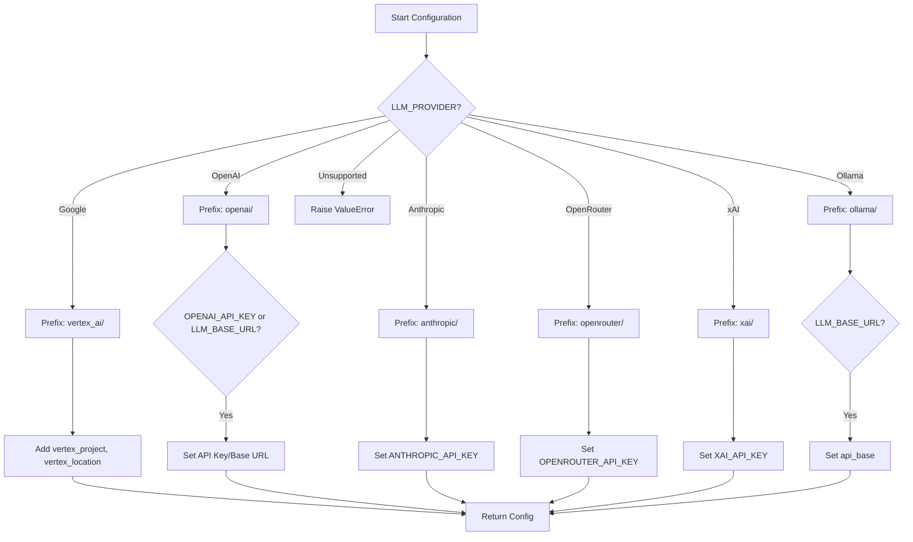

### Supported LLM Providers

The system currently supports the following LLM providers:

| Provider | Configuration Key | API Key Environment Variable | Notes |
|---|---|---|---|
| Google Vertex AI | `LLM_PROVIDER="google"` | N/A (uses GCP project/location) | Requires `GCP_PROJECT_NAME`, `GCP_MODEL_LOCATION` |
| OpenAI | `LLM_PROVIDER="openai"` | `OPENAI_API_KEY` | Supports custom `LLM_BASE_URL` for self-hosted or proxy |
| Anthropic | `LLM_PROVIDER="anthropic"` | `ANTHROPIC_API_KEY` | |
| OpenRouter | `LLM_PROVIDER="openrouter"` | `OPENROUTER_API_KEY` | |
| xAI (Grok) | `LLM_PROVIDER="xai"` | `XAI_API_KEY` | |
| Ollama | `LLM_PROVIDER="ollama"` | N/A | Primarily for local/on-premise models, uses `LLM_BASE_URL` |

## Repository Provider Compatibility

To achieve universal compatibility with various source code repositories, the project employs an abstract `RepositoryProvider` interface. This design allows the system to fetch repository structure and file content from different platforms without modifying the core logic that processes this data.

### RepositoryProvider Abstract Base Class

The `RepositoryProvider` class defines the common interface that all concrete repository providers must implement. This ensures a consistent contract for fetching repository metadata and file contents.

Sources: [src/providers/base.py](RepositoryProvider class)

```python
class RepositoryProvider(ABC):
    @abstractmethod
    async def fetch_structure(self) -> RepositoryStructure:
        """Method to fetch the file tree and README"""
        pass

    @abstractmethod
    async def fetch_file_content(self, file_path: str) -> str | None:
        """
        Method to fetch the content of a specific file.
        Specific logic must be implemented in each subclass (Local, GitHub, etc.).
        """
        pass
```

### Concrete Repository Implementations

Each supported repository service has its own dedicated provider class, inheriting from `RepositoryProvider` and implementing the abstract methods with service-specific API calls and authentication.

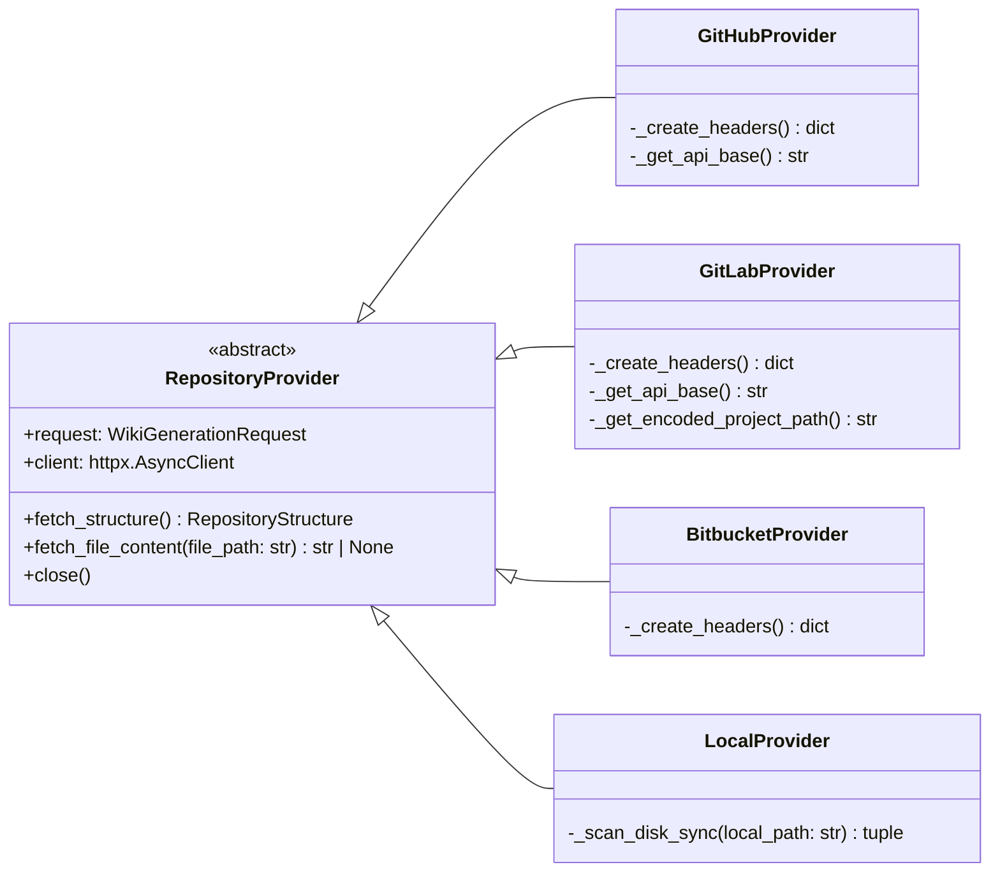

#### GitHubProvider

Interacts with the GitHub REST API to fetch repository trees, READMEs, and individual file contents. It handles GitHub-specific authentication (Personal Access Tokens) and Base64 decoding of file content.

Sources: [src/providers/github.py](GitHubProvider class)

#### GitLabProvider

Supports GitLab repositories, including self-hosted instances by parsing the repository URL. It uses GitLab's API for fetching project information, file trees (with pagination), and raw file content. It handles URL encoding for project paths.

Sources: [src/providers/gitlab.py](GitLabProvider class)

#### BitbucketProvider

Connects to the Bitbucket Cloud API (version 2.0). It fetches repository details, file trees (with pagination), and raw file content. Authentication uses Bearer tokens.

Sources: [src/providers/bitbucket.py](BitbucketProvider class)

#### LocalProvider

Designed to work with local filesystem paths. It scans directories, filters files based on ignore patterns, and reads READMEs and file contents directly from disk. CPU/disk-bound operations are offloaded to a thread pool using `asyncio.to_thread`.

Sources: [src/providers/local.py](LocalProvider class)

### Supported Repository Providers

| Provider | API Used | Authentication | Special Notes |
|---|---|---|---|
| GitHub | GitHub REST API v3 | `GIT_API_TOKEN` (Personal Access Token) | Decodes Base64 content |
| GitLab | GitLab API v4 | `GIT_API_TOKEN` (Private Token) | Supports self-hosted instances via URL parsing |
| Bitbucket | Bitbucket Cloud API v2.0 | `GIT_API_TOKEN` (OAuth Bearer Token) | |
| Local Filesystem | OS file system operations | N/A | Scans local directories, offloads I/O to threads |

## Deployment Compatibility (Docker)

The project provides multiple Dockerfiles to ensure it can be deployed and run in various contexts: as a full application, a GitHub Action, or a dedicated API server. All Dockerfiles leverage multi-stage builds for optimized image size and consistent dependency management using `uv`.

### Dockerfile (`Dockerfile`)

This Dockerfile builds the full application, including both the API and UI components. It sets up a non-root user (`appuser`) and exposes ports for both the API (8000) and Streamlit UI (8501).

Sources: [Dockerfile](Dockerfile)

### Dockerfile.action (`Dockerfile.action`)

Specifically tailored for the GitHub Actions environment. This image includes only the necessary dependencies for the action (`--extra notion`) and sets the entrypoint to `src/action_entrypoint.py`. It configures the working directory to `/github/workspace` as expected by GitHub Actions.

Sources: [Dockerfile.action](Dockerfile.action)

### Dockerfile.server (`Dockerfile.server`)

Creates a lean image for deploying only the API server. It installs only API-related dependencies (`--extra api`) and uses `gunicorn` with `uvicorn.workers.UvicornWorker` as the command to serve the FastAPI application. It exposes port 8000.

Sources: [Dockerfile.server](Dockerfile.server)

## Conclusion

The "wiki-as-readme" project's commitment to universal compatibility is evident in its modular architecture for LLM and repository integrations, as well as its flexible deployment options. By abstracting external services and providing tailored Docker images, the system ensures broad applicability and ease of integration into diverse development workflows and infrastructure environments. This design philosophy significantly enhances the project's versatility and maintainability.

---

<a name="core-features-explained"></a>

<details>
<summary>Relevant source files</summary>

The following files were used as context for generating this wiki page:

- [src/services/structure_analyzer.py](src/services/structure_analyzer.py)
- [src/services/wiki_generator.py](src/services/wiki_generator.py)
- [src/prompts/wiki_contents_generator.yaml](src/prompts/wiki_contents_generator.yaml)
- [src/prompts/wiki_structure_generator.yaml](src/prompts/wiki_structure_generator.yaml)
- [src/services/wiki_formatter.py](src/services/wiki_formatter.py)
</details>

# Core Features Explained

## Introduction

This document outlines the core features and architectural components responsible for the automated generation of technical wikis from a given software repository. The system leverages Large Language Models (LLMs) to understand repository structure, determine relevant wiki pages, generate their content, and finally consolidate them into a cohesive Markdown document. The primary services involved are `WikiGenerationService`, `WikiStructureDeterminer`, and `WikiFormatter`, supported by prompt templates that guide the LLM's behavior.

## Overall Architecture and Workflow

The wiki generation process is orchestrated by the `WikiGenerationService`, which acts as the main entry point. It coordinates several sub-services to perform distinct tasks: fetching repository data, determining the wiki's structure, generating content for each page, and finally formatting the output. This modular design allows for flexibility, such as human-in-the-loop interventions after structure determination but before content generation.

Here's a high-level overview of the wiki generation flow:

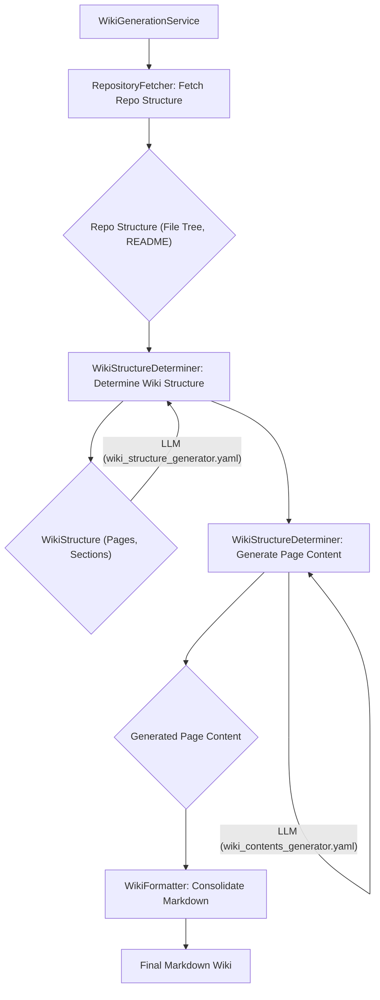
Sources: [src/services/wiki_generator.py](WikiGenerationService class), [src/services/structure_analyzer.py](WikiStructureDeterminer class), [src/services/wiki_formatter.py](WikiFormatter class)

## Key Components

### 1. WikiGenerationService

The `WikiGenerationService` is the central coordinator for the entire wiki generation pipeline. It encapsulates the end-to-end process, from initial request validation to saving the final Markdown output.

#### Responsibilities:
*   **Request Validation**: Ensures that the input `WikiGenerationRequest` is valid (e.g., `local_path` for local repos, `repo_owner`/`repo_name` for GitHub repos).
*   **Orchestration**: Manages the sequence of operations: fetching repository data, initializing the `WikiStructureDeterminer`, waiting for content generation to complete, and invoking the `WikiFormatter`.
*   **Flow Control**: Supports both fully automated (auto-pilot) generation and human-in-the-loop scenarios where the structure can be reviewed before content generation proceeds.
*   **Resource Management**: Ensures proper cleanup of resources, such as closing the `WikiStructureDeterminer`'s internal fetcher.

#### Core Methods:
*   `generate_wiki_with_structure()`: The main method that executes the full pipeline, returning the consolidated Markdown along with the generated structure and individual page contents.
*   `prepare_generation()`: Initializes the `WikiStructureDeterminer` and fetches the initial structure, useful for scenarios where structure needs to be confirmed before content generation.
*   `_initialize_and_determine()`: An internal helper that fetches repository structure and then uses `WikiStructureDeterminer` to propose the wiki's layout.
*   `_wait_for_completion()`: Monitors the `WikiStructureDeterminer`'s state to await the completion of all page content generation tasks.

Sources: [src/services/wiki_generator.py](WikiGenerationService class)

### 2. WikiStructureDeterminer

The `WikiStructureDeterminer` is a critical service responsible for interacting with LLMs to define the wiki's structure and generate the content for each page. It manages the state of the generation process, including pages in progress, generated content, and any errors.

#### Responsibilities:
*   **Structure Determination**: Invokes an LLM (using `wiki_structure_generator.yaml` prompt) to analyze the repository's file tree and README, proposing a `WikiStructure` (sections and pages).
*   **Content Generation**: For each page defined in the `WikiStructure`, it fetches relevant source files and then invokes an LLM (using `wiki_contents_generator.yaml` prompt) to generate the page's Markdown content.
*   **File Fetching**: Asynchronously fetches the content of specified source files from the repository using `RepositoryFetcher`.
*   **Prompt Management**: Loads and renders Jinja2 prompt templates from YAML files.
*   **Concurrency Control**: Uses `asyncio.Semaphore` to limit the number of concurrent LLM calls, preventing rate limit issues and managing resource usage.
*   **State Management**: Tracks the progress of page generation, loading states, and errors.

#### Core Methods:
*   `determine_wiki_structure(file_tree, readme)`: Orchestrates the LLM call to generate the overall `WikiStructure`.
*   `generate_page_content(page, language)`: Handles the generation of content for a single `WikiPage`, including fetching files, rendering the prompt, and invoking the LLM.
*   `_fetch_and_format_files(page)`: Fetches the content of files specified for a given page in parallel and formats them for LLM input.
*   `_load_prompt_template(prompt_path)`: Loads and caches prompt templates from YAML files.
*   `_start_content_generation_flow(language)`: Manages the asynchronous execution of all page content generation tasks.

Sources: [src/services/structure_analyzer.py](WikiStructureDeterminer class)

### 3. WikiFormatter

The `WikiFormatter` service is responsible for taking the generated `WikiStructure` and the individual page contents, then consolidating them into a single, well-structured Markdown document.

#### Responsibilities:
*   **Markdown Consolidation**: Combines the wiki title, description, a generated Table of Contents, and the content of all individual pages into one Markdown string.
*   **Anchor Generation**: Creates HTML anchors for each page title to enable internal linking from the Table of Contents.
*   **Filename Sanitization**: Provides a utility to sanitize strings for use as filenames or URL slugs.

#### Core Methods:
*   `consolidate_markdown(structure, pages)`: The primary method that performs the consolidation. It iterates through the `WikiStructure`'s pages, retrieves their content, and assembles the final Markdown.
*   `sanitize_filename(name)`: Cleans a given string to make it safe for use in file paths or URL anchors.

Sources: [src/services/wiki_formatter.py](WikiFormatter class)

### 4. Prompt Templates

Prompt templates are crucial for guiding the LLM's behavior and ensuring consistent, high-quality output. They define the instructions, context, and expected format for the LLM's responses.

#### a. `wiki_structure_generator.yaml`

This prompt is used by the `WikiStructureDeterminer` to instruct the LLM on how to analyze a repository and propose a `WikiStructure`.

*   **Purpose**: To generate a JSON object conforming to the `WikiStructure` Pydantic model, detailing sections, pages, and their associated file paths.
*   **Inputs**: Repository owner, name, file tree, README content, desired language, and whether a comprehensive view is requested.
*   **Key Instructions**: Focuses on creating a logical hierarchy, selecting relevant file paths for each page, and adhering strictly to the `WikiStructure` JSON schema.

Sources: [src/prompts/wiki_structure_generator.yaml](template content)

#### b. `wiki_contents_generator.yaml`

This prompt is used by the `WikiStructureDeterminer` to instruct the LLM on how to generate the Markdown content for an individual wiki page.

*   **Purpose**: To produce a comprehensive and accurate Markdown page based on a specific topic and provided source file content.
*   **Inputs**: Page title, list of file URLs, actual content of relevant source files, desired language, and a flag for structured output.
*   **Key Instructions**:
    *   **Source Context**: Mandates an initial `<details>` block listing all source files used.
    *   **Content Structure**: Defines a standard structure (Introduction, Detailed Sections, Conclusion).
    *   **Visuals**: Encourages the use of Mermaid diagrams for clarity, with strict syntax rules (e.g., "Universal Quote" rule for labels, avoiding reserved keywords).
    *   **Tables**: Specifies formatting rules for Markdown tables.
    *   **Citations**: Requires citing sources for claims, explanations, or code snippets using a specific format (`Sources: [Absolute File URL](line_number_or_function_name)`).
    *   **Formatting**: Crucially, it instructs the LLM to return raw Markdown text directly, without wrapping it in code blocks.

Sources: [src/prompts/wiki_contents_generator.yaml](template content)

## Conclusion

The core features of this wiki generation system are built upon a robust architecture that separates concerns into distinct services: `WikiGenerationService` for orchestration, `WikiStructureDeterminer` for LLM interaction and content generation, and `WikiFormatter` for final output assembly. The intelligent use of prompt templates ensures that LLMs are effectively guided to produce structured, accurate, and well-formatted technical documentation, making the process efficient and scalable.

---

<a name="github-action-integration"></a>

<details>
<summary>Relevant source files</summary>

The following files were used as context for generating this wiki page:

- [.github/workflows/wiki-as-readme-action.yml](.github/workflows/wiki-as-readme-action.yml)
- [action.yml](action.yml)
- [WIKI-AS-README-AS-ACTION.yml](WIKI-AS-README-AS-ACTION.yml)
</details>

# GitHub Action Integration

## Introduction

The `Wiki-As-Readme` project provides a robust GitHub Action that automates the generation of comprehensive wiki content (typically a `README.md` or `WIKI.md` file) directly from a codebase. This action leverages Large Language Models (LLMs) to analyze repository content and synthesize documentation. It can be integrated into CI/CD pipelines to ensure documentation remains up-to-date with code changes, or triggered manually for on-demand generation with custom parameters. The action also supports optional synchronization with Notion databases.

This document details the architecture, configuration, and usage of the `Wiki-As-Readme` GitHub Action, covering its definition, workflow integration, and various customization options.

## Action Definition (`action.yml`)

The core of the GitHub Action is defined in `action.yml`. This file specifies the action's metadata, inputs, and how it executes. The action runs as a Docker container, encapsulating all its dependencies.

### Action Metadata

| Field | Description |
|---|---|
| `name` | `Wiki-As-Readme` |
| `description` | 'Generate a comprehensive README.md/Wiki from your codebase using LLM' |
| `author` | `catuscio` |
| `branding` | `icon: 'book-open'`, `color: 'blue'` |
| `runs.using` | `docker` |
| `runs.image` | `Dockerfile.action` |
Sources: [action.yml](action.yml)

### Action Inputs

The `action.yml` defines various inputs that allow users to customize the behavior of the `Wiki-As-Readme` action. These inputs are mapped directly to environment variables within the Docker container that executes the action.

| Input Name | Description | Required | Default | Category |
|---|---|---|---|---|
| `language` | Language for the generated content (e.g., `ko`, `en`) | `false` | `en` | Basic |
| `wiki_output_path` | The file path to save the generated wiki content | `false` | `WIKI.md` | Basic |
| `llm_provider` | LLM provider (`google`, `openai`, `anthropic`, `openrouter`, `xai`, `ollama`) | `false` | `google` | LLM Configuration |
| `model_name` | Specific model name to use | `false` | `gemini-2.5-flash` | LLM Configuration |
| `openai_api_key` | OpenAI API Key | `false` | | API Keys |
| `anthropic_api_key` | Anthropic API Key | `false` | | API Keys |
| `openrouter_api_key` | OpenRouter API Key | `false` | | API Keys |
| `xai_api_key` | xAI API Key | `false` | | API Keys |
| `git_api_token` | GitHub/GitLab API Token for private repos | `false` | | API Keys |
| `gcp_project_name` | GCP Project Name | `false` | | GCP Configuration |
| `gcp_model_location` | GCP Model Location | `false` | | GCP Configuration |
| `google_application_credentials` | GCP Service Account JSON Key (Content or Path) | `false` | | GCP Configuration |
| `llm_base_url` | Custom base URL for LLM API | `false` | | Advanced LLM |
| `use_structured_output` | Whether to use structured JSON output | `false` | `true` | Advanced LLM |
| `temperature` | LLM temperature (0.0 to 1.0) | `false` | `0.0` | Advanced LLM |
| `max_retries` | Max retry attempts | `false` | `3` | Advanced LLM |
| `max_concurrency` | Max parallel LLM calls | `false` | `5` | Advanced LLM |
| `ignored_patterns` | JSON array of glob patterns to ignore | `false` | `[]` | Advanced LLM |
Sources: [action.yml](action.yml)

## Workflow Integration

The `Wiki-As-Readme` action is typically integrated into a GitHub Actions workflow (`.github/workflows/*.yml`). Two example workflow files are provided: `.github/workflows/wiki-as-readme-action.yml` and `WIKI-AS-README-AS-ACTION.yml`. Both define a job named `wiki-time` that orchestrates the documentation generation process.

### Workflow Triggers

The workflow can be triggered in two primary ways:

1.  **`push` event:** Automatically runs when changes are pushed to the `main` branch. It is configured to ignore changes to `README.md`, `WIKI.md`, and the workflow file itself to prevent infinite loops.
    *   Example: `WIKI-AS-README-AS-ACTION.yml`
2.  **`workflow_dispatch` event:** Allows manual triggering from the GitHub UI, providing an interface to customize input parameters for each run.
    *   Example: Both workflow files.

#### `workflow_dispatch` Inputs

When manually triggering the workflow, the following inputs can be provided:

| Input Name | Description | Type | Required | Default |
|---|---|---|---|---|
| `language` | Language code (e.g., `ko`, `en`, `ja`, etc.) | `string` | `false` | `en` |
| `llm_provider` | LLM Provider (`google`, `openai`, `anthropic`, etc.) | `string` | `false` | `google` |
| `model_name` | Model Name | `string` | `false` | `gemini-2.5-flash` |
| `sync_to_notion` | Sync to Notion? (`true`/`false`) | `boolean` | `false` | `false` |
| `commit_method` | How to apply changes | `choice` | `false` | `pull-request` (in `wiki-as-readme-action.yml`), `push` (in `WIKI-AS-README-AS-ACTION.yml`) |
Sources: [.github/workflows/wiki-as-readme-action.yml](.github/workflows/wiki-as-readme-action.yml), [WIKI-AS-README-AS-ACTION.yml](WIKI-AS-README-AS-ACTION.yml)

### Workflow Job: `wiki-time`

The `wiki-time` job is responsible for executing the steps required to generate and commit the wiki content.

*   **`runs-on`**: `ubuntu-latest`
*   **`permissions`**:
    *   `contents: write`: Required to commit changes to the repository.
    *   `pull-requests: write`: Required to create pull requests.
*   **`env`**:
    *   `WIKI_OUTPUT_PATH`: Defines the target file path for the generated wiki. Defaults to `"examples/wiki_as_README.md"` in one workflow and `"WIKI.md"` in another.

#### Workflow Steps

The `wiki-time` job consists of several sequential steps:

1.  **Checkout code**: Uses `actions/checkout@v4` to clone the repository.
2.  **Create GCP Credentials File (Optional)**:
    *   This step is conditional, running only if `llm_provider` is `google` (or undefined, defaulting to `google`), or if the event is a `push`.
    *   It creates a `gcp-key.json` file from the `GOOGLE_APPLICATION_CREDENTIALS` secret. A warning is issued if the secret is missing.
3.  **Generate Content (and Sync to Notion if enabled)**:
    *   This is the core step, invoking the `Wiki-As-Readme` action using its Docker image: `docker://ghcr.io/catuscio/wiki-as-readme-action:latest`.
    *   It passes various configuration parameters as environment variables to the action, sourcing them from workflow inputs, secrets, or default values.
    *   **Key Environment Variables Passed:**
        *   `LANGUAGE`: From `inputs.language` or defaults to `en`.
        *   `WIKI_OUTPUT_PATH`: From the job's `env.WIKI_OUTPUT_PATH`.
        *   `LLM_PROVIDER`: From `inputs.llm_provider` or defaults to `google`.
        *   `MODEL_NAME`: From `inputs.model_name` or defaults to `gemini-2.5-flash`.
        *   `GCP_PROJECT_NAME`, `GCP_MODEL_LOCATION`: From GitHub secrets.
        *   `GOOGLE_APPLICATION_CREDENTIALS`: Points to the `/github/workspace/gcp-key.json` file created in the previous step.
        *   `OPENAI_API_KEY`, `ANTHROPIC_API_KEY`: From GitHub secrets.
        *   `GIT_API_TOKEN`: Uses the built-in `GITHUB_TOKEN` secret.
        *   `NOTION_SYNC_ENABLED`: Set to `true` only if `inputs.sync_to_notion` is `true`, otherwise `false`.
        *   `NOTION_API_KEY`, `NOTION_DATABASE_ID`: From GitHub secrets.
4.  **Remove GCP Credentials File (Optional)**:
    *   This step runs `always()` to ensure the `gcp-key.json` file is removed for security reasons, regardless of previous step outcomes.
5.  **Commit and Push Changes (Update file in GitHub Repo)**:
    *   This step is conditional based on the `commit_method` input or if the trigger was a `push` event.
    *   It uses `stefanzweifel/git-auto-commit-action@v5` to directly commit and push the generated file.
6.  **Create Pull Request**:
    *   This step is conditional, running only if `commit_method` is `pull-request`.
    *   It uses `peter-evans/create-pull-request@v7` to create a new pull request with the updated wiki content. The PR includes a descriptive title and body.

### Workflow Execution Flow

The following diagram illustrates the high-level execution flow of the `wiki-time` job:

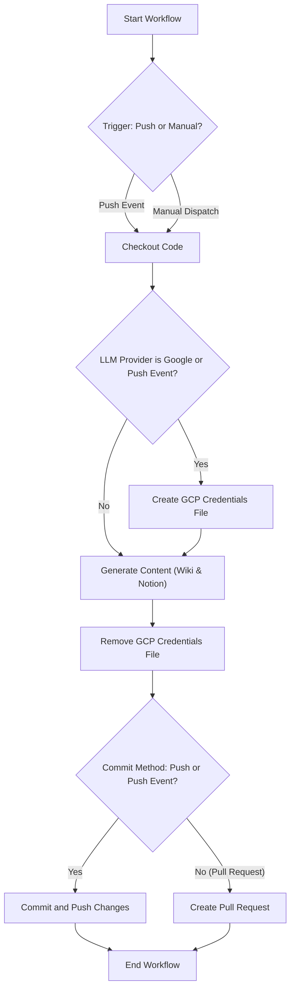
Sources: [.github/workflows/wiki-as-readme-action.yml](.github/workflows/wiki-as-readme-action.yml), [WIKI-AS-README-AS-ACTION.yml](WIKI-AS-README-AS-ACTION.yml)

## Conclusion

The `Wiki-As-Readme` GitHub Action provides a powerful and flexible solution for automating documentation generation. By integrating it into a CI/CD pipeline, projects can maintain up-to-date, LLM-generated wiki content with minimal manual effort. The action's extensive configuration options, including support for various LLM providers, output formats, and commit strategies, make it adaptable to diverse project requirements.

---

<a name="local-deployment-with-docker"></a>

<details>
<summary>Relevant source files</summary>

The following files were used as context for generating this wiki page:

- [docker-compose.yml](docker-compose.yml)
- [Dockerfile](Dockerfile)
- [Dockerfile.server](Dockerfile.server)
- [.env.example](.env.example)
</details>

# Local Deployment with Docker

## Introduction

This document outlines the process and configuration for deploying the `wiki-as-readme` application locally using Docker. Docker provides a consistent and isolated environment, ensuring that the application runs reliably regardless of the host system's configuration. The project offers two main deployment options: a full application stack including both the API and the Streamlit UI, or a standalone API server. Both options leverage Docker Compose for orchestration and environment management.

## Core Components

Local deployment is managed through a set of Docker-related files that define how the application is built, configured, and run.

### 1. Docker Compose Configuration (`docker-compose.yml`)

The `docker-compose.yml` file orchestrates the services required for the local deployment. It defines a single service, `wiki-as-readme`, which encapsulates the entire application.

**Service Definition:**

*   **`build: .`**: Instructs Docker Compose to build the image using the `Dockerfile` located in the current directory. This defaults to the `Dockerfile` which includes both API and UI components.
*   **`container_name: wiki-as-readme`**: Assigns a fixed name to the running container for easier identification.
*   **`ports`**:
    *   `"8000:8000"`: Maps the container's API port (8000) to the host's port 8000.
    *   `"8501:8501"`: Maps the container's Streamlit UI port (8501) to the host's port 8501.
*   **`env_file: - .env`**: Specifies that environment variables defined in a `.env` file (which should be created from `.env.example`) will be loaded into the container.
*   **`environment`**: Allows for direct environment variable overrides or additions.
    *   `GOOGLE_APPLICATION_CREDENTIALS=/app/credentials.json`: Configures the path to Google Cloud credentials *inside* the container, if Google Cloud (Vertex AI) is used. This line should be commented out otherwise.
*   **`volumes`**: Mounts host directories into the container, enabling data persistence and access to local files.
    *   `${WIKI_OUTPUT_PATH:-./output}:/app/output`: Mounts a host directory (defaulting to `./output` if `WIKI_OUTPUT_PATH` is not set) to `/app/output` inside the container. This is where generated wiki files will be saved.
    *   `${GOOGLE_CREDENTIALS_PATH:-./credentials.json}:/app/credentials.json`: Mounts the host's Google Cloud credentials file (defaulting to `./credentials.json`) to `/app/credentials.json` inside the container. This is conditional for Google Cloud usage.
    *   `${LOCAL_REPO_PATH:-./}:/app/target_repo`: Mounts the local repository to be analyzed (defaulting to the current directory) to `/app/target_repo` inside the container.
*   **`restart: always`**: Ensures the container automatically restarts if it stops for any reason.

Sources: [docker-compose.yml](docker-compose.yml)

### 2. Dockerfile (Full Application: API + UI)

This `Dockerfile` builds the primary image containing both the API server and the Streamlit user interface. It uses a multi-stage build process for efficiency and smaller final image size.

#### Stage 1: Builder

*   **Base Image**: `python:3.12-slim-bookworm`.
*   **Dependency Manager**: Copies `uv` (a fast Python package installer) into the image.
*   **Working Directory**: Sets `/app`.
*   **Environment Variables**: `UV_COMPILE_BYTECODE=1` and `UV_LINK_MODE=copy` optimize `uv`'s behavior.
*   **Dependency Installation**: Copies `pyproject.toml` and `uv.lock` and then runs `uv sync --frozen --no-dev --no-install-project --extra all` to install all project dependencies, including those for both the API and UI.

#### Stage 2: Final Image

*   **Base Image**: `python:3.12-slim-bookworm`.
*   **Metadata**: Includes `LABEL` instructions for maintainer, description, source, license, authors, title, and version.
*   **User Setup**: Creates a non-root user `appuser` for security best practices.
*   **Working Directory**: Sets `/app`.
*   **Copy Artifacts**:
    *   Copies the virtual environment (`.venv`) from the builder stage.
    *   Copies the application source code (`src`).
    *   Copies the `entrypoint.sh` script.
*   **Permissions**: Sets ownership and executable permissions for `appuser`.
*   **Environment Variables**: Configures `PATH` to include the virtual environment's binaries and `PYTHONPATH` for module imports.
*   **Exposed Ports**: `EXPOSE 8000` (API) and `EXPOSE 8501` (Streamlit UI).
*   **User**: Switches to `appuser`.
*   **Command**: `CMD ["./entrypoint.sh"]` executes the entrypoint script when the container starts.

Sources: [Dockerfile](Dockerfile)

### 3. Dockerfile.server (API Server Only)

This `Dockerfile` is designed to build a lighter image containing only the API server, without the Streamlit UI. This is useful for deployments where only the API is needed, such as backend services or integration with other frontends.

#### Stage 1: Builder

*   Similar to the main `Dockerfile`'s builder stage.
*   **Dependency Installation**: `RUN uv sync --frozen --no-dev --no-install-project --extra api` installs only the dependencies required for the API.

#### Stage 2: Final Image

*   Similar to the main `Dockerfile`'s final stage, but with specific differences:
    *   **Metadata**: Labels are updated to reflect "API Server for wiki-as-readme".
    *   **Exposed Ports**: Only `EXPOSE 8000` (API).
    *   **Command**: `CMD ["gunicorn", "-k", "uvicorn.workers.UvicornWorker", "--bind", "0.0.0.0:8000", "--workers", "2", "--access-logfile", "-", "--error-logfile", "-", "src.server:app"]`. This command starts the Gunicorn WSGI HTTP server, using Uvicorn workers, binding to port 8000, with 2 worker processes, and logging to stdout/stderr.

Sources: [Dockerfile.server](Dockerfile.server)

### 4. Environment Configuration (`.env.example`)

The `.env.example` file provides a template for configuring various aspects of the application, including LLM providers, API keys, and crucial paths for Docker volumes. A `.env` file should be created based on this example and placed in the same directory as `docker-compose.yml`.

Key variables relevant to Docker deployment include:

*   **`LOCAL_REPO_PATH`**: Specifies the absolute path on the host machine to the repository that `wiki-as-readme` should analyze. This path is mounted into the container at `/app/target_repo`.
*   **`WIKI_OUTPUT_PATH`**: Specifies the absolute path on the host machine where the generated wiki files will be saved. This path is mounted into the container at `/app/output`.
*   **`GOOGLE_CREDENTIALS_PATH`**: Specifies the absolute path on the host machine to the Google Cloud Service Account JSON key file. This is mounted into the container at `/app/credentials.json` when using Google Cloud.

Other variables like `LLM_PROVIDER`, `MODEL_NAME`, `OPENAI_API_KEY`, etc., configure the application's behavior within the Docker container.

Sources: [.env.example](.env.example)

## Deployment Architecture Flow

The following diagram illustrates how Docker Compose orchestrates the build and runtime environment for the `wiki-as-readme` application.

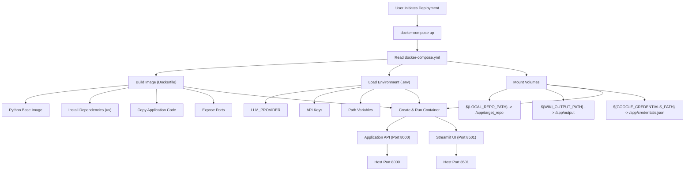

## Configuration Options

The `.env` file (derived from `.env.example`) is central to configuring the application within the Docker environment. Below are the key configuration parameters directly impacting Docker deployment and application behavior.

| Parameter | Description | Default (in `docker-compose.yml`) |
|---|---|---|
| `LOCAL_REPO_PATH` | Absolute path on the host to the repository to be analyzed. | `./` (current directory) |
| `WIKI_OUTPUT_PATH` | Absolute path on the host where generated wiki files will be saved. | `./output` |
| `GOOGLE_CREDENTIALS_PATH` | Absolute path on the host to the Google Cloud Service Account JSON key file. | `./credentials.json` |
| `LLM_PROVIDER` | Specifies the Large Language Model provider (e.g., `google`, `openai`). | `google` |
| `MODEL_NAME` | The specific LLM model identifier to use. | `gemini-2.5-flash` |
| `OPENAI_API_KEY` | API key for OpenAI services. | (empty) |
| `ANTHROPIC_API_KEY` | API key for Anthropic services. | (empty) |
| `LLM_BASE_URL` | Optional custom base URL for LLM API (e.g., for Ollama). | (empty) |
| `USE_STRUCTURED_OUTPUT` | Whether to request structured JSON output from the LLM. | `true` |
| `temperature` | LLM generation temperature (0.0 for deterministic, 1.0 for creative). | `0.0` |
| `max_retries` | Maximum retry attempts for failed LLM requests. | `3` |
| `max_concurrency` | Limit for parallel LLM calls. | `5` |
| `IGNORED_PATTERNS` | JSON array string of glob patterns to exclude files from analysis. | (empty, uses internal defaults) |
| `GIT_API_TOKEN` | GitHub/GitLab personal access token for private repos or higher rate limits. | (empty) |
| `language` | Target language for the generated wiki. | `en` |
| `GCP_PROJECT_NAME` | Google Cloud Project Name (for Vertex AI). | (empty) |
| `GCP_MODEL_LOCATION` | Google Cloud Model Location (for Vertex AI). | (empty) |
| `NOTION_SYNC_ENABLED` | Enable automatic sync to Notion. | `false` |
| `NOTION_API_KEY` | Notion Integration Token. | (empty) |
| `NOTION_DATABASE_ID` | Notion Database ID for syncing. | (empty) |

Sources: [.env.example](.env.example)

## Conclusion

Docker provides a robust and reproducible environment for deploying `wiki-as-readme` locally. By leveraging `docker-compose.yml`, `Dockerfile`, and `Dockerfile.server`, users can easily set up either a full application stack (API + UI) or a dedicated API server. The `.env` file allows for flexible configuration of LLM providers, API keys, and crucial path mappings, ensuring the application integrates seamlessly with local development workflows and external services. This containerized approach simplifies setup, eliminates dependency conflicts, and ensures consistent behavior across different development machines.

---

<a name="local-python-development-guide"></a>

<details>
<summary>Relevant source files</summary>

The following files were used as context for generating this wiki page:

- [pyproject.toml](pyproject.toml)
- [src/server.py](src/server.py)
- [src/app.py](src/app.py)
- [.python-version](.python-version)
</details>

# Local Python Development Guide

This guide provides comprehensive instructions for setting up and running the `wiki-as-readme` project in a local Python development environment. It covers project setup, dependency management, running the FastAPI backend API, and launching the Streamlit-based user interface.

The `wiki-as-readme` project aims to transform codebase information into a comprehensive wiki, offering both a programmatic API and an interactive UI for generation. This guide focuses on getting these components operational for local development and testing.

## 1. Project Setup and Environment

To begin local development, ensure you have the correct Python version and install the necessary project dependencies.

### 1.1 Python Version

The project explicitly requires Python 3.12 or newer.
Sources: [.python-version](3.12), [pyproject.toml](project.requires-python)

```bash
python --version
# Expected output: Python 3.12.x
```

It is recommended to use a tool like `pyenv` or `conda` to manage Python versions and virtual environments.

### 1.2 Dependency Installation

The project uses `pyproject.toml` for dependency management. It defines core dependencies, optional feature-specific dependencies, and development dependencies.

1.  **Create a Virtual Environment (Recommended):**
    ```bash
    python -m venv .venv
    source .venv/bin/activate # On Windows: .venv\Scripts\activate
    ```

2.  **Install Core and Development Dependencies:**
    The `pyproject.toml` specifies core dependencies and a `dev` group for development tools like `pre-commit` and `ruff`.
    Sources: [pyproject.toml](project.dependencies), [pyproject.toml](dependency-groups.dev)

    ```bash
    pip install -e ".[dev]"
    ```
    The `-e .` installs the project in editable mode, which is useful for local development.

3.  **Install Optional Dependencies (UI and API):**
    To run both the FastAPI server and the Streamlit UI, you need to install their respective optional dependency groups. The `all` group conveniently includes `ui`, `api`, and `notion`.
    Sources: [pyproject.toml](project.optional-dependencies.ui), [pyproject.toml](project.optional-dependencies.api), [pyproject.toml](project.optional-dependencies.all)

    ```bash
    pip install -e ".[all]"
    ```
    Alternatively, you can install them separately:
    ```bash
    pip install -e ".[ui,api]"
    ```

### 1.3 Code Formatting and Linting

The project uses `ruff` for code formatting and linting, configured in `pyproject.toml`.
Sources: [pyproject.toml](tool.ruff)

To ensure code quality, you can run `ruff` manually:
```bash
ruff check .
ruff format .
```
It's also common to integrate `ruff` with `pre-commit` hooks for automatic checks before commits.

## 2. Running the FastAPI Backend API

The backend API is built with FastAPI and serves as the core logic for wiki generation.

### 2.1 API Entry Point

The FastAPI application is defined in `src/server.py`. It sets up the main application instance, includes API routers for wiki generation and webhooks, and provides a health check endpoint.
Sources: [src/server.py](app = FastAPI(...)), [src/server.py](app.include_router)

### 2.2 Starting the Server

The server can be started using `uvicorn`, which is included in the `api` optional dependency group.
Sources: [src/server.py](if __name__ == "__main__":)

```bash
python src/server.py
```

This command will start the server on `http://127.0.0.1:8000` with auto-reloading enabled for development.
You should see output similar to:
```
INFO:     Will watch for changes in these directories: ['/path/to/wiki-as-readme']
INFO:     Uvicorn running on http://127.0.0.1:8000 (Press CTRL+C to quit)
INFO:     Started reloader process [PID] using WatchFiles
INFO:     Started server process [PID]
INFO:     Waiting for application startup.
INFO:     Application startup complete.
```

### 2.3 Key API Endpoints

*   **Health Check:** `GET /`
*   **Wiki Generation:** `POST /api/v1/wiki/generate/file` (to start a generation task)
*   **Task Status:** `GET /api/v1/wiki/status/{task_id}`

## 3. Running the Streamlit User Interface

The Streamlit application provides an interactive web interface to trigger wiki generation and view results.

### 3.1 UI Entry Point

The Streamlit application's main entry point is `src/app.py`. It handles user input, interacts with the FastAPI backend, and renders the generated markdown.
Sources: [src/app.py](main function)

### 3.2 Starting the UI

To run the Streamlit application, execute the following command from the project root:

```bash
streamlit run src/app.py
```

This will typically open a new tab in your web browser pointing to `http://localhost:8501` (or another available port).

### 3.3 UI-API Interaction

The Streamlit UI communicates with the FastAPI backend. By default, it expects the API to be running at `http://localhost:8000/api/v1`. This base URL can be configured via the `API_BASE_URL` environment variable.
Sources: [src/app.py](API_BASE_URL)

The UI performs the following key interactions:
*   **`start_generation_task`**: Sends a `POST` request to `/api/v1/wiki/generate/file` to initiate a wiki generation.
*   **`poll_task_status`**: Periodically sends `GET` requests to `/api/v1/wiki/status/{task_id}` to check the progress and retrieve the result of a generation task.

### 3.4 UI Pages

The Streamlit application features two main pages:
*   **Generator**: Allows users to input repository details (URL or local path) and configuration options (e.g., comprehensive view, language) to start a new wiki generation.
    Sources: [src/app.py](render_generator_page)
*   **History**: Displays a list of previously generated wiki files, allowing users to view or download them. These files are stored in the `output` directory.
    Sources: [src/app.py](render_history_page), [src/app.py](OUTPUT_DIR)

## 4. Local Development Workflow

The typical local development workflow involves running both the API and the UI concurrently.

### 4.1 Architecture Overview

The following diagram illustrates the interaction between the user, the Streamlit UI, and the FastAPI API during a wiki generation request.

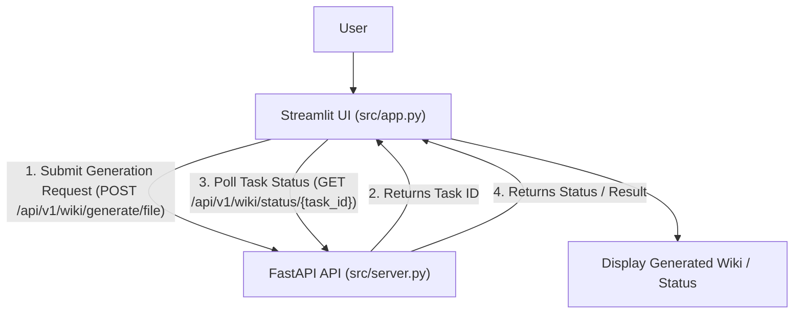

### 4.2 Steps to Run Locally

1.  **Open two terminal windows.**
2.  **In Terminal 1 (API Server):**
    ```bash
    # Activate virtual environment if not already active
    source .venv/bin/activate
    python src/server.py
    ```
    Verify the API server is running on `http://127.0.0.1:8000`.
3.  **In Terminal 2 (Streamlit UI):**
    ```bash
    # Activate virtual environment if not already active
    source .venv/bin/activate
    streamlit run src/app.py
    ```
    Verify the Streamlit UI is accessible in your browser, typically at `http://localhost:8501`.
4.  **Interact with the UI:** Use the Streamlit interface to provide a repository URL or local path and initiate wiki generation. The UI will communicate with the locally running FastAPI server.

## Conclusion

This guide has detailed the steps required to set up and run the `wiki-as-readme` project locally. By following these instructions, developers can get both the FastAPI backend and the Streamlit frontend operational, enabling local development, testing, and interaction with the wiki generation capabilities. Ensure all dependencies are installed and both services are running for a complete local development experience.

---

<a name="server-deployment-and-webhooks"></a>

<details>
<summary>Relevant source files</summary>

The following files were used as context for generating this wiki page:

- [src/server.py](src/server.py)
- [src/api/v1/endpoints/webhook.py](src/api/v1/endpoints/webhook.py)
- [src/models/github_webhook_schema.py](src/models/github_webhook_schema.py)
- [src/core/config.py](src/core/config.py)
</details>

# Server Deployment and Webhooks

This document details the server deployment strategy and the webhook integration mechanism within the "Wiki as Readme" project. The system leverages FastAPI to expose its API, with a particular focus on automating the wiki generation and update process through GitHub webhooks.

The core functionality involves a FastAPI application that serves various endpoints, including a dedicated webhook endpoint designed to listen for GitHub push events. Upon receiving a valid push event, the system triggers a background process to generate updated wiki content and commit it back to the repository, ensuring the `WIKI.md` file remains synchronized with the codebase.

## Server Architecture and Deployment

The "Wiki as Readme" application is built using FastAPI, providing a robust and high-performance web framework. The main entry point for the server is `src/server.py`.

### FastAPI Application Setup

The `FastAPI` application is initialized with metadata such as title, description, and version. It includes two primary API routers:
*   `/api/v1/wiki`: Handles wiki generation requests.
*   `/api/v1/webhook`: Manages webhook integrations, specifically for GitHub.

A basic health check endpoint (`/`) is also provided to verify server availability.

Sources: [src/server.py](src/server.py)

### Local Deployment

For local development and testing, the server can be run directly using `uvicorn`. The `if __name__ == "__main__":` block in `src/server.py` demonstrates this:

```python
if __name__ == "__main__":
    logger.info("Starting Wiki As Readme API server...")
    uvicorn.run("server:app", host="127.0.0.1", port=8000, reload=True)
```

This command starts the server on `http://127.0.0.1:8000` with auto-reloading enabled for development convenience. For production environments, the `host` parameter would typically be set to `"0.0.0.0"` to expose the server externally, and `reload=True` would be omitted.

Sources: [src/server.py](src/server.py)

### Server Component Diagram

The following diagram illustrates the high-level structure of the FastAPI application and its integrated routers.

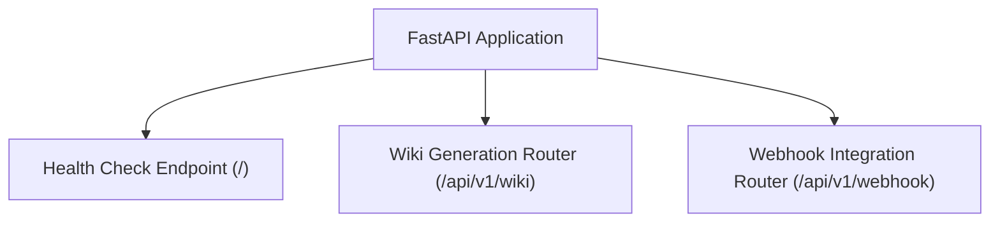

## Webhook Integration

The webhook integration module (`src/api/v1/endpoints/webhook.py`) is responsible for receiving and processing events from external services, primarily GitHub. Its main goal is to automate the `WIKI.md` update process whenever code changes are pushed to a repository.

Sources: [src/api/v1/endpoints/webhook.py](src/api/v1/endpoints/webhook.py)

### GitHub Webhook Endpoint

The primary webhook endpoint is `POST /api/v1/webhook/github`. This endpoint is designed to receive push event payloads from GitHub.

#### 1. Signature Verification

Upon receiving a request, the `verify_signature` function is called to ensure the request originates from GitHub and has not been tampered with. This is achieved by:
*   Checking for the `X-Hub-Signature-256` header.
*   Using the `GITHUB_WEBHOOK_SECRET` (an environment variable) to compute an HMAC SHA256 hash of the request body.
*   Comparing the computed hash with the one provided in the header.
If the signature is invalid or missing, a `403 Forbidden` HTTP exception is raised.

Sources: [src/api/v1/endpoints/webhook.py](verify_signature function)

#### 2. Payload Processing and Filtering

The incoming request body is parsed into a `GitHubPushPayload` Pydantic model, ensuring data integrity and structure. Before proceeding, several checks are performed to prevent unnecessary processing or infinite loops:
*   **Bot Commit Filtering:** Commits made by the `Wiki-As-Readme-Bot` (identified by `BOT_COMMITTER_NAME` or the commit message containing "via Wiki-As-Readme") are ignored. This prevents the bot from triggering new generations based on its own updates.
*   **Branch Filtering:** Only push events to the `main` branch are processed. Pushes to other branches are ignored.

Sources: [src/api/v1/endpoints/webhook.py](github_webhook function)

#### 3. Background Task Execution

If the payload passes all checks, the core logic is offloaded to a background task using FastAPI's `BackgroundTasks`. This ensures that the webhook endpoint responds quickly (with a `202 Accepted` status) while the potentially long-running wiki generation and GitHub update process occurs asynchronously. The `process_full_cycle` function is scheduled as this background task.

Sources: [src/api/v1/endpoints/webhook.py](github_webhook function)

### The `process_full_cycle` Workflow

This asynchronous function orchestrates the entire wiki update process:

1.  **Wiki Generation:** It makes an internal HTTP POST request to the `/api/v1/wiki/generate/file` endpoint of the same application. This request includes details like `repo_owner`, `repo_name`, `repo_url`, and desired language/view options. A timeout of 60 seconds is applied to accommodate generation time.
2.  **Result Extraction:** Upon successful generation, it extracts the markdown content from the response.
3.  **GitHub Update:** It then calls `update_github_readme` to commit the newly generated markdown content to the specified GitHub repository.

Sources: [src/api/v1/endpoints/webhook.py](process_full_cycle function)

### Updating GitHub `WIKI.md` (`update_github_readme`)

This function handles the interaction with the GitHub API to commit the generated markdown:

1.  **Authentication:** It requires a `GITHUB_ACCESS_TOKEN` (Personal Access Token with `repo` scope) to authenticate with the GitHub API. If missing, the update is skipped.
2.  **File SHA Retrieval:** Before updating, it attempts to fetch the current `WIKI.md` file to obtain its SHA. This SHA is crucial for updating existing files via the GitHub API.
3.  **Content Encoding:** The generated markdown content is Base64 encoded, as required by the GitHub API for file content.
4.  **Commit Data Preparation:** A commit message, the encoded content, and committer details (`BOT_COMMITTER_NAME`, `bot@wiki-as-readme.com`) are prepared. If an existing SHA was retrieved, it's included in the commit data.
5.  **API Call:** A `PUT` request is made to the GitHub Contents API (`https://api.github.com/repos/{repo_owner}/{repo_name}/contents/WIKI.md`) to create or update the `WIKI.md` file.

Sources: [src/api/v1/endpoints/webhook.py](update_github_readme function)

### GitHub Webhook Processing Sequence

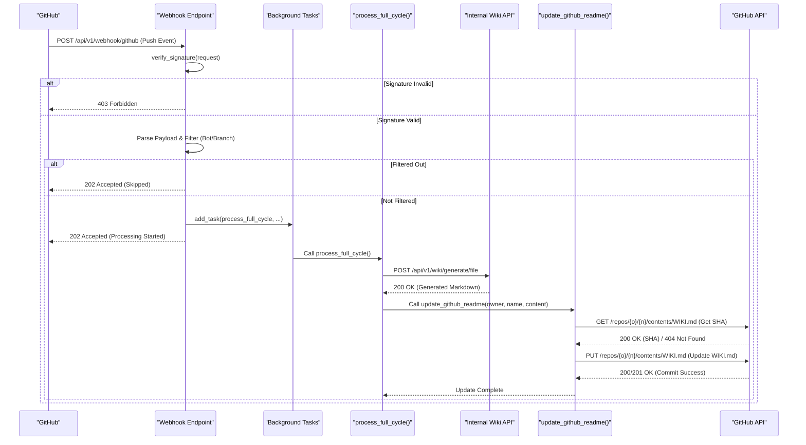

## Data Models

The `src/models/github_webhook_schema.py` file defines the Pydantic models used to parse incoming GitHub webhook payloads, ensuring type safety and data validation.

### `GitHubPushPayload`

This is the top-level model for a GitHub push event.

| Field | Type | Description |
|---|---|---|
| `ref` | `str` | The branch or tag ref that was pushed (e.g., `refs/heads/main`). |
| `repository` | `GitHubRepository` | Details about the repository where the push occurred. |
| `pusher` | `GitHubPusher` | Information about the user who initiated the push. |
| `head_commit` | `GitHubCommit` | The most recent commit on the branch. |

Sources: [src/models/github_webhook_schema.py](GitHubPushPayload class)

### Nested Models

*   **`GitHubRepository`**: Contains `name` (repository name) and `owner` (a `GitHubRepositoryOwner` object with `login`).
*   **`GitHubPusher`**: Contains `name` and optionally `email`.
*   **`GitHubCommit`**: Contains `id`, `message`, and optionally `author` (a `GitHubPusher` object).

Sources: [src/models/github_webhook_schema.py](GitHubRepositoryOwner class), [src/models/github_webhook_schema.py](GitHubRepository class), [src/models/github_webhook_schema.py](GitHubPusher class), [src/models/github_webhook_schema.py](GitHubCommit class)

## Configuration

Key configuration settings related to webhooks and deployment are managed through environment variables, often loaded via `.env` files using Pydantic Settings.

| Environment Variable | Description | Source |
|---|---|---|
| `GITHUB_WEBHOOK_SECRET` | Secret token used to verify the authenticity of incoming GitHub webhook payloads. | [src/core/config.py](Settings class), [src/api/v1/endpoints/webhook.py](GITHUB_WEBHOOK_SECRET variable) |
| `GITHUB_ACCESS_TOKEN` | GitHub Personal Access Token (PAT) with `repo` scope, used by the application to write `WIKI.md` back to repositories. | [src/api/v1/endpoints/webhook.py](GITHUB_ACCESS_TOKEN variable) |
| `BOT_COMMITTER_NAME` | The name used for the bot's commits (e.g., "Wiki-As-Readme-Bot"). Used to prevent infinite webhook loops. | [src/api/v1/endpoints/webhook.py](BOT_COMMITTER_NAME variable) |

Note that `GITHUB_ACCESS_TOKEN` and `BOT_COMMITTER_NAME` are directly accessed via `os.getenv` or defined as constants in `src/api/v1/endpoints/webhook.py`, while `GITHUB_WEBHOOK_SECRET` is also part of the `Settings` model in `src/core/config.py`.

## Conclusion

The server deployment and webhook system provide the backbone for the "Wiki as Readme" project's automation capabilities. By leveraging FastAPI, secure GitHub webhook integration, and asynchronous processing, the system efficiently generates and updates repository documentation, ensuring that the `WIKI.md` remains current with minimal manual intervention. This architecture promotes a continuous documentation workflow, tightly coupled with code changes.

---

<a name="configuration-and-environment-variables"></a>

<details>
<summary>Relevant source files</summary>

The following files were used as context for generating this wiki page:

- [.env.example](.env.example)
- [src/core/config.py](src/core/config.py)
</details>

# Configuration and Environment Variables

## Introduction

This document outlines the configuration management system used within the project, focusing on how settings are defined, loaded, and utilized. The system leverages environment variables, primarily through a `.env` file, and Pydantic's `BaseSettings` for robust validation, type-hinting, and default value management. This approach ensures that the application can be easily configured for different environments (development, production) without modifying the codebase, promoting flexibility and maintainability.

The configuration covers various aspects of the application's behavior, including LLM provider details, API keys, file filtering rules, repository access, localization, and integration with external services like Notion and Google Cloud Platform.

## Environment Variable Definition (`.env.example`)

The `.env.example` file serves as a template for defining environment variables that control the application's behavior. Users are expected to copy this file to `.env` and populate it with their specific values. These variables are loaded at application startup and override any default values defined in the code.

Sources: [.env.example](.env.example)

### Key Configuration Categories

The environment variables are logically grouped into several categories:

*   **LLM Provider Settings:** Defines which Large Language Model (LLM) service to use and the specific model identifier.
*   **LLM API Keys:** Credentials required to authenticate with the chosen LLM provider.
*   **LLM Configuration:** Fine-tunes LLM behavior, such as base URL, structured output, temperature, retry attempts, and concurrency limits.
*   **File Filtering Settings:** Specifies patterns for files and directories to exclude from processing, optimizing token usage and focus.
*   **Repository Access Settings:** Tokens for accessing private repositories or increasing API rate limits for Git services.
*   **Localization Settings:** Determines the target language for generated content.
*   **Google Cloud Platform Settings:** Specific configurations for integrating with Google Vertex AI.
*   **Docker & Local Path Settings:** Defines paths for local repositories, output directories, and credentials when running in Docker or locally.
*   **Notion Sync Settings:** Parameters for enabling and configuring automatic synchronization of generated wikis to Notion.

### Example Environment Variables

| Variable Name | Description | Example Value |
|---|---|---|
| `LLM_PROVIDER` | The chosen LLM service. | `google`, `openai` |
| `MODEL_NAME` | Specific model identifier for the LLM. | `gemini-2.5-flash`, `gpt-4o` |
| `OPENAI_API_KEY` | API key for OpenAI. | `sk-xxxxxxxxxxxxxxxxxxxx` |
| `USE_STRUCTURED_OUTPUT` | Whether to request JSON output from LLM. | `true`, `false` |
| `temperature` | LLM generation randomness (0.0-1.0). | `0.0` |
| `IGNORED_PATTERNS` | JSON array of glob patterns to exclude. | `["*.lock", "__pycache__", ".git"]` |
| `GIT_API_TOKEN` | Personal access token for GitHub/GitLab. | `ghp_xxxxxxxxxxxxxxxxxxxx` |
| `language` | Target language for wiki generation. | `en`, `ko` |
| `LOCAL_REPO_PATH` | Absolute path to the repository to analyze. | `/path/to/my/project` |
| `NOTION_SYNC_ENABLED` | Enable/disable Notion integration. | `true`, `false` |

## Configuration Management (`src/core/config.py`)

The `src/core/config.py` file defines the `Settings` class, which is responsible for loading, validating, and providing access to all application configurations. It uses Pydantic's `BaseSettings` to achieve this.

Sources: [src/core/config.py](src/core/config.py)

### The `Settings` Class

The `Settings` class inherits from `pydantic_settings.BaseSettings` and defines all configurable parameters as class attributes with type hints and default values.

```python
class Settings(BaseSettings):
    LLM_PROVIDER: Literal[
        "google", "openai", "anthropic", "openrouter", "xai", "ollama"
    ] = "google"
    MODEL_NAME: str = "gemini-2.5-flash"
    # ... other settings ...
```
Sources: [src/core/config.py](Settings class)

**Key Features:**

*   **Type Hinting and Validation:** Each setting has a defined type (e.g., `str`, `bool`, `float`, `int`, `Literal`). Pydantic automatically validates incoming environment variable values against these types. `Literal` types restrict values to a predefined set, enhancing robustness.
*   **Default Values:** Most settings have sensible default values, ensuring the application can run even if an environment variable is not explicitly set.
*   **Optional Settings:** Many API keys and specific integration settings are marked as `str | None`, indicating they are optional.
*   **`SecretStr` for Sensitive Data:** `GOOGLE_APPLICATION_CREDENTIALS` is defined as `SecretStr` from Pydantic, which helps prevent accidental logging or exposure of sensitive information.

### Environment File Loading

The `SettingsConfigDict` within the `Settings` class specifies how environment variables are loaded:

```python
    model_config = SettingsConfigDict(
        env_file=".env", env_file_encoding="utf-8", extra="ignore"
    )
```
Sources: [src/core/config.py](model_config)

This configuration instructs Pydantic to:
1.  Load variables from a file named `.env` in the application's root directory.
2.  Use UTF-8 encoding for the `.env` file.
3.  Ignore any extra environment variables found in `.env` that are not defined in the `Settings` class.

### Special Handling for `IGNORED_PATTERNS`

The `IGNORED_PATTERNS` setting has a custom validator to handle its flexible input format:

```python
    DEFAULT_IGNORED_PATTERNS = [
        # ... default patterns ...
    ]

    IGNORED_PATTERNS: Any = DEFAULT_IGNORED_PATTERNS

    @field_validator("IGNORED_PATTERNS", mode="before")
    @classmethod
    def parse_ignored_patterns(cls, v: Any) -> list[str]:
        if isinstance(v, str):
            if not v.strip():
                return DEFAULT_IGNORED_PATTERNS
            try:
                parsed = json.loads(v)
                if isinstance(parsed, list):
                    return parsed
            except (json.JSONDecodeError, TypeError):
                return [s.strip() for s in v.split(",") if s.strip()]
        return v
```
Sources: [src/core/config.py](parse_ignored_patterns function)

This validator ensures that `IGNORED_PATTERNS` can be provided in several ways:
*   As a JSON array string (e.g., `'["*.log", "*.tmp"]'`).
*   As a comma-separated string (e.g., `'*.log, *.tmp'`).
*   If the environment variable is empty or not provided, it defaults to `DEFAULT_IGNORED_PATTERNS`.
This flexibility allows users to easily override the default list of ignored files.

### Global Settings Instance

A global `settings` object is instantiated at the end of the `config.py` module, making the configuration readily available throughout the application:

```python
settings = Settings()
```
Sources: [src/core/config.py](settings instance)

Any part of the application can import `settings` and access configuration values (e.g., `settings.LLM_PROVIDER`, `settings.OPENAI_API_KEY`).

## Configuration Loading Flow

The configuration loading process is straightforward and follows a standard pattern for applications using Pydantic `BaseSettings`.

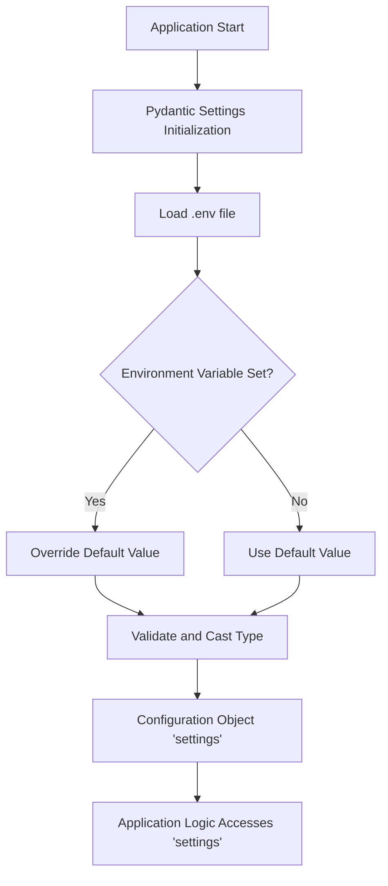

1.  **Application Start:** When the application initializes, the `settings = Settings()` line is executed.
2.  **Pydantic Settings Initialization:** The `Settings` class constructor is called.
3.  **Load `.env` file:** Based on `model_config`, Pydantic attempts to load key-value pairs from the `.env` file.
4.  **Environment Variable Check:** For each attribute defined in the `Settings` class, Pydantic checks if a corresponding environment variable (or `.env` entry) exists.
5.  **Override/Default:** If an environment variable is found, its value is used. Otherwise, the default value defined in the `Settings` class is applied.
6.  **Validation and Type Casting:** The loaded or default value is then validated against the attribute's type hint (e.g., `str`, `bool`, `float`, `Literal`). If necessary, the value is cast to the correct type. Custom validators, like `parse_ignored_patterns`, are executed at this stage.
7.  **Configuration Object:** A fully populated and validated `settings` object is created.
8.  **Application Access:** The rest of the application can then import and use this `settings` object to retrieve configuration values.

## Conclusion

The project employs a robust and flexible configuration system built upon environment variables and Pydantic `BaseSettings`. This design allows for easy customization of application behavior across different environments, ensures type safety and validation of configuration parameters, and provides clear defaults. The `.env.example` file serves as a comprehensive guide for users to configure the application, while `src/core/config.py` provides the underlying logic for loading, parsing, and making these settings available throughout the codebase.

---

<a name="public-api-reference"></a>

<details>
<summary>Relevant source files</summary>

The following files were used as context for generating this wiki page:

- [src/api/v1/endpoints/wiki.py](src/api/v1/endpoints/wiki.py)
- [src/models/api_schema.py](src/models/api_schema.py)
</details>

# Public API Reference

## Introduction

This document provides a comprehensive reference for the public API endpoints designed for generating and managing wiki documentation. Built using FastAPI, this API facilitates the creation of technical wikis from various repository sources (GitHub, GitLab, Bitbucket, local) and offers options to either save the generated content as a Markdown file on the server or return it directly as text. All generation tasks are handled asynchronously in the background, allowing clients to track progress via a dedicated status endpoint.

The API is structured to provide clear request/response models, ensuring predictable interactions and robust error handling. It leverages background tasks for long-running operations like wiki generation, enhancing responsiveness and scalability.

## API Endpoints

The API exposes three primary endpoints under the `/api/v1/wiki` path for wiki generation and status tracking.

### 1. Generate Wiki and Save to Server

This endpoint initiates a wiki generation process and saves the resulting Markdown content to the server's `output/` directory.

*   **Endpoint:** `POST /api/v1/wiki/generate/file`
*   **Description:** Triggers an asynchronous task to generate a wiki based on the provided repository details. The generated wiki content is saved as a Markdown file on the server. A task ID is returned for monitoring the generation progress.
*   **Request Model:** `WikiGenerationRequest`
*   **Response Model:** `WikiGenerationResponse`

**Example Request Body:**

```json
{
  "repo_owner": "octocat",
  "repo_name": "Spoon-Knife",
  "repo_type": "github",
  "language": "en",
  "is_comprehensive_view": true
}
```

**Example Response:**

```json
{
  "message": "Wiki generation started in the background (File mode).",
  "task_id": "a1b2c3d4-e5f6-7890-1234-567890abcdef",
  "title": "Spoon-Knife Project Wiki",
  "description": "A comprehensive wiki for the Spoon-Knife project."
}
```
Sources: [src/api/v1/endpoints/wiki.py](generate_wiki_file)

### 2. Generate Wiki and Return Text

This endpoint initiates a wiki generation process, but instead of saving the file, it makes the generated text available in the task's result upon completion.

*   **Endpoint:** `POST /api/v1/wiki/generate/text`
*   **Description:** Triggers an asynchronous task to generate a wiki. The generated content is not saved to the server's filesystem. Once completed, the Markdown text will be accessible via the task status endpoint. A task ID is returned for monitoring.
*   **Request Model:** `WikiGenerationRequest`
*   **Response Model:** `WikiGenerationResponse`

**Example Request Body:**

```json
{
  "repo_url": "https://github.com/octocat/Spoon-Knife.git",
  "repo_type": "github",
  "language": "en"
}
```

**Example Response:**

```json
{
  "message": "Wiki generation started in the background (Text mode).",
  "task_id": "f0e9d8c7-b6a5-4321-fedc-ba9876543210",
  "title": "Spoon-Knife Project Wiki",
  "description": "A comprehensive wiki for the Spoon-Knife project."
}
```
Sources: [src/api/v1/endpoints/wiki.py](generate_wiki_text)

### 3. Get Wiki Generation Task Status

This endpoint allows clients to retrieve the current status and results of a previously initiated wiki generation task.

*   **Endpoint:** `GET /api/v1/wiki/status/{task_id}`
*   **Description:** Fetches the current status of a background wiki generation task using its unique `task_id`. If the task is completed, its result (e.g., the generated Markdown text if `generate/text` was used) will be included.
*   **Path Parameters:**
    *   `task_id` (string, required): The unique identifier of the task.
*   **Response Model:** `TaskStatusResponse`

**Example Response (In Progress):**

```json
{
  "task_id": "a1b2c3d4-e5f6-7890-1234-567890abcdef",
  "status": "in_progress",
  "result": null
}
```

**Example Response (Completed - Text Mode):**

```json
{
  "task_id": "f0e9d8c7-b6a5-4321-fedc-ba9876543210",
  "status": "completed",
  "result": {
    "markdown_content": "# Project Wiki\n\nThis is the generated content..."
  }
}
```
Sources: [src/api/v1/endpoints/wiki.py](get_wiki_generation_status)

## API Request and Response Models

The API utilizes Pydantic models for clear data validation and serialization.

### `WikiGenerationRequest`

This model defines the parameters required to initiate a wiki generation task.

| Parameter | Type | Description |
|---|---|---|
| `repo_owner` | `str` \| `None` | The owner of the repository (user or organization). |
| `repo_name` | `str` \| `None` | The name of the repository. |
| `repo_type` | `Literal["github", "gitlab", "bitbucket", "local"]` | The type of the repository. Defaults to `"github"`. |
| `repo_url` | `str` \| `None` | The URL for cloning a remote repository. |
| `local_path` | `str` \| `None` | The local path to the repository if `repo_type` is `"local"`. |
| `language` | `str` | The language for the generated wiki content. Defaults to `"ko"`. |
| `is_comprehensive_view` | `bool` | Whether to generate a comprehensive view of the repository. Defaults to `True`. |
Sources: [src/models/api_schema.py](WikiGenerationRequest)

**Validation Logic:**
The `WikiGenerationRequest` includes a `model_validator` that automatically derives `repo_owner` and `repo_name` from `repo_url` if `repo_type` is "github" and these fields are not explicitly provided. It also attempts to derive `repo_name` from `local_path` if `repo_type` is "local" and `repo_name` is missing.
Sources: [src/models/api_schema.py](derive_repo_details), [src/models/api_schema.py](_parse_github_url)

### `WikiGenerationResponse`

This model represents the immediate response after successfully initiating a wiki generation task.

| Field | Type | Description |
|---|---|---|
| `message` | `str` | A message indicating the status of the request. |
| `task_id` | `str` | The ID of the background task initiated. |
| `title` | `str` | The title of the generated wiki (determined during initial processing). |
| `description` | `str` | The description of the generated wiki (determined during initial processing). |
Sources: [src/models/api_schema.py](WikiGenerationResponse)

### `TaskStatusResponse`

This model provides the current status and potential results of a background task.

| Field | Type | Description |
|---|---|---|
| `task_id` | `str` | The ID of the task. |
| `status` | `Literal["in_progress", "completed", "failed"]` | Current status of the task. |
| `result` | `Any` \| `None` | Result of the task, if completed or failed. |
Sources: [src/models/api_schema.py](TaskStatusResponse)

## API Workflow

The wiki generation process involves several steps, orchestrated by the API endpoints and background tasks.

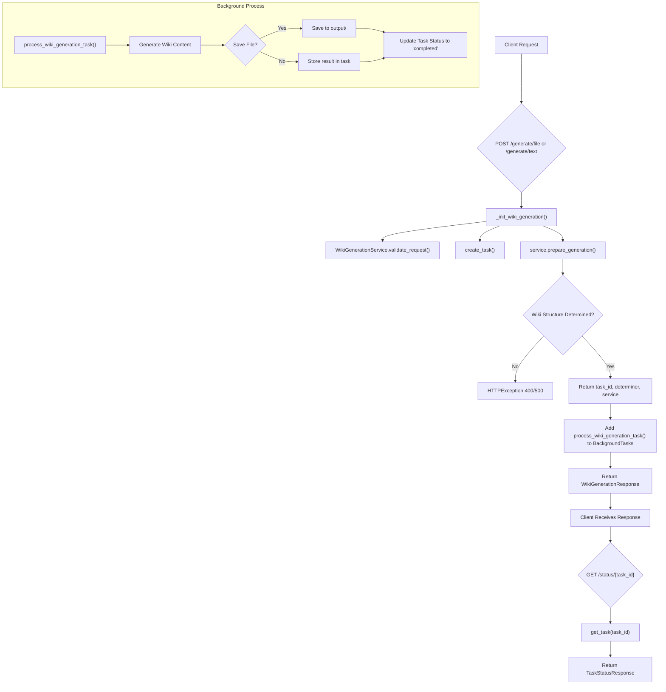
Sources: [src/api/v1/endpoints/wiki.py](generate_wiki_file), [src/api/v1/endpoints/wiki.py](generate_wiki_text), [src/api/v1/endpoints/wiki.py](_init_wiki_generation)

## Conclusion

The Public API provides a robust and asynchronous mechanism for generating comprehensive wiki documentation from various source code repositories. By leveraging background tasks, it ensures that long-running generation processes do not block API responses, offering a responsive user experience. The clear definition of request and response models, coupled with detailed status tracking, makes this API a powerful tool for automated documentation generation.

---

<a name="system-architecture-overview"></a>

<details>
<summary>Relevant source files</summary>

The following files were used as context for generating this wiki page:

- [src/app.py](src/app.py)
- [src/server.py](src/server.py)
- [src/agent/llm.py](src/agent/llm.py)
</details>

# System Architecture Overview

This document provides a comprehensive overview of the system architecture for the "Wiki As Readme" project. The system is designed to generate comprehensive wiki documentation from source code repositories, leveraging Large Language Models (LLMs). It follows a client-server architecture, separating the user interface from the core generation logic and LLM interactions.

The primary goal of this architecture is to provide a user-friendly interface for initiating wiki generation, a robust backend for processing requests, and a flexible LLM integration layer to support various AI models and providers.

## High-Level Architecture

The system is composed of three main logical components:

1.  **Frontend Application:** A Streamlit-based web interface for user interaction.
2.  **Backend API Server:** A FastAPI-based server that exposes endpoints for wiki generation and status polling.
3.  **LLM Agent Layer:** A module responsible for interacting with various LLM providers to perform the actual wiki content generation.

These components communicate over standard HTTP/HTTPS protocols, allowing for flexible deployment and scalability.

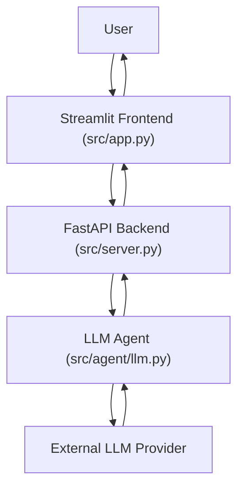

## Frontend Application

The frontend is implemented using Streamlit and is defined in `src/app.py`. It serves as the primary interface for users to initiate wiki generation and view results.

### Key Responsibilities

*   **User Input Collection:** Gathers repository URLs or local paths, generation preferences (e.g., comprehensive view, language).
*   **API Interaction:** Sends generation requests to the backend API and polls for task status.
*   **Result Display:** Renders the generated Markdown content, including Mermaid diagrams, and provides download options.
*   **History Management:** Displays a list of previously generated wiki files.

### Core Components and Flow

The `src/app.py` orchestrates the user experience through several key functions:

*   **`main()`**: Sets up the Streamlit page configuration and handles navigation between the "Generator" and "History" pages.
*   **`render_generator_page()`**: Manages the input form, constructs `WikiGenerationRequest` objects, calls the backend API to start generation, and polls for results.
*   **`start_generation_task(request_data)`**: Asynchronously sends a POST request to the `/api/v1/wiki/generate/file` endpoint to initiate the wiki generation process. It handles API errors and returns a `task_id`.
    *   Sources: [src/app.py](start_generation_task function)
*   **`poll_task_status(task_id)`**: Asynchronously polls the `/api/v1/wiki/status/{task_id}` endpoint to check the progress and retrieve the final result of the generation task. It provides visual feedback (progress bar, status messages) to the user.
    *   Sources: [src/app.py](poll_task_status function)
*   **`render_history_page()`**: Displays a grid of previously generated Markdown files from the `output` directory, allowing users to view or download them.
*   **`render_markdown_with_mermaid(markdown_content)`**: A utility function to correctly render Markdown content that may contain Mermaid diagram blocks, using `streamlit_mermaid`.

## Backend API Server

The backend server is built with FastAPI and serves as the central hub for processing requests from the frontend and orchestrating the wiki generation workflow. It is defined in `src/server.py`.

### Key Responsibilities

*   **API Endpoint Exposure:** Provides RESTful API endpoints for initiating wiki generation and checking task status.
*   **Request Handling:** Validates incoming requests and dispatches them to appropriate internal services (not explicitly shown in provided files but implied by router inclusion).
*   **Task Management:** Manages the lifecycle of wiki generation tasks (e.g., starting, tracking status).
*   **Logging:** Centralized logging for server operations.

### Core Components and Endpoints

The `src/server.py` file sets up the FastAPI application and includes various API routers:

*   **`app = FastAPI(...)`**: Initializes the FastAPI application with metadata.
    *   Sources: [src/server.py](lines 10-14)
*   **`health_check()`**: A basic health check endpoint at `/`.
    *   Sources: [src/server.py](health_check function)
*   **API Routers:**
    *   `app.include_router(wiki.router, prefix="/api/v1/wiki", tags=["Wiki Generation"])`: Integrates the wiki generation endpoints. This router is responsible for handling requests like `/api/v1/wiki/generate/file` and `/api/v1/wiki/status/{task_id}`.
    *   `app.include_router(webhook.router, prefix="/api/v1/webhook", tags=["Webhook Integration"])`: Integrates webhook-related endpoints, suggesting potential for external system integrations.
*   **`uvicorn.run(...)`**: Starts the Uvicorn ASGI server to host the FastAPI application.
    *   Sources: [src/server.py](uvicorn.run call)

## LLM Agent Layer

The LLM Agent layer is responsible for abstracting interactions with various Large Language Model providers. It is implemented in `src/agent/llm.py` and primarily features the `LLMWikiMaker` class.

### Key Responsibilities

*   **LLM Provider Abstraction:** Provides a unified interface to interact with different LLMs (OpenAI, Google Vertex AI, Anthropic, OpenRouter, xAI, Ollama, etc.) via LiteLLM.
*   **Configuration Management:** Handles provider-specific configurations, API keys, and model parameters.
*   **Structured Output:** Supports generating structured JSON output from LLMs, ensuring type safety through Pydantic schemas.
*   **Error Handling:** Manages potential issues during LLM calls and response parsing.

### `LLMWikiMaker` Class

The `LLMWikiMaker` class is the core component of this layer. It is a generic class designed to work with Pydantic `BaseModel` schemas for structured output.

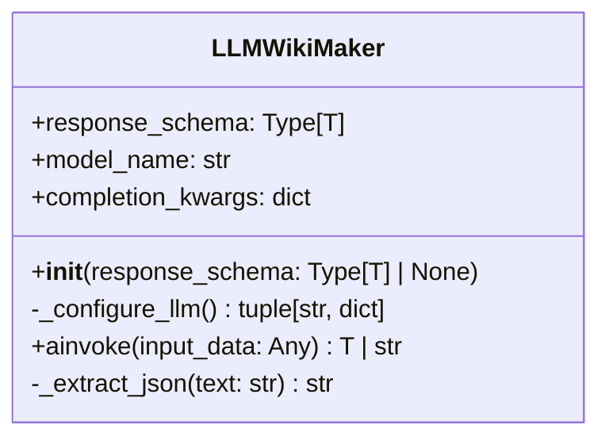

*   **`__init__(self, response_schema: type[T] | None = None)`**: Initializes the LLM wrapper, configuring the model based on application settings and optionally setting a Pydantic schema for structured output.
    *   Sources: [src/agent/llm.py](LLMWikiMaker.__init__ method)
*   **`_configure_llm(self) -> tuple[str, dict]`**: Determines the LLM model name and specific arguments (e.g., API keys, base URLs, project IDs) based on the `LLM_PROVIDER` setting. It supports a wide range of providers.
    *   Sources: [src/agent/llm.py](LLMWikiMaker._configure_llm method)
*   **`ainvoke(self, input_data: Any) -> T | str`**: The primary asynchronous method to call the LLM. It constructs the prompt, makes the `litellm.acompletion` call, and parses the response. If a `response_schema` is provided, it attempts to validate the LLM's output against that schema, handling both native structured output and JSON string parsing.
    *   Sources: [src/agent/llm.py](LLMWikiMaker.ainvoke method)
*   **`_extract_json(self, text: str) -> str`**: A helper method to extract JSON content from Markdown code blocks, useful when LLMs return JSON embedded in Markdown.
    *   Sources: [src/agent/llm.py](LLMWikiMaker._extract_json method)

### LLM Configuration

The `LLMWikiMaker` dynamically configures the LLM based on environment variables and application settings. The following table summarizes the configuration parameters handled:

| Parameter | Description | Source |
|---|---|---|
| `LLM_PROVIDER` | Specifies the LLM service provider (e.g., `google`, `openai`, `anthropic`). | `settings.LLM_PROVIDER` |
| `MODEL_NAME` | The specific model to use (e.g., `gemini-pro`, `gpt-4o`, `claude-3-opus-20240229`). | `settings.MODEL_NAME` |
| `temperature` | Controls the randomness of the LLM's output. | `settings.temperature` |
| `max_retries` | Number of retries for LLM API calls. | `settings.max_retries` |
| `OPENAI_API_KEY` | API key for OpenAI models. | `settings.OPENAI_API_KEY` |
| `ANTHROPIC_API_KEY` | API key for Anthropic models. | `settings.ANTHROPIC_API_KEY` |
| `OPENROUTER_API_KEY` | API key for OpenRouter models. | `settings.OPENROUTER_API_KEY` |
| `XAI_API_KEY` | API key for xAI models. | `settings.XAI_API_KEY` |
| `GCP_PROJECT_NAME` | Google Cloud Project ID for Vertex AI. | `settings.GCP_PROJECT_NAME` |
| `GCP_MODEL_LOCATION` | Google Cloud region for Vertex AI. | `settings.GCP_MODEL_LOCATION` |
| `LLM_BASE_URL` | Custom base URL for OpenAI-compatible APIs (e.g., local Ollama instances). | `settings.LLM_BASE_URL` |
| `USE_STRUCTURED_OUTPUT` | Boolean flag to enable native structured output features of LiteLLM. | `settings.USE_STRUCTURED_OUTPUT` |

## Wiki Generation Data Flow

The following sequence diagram illustrates the end-to-end process of generating a wiki, from user interaction to the final display of results.

```mermaid
sequenceDiagram
    participant UI as "Streamlit UI (src/app.py)"
    participant BE as "FastAPI Backend (src/server.py)"
    participant LLMA as "LLM Agent (src/agent/llm.py)"
    participant LLMP as "LLM Provider"

    UI->>UI: User enters repo details & clicks "Generate"
    UI->>BE: POST /api/v1/wiki/generate/file (WikiGenerationRequest)
    activate BE
    BE->>BE: Validate request, start background task
    BE-->>UI: 202 Accepted (task_id)
    deactivate BE

    loop Polling for Status
        UI->>BE: GET /api/v1/wiki/status/{task_id}
        activate BE
        BE->>BE: Check task status
        alt Task In Progress
            BE-->>UI: 200 OK (status: "in_progress")
        else Task Completed
            BE->>LLMA: Invoke LLM for generation
            activate LLMA
            LLMA->>LLMP: API Call (prompt, model, schema)
            activate LLMP
            LLMP-->>LLMA: LLM Response (Markdown/JSON)
            deactivate LLMP
            LLMA-->>BE: Generated Wiki Content
            deactivate LLMA
            BE->>BE: Save content, update task status
            BE-->>UI: 200 OK (status: "completed", result: {markdown_content})
            break
        else Task Failed
            BE-->>UI: 200 OK (status: "failed", result: {error_message})
            break
        end
        deactivate BE
    end

    UI->>UI: Display generated wiki content
    UI->>UI: Offer download option
```

## Conclusion

The "Wiki As Readme" system employs a clear separation of concerns, with a dedicated frontend for user interaction, a robust backend for API management and task orchestration, and a flexible LLM agent layer for AI model integration. This modular design enhances maintainability, scalability, and adaptability to different LLM providers and future feature enhancements. The asynchronous nature of API calls and task polling ensures a responsive user experience while complex generation tasks are processed in the background.

---

<a name="contributing-and-development"></a>

<details>
<summary>Relevant source files</summary>

The following files were used as context for generating this wiki page:

- [LICENSE](LICENSE)
- [SECURITY.md](SECURITY.md)
- [.pre-commit-config.yaml](.pre-commit-config.yaml)
</details>

# Contributing and Development

This document outlines the guidelines and policies for contributing to the "Wiki As Readme" project, covering aspects such as licensing, security vulnerability reporting, and maintaining code quality. Adhering to these guidelines ensures a consistent, secure, and legally compliant development process for all contributors.

## Licensing

The "Wiki As Readme" project is distributed under the **MIT License**. This permissive open-source license grants broad rights to users and developers, allowing them to use, copy, modify, merge, publish, distribute, sublicense, and/or sell copies of the software.

Key aspects of the MIT License include:
*   **Permissions:** Commercial use, modification, distribution, private use.
*   **Conditions:** The original copyright notice and permission notice must be included in all copies or substantial portions of the software.
*   **Limitations:** The software is provided "as is" without warranty of any kind, express or implied. Authors or copyright holders are not liable for any claims, damages, or other liabilities arising from the software.

Contributors should be aware that any contributions made to this project will fall under the terms of this license.
Sources: [LICENSE](LICENSE)

## Security Vulnerability Reporting

The security of "Wiki As Readme" is taken seriously. If you discover a security vulnerability, it is crucial to report it responsibly to ensure the safety of all users.

### Supported Versions

Only the **latest release** of "Wiki As Readme" is officially supported for security updates. Users and contributors are encouraged to always use the most recent version to benefit from the latest security patches and features.

| Version | Supported |
|---|---|
| Latest | :white_check_mark: |
| Older | :x: |

Sources: [SECURITY.md](SECURITY.md)

### How to Report a Vulnerability

To report a security vulnerability, please follow these steps:
1.  **Do NOT** report vulnerabilities through public GitHub issues or pull requests. This could expose the vulnerability before a fix is available, putting users at risk.
2.  **Email your report** directly to the project maintainer at: **catuscio@hotmail.com**.
3.  **Include comprehensive details** in your email. This should cover:
    *   A clear description of the vulnerability.
    *   Steps to reproduce the issue.
    *   The version of "Wiki As Readme" affected.
    *   Any potential impact or exploit scenarios.
    *   If possible, provide a proof-of-concept.

The project team aims to acknowledge your report within 48 hours and will keep you updated on the progress of the fix.
Sources: [SECURITY.md](SECURITY.md)

## Code Quality and Pre-commit Hooks

To maintain high code quality, consistency, and prevent common issues, "Wiki As Readme" utilizes `pre-commit` hooks. These hooks automatically run checks on your code before you commit it, ensuring that contributions adhere to project standards.

### Pre-commit Configuration

The project's pre-commit configuration is defined in `.pre-commit-config.yaml`. It currently uses `ruff` for both linting and formatting Python code.

```yaml
repos:
  - repo: https://github.com/astral-sh/ruff-pre-commit
    rev: v0.11.13
    hooks:
      - id: ruff
        args: [--fix]
      - id: ruff-format
```

Sources: [.pre-commit-config.yaml](.pre-commit-config.yaml)

### Ruff Linting and Formatting

`ruff` is a fast Python linter and formatter. When you attempt to commit changes, the following hooks will execute:
*   **`ruff`**: This hook runs the `ruff` linter. It identifies potential errors, stylistic issues, and bad practices in the Python codebase. The `args: [--fix]` option attempts to automatically fix many of these issues, reducing manual effort.
*   **`ruff-format`**: This hook applies `ruff`'s built-in formatter to ensure consistent code style across the entire project. This helps maintain readability and reduces bikeshedding over formatting preferences.

**To set up pre-commit hooks locally:**
1.  Ensure you have `pre-commit` installed (`pip install pre-commit`).
2.  Navigate to the root of your project directory.
3.  Run `pre-commit install`.

After installation, the configured hooks will automatically run before each commit, helping to catch and fix issues early in the development cycle.

## Conclusion

Contributing to "Wiki As Readme" involves understanding its licensing terms, adhering to responsible security disclosure practices, and utilizing the provided tooling for code quality. By following these guidelines, contributors help ensure the project remains secure, maintainable, and legally sound for everyone.

---
