# Wiki As Readme 프로젝트 위키

코드베이스를 포괄적인 위키로 변환하는 AI 기반 문서화 도구인 Wiki As Readme 프로젝트에 대한 상세한 문서입니다.

## Table of Contents

- [Wiki As Readme 소개](#wiki-as-readme-소개)
- [핵심 기능](#핵심-기능)
- [범용 호환성](#범용-호환성)
- [GitHub 액션 사용법](#github-액션-사용법)
- [Docker Compose로 실행](#docker-compose로-실행)
- [로컬 개발 환경 설정](#로컬-개발-환경-설정)
- [서버 및 웹훅 배포](#서버-및-웹훅-배포)
- [환경 변수 참조](#환경-변수-참조)
- [시스템 아키텍처 개요](#시스템-아키텍처-개요)
- [LLM 통합 및 에이전트](#llm-통합-및-에이전트)
- [백엔드 API 엔드포인트](#백엔드-api-엔드포인트)
- [서비스 계층](#서비스-계층)

---

<a name="wiki-as-readme-소개"></a>

<details>
<summary>Relevant source files</summary>

The following files were used as context for generating this wiki page:

- [README.md](README.md)
- [action.yml](action.yml)
- [WIKI-AS-README-AS-ACTION.yml](WIKI-AS-README-AS-ACTION.yml)
</details>

# Wiki As Readme 소개

## 📚 소개

Wiki As Readme는 코드베이스를 포괄적인 위키 문서로 신속하게 변환하는 데 특화된 유연한 AI 문서화 도구입니다. 이 도구는 로컬 Ollama를 통해 Llama 3 모델을 실행하든, Google Gemini Pro를 사용하든, OpenAI API를 호출하든 관계없이 다양한 LLM 스택에 적응하도록 설계되었습니다. 또한 GitHub, GitLab, Bitbucket과 같은 모든 Git 플랫폼 또는 로컬 폴더와 원활하게 통합되어 궁극적인 "드롭인" 문서화 솔루션을 제공합니다.

이 프로젝트의 목표는 개발자가 어떤 환경에서든, 어떤 모델을 사용하든, 어떤 저장소를 사용하든 관계없이 코드베이스를 최신 상태의 정확한 문서로 쉽게 유지할 수 있도록 돕는 것입니다. Wiki As Readme는 코드의 복잡성을 이해하고, 논리적인 구조를 생성하며, 아키텍처 다이어그램까지 자동으로 생성하여 개발자의 문서화 부담을 크게 줄여줍니다.

## ✨ 핵심 기능

Wiki As Readme는 코드베이스를 분석하고 포괄적인 문서를 생성하기 위한 여러 강력한 기능을 제공합니다.

*   **🧠 심층 컨텍스트 분석 (Deep Context Analysis):** 프로젝트의 아키텍처를 이해하기 위해 파일 구조와 관계를 분석합니다.
    *   Sources: [README.md](Core Features)
*   **📦 스마트 구조 생성 (Smart Structure Generation):** 문서에 대한 논리적 계층(섹션 > 페이지)을 자동으로 결정합니다.
    *   Sources: [README.md](Core Features)
*   **🔍 포괄적인 콘텐츠 (Comprehensive Content):** 아키텍처 개요, 설치 가이드, API 참조를 포함한 상세 페이지를 작성합니다.
    *   Sources: [README.md](Core Features)
*   **📊 자동 다이어그램 (Automatic Diagrams):** 아키텍처를 시각화하기 위해 Mermaid.js 다이어그램(플로우차트, 시퀀스 다이어그램, 클래스 다이어그램)을 생성합니다.
    *   Sources: [README.md](Core Features)
*   **🚗 하이브리드 출력 (Hybrid Output):** 위키를 위한 개별 Markdown 파일과 단일 통합 `README.md`를 모두 생성합니다.
    *   Sources: [README.md](Core Features)
*   **⚡ 비동기 및 확장 가능 (Async & Scalable):** 대규모 문서 생성을 위해 비블로킹 및 효율적인 처리를 위해 FastAPI 및 AsyncIO로 구축되었습니다.
    *   Sources: [README.md](Core Features)

## 🌐 범용 호환성

Wiki As Readme는 진정으로 플러그인 가능한(pluggable) 방식으로 설계되어 사용자가 실행 방식, 실행 위치 및 구동 방식을 자유롭게 선택할 수 있습니다.

### 🧠 1. 모델 독립적 (Model Agnostic)

LiteLLM을 기반으로 100개 이상의 LLM과 통합되어 다양한 모델을 지원합니다.
*   **상용 API:** Google Vertex AI (Gemini), OpenAI (GPT-4), Anthropic (Claude), xAI (Grok).
*   **오픈/로컬 모델:** Ollama, OpenRouter, HuggingFace.
*   **온프레미스:** 자체 프라이빗 LLM 엔드포인트에 안전하게 연결할 수 있습니다.
    *   Sources: [README.md](Model Agnostic)

### 🚉 2. 플랫폼 독립적 (Platform Agnostic)

어떤 코드 저장소 환경에서도 원활하게 작동합니다.
*   **클라우드 저장소:** GitHub, GitLab, Bitbucket과 원활하게 작동합니다.
*   **로컬 개발:** 푸시할 필요 없이 로컬 파일 시스템에서 직접 코드를 분석합니다.
*   **프라이빗/엔터프라이즈:** 프라이빗 인스턴스 및 자체 호스팅 Git 서버를 완벽하게 지원합니다.
    *   Sources: [README.md](Platform Agnostic)

### 🛠️ 3. 배포 독립적 (Deployment Agnostic)

다양한 배포 환경에 통합될 수 있습니다.
*   **CI/CD:** GitHub Actions에 통합하여 사용할 수 있습니다.
*   **컨테이너:** Docker Compose를 통해 실행할 수 있습니다.
*   **서비스:** 웹훅을 지원하는 장기 실행 API 서버로 배포할 수 있습니다.
*   **CLI:** 코딩 중에 로컬에서 실행할 수 있습니다.
    *   Sources: [README.md](Deployment Agnostic)

## 🚀 사용 모드

Wiki As Readme는 사용자의 필요에 따라 여러 가지 방식으로 활용될 수 있도록 설계되었습니다.

### 1. GitHub Action (권장)

CI/CD 파이프라인에서 문서 업데이트를 자동화하는 가장 권장되는 방법입니다. 저장소에 워크플로를 추가하여 변경 사항 푸시 시 `WIKI.md` 파일을 자동으로 업데이트할 수 있습니다.

#### 트리거 방식

워크플로는 두 가지 방식으로 실행됩니다.

| 트리거 | 시점 | 커밋 방식 | 설정 |
|---|---|---|---|
| **`push`** | `main` 브랜치에 코드가 푸시될 때 | 항상 **직접 푸시** | 기본값 사용 (언어: `en`, 모델: `gemini-2.5-flash`) |
| **`workflow_dispatch`** | "Actions" 탭에서 수동 실행 시 | **푸시** 또는 **풀 리퀘스트** 선택 | 실행 시 사용자 정의 가능 |
    *   Sources: [README.md](How it triggers), [WIKI-AS-README-AS-ACTION.yml](on)

#### 커밋 방식

*   **직접 푸시 (Direct Push):**
    *   `commit_method`가 `push`이거나 자동 `push` 이벤트 발생 시 사용됩니다.
    *   생성된 `WIKI.md`가 현재 브랜치에 직접 커밋됩니다.
    *   `stefanzweifel/git-auto-commit-action`을 사용하여 변경 사항을 감지하고 푸시합니다.
    *   내용이 변경되지 않으면 커밋이 생성되지 않습니다.
    *   커밋 메시지 형식: `✨📚 Update WIKI.md via Wiki-As-Readme Action (en)`
    *   **적합한 경우:** 문서가 코드와 항상 동기화되기를 원하는 자동화된 워크플로.
        *   Sources: [README.md](Commit Method: Direct Push), [WIKI-AS-README-AS-ACTION.yml](Commit and Push changes)

*   **풀 리퀘스트 (Pull Request):**
    *   `commit_method`가 `pull-request`일 때만 사용 가능하며, 수동 트리거를 통해서만 가능합니다.
    *   현재 브랜치에서 `wiki-update-{run_id}`라는 새 브랜치가 생성됩니다.
    *   생성된 `WIKI.md`가 해당 브랜치에 커밋됩니다.
    *   `peter-evans/create-pull-request`를 사용하여 현재 브랜치에 대한 풀 리퀘스트가 자동으로 열립니다.
    *   PR 본문에는 생성된 내용 요약과 Wiki-As-Readme 링크가 포함됩니다.
    *   **적합한 경우:** 위키 변경 사항이 병합 전에 검토되어야 하는 팀 워크플로, 자동 생성된 문서 커밋으로 인해 배포 파이프라인이 실수로 시작되는 것을 방지해야 하는 CI/CD 환경.
        *   Sources: [README.md](Commit Method: Pull Request), [WIKI-AS-README-AS-ACTION.yml](Create Pull Request)

#### 필수 Secrets

GitHub Action을 사용하기 위해 필요한 환경 변수 및 GitHub Secrets 목록입니다.

| Secret | 필수 여부 | 설명 |
|---|---|---|
| `GOOGLE_APPLICATION_CREDENTIALS` | Google/Vertex AI 사용 시 | GCP 서비스 계정 JSON 키 |
| `GCP_PROJECT_NAME` | Google/Vertex AI 사용 시 | Vertex AI 프로젝트 ID |
| `GCP_MODEL_LOCATION` | Google/Vertex AI 사용 시 | Vertex AI 리전 |
| `OPENAI_API_KEY` | OpenAI 사용 시 | OpenAI API 키 |
| `ANTHROPIC_API_KEY` | Anthropic 사용 시 | Anthropic API 키 |
| `NOTION_API_KEY` | Notion 동기화 활성화 시 | Notion 통합 토큰 |
| `NOTION_DATABASE_ID` | Notion 동기화 활성화 시 | 대상 Notion 데이터베이스 ID |
    *   Sources: [README.md](Required Secrets), [action.yml](inputs), [WIKI-AS-README-AS-ACTION.yml](env)

#### GitHub Action 워크플로 다이어그램

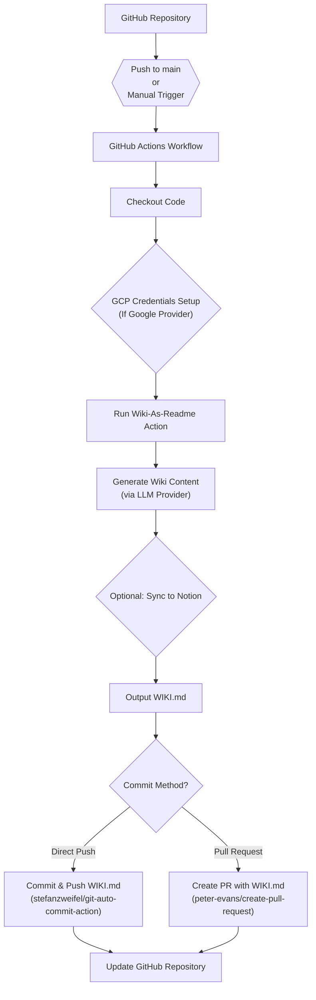
```mermaid
graph TD
    A["GitHub Repository"] --> B{{"Push to main<br/>or<br/>Manual Trigger"}};
    B --> C["GitHub Actions Workflow"];

    C --> D["Checkout Code"];
    D --> E{"GCP Credentials Setup<br/>(If Google Provider)"};
    E --> F["Run Wiki-As-Readme Action"];

    F --> G["Generate Wiki Content<br/>(via LLM Provider)"];
    G --> H{"Optional: Sync to Notion"};
    H --> I["Output WIKI.md"];

    I --> J{"Commit Method?"};
    J -- "Direct Push" --> K["Commit & Push WIKI.md<br/>(stefanzweifel/git-auto-commit-action)"];
    J -- "Pull Request" --> L["Create PR with WIKI.md<br/>(peter-evans/create-pull-request)"];

    K --> M["Update GitHub Repository"];
    L --> M;
```

### 2. Docker Compose (로컬)

단일 명령으로 애플리케이션을 로컬에서 실행하는 가장 쉬운 방법입니다. UI를 사용해보고 싶을 때 유용합니다.

1.  **`.env` 설정:** `.env.example`을 `.env`로 복사하고 API 키 및 기타 설정을 구성합니다.
2.  **실행:** `docker-compose up --build` 명령을 사용합니다.
3.  **접근:** 웹 UI는 `http://localhost:8501`, API 문서는 `http://localhost:8000/docs`에서 접근할 수 있습니다.
    *   Sources: [README.md](Docker Compose (Local))

### 3. 로컬 Python 개발

소스 코드를 수정하거나 Docker 없이 실행하려는 개발자를 위한 방법입니다.

1.  **사전 요구 사항:** Python 3.12+, `uv` (패키지 관리자).
2.  **클론 및 설치:** 저장소를 클론하고 `uv sync`로 의존성을 설치합니다.
3.  **`.env` 설정:** `.env.example`을 `.env`로 복사하고 변수를 설정합니다.
4.  **백엔드 실행:** `uv run uvicorn src.server:app --reload --port 8000`
5.  **프론트엔드 실행:** `uv run streamlit run src/app.py`
    *   Sources: [README.md](Local Python Development)

### 4. 서버 및 웹훅

API 서버를 배포하여 요청 또는 웹훅(예: GitHub)을 처리할 수 있습니다.

*   **엔드포인트:** `POST /api/v1/webhook/github`
*   **페이로드:** 표준 GitHub 푸시 이벤트 페이로드.
*   **동작:** 저장소에 대한 위키 생성을 위한 백그라운드 작업을 트리거하고 다시 커밋합니다 (GIT_API_TOKEN 필요).
    *   Sources: [README.md](Server & Webhooks)

## ⚙️ 설정 참조 (`.env`)

로컬 또는 Docker 환경에서 애플리케이션을 실행할 때 환경 변수를 통해 구성합니다. `.env.example` 파일에서 전체 템플릿을 확인할 수 있습니다.

| 카테고리 | 변수 | 설명 | 기본값 |
|---|---|---|---|
| **LLM** | `LLM_PROVIDER` | `google`, `openai`, `anthropic`, `xai`, `openrouter`, `ollama` | `google` |
| | `MODEL_NAME` | 특정 모델 식별자 | `gemini-2.5-flash` |
| | `LLM_BASE_URL` | LLM API를 위한 사용자 정의 기본 URL | — |
| | `USE_STRUCTURED_OUTPUT` | 네이티브 JSON 모드 사용 여부 | `true` |
| | `TEMPERATURE` | LLM 무작위성 (0.0 = 결정적, 1.0 = 창의적) | `0.0` |
| | `MAX_RETRIES` | 실패한 LLM 요청에 대한 재시도 횟수 | `3` |
| | `MAX_CONCURRENCY` | 최대 병렬 LLM 호출 수 | `5` |
| **인증** | `OPENAI_API_KEY` | OpenAI API 키 | — |
| | `ANTHROPIC_API_KEY` | Anthropic API 키 | — |
| | `OPENROUTER_API_KEY` | OpenRouter API 키 | — |
| | `XAI_API_KEY` | xAI API 키 | — |
| | `GIT_API_TOKEN` | 프라이빗 저장소를 위한 GitHub/GitLab PAT | — |
| **GCP** | `GCP_PROJECT_NAME` | Vertex AI 프로젝트 ID | — |
| | `GCP_MODEL_LOCATION` | Vertex AI 리전 | — |
| **출력** | `LANGUAGE` | 위키 언어 (`ko`, `en`, `ja`, `zh`, `zh-tw`, `es`, `vi`, `pt-br`, `fr`, `ru`) | `en` |
| | `WIKI_OUTPUT_PATH` | 생성된 위키를 저장할 경로 | `./WIKI.md` |
| | `LOCAL_REPO_PATH` | Docker 마운트를 위한 로컬 저장소 경로 | `.` |
| | `IGNORED_PATTERNS` | 분석에서 제외할 glob 패턴의 **JSON 배열** | (config.py 참조) |
| **Notion** | `NOTION_SYNC_ENABLED` | 생성 후 Notion으로 동기화 | `false` |
| | `NOTION_API_KEY` | Notion 통합 토큰 | — |
| | `NOTION_DATABASE_ID` | 대상 Notion 데이터베이스 ID | — |
| **웹훅** | `GITHUB_WEBHOOK_SECRET` | 웹훅 서명 확인을 위한 HMAC 시크릿 | — |
    *   Sources: [README.md](Configuration Reference (.env)), [action.yml](inputs)

## 🔌 API 참조

백엔드 API는 FastAPI로 구축되었습니다. 서버가 실행 중일 때 `http://localhost:8000/docs`에서 대화형 Swagger 문서를 확인할 수 있습니다.

### 위키 생성

*   **`POST /api/v1/wiki/generate/file`**: 위키 생성을 위한 백그라운드 작업을 시작하고 서버에 Markdown 파일로 저장합니다.
*   **`POST /api/v1/wiki/generate/text`**: 위키 생성을 위한 백그라운드 작업을 시작합니다. 결과 텍스트는 작업 상태에 저장됩니다.
*   **`GET /api/v1/wiki/status/{task_id}`**: 생성 작업의 상태 및 결과를 검색합니다.
    *   Sources: [README.md](API Reference)

### 웹훅

*   **`POST /api/v1/webhook/github`**: GitHub 웹훅(푸시 이벤트)을 위한 엔드포인트입니다. `main` 브랜치에 푸시될 때 자동 위키 생성을 트리거합니다.
    *   **HMAC 검증:** `GITHUB_WEBHOOK_SECRET`이 설정된 경우, `X-Hub-Signature-256` 헤더를 검증합니다.
    *   **루프 방지:** `Wiki-As-Readme-Bot`에 의해 커밋되거나 메시지에 "via Wiki-As-Readme"가 포함된 커밋은 무한 루프를 방지하기 위해 자동으로 무시됩니다.
    *   **브랜치 필터:** `refs/heads/main` 푸시만 생성을 트리거하며, 다른 모든 브랜치는 무시됩니다.
    *   **필요 사항:** 생성된 위키를 저장소에 다시 커밋하려면 `GITHUB_ACCESS_TOKEN` 환경 변수가 필요합니다.
    *   Sources: [README.md](API Reference)

## 🛠️ 아키텍처

Wiki As Readme는 다음과 같은 주요 기술 스택으로 구축되었습니다.

*   **프론트엔드:** Streamlit (사용자 인터페이스)
*   **백엔드:** FastAPI (REST API, 백그라운드 작업)
*   **LLM 통합:** LiteLLM (100개 이상의 LLM을 위한 통합 인터페이스)
*   **데이터 모델:** Pydantic (타입 안전성 및 구조화된 출력 검증)
*   **다이어그램:** Mermaid.js
    *   Sources: [README.md](Architecture)

## 🤝 기여

기여는 언제나 환영합니다. 풀 리퀘스트를 제출해 주세요.

1.  프로젝트를 포크합니다.
2.  기능 브랜치를 생성합니다 (`git checkout -b feature/AmazingFeature`).
3.  변경 사항을 커밋합니다 (`git commit -m 'Add some AmazingFeature'`).
4.  브랜치에 푸시합니다 (`git push origin feature/AmazingFeature`).
5.  풀 리퀘스트를 엽니다.
    *   Sources: [README.md](Contributing)

## 📄 라이선스

이 프로젝트는 MIT 라이선스에 따라 라이선스가 부여됩니다. 자세한 내용은 [LICENSE](LICENSE) 파일을 참조하십시오.
    *   Sources: [README.md](License)

## 맺음말

Wiki As Readme는 코드베이스를 최신 상태의 포괄적인 문서로 자동 변환하여 개발자의 문서화 부담을 덜어주는 강력하고 유연한 도구입니다. 모델, 플랫폼, 배포 환경에 구애받지 않는 범용적인 호환성을 통해 어떤 개발 환경에서도 쉽게 통합될 수 있으며, GitHub Actions와 같은 자동화된 워크플로를 통해 문서의 지속적인 업데이트를 보장합니다.

---

<a name="핵심-기능"></a>

<details>
<summary>Relevant source files</summary>

The following files were used as context for generating this wiki page:

- [README.md](README.md)
- [src/services/wiki_generator.py](src/services/wiki_generator.py)
- [src/services/structure_analyzer.py](src/services/structure_analyzer.py)
</details>

# 핵심 기능

## 소개

**Wiki As Readme**는 코드베이스를 포괄적인 기술 위키로 변환하는 유연한 AI 문서화 도구입니다. 이 프로젝트의 핵심 기능은 다양한 LLM(대규모 언어 모델) 및 Git 플랫폼과의 범용 호환성을 기반으로 하며, 코드 분석부터 구조화된 문서 생성, 다이어그램 자동 생성에 이르기까지 전체 문서화 프로세스를 자동화합니다. 개발자는 이 도구를 통해 어떤 환경에서든 일관되고 상세한 문서를 손쉽게 생성하고 관리할 수 있습니다.

이 문서는 Wiki As Readme 프로젝트의 주요 기능, 아키텍처 구성 요소 및 작동 방식에 대해 자세히 설명합니다.

## 핵심 기능 개요

Wiki As Readme는 코드베이스를 분석하고 이해하여 고품질의 기술 문서를 생성하기 위한 여러 핵심 기능을 제공합니다.

*   **심층 컨텍스트 분석 (Deep Context Analysis)**: 프로젝트의 아키텍처를 이해하기 위해 파일 구조와 관계를 분석합니다.
    *   Sources: [README.md](Core Features)
*   **스마트 구조 생성 (Smart Structure Generation)**: 문서에 대한 논리적인 계층 구조(섹션 > 페이지)를 자동으로 결정합니다.
    *   Sources: [README.md](Core Features)
*   **포괄적인 콘텐츠 (Comprehensive Content)**: 아키텍처 개요, 설치 가이드, API 참조를 포함한 상세 페이지를 작성합니다.
    *   Sources: [README.md](Core Features)
*   **자동 다이어그램 (Automatic Diagrams)**: 아키텍처를 시각화하기 위해 Mermaid.js 다이어그램(플로우차트, 시퀀스 다이어그램, 클래스 다이어그램)을 생성합니다.
    *   Sources: [README.md](Core Features)
*   **하이브리드 출력 (Hybrid Output)**: 위키를 위한 개별 Markdown 파일과 단일 통합 `README.md` 파일을 모두 생성합니다.
    *   Sources: [README.md](Core Features)
*   **비동기 및 확장 가능 (Async & Scalable)**: 대규모 문서 생성을 위해 비블로킹 방식의 효율적인 처리를 위해 FastAPI 및 AsyncIO로 구축되었습니다.
    *   Sources: [README.md](Core Features)

## 아키텍처 및 구성 요소

Wiki As Readme는 모듈식 아키텍처를 채택하여 유연성과 확장성을 제공합니다.

### 전체 아키텍처 구성

*   **프론트엔드 (Frontend)**: Streamlit (사용자 인터페이스)
*   **백엔드 (Backend)**: FastAPI (REST API, 백그라운드 작업)
*   **LLM 통합 (LLM Integration)**: LiteLLM (100개 이상의 LLM을 위한 통합 인터페이스)
*   **데이터 모델 (Data Models)**: Pydantic (타입 안전성 및 구조화된 출력 유효성 검사)
*   **다이어그램 (Diagrams)**: Mermaid.js
    *   Sources: [README.md](Architecture)

### Wiki 생성 서비스 (`WikiGenerationService`)

`WikiGenerationService`는 위키 생성 파이프라인의 엔드-투-엔드 조정을 담당하는 핵심 서비스입니다. 이 서비스는 요청 유효성 검사부터 저장소 구조 가져오기, 위키 구조 결정, 콘텐츠 생성 및 최종 Markdown 통합에 이르는 모든 단계를 관리합니다.

*   **파일**: `src/services/wiki_generator.py`
*   **주요 메서드**:
    *   `validate_request(request: WikiGenerationRequest)`: 요청 매개변수의 유효성을 검사합니다.
    *   `prepare_generation()`: `WikiStructureDeterminer`를 초기화하고 초기 구조를 가져옵니다.
    *   `generate_wiki()`: 전체 위키 생성 파이프라인을 실행하고 통합된 Markdown 문자열을 반환합니다.
    *   `generate_wiki_with_structure()`: 전체 위키 생성 파이프라인을 실행하고 Markdown, 구조, 페이지 콘텐츠를 포함한 상세 정보를 반환합니다.
    *   `_initialize_and_determine()`: `RepositoryFetcher`를 사용하여 저장소 구조를 가져오고 `WikiStructureDeterminer`를 초기화하여 위키 구조를 결정합니다.
    *   `save_to_file(markdown_content: str)`: 생성된 Markdown 콘텐츠를 파일로 저장합니다.
    *   Sources: [src/services/wiki_generator.py](WikiGenerationService class)

#### Wiki 생성 흐름

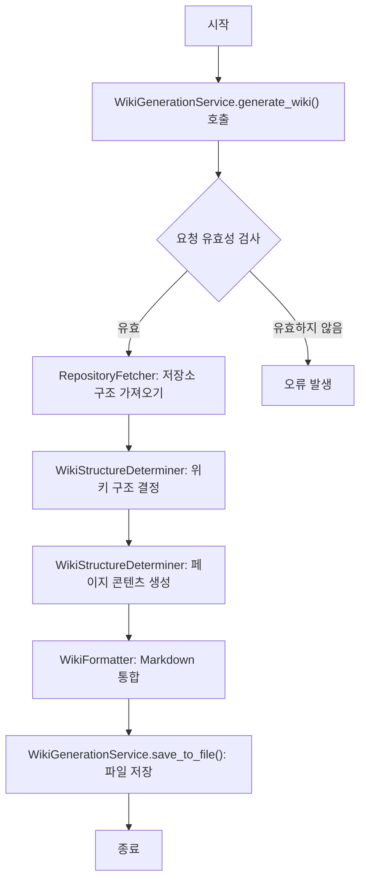
```mermaid
graph TD
    A["시작"] --> B["WikiGenerationService.generate_wiki() 호출"];
    B --> C{"요청 유효성 검사"};
    C -- "유효" --> D["RepositoryFetcher: 저장소 구조 가져오기"];
    D --> E["WikiStructureDeterminer: 위키 구조 결정"];
    E --> F["WikiStructureDeterminer: 페이지 콘텐츠 생성"];
    F --> G["WikiFormatter: Markdown 통합"];
    G --> H["WikiGenerationService.save_to_file(): 파일 저장"];
    H --> I["종료"];
    C -- "유효하지 않음" --> J["오류 발생"];
```

### Wiki 구조 결정 서비스 (`WikiStructureDeterminer`)

`WikiStructureDeterminer`는 LLM을 사용하여 위키의 논리적 구조를 결정하고 각 페이지의 콘텐츠를 생성하는 핵심 서비스입니다. 이 서비스는 저장소의 파일 트리와 README를 분석하여 최적의 문서 구조를 제안하고, 각 페이지에 필요한 소스 파일을 식별하여 LLM에 전달합니다.

*   **파일**: `src/services/structure_analyzer.py`
*   **주요 메서드**:
    *   `_load_prompt_template(prompt_path: str)`: YAML 파일에서 프롬프트 템플릿을 로드합니다 (캐싱).
    *   `_fetch_and_format_files(page: WikiPage)`: 페이지에 필요한 파일을 비동기적으로 병렬로 가져오고 포맷팅합니다.
    *   `generate_page_content(page: WikiPage, language: str)`: 개별 페이지 콘텐츠를 LLM을 사용하여 생성합니다. `asyncio.Semaphore`를 통해 동시 LLM 호출을 제한합니다.
    *   `determine_wiki_structure(file_tree: str, readme: str, ...)`: LLM을 호출하여 전체 위키 구조(`WikiStructure`)를 결정합니다.
    *   `_start_content_generation_flow(language: str)`: 결정된 구조를 기반으로 모든 페이지의 콘텐츠 생성을 시작하는 내부 메서드입니다.
    *   Sources: [src/services/structure_analyzer.py](WikiStructureDeterminer class)

#### 페이지 콘텐츠 생성 흐름

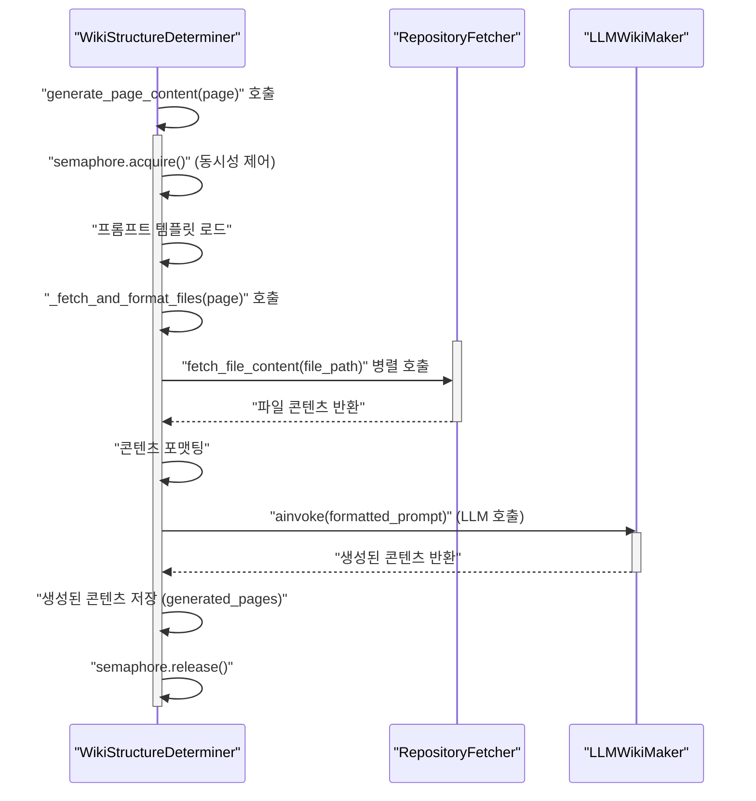
```mermaid
sequenceDiagram
    participant WSD as "WikiStructureDeterminer"
    participant RF as "RepositoryFetcher"
    participant LLM as "LLMWikiMaker"

    WSD->>WSD: "generate_page_content(page)" 호출
    activate WSD
    WSD->>WSD: "semaphore.acquire()" (동시성 제어)
    WSD->>WSD: "프롬프트 템플릿 로드"
    WSD->>WSD: "_fetch_and_format_files(page)" 호출
    activate RF
    WSD->>RF: "fetch_file_content(file_path)" 병렬 호출
    RF-->>WSD: "파일 콘텐츠 반환"
    deactivate RF
    WSD->>WSD: "콘텐츠 포맷팅"
    WSD->>LLM: "ainvoke(formatted_prompt)" (LLM 호출)
    activate LLM
    LLM-->>WSD: "생성된 콘텐츠 반환"
    deactivate LLM
    WSD->>WSD: "생성된 콘텐츠 저장 (generated_pages)"
    WSD->>WSD: "semaphore.release()"
    deactivate WSD
```

## 주요 기능 상세

### 범용 호환성 (Universal Compatibility)

Wiki As Readme는 "진정으로 플러그인 가능한" 도구로 설계되어 사용자가 실행 방식, 위치 및 구동 방식을 자유롭게 선택할 수 있습니다.

*   **모델 불가지론 (Model Agnostic)**: LiteLLM 기반으로 다양한 LLM을 지원합니다.
    *   상용 API: Google Vertex AI (Gemini), OpenAI (GPT-4), Anthropic (Claude), xAI (Grok).
    *   오픈/로컬 모델: Ollama, OpenRouter, HuggingFace.
    *   온프레미스: 자체 프라이빗 LLM 엔드포인트에 안전하게 연결.
    *   Sources: [README.md](Universal Compatibility - Model Agnostic)
*   **플랫폼 불가지론 (Platform Agnostic)**: 다양한 코드 저장소 플랫폼과 통합됩니다.
    *   클라우드 저장소: GitHub, GitLab, Bitbucket.
    *   로컬 개발: 로컬 파일 시스템에서 직접 코드 분석.
    *   프라이빗/엔터프라이즈: 프라이빗 인스턴스 및 자체 호스팅 Git 서버 완벽 지원.
    *   Sources: [README.md](Universal Compatibility - Platform Agnostic)
*   **배포 불가지론 (Deployment Agnostic)**: 다양한 배포 환경을 지원합니다.
    *   CI/CD: GitHub Actions에 통합.
    *   컨테이너: Docker Compose를 통해 실행.
    *   서비스: 웹훅을 지원하는 장기 실행 API 서버로 배포.
    *   CLI: 코딩 중 로컬에서 실행.
    *   Sources: [README.md](Universal Compatibility - Deployment Agnostic)

### 사용 모드 (Usage Modes)

프로젝트는 사용자의 필요에 따라 여러 방식으로 활용될 수 있도록 설계되었습니다.

1.  **GitHub Action (권장)**: CI/CD 파이프라인에서 문서 업데이트를 자동화합니다. 수동 트리거 및 Notion 동기화 옵션을 제공합니다.
2.  **Docker Compose (로컬)**: Python 종속성 설치 없이 전체 UI/API를 로컬에서 실행하는 가장 쉬운 방법입니다.
3.  **로컬 Python 개발**: 소스 코드를 수정하거나 Docker 없이 실행하려는 개발자를 위한 모드입니다.
4.  **서버 및 웹훅**: API 서버를 배포하여 요청 또는 웹훅(예: GitHub)을 처리할 수 있습니다.
    *   Sources: [README.md](Usage Modes)

### API 엔드포인트 (API Endpoints)

백엔드 API는 FastAPI로 구축되었으며, 서버 실행 시 `http://localhost:8000/docs`에서 대화형 Swagger 문서를 확인할 수 있습니다.

| 엔드포인트 | 메서드 | 설명 |
|---|---|---|
| `/api/v1/wiki/generate/file` | `POST` | 위키 생성을 위한 백그라운드 작업을 시작하고 서버에 Markdown 파일로 저장합니다. |
| `/api/v1/wiki/generate/text` | `POST` | 위키 생성을 위한 백그라운드 작업을 시작합니다. 결과 텍스트는 작업 상태에 저장됩니다. |
| `/api/v1/wiki/status/{task_id}` | `GET` | 생성 작업의 상태 및 결과를 검색합니다. |
| `/api/v1/webhook/github` | `POST` | GitHub 웹훅(Push 이벤트)을 위한 엔드포인트입니다. `main` 브랜치 푸시 시 자동 위키 생성을 트리거합니다. HMAC 검증 및 무한 루프 방지 로직이 포함되어 있습니다. |
    *   Sources: [README.md](API Reference)

## 결론

Wiki As Readme의 핵심 기능은 코드베이스를 포괄적이고 최신 상태의 기술 위키로 변환하는 데 필요한 모든 도구를 제공합니다. 범용 호환성, 지능형 콘텐츠 생성, 유연한 배포 옵션을 통해 개발 팀은 문서화 프로세스를 간소화하고 코드와 문서 간의 동기화를 유지할 수 있습니다. 이는 프로젝트의 이해도를 높이고 개발 생산성을 향상시키는 데 크게 기여합니다.

---

<a name="범용-호환성"></a>

<details>
<summary>Relevant source files</summary>

The following files were used as context for generating this wiki page:

- [README.md](README.md)
- [src/providers/github.py](src/providers/github.py)
- [src/providers/gitlab.py](src/providers/gitlab.py)
- [src/providers/bitbucket.py](src/providers/bitbucket.py)
- [src/providers/local.py](src/providers/local.py)
- [src/agent/llm.py](src/agent/llm.py)
</details>

# 범용 호환성

`Wiki As Readme` 프로젝트의 핵심 가치 중 하나는 **범용 호환성**입니다. 이 프로젝트는 사용자가 어떤 환경에서, 어떤 기술 스택을 사용하여, 어떤 모델로 문서를 생성하든 유연하게 대응할 수 있도록 설계되었습니다. "진정으로 플러그인 가능한(truly pluggable)" 도구를 목표로 하며, 모델, 플랫폼, 배포 방식에 구애받지 않는 유연성을 제공합니다.

## 모델 호환성 (Model Agnostic)

`Wiki As Readme`는 `LiteLLM` 라이브러리를 활용하여 다양한 대규모 언어 모델(LLM)과의 통합을 지원합니다. 이를 통해 사용자는 특정 LLM 공급업체에 종속되지 않고, 자신의 요구사항과 환경에 가장 적합한 모델을 선택하여 사용할 수 있습니다.

### 지원 모델 및 공급업체

*   **상용 API:** Google Vertex AI (Gemini), OpenAI (GPT-4), Anthropic (Claude), xAI (Grok)
*   **오픈/로컬 모델:** Ollama, OpenRouter, HuggingFace
*   **온프레미스:** 자체 프라이빗 LLM 엔드포인트에 안전하게 연결

Sources: [README.md](✨ Universal Compatibility - 🧠 1. Model Agnostic (Powered by LiteLLM))

### 구현 상세: LLM 통합

LLM 통합은 `src/agent/llm.py` 파일의 `LLMWikiMaker` 클래스에서 관리됩니다. 이 클래스는 `LiteLLM`을 래핑하여 다양한 LLM 공급업체에 대한 설정을 추상화합니다.

`_configure_llm` 메서드는 `settings.LLM_PROVIDER` 환경 변수에 따라 적절한 모델 이름과 API 호출 인자(예: API 키, 기본 URL, 프로젝트 ID 등)를 구성합니다.

```python
# src/agent/llm.py
class LLMWikiMaker:
    def _configure_llm(self) -> tuple[str, dict]:
        # ... (provider-specific configuration logic) ...
```

Sources: [src/agent/llm.py](LLMWikiMaker class), [src/agent/llm.py](LLMWikiMaker._configure_llm method)

### LLM 구성 흐름

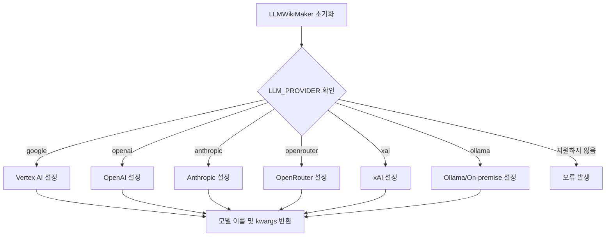
```mermaid
graph TD
    A["LLMWikiMaker 초기화"] --> B{"LLM_PROVIDER 확인"};
    B -- "google" --> C["Vertex AI 설정"];
    B -- "openai" --> D["OpenAI 설정"];
    B -- "anthropic" --> E["Anthropic 설정"];
    B -- "openrouter" --> F["OpenRouter 설정"];
    B -- "xai" --> G["xAI 설정"];
    B -- "ollama" --> H["Ollama/On-premise 설정"];
    C --> I["모델 이름 및 kwargs 반환"];
    D --> I;
    E --> I;
    F --> I;
    G --> I;
    H --> I;
    B -- "지원하지 않음" --> J["오류 발생"];
```

## 플랫폼 호환성 (Platform Agnostic)

`Wiki As Readme`는 코드베이스의 위치에 관계없이 작동하도록 설계되었습니다. 클라우드 기반 Git 저장소와 로컬 파일 시스템을 모두 지원하여, 사용자가 코드를 어디에 저장하든 문서화할 수 있습니다.

### 지원 플랫폼

*   **클라우드 저장소:** GitHub, GitLab, Bitbucket
*   **로컬 개발:** 로컬 파일 시스템에서 직접 코드 분석
*   **프라이빗/엔터프라이즈:** 프라이빗 인스턴스 및 자체 호스팅 Git 서버 완벽 지원

Sources: [README.md](✨ Universal Compatibility - 🚉 2. Platform Agnostic)

### 구현 상세: 저장소 공급자

플랫폼 호환성은 `src/providers` 디렉토리에 있는 다양한 `RepositoryProvider` 구현을 통해 달성됩니다. 각 공급자는 해당 플랫폼의 API 또는 파일 시스템에 접근하여 저장소 구조와 파일 내용을 가져오는 역할을 합니다.

모든 저장소 공급자는 `fetch_structure()` (파일 트리 및 README 가져오기)와 `fetch_file_content()` (개별 파일 내용 가져오기) 메서드를 구현합니다.

*   **`GitHubProvider` (`src/providers/github.py`):** GitHub REST API를 사용하여 저장소 정보를 가져오고, Base64로 인코딩된 파일 내용을 디코딩합니다.
*   **`GitLabProvider` (`src/providers/gitlab.py`):** GitLab API를 사용하며, 자체 호스팅 GitLab 인스턴스도 지원합니다. 프로젝트 경로 인코딩을 처리합니다.
*   **`BitbucketProvider` (`src/providers/bitbucket.py`):** Bitbucket Cloud API를 사용하여 저장소 정보를 가져옵니다.
*   **`LocalProvider` (`src/providers/local.py`):** 로컬 파일 시스템을 스캔하여 저장소 구조를 파악합니다. 디스크 I/O 작업은 `asyncio.to_thread`를 사용하여 비동기적으로 처리됩니다.

Sources: [src/providers/github.py](GitHubProvider class), [src/providers/gitlab.py](GitLabProvider class), [src/providers/bitbucket.py](BitbucketProvider class), [src/providers/local.py](LocalProvider class)

### 저장소 공급자 아키텍처

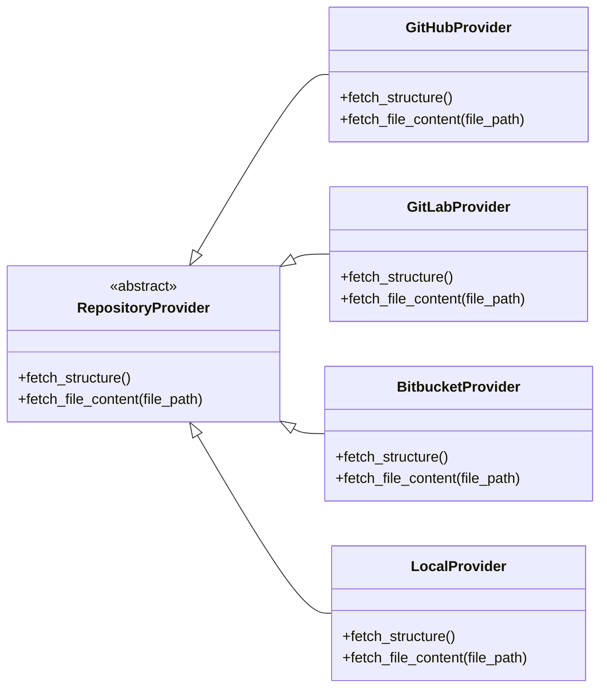
```mermaid
classDiagram
    direction LR
    class RepositoryProvider {
        <<abstract>>
        +fetch_structure()
        +fetch_file_content(file_path)
    }
    class GitHubProvider {
        +fetch_structure()
        +fetch_file_content(file_path)
    }
    class GitLabProvider {
        +fetch_structure()
        +fetch_file_content(file_path)
    }
    class BitbucketProvider {
        +fetch_structure()
        +fetch_file_content(file_path)
    }
    class LocalProvider {
        +fetch_structure()
        +fetch_file_content(file_path)
    }

    RepositoryProvider <|-- GitHubProvider
    RepositoryProvider <|-- GitLabProvider
    RepositoryProvider <|-- BitbucketProvider
    RepositoryProvider <|-- LocalProvider
```

## 배포 호환성 (Deployment Agnostic)

`Wiki As Readme`는 다양한 운영 환경에 쉽게 통합될 수 있도록 유연한 배포 옵션을 제공합니다. 사용자의 워크플로우와 인프라에 맞춰 선택할 수 있습니다.

### 지원 배포 방식

*   **CI/CD:** GitHub Actions와 같은 CI/CD 파이프라인에 통합하여 문서 업데이트를 자동화할 수 있습니다.
*   **컨테이너:** Docker Compose를 통해 전체 UI/API 스택을 로컬에서 쉽게 실행할 수 있습니다.
*   **서비스:** 웹훅(Webhooks)을 지원하는 장기 실행 API 서버로 배포하여 지속적인 문서 생성을 처리할 수 있습니다.
*   **CLI:** 로컬 개발 환경에서 직접 실행하여 코드를 작성하면서 문서를 생성할 수 있습니다.

Sources: [README.md](✨ Universal Compatibility - 🛠️ 3. Deployment Agnostic), [README.md](🚀 Usage Modes)

## 결론

`Wiki As Readme`의 범용 호환성은 이 도구를 매우 유연하고 강력하게 만듭니다. 어떤 LLM을 사용하든, 코드가 어떤 저장소에 있든, 어떤 방식으로 배포하든 상관없이 일관되고 고품질의 문서를 생성할 수 있도록 설계되었습니다. 이러한 "플러그인 가능한" 특성은 다양한 개발 환경과 팀의 요구사항을 충족시키는 데 기여합니다.

---

<a name="github-액션-사용법"></a>

<details>
<summary>Relevant source files</summary>

The following files were used as context for generating this wiki page:

- [.github/workflows/wiki-as-readme-action.yml](.github/workflows/wiki-as-readme-action.yml)
- [action.yml](action.yml)
- [WIKI-AS-README-AS-ACTION.yml](WIKI-AS-README-AS-ACTION.yml)
</details>

# GitHub 액션 사용법

## 1. 소개

이 문서는 `Wiki-As-Readme` GitHub 액션의 사용법과 내부 구조를 설명합니다. `Wiki-As-Readme` 액션은 대규모 언어 모델(LLM)을 활용하여 코드베이스로부터 포괄적인 위키 또는 `README.md` 파일을 자동으로 생성하는 도구입니다. 이 액션은 GitHub 워크플로우 내에서 실행되어 코드 변경 사항을 기반으로 문서를 최신 상태로 유지하거나, 수동으로 트리거하여 특정 설정으로 문서를 생성할 수 있도록 설계되었습니다.

주요 기능은 다음과 같습니다:
*   **자동 문서 생성:** LLM을 사용하여 코드베이스를 분석하고 위키 콘텐츠를 생성합니다.
*   **다국어 지원:** 다양한 언어로 문서 생성을 지원합니다.
*   **다양한 LLM 제공자 지원:** Google, OpenAI, Anthropic 등 여러 LLM 제공자를 사용할 수 있습니다.
*   **Notion 동기화:** 생성된 콘텐츠를 Notion 데이터베이스와 동기화할 수 있습니다.
*   **유연한 커밋 방식:** 생성된 문서를 저장소에 직접 푸시하거나 풀 리퀘스트를 생성하여 적용할 수 있습니다.

## 2. Wiki-As-Readme 액션 정의 (`action.yml`)

`action.yml` 파일은 `Wiki-As-Readme` 커스텀 액션 자체를 정의합니다. 이 파일은 액션의 이름, 설명, 저자, 브랜딩 정보 및 액션이 받을 수 있는 모든 입력 파라미터를 명시합니다. 이 액션은 Docker 컨테이너(`Dockerfile.action`)를 사용하여 실행됩니다.

### 2.1. 액션 입력 파라미터

`Wiki-As-Readme` 액션은 다음과 같은 입력 파라미터를 지원합니다. 이 파라미터들은 워크플로우 파일에서 `with:` 키워드를 통해 전달되거나, 환경 변수로 매핑되어 액션 컨테이너 내부에서 사용됩니다.

| 파라미터 | 설명 | 기본값 |
|---|---|---|
| `language` | 생성될 콘텐츠의 언어 코드 (예: `ko`, `en`) | `en` |
| `wiki_output_path` | 생성된 위키 콘텐츠를 저장할 파일 경로 | `WIKI.md` |
| `llm_provider` | 사용할 LLM 제공자 (예: `google`, `openai`, `anthropic`, `openrouter`, `xai`, `ollama`) | `google` |
| `model_name` | 사용할 특정 모델 이름 | `gemini-2.5-flash` |
| `openai_api_key` | OpenAI API 키 | |
| `anthropic_api_key` | Anthropic API 키 | |
| `openrouter_api_key` | OpenRouter API 키 | |
| `xai_api_key` | xAI API 키 | |
| `git_api_token` | 비공개 저장소 접근을 위한 GitHub/GitLab API 토큰 | |
| `gcp_project_name` | GCP 프로젝트 이름 (Google LLM 사용 시) | |
| `gcp_model_location` | GCP 모델 위치 (Google LLM 사용 시) | |
| `google_application_credentials` | GCP 서비스 계정 JSON 키 (내용 또는 경로) | |
| `llm_base_url` | LLM API를 위한 사용자 정의 기본 URL | |
| `use_structured_output` | 구조화된 JSON 출력을 사용할지 여부 | `true` |
| `temperature` | LLM 온도 (0.0 ~ 1.0) | `0.0` |
| `max_retries` | 최대 재시도 횟수 | `3` |
| `max_concurrency` | 최대 병렬 LLM 호출 수 | `5` |
| `ignored_patterns` | 무시할 glob 패턴의 JSON 배열 | `[]` |

Sources: [action.yml](action.yml)

## 3. GitHub 워크플로우 구성

`Wiki-As-Readme` 액션은 `.github/workflows/` 디렉토리에 정의된 워크플로우 파일들을 통해 실행됩니다. 여기서는 두 가지 예시 워크플로우 파일인 `.github/workflows/wiki-as-readme-action.yml`과 `WIKI-AS-README-AS-ACTION.yml`을 분석합니다. 이 두 파일은 거의 동일한 기능을 수행하지만, `WIKI_OUTPUT_PATH`의 기본값과 `commit_method`의 기본값에서 약간의 차이가 있습니다.

### 3.1. 워크플로우 트리거

워크플로우는 두 가지 주요 방식으로 트리거될 수 있습니다.

1.  **`push` 이벤트:** `main` 브랜치에 코드가 푸시될 때 자동으로 실행됩니다. 특정 파일(`README.md`, `WIKI.md`, 워크플로우 파일 자체)의 변경은 이 트리거를 무시합니다.
    ```yaml
    on:
      push:
        branches:
          - main
        paths-ignore:
          - 'README.md'
          - 'WIKI.md'
          - '.github/workflows/WIKI-AS-README-AS-ACTION.yml'
    ```
    Sources: [.github/workflows/wiki-as-readme-action.yml](.github/workflows/wiki-as-readme-action.yml), [WIKI-AS-README-AS-ACTION.yml](WIKI-AS-README-AS-ACTION.yml)

2.  **`workflow_dispatch` (수동 트리거):** GitHub UI에서 워크플로우를 수동으로 실행할 수 있도록 합니다. 이 방식은 사용자 정의 입력 설정을 허용합니다.

    | 입력 파라미터 | 설명 | 타입 | 기본값 |
    |---|---|---|---|
    | `language` | 언어 코드 (예: `ko`, `en`, `ja`) | `string` | `en` |
    | `llm_provider` | LLM 제공자 (예: `google`, `openai`, `anthropic`) | `string` | `google` |
    | `model_name` | 모델 이름 | `string` | `gemini-2.5-flash` |
    | `sync_to_notion` | Notion으로 동기화할지 여부 | `boolean` | `false` |
    | `commit_method` | 변경 사항 적용 방법 | `choice` | `pull-request` (wiki-as-readme-action.yml), `push` (WIKI-AS-README-AS-ACTION.yml) |

    Sources: [.github/workflows/wiki-as-readme-action.yml](.github/workflows/wiki-as-readme-action.yml), [WIKI-AS-README-AS-ACTION.yml](WIKI-AS-README-AS-ACTION.yml)

### 3.2. 작업 (`jobs`) 정의

워크플로우는 `wiki-time`이라는 단일 작업을 포함합니다.

#### 3.2.1. 작업 설정

*   **`runs-on: ubuntu-latest`**: 작업이 실행될 환경을 지정합니다.
*   **`permissions`**: 작업에 필요한 권한을 정의합니다.
    *   `contents: write`: 저장소 콘텐츠에 대한 쓰기 권한 (파일 업데이트, 커밋).
    *   `pull-requests: write`: 풀 리퀘스트 생성 및 관리를 위한 쓰기 권한.
*   **`env`**: 작업 전반에 걸쳐 사용될 환경 변수를 설정합니다.
    *   `WIKI_OUTPUT_PATH`: 생성된 위키 파일의 출력 경로를 정의합니다.
        *   `.github/workflows/wiki-as-readme-action.yml`: `examples/wiki_as_README.md`
        *   `WIKI-AS-README-AS-ACTION.yml`: `WIKI.md`
*   **`concurrency`**: (선택 사항, `WIKI-AS-README-AS-ACTION.yml`에만 있음) 동일한 그룹의 이전 실행이 진행 중인 경우 현재 실행을 취소하여 동시 실행을 관리합니다.

Sources: [.github/workflows/wiki-as-readme-action.yml](.github/workflows/wiki-as-readme-action.yml), [WIKI-AS-README-AS-ACTION.yml](WIKI-AS-README-AS-ACTION.yml)

#### 3.2.2. 단계 (`steps`)

작업은 다음 단계들로 구성됩니다.

1.  **코드 체크아웃 (`Checkout code`)**
    *   `uses: actions/checkout@v4`: 저장소 코드를 워크플로우 실행 환경으로 가져옵니다. `ref`를 지정하지 않으면, 트리거된 브랜치(수동 실행 시 선택된 브랜치)가 자동으로 체크아웃됩니다.

2.  **GCP 자격 증명 파일 생성 (선택 사항)**
    *   `if`: LLM 제공자가 `google`이거나, `push` 이벤트인 경우에만 실행됩니다.
    *   `env.GCP_KEY`: GitHub Secrets에 저장된 `GOOGLE_APPLICATION_CREDENTIALS` 값을 사용합니다.
    *   `run`: `GCP_KEY`가 존재하면 해당 내용을 `gcp-key.json` 파일로 저장합니다. 없으면 경고를 출력합니다. 이 파일은 Google Cloud 인증에 사용됩니다.

3.  **위키 콘텐츠 생성 및 동기화 (`Generate Content (and Sync to Notion if enabled)`)**
    *   `uses: docker://ghcr.io/catuscio/wiki-as-readme-action:latest`: `Wiki-As-Readme` 액션의 최신 Docker 이미지를 실행합니다.
    *   `env`: 액션에 필요한 다양한 환경 변수를 설정합니다.
        *   **기본 설정:** `LANGUAGE`, `WIKI_OUTPUT_PATH`.
        *   **LLM 제공자 및 모델 설정:** `LLM_PROVIDER`, `MODEL_NAME`.
        *   **API 키 설정:**
            *   **GCP/Vertex AI:** `GCP_PROJECT_NAME`, `GCP_MODEL_LOCATION` (Secrets에서), `GOOGLE_APPLICATION_CREDENTIALS` (생성된 `gcp-key.json` 경로).
            *   **다른 제공자:** `OPENAI_API_KEY`, `ANTHROPIC_API_KEY` (Secrets에서).
        *   **GitHub 토큰:** `GIT_API_TOKEN` (내장된 `GITHUB_TOKEN` 사용).
        *   **Notion 동기화 설정:** `NOTION_SYNC_ENABLED`, `NOTION_API_KEY`, `NOTION_DATABASE_ID` (Secrets에서).

4.  **GCP 자격 증명 파일 삭제 (선택 사항)**
    *   `if: always()`: 이전 단계의 성공 여부와 관계없이 항상 실행됩니다.
    *   `run: rm -f ./gcp-key.json`: 보안을 위해 생성된 GCP 자격 증명 파일을 삭제합니다.

5.  **변경 사항 커밋 및 푸시**
    이 단계는 `commit_method` 입력 값 또는 트리거 이벤트에 따라 두 가지 방식으로 동작합니다.

    *   **옵션 A: 직접 푸시 (`Commit and Push changes`)**
        *   `if`: `commit_method`가 `'push'`이거나 `push` 이벤트인 경우 실행됩니다.
        *   `uses: stefanzweifel/git-auto-commit-action@v5`: 변경된 파일을 자동으로 커밋하고 푸시합니다.
        *   `with.commit_message`: 커밋 메시지를 지정합니다.
        *   `with.file_pattern`: 커밋할 파일 패턴을 지정합니다 (`WIKI_OUTPUT_PATH`).

    *   **옵션 B: 풀 리퀘스트 생성 (`Create Pull Request`)**
        *   `if`: `commit_method`가 `'pull-request'`인 경우 실행됩니다.
        *   `uses: peter-evans/create-pull-request@v7`: 새로운 풀 리퀘스트를 생성합니다.
        *   `with.title`: 풀 리퀘스트 제목을 지정합니다.
        *   `with.body`: 풀 리퀘스트 본문 내용을 지정합니다.
        *   `with.branch`: 새로운 브랜치 이름을 지정합니다 (예: `wiki-update-{{ github.run_id }}`).
        *   `with.commit-message`: 풀 리퀘스트에 포함될 커밋 메시지를 지정합니다.
        *   `with.add-paths`: 풀 리퀘스트에 추가할 파일 경로를 지정합니다 (`WIKI_OUTPUT_PATH`).

Sources: [.github/workflows/wiki-as-readme-action.yml](.github/workflows/wiki-as-readme-action.yml), [WIKI-AS-README-AS-ACTION.yml](WIKI-AS-README-AS-ACTION.yml)

### 3.3. 워크플로우 실행 흐름

다음 다이어그램은 `wiki-time` 작업의 주요 실행 흐름을 시각적으로 보여줍니다.

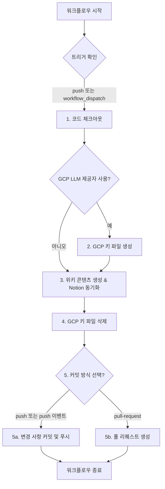
```mermaid
graph TD
    Start["워크플로우 시작"] --> TriggerCheck{"트리거 확인"}
    TriggerCheck -- "push 또는 workflow_dispatch" --> Checkout["1. 코드 체크아웃"]
    Checkout --> GCPCheck{"GCP LLM 제공자 사용?"}
    GCPCheck -- "예" --> CreateGCP["2. GCP 키 파일 생성"]
    GCPCheck -- "아니오" --> GenerateSync["3. 위키 콘텐츠 생성 & Notion 동기화"]
    CreateGCP --> GenerateSync
    GenerateSync --> CleanupGCP["4. GCP 키 파일 삭제"]
    CleanupGCP --> CommitMethod{"5. 커밋 방식 선택?"}
    CommitMethod -- "push 또는 push 이벤트" --> PushChanges["5a. 변경 사항 커밋 및 푸시"]
    CommitMethod -- "pull-request" --> CreatePR["5b. 풀 리퀘스트 생성"]
    PushChanges --> End["워크플로우 종료"]
    CreatePR --> End
```

## 4. 결론

`Wiki-As-Readme` GitHub 액션은 코드베이스 문서를 자동화하고 최신 상태로 유지하는 강력한 도구입니다. `action.yml`을 통해 액션의 기능을 정의하고, 워크플로우 파일(`wiki-as-readme-action.yml`, `WIKI-AS-README-AS-ACTION.yml`)을 통해 다양한 트리거, LLM 설정, Notion 동기화 및 유연한 커밋 방식을 지원하여 개발 워크플로우에 쉽게 통합될 수 있습니다. 이를 통해 개발자는 문서화에 드는 시간을 절약하고 코드 개발에 더 집중할 수 있습니다.

---

<a name="docker-compose로-실행"></a>

<details>
<summary>Relevant source files</summary>

The following files were used as context for generating this wiki page:

- [docker-compose.yml](docker-compose.yml)
- [Dockerfile](Dockerfile)
- [Dockerfile.action](Dockerfile.action)
- [Dockerfile.server](Dockerfile.server)
- [.env.example](.env.example)
</details>

# Docker Compose로 실행

이 문서는 `wiki-as-readme` 프로젝트를 Docker Compose를 사용하여 로컬 환경에서 실행하는 방법에 대해 설명합니다. Docker Compose는 다중 컨테이너 Docker 애플리케이션을 정의하고 실행하기 위한 도구로, 이 프로젝트에서는 애플리케이션의 API 서버와 Streamlit UI를 단일 명령으로 쉽게 배포하고 관리할 수 있도록 합니다.

`docker-compose.yml` 파일은 서비스, 네트워크, 볼륨 등을 구성하며, 애플리케이션의 메인 `Dockerfile`을 사용하여 컨테이너 이미지를 빌드하고 실행합니다. 이를 통해 개발 환경 설정의 복잡성을 줄이고 일관된 실행 환경을 제공합니다.

## 1. Docker Compose 설정 개요

`docker-compose.yml` 파일은 `wiki-as-readme` 애플리케이션을 실행하기 위한 핵심 구성 요소입니다. 이 파일은 `wiki-as-readme`라는 단일 서비스를 정의하며, 이 서비스는 애플리케이션의 빌드, 포트 매핑, 환경 변수 설정, 볼륨 마운트 등을 담당합니다.

### 1.1. 서비스 정의 (`wiki-as-readme`)

`docker-compose.yml` 파일은 `wiki-as-readme`라는 이름의 서비스를 정의합니다. 이 서비스는 애플리케이션의 전체 스택(API 및 UI)을 포함합니다.

```yaml
services:
  wiki-as-readme:
    build: .
    container_name: wiki-as-readme
    ports:
      - "8000:8000" # API
      - "8501:8501" # Streamlit UI
    env_file:
      - .env
    environment:
      - GOOGLE_APPLICATION_CREDENTIALS=/app/credentials.json # Google Cloud (Vertex AI) 사용 시
    volumes:
      - ${WIKI_OUTPUT_PATH:-./output}:/app/output
      - ${GOOGLE_CREDENTIALS_PATH:-./credentials.json}:/app/credentials.json # Google Cloud (Vertex AI) 사용 시
      - ${LOCAL_REPO_PATH:-./}:/app/target_repo
    restart: always
```
Sources: [docker-compose.yml](docker-compose.yml)

**주요 구성 요소:**

*   **`build: .`**: 현재 디렉터리(`docker-compose.yml` 파일이 있는 곳)에 있는 `Dockerfile`을 사용하여 Docker 이미지를 빌드하도록 지시합니다.
*   **`container_name: wiki-as-readme`**: 생성될 컨테이너의 이름을 `wiki-as-readme`로 지정합니다.
*   **`ports`**: 호스트 머신의 포트와 컨테이너 내부의 포트를 매핑합니다.
    *   `8000:8000`: API 서버 (FastAPI)에 접근하기 위한 포트입니다.
    *   `8501:8501`: Streamlit UI에 접근하기 위한 포트입니다.
*   **`env_file: - .env`**: `.env` 파일에서 환경 변수를 로드합니다. 이 파일은 LLM 공급자 설정, API 키, 경로 설정 등을 포함합니다. `.env.example` 파일을 참조하여 `.env` 파일을 생성해야 합니다.
*   **`environment`**: 컨테이너 내부에 직접 환경 변수를 설정합니다. `GOOGLE_APPLICATION_CREDENTIALS`는 Google Cloud (Vertex AI)를 사용하는 경우에 필요합니다.
*   **`volumes`**: 호스트 머신의 디렉터리를 컨테이너 내부의 디렉터리에 마운트하여 데이터를 공유하고 영속성을 확보합니다.
    *   `${WIKI_OUTPUT_PATH:-./output}:/app/output`: 생성된 위키 파일이 저장될 호스트 경로를 컨테이너의 `/app/output`에 마운트합니다. `WIKI_OUTPUT_PATH` 환경 변수가 설정되지 않으면 기본값으로 `./output`이 사용됩니다.
    *   `${GOOGLE_CREDENTIALS_PATH:-./credentials.json}:/app/credentials.json`: Google Cloud 자격 증명 파일 경로를 마운트합니다. `GOOGLE_CREDENTIALS_PATH`가 설정되지 않으면 `./credentials.json`이 기본값으로 사용됩니다.
    *   `${LOCAL_REPO_PATH:-./}:/app/target_repo`: 분석할 로컬 저장소의 경로를 컨테이너의 `/app/target_repo`에 마운트합니다. `LOCAL_REPO_PATH`가 설정되지 않으면 현재 디렉터리(`./`)가 기본값으로 사용됩니다.
*   **`restart: always`**: 컨테이너가 종료되거나 Docker 데몬이 재시작될 때 항상 컨테이너를 다시 시작하도록 설정합니다.

### 1.2. 애플리케이션 Dockerfile (`Dockerfile`)

`docker-compose.yml`에서 `build: .` 지시어는 프로젝트 루트에 있는 `Dockerfile`을 사용하여 이미지를 빌드합니다. 이 `Dockerfile`은 `wiki-as-readme` 애플리케이션의 API와 Streamlit UI를 모두 포함하는 완전한 이미지를 생성합니다.

**빌드 과정:**
1.  **Stage 1: Builder**: `python:3.12-slim-bookworm` 이미지를 기반으로 `uv`를 설치하고, `pyproject.toml` 및 `uv.lock` 파일을 복사하여 모든 종속성(`--extra all`)을 설치합니다.
2.  **Stage 2: Final Image**: 다시 `python:3.12-slim-bookworm` 이미지를 기반으로 `appuser`를 생성하고, 빌더 스테이지에서 설치된 가상 환경(`/.venv`)과 소스 코드(`src`)를 복사합니다. `entrypoint.sh` 스크립트를 실행 파일로 만들고, 필요한 환경 변수(`PATH`, `PYTHONPATH`)를 설정한 후, `8000`번(API)과 `8501`번(Streamlit UI) 포트를 노출합니다. 최종적으로 `appuser`로 전환하여 `entrypoint.sh`를 실행합니다.
Sources: [Dockerfile](Dockerfile)

### 1.3. 환경 변수 설정 (`.env.example`)

`docker-compose.yml`의 `env_file: - .env` 설정은 `.env` 파일에서 환경 변수를 로드합니다. `.env.example` 파일은 사용자가 `.env` 파일을 생성할 때 참조할 수 있는 템플릿을 제공합니다. 이 파일에는 LLM 공급자 설정, API 키, 로컬 경로 설정 등 애플리케이션 동작에 필수적인 다양한 변수들이 정의되어 있습니다.

**Docker Compose 실행과 관련된 주요 환경 변수:**

| 변수명 | 설명 | 기본값 (docker-compose.yml) |
|---|---|---|
| `LLM_PROVIDER` | 사용할 LLM 공급자 (예: `google`, `openai`) | `google` |
| `MODEL_NAME` | 사용할 LLM 모델 이름 (예: `gemini-2.5-flash`) | `gemini-2.5-flash` |
| `OPENAI_API_KEY` | OpenAI API 키 (OpenAI 사용 시) | |
| `ANTHROPIC_API_KEY` | Anthropic API 키 (Anthropic 사용 시) | |
| `GCP_PROJECT_NAME` | Google Cloud 프로젝트 이름 (Google Vertex AI 사용 시) | |
| `GCP_MODEL_LOCATION` | Google Cloud 모델 위치 (Google Vertex AI 사용 시) | |
| `LOCAL_REPO_PATH` | 분석할 로컬 저장소의 호스트 경로 | `./` (현재 디렉터리) |
| `WIKI_OUTPUT_PATH` | 생성된 위키 파일이 저장될 호스트 경로 | `./output` |
| `GOOGLE_CREDENTIALS_PATH` | Google Cloud 서비스 계정 JSON 키 파일의 호스트 경로 | `./credentials.json` |

Sources: [.env.example](.env.example)

## 2. Docker Compose 실행 흐름

Docker Compose를 사용하여 애플리케이션을 실행하는 과정은 다음과 같습니다.

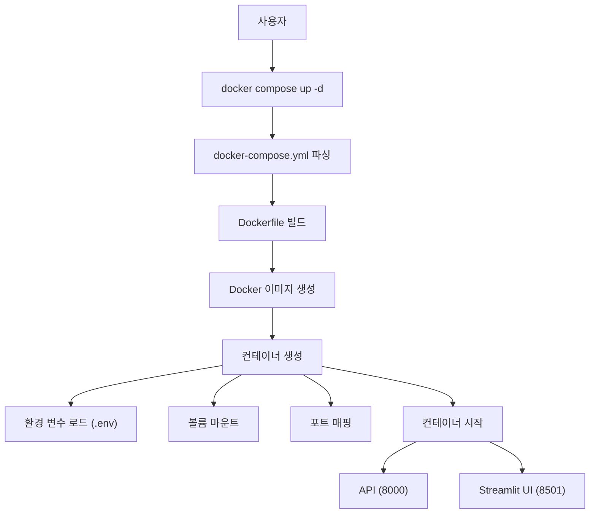
```mermaid
graph TD
    A["사용자"] --> B["docker compose up -d"];
    B --> C["docker-compose.yml 파싱"];
    C --> D["Dockerfile 빌드"];
    D --> E["Docker 이미지 생성"];
    E --> F["컨테이너 생성"];
    F --> G["환경 변수 로드 (.env)"];
    F --> H["볼륨 마운트"];
    F --> I["포트 매핑"];
    F --> J["컨테이너 시작"];
    J --> K["API (8000)"];
    J --> L["Streamlit UI (8501)"];
```

## 3. 기타 Dockerfile (참고)

프로젝트에는 `Dockerfile` 외에도 특정 목적을 위한 다른 Dockerfile들이 존재하지만, 기본 `docker-compose.yml` 설정에서는 사용되지 않습니다.

*   **`Dockerfile.action`**: GitHub Actions에서 사용하기 위한 이미지 빌드에 사용됩니다. Notion 연동에 필요한 종속성만 설치하며, `action_entrypoint.py`를 진입점으로 사용합니다.
    Sources: [Dockerfile.action](Dockerfile.action)
*   **`Dockerfile.server`**: API 서버만 실행하기 위한 이미지 빌드에 사용됩니다. `gunicorn`을 사용하여 FastAPI 애플리케이션(`src.server:app`)을 실행하며, Streamlit UI 관련 코드는 포함하지 않습니다.
    Sources: [Dockerfile.server](Dockerfile.server)

이러한 파일들은 `docker-compose.yml`의 `build: .` 설정과는 무관하며, 다른 배포 시나리오를 위해 존재합니다.

## 결론

Docker Compose를 사용하면 `wiki-as-readme` 애플리케이션을 로컬 환경에서 쉽고 일관되게 실행할 수 있습니다. `docker-compose.yml` 파일은 애플리케이션의 빌드, 포트 노출, 데이터 영속성, 환경 변수 관리 등을 중앙 집중식으로 정의하여 개발 및 테스트 과정을 간소화합니다. `.env` 파일을 통해 LLM 설정, API 키, 로컬 경로 등을 유연하게 구성할 수 있어 다양한 사용 환경에 맞게 애플리케이션을 조정할 수 있습니다.

---

<a name="로컬-개발-환경-설정"></a>

<details>
<summary>Relevant source files</summary>

The following files were used as context for generating this wiki page:

- [pyproject.toml](pyproject.toml)
- [src/server.py](src/server.py)
- [src/app.py](src/app.py)
- [.python-version](.python-version)
</details>

# 로컬 개발 환경 설정

이 문서는 "Wiki As Readme" 프로젝트의 로컬 개발 환경을 설정하고 실행하는 방법에 대해 설명합니다. 이 프로젝트는 코드베이스를 포괄적인 위키로 변환하여 단일 README 파일로 제공하는 것을 목표로 합니다. 로컬 환경 설정은 백엔드 API 서버와 프론트엔드 Streamlit UI 애플리케이션을 포함하며, 개발 및 테스트를 위한 필수 구성 요소를 다룹니다.

## 1. 프로젝트 개요

"Wiki As Readme"는 코드베이스를 분석하여 자동으로 위키 문서를 생성하는 도구입니다. 이 프로젝트는 다음과 같은 주요 구성 요소로 이루어져 있습니다:

*   **FastAPI 백엔드**: 위키 생성 로직을 처리하고 API 엔드포인트를 제공합니다.
*   **Streamlit 프론트엔드**: 사용자가 위키 생성을 요청하고 결과를 확인할 수 있는 웹 인터페이스를 제공합니다.
*   **의존성 관리**: `pyproject.toml`을 통해 프로젝트의 모든 의존성을 관리합니다.

## 2. 필수 요구사항

로컬 개발 환경을 설정하기 전에 다음 요구사항을 충족해야 합니다.

### 2.1. Python 버전

이 프로젝트는 특정 Python 버전을 요구합니다.
*   **Python 3.12 이상**
    *   `pyproject.toml`에 `requires-python = ">=3.12"`로 명시되어 있습니다.
    *   `.python-version` 파일에도 `3.12`로 지정되어 있습니다.

Sources: [pyproject.toml](project.requires-python), [.python-version](root)

## 3. 의존성 관리

프로젝트의 모든 의존성은 `pyproject.toml` 파일에 정의되어 있습니다. `poetry` 또는 `pip`와 같은 도구를 사용하여 의존성을 설치할 수 있습니다.

### 3.1. 핵심 의존성

프로젝트의 기본 기능을 위해 필요한 라이브러리입니다.

| 라이브러리 | 버전 | 설명 |
|---|---|---|
| `google-auth` | `>=2.45.0` | Google 인증 관련 기능 |
| `httpx` | `>=0.28.1` | 비동기 HTTP 클라이언트 |
| `jinja2` | `>=3.1.6` | 템플릿 엔진 |
| `litellm` | `>=1.80.11` | 다양한 LLM API 통합 |
| `loguru` | `>=0.7.3` | 로깅 라이브러리 |
| `pydantic` | `>=2.12.5` | 데이터 유효성 검사 및 설정 관리 |
| `pydantic-settings` | `>=2.12.0` | Pydantic 기반 설정 관리 |
| `python-dotenv` | `>=1.2.1` | `.env` 파일에서 환경 변수 로드 |
| `pyyaml` | `>=6.0.3` | YAML 파싱 및 생성 |
| `requests` | `>=2.32.5` | 동기 HTTP 클라이언트 |

Sources: [pyproject.toml](project.dependencies)

### 3.2. 선택적 의존성

특정 기능(UI, API, Notion 통합)을 사용하기 위해 필요한 의존성입니다.

*   **`ui`**: Streamlit 기반 UI를 위한 의존성.
    *   `streamlit>=1.51.0`
    *   `streamlit-mermaid`
*   **`api`**: FastAPI 서버 배포를 위한 의존성.
    *   `fastapi>=0.128.0`
    *   `uvicorn>=0.40.0`
    *   `gunicorn>=23.0.0`
*   **`notion`**: Notion 통합을 위한 의존성.
    *   `notion-client>=2.7.0`
*   **`all`**: 모든 선택적 의존성을 포함합니다.

Sources: [pyproject.toml](project.optional-dependencies)

### 3.3. 개발 의존성

개발 및 코드 품질 관리를 위한 도구입니다.

*   **`pre-commit`**: 커밋 전 훅 관리 도구.
*   **`ruff`**: Python 코드 포매터 및 린터.

Sources: [pyproject.toml](dependency-groups.dev)

### 3.4. 의존성 설치

프로젝트 루트 디렉토리에서 다음 명령을 실행하여 모든 의존성을 설치할 수 있습니다.

```bash
# 모든 핵심, UI, API, 개발 의존성 설치 (poetry 사용 예시)
# poetry add --group dev pre-commit ruff
# poetry install --with ui,api,dev
pip install -e ".[ui,api,notion]"
pip install pre-commit ruff
```

## 4. 백엔드 API 서버 설정

FastAPI 기반의 백엔드 서버는 위키 생성 요청을 처리하고, 작업 상태를 관리하며, 웹훅 통합을 제공합니다.

### 4.1. 서버 구성

*   **프레임워크**: FastAPI
*   **웹 서버**: Uvicorn
*   **기본 주소**: `http://127.0.0.1:8000`
*   **API 버전**: `v1`

### 4.2. 주요 엔드포인트

*   `/`: 헬스 체크 (상태: `ok`)
*   `/api/v1/wiki`: 위키 생성 및 관련 작업
*   `/api/v1/webhook`: 웹훅 통합

Sources: [src/server.py](app.include_router)

### 4.3. 서버 실행

개발 모드에서 서버를 실행하려면 프로젝트 루트 디렉토리에서 다음 명령을 실행합니다.

```bash
python src/server.py
```

이 명령은 `uvicorn`을 사용하여 `127.0.0.1:8000`에서 서버를 시작하고, 코드 변경 시 자동으로 재로드(`reload=True`)됩니다.

Sources: [src/server.py](if __name__ == "__main__")

## 5. 프론트엔드 UI 애플리케이션 설정

Streamlit 기반의 프론트엔드 UI는 사용자가 위키 생성을 요청하고, 진행 상황을 모니터링하며, 생성된 위키를 미리 보고 다운로드할 수 있도록 합니다.

### 5.1. UI 구성

*   **프레임워크**: Streamlit
*   **API 통신**: `httpx` (비동기)
*   **Mermaid 렌더링**: `streamlit-mermaid`

### 5.2. API 연동

UI 애플리케이션은 백엔드 API 서버와 통신하여 위키 생성 작업을 시작하고 상태를 폴링합니다.

*   **API 기본 URL**: `API_BASE_URL` 환경 변수를 통해 설정됩니다. 기본값은 `http://localhost:8000/api/v1`입니다.
*   **생성 요청**: `/api/v1/wiki/generate/file` 엔드포인트로 `POST` 요청을 보냅니다.
*   **상태 폴링**: `/api/v1/wiki/status/{task_id}` 엔드포인트로 `GET` 요청을 보내 작업 상태를 확인합니다.

Sources: [src/app.py](API_BASE_URL), [src/app.py](start_generation_task), [src/app.py](poll_task_status)

### 5.3. 환경 변수 설정

API 키나 기타 민감한 정보는 `.env` 파일을 통해 관리하는 것이 권장됩니다. `src/app.py`의 사이드바에 `.env` 설정에 대한 안내가 있습니다.

Sources: [src/app.py](render_generator_page function, "💡 Note: Setup .env first")

### 5.4. UI 애플리케이션 실행

Streamlit UI를 실행하려면 프로젝트 루트 디렉토리에서 다음 명령을 실행합니다.

```bash
streamlit run src/app.py
```

이 명령은 웹 브라우저에서 Streamlit 애플리케이션을 엽니다.

## 6. 개발 환경 흐름

다음 다이어그램은 로컬 개발 환경에서 사용자 요청이 처리되는 전체 흐름을 보여줍니다.

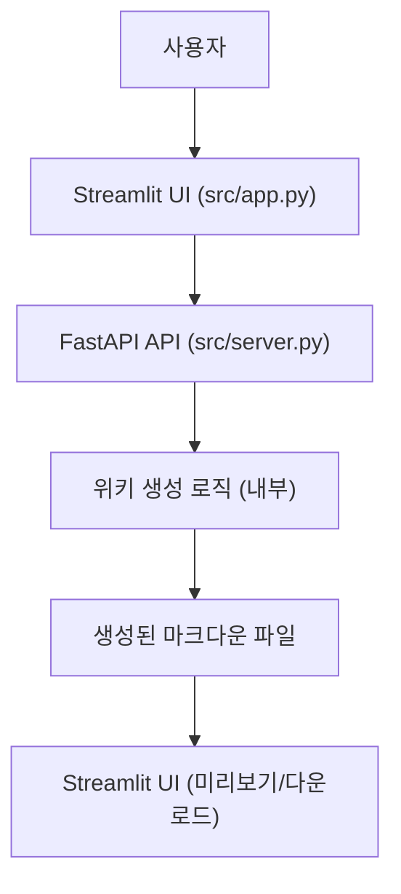
```mermaid
graph TD
    User["사용자"] --> StreamlitUI["Streamlit UI (src/app.py)"]
    StreamlitUI --> FastAPI_API["FastAPI API (src/server.py)"]
    FastAPI_API --> WikiGenerationLogic["위키 생성 로직 (내부)"]
    WikiGenerationLogic --> OutputFile["생성된 마크다운 파일"]
    OutputFile --> StreamlitUI_Preview["Streamlit UI (미리보기/다운로드)"]
```

### 6.1. 위키 생성 작업 흐름

사용자가 UI에서 위키 생성을 요청할 때의 비동기 작업 흐름은 다음과 같습니다.

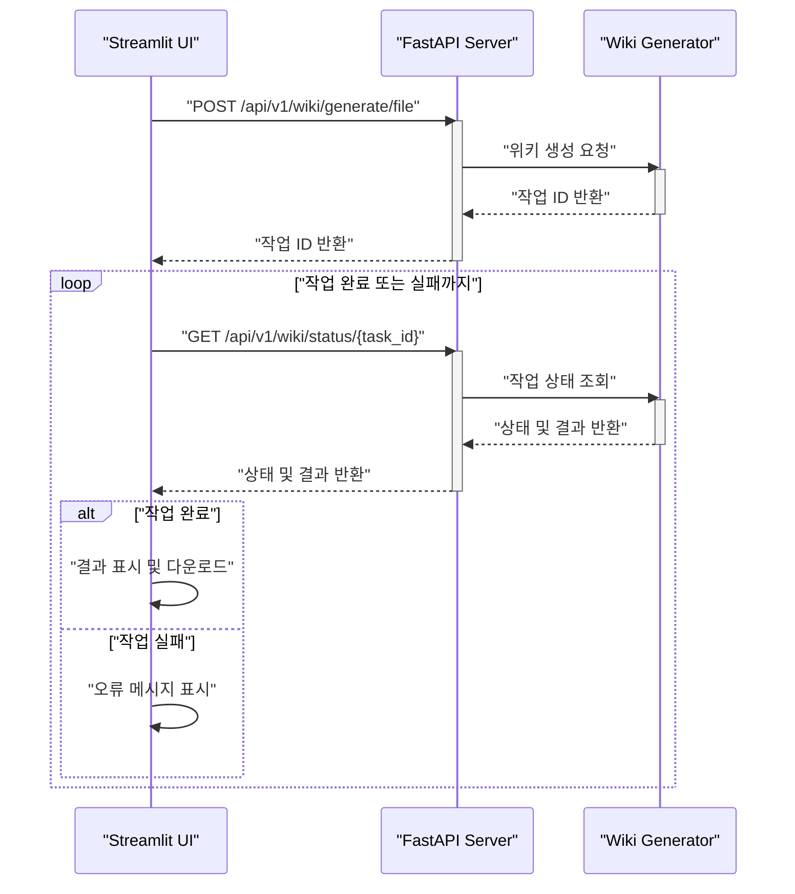
```mermaid
sequenceDiagram
    participant S as "Streamlit UI"
    participant F as "FastAPI Server"
    participant G as "Wiki Generator"

    S->>F: "POST /api/v1/wiki/generate/file"
    activate F
    F->>G: "위키 생성 요청"
    activate G
    G-->>F: "작업 ID 반환"
    deactivate G
    F-->>S: "작업 ID 반환"
    deactivate F

    loop "작업 완료 또는 실패까지"
        S->>F: "GET /api/v1/wiki/status/{task_id}"
        activate F
        F->>G: "작업 상태 조회"
        activate G
        G-->>F: "상태 및 결과 반환"
        deactivate G
        F-->>S: "상태 및 결과 반환"
        deactivate F
        alt "작업 완료"
            S->>S: "결과 표시 및 다운로드"
        else "작업 실패"
            S->>S: "오류 메시지 표시"
        end
    end
```

## 7. 개발 도구

`pyproject.toml`에 정의된 개발 도구는 코드 품질과 일관성을 유지하는 데 도움을 줍니다.

### 7.1. Ruff

`ruff`는 Python 코드의 린팅 및 포매팅을 담당합니다. `pyproject.toml`에 다음과 같이 설정되어 있습니다.

*   **줄 길이**: `88`
*   **대상 Python 버전**: `py312`
*   **선택된 린트 규칙**: `F`, `W`, `E`, `I`, `UP`, `C4`, `FA`, `ISC`, `ICN`, `RET`, `SIM`, `TID`, `TC`, `TD`, `NPY`
*   **무시 규칙**: `E501` (줄 길이 초과)
*   **자동 수정**: 모든 규칙에 대해 활성화 (`fixable = ["ALL"]`)
*   **포맷팅**: 큰따옴표 사용 (`quote-style = "double"`), 공백 들여쓰기 (`indent-style = "space"`)

Sources: [pyproject.toml](tool.ruff)

## 8. 결론

이 문서는 "Wiki As Readme" 프로젝트의 로컬 개발 환경을 설정하는 데 필요한 모든 정보를 제공했습니다. Python 버전 요구사항, 의존성 설치, 백엔드 및 프론트엔드 애플리케이션 실행 방법, 그리고 개발 도구 설정에 대한 이해를 통해 개발자는 프로젝트에 기여하거나 기능을 테스트할 수 있습니다. `.env` 파일을 통한 환경 변수 관리와 Docker 환경에서의 경로 설정 팁(`src/app.py` 참조)도 개발 과정에서 유용하게 활용될 수 있습니다.

---

<a name="서버-및-웹훅-배포"></a>

<details>
<summary>Relevant source files</summary>

The following files were used as context for generating this wiki page:

- [src/server.py](src/server.py)
- [src/api/v1/endpoints/webhook.py](src/api/v1/endpoints/webhook.py)
- [Dockerfile.server](Dockerfile.server)
- [src/models/github_webhook_schema.py](src/models/github_webhook_schema.py)
</details>

# 서버 및 웹훅 배포

## 소개

이 문서는 Wiki As Readme 프로젝트의 서버 구성, 웹훅 통합 및 배포 전략에 대해 설명합니다. 핵심적으로 FastAPI 기반의 API 서버가 어떻게 요청을 처리하고, 특히 GitHub 웹훅을 통해 코드 변경 사항에 반응하여 자동으로 위키 문서를 생성 및 업데이트하는지, 그리고 Docker를 이용한 배포 방식에 초점을 맞춥니다. 이 시스템은 코드베이스를 포괄적인 위키로 변환하고, 이를 단일 README 파일로 제공하는 것을 목표로 합니다.

## 서버 아키텍처

Wiki As Readme 프로젝트의 서버는 Python의 FastAPI 프레임워크를 기반으로 구축되었습니다. `src/server.py` 파일은 애플리케이션의 진입점 역할을 하며, API 라우터를 등록하고 서버를 시작하는 로직을 포함합니다.

### FastAPI 애플리케이션 구성

`src/server.py`는 `FastAPI` 인스턴스를 생성하고, 애플리케이션의 제목, 설명, 버전을 정의합니다. 또한, 로깅 설정을 초기화하여 애플리케이션 전반에 걸쳐 일관된 로깅을 제공합니다.

*   **애플리케이션 메타데이터**:
    *   `title`: "Wiki as Readme"
    *   `description`: "Turn your codebase into a comprehensive Wiki in minutes, delivered in a single Readme."
    *   `version`: "1.3.0"
*   **헬스 체크 엔드포인트**: `/` 경로에 `GET` 요청을 처리하는 `health_check` 함수를 제공하여 서버의 상태를 확인할 수 있습니다.
*   **API 라우터 포함**:
    *   `wiki.router`: `/api/v1/wiki` 경로에 위키 생성 관련 엔드포인트를 포함합니다.
    *   `webhook.router`: `/api/v1/webhook` 경로에 웹훅 통합 관련 엔드포인트를 포함합니다.

로컬 개발 환경에서는 `uvicorn`을 사용하여 서버를 실행하며, `reload=True` 옵션으로 코드 변경 시 자동 재시작을 지원합니다. 프로덕션 환경에서는 `gunicorn`과 `uvicorn.workers.UvicornWorker`를 조합하여 사용합니다.

Sources: [src/server.py](src/server.py)

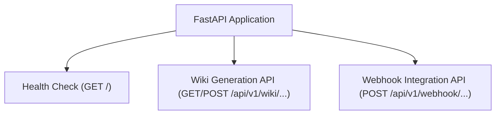
```mermaid
graph TD
    A["FastAPI Application"]
    B["Health Check (GET /)"]
    C["Wiki Generation API (GET/POST /api/v1/wiki/...)"]
    D["Webhook Integration API (POST /api/v1/webhook/...)"]

    A --> B
    A --> C
    A --> D
```

## 웹훅 통합

`src/api/v1/endpoints/webhook.py` 파일은 GitHub 웹훅 이벤트를 수신하고 처리하는 로직을 담당합니다. 이는 코드 저장소에 푸시가 발생할 때마다 자동으로 위키를 업데이트하는 핵심 기능입니다.

### GitHub 웹훅 처리 흐름

`/api/v1/webhook/github` 엔드포인트는 GitHub의 `push` 이벤트를 수신합니다. 이 엔드포인트는 다음과 같은 단계를 거쳐 요청을 처리합니다.

1.  **서명 검증 (`verify_signature`)**: GitHub 웹훅의 `X-Hub-Signature-256` 헤더를 사용하여 요청의 무결성과 신뢰성을 검증합니다. `GITHUB_WEBHOOK_SECRET` 환경 변수가 설정되어 있어야 합니다.
2.  **봇 커밋 필터링**: 무한 루프를 방지하기 위해 `Wiki-As-Readme-Bot`이 생성한 커밋이나 커밋 메시지에 "via Wiki-As-Readme"가 포함된 커밋은 무시합니다.
3.  **브랜치 필터링**: `main` 브랜치에 대한 푸시 이벤트만 처리합니다.
4.  **위키 생성 요청 데이터 준비**: 수신된 GitHub 페이로드에서 저장소 소유자, 이름, URL 등의 정보를 추출하여 내부 위키 생성 API (`WikiGenerationRequest`)에 필요한 데이터를 구성합니다.
5.  **백그라운드 태스크 실행**: `process_full_cycle` 함수를 백그라운드 태스크로 등록하여 비동기적으로 위키 생성 및 GitHub 업데이트 작업을 수행합니다. 이는 웹훅 요청에 대한 빠른 응답을 보장합니다.

Sources: [src/api/v1/endpoints/webhook.py](src/api/v1/endpoints/webhook.py)

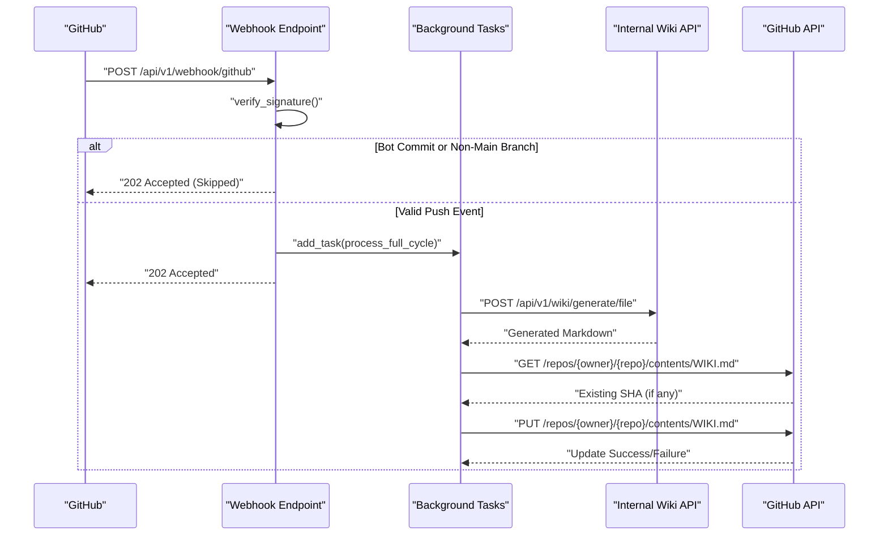
```mermaid
sequenceDiagram
    participant G as "GitHub"
    participant W as "Webhook Endpoint"
    participant B as "Background Tasks"
    participant I as "Internal Wiki API"
    participant GA as "GitHub API"

    G->>W: "POST /api/v1/webhook/github"
    W->>W: "verify_signature()"
    alt Bot Commit or Non-Main Branch
        W-->>G: "202 Accepted (Skipped)"
    else Valid Push Event
        W->>B: "add_task(process_full_cycle)"
        W-->>G: "202 Accepted"
        B->>I: "POST /api/v1/wiki/generate/file"
        I-->>B: "Generated Markdown"
        B->>GA: "GET /repos/{owner}/{repo}/contents/WIKI.md"
        GA-->>B: "Existing SHA (if any)"
        B->>GA: "PUT /repos/{owner}/{repo}/contents/WIKI.md"
        GA-->>B: "Update Success/Failure"
    end
```

### GitHub 업데이트 로직 (`update_github_readme`)

`update_github_readme` 함수는 생성된 마크다운 콘텐츠를 GitHub 저장소의 `WIKI.md` 파일로 커밋하는 핵심 기능을 수행합니다.

*   **인증**: `GITHUB_ACCESS_TOKEN` 환경 변수에 저장된 GitHub Personal Access Token (PAT)을 사용하여 인증합니다.
*   **기존 파일 SHA 조회**: 파일을 업데이트하기 위해 GitHub API는 기존 파일의 SHA 값을 요구합니다. `GET` 요청을 통해 `WIKI.md` 파일의 SHA 값을 먼저 조회합니다.
*   **콘텐츠 인코딩**: GitHub API 요구사항에 따라 마크다운 콘텐츠를 Base64로 인코딩합니다.
*   **커밋 데이터 구성**: 커밋 메시지, 인코딩된 콘텐츠, 커미터 정보(봇 이름 및 이메일)를 포함하는 페이로드를 구성합니다. 기존 SHA 값이 있다면 이를 포함합니다.
*   **파일 업데이트**: 구성된 데이터를 `PUT` 요청으로 GitHub API에 전송하여 `WIKI.md` 파일을 업데이트합니다.

Sources: [src/api/v1/endpoints/webhook.py](src/api/v1/endpoints/webhook.py)

### 전체 처리 사이클 (`process_full_cycle`)

`process_full_cycle` 함수는 백그라운드에서 실행되며, 위키 생성부터 GitHub 업데이트까지의 전체 과정을 조율합니다.

1.  **내부 위키 생성 API 호출**: `httpx.AsyncClient`를 사용하여 내부적으로 `/api/v1/wiki/generate/file` 엔드포인트를 호출합니다. 이 호출은 위키 콘텐츠를 생성하는 역할을 합니다.
2.  **생성 결과 추출**: 위키 생성 API로부터 반환된 JSON 응답에서 생성된 마크다운 콘텐츠를 추출합니다.
3.  **GitHub에 업로드**: 추출된 마크다운 콘텐츠를 `update_github_readme` 함수에 전달하여 GitHub 저장소에 커밋합니다.

Sources: [src/api/v1/endpoints/webhook.py](src/api/v1/endpoints/webhook.py)

### 웹훅 관련 모델

`src/models/github_webhook_schema.py` 파일은 GitHub 웹훅 `push` 페이로드의 구조를 정의하는 Pydantic 모델을 포함합니다. `GitHubPushPayload` 모델은 수신되는 웹훅 데이터의 유효성을 검사하고 구조화하는 데 사용됩니다.

| 필드 | 타입 | 설명 |
|---|---|---|
| `ref` | `str` | 푸시된 브랜치 참조 (예: `refs/heads/main`) |
| `repository.name` | `str` | 저장소 이름 |
| `repository.owner.login` | `str` | 저장소 소유자 로그인 이름 |
| `pusher.name` | `str` | 푸시를 수행한 사용자 이름 |
| `head_commit.message` | `str` | 최신 커밋 메시지 |

Sources: [src/models/github_webhook_schema.py](src/models/github_webhook_schema.py)

### 환경 변수

웹훅 및 GitHub 연동에 필요한 주요 환경 변수는 다음과 같습니다.

| 변수명 | 설명 | 사용처 |
|---|---|---|
| `GITHUB_WEBHOOK_SECRET` | GitHub 웹훅 서명 검증에 사용되는 비밀 키 | `src/api/v1/endpoints/webhook.py` |
| `GITHUB_ACCESS_TOKEN` | GitHub API에 파일 쓰기 권한을 가진 Personal Access Token (PAT) | `src/api/v1/endpoints/webhook.py` |
| `BOT_COMMITTER_NAME` | 봇의 커미터 이름 (무한 루프 방지용) | `src/api/v1/endpoints/webhook.py` |

## 배포

`Dockerfile.server`는 Wiki As Readme 서버 애플리케이션을 Docker 컨테이너로 패키징하기 위한 지침을 제공합니다. 이는 일관된 배포 환경을 보장하고 애플리케이션의 이식성을 높입니다.

### Docker 이미지 빌드

`Dockerfile.server`는 두 단계(multi-stage build)로 구성되어 있습니다.

1.  **빌더 스테이지 (`builder`)**:
    *   `python:3.12-slim-bookworm` 이미지를 기반으로 합니다.
    *   `uv` 패키지 관리 도구를 사용하여 `pyproject.toml` 및 `uv.lock` 파일에 정의된 의존성을 설치합니다. `uv sync --frozen --no-dev --no-install-project --extra api` 명령을 통해 프로덕션에 필요한 의존성만 효율적으로 설치합니다.
2.  **최종 이미지 스테이지**:
    *   `python:3.12-slim-bookworm` 이미지를 기반으로 합니다.
    *   빌더 스테이지에서 설치된 가상 환경(`/.venv`)을 복사합니다.
    *   애플리케이션 소스 코드(`src`)를 컨테이너 내부로 복사합니다.
    *   `appuser`라는 비루트 사용자를 생성하고, 애플리케이션 파일의 소유권을 `appuser`로 변경하여 보안을 강화합니다.
    *   `PATH` 및 `PYTHONPATH` 환경 변수를 설정하여 가상 환경의 실행 파일과 애플리케이션 모듈을 올바르게 찾을 수 있도록 합니다.
    *   `EXPOSE 8000`을 통해 애플리케이션이 8000번 포트에서 서비스됨을 알립니다.
    *   `USER appuser`를 통해 컨테이너가 `appuser` 권한으로 실행되도록 합니다.
    *   `CMD` 명령은 `gunicorn`을 사용하여 애플리케이션을 시작합니다. `uvicorn.workers.UvicornWorker`를 워커 클래스로 사용하며, `0.0.0.0:8000`에 바인딩하고, 2개의 워커 프로세스를 사용하도록 설정되어 있습니다. 접근 및 에러 로그는 표준 출력/오류로 전송됩니다.

Sources: [Dockerfile.server](Dockerfile.server)

## 결론

Wiki As Readme 서버는 FastAPI를 기반으로 구축되어 안정적이고 확장 가능한 API 서비스를 제공합니다. 특히 GitHub 웹훅과의 통합을 통해 코드 변경 시 위키 문서를 자동으로 생성하고 업데이트하는 강력한 자동화 기능을 구현합니다. Docker를 이용한 컨테이너화된 배포 전략은 개발 및 운영 환경 간의 일관성을 보장하며, 효율적인 애플리케이션 관리를 가능하게 합니다. 이러한 설계는 개발자가 코드 작성에 집중하고, 문서화는 시스템이 자동으로 처리하도록 하여 생산성을 극대화합니다.

---

<a name="환경-변수-참조"></a>

<details>
<summary>Relevant source files</summary>

The following files were used as context for generating this wiki page:

- [.env.example](.env.example)
- [src/core/config.py](src/core/config.py)
</details>

# 환경 변수 참조

## 소개

이 문서는 AX Wiki Generator 프로젝트에서 사용되는 환경 변수에 대한 포괄적인 참조 가이드입니다. 환경 변수는 애플리케이션의 동작을 사용자 정의하고, 민감한 정보를 안전하게 관리하며, 다양한 배포 환경에 맞게 설정을 조정하는 데 필수적입니다.

프로젝트는 `.env` 파일을 통해 환경 변수를 로드하며, `src/core/config.py` 파일의 `Settings` 클래스를 사용하여 이러한 변수들을 파싱하고 애플리케이션 전체에서 접근 가능하도록 합니다. `.env.example` 파일은 사용 가능한 모든 환경 변수와 그 용도에 대한 템플릿을 제공합니다.

## 환경 변수 로드 및 파싱

AX Wiki Generator는 Pydantic의 `BaseSettings`를 활용하여 환경 변수를 관리합니다. `src/core/config.py`에 정의된 `Settings` 클래스는 `.env` 파일에서 변수를 읽고, 정의된 타입으로 변환하며, 기본값을 설정합니다.

### `Settings` 클래스 개요

`Settings` 클래스는 애플리케이션의 모든 구성 설정을 중앙 집중화합니다. 이 클래스는 `.env` 파일의 키-값 쌍을 해당 클래스 속성에 매핑합니다.

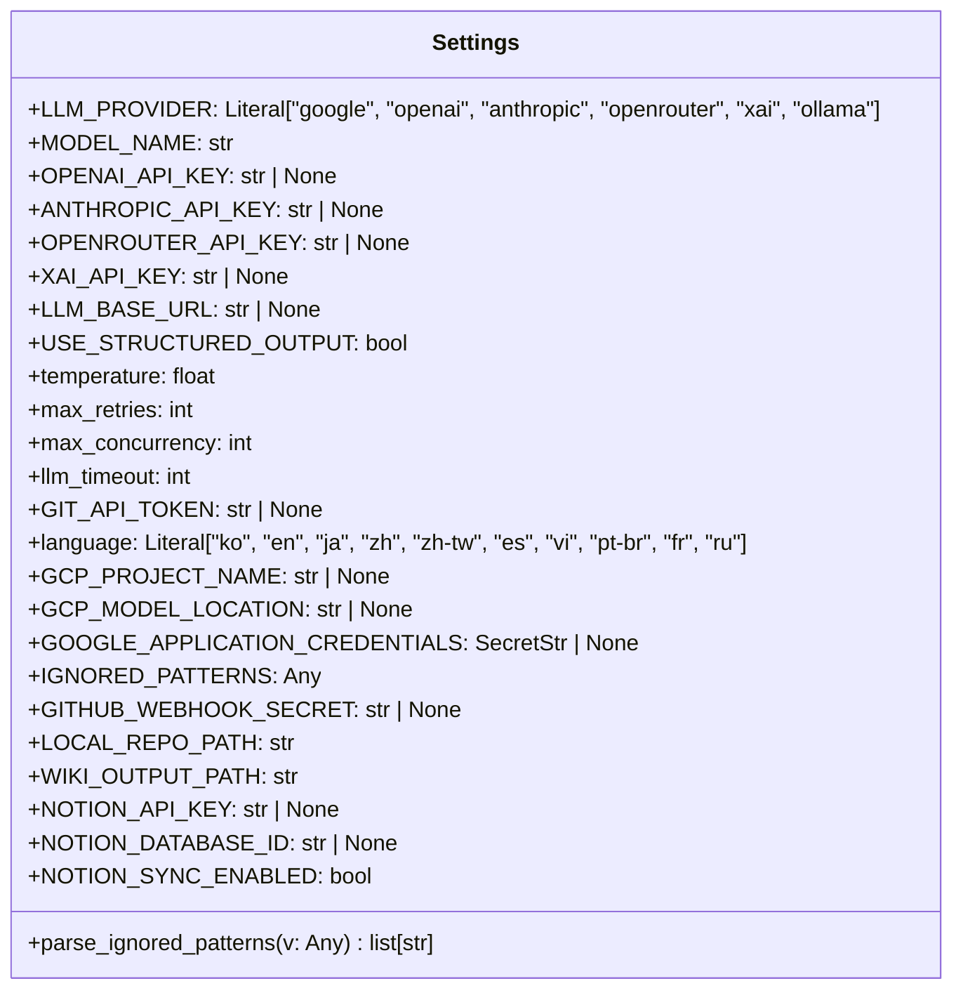
```mermaid
classDiagram
    class Settings {
        +LLM_PROVIDER: Literal["google", "openai", "anthropic", "openrouter", "xai", "ollama"]
        +MODEL_NAME: str
        +OPENAI_API_KEY: str | None
        +ANTHROPIC_API_KEY: str | None
        +OPENROUTER_API_KEY: str | None
        +XAI_API_KEY: str | None
        +LLM_BASE_URL: str | None
        +USE_STRUCTURED_OUTPUT: bool
        +temperature: float
        +max_retries: int
        +max_concurrency: int
        +llm_timeout: int
        +GIT_API_TOKEN: str | None
        +language: Literal["ko", "en", "ja", "zh", "zh-tw", "es", "vi", "pt-br", "fr", "ru"]
        +GCP_PROJECT_NAME: str | None
        +GCP_MODEL_LOCATION: str | None
        +GOOGLE_APPLICATION_CREDENTIALS: SecretStr | None
        +IGNORED_PATTERNS: Any
        +GITHUB_WEBHOOK_SECRET: str | None
        +LOCAL_REPO_PATH: str
        +WIKI_OUTPUT_PATH: str
        +NOTION_API_KEY: str | None
        +NOTION_DATABASE_ID: str | None
        +NOTION_SYNC_ENABLED: bool
        +parse_ignored_patterns(v: Any) list[str]
    }
```
Sources: [src/core/config.py](Settings class)

`SettingsConfigDict`는 `.env` 파일을 설정 소스로 지정합니다.
```python
    model_config = SettingsConfigDict(
        env_file=".env", env_file_encoding="utf-8", extra="ignore"
    )
```
Sources: [src/core/config.py](SettingsConfigDict)

## 주요 환경 변수

다음은 `.env.example` 파일에 정의된 주요 환경 변수 목록과 그 설명입니다.

### 1. LLM 제공자 설정 (LLM Provider Settings)

| 변수명 | 설명 | 기본값 |
|---|---|---|
| `LLM_PROVIDER` | 사용할 LLM(Large Language Model) 제공자를 선택합니다. 지원되는 값: `google`, `openai`, `anthropic`, `xai`, `openrouter`, `ollama`. | `google` |
| `MODEL_NAME` | 선택한 제공자의 특정 모델 식별자입니다. 예: `gemini-2.5-flash`, `gpt-4o`, `claude-3-5-sonnet-latest`. | `gemini-2.5-flash` |
Sources: [.env.example](LLM Provider Settings), [src/core/config.py](LLM_PROVIDER, MODEL_NAME)

### 2. LLM API 키 (LLM API Keys)

선택한 LLM 제공자에 따라 해당 API 키를 제공해야 합니다.

| 변수명 | 설명 |
|---|---|
| `OPENAI_API_KEY` | OpenAI API 키 |
| `ANTHROPIC_API_KEY` | Anthropic API 키 |
| `OPENROUTER_API_KEY` | OpenRouter API 키 |
| `XAI_API_KEY` | xAI API 키 |
Sources: [.env.example](LLM API Keys), [src/core/config.py](OPENAI_API_KEY, ANTHROPIC_API_KEY, OPENROUTER_API_KEY, XAI_API_KEY)

### 3. LLM 구성 (LLM Configuration)

LLM 호출의 동작을 제어하는 설정입니다.

| 변수명 | 설명 | 기본값 |
|---|---|---|
| `LLM_BASE_URL` | LLM API의 사용자 정의 기본 URL (예: Ollama 또는 프록시 사용 시). | `None` |
| `USE_STRUCTURED_OUTPUT` | 구조화된 JSON 출력 모드 사용 여부 (모델 지원 필요). | `true` |
| `temperature` | 응답의 무작위성 제어. 0.0은 결정론적, 1.0은 창의적. | `0.0` |
| `max_retries` | 실패한 LLM 요청에 대한 최대 재시도 횟수. | `3` |
| `max_concurrency` | 속도 제한을 방지하기 위한 병렬 LLM 호출 수 제한. | `5` |
| `llm_timeout` | LLM 요청의 타임아웃 시간 (초). | `300` |
Sources: [.env.example](LLM Configuration), [src/core/config.py](LLM_BASE_URL, USE_STRUCTURED_OUTPUT, temperature, max_retries, max_concurrency, llm_timeout)

### 4. 파일 필터링 설정 (File Filtering Settings)

LLM 컨텍스트에서 제외할 파일 패턴을 정의합니다.

| 변수명 | 설명 | 기본값 |
|---|---|---|
| `IGNORED_PATTERNS` | LLM 컨텍스트에서 제외할 glob 패턴 목록. 토큰 절약 및 초점 개선에 사용됩니다. `.env`에 정의하면 `src/core/config.py`의 기본 목록을 **재정의**합니다. 값은 단일 라인 JSON 배열 문자열이어야 합니다. | `DEFAULT_IGNORED_PATTERNS` (src/core/config.py 참조) |
Sources: [.env.example](File Filtering Settings), [src/core/config.py](IGNORED_PATTERNS, DEFAULT_IGNORED_PATTERNS)

#### `IGNORED_PATTERNS` 처리 로직

`src/core/config.py`의 `Settings` 클래스에는 `IGNORED_PATTERNS`를 파싱하는 `@field_validator`가 있습니다.
- 환경 변수 `IGNORED_PATTERNS`가 문자열이고 비어있으면 `DEFAULT_IGNORED_PATTERNS`가 사용됩니다.
- 문자열이 JSON 배열로 파싱되면 해당 배열이 사용됩니다.
- JSON 파싱에 실패하면 쉼표로 구분된 문자열로 간주하여 목록으로 변환됩니다.

```python
    @field_validator("IGNORED_PATTERNS", mode="before")
    @classmethod
    def parse_ignored_patterns(cls, v: Any) -> list[str]:
        if isinstance(v, str):
            if not v.strip():
                return DEFAULT_IGNORED_PATTERNS
            try:
                parsed = json.loads(v)
                if isinstance(parsed, list):
                    return parsed
            except (json.JSONDecodeError, TypeError):
                return [s.strip() for s in v.split(",") if s.strip()]
        return v
```
Sources: [src/core/config.py](parse_ignored_patterns)

### 5. 저장소 접근 설정 (Repository Access Settings)

| 변수명 | 설명 |
|---|---|
| `GIT_API_TOKEN` | 비공개 저장소 접근 또는 높은 API 요청 제한을 위한 GitHub/GitLab 개인 액세스 토큰. |
Sources: [.env.example](Repository Access Settings), [src/core/config.py](GIT_API_TOKEN)

### 6. 지역화 설정 (Localization Settings)

| 변수명 | 설명 | 기본값 |
|---|---|---|
| `language` | 생성될 위키의 대상 언어 (예: `ko`, `en`, `ja`, `zh`). | `en` |
Sources: [.env.example](Localization Settings), [src/core/config.py](language)

### 7. Google Cloud Platform 설정 (Google Vertex AI 전용)

Google Vertex AI를 LLM 제공자로 사용할 경우 필요합니다.

| 변수명 | 설명 |
|---|---|
| `GCP_PROJECT_NAME` | Google Cloud 프로젝트 이름. |
| `GCP_MODEL_LOCATION` | Vertex AI 모델이 배포된 지역 (예: `us-central1`). |
| `GOOGLE_CREDENTIALS_PATH` | Google Cloud 서비스 계정 JSON 키 파일의 절대 경로 (호스트 경로). Docker 환경에서는 컨테이너 내부 경로로 매핑됩니다. |
| `GOOGLE_APPLICATION_CREDENTIALS` | (내부 사용) `GOOGLE_CREDENTIALS_PATH`를 통해 설정되거나 직접 설정될 수 있는 서비스 계정 자격 증명. |
Sources: [.env.example](Google Cloud Platform Settings), [src/core/config.py](GCP_PROJECT_NAME, GCP_MODEL_LOCATION, GOOGLE_APPLICATION_CREDENTIALS)

### 8. Docker 및 로컬 경로 설정 (Docker & Local Path Settings)

로컬 파일 시스템 경로를 지정합니다. Docker Compose 사용 시 호스트 경로를 컨테이너 내부 경로로 매핑하는 데 중요합니다.

| 변수명 | 설명 | 기본값 |
|---|---|---|
| `LOCAL_REPO_PATH` | 분석할 로컬 저장소의 절대 경로 (호스트 경로). Docker Compose의 기본값은 현재 디렉토리 (`./`). | `.` |
| `WIKI_OUTPUT_PATH` | 생성된 위키 파일이 저장될 절대 경로 (호스트 경로). Docker Compose의 기본값은 `./output`. | `./WIKI.md` |
Sources: [.env.example](Docker & Local Path Settings), [src/core/config.py](LOCAL_REPO_PATH, WIKI_OUTPUT_PATH)

### 9. Notion 동기화 설정 (선택 사항)

위키 생성 후 Notion으로 자동 동기화하는 기능을 활성화합니다.

| 변수명 | 설명 | 기본값 |
|---|---|---|
| `NOTION_SYNC_ENABLED` | 위키 생성 후 Notion으로 자동 동기화 활성화 여부. | `false` |
| `NOTION_API_KEY` | Notion 통합 토큰 (https://www.notion.so/my-integrations 에서 얻을 수 있습니다). | `None` |
| `NOTION_DATABASE_ID` | 각 저장소가 항목으로 추가될 Notion 데이터베이스 ID. 데이터베이스 URL에서 얻을 수 있습니다. | `None` |
Sources: [.env.example](Notion Sync Settings), [src/core/config.py](NOTION_SYNC_ENABLED, NOTION_API_KEY, NOTION_DATABASE_ID)

### 10. 기타 설정

| 변수명 | 설명 |
|---|---|
| `GITHUB_WEBHOOK_SECRET` | GitHub 웹훅 서명 검증에 사용되는 비밀 키. |
Sources: [src/core/config.py](GITHUB_WEBHOOK_SECRET)

## 결론

환경 변수는 AX Wiki Generator의 유연성과 사용자 정의 가능성을 제공하는 핵심 요소입니다. `.env` 파일을 적절히 구성함으로써 사용자는 LLM 제공자, API 키, 출력 경로, 언어 및 기타 여러 동작을 프로젝트의 특정 요구 사항에 맞게 조정할 수 있습니다. `.env.example` 파일을 참조하여 필요한 변수를 설정하고, `src/core/config.py`의 `Settings` 클래스를 통해 내부적으로 어떻게 처리되는지 이해하는 것이 중요합니다.

---

<a name="시스템-아키텍처-개요"></a>

<details>
<summary>Relevant source files</summary>

The following files were used as context for generating this wiki page:

- [src/app.py](src/app.py)
- [src/server.py](src/server.py)
- [src/agent/llm.py](src/agent/llm.py)
- [src/services/wiki_generator.py](src/services/wiki_generator.py)
- [src/api/v1/endpoints/wiki.py](src/api/v1/endpoints/wiki.py)
- [src/models/wiki_schema.py](src/models/wiki_schema.py)
</details>

# 시스템 아키텍처 개요

## 1. 서론

"Wiki As Readme" 프로젝트는 코드베이스를 포괄적인 위키 문서로 자동 생성하는 것을 목표로 합니다. 이 문서는 프로젝트의 시스템 아키텍처를 개괄적으로 설명하여 주요 구성 요소, 이들 간의 상호 작용, 그리고 데이터 흐름을 이해하는 데 도움을 줍니다. 시스템은 사용자 친화적인 웹 인터페이스와 강력한 백엔드 API 서비스로 구성되어 있으며, 대규모 언어 모델(LLM)을 활용하여 코드 분석 및 문서 생성을 수행합니다.

## 2. 전체 시스템 개요

"Wiki As Readme"는 클라이언트-서버 아키텍처를 기반으로 구축되었습니다. 사용자는 Streamlit 기반의 프론트엔드 애플리케이션을 통해 상호 작용하며, 이 애플리케이션은 FastAPI 기반의 백엔드 API 서버와 통신합니다. 백엔드 서버는 저장소 구조 분석, LLM 호출을 통한 위키 콘텐츠 생성, 그리고 결과 저장을 포함한 모든 핵심 로직을 처리합니다.

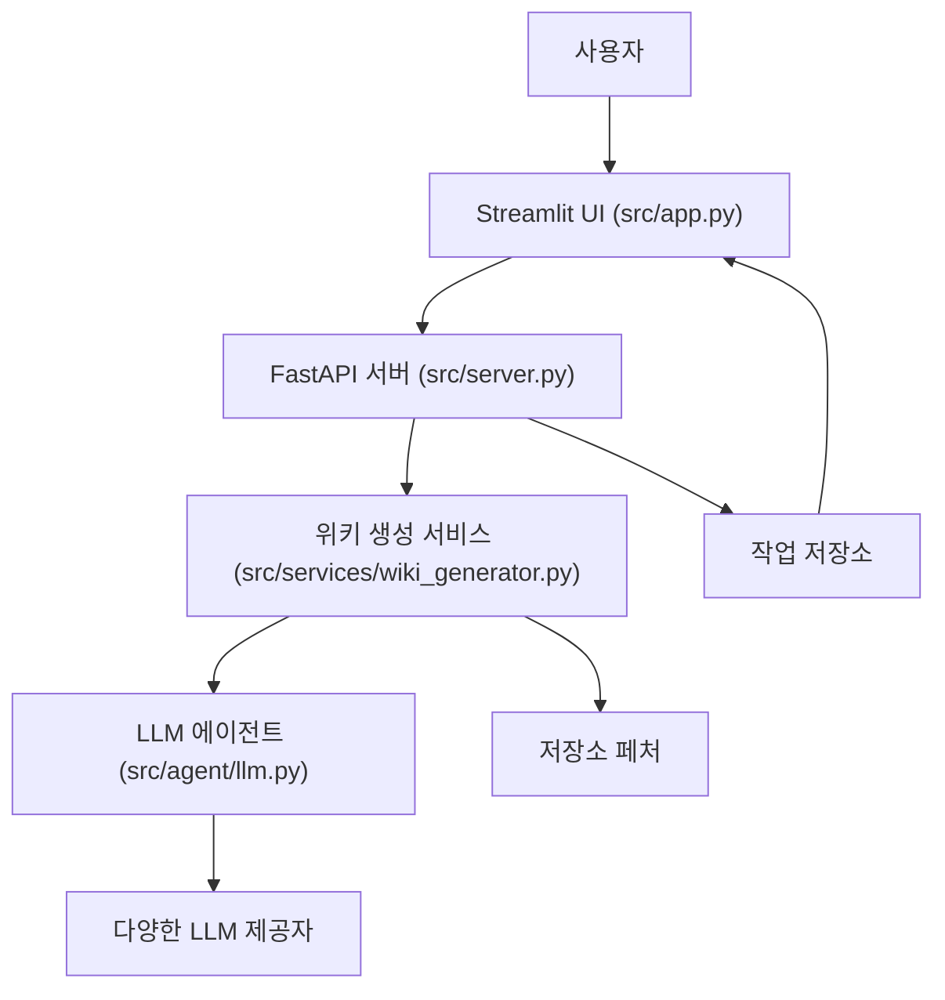
```mermaid
graph TD
    A["사용자"] --> B["Streamlit UI (src/app.py)"];
    B --> C["FastAPI 서버 (src/server.py)"];
    C --> D["위키 생성 서비스 (src/services/wiki_generator.py)"];
    D --> E["LLM 에이전트 (src/agent/llm.py)"];
    D --> F["저장소 페처"];
    E --> G["다양한 LLM 제공자"];
    C --> H["작업 저장소"];
    H --> B;
```
Sources: [src/app.py](main function), [src/server.py](app initialization)

## 3. 주요 구성 요소

### 3.1. 프론트엔드 애플리케이션 (Streamlit UI)

`src/app.py` 파일은 사용자 인터페이스를 담당하는 Streamlit 애플리케이션의 진입점입니다. 사용자는 이 인터페이스를 통해 위키를 생성할 저장소의 URL 또는 로컬 경로를 입력하고, 언어 및 상세 보기 옵션을 설정할 수 있습니다.

*   **주요 기능:**
    *   **사용자 입력 처리:** 저장소 정보, 생성 옵션 (언어, 상세 보기)을 수집합니다.
    *   **API 요청 시작:** 백엔드 FastAPI 서버에 위키 생성 요청을 비동기적으로 전송합니다.
    *   **작업 상태 폴링:** 백엔드에서 진행 중인 위키 생성 작업의 상태를 주기적으로 확인하고 사용자에게 진행 상황을 표시합니다.
    *   **결과 표시 및 다운로드:** 생성된 위키 마크다운 콘텐츠를 미리 보고 다운로드할 수 있는 기능을 제공합니다.
    *   **Mermaid 렌더링:** 생성된 마크다운 내의 Mermaid 다이어그램을 올바르게 렌더링합니다.
*   **핵심 함수:**
    *   `render_generator_page()`: 위키 생성 페이지를 렌더링하고 사용자 입력을 처리합니다.
    *   `start_generation_task()`: 백엔드 API에 위키 생성 작업을 시작하도록 요청합니다.
    *   `poll_task_status()`: 백엔드 API로부터 작업 상태를 주기적으로 조회합니다.
    *   `render_markdown_with_mermaid()`: 마크다운 콘텐츠와 Mermaid 다이어그램을 함께 렌더링합니다.

Sources: [src/app.py](render_generator_page function, start_generation_task function, poll_task_status function)

### 3.2. 백엔드 API 서버 (FastAPI)

`src/server.py`는 FastAPI 애플리케이션의 진입점이며, `src/api/v1/endpoints/wiki.py`는 위키 생성과 관련된 API 엔드포인트를 정의합니다. 이 서버는 프론트엔드로부터의 요청을 수신하고, 실제 위키 생성 로직을 백그라운드 작업으로 처리합니다.

*   **주요 기능:**
    *   **API 엔드포인트 제공:** 위키 생성 시작 (`/wiki/generate/file`, `/wiki/generate/text`) 및 작업 상태 조회 (`/wiki/status/{task_id}`)를 위한 RESTful API를 제공합니다.
    *   **백그라운드 작업 관리:** 위키 생성과 같은 시간이 오래 걸리는 작업을 비동기적으로 처리하기 위해 FastAPI의 `BackgroundTasks`를 활용합니다.
    *   **작업 상태 저장:** `src/services/task_store.py`를 통해 각 작업의 상태(진행 중, 완료, 실패)와 결과를 관리합니다.
*   **핵심 엔드포인트:**
    *   `POST /api/v1/wiki/generate/file`: 위키를 생성하고 서버의 `output/` 디렉토리에 파일로 저장합니다.
    *   `POST /api/v1/wiki/generate/text`: 위키를 생성하지만 파일로 저장하지 않고, 생성된 마크다운 텍스트를 작업 결과로 반환합니다.
    *   `GET /api/v1/wiki/status/{task_id}`: 특정 작업 ID의 현재 상태와 결과를 조회합니다.

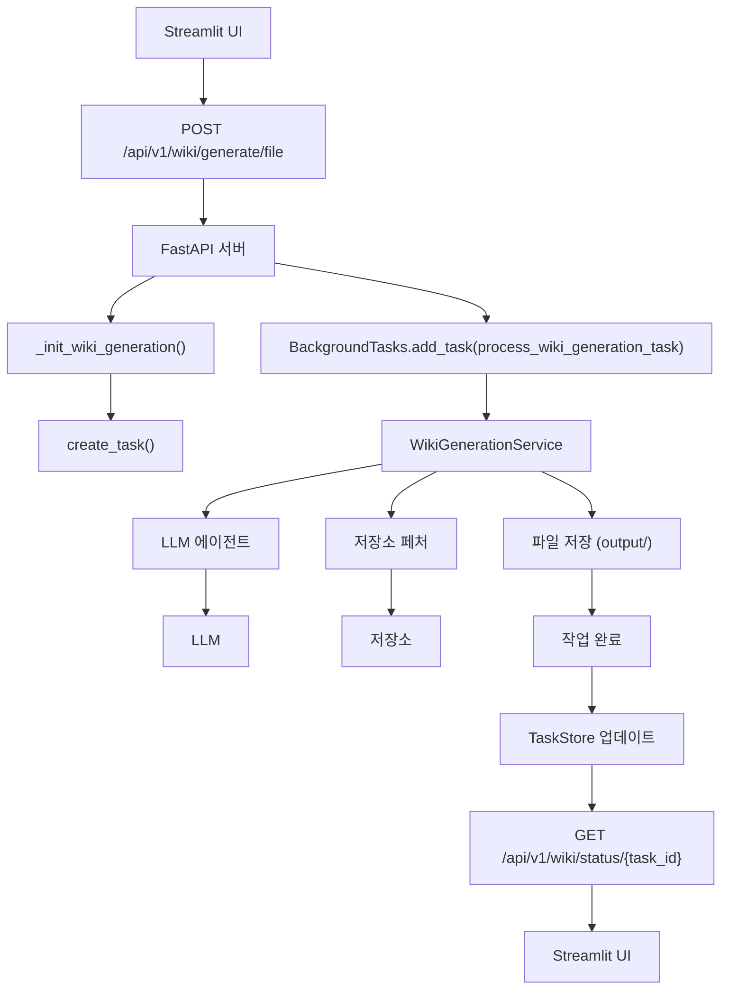
```mermaid
flowchart TD
    A["Streamlit UI"] --> B["POST /api/v1/wiki/generate/file"];
    B --> C["FastAPI 서버"];
    C --> D["_init_wiki_generation()"];
    D --> E["create_task()"];
    C --> F["BackgroundTasks.add_task(process_wiki_generation_task)"];
    F --> G["WikiGenerationService"];
    G --> H["LLM 에이전트"];
    H --> I["LLM"];
    G --> J["저장소 페처"];
    J --> K["저장소"];
    G --> L["파일 저장 (output/)"];
    L --> M["작업 완료"];
    M --> N["TaskStore 업데이트"];
    N --> O["GET /api/v1/wiki/status/{task_id}"];
    O --> P["Streamlit UI"];
```
Sources: [src/server.py](app.include_router), [src/api/v1/endpoints/wiki.py](generate_wiki_file function, generate_wiki_text function, get_wiki_generation_status function)

### 3.3. 위키 생성 서비스 (Wiki Generation Service)

`src/services/wiki_generator.py`는 위키 생성 파이프라인의 핵심 오케스트레이터입니다. 저장소 정보 가져오기부터 위키 구조 결정, 콘텐츠 생성, 최종 마크다운 통합에 이르는 전 과정을 조율합니다.

*   **주요 기능:**
    *   **요청 유효성 검사:** 위키 생성 요청의 매개변수를 검증합니다.
    *   **저장소 구조 분석:** `RepositoryFetcher`를 사용하여 대상 저장소의 파일 트리와 README를 가져옵니다.
    *   **위키 구조 결정:** `WikiStructureDeterminer`를 사용하여 저장소 구조를 기반으로 위키의 페이지 및 섹션 계층 구조를 결정합니다. 이 과정에서 LLM이 활용됩니다.
    *   **콘텐츠 생성:** 결정된 위키 구조에 따라 각 페이지의 상세 콘텐츠를 LLM을 통해 생성합니다.
    *   **마크다운 통합:** `WikiFormatter`를 사용하여 생성된 모든 페이지와 섹션을 하나의 통합된 마크다운 문서로 조합합니다.
    *   **파일 저장:** 생성된 마크다운 콘텐츠를 지정된 출력 디렉토리에 파일로 저장합니다.
*   **핵심 메서드:**
    *   `generate_wiki_with_structure()`: 전체 위키 생성 파이프라인을 실행하고 마크다운 콘텐츠, 구조, 페이지를 반환합니다.
    *   `prepare_generation()`: 위키 구조 결정 단계까지만 수행하여, 콘텐츠 생성 전에 구조를 확인할 수 있도록 합니다.
    *   `_initialize_and_determine()`: 저장소 구조를 가져오고 위키 구조를 결정하는 초기 단계를 수행합니다.
    *   `save_to_file()`: 생성된 마크다운을 파일로 저장합니다.

Sources: [src/services/wiki_generator.py](WikiGenerationService class, generate_wiki_with_structure method, _initialize_and_determine method)

### 3.4. LLM 에이전트 (LLM Agent)

`src/agent/llm.py`는 LiteLLM 라이브러리를 활용하여 다양한 LLM 제공자(OpenAI, Google Vertex AI, Anthropic 등)와 상호 작용하는 추상화 계층을 제공합니다. 이는 위키 구조 결정 및 콘텐츠 생성 과정에서 핵심적인 역할을 합니다.

*   **주요 기능:**
    *   **LLM 제공자 통합:** `settings.LLM_PROVIDER`에 따라 다양한 LLM API를 일관된 방식으로 호출할 수 있도록 지원합니다.
    *   **모델 구성:** 각 제공자에 맞는 모델 이름, API 키, 기본 URL, 온도, 재시도 횟수 등을 설정합니다.
    *   **구조화된 출력:** Pydantic 스키마를 기반으로 LLM이 특정 JSON 형식의 응답을 생성하도록 유도하며, 이를 자동으로 파싱하여 타입 안전성을 보장합니다.
    *   **비동기 호출:** `ainvoke` 메서드를 통해 LLM 호출을 비동기적으로 수행합니다.
*   **핵심 클래스:**
    *   `LLMWikiMaker`: LLM 호출을 위한 래퍼 클래스입니다.
*   **핵심 메서드:**
    *   `_configure_llm()`: 설정에 따라 LLM 모델과 호출 인자를 구성합니다.
    *   `ainvoke()`: LLM을 비동기적으로 호출하고, 필요에 따라 구조화된 출력을 파싱합니다.

Sources: [src/agent/llm.py](LLMWikiMaker class, _configure_llm method, ainvoke method)

### 3.5. 데이터 모델 (Data Models)

`src/models/wiki_schema.py`는 위키의 구조, 페이지, 섹션 및 저장소 정보를 정의하는 Pydantic 모델을 포함합니다. 이 모델들은 시스템 내에서 데이터의 일관성과 유효성을 보장합니다.

| 모델명 | 설명 |
|---|---|
| `WikiSection` | 위키의 논리적 섹션을 정의합니다. 제목, 고유 ID, 포함하는 페이지 목록, 하위 섹션 목록을 가집니다. |
| `WikiPage` | 위키의 개별 페이지를 정의합니다. 제목, 고유 ID, 관련 파일 경로, 중요도, 관련 페이지, 부모 섹션 ID를 포함합니다. 콘텐츠 필드는 나중에 채워집니다. |
| `WikiStructure` | 전체 위키의 최상위 구조를 정의합니다. 위키의 제목, 설명, 모든 페이지 및 섹션 목록, 최상위 섹션 목록을 포함합니다. |
| `RepositoryStructure` | 저장소에서 가져온 정보를 담는 내부 모델입니다. 파일 트리, README 내용, 기본 브랜치 정보를 포함합니다. |

Sources: [src/models/wiki_schema.py](WikiSection class, WikiPage class, WikiStructure class, RepositoryStructure class)

## 4. 데이터 흐름

다음은 사용자가 위키 생성을 요청하는 시점부터 최종 결과가 표시되기까지의 주요 데이터 흐름입니다.

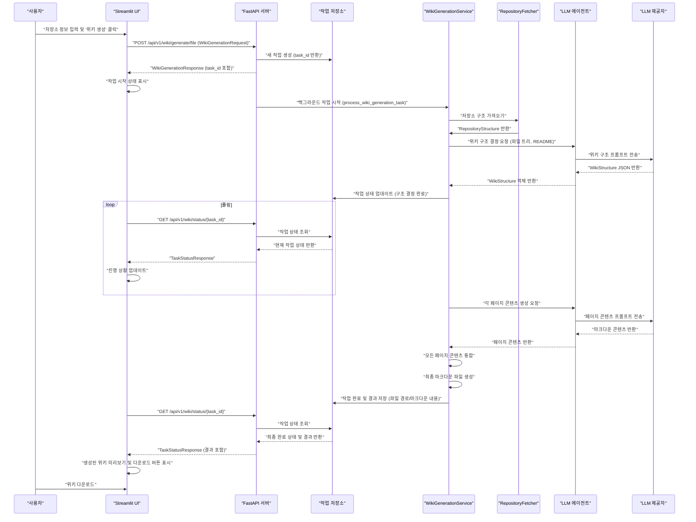
```mermaid
sequenceDiagram
    participant User as "사용자"
    participant Streamlit as "Streamlit UI"
    participant FastAPI as "FastAPI 서버"
    participant TaskStore as "작업 저장소"
    participant WikiService as "WikiGenerationService"
    participant RepoFetcher as "RepositoryFetcher"
    participant LLMAgent as "LLM 에이전트"
    participant LLM as "LLM 제공자"

    User->>Streamlit: "저장소 정보 입력 및 '위키 생성' 클릭"
    Streamlit->>FastAPI: "POST /api/v1/wiki/generate/file (WikiGenerationRequest)"
    FastAPI->>TaskStore: "새 작업 생성 (task_id 반환)"
    FastAPI-->>Streamlit: "WikiGenerationResponse (task_id 포함)"
    Streamlit->>Streamlit: "작업 시작 상태 표시"

    FastAPI->>WikiService: "백그라운드 작업 시작 (process_wiki_generation_task)"
    WikiService->>RepoFetcher: "저장소 구조 가져오기"
    RepoFetcher->>WikiService: "RepositoryStructure 반환"
    WikiService->>LLMAgent: "위키 구조 결정 요청 (파일 트리, README)"
    LLMAgent->>LLM: "위키 구조 프롬프트 전송"
    LLM-->>LLMAgent: "WikiStructure JSON 반환"
    LLMAgent-->>WikiService: "WikiStructure 객체 반환"
    WikiService->>TaskStore: "작업 상태 업데이트 (구조 결정 완료)"

    loop 폴링
        Streamlit->>FastAPI: "GET /api/v1/wiki/status/{task_id}"
        FastAPI->>TaskStore: "작업 상태 조회"
        TaskStore-->>FastAPI: "현재 작업 상태 반환"
        FastAPI-->>Streamlit: "TaskStatusResponse"
        Streamlit->>Streamlit: "진행 상황 업데이트"
    end

    WikiService->>LLMAgent: "각 페이지 콘텐츠 생성 요청"
    LLMAgent->>LLM: "페이지 콘텐츠 프롬프트 전송"
    LLM-->>LLMAgent: "마크다운 콘텐츠 반환"
    LLMAgent-->>WikiService: "페이지 콘텐츠 반환"
    WikiService->>WikiService: "모든 페이지 콘텐츠 통합"
    WikiService->>WikiService: "최종 마크다운 파일 생성"
    WikiService->>TaskStore: "작업 완료 및 결과 저장 (파일 경로/마크다운 내용)"

    Streamlit->>FastAPI: "GET /api/v1/wiki/status/{task_id}"
    FastAPI->>TaskStore: "작업 상태 조회"
    TaskStore-->>FastAPI: "최종 완료 상태 및 결과 반환"
    FastAPI-->>Streamlit: "TaskStatusResponse (결과 포함)"
    Streamlit->>Streamlit: "생성된 위키 미리보기 및 다운로드 버튼 표시"
    User->>Streamlit: "위키 다운로드"
```
Sources: [src/app.py](start_generation_task function, poll_task_status function), [src/api/v1/endpoints/wiki.py](generate_wiki_file function), [src/services/wiki_generator.py](generate_wiki_with_structure method)

## 5. 결론

"Wiki As Readme" 시스템은 모듈화된 구성 요소와 명확한 책임 분리를 통해 확장 가능하고 유지보수하기 쉬운 아키텍처를 제공합니다. Streamlit을 통한 사용자 친화적인 인터페이스, FastAPI를 통한 견고한 백엔드 API, 그리고 LiteLLM을 활용한 유연한 LLM 통합은 이 프로젝트가 다양한 코드베이스로부터 고품질의 위키 문서를 효율적으로 생성할 수 있도록 지원합니다.

---

<a name="llm-통합-및-에이전트"></a>

<details>
<summary>Relevant source files</summary>

The following files were used as context for generating this wiki page:

- [src/agent/llm.py](src/agent/llm.py)
- [src/prompts/wiki_contents_generator.yaml](src/prompts/wiki_contents_generator.yaml)
- [src/prompts/wiki_structure_generator.yaml](src/prompts/wiki_structure_generator.yaml)
</details>

# LLM 통합 및 에이전트

## 1. 서론

이 문서는 소프트웨어 프로젝트 내에서 LLM(대규모 언어 모델) 통합 및 에이전트의 역할을 설명합니다. 핵심적으로, 이 시스템은 `LLMWikiMaker` 클래스를 통해 다양한 LLM 공급자와의 상호작용을 추상화하고 구조화된 출력을 지원합니다. 또한, 위키 페이지의 내용과 구조를 생성하는 데 사용되는 두 가지 주요 프롬프트 템플릿(`wiki_contents_generator.yaml`, `wiki_structure_generator.yaml`)을 다룹니다. 이 통합된 접근 방식은 LLM을 활용하여 기술 위키 문서를 자동으로 생성하는 에이전트 기반 워크플로우를 구현합니다.

## 2. LLM 래퍼: `LLMWikiMaker` 클래스

`src/agent/llm.py` 파일에 정의된 `LLMWikiMaker` 클래스는 위키 생성 작업을 위해 LiteLLM 라이브러리를 사용하는 래퍼입니다. 이 클래스는 제네릭(`T: BaseModel`)을 통해 Pydantic 모델 기반의 타입 안전성을 갖춘 구조화된 출력을 지원하여 LLM 응답의 신뢰성과 파싱 용이성을 높입니다.
Sources: [src/agent/llm.py](LLMWikiMaker class)

### 2.1. 주요 기능

*   **LiteLLM 통합**: Google Vertex AI, OpenAI, Anthropic, OpenRouter, xAI, Ollama 등 다양한 LLM 공급자에 대한 통합된 인터페이스를 제공하여, 백엔드 LLM을 쉽게 교체할 수 있도록 합니다.
*   **구조화된 출력 지원**: Pydantic `BaseModel`을 기반으로 하는 `response_schema`를 사용하여 LLM 응답을 특정 JSON 스키마에 맞춰 파싱합니다. 이는 복잡한 데이터 구조를 LLM으로부터 안정적으로 얻는 데 필수적입니다.
*   **유연한 환경 설정**: `src.core.config.settings`를 통해 모델 이름, 온도(temperature), 최대 재시도 횟수(max_retries), 타임아웃(timeout) 등 LLM 호출에 필요한 다양한 매개변수를 중앙에서 관리합니다. API 키는 환경 변수를 통해 안전하게 주입됩니다.
*   **로깅 및 비용 추적 비활성화**: LiteLLM의 상세 로깅 및 비용 추적 기능을 비활성화하여 불필요한 콘솔 출력을 줄이고 프라이버시를 보호합니다.

### 2.2. 핵심 메서드

*   `__init__(self, response_schema: type[T] | None = None)`:
    클래스 인스턴스 초기화 시 선택적으로 응답 스키마를 설정하고, 내부적으로 `_configure_llm` 메서드를 호출하여 LLM 설정을 완료합니다.
*   `_configure_llm(self) -> tuple[str, dict]`:
    `settings.LLM_PROVIDER` 값에 따라 LLM 모델 이름과 공급자별 호출 인수를 동적으로 구성합니다. 각 공급자(예: Google Vertex AI의 `vertex_project`, OpenAI의 `api_base`)에 필요한 특정 매개변수와 API 키 환경 변수 설정을 처리합니다.
    Sources: [src/agent/llm.py](_configure_llm method)
*   `ainvoke(self, input_data: Any) -> T | str`:
    LLM을 비동기적으로 호출하는 주요 메서드입니다. `response_schema`가 설정된 경우 `T` 타입의 인스턴스를 반환하고, 그렇지 않으면 원시 문자열을 반환합니다. 입력 데이터를 프롬프트 문자열로 변환하고, 구조화된 출력이 필요한 경우 `response_format`을 설정하여 LiteLLM에 전달합니다. LLM 응답을 파싱할 때, 모델이 마크다운 JSON 블록으로 응답하는 경우 `_extract_json`을 사용하여 처리합니다.
    Sources: [src/agent/llm.py](ainvoke method)
*   `_extract_json(self, text: str) -> str`:
    LLM이 마크다운 코드 블록(예: ` ```json\n...\n``` `) 내에 JSON 문자열을 반환하는 경우, 정규 표현식을 사용하여 해당 JSON 문자열만을 추출합니다. 이는 일부 LLM이 구조화된 출력을 직접 지원하지 않을 때 유용합니다.
    Sources: [src/agent/llm.py](_extract_json method)

### 2.3. LLM 구성 흐름

`_configure_llm` 메서드는 설정된 LLM 공급자에 따라 모델 이름과 호출 인수를 결정합니다.

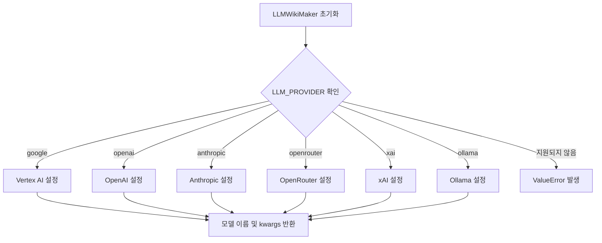
```mermaid
graph TD
    A["LLMWikiMaker 초기화"] --> B{"LLM_PROVIDER 확인"};
    B -- "google" --> C1["Vertex AI 설정"];
    B -- "openai" --> C2["OpenAI 설정"];
    B -- "anthropic" --> C3["Anthropic 설정"];
    B -- "openrouter" --> C4["OpenRouter 설정"];
    B -- "xai" --> C5["xAI 설정"];
    B -- "ollama" --> C6["Ollama 설정"];
    C1 --> D["모델 이름 및 kwargs 반환"];
    C2 --> D;
    C3 --> D;
    C4 --> D;
    C5 --> D;
    C6 --> D;
    B -- "지원되지 않음" --> E["ValueError 발생"];
```
Sources: [src/agent/llm.py](_configure_llm method)

### 2.4. LLM 호출 및 응답 처리 흐름

`ainvoke` 메서드는 LLM 호출의 전체 라이프사이클을 관리합니다.

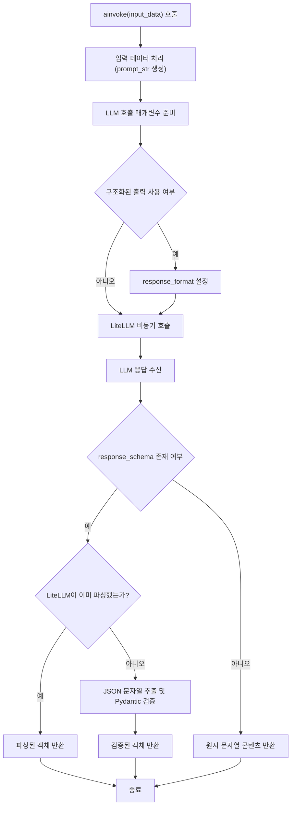
```mermaid
graph TD
    A["ainvoke(input_data) 호출"] --> B["입력 데이터 처리 (prompt_str 생성)"];
    B --> C["LLM 호출 매개변수 준비"];
    C --> D{"구조화된 출력 사용 여부"};
    D -- "예" --> E["response_format 설정"];
    D -- "아니오" --> F["LiteLLM 비동기 호출"];
    E --> F;
    F --> G["LLM 응답 수신"];
    G --> H{"response_schema 존재 여부"};
    H -- "예" --> I{"LiteLLM이 이미 파싱했는가?"};
    I -- "예" --> J["파싱된 객체 반환"];
    I -- "아니오" --> K["JSON 문자열 추출 및 Pydantic 검증"];
    K --> L["검증된 객체 반환"];
    H -- "아니오" --> M["원시 문자열 콘텐츠 반환"];
    J --> N["종료"];
    L --> N;
    M --> N;
```
Sources: [src/agent/llm.py](ainvoke method)

## 3. 위키 생성 프롬프트

이 프로젝트는 LLM을 활용하여 위키의 구조와 내용을 생성하기 위한 두 가지 주요 프롬프트 템플릿을 사용합니다. 이 프롬프트들은 LLM에게 특정 역할을 부여하고, 필요한 컨텍스트와 출력 형식을 지시하는 역할을 합니다.

### 3.1. 위키 내용 생성 프롬프트 (`wiki_contents_generator.yaml`)

이 프롬프트는 특정 위키 페이지의 마크다운 콘텐츠를 생성하는 데 사용됩니다. LLM에게 "전문 기술 작가 및 소프트웨어 아키텍트" 역할을 부여하여 주어진 소스 코드와 주제에 대한 포괄적이고 정확한 기술 문서를 작성하도록 지시합니다.
Sources: [src/prompts/wiki_contents_generator.yaml](template)

*   **입력 변수**:
    | 변수명 | 설명 |
    |---|---|
    | `pageTitle` | 생성할 위키 페이지의 제목 |
    | `filePaths` | 페이지 생성에 사용될 관련 소스 파일 경로 목록 |
    | `relevant_source_files_content` | 관련 소스 파일의 실제 내용 |
    | `language` | 생성할 콘텐츠의 언어 (예: `ko` for 한국어) |
    | `use_structured_output` | 구조화된 출력 사용 여부 (Pydantic `WikiPage` 모델의 `content` 필드에 직접 들어갈 마크다운 문자열) |

*   **주요 지시사항**:
    *   제공된 소스 파일 내용만을 기반으로 콘텐츠 생성.
    *   페이지 시작 시 `<details>` 블록으로 관련 소스 파일 목록 명시.
    *   서론, 상세 섹션(H2, H3), 결론으로 구성된 콘텐츠 구조.
    *   복잡한 로직 설명 시 Mermaid 다이어그램 사용 (엄격한 문법 규칙 준수, 모든 레이블은 반드시 큰따옴표로 묶어야 함).
    *   API 매개변수, 설정 옵션 등에 마크다운 테이블 사용 (간결한 형식).
    *   모든 중요한 주장, 설명, 코드 스니펫에 대한 출처(`Sources: [File URL](function_name)`) 명시.
    *   지정된 언어(한국어 포함)로 전문적이고 객관적인 톤 유지.

### 3.2. 위키 구조 생성 프롬프트 (`wiki_structure_generator.yaml`)

이 프롬프트는 GitHub 저장소의 파일 트리와 README를 분석하여 전체 위키의 논리적인 구조(섹션 및 페이지)를 생성하는 데 사용됩니다.
Sources: [src/prompts/wiki_structure_generator.yaml](template)

*   **입력 변수**:
    | 변수명 | 설명 |
    |---|---|
    | `owner` | GitHub 저장소 소유자 |
    | `repo` | GitHub 저장소 이름 |
    | `fileTree` | 프로젝트의 전체 파일 트리 |
    | `readme` | 프로젝트의 README 파일 내용 |
    | `language` | 생성할 위키 구조의 언어 |
    | `isComprehensiveView` | 포괄적인 뷰(8-12 페이지) 또는 간결한 뷰(4-6 페이지) 여부 |
    | `use_structured_output` | 구조화된 출력 사용 여부 (Pydantic `WikiStructure` 모델) |

*   **출력 형식**:
    `WikiStructure` Pydantic 모델에 엄격하게 부합하는 JSON 객체. 이 모델은 `WikiSection` 및 `WikiPage` 객체 목록을 포함하며, 위키의 전체 계층 구조를 정의합니다.

*   **주요 지시사항**:
    *   저장소 내용을 기반으로 가장 논리적이고 상세한 위키 구조 결정.
    *   각 `WikiPage`는 코드베이스의 특정 측면에 초점.
    *   `WikiPage.file_paths`에는 해당 페이지 콘텐츠 생성에 사용될 실제 파일 경로 포함 (최소 1개).
    *   `WikiStructure.sections` 및 `WikiStructure.root_sections`에 논리적 계층 구조 제공.
    *   모든 JSON 필드가 올바르게 채워지고 유효한 JSON 객체 반환.

## 4. 에이전트 기반 위키 생성 워크플로우

이 시스템은 `LLMWikiMaker`를 LLM과의 상호작용을 위한 엔진으로 사용하고, 두 가지 프롬프트 템플릿을 통해 "에이전트"의 역할을 정의하여 위키를 생성하는 다단계 워크플로우를 구현합니다.

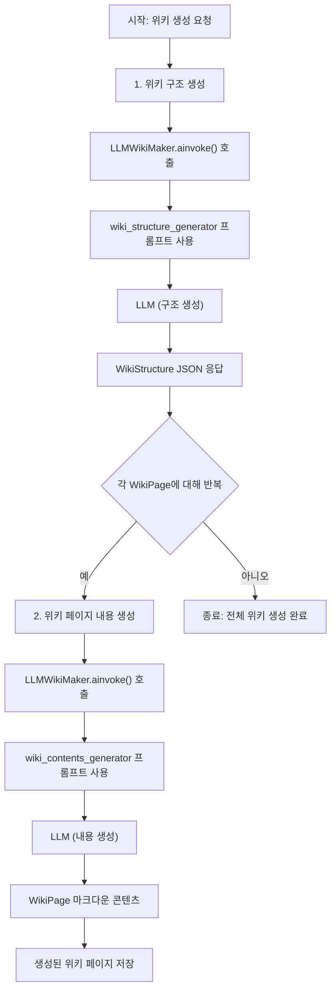
```mermaid
graph TD
    A["시작: 위키 생성 요청"] --> B["1. 위키 구조 생성"];
    B --> C["LLMWikiMaker.ainvoke() 호출"];
    C --> D["wiki_structure_generator 프롬프트 사용"];
    D --> E["LLM (구조 생성)"];
    E --> F["WikiStructure JSON 응답"];
    F --> G{"각 WikiPage에 대해 반복"};
    G -- "예" --> H["2. 위키 페이지 내용 생성"];
    H --> I["LLMWikiMaker.ainvoke() 호출"];
    I --> J["wiki_contents_generator 프롬프트 사용"];
    J --> K["LLM (내용 생성)"];
    K --> L["WikiPage 마크다운 콘텐츠"];
    L --> M["생성된 위키 페이지 저장"];
    G -- "아니오" --> N["종료: 전체 위키 생성 완료"];
```
Sources: [src/agent/llm.py](LLMWikiMaker class), [src/prompts/wiki_structure_generator.yaml](template), [src/prompts/wiki_contents_generator.yaml](template)

## 5. 결론

이 시스템은 `LLMWikiMaker`를 통해 다양한 LLM 공급자와의 유연한 통합을 제공하고, `wiki_structure_generator` 및 `wiki_contents_generator` 프롬프트를 사용하여 위키의 구조와 내용을 자동으로 생성하는 강력한 에이전트 기반 접근 방식을 구현합니다. 이를 통해 개발자는 코드베이스 문서화 프로세스를 자동화하고 일관성 있고 포괄적인 기술 위키를 효율적으로 생성할 수 있습니다.

---

<a name="백엔드-api-엔드포인트"></a>

<details>
<summary>Relevant source files</summary>

The following files were used as context for generating this wiki page:

- [src/api/v1/endpoints/wiki.py](src/api/v1/endpoints/wiki.py)
- [src/api/v1/endpoints/webhook.py](src/api/v1/endpoints/webhook.py)
- [src/models/api_schema.py](src/models/api_schema.py)
</details>

# 백엔드 API 엔드포인트

## 소개

이 문서는 백엔드 시스템에서 제공하는 주요 API 엔드포인트에 대해 설명합니다. 이 엔드포인트들은 주로 위키 문서 생성, 생성 작업 상태 조회, 그리고 GitHub 웹훅을 통한 자동화된 위키 업데이트 기능을 담당합니다. FastAPI 프레임워크를 기반으로 구축되었으며, 비동기 작업을 위해 백그라운드 태스크를 적극적으로 활용합니다.

주요 기능은 다음과 같습니다:
*   **위키 생성**: 특정 저장소(GitHub, GitLab, Bitbucket, 로컬)의 내용을 분석하여 위키 문서를 생성합니다. 생성된 문서는 파일로 저장되거나 텍스트 형태로 반환될 수 있습니다.
*   **작업 상태 조회**: 백그라운드에서 실행되는 위키 생성 작업의 현재 상태를 조회합니다.
*   **GitHub 웹훅 처리**: GitHub 저장소에 푸시 이벤트가 발생했을 때, 자동으로 위키를 생성하고 해당 저장소의 `WIKI.md` 파일을 업데이트합니다.

## 위키 생성 및 상태 조회 API

`src/api/v1/endpoints/wiki.py` 파일은 위키 생성 작업을 시작하고 그 상태를 조회하는 엔드포인트를 정의합니다. 모든 위키 생성 작업은 비동기적으로 백그라운드에서 처리되어 클라이언트의 응답 대기 시간을 최소화합니다.

### 공통 초기화 로직

위키 생성 엔드포인트들은 `_init_wiki_generation` 헬퍼 함수를 사용하여 공통 초기화 단계를 수행합니다. 이 함수는 요청 유효성 검사, 작업 생성, `WikiGenerationService` 초기화, 그리고 위키 구조 결정을 담당합니다.

*   **함수**: `_init_wiki_generation`
*   **역할**:
    *   `WikiGenerationService.validate_request`를 통한 요청 유효성 검사.
    *   `create_task`를 호출하여 새로운 백그라운드 작업 생성 및 `task_id` 반환.
    *   `WikiGenerationService` 인스턴스 생성.
    *   `service.prepare_generation()`을 호출하여 위키 구조 결정.
    *   초기화 과정에서 발생하는 `ValueError` (400 Bad Request) 및 기타 예외 (500 Internal Server Error) 처리.
*   **소스**: [src/api/v1/endpoints/wiki.py](_init_wiki_generation)

### 엔드포인트 상세

#### 1. 위키 생성 및 파일 저장 (`POST /generate/file`)

이 엔드포인트는 위키 생성을 트리거하고, 생성된 마크다운 파일을 서버의 `output/` 디렉토리에 저장합니다.

*   **경로**: `/api/v1/wiki/generate/file`
*   **메서드**: `POST`
*   **설명**:
    *   `WikiGenerationRequest` 스키마에 따라 요청을 받습니다.
    *   `_init_wiki_generation`을 호출하여 초기화합니다.
    *   `process_wiki_generation_task` 함수를 `save_file=True` 인자와 함께 백그라운드 태스크로 추가합니다.
    *   클라이언트에게 `task_id`를 포함한 `WikiGenerationResponse`를 즉시 반환하여 작업 시작을 알립니다.
*   **요청 모델**: `WikiGenerationRequest`
*   **응답 모델**: `WikiGenerationResponse`
*   **소스**: [src/api/v1/endpoints/wiki.py](generate_wiki_file)

#### 2. 위키 생성 및 텍스트 반환 (`POST /generate/text`)

이 엔드포인트는 위키 생성을 트리거하지만, 생성된 마크다운 파일을 서버에 저장하지 않습니다. 생성된 텍스트는 작업 상태 조회 시 결과로 반환됩니다.

*   **경로**: `/api/v1/wiki/generate/text`
*   **메서드**: `POST`
*   **설명**:
    *   `WikiGenerationRequest` 스키마에 따라 요청을 받습니다.
    *   `_init_wiki_generation`을 호출하여 초기화합니다.
    *   `process_wiki_generation_task` 함수를 `save_file=False` 인자와 함께 백그라운드 태스크로 추가합니다.
    *   클라이언트에게 `task_id`를 포함한 `WikiGenerationResponse`를 즉시 반환하여 작업 시작을 알립니다.
*   **요청 모델**: `WikiGenerationRequest`
*   **응답 모델**: `WikiGenerationResponse`
*   **소스**: [src/api/v1/endpoints/wiki.py](generate_wiki_text)

#### 3. 위키 생성 작업 상태 조회 (`GET /status/{task_id}`)

이 엔드포인트는 특정 `task_id`에 해당하는 위키 생성 작업의 현재 상태를 조회합니다.

*   **경로**: `/api/v1/wiki/status/{task_id}`
*   **메서드**: `GET`
*   **설명**:
    *   `task_id`를 경로 파라미터로 받습니다.
    *   `get_task` 함수를 사용하여 작업 정보를 조회합니다.
    *   작업이 존재하지 않으면 404 Not Found 오류를 반환합니다.
    *   작업의 현재 상태 (`in_progress`, `completed`, `failed`)와 결과를 포함하는 `TaskStatusResponse`를 반환합니다.
*   **응답 모델**: `TaskStatusResponse`
*   **소스**: [src/api/v1/endpoints/wiki.py](get_wiki_generation_status)

### 위키 생성 흐름 다이어그램

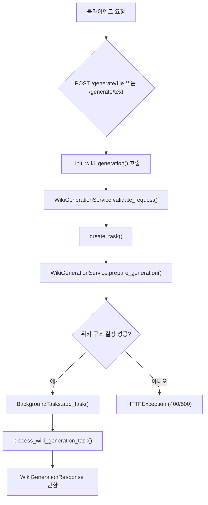
```mermaid
graph TD
    A["클라이언트 요청"] --> B{"POST /generate/file 또는 /generate/text"};
    B --> C["_init_wiki_generation() 호출"];
    C --> D["WikiGenerationService.validate_request()"];
    D --> E["create_task()"];
    E --> F["WikiGenerationService.prepare_generation()"];
    F --> G{"위키 구조 결정 성공?"};
    G -- "예" --> H["BackgroundTasks.add_task()"];
    H --> I["process_wiki_generation_task()"];
    I --> J["WikiGenerationResponse 반환"];
    G -- "아니오" --> K["HTTPException (400/500)"];
```

## GitHub 웹훅 API

`src/api/v1/endpoints/webhook.py` 파일은 GitHub 웹훅 이벤트를 수신하고 처리하여, 저장소에 푸시가 발생했을 때 자동으로 위키를 생성하고 GitHub 저장소의 `WIKI.md` 파일을 업데이트하는 기능을 제공합니다.

### 보안 및 설정

*   **`GITHUB_WEBHOOK_SECRET`**: GitHub 웹훅 서명 검증에 사용되는 비밀 키입니다. 환경 변수로 설정됩니다.
*   **`GITHUB_ACCESS_TOKEN`**: GitHub API를 통해 `WIKI.md` 파일을 업데이트할 때 사용되는 개인 액세스 토큰(PAT)입니다. 환경 변수로 설정됩니다.
*   **`BOT_COMMITTER_NAME`**: 봇이 생성한 커밋을 식별하여 무한 루프를 방지하는 데 사용됩니다.

### 핵심 기능

#### 1. 서명 검증 (`verify_signature`)

GitHub 웹훅 요청의 무결성과 신뢰성을 보장하기 위해 HMAC SHA256 서명을 검증합니다.

*   **함수**: `verify_signature`
*   **역할**:
    *   요청 헤더 `X-Hub-Signature-256`에서 서명을 추출합니다.
    *   `GITHUB_WEBHOOK_SECRET`을 사용하여 요청 본문으로 HMAC 해시를 계산합니다.
    *   계산된 해시와 수신된 서명을 비교하여 일치하지 않으면 403 Forbidden 오류를 발생시킵니다.
*   **소스**: [src/api/v1/endpoints/webhook.py](verify_signature)

#### 2. GitHub README 업데이트 (`update_github_readme`)

생성된 마크다운 콘텐츠를 GitHub 저장소의 `WIKI.md` 파일로 커밋합니다.

*   **함수**: `update_github_readme`
*   **역할**:
    *   `GITHUB_ACCESS_TOKEN`을 사용하여 GitHub API에 인증합니다.
    *   `httpx`를 사용하여 GitHub API와 통신합니다.
    *   기존 `WIKI.md` 파일의 SHA를 가져와 파일 업데이트 시 사용합니다.
    *   콘텐츠를 Base64로 인코딩합니다.
    *   봇 커미터 정보를 포함하여 `WIKI.md` 파일을 업데이트하는 PUT 요청을 보냅니다.
*   **소스**: [src/api/v1/endpoints/webhook.py](update_github_readme)

#### 3. 전체 사이클 처리 (`process_full_cycle`)

위키 생성 API 호출부터 GitHub 업데이트까지의 전체 과정을 비동기적으로 처리합니다.

*   **함수**: `process_full_cycle`
*   **역할**:
    *   내부 위키 생성 API (`/generate/text` 또는 유사)를 호출하여 마크다운 콘텐츠를 생성합니다.
    *   생성된 마크다운 텍스트를 추출합니다.
    *   `update_github_readme` 함수를 호출하여 GitHub에 업데이트합니다.
*   **소스**: [src/api/v1/endpoints/webhook.py](process_full_cycle)

### 엔드포인트 상세

#### GitHub 웹훅 수신 (`POST /github`)

GitHub 푸시 이벤트를 수신하고 처리하여 위키 생성 및 업데이트 작업을 시작합니다.

*   **경로**: `/api/v1/webhook/github`
*   **메서드**: `POST`
*   **설명**:
    *   `verify_signature`를 호출하여 요청의 유효성을 검증합니다.
    *   봇이 생성한 커밋(`BOT_COMMITTER_NAME` 또는 커밋 메시지에 "via Wiki-As-Readme" 포함)이거나 `main` 브랜시가 아닌 경우 처리를 건너뛰어 무한 루프를 방지합니다.
    *   수신된 `GitHubPushPayload`에서 저장소 소유자 및 이름을 추출합니다.
    *   `WikiGenerationRequest` 객체를 생성하여 내부 위키 생성 API에 전달할 요청 데이터를 준비합니다.
    *   `process_full_cycle` 함수를 백그라운드 태스크로 추가하여 위키 생성 및 GitHub 업데이트를 비동기적으로 수행합니다.
*   **요청 모델**: `GitHubPushPayload` (외부 스키마)
*   **응답**: `{"message": "Processing started: Generate & Update README."}`
*   **소스**: [src/api/v1/endpoints/webhook.py](github_webhook)

### GitHub 웹훅 처리 흐름 다이어그램

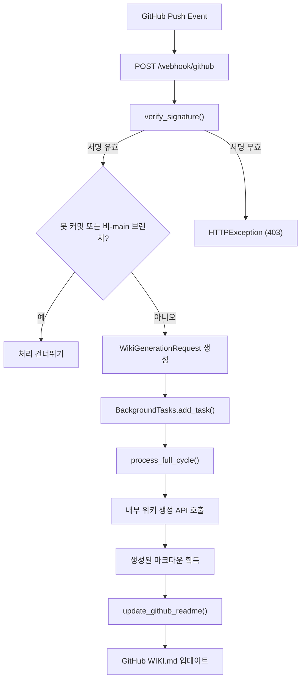
```mermaid
graph TD
    A["GitHub Push Event"] --> B["POST /webhook/github"];
    B --> C["verify_signature()"];
    C -- "서명 유효" --> D{"봇 커밋 또는 비-main 브랜치?"};
    D -- "예" --> E["처리 건너뛰기"];
    D -- "아니오" --> F["WikiGenerationRequest 생성"];
    F --> G["BackgroundTasks.add_task()"];
    G --> H["process_full_cycle()"];
    H --> I["내부 위키 생성 API 호출"];
    I --> J["생성된 마크다운 획득"];
    J --> K["update_github_readme()"];
    K --> L["GitHub WIKI.md 업데이트"];
    C -- "서명 무효" --> M["HTTPException (403)"];
```

## API 스키마 정의

`src/models/api_schema.py` 파일은 API 요청 및 응답에 사용되는 Pydantic 모델을 정의합니다. 이는 API의 데이터 구조를 명확히 하고 자동 유효성 검사를 제공합니다.

### 1. `WikiGenerationRequest`

위키 생성을 위한 요청 본문 스키마입니다.

| 필드명 | 타입 | 설명 |
|---|---|---|
| `repo_owner` | `str` \| `None` | 저장소 소유자 (사용자 또는 조직) |
| `repo_name` | `str` \| `None` | 저장소 이름 |
| `repo_type` | `Literal["github", "gitlab", "bitbucket", "local"]` | 저장소 유형 (기본값: `github`) |
| `repo_url` | `str` \| `None` | 원격 저장소 클론 URL |
| `local_path` | `str` \| `None` | `repo_type`이 'local'일 경우 로컬 저장소 경로 |
| `language` | `str` | 생성될 위키 콘텐츠의 언어 (기본값: `ko`) |
| `is_comprehensive_view` | `bool` | 저장소의 포괄적인 뷰를 생성할지 여부 (기본값: `True`) |

*   **유효성 검사**: `model_validator`를 통해 `repo_url`에서 `repo_owner`와 `repo_name`을 파싱하거나, `local_path`에서 `repo_name`을 유추합니다.
*   **소스**: [src/models/api_schema.py](WikiGenerationRequest)

### 2. `WikiGenerationResponse`

위키 생성 요청 시작 시 반환되는 응답 스키마입니다.

| 필드명 | 타입 | 설명 |
|---|---|---|
| `message` | `str` | 요청 상태를 나타내는 메시지 |
| `task_id` | `str` | 시작된 백그라운드 작업의 ID |
| `title` | `str` | 생성될 위키의 제목 |
| `description` | `str` | 생성될 위키의 설명 |

*   **소스**: [src/models/api_schema.py](WikiGenerationResponse)

### 3. `TaskStatusResponse`

백그라운드 작업의 상태를 조회할 때 반환되는 응답 스키마입니다.

| 필드명 | 타입 | 설명 |
|---|---|---|
| `task_id` | `str` | 작업의 ID |
| `status` | `Literal["in_progress", "completed", "failed"]` | 작업의 현재 상태 |
| `result` | `Any` \| `None` | 작업이 완료되거나 실패했을 경우의 결과 |

*   **소스**: [src/models/api_schema.py](TaskStatusResponse)

## 결론

이 백엔드 API 엔드포인트는 위키 문서 생성 및 관리를 위한 강력한 기능을 제공합니다. 비동기 처리와 백그라운드 태스크를 통해 사용자 경험을 향상시키고, GitHub 웹훅 통합을 통해 개발 워크플로우에 위키 업데이트를 자동화하여 문서화 프로세스를 간소화합니다. Pydantic 스키마를 사용하여 API의 일관성과 견고성을 보장합니다.

---

<a name="서비스-계층"></a>

<details>
<summary>Relevant source files</summary>

The following files were used as context for generating this wiki page:

- [src/services/wiki_generator.py](src/services/wiki_generator.py)
- [src/services/structure_analyzer.py](src/services/structure_analyzer.py)
- [src/services/repo_fetcher.py](src/services/repo_fetcher.py)
- [src/services/wiki_formatter.py](src/services/wiki_formatter.py)
- [src/services/notion_sync.py](src/services/notion_sync.py)
- [src/services/task_store.py](src/services/task_store.py)
</details>

# 서비스 계층

## 소개

서비스 계층은 소프트웨어 프로젝트에서 비즈니스 로직을 캡슐화하고, 다양한 하위 구성 요소 간의 조정을 담당하는 핵심 부분입니다. 이 프로젝트에서 서비스 계층은 위키 생성 파이프라인의 엔드-투-엔드 조정을 담당하며, 저장소에서 데이터를 가져오고, 위키 구조를 분석하며, 콘텐츠를 생성하고, 최종 마크다운을 포맷하며, 필요에 따라 외부 시스템(예: Notion)과 동기화하는 역할을 수행합니다. 각 서비스는 특정 책임을 가지며, 모듈화된 방식으로 상호 작용하여 위키 생성 프로세스의 복잡성을 관리합니다.

## 서비스 구성 요소

이 서비스 계층은 다음과 같은 주요 서비스들로 구성됩니다.

### 1. `WikiGenerationService`

`WikiGenerationService`는 위키 생성 파이프라인의 메인 진입점 및 오케스트레이터입니다. 사용자 요청을 받아 전체 위키 생성 흐름을 조정하고, 각 하위 서비스의 작업을 순서대로 호출합니다.

**주요 기능:**

*   **요청 유효성 검사 (`validate_request`):** 위키 생성 요청의 매개변수가 유효한지 확인합니다. 저장소 유형에 따라 필요한 필드(예: `local_path`, `repo_owner`, `repo_name`)가 제공되었는지 검증합니다.
    Sources: [src/services/wiki_generator.py](WikiGenerationService.validate_request)
*   **생성 준비 (`prepare_generation`):** 위키 구조 결정자를 초기화하고 초기 구조를 가져옵니다. 이는 Human-in-the-loop(사용자 개입) 흐름에서 콘텐츠 생성 전에 구조를 확인할 때 유용합니다.
    Sources: [src/services/wiki_generator.py](WikiGenerationService.prepare_generation)
*   **위키 생성 (`generate_wiki`, `generate_wiki_with_structure`):** 전체 위키 생성 파이프라인을 실행합니다. `generate_wiki_with_structure` 메서드는 마크다운 문자열뿐만 아니라 생성된 구조 및 페이지 콘텐츠를 포함하는 상세한 결과를 반환합니다.
    Sources: [src/services/wiki_generator.py](WikiGenerationService.generate_wiki_with_structure)
*   **초기화 및 구조 결정 (`_initialize_and_determine`):** `RepositoryFetcher`를 사용하여 저장소 구조를 가져오고, `WikiStructureDeterminer`를 초기화하여 위키 구조를 결정합니다.
    Sources: [src/services/wiki_generator.py](WikiGenerationService._initialize_and_determine)
*   **파일 저장 (`save_to_file`):** 생성된 마크다운 콘텐츠를 로컬 파일 시스템에 저장합니다.
    Sources: [src/services/wiki_generator.py](WikiGenerationService.save_to_file)

**위키 생성 흐름:**

```mermaid
graph TD
    A["WikiGenerationService.generate_wiki_with_structure()"] --> B{"Determiner 제공됨?"}
    B -- "아니오" --> C["_initialize_and_determine()"]
    C --> D["RepositoryFetcher.fetch_repository_structure()"]
    D --> E["WikiStructureDeterminer.determine_wiki_structure()"]
    E --> F{"구조 결정 완료?"}
    F -- "예" --> G["WikiStructureDeterminer.generate_contents()"]
    B -- "예" --> G
    G --> H["_wait_for_completion()"]
    H --> I{"콘텐츠 생성 완료?"}
    I -- "예" --> J["WikiFormatter.consolidate_markdown()"]
    J --> K["결과 반환"]
```
Sources: [src/services/wiki_generator.py](WikiGenerationService.generate_wiki_with_structure)

### 2. `WikiStructureDeterminer`

`WikiStructureDeterminer`는 LLM(대규모 언어 모델)을 사용하여 위키 구조를 결정하고 각 페이지의 콘텐츠를 생성하는 핵심 서비스입니다.

**주요 기능:**

*   **프롬프트 템플릿 로드 (`_load_prompt_template`):** YAML 파일에서 프롬프트 템플릿을 로드하고 캐싱합니다.
    Sources: [src/services/structure_analyzer.py](WikiStructureDeterminer._load_prompt_template)
*   **파일 가져오기 및 포맷팅 (`_fetch_and_format_files`):** `RepositoryFetcher`를 사용하여 페이지에 필요한 소스 파일의 내용을 병렬로 가져오고, LLM 입력에 적합한 형식으로 포맷합니다.
    Sources: [src/services/structure_analyzer.py](WikiStructureDeterminer._fetch_and_format_files)
*   **페이지 콘텐츠 생성 (`generate_page_content`):** 개별 위키 페이지의 콘텐츠를 LLM을 통해 생성합니다. 동시성 제어(세마포어)를 사용하여 동시에 실행되는 LLM 요청 수를 제한합니다.
    Sources: [src/services/structure_analyzer.py](WikiStructureDeterminer.generate_page_content)
*   **위키 구조 결정 (`determine_wiki_structure`):** 저장소 파일 트리와 README를 기반으로 LLM을 사용하여 위키의 전체 구조(섹션 및 페이지 계층)를 결정합니다.
    Sources: [src/services/structure_analyzer.py](WikiStructureDeterminer.determine_wiki_structure)
*   **콘텐츠 생성 흐름 관리 (`_start_content_generation_flow`, `generate_contents`):** 결정된 위키 구조에 따라 모든 페이지의 콘텐츠 생성을 시작하고 관리합니다.

**`WikiStructureDeterminer` 내부 흐름:**

```mermaid
sequenceDiagram
    participant WGS as "WikiGenerationService"
    participant WSD as "WikiStructureDeterminer"
    participant RF as "RepositoryFetcher"
    participant LLM as "LLM (WikiMaker)"

    WGS->>WSD: determine_wiki_structure(file_tree, readme)
    WSD->>WSD: _load_prompt_template("prompts/wiki_structure_generator.yaml")
    WSD->>LLM: ainvoke(formatted_prompt_for_structure)
    LLM-->>WSD: WikiStructure 객체 반환
    WSD->>WGS: WikiStructure 반환
    WGS->>WSD: generate_contents(language)
    loop 각 WikiPage
        WSD->>WSD: generate_page_content(page)
        WSD->>WSD: _load_prompt_template("prompts/wiki_contents_generator.yaml")
        WSD->>WSD: _fetch_and_format_files(page)
        WSD->>RF: fetch_file_content(file_path)
        RF-->>WSD: 파일 내용 반환
        WSD->>LLM: ainvoke(formatted_prompt_for_content)
        LLM-->>WSD: 페이지 마크다운 콘텐츠 반환
        WSD->>WSD: generated_pages에 저장
    end
```
Sources: [src/services/structure_analyzer.py](WikiStructureDeterminer.determine_wiki_structure), [src/services/structure_analyzer.py](WikiStructureDeterminer.generate_page_content)

### 3. `RepositoryFetcher`

`RepositoryFetcher`는 다양한 저장소 유형(GitHub, GitLab, Bitbucket, 로컬)에서 저장소 구조 및 파일 콘텐츠를 가져오는 역할을 추상화합니다.

**주요 기능:**

*   **저장소 구조 가져오기 (`fetch_repository_structure`):** 저장소의 파일 트리 구조를 가져옵니다.
    Sources: [src/services/repo_fetcher.py](RepositoryFetcher.fetch_repository_structure)
*   **파일 콘텐츠 가져오기 (`fetch_file_content`):** 특정 파일의 내용을 가져옵니다.
    Sources: [src/services/repo_fetcher.py](RepositoryFetcher.fetch_file_content)
*   **프로바이더 관리:** `_PROVIDER_MAP`을 사용하여 요청된 저장소 유형에 따라 적절한 `RepositoryProvider` 구현체(예: `GitHubProvider`, `LocalProvider`)를 동적으로 인스턴스화합니다.
    Sources: [src/services/repo_fetcher.py](RepositoryFetcher._PROVIDER_MAP)

### 4. `WikiFormatter`

`WikiFormatter`는 생성된 위키 구조와 개별 페이지 콘텐츠를 단일 마크다운 문자열로 통합하는 유틸리티 서비스입니다.

**주요 기능:**

*   **파일 이름 정리 (`sanitize_filename`):** 파일 이름으로 사용하기에 안전하도록 문자열을 정리합니다.
    Sources: [src/services/wiki_formatter.py](WikiFormatter.sanitize_filename)
*   **마크다운 통합 (`consolidate_markdown`):** `WikiStructure` 객체와 페이지 ID-콘텐츠 맵을 받아, 목차와 본문 콘텐츠를 포함하는 하나의 완성된 마크다운 문서를 생성합니다.
    Sources: [src/services/wiki_formatter.py](WikiFormatter.consolidate_markdown)

### 5. `NotionSyncService`

`NotionSyncService`는 생성된 위키 콘텐츠를 Notion 데이터베이스 및 페이지로 동기화하는 외부 통합 서비스입니다.

**주요 기능:**

*   **위키 동기화 (`sync_wiki`):** 저장소 이름, 위키 구조, 페이지 콘텐츠를 받아 Notion에 동기화 프로세스를 시작합니다.
    Sources: [src/services/notion_sync.py](NotionSyncService.sync_wiki)
*   **데이터베이스 항목 Upsert (`_upsert_database_item`):** Notion 데이터베이스에서 저장소에 해당하는 항목을 찾거나 새로 생성합니다.
    Sources: [src/services/notion_sync.py](NotionSyncService._upsert_database_item)
*   **기존 콘텐츠 지우기 (`_clear_existing_content`):** Notion 페이지의 기존 콘텐츠(하위 페이지 아카이브, 블록 삭제)를 지웁니다.
    Sources: [src/services/notion_sync.py](NotionSyncService._clear_existing_content)
*   **페이지 생성 및 블록 추가 (`_create_page`, `_append_blocks_safe`):** Notion 페이지를 생성하고, 마크다운 콘텐츠를 Notion 블록으로 변환하여 페이지에 추가합니다. `_append_blocks_safe`는 "Payload Too Large" 오류를 처리하기 위해 배치 크기를 동적으로 조정하는 로직을 포함합니다.
    Sources: [src/services/notion_sync.py](NotionSyncService._create_page), [src/services/notion_sync.py](NotionSyncService._append_blocks_safe)

### 6. `TaskStore`

`TaskStore`는 위키 생성과 같은 비동기 작업의 상태를 추적하기 위한 간단한 인메모리 저장소입니다.

**주요 기능:**

*   **작업 생성 (`create_task`):** 새로운 작업을 생성하고 고유한 `task_id`를 할당합니다.
    Sources: [src/services/task_store.py](create_task)
*   **작업 조회 (`get_task`):** `task_id`를 사용하여 저장된 작업을 검색합니다.
    Sources: [src/services/task_store.py](get_task)
*   **작업 상태 업데이트 (`update_task_status`):** 작업의 상태(예: `in_progress`, `completed`, `failed`)와 결과를 업데이트합니다.
    Sources: [src/services/task_store.py](update_task_status)

**참고:** 이 구현은 인메모리 방식이므로, 여러 워커가 있는 프로덕션 환경에는 적합하지 않습니다. 프로덕션 환경에서는 Redis와 같은 공유 저장소가 필요합니다.

## 서비스 간의 상호작용

서비스 계층 내의 구성 요소들은 위키 생성의 다양한 단계를 처리하기 위해 협력합니다. 다음은 전체적인 데이터 흐름과 상호작용을 보여주는 다이어그램입니다.

```mermaid
graph TD
    A["WikiGenerationRequest"] --> B["WikiGenerationService"]
    B --> C["RepositoryFetcher"]
    C --> D["Repository Structure & Files"]
    D --> E["WikiStructureDeterminer"]
    E --> F["LLM (Structure & Content)"]
    F --> G["WikiStructure & Page Contents"]
    G --> H["WikiFormatter"]
    H --> I["Consolidated Markdown"]
    I --> J["WikiGenerationService (Save to File)"]
    I --> K["NotionSyncService (Optional)"]
    K --> L["Notion Database"]

    subgraph "Wiki Generation Pipeline"
        B -- "Orchestrates" --> C
        B -- "Orchestrates" --> E
        B -- "Orchestrates" --> H
        B -- "Orchestrates" --> J
    end

    subgraph "External Integration"
        B -- "Triggers" --> K
    end

    subgraph "Task Management"
        B -- "Updates" --> M["TaskStore"]
        E -- "Updates" --> M
    end
```

## 결론

서비스 계층은 이 프로젝트의 핵심적인 아키텍처 구성 요소로, 위키 생성 프로세스의 복잡성을 관리하고 각 단계의 책임을 명확하게 분리합니다. `WikiGenerationService`를 중심으로 `RepositoryFetcher`, `WikiStructureDeterminer`, `WikiFormatter`, `NotionSyncService`, `TaskStore`와 같은 전문화된 서비스들이 유기적으로 협력하여, 요청부터 최종 위키 문서 생성 및 배포까지의 전체 워크플로우를 효율적이고 확장 가능하게 만듭니다. 이러한 모듈화된 접근 방식은 시스템의 유지보수성과 확장성을 높이는 데 기여합니다.

---
