# Wiki As Readme 프로젝트 위키

코드베이스를 포괄적인 위키로 변환하는 유연한 AI 문서화 도구입니다. 모든 LLM, 모든 Git 플랫폼, 모든 배포 환경을 지원합니다.

## Table of Contents

- [프로젝트 소개](#프로젝트-소개)
- [핵심 기능](#핵심-기능)
- [GitHub 액션으로 사용하기](#github-액션으로-사용하기)
- [Docker Compose로 로컬에서 실행](#docker-compose로-로컬에서-실행)
- [로컬 개발 환경 설정](#로컬-개발-환경-설정)
- [서버 및 웹훅 배포](#서버-및-웹훅-배포)
- [아키텍처 개요](#아키텍처-개요)
- [LLM 통합 및 설정](#llm-통합-및-설정)
- [주요 서비스 컴포넌트](#주요-서비스-컴포넌트)
- [API 엔드포인트 참조](#api-엔드포인트-참조)
- [환경 설정 가이드](#환경-설정-가이드)
- [기여 가이드](#기여-가이드)

---

<a name="프로젝트-소개"></a>

<details>
<summary>Relevant source files</summary>

The following files were used as context for generating this wiki page:

- [README.md](README.md)
- [action.yml](action.yml)
- [pyproject.toml](pyproject.toml)
</details>

# 프로젝트 소개

## 📚 Wiki As Readme 프로젝트 개요

**Wiki As Readme**는 코드베이스를 포괄적인 위키 문서로 자동 변환해주는 유연한 AI 문서화 도구입니다. 이 프로젝트는 어떤 LLM(대규모 언어 모델)이든, 어떤 코드 저장소든, 어떤 환경에서든 작동하도록 설계되어 개발자들이 손쉽게 프로젝트 문서를 생성하고 관리할 수 있도록 돕습니다. 로컬 Ollama를 통해 Llama 3 모델을 실행하든, Google Gemini Pro를 사용하든, OpenAI API를 호출하든, 이 도구는 사용자의 기술 스택에 맞춰 유연하게 작동합니다. 또한 GitHub, GitLab, Bitbucket과 같은 모든 Git 플랫폼 또는 로컬 폴더와 원활하게 통합되어 궁극적인 "드롭인" 문서화 솔루션을 제공합니다.

이 도구는 코드 분석을 통해 프로젝트 아키텍처를 이해하고, 논리적인 문서 계층 구조를 자동으로 생성하며, 아키텍처 개요, 설치 가이드, API 참조 등 상세한 내용을 작성합니다. 특히, Mermaid.js 다이어그램을 자동으로 생성하여 아키텍처를 시각화하는 기능을 제공하며, 개별 Markdown 파일과 단일 통합 `README.md` 파일을 모두 생성할 수 있습니다. FastAPI와 AsyncIO를 기반으로 구축되어 대규모 문서 생성에도 비차단적이고 효율적인 성능을 보장합니다.

## ✨ 주요 특징

Wiki As Readme는 다음과 같은 핵심 기능을 제공하여 문서화 프로세스를 혁신합니다.

*   **🧠 심층 컨텍스트 분석 (Deep Context Analysis):** 파일 구조와 관계를 분석하여 문서 작성 전에 프로젝트의 아키텍처를 깊이 이해합니다.
    *   Sources: [README.md](Core Features)
*   **📦 스마트 구조 생성 (Smart Structure Generation):** 문서에 대한 논리적인 계층 구조(섹션 > 페이지)를 자동으로 결정합니다.
    *   Sources: [README.md](Core Features)
*   **🔍 포괄적인 콘텐츠 (Comprehensive Content):** 아키텍처 개요, 설치 가이드, API 참조를 포함한 상세한 페이지를 작성합니다.
    *   Sources: [README.md](Core Features)
*   **📊 자동 다이어그램 생성 (Automatic Diagrams):** 아키텍처를 시각화하기 위해 Mermaid.js 다이어그램(플로우차트, 시퀀스 다이어그램, 클래스 다이어그램)을 생성합니다.
    *   Sources: [README.md](Core Features)
*   **🚗 하이브리드 출력 (Hybrid Output):** 위키를 위한 개별 Markdown 파일과 단일 통합 `README.md` 파일을 모두 생성합니다.
    *   Sources: [README.md](Core Features)
*   **⚡ 비동기 및 확장 가능 (Async & Scalable):** FastAPI 및 AsyncIO로 구축되어 대규모 문서 생성을 위한 비차단적이고 효율적인 성능을 제공합니다.
    *   Sources: [README.md](Core Features)

## 🌐 범용 호환성

이 프로젝트는 **진정으로 플러그인 가능**하도록 설계되어 사용자가 실행 방식, 실행 위치, 구동 방식을 자유롭게 선택할 수 있습니다.

### 🧠 1. 모델 독립성 (Model Agnostic)

LiteLLM을 기반으로 다양한 LLM 제공업체와 모델을 지원합니다.
*   **상용 API:** Google Vertex AI (Gemini), OpenAI (GPT-4), Anthropic (Claude), xAI (Grok).
*   **오픈/로컬 모델:** Ollama, OpenRouter, HuggingFace.
*   **온프레미스:** 자체 프라이빗 LLM 엔드포인트에 안전하게 연결할 수 있습니다.
    *   Sources: [README.md](Model Agnostic)

### 🚉 2. 플랫폼 독립성 (Platform Agnostic)

다양한 코드 저장소 플랫폼과 로컬 환경을 지원합니다.
*   **클라우드 저장소:** GitHub, GitLab, Bitbucket과 원활하게 작동합니다.
*   **로컬 개발:** 코드를 푸시하지 않고 로컬 파일 시스템에서 직접 코드를 분석합니다.
*   **프라이빗/엔터프라이즈:** 프라이빗 인스턴스 및 자체 호스팅 Git 서버를 완벽하게 지원합니다.
    *   Sources: [README.md](Platform Agnostic)

### 🛠️ 3. 배포 독립성 (Deployment Agnostic)

다양한 배포 환경에 통합될 수 있습니다.
*   **CI/CD:** GitHub Actions에 통합하여 사용할 수 있습니다.
*   **컨테이너:** Docker Compose를 통해 실행할 수 있습니다.
*   **서비스:** 웹훅을 지원하는 장기 실행 API 서버로 배포할 수 있습니다.
*   **CLI:** 코딩 중에 로컬에서 실행할 수 있습니다.
    *   Sources: [README.md](Deployment Agnostic)

## 🚀 사용 모드

이 프로젝트는 사용자의 필요에 따라 여러 가지 방식으로 활용될 수 있도록 **플러그인 가능**하게 설계되었습니다.

1.  **GitHub Action (권장):** CI/CD 파이프라인에서 문서 업데이트를 자동화합니다.
    *   `.github/workflows/update-wiki.yml` 파일을 생성하여 `push` 이벤트 시 `WIKI.md` 파일을 자동으로 업데이트하도록 설정할 수 있습니다.
    *   Sources: [README.md](GitHub Action), [action.yml](action.yml)
2.  **Docker Compose (로컬):** Python 종속성을 설치할 필요 없이 전체 UI/API를 로컬에서 실행합니다.
    *   `.env` 파일을 설정한 후 `docker-compose up --build` 명령으로 실행합니다.
    *   Sources: [README.md](Docker Compose (Local))
3.  **로컬 Python 개발:** 소스 코드를 수정하거나 Docker 없이 실행하려는 개발자를 위한 모드입니다.
    *   Python 3.12+ 및 `uv`가 필요하며, `uv sync`로 종속성을 설치한 후 백엔드(FastAPI)와 프론트엔드(Streamlit)를 별도로 실행합니다.
    *   Sources: [README.md](Local Python Development), [pyproject.toml](pyproject.toml)
4.  **서버 및 웹훅:** API 서버를 배포하여 요청 또는 웹훅(예: GitHub)을 처리합니다.
    *   `POST /api/v1/webhook/github` 엔드포인트는 GitHub 푸시 이벤트 페이로드를 받아 위키 생성을 트리거합니다.
    *   Sources: [README.md](Server & Webhooks)

### GitHub Action 워크플로우 예시

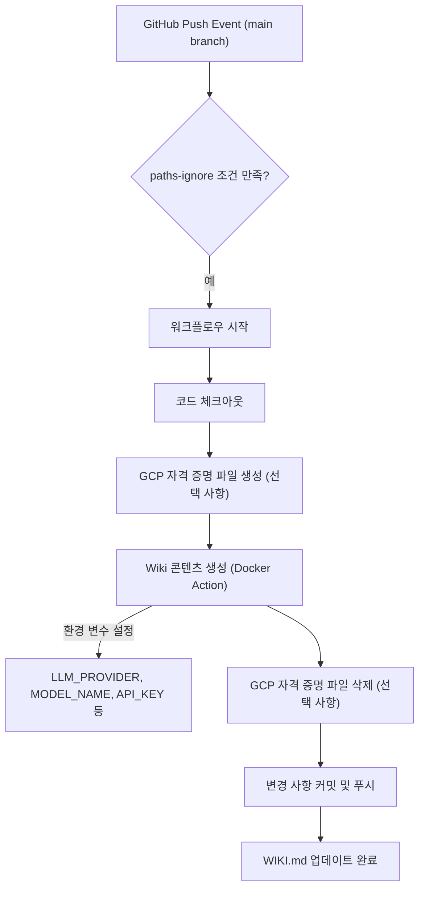
Sources: [README.md](1. GitHub Action (Recommended)), [action.yml](action.yml)

## 🛠️ 아키텍처

Wiki As Readme는 다음과 같은 기술 스택으로 구성되어 있습니다.

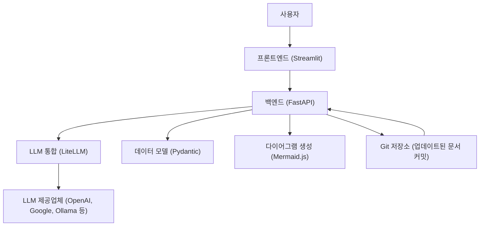
Sources: [README.md](Architecture), [pyproject.toml](project.dependencies)

*   **프론트엔드:** [Streamlit](https://streamlit.io/) (사용자 인터페이스)
*   **백엔드:** [FastAPI](https://fastapi.tiangolo.com/) (REST API, 백그라운드 작업)
*   **LLM 통합:** [LiteLLM](https://docs.litellm.ai/) (100개 이상의 LLM을 위한 통합 인터페이스)
*   **데이터 모델:** [Pydantic](https://docs.pydantic.dev/) (타입 안전성 및 구조화된 출력 유효성 검사)
*   **다이어그램:** Mermaid.js
    *   Sources: [README.md](Architecture)

### 주요 Python 종속성

`pyproject.toml` 파일에 명시된 주요 종속성은 다음과 같습니다.

*   `litellm`: LLM 통합을 위한 핵심 라이브러리.
*   `fastapi`, `uvicorn`, `gunicorn`: 백엔드 API 서버 구축 및 실행.
*   `streamlit`: 웹 UI 구축.
*   `pydantic`, `pydantic-settings`: 데이터 모델 정의 및 설정 관리.
*   `httpx`, `requests`: HTTP 요청 처리.
*   `google-auth`: Google Cloud 인증.
*   `loguru`: 로깅.
*   `python-dotenv`: 환경 변수 관리.
*   `jinja2`, `pyyaml`: 템플릿 및 YAML 처리.
    *   Sources: [pyproject.toml](project.dependencies)

## 🔌 API 참조

백엔드 API는 FastAPI로 구축되었습니다. 서버가 실행 중일 때 `http://localhost:8000/docs`에서 대화형 Swagger 문서를 확인할 수 있습니다.

### 위키 생성 엔드포인트

| HTTP 메서드 | 경로 | 설명 |
|---|---|---|
| `POST` | `/api/v1/wiki/generate/file` | 위키 생성을 위한 백그라운드 작업을 시작하고, 생성된 위키를 서버에 Markdown 파일로 저장합니다. |
| `POST` | `/api/v1/wiki/generate/text` | 위키 생성을 위한 백그라운드 작업을 시작합니다. 결과 텍스트는 작업 상태에 저장됩니다. |
| `GET` | `/api/v1/wiki/status/{task_id}` | 특정 생성 작업의 상태와 결과를 검색합니다. |
    *   Sources: [README.md](API Reference)

### 웹훅 엔드포인트

| HTTP 메서드 | 경로 | 설명 |
|---|---|---|
| `POST` | `/api/v1/webhook/github` | GitHub 웹훅(푸시 이벤트)을 위한 엔드포인트입니다. `main` 브랜치에 푸시될 때 자동 위키 생성을 트리거합니다. |
    *   Sources: [README.md](API Reference)

## ⚙️ 설정 참조 (`.env`)

로컬 또는 Docker 환경에서 애플리케이션을 실행할 때 환경 변수를 통해 앱을 구성합니다.

| 카테고리 | 변수 | 설명 | 예시 |
|---|---|---|---|
| **LLM 제공업체** | `LLM_PROVIDER` | LLM 제공업체 (`google`, `openai`, `anthropic`, `xai`, `openrouter`, `ollama`) | `google` |
| | `MODEL_NAME` | 사용할 특정 모델 식별자 | `gemini-2.5-flash` |
| **인증** | `OPENAI_API_KEY` | OpenAI API 키 | `sk-...` |
| | `GCP_PROJECT_NAME` | Vertex AI 프로젝트 ID | `my-genai-project` |
| | `GCP_MODEL_LOCATION` | GCP 모델 위치 | `us-central1` |
| | `GOOGLE_APPLICATION_CREDENTIALS` | GCP 서비스 계정 JSON 키 파일 경로 | `/github/workspace/gcp-key.json` |
| | `GIT_API_TOKEN` | 프라이빗 저장소 접근을 위한 GitHub/GitLab API 토큰 | `ghp_...` |
| **고급 설정** | `USE_STRUCTURED_OUTPUT` | 네이티브 JSON 모드 사용 여부 | `true` |
| | `TEMPERATURE` | LLM 온도 (0.0 ~ 1.0) | `0.0` |
| | `MAX_RETRIES` | 최대 재시도 횟수 | `3` |
| | `MAX_CONCURRENCY` | 최대 병렬 LLM 호출 수 | `5` |
| | `LLM_BASE_URL` | LLM API의 사용자 정의 기본 URL | `http://localhost:11434/v1` |
| **필터링** | `IGNORED_PATTERNS` | 제외할 glob 패턴의 **JSON 배열** | `'["*.log", "node_modules/*"]'` |
| **기타** | `LANGUAGE` | 생성될 콘텐츠의 언어 (`ko`, `en`) | `ko` |
| | `OUTPUT_FILE` | 생성된 콘텐츠를 저장할 파일 이름 | `WIKI.md` |
    *   Sources: [README.md](Configuration Reference (.env)), [action.yml](inputs)

## 🤝 기여

기여는 언제나 환영합니다. Pull Request를 제출해 주세요.
1.  프로젝트를 포크합니다.
2.  기능 브랜치를 생성합니다 (`git checkout -b feature/AmazingFeature`).
3.  변경 사항을 커밋합니다 (`git commit -m 'Add some AmazingFeature'`).
4.  브랜치에 푸시합니다 (`git push origin feature/AmazingFeature`).
5.  Pull Request를 엽니다.
    *   Sources: [README.md](Contributing)

## 📄 라이선스

이 프로젝트는 MIT 라이선스에 따라 라이선스가 부여됩니다. 자세한 내용은 [LICENSE](LICENSE) 파일을 참조하십시오.
    *   Sources: [README.md](License)

---

<a name="핵심-기능"></a>

<details>
<summary>Relevant source files</summary>

The following files were used as context for generating this wiki page:

- [README.md](README.md)
- [src/services/structure_analyzer.py](src/services/structure_analyzer.py)
- [src/services/wiki_generator.py](src/services/wiki_generator.py)
- [src/prompts/wiki_structure_generator.yaml](src/prompts/wiki_structure_generator.yaml)
- [src/prompts/wiki_contents_generator.yaml](src/prompts/wiki_contents_generator.yaml)
</details>

# 핵심 기능

## 1. 소개

**Wiki As Readme**는 코드베이스를 포괄적인 위키 문서로 자동 변환하는 유연한 AI 문서화 도구입니다. 이 도구는 다양한 LLM(대규모 언어 모델)과 Git 플랫폼, 배포 환경에 구애받지 않고 작동하도록 설계되어, 개발자가 어떤 스택을 사용하든 쉽게 문서화를 자동화할 수 있도록 지원합니다. 핵심 기능은 프로젝트의 아키텍처를 이해하고, 논리적인 문서 구조를 생성하며, 상세한 내용을 작성하고, 시각적인 다이어그램까지 포함하는 포괄적인 문서화 프로세스를 제공하는 데 중점을 둡니다.

## 2. 주요 기능 상세

Wiki As Readme의 핵심 기능은 다음과 같은 주요 영역으로 나눌 수 있습니다.

### 2.1. 범용 호환성 (Universal Compatibility)

이 프로젝트는 진정으로 "플러그인 가능한" 방식으로 설계되어 사용자가 실행 방식, 위치, 구동 기술을 자유롭게 선택할 수 있습니다.

#### 2.1.1. 모델 불가지론 (Model Agnostic)
LiteLLM을 기반으로 100개 이상의 LLM을 지원하여, 사용자가 선호하는 모델을 유연하게 선택할 수 있습니다.
*   **상용 API**: Google Vertex AI (Gemini), OpenAI (GPT-4), Anthropic (Claude), xAI (Grok) 등
*   **오픈/로컬 모델**: Ollama, OpenRouter, HuggingFace 등
*   **온프레미스**: 자체 프라이빗 LLM 엔드포인트에 안전하게 연결 가능

#### 2.1.2. 플랫폼 불가지론 (Platform Agnostic)
다양한 코드 저장소 플랫폼과 로컬 환경을 지원하여, 어디서든 코드 분석이 가능합니다.
*   **클라우드 저장소**: GitHub, GitLab, Bitbucket과 원활하게 연동
*   **로컬 개발**: 로컬 파일 시스템에서 직접 코드 분석
*   **프라이빗/엔터프라이즈**: 프라이빗 인스턴스 및 자체 호스팅 Git 서버 완벽 지원

#### 2.1.3. 배포 불가지론 (Deployment Agnostic)
다양한 배포 및 실행 방식을 지원하여, 사용자의 워크플로우에 통합하기 용이합니다.
*   **CI/CD**: GitHub Actions에 통합하여 자동화된 문서 업데이트
*   **컨테이너**: Docker Compose를 통한 손쉬운 배포 및 실행
*   **서비스**: 웹훅을 지원하는 장기 실행 API 서버로 배포
*   **CLI**: 로컬에서 코딩 중 직접 실행

### 2.2. 핵심 문서 생성 기능 (Core Features)

문서 생성 과정에서 프로젝트의 깊은 이해를 바탕으로 고품질의 문서를 자동으로 생성합니다.
*   **🧠 심층 컨텍스트 분석 (Deep Context Analysis)**: 파일 구조와 관계를 분석하여 문서 작성 전에 프로젝트 아키텍처를 이해합니다.
*   **📦 스마트 구조 생성 (Smart Structure Generation)**: 문서에 대한 논리적인 계층 구조(섹션 > 페이지)를 자동으로 결정합니다.
*   **🔍 포괄적인 콘텐츠 (Comprehensive Content)**: 아키텍처 개요, 설치 가이드, API 참조를 포함한 상세 페이지를 작성합니다.
*   **📊 자동 다이어그램 (Automatic Diagrams)**: 아키텍처를 시각화하기 위해 Mermaid.js 다이어그램(플로우차트, 시퀀스 다이어그램, 클래스 다이어그램)을 생성합니다.
*   **🚗 하이브리드 출력 (Hybrid Output)**: 위키를 위한 개별 Markdown 파일과 단일 통합 `README.md` 파일을 모두 생성합니다.
*   **⚡ 비동기 및 확장 가능 (Async & Scalable)**: 대규모 문서 생성을 위한 논블로킹 및 효율적인 처리를 위해 FastAPI 및 AsyncIO로 구축되었습니다.

### 2.3. 위키 생성 워크플로우 (Wiki Generation Workflow)

Wiki As Readme의 핵심은 `WikiGenerationService`와 `WikiStructureDeterminer`를 중심으로 한 체계적인 문서 생성 파이프라인입니다.

#### 2.3.1. `WikiGenerationService` (src/services/wiki_generator.py)
이 서비스는 전체 위키 생성 파이프라인을 조율하는 역할을 합니다.
*   **요청 유효성 검사**: 입력된 `WikiGenerationRequest`의 유효성을 확인합니다.
*   **초기화 및 구조 결정**: `RepositoryFetcher`를 사용하여 저장소 구조를 가져오고, `WikiStructureDeterminer`를 초기화하여 위키 구조를 결정합니다.
*   **콘텐츠 생성 조율**: `WikiStructureDeterminer`가 페이지 콘텐츠 생성을 시작하도록 지시하고, 완료될 때까지 기다립니다.
*   **결과 통합**: `WikiFormatter`를 사용하여 생성된 위키 구조와 페이지 콘텐츠를 단일 Markdown 문서로 통합합니다.
*   **파일 저장**: 생성된 Markdown 콘텐츠를 지정된 경로에 파일로 저장합니다.

#### 2.3.2. `WikiStructureDeterminer` (src/services/structure_analyzer.py)
이 서비스는 LLM을 활용하여 위키의 구조를 결정하고 각 페이지의 콘텐츠를 생성하는 핵심 로직을 담당합니다.
*   **위키 구조 결정 (`determine_wiki_structure`)**:
    *   `src/prompts/wiki_structure_generator.yaml` 프롬프트 템플릿을 사용하여 LLM에 저장소의 파일 트리와 README를 제공합니다.
    *   LLM은 `WikiStructure` Pydantic 모델에 따라 위키의 섹션, 페이지, 각 페이지에 필요한 파일 경로 등을 JSON 형식으로 반환합니다.
    *   Sources: [src/services/structure_analyzer.py](determine_wiki_structure function), [src/prompts/wiki_structure_generator.yaml](template)
*   **페이지 콘텐츠 생성 (`generate_page_content`)**:
    *   `src/prompts/wiki_contents_generator.yaml` 프롬프트 템플릿을 사용하여 LLM에 특정 페이지의 제목과 해당 페이지와 관련된 소스 파일의 내용을 제공합니다.
    *   LLM은 제공된 소스 코드만을 기반으로 상세한 Markdown 형식의 페이지 콘텐츠를 생성합니다.
    *   동시성 제어(Semaphore)를 사용하여 여러 페이지의 콘텐츠 생성을 병렬로 처리하면서 LLM 호출 수를 제한합니다.
    *   Sources: [src/services/structure_analyzer.py](generate_page_content function), [src/prompts/wiki_contents_generator.yaml](template)
*   **파일 내용 가져오기 (`_fetch_and_format_files`)**: `RepositoryFetcher`를 사용하여 지정된 파일 경로의 내용을 비동기적으로 가져옵니다.
*   **프롬프트 템플릿 로드**: YAML 파일에서 프롬프트 템플릿을 로드하고 캐싱하여 효율성을 높입니다.

### 2.4. 프롬프트 엔지니어링 (Prompt Engineering)

LLM의 출력을 제어하고 고품질의 문서를 생성하기 위해 두 가지 주요 프롬프트 템플릿이 사용됩니다.

#### 2.4.1. `wiki_structure_generator.yaml`
*   **목적**: 저장소의 전체 구조(파일 트리, README)를 분석하여 위키의 논리적인 계층 구조(섹션, 페이지)를 결정합니다.
*   **출력 형식**: `WikiStructure` Pydantic 모델에 엄격하게 부합하는 JSON 객체를 요구합니다.
*   **주요 지시**:
    *   포괄적인 위키를 위한 페이지 수(8-12개) 또는 간결한 위키를 위한 페이지 수(4-6개)를 지정합니다.
    *   각 페이지에 대한 관련 파일 경로(`file_paths`)를 실제 파일 트리에서 선택하도록 지시합니다.
    *   섹션 및 페이지 ID, 제목, 중요도, 관련 페이지 등을 상세하게 정의하도록 안내합니다.
    *   Sources: [src/prompts/wiki_structure_generator.yaml](template)

#### 2.4.2. `wiki_contents_generator.yaml`
*   **목적**: 특정 위키 페이지의 제목과 관련 소스 파일 내용을 기반으로 해당 페이지의 Markdown 콘텐츠를 생성합니다.
*   **출력 형식**: 순수한 Markdown 텍스트를 요구하며, JSON 객체나 코드 블록으로 감싸지 않도록 엄격하게 지시합니다.
*   **주요 지시**:
    *   페이지 상단에 관련 소스 파일을 나열하는 `<details>` 블록을 포함하도록 강제합니다.
    *   소개, 상세 섹션, 결론으로 구성된 콘텐츠 구조를 따르도록 합니다.
    *   Mermaid 다이어그램 생성 시 엄격한 문법 규칙(모든 레이블에 이중 따옴표 사용, 예약어 피하기)을 준수하도록 강조합니다.
    *   Markdown 테이블 형식, 인용(소스 파일 URL 및 함수/라인 번호) 규칙을 명시합니다.
    *   Sources: [src/prompts/wiki_contents_generator.yaml](template)

## 3. 위키 생성 흐름 다이어그램

다음 다이어그램은 Wiki As Readme의 핵심 기능들이 어떻게 상호작용하여 최종 위키 문서를 생성하는지 보여줍니다.

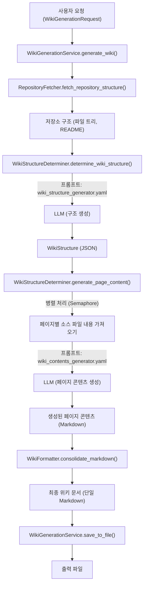

## 4. 결론

Wiki As Readme의 핵심 기능은 유연성, 자동화, 그리고 고품질 문서 생성에 초점을 맞추고 있습니다. 모델, 플랫폼, 배포 환경에 대한 광범위한 호환성을 제공하며, 심층적인 코드 분석과 LLM 기반의 지능적인 콘텐츠 생성을 통해 개발자가 최소한의 노력으로 포괄적이고 정확한 기술 문서를 얻을 수 있도록 지원합니다. 이러한 기능들은 프로젝트의 문서화 부담을 줄이고 개발 생산성을 향상시키는 데 기여합니다.

---

<a name="github-액션으로-사용하기"></a>

<details>
<summary>Relevant source files</summary>

The following files were used as context for generating this wiki page:

- [action.yml](action.yml)
- [.github/workflows/WIKI-AS-README-AS-ACTION.yml](.github/workflows/WIKI-AS-README-AS-ACTION.yml)
- [src/action_entrypoint.py](src/action_entrypoint.py)
</details>

# GitHub 액션으로 사용하기

## 소개

`Wiki-As-Readme`는 코드베이스를 기반으로 포괄적인 `README.md` 또는 위키 문서를 LLM(대규모 언어 모델)을 사용하여 자동으로 생성하는 GitHub 액션입니다. 이 문서는 `Wiki-As-Readme` 액션을 GitHub 워크플로우에 통합하여 사용하는 방법에 대해 설명합니다. 이 액션을 사용하면 저장소의 문서화를 자동화하여 항상 최신 상태를 유지할 수 있습니다.

이 액션은 Docker 컨테이너로 실행되며, 다양한 LLM 제공업체(Google, OpenAI, Anthropic 등)를 지원하고, 생성된 콘텐츠의 언어, 출력 파일명, LLM 모델 및 고급 설정 등을 유연하게 구성할 수 있습니다.

## 액션 개요

`Wiki-As-Readme` GitHub 액션은 `action.yml` 파일에 정의되어 있으며, 액션의 이름, 설명, 아이콘, 그리고 사용자가 설정할 수 있는 입력(inputs) 및 실행 환경을 명시합니다.

### 액션 메타데이터

*   **이름**: `Wiki-As-Readme`
*   **설명**: LLM을 사용하여 코드베이스에서 포괄적인 README.md/Wiki를 생성합니다.
*   **작성자**: catuscio
*   **브랜딩**: `book-open` 아이콘, 파란색
Sources: [action.yml](name, description, author, branding)

### 입력 (Inputs)

액션은 다양한 설정을 위한 입력을 제공합니다. 이 입력들은 워크플로우 파일에서 `with:` 키워드를 통해 전달되거나, 환경 변수로 설정될 수 있습니다.

| 입력 이름 | 설명 | 필수 여부 | 기본값 |
|---|---|---|---|
| `language` | 생성될 콘텐츠의 언어 (예: `ko`, `en`) | `false` | `ko` |
| `output_file` | 생성된 콘텐츠를 저장할 파일명 | `false` | `WIKI.md` |
| `llm_provider` | LLM 제공업체 (`google`, `openai`, `anthropic`, `openrouter`, `xai`, `ollama`) | `false` | `google` |
| `model_name` | 사용할 특정 모델 이름 | `false` | `gemini-2.5-flash` |
| `openai_api_key` | OpenAI API 키 | `false` | |
| `anthropic_api_key` | Anthropic API 키 | `false` | |
| `openrouter_api_key` | OpenRouter API 키 | `false` | |
| `xai_api_key` | xAI API 키 | `false` | |
| `git_api_token` | 비공개 저장소 접근을 위한 GitHub/GitLab API 토큰 | `false` | |
| `gcp_project_name` | GCP 프로젝트 이름 (Google Cloud 사용 시) | `false` | |
| `gcp_model_location` | GCP 모델 위치 (Google Cloud 사용 시) | `false` | |
| `google_application_credentials` | GCP 서비스 계정 JSON 키 (내용 또는 경로) | `false` | |
| `llm_base_url` | LLM API를 위한 사용자 정의 기본 URL | `false` | |
| `use_structured_output` | 구조화된 JSON 출력 사용 여부 | `false` | `true` |
| `temperature` | LLM 온도 (0.0 ~ 1.0) | `false` | `0.0` |
| `max_retries` | 최대 재시도 횟수 | `false` | `3` |
| `max_concurrency` | 최대 병렬 LLM 호출 수 | `false` | `5` |
| `ignored_patterns` | 무시할 glob 패턴의 JSON 배열 | `false` | `[]` |
Sources: [action.yml](inputs section)

### 실행 환경

액션은 Docker 컨테이너 내에서 실행됩니다. `action.yml`은 `Dockerfile.action` 이미지를 사용하도록 구성되어 있으며, 모든 입력 값은 컨테이너 내부의 환경 변수로 매핑됩니다.
Sources: [action.yml](runs section)

## 워크플로우 설정 예시

`Wiki-As-Readme` 액션을 GitHub 워크플로우에 통합하는 방법은 `.github/workflows/WIKI-AS-README-AS-ACTION.yml` 파일에 잘 설명되어 있습니다. 이 예시는 `main` 브랜치에 푸시되거나 수동으로 트리거될 때 위키 콘텐츠를 생성하고 커밋하는 방법을 보여줍니다.

### 워크플로우 트리거

워크플로우는 다음 조건에서 실행됩니다:
*   `main` 브랜치에 푸시될 때, 단 `README.md`, `WIKI.md`, 또는 워크플로우 파일 자체의 변경은 무시합니다.
*   `workflow_dispatch` 이벤트를 통해 수동으로 실행될 때.
Sources: [.github/workflows/WIKI-AS-README-AS-ACTION.yml](on section)

### `generate-and-commit` 작업

이 작업은 `ubuntu-latest` 환경에서 실행되며, 저장소 콘텐츠에 대한 쓰기 권한이 필요합니다.

```yaml
name: Update Wiki README

on:
  push:
    branches:
      - main
    paths-ignore:
      - 'README.md'
      - 'WIKI.md'
      - '.github/workflows/WIKI-AS-README-AS-ACTION.yml'
  workflow_dispatch:

jobs:
  generate-and-commit:
    runs-on: ubuntu-latest
    permissions:
      contents: write

    env:
      OUTPUT_FILE: "examples/wiki_as_README.md" # 생성될 파일 경로 설정

    steps:
      - name: Checkout code
        uses: actions/checkout@v4

      # -----------------------------------------------------------------------
      # [선택 사항] GCP 자격 증명 설정
      # Google Cloud (Vertex AI)를 사용하지 않는 경우 이 단계를 제거하거나 주석 처리하세요.
      # -----------------------------------------------------------------------
      - name: Create GCP Credentials File
        env:
          GCP_KEY: ${{ secrets.GOOGLE_APPLICATION_CREDENTIALS }}
        run: |
          echo "$GCP_KEY" > ./gcp-key.json

      # 1. Wiki 콘텐츠 생성
      - name: Generate Wiki Content
        uses: docker://ghcr.io/catuscio/wiki-as-readme-action:latest
        env:
          # --- 기본 설정 ---
          LANGUAGE: "ko"
          OUTPUT_FILE: ${{ env.OUTPUT_FILE }}
          
          # --- LLM 제공업체 및 모델 설정 ---
          LLM_PROVIDER: "google"   # 옵션: google, openai, anthropic 등
          MODEL_NAME: "gemini-2.5-flash"
          
          # --- API 키 설정 ---
          
          # [GCP / Vertex AI]
          # LLM_PROVIDER가 "google"인 경우에만 필요합니다.
          # 다른 제공업체(OpenAI, Anthropic 등)를 사용하는 경우 주석 처리하세요.
          GCP_PROJECT_NAME: ${{ secrets.GCP_PROJECT_NAME }}
          GCP_MODEL_LOCATION: ${{ secrets.GCP_MODEL_LOCATION }}
          GOOGLE_APPLICATION_CREDENTIALS: /github/workspace/gcp-key.json
          
          # [다른 제공업체]
          # 선택한 제공업체에 대한 API 키를 주석 해제하고 설정하세요.
          # OPENAI_API_KEY: ${{ secrets.OPENAI_API_KEY }}
          # ANTHROPIC_API_KEY: ${{ secrets.ANTHROPIC_API_KEY }}
          
          # --- GitHub 토큰 ---
          GIT_API_TOKEN: ${{ secrets.GITHUB_TOKEN }}

      # -----------------------------------------------------------------------
      # [선택 사항] GCP 자격 증명 정리
      # Google Cloud를 사용하지 않는 경우 이 단계를 제거하거나 주석 처리하세요.
      # -----------------------------------------------------------------------
      - name: Remove GCP Credentials File
        if: always()
        run: rm -f ./gcp-key.json

      # 2. 변경 사항 커밋 및 푸시
      - name: Commit and Push changes
        uses: stefanzweifel/git-auto-commit-action@v5
        with:
          commit_message: "docs: ✨Update ${{ env.OUTPUT_FILE }} via Wiki-As-Readme Action"
          file_pattern: ${{ env.OUTPUT_FILE }}
```
Sources: [.github/workflows/WIKI-AS-README-AS-ACTION.yml](entire file)

### 주요 단계 설명

1.  **코드 체크아웃 (`Checkout code`)**: 저장소 코드를 워크플로우 러너로 가져옵니다.
2.  **GCP 자격 증명 설정 (`Create GCP Credentials File`)**: Google Cloud (Vertex AI)를 LLM 제공업체로 사용하는 경우, `GOOGLE_APPLICATION_CREDENTIALS` 비밀 값을 파일로 저장합니다. 이 파일은 액션 실행 시 사용됩니다.
3.  **Wiki 콘텐츠 생성 (`Generate Wiki Content`)**: `wiki-as-readme-action`을 실행하는 핵심 단계입니다.
    *   `uses: docker://ghcr.io/catuscio/wiki-as-readme-action:latest`를 사용하여 최신 Docker 이미지를 직접 참조합니다.
    *   `env:` 섹션에서 `LANGUAGE`, `OUTPUT_FILE`, `LLM_PROVIDER`, `MODEL_NAME`, API 키(예: `GCP_PROJECT_NAME`, `GCP_MODEL_LOCATION`, `GOOGLE_APPLICATION_CREDENTIALS` 또는 `OPENAI_API_KEY`), `GIT_API_TOKEN` 등을 설정합니다.
    *   `GIT_API_TOKEN`은 `secrets.GITHUB_TOKEN`을 사용하여 저장소에 대한 기본 권한을 부여하는 것이 일반적입니다.
4.  **GCP 자격 증명 정리 (`Remove GCP Credentials File`)**: 보안을 위해 생성된 GCP 자격 증명 파일을 워크플로우가 완료된 후 삭제합니다.
5.  **변경 사항 커밋 및 푸시 (`Commit and Push changes`)**: `stefanzweifel/git-auto-commit-action@v5` 액션을 사용하여 생성된 `OUTPUT_FILE`을 저장소에 자동으로 커밋하고 푸시합니다.

### 전체 워크플로우 흐름

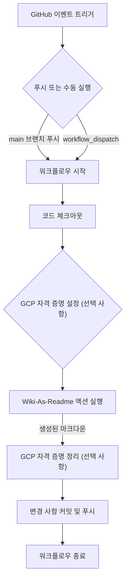

## 내부 동작

`src/action_entrypoint.py` 파일은 GitHub 액션이 실제로 실행될 때의 진입점입니다. 이 스크립트는 환경 변수에서 입력을 읽고, `WikiGenerationService`를 사용하여 위키 콘텐츠를 생성한 다음, 지정된 출력 파일에 저장합니다.

### 실행 흐름

1.  **입력 읽기**: 스크립트는 `os.getenv()`를 사용하여 `OUTPUT_FILE`, `LANGUAGE` 등 필요한 모든 설정을 환경 변수에서 읽어옵니다. 이 환경 변수들은 `action.yml`에 정의된 입력과 워크플로우 파일의 `env` 섹션에서 전달된 값들입니다.
2.  **요청 객체 생성**: `WikiGenerationRequest` 객체를 생성합니다. 이 객체는 `repo_type="local"`로 설정되어 액션이 로컬로 체크아웃된 코드베이스에서 작동함을 나타냅니다. `local_path`는 기본적으로 현재 디렉토리(`.`)로 설정됩니다.
3.  **서비스 초기화 및 생성**: `WikiGenerationService`를 초기화하고 `generate_wiki()` 메서드를 호출하여 실제 위키 콘텐츠 생성을 시작합니다.
4.  **출력 처리**: 생성된 마크다운 콘텐츠가 비어있지 않은지 확인합니다. 유효한 콘텐츠가 생성되면, 지정된 `output_file` 경로에 해당 내용을 작성합니다.
5.  **오류 처리**: 생성 과정이나 파일 쓰기 과정에서 오류가 발생하면, 로그를 기록하고 스크립트를 오류 상태로 종료합니다.
Sources: [src/action_entrypoint.py](main function)

### `action_entrypoint.py` 내부 로직 흐름

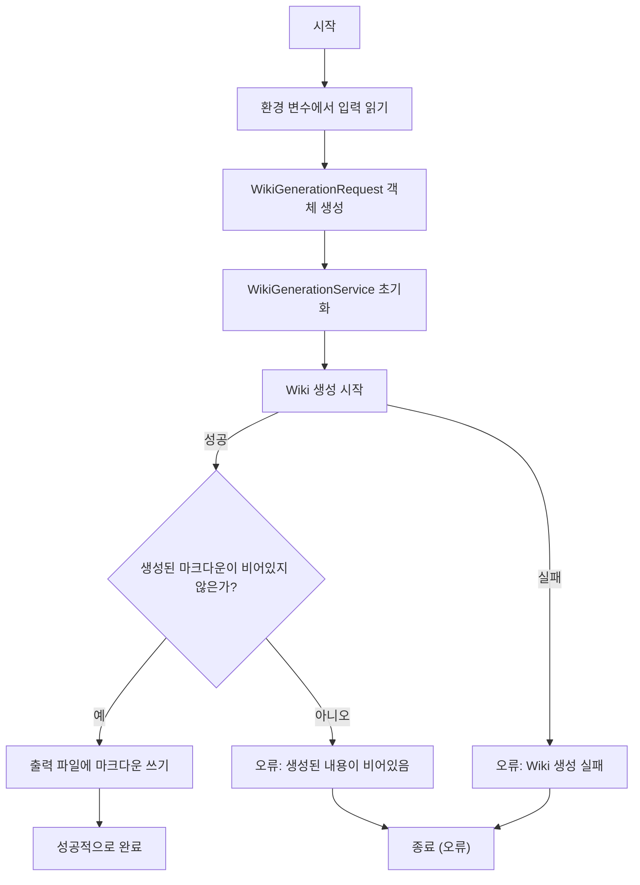

## 결론

`Wiki-As-Readme` GitHub 액션은 저장소 문서화 프로세스를 자동화하는 강력한 도구입니다. 이 액션을 워크플로우에 통합함으로써, 코드 변경 사항에 따라 `README.md` 또는 위키 페이지를 자동으로 업데이트하여 문서의 최신성을 유지하고 개발자의 수동 작업을 줄일 수 있습니다. 유연한 설정 옵션과 다양한 LLM 제공업체 지원을 통해 프로젝트의 특정 요구사항에 맞춰 문서 생성 프로세스를 최적화할 수 있습니다.

---

<a name="docker-compose로-로컬에서-실행"></a>

<details>
<summary>Relevant source files</summary>

The following files were used as context for generating this wiki page:

- [docker-compose.yml](docker-compose.yml)
- [Dockerfile.server](Dockerfile.server)
- [Dockerfile.action](Dockerfile.action)
- [.env example](.env example)
</details>

# Docker Compose로 로컬에서 실행

## 소개

이 문서는 `wiki-as-readme` 프로젝트를 Docker Compose를 사용하여 로컬 환경에서 실행하는 방법에 대해 설명합니다. Docker Compose는 다중 컨테이너 Docker 애플리케이션을 정의하고 실행하기 위한 도구로, 단일 명령으로 전체 개발 환경을 쉽게 설정하고 관리할 수 있게 해줍니다. 이를 통해 개발자는 복잡한 설정 없이 `wiki-as-readme`의 API 서버와 잠재적인 UI(Streamlit)를 로컬에서 빠르게 구동하고 테스트할 수 있습니다.

제공된 `docker-compose.yml` 파일은 `wiki-as-readme` 서비스를 정의하며, 이는 `Dockerfile.server`를 기반으로 빌드된 Docker 이미지와 `.env` 파일의 환경 변수를 활용합니다.

## Docker Compose 구성 (`docker-compose.yml`)

`docker-compose.yml` 파일은 `wiki-as-readme` 서비스를 로컬에서 실행하기 위한 모든 설정을 포함하고 있습니다.

```yaml
services:
  wiki-as-readme:
    build: .
    container_name: wiki-as-readme
    ports:
      - "8000:8000" # API
      - "8501:8501" # Streamlit UI
    env_file:
      - .env
    volumes:
      - ./output:/app/output
    restart: always
```
Sources: [docker-compose.yml](docker-compose.yml)

### 서비스 정의

*   **`wiki-as-readme`**: 이 프로젝트의 핵심 서비스입니다.
    *   **`build: .`**: 현재 디렉토리(`docker-compose.yml`이 위치한 곳)에서 `Dockerfile`을 찾아 이미지를 빌드하도록 지시합니다. 제공된 파일 중 `Dockerfile.server`가 서버 애플리케이션을 위한 Dockerfile이므로, 로컬 실행을 위해서는 이 파일을 `Dockerfile`로 사용하거나 `dockerfile: Dockerfile.server`와 같이 명시적으로 지정해야 할 수 있습니다.
    *   **`container_name: wiki-as-readme`**: 생성될 컨테이너의 이름을 `wiki-as-readme`로 지정하여 쉽게 식별할 수 있도록 합니다.
    *   **`ports`**:
        *   `"8000:8000"`: 컨테이너 내부의 8000번 포트(API 서버)를 호스트 머신의 8000번 포트에 매핑합니다.
        *   `"8501:8501"`: 컨테이너 내부의 8501번 포트(Streamlit UI)를 호스트 머신의 8501번 포트에 매핑합니다.
    *   **`env_file: - .env`**: `.env` 파일에 정의된 환경 변수들을 컨테이너 내부로 로드합니다. 이는 LLM 설정, API 키 등 민감하거나 환경별로 다른 설정을 관리하는 데 사용됩니다.
    *   **`volumes: - ./output:/app/output`**: 호스트 머신의 `./output` 디렉토리를 컨테이너 내부의 `/app/output` 디렉토리에 마운트합니다. 이는 생성된 위키 문서나 기타 출력 파일을 로컬에 지속적으로 저장하는 데 사용됩니다.
    *   **`restart: always`**: 컨테이너가 종료되거나 Docker 데몬이 재시작될 때 항상 컨테이너를 다시 시작하도록 설정합니다.

## 서버 이미지 빌드 상세 (`Dockerfile.server`)

`wiki-as-readme` 서비스는 `Dockerfile.server`를 기반으로 Docker 이미지를 빌드합니다. 이 Dockerfile은 멀티 스테이지 빌드(multi-stage build)를 사용하여 최종 이미지의 크기를 최적화하고 빌드 프로세스를 효율적으로 만듭니다.

```dockerfile
# Stage 1: Builder
FROM python:3.12-slim-bookworm AS builder
COPY --from=ghcr.io/astral-sh/uv:latest /uv /bin/uv
WORKDIR /app
ENV UV_COMPILE_BYTECODE=1
ENV UV_LINK_MODE=copy
COPY pyproject.toml uv.lock ./
RUN uv sync --frozen --no-dev --no-install-project --extra api

# Stage 2: Final Image
FROM python:3.12-slim-bookworm
LABEL maintainer="catuscio <catuscio@hotmail.com>"
# ... (생략) ...
RUN useradd -m -u 1000 appuser
WORKDIR /app
COPY --from=builder /app/.venv /app/.venv
COPY src ./src
RUN chown -R appuser:appuser /app
ENV PATH="/app/.venv/bin:$PATH"
ENV PYTHONPATH="/app"
EXPOSE 8000
USER appuser
CMD ["gunicorn", "-k", "uvicorn.workers.UvicornWorker", \
     "--bind", "0.0.0.0:8000", \
     "--workers", "2", \
     "--access-logfile", "-", \
     "--error-logfile", "-", \
     "src.server:app"]
```
Sources: [Dockerfile.server](Dockerfile.server)

### 빌더 스테이지 (Stage 1: Builder)

*   **`FROM python:3.12-slim-bookworm AS builder`**: Python 3.12 슬림 버전을 기반으로 `builder`라는 이름의 스테이지를 시작합니다.
*   **`COPY --from=ghcr.io/astral-sh/uv:latest /uv /bin/uv`**: `uv` 패키지 관리 도구를 설치합니다.
*   **`WORKDIR /app`**: 작업 디렉토리를 `/app`으로 설정합니다.
*   **`ENV UV_COMPILE_BYTECODE=1`**, **`ENV UV_LINK_MODE=copy`**: `uv`의 성능 최적화 설정을 적용합니다.
*   **`COPY pyproject.toml uv.lock ./`**: 프로젝트의 의존성 정의 파일들을 복사합니다.
*   **`RUN uv sync --frozen --no-dev --no-install-project --extra api`**: `uv`를 사용하여 `api` 그룹에 필요한 의존성만 설치하고 가상 환경(`.venv`)을 구성합니다.

### 최종 이미지 스테이지 (Stage 2: Final Image)

*   **`FROM python:3.12-slim-bookworm`**: 최종 이미지는 다시 Python 3.12 슬림 버전을 기반으로 시작하여 빌더 스테이지의 불필요한 빌드 도구들을 포함하지 않도록 합니다.
*   **`LABEL`**: 이미지에 대한 메타데이터(유지보수자, 설명, 라이선스 등)를 정의합니다.
*   **`RUN useradd -m -u 1000 appuser`**: 보안 강화를 위해 `appuser`라는 비루트 사용자를 생성합니다.
*   **`COPY --from=builder /app/.venv /app/.venv`**: 빌더 스테이지에서 생성된 가상 환경(`.venv`)을 최종 이미지로 복사합니다.
*   **`COPY src ./src`**: 애플리케이션 소스 코드를 복사합니다.
*   **`RUN chown -R appuser:appuser /app`**: `/app` 디렉토리의 소유권을 `appuser`로 변경합니다.
*   **`ENV PATH="/app/.venv/bin:$PATH"`**, **`ENV PYTHONPATH="/app"`**: 가상 환경의 실행 파일 경로와 프로젝트 소스 코드 경로를 환경 변수에 추가합니다.
*   **`EXPOSE 8000`**: 컨테이너가 8000번 포트를 노출함을 선언합니다.
*   **`USER appuser`**: 이후 명령어를 `appuser` 권한으로 실행하도록 설정합니다.
*   **`CMD [...]`**: 컨테이너가 시작될 때 실행될 기본 명령어로, `gunicorn`을 사용하여 `src.server:app`에 정의된 FastAPI 애플리케이션을 구동합니다. `uvicorn.workers.UvicornWorker`를 워커로 사용하며, 0.0.0.0:8000으로 바인딩하고 2개의 워커를 사용합니다.

## 환경 설정 (`.env` 파일)

`.env` 파일은 `wiki-as-readme` 서비스의 동작을 제어하는 다양한 환경 변수를 정의합니다. `docker-compose.yml`은 이 파일을 읽어 컨테이너에 환경 변수를 주입합니다.

```ini
# --- LLM Provider Settings ---
LLM_PROVIDER=google
MODEL_NAME=gemini-2.0-flash-exp

# --- LLM API Keys ---
OPENAI_API_KEY=
ANTHROPIC_API_KEY=
# ... (생략) ...

# --- LLM Configuration ---
# LLM_BASE_URL=http://localhost:11434/v1
USE_STRUCTURED_OUTPUT=true
temperature=0.0
max_retries=3
max_concurrency=5

# --- File Filtering Settings ---
# IGNORED_PATTERNS='["uv.lock", "package-lock.json", ...]'

# --- Repository Access Settings ---
GIT_API_TOKEN=

# --- Localization Settings ---
language=en

# --- Google Cloud Platform Settings (Only for Google Vertex AI) ---
GCP_PROJECT_NAME=
GCP_MODEL_LOCATION=
```
Sources: [.env example](.env example)

주요 환경 변수들은 다음과 같습니다:

| 변수명 | 설명 | 예시 |
|---|---|---|
| `LLM_PROVIDER` | 사용할 LLM(Large Language Model) 제공자 (예: `google`, `openai`, `anthropic`, `ollama`) | `google` |
| `MODEL_NAME` | 사용할 특정 LLM 모델의 식별자 | `gemini-2.0-flash-exp` |
| `OPENAI_API_KEY` | OpenAI API를 사용할 경우 필요한 API 키 | `sk-xxxxxxxxxxxxxxxxxxxx` |
| `LLM_BASE_URL` | LLM API의 커스텀 베이스 URL (예: Ollama 또는 프록시 사용 시) | `http://localhost:11434/v1` |
| `USE_STRUCTURED_OUTPUT` | LLM이 구조화된 JSON 출력을 사용하도록 할지 여부 | `true` |
| `temperature` | LLM 응답의 무작위성 제어 (0.0은 결정적, 1.0은 창의적) | `0.0` |
| `IGNORED_PATTERNS` | LLM 컨텍스트에서 제외할 파일 및 디렉토리의 glob 패턴 목록 (JSON 배열 문자열) | `["*.lock", ".git", "node_modules"]` |
| `GIT_API_TOKEN` | 비공개 저장소 접근 또는 높은 API 요청 제한을 위한 GitHub/GitLab 개인 액세스 토큰 | `ghp_xxxxxxxxxxxxxxxxxxxx` |
| `language` | 생성될 위키의 대상 언어 (예: `ko`, `en`, `ja`) | `en` |

로컬에서 실행하기 전에 `.env` 파일을 프로젝트 루트에 생성하고 필요한 값으로 채워야 합니다.

## 로컬 실행 아키텍처

다음 다이어그램은 Docker Compose를 사용하여 `wiki-as-readme`를 로컬에서 실행하는 전체적인 흐름을 보여줍니다.

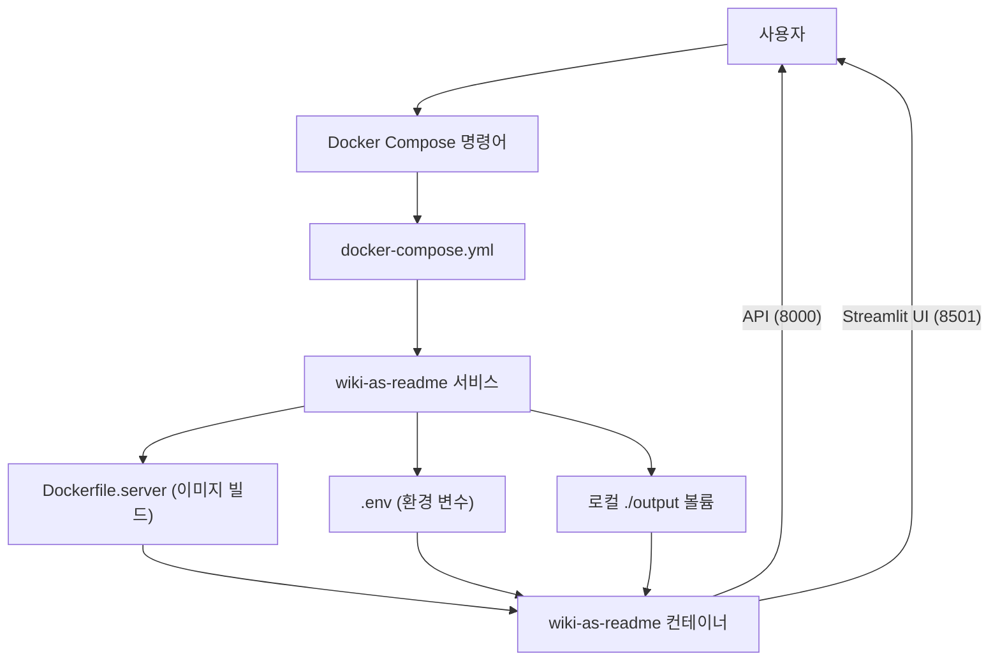

## 로컬 실행 방법

1.  **Docker 및 Docker Compose 설치**: 시스템에 Docker Desktop 또는 Docker Engine과 Docker Compose가 설치되어 있는지 확인합니다.
2.  **`.env` 파일 생성**: 프로젝트 루트 디렉토리에 `.env` 파일을 생성하고, `.env example` 파일을 참조하여 필요한 환경 변수(특히 `LLM_PROVIDER`, `MODEL_NAME`, API 키 등)를 설정합니다.
3.  **서비스 실행**: 터미널을 열고 프로젝트 루트 디렉토리로 이동한 후 다음 명령어를 실행합니다:
    ```bash
    docker compose up -d
    ```
    *   `-d` 옵션은 컨테이너를 백그라운드에서 실행합니다.
    *   이 명령은 `docker-compose.yml`에 따라 `wiki-as-readme` 이미지를 빌드하고 컨테이너를 시작합니다.
4.  **서비스 확인**: 컨테이너가 정상적으로 실행 중인지 확인합니다:
    ```bash
    docker compose ps
    ```
5.  **접근**:
    *   API 서버는 `http://localhost:8000`에서 접근할 수 있습니다.
    *   Streamlit UI가 활성화된 경우 `http://localhost:8501`에서 접근할 수 있습니다.
6.  **서비스 중지**:
    ```bash
    docker compose down
    ```

## 결론

Docker Compose를 사용하면 `wiki-as-readme` 프로젝트를 로컬 환경에서 쉽고 일관되게 설정하고 실행할 수 있습니다. `docker-compose.yml`은 서비스의 모든 구성 요소를 정의하며, `Dockerfile.server`는 애플리케이션 서버를 위한 최적화된 Docker 이미지를 생성하고, `.env` 파일은 유연한 환경 설정을 제공합니다. 이 설정은 개발 및 테스트 과정에서 효율성을 크게 향상시킵니다.

---

<a name="로컬-개발-환경-설정"></a>

<details>
<summary>Relevant source files</summary>

The following files were used as context for generating this wiki page:

- [pyproject.toml](pyproject.toml)
- [src/server.py](src/server.py)
- [src/app.py](src/app.py)
- [.python-version](.python-version)
</details>

# 로컬 개발 환경 설정

이 문서는 `wiki-as-readme` 프로젝트의 로컬 개발 환경을 설정하고 실행하는 방법에 대해 설명합니다. 프로젝트는 FastAPI 기반의 백엔드 API 서버와 Streamlit 기반의 프론트엔드 UI로 구성되어 있으며, Python 3.12 버전을 사용합니다.

로컬 환경 설정은 Python 버전 확인, 필요한 의존성 설치, API 서버 실행, 그리고 Streamlit UI 실행 단계를 포함합니다. 또한, 코드 품질 유지를 위한 린팅 및 포매팅 도구 설정도 다룹니다.

## 1. 필수 요구사항

`wiki-as-readme` 프로젝트는 특정 Python 버전을 요구합니다.

### Python 버전

프로젝트는 Python 3.12 이상을 필요로 합니다.
Sources: [.python-version](3.12), [pyproject.toml](project.requires-python)

## 2. 의존성 설치

프로젝트의 모든 의존성은 `pyproject.toml` 파일에 정의되어 있습니다. 개발 환경 설정을 위해 기본 의존성, 선택적 의존성, 그리고 개발 의존성을 설치해야 합니다.

### 2.1. 기본 의존성

기본 의존성은 프로젝트의 핵심 기능을 위해 필요합니다. 여기에는 `google-auth`, `httpx`, `jinja2`, `litellm`, `loguru`, `pydantic`, `python-dotenv`, `pyyaml`, `requests` 등이 포함됩니다.
Sources: [pyproject.toml](project.dependencies)

### 2.2. 선택적 의존성

프로젝트는 특정 기능(UI 또는 API)을 위한 선택적 의존성을 제공합니다.

| 그룹 | 설명 | 포함된 라이브러리 |
|---|---|---|
| `ui` | Streamlit 기반 UI 실행에 필요 | `streamlit`, `streamlit-mermaid` |
| `api` | FastAPI 기반 API 서버 실행에 필요 | `fastapi`, `uvicorn`, `gunicorn` |
| `all` | `ui`와 `api` 그룹의 모든 의존성 포함 | `wiki-as-readme[ui,api]` |

Sources: [pyproject.toml](project.optional-dependencies)

### 2.3. 개발 의존성

개발 의존성은 코드 품질 유지 및 개발 편의성을 위한 도구들을 포함합니다. 현재 `ruff`가 포함되어 있습니다.
Sources: [pyproject.toml](dependency-groups.dev)

### 2.4. 설치 방법

프로젝트 루트 디렉토리에서 다음 명령어를 사용하여 모든 의존성을 설치할 수 있습니다.

```bash
pip install -e ".[all,dev]"
```

이 명령어는 프로젝트를 편집 가능한 모드(`-e`)로 설치하고, `all` (UI 및 API 관련) 및 `dev` (개발 도구) 선택적 의존성을 모두 포함합니다.

## 3. API 서버 설정 및 실행

FastAPI 기반의 API 서버는 `src/server.py` 파일에 정의되어 있습니다. 이 서버는 `uvicorn`을 사용하여 실행됩니다.

### 3.1. 서버 실행

API 서버를 로컬에서 실행하려면 `src/server.py` 파일을 직접 실행합니다.

```bash
python src/server.py
```

서버는 기본적으로 `http://127.0.0.1:8000`에서 실행되며, 코드 변경 시 자동으로 재로드(`reload=True`)됩니다.
Sources: [src/server.py](if __name__ == "__main__":)

### 3.2. 서버 구성

*   **호스트**: 기본적으로 `127.0.0.1` (localhost)에 바인딩됩니다. 외부에서 접근 가능하도록 하려면 `host="0.0.0.0"`으로 설정해야 합니다.
*   **포트**: 기본 포트는 `8000`입니다.
Sources: [src/server.py](uvicorn.run)

## 4. Streamlit UI 설정 및 실행

Streamlit 기반의 사용자 인터페이스는 `src/app.py` 파일에 정의되어 있습니다. 이 UI는 백엔드 API 서버와 통신하여 위키 생성 작업을 수행합니다.

### 4.1. API 서버 연결 설정

Streamlit UI는 `API_BASE_URL` 환경 변수를 통해 백엔드 API 서버의 주소를 설정합니다. 이 변수가 설정되지 않으면 기본값인 `http://localhost:8000/api/v1`을 사용합니다.

```python
API_BASE_URL = os.getenv("API_BASE_URL", "http://localhost:8000/api/v1")
```
Sources: [src/app.py](API_BASE_URL)

로컬 개발 환경에서는 API 서버가 `http://localhost:8000`에서 실행되므로, 별도의 환경 변수 설정 없이 기본값을 사용할 수 있습니다.

### 4.2. UI 실행

Streamlit UI를 실행하려면 다음 명령어를 사용합니다.

```bash
streamlit run src/app.py
```

이 명령어를 실행하면 웹 브라우저에서 Streamlit 애플리케이션이 열립니다.

### 4.3. Streamlit UI와 API 서버 간의 상호작용

Streamlit UI는 비동기 HTTP 클라이언트(`httpx`)를 사용하여 API 서버와 통신합니다. 위키 생성 요청 및 상태 폴링 과정은 다음과 같습니다.

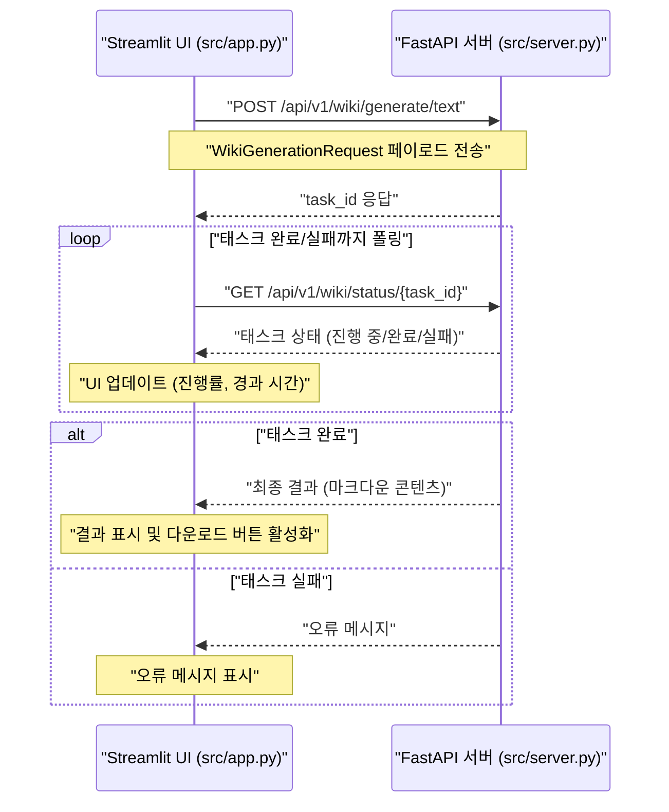
Sources: [src/app.py](start_generation_task), [src/app.py](poll_task_status)

## 5. 코드 품질 도구 (Ruff)

프로젝트는 코드 스타일 일관성과 품질 유지를 위해 `Ruff`를 린터 및 포매터로 사용합니다. `pyproject.toml` 파일에 `Ruff` 설정이 정의되어 있습니다.

### 5.1. Ruff 설정

| 설정 항목 | 설명 | 값 |
|---|---|---|
| `line-length` | 코드 라인 최대 길이 | `88` |
| `target-version` | 대상 Python 버전 | `py312` |
| `select` | 활성화할 린트 규칙 | `F`, `W`, `E`, `I`, `UP`, `C4`, `FA`, `ISC`, `ICN`, `RET`, `SIM`, `TID`, `TC`, `TD`, `NPY` |
| `ignore` | 무시할 린트 규칙 | `E501` (라인 길이 초과) |
| `fixable` | 자동으로 수정 가능한 규칙 | `ALL` |
| `quote-style` | 문자열 따옴표 스타일 | `double` (쌍따옴표) |
| `indent-style` | 들여쓰기 스타일 | `space` (공백) |

Sources: [pyproject.toml](tool.ruff)

### 5.2. 사용 방법

`Ruff`는 개발 의존성으로 설치되므로, 프로젝트 루트에서 다음 명령어를 사용하여 코드를 검사하고 포매팅할 수 있습니다.

```bash
ruff check .
ruff format .
```

## 결론

이 가이드를 통해 `wiki-as-readme` 프로젝트의 로컬 개발 환경을 성공적으로 설정하고 실행할 수 있습니다. Python 3.12 환경을 준비하고, `pyproject.toml`에 정의된 의존성을 설치한 후, FastAPI 서버와 Streamlit UI를 각각 실행하면 됩니다. `Ruff`를 활용하여 코드 품질을 유지하는 것도 중요합니다.

---

<a name="서버-및-웹훅-배포"></a>

<details>
<summary>Relevant source files</summary>

The following files were used as context for generating this wiki page:

- [src/server.py](src/server.py)
- [src/api/v1/endpoints/webhook.py](src/api/v1/endpoints/webhook.py)
- [src/api/v1/endpoints/wiki.py](src/api/v1/endpoints/wiki.py)
- [Dockerfile.server](Dockerfile.server)
</details>

# 서버 및 웹훅 배포

이 문서는 `Wiki as Readme` 프로젝트의 서버 아키텍처, 웹훅 통합 및 배포 전략에 대해 설명합니다. 이 시스템은 코드베이스를 포괄적인 위키로 변환하고, GitHub 푸시 이벤트에 반응하여 자동으로 README 파일을 업데이트하는 기능을 제공합니다. FastAPI 프레임워크를 기반으로 구축되었으며, Docker를 통해 컨테이너화되어 배포됩니다.

## 1. 소개

`Wiki as Readme` 서버는 두 가지 주요 기능을 제공합니다: 위키 생성 API와 GitHub 웹훅 통합입니다. 위키 생성 API는 코드 저장소의 내용을 분석하여 마크다운 형식의 위키 문서를 생성하며, 웹훅 통합은 GitHub 저장소에 푸시 이벤트가 발생할 때 이 위키 생성 프로세스를 자동으로 트리거하고 생성된 위키를 저장소의 `WIKI.md` 파일로 커밋합니다. 이 문서는 이러한 기능들이 어떻게 구현되고 배포되는지 상세히 다룹니다.

## 2. 서버 아키텍처

서버는 FastAPI를 사용하여 구축되었으며, `src/server.py` 파일이 애플리케이션의 진입점 역할을 합니다.

### 2.1. FastAPI 애플리케이션 구조

`src/server.py`는 FastAPI 애플리케이션 인스턴스를 생성하고, API 라우터를 포함하며, 서버를 시작하는 역할을 합니다.

*   **애플리케이션 초기화**: `FastAPI` 인스턴스를 생성하며, 애플리케이션의 제목, 설명, 버전을 정의합니다.
*   **헬스 체크 엔드포인트**: `/` 경로에 간단한 헬스 체크 엔드포인트(`health_check`)를 제공하여 서버의 상태를 확인할 수 있습니다.
*   **API 라우터 포함**:
    *   `src.api.v1.endpoints.wiki` 모듈의 라우터를 `/api/v1/wiki` 경로에 포함하여 위키 생성 관련 엔드포인트를 제공합니다.
    *   `src.api.v1.endpoints.webhook` 모듈의 라우터를 `/api/v1/webhook` 경로에 포함하여 웹훅 통합 관련 엔드포인트를 제공합니다.
*   **서버 실행**: `if __name__ == "__main__":` 블록 내에서 `uvicorn`을 사용하여 개발 모드 서버를 시작합니다.

Sources: [src/server.py](src/server.py)

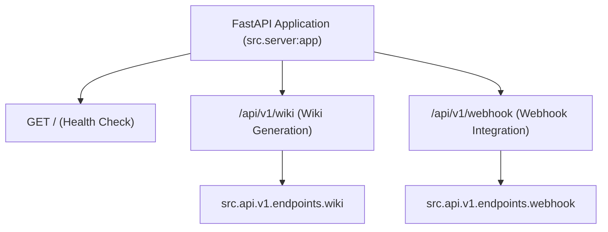

## 3. 웹훅 통합

`src/api/v1/endpoints/webhook.py` 파일은 GitHub 웹훅 이벤트를 수신하고 처리하는 로직을 담당합니다.

### 3.1. GitHub 웹훅 처리 흐름

GitHub 저장소에 푸시 이벤트가 발생하면, 설정된 웹훅 URL로 페이로드가 전송됩니다. 서버는 이 이벤트를 수신하여 다음 단계를 수행합니다.

1.  **서명 검증**: `verify_signature` 함수를 통해 GitHub에서 전송된 요청의 유효성을 HMAC SHA256 방식으로 검증합니다. 이는 요청이 GitHub에서 온 것임을 보장하고 무단 접근을 방지합니다.
2.  **봇 커밋 및 브랜치 필터링**: 무한 루프를 방지하기 위해 `Wiki-As-Readme-Bot`이 생성한 커밋이나 `main` 브랜치 외의 푸시 이벤트는 무시합니다.
3.  **백그라운드 작업 시작**: `process_full_cycle` 함수를 백그라운드 태스크로 등록하여 위키 생성 및 GitHub 업데이트 작업을 비동기적으로 처리합니다.

Sources: [src/api/v1/endpoints/webhook.py](src/api/v1/endpoints/webhook.py)

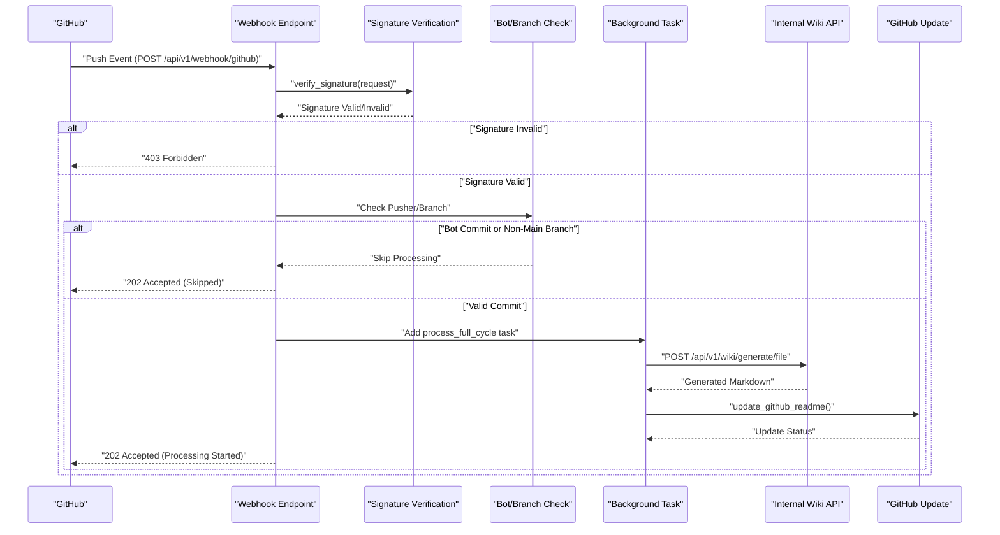

### 3.2. 주요 함수

*   `verify_signature(request: Request)`:
    *   `X-Hub-Signature-256` 헤더와 `GITHUB_WEBHOOK_SECRET` 환경 변수를 사용하여 요청 본문의 HMAC 서명을 검증합니다.
    *   Sources: [src/api/v1/endpoints/webhook.py](verify_signature function)
*   `update_github_readme(repo_owner: str, repo_name: str, content: str)`:
    *   생성된 마크다운 콘텐츠를 GitHub 저장소의 `WIKI.md` 파일로 커밋합니다.
    *   `GITHUB_ACCESS_TOKEN` (개인 액세스 토큰)을 사용하여 GitHub API에 인증합니다.
    *   기존 파일의 SHA를 가져와 파일을 덮어쓰거나, 파일이 없으면 새로 생성합니다.
    *   Sources: [src/api/v1/endpoints/webhook.py](update_github_readme function)
*   `process_full_cycle(generate_url: str, request_data_json: str, repo_owner: str, repo_name: str)`:
    *   위키 생성 API를 호출하고, 그 결과를 받아 GitHub에 업데이트하는 전체 프로세스를 관리합니다.
    *   Sources: [src/api/v1/endpoints/webhook.py](process_full_cycle function)
*   `github_webhook(payload: GitHubPushPayload, request: Request, background_tasks: BackgroundTasks)`:
    *   `/github` 경로의 POST 요청을 처리하는 메인 엔드포인트입니다.
    *   서명 검증, 필터링 로직을 수행한 후 `process_full_cycle`을 백그라운드 태스크로 추가합니다.
    *   Sources: [src/api/v1/endpoints/webhook.py](github_webhook function)

### 3.3. 환경 변수

웹훅 기능의 정상적인 작동을 위해 다음 환경 변수가 필요합니다.

| 환경 변수 | 설명 |
|---|---|
| `GITHUB_WEBHOOK_SECRET` | GitHub 웹훅 설정 시 사용되는 비밀 키. 요청 서명 검증에 사용됩니다. |
| `GITHUB_ACCESS_TOKEN` | GitHub API에 접근하여 `WIKI.md` 파일을 업데이트하는 데 사용되는 개인 액세스 토큰(PAT). |

## 4. 위키 생성 API

`src/api/v1/endpoints/wiki.py` 파일은 위키 생성 작업을 시작하고 그 상태를 조회하는 엔드포인트를 제공합니다.

### 4.1. 위키 생성 엔드포인트

| 엔드포인트 | HTTP 메서드 | 설명 |
|---|---|---|
| `/generate/file` | `POST` | 위키 생성을 트리거하고, 생성된 마크다운 파일을 서버의 `output/` 디렉토리에 저장합니다. 작업 ID를 반환하여 진행 상황을 추적할 수 있습니다. |
| `/generate/text` | `POST` | 위키 생성을 트리거하지만, 파일을 저장하지 않고 생성된 마크다운 텍스트를 작업 상태 조회 시 반환합니다. 작업 ID를 반환합니다. |
| `/status/{task_id}` | `GET` | 특정 `task_id`에 해당하는 위키 생성 작업의 현재 상태를 조회합니다. |

Sources: [src/api/v1/endpoints/wiki.py](src/api/v1/endpoints/wiki.py)

### 4.2. 주요 함수

*   `_init_wiki_generation(request: WikiGenerationRequest, initial_message: str)`:
    *   위키 생성 작업을 초기화하고, 태스크 ID와 `WikiGenerationService` 인스턴스를 준비하는 헬퍼 함수입니다.
    *   Sources: [src/api/v1/endpoints/wiki.py](_init_wiki_generation function)
*   `generate_wiki_file(request: WikiGenerationRequest, background_tasks: BackgroundTasks)`:
    *   위키 생성을 시작하고 결과를 파일로 저장하는 백그라운드 태스크를 추가합니다.
    *   Sources: [src/api/v1/endpoints/wiki.py](generate_wiki_file function)
*   `generate_wiki_text(request: WikiGenerationRequest, background_tasks: BackgroundTasks)`:
    *   위키 생성을 시작하고 결과를 텍스트로 반환하는 백그라운드 태스크를 추가합니다.
    *   Sources: [src/api/v1/endpoints/wiki.py](generate_wiki_text function)
*   `get_wiki_generation_status(task_id: str)`:
    *   주어진 `task_id`에 대한 작업 상태를 반환합니다.
    *   Sources: [src/api/v1/endpoints/wiki.py](get_wiki_generation_status function)

## 5. 배포

`Dockerfile.server`는 `Wiki as Readme` 서버 애플리케이션을 컨테이너화하고 배포하기 위한 지침을 제공합니다.

### 5.1. Dockerfile 구조

`Dockerfile.server`는 멀티 스테이지 빌드를 사용하여 최종 이미지의 크기를 최적화하고 빌드 프로세스를 효율적으로 만듭니다.

*   **Stage 1: Builder**
    *   `python:3.12-slim-bookworm` 이미지를 기반으로 합니다.
    *   `uv` 패키지 관리자를 사용하여 의존성을 설치합니다. `uv sync --frozen --no-dev --no-install-project --extra api` 명령을 통해 `pyproject.toml` 및 `uv.lock`에 정의된 프로덕션 의존성만 설치합니다.
    *   Sources: [Dockerfile.server](Stage 1: Builder)
*   **Stage 2: Final Image**
    *   `python:3.12-slim-bookworm` 이미지를 다시 사용합니다.
    *   빌더 스테이지에서 설치된 가상 환경(`/.venv`)을 복사합니다.
    *   애플리케이션 소스 코드(`src`)를 이미지에 복사합니다.
    *   `appuser`라는 비루트 사용자를 생성하고 해당 사용자로 애플리케이션을 실행하여 보안을 강화합니다.
    *   `PATH` 및 `PYTHONPATH` 환경 변수를 설정하여 가상 환경과 소스 코드를 올바르게 참조하도록 합니다.
    *   `8000` 포트를 노출합니다.
    *   **CMD**: `gunicorn`을 사용하여 프로덕션 환경에서 애플리케이션을 실행합니다. `uvicorn.workers.UvicornWorker`를 워커 클래스로 사용하며, `0.0.0.0:8000`에 바인딩하고 2개의 워커 프로세스를 사용하도록 설정합니다. 접근 및 에러 로그는 표준 출력/오류로 보냅니다.
    *   Sources: [Dockerfile.server](Stage 2: Final Image)

### 5.2. 프로덕션 실행 명령어

컨테이너가 시작될 때 실행되는 명령어는 다음과 같습니다:

```bash
gunicorn -k uvicorn.workers.UvicornWorker \
         --bind 0.0.0.0:8000 \
         --workers 2 \
         --access-logfile - \
         --error-logfile - \
         src.server:app
```

이 명령어는 `gunicorn`을 WSGI HTTP 서버로 사용하여 `src.server:app` FastAPI 애플리케이션을 실행합니다. `uvicorn.workers.UvicornWorker`를 사용하여 비동기 워커를 활용하며, `0.0.0.0:8000`에서 요청을 수신하고 2개의 워커 프로세스로 처리합니다.

Sources: [Dockerfile.server](CMD instruction)

## 6. 결론

`Wiki as Readme` 서버는 FastAPI를 기반으로 구축되어 위키 생성 및 GitHub 웹훅 통합 기능을 제공합니다. 모듈화된 아키텍처는 각 기능의 독립성을 보장하며, 백그라운드 태스크를 통해 비동기적인 처리를 수행합니다. Docker를 이용한 컨테이너화는 일관된 배포 환경을 제공하며, `gunicorn`을 통한 프로덕션 배포는 안정성과 성능을 확보합니다. 이 시스템은 개발자가 코드 변경 시 자동으로 문서가 업데이트되도록 하여 문서화 프로세스를 간소화하는 데 기여합니다.

---

<a name="아키텍처-개요"></a>

<details>
<summary>Relevant source files</summary>

The following files were used as context for generating this wiki page:

- [src/app.py](src/app.py)
- [src/server.py](src/server.py)
- [src/core/config.py](src/core/config.py)
- [src/agent/llm.py](src/agent/llm.py)
- [src/providers/base.py](src/providers/base.py)
</details>

# 아키텍처 개요

이 문서는 "Wiki As Readme" 프로젝트의 전반적인 아키텍처를 설명합니다. 이 프로젝트는 AI를 활용하여 코드 저장소의 포괄적인 문서를 생성하고, 이를 단일 README 파일 형태로 제공하는 것을 목표로 합니다. 시스템은 사용자 인터페이스, 백엔드 API, LLM(Large Language Model) 통합, 그리고 다양한 저장소 유형을 처리하는 모듈로 구성된 모듈식 접근 방식을 채택하고 있습니다.

주요 목표는 사용자가 저장소 URL 또는 로컬 경로를 제공하면, 시스템이 해당 저장소의 구조와 내용을 분석하고, LLM을 사용하여 상세한 위키 문서를 자동으로 생성하는 것입니다. 이 문서는 시스템의 주요 구성 요소, 이들 간의 상호작용, 그리고 핵심 데이터 흐름을 개괄적으로 설명합니다.

## 1. 전체 시스템 아키텍처

"Wiki As Readme" 시스템은 크게 두 가지 주요 구성 요소로 나뉩니다: 사용자 인터페이스를 제공하는 프론트엔드 애플리케이션과 모든 핵심 로직 및 API를 처리하는 백엔드 서버입니다. 이들은 비동기적으로 통신하며, 백엔드는 LLM 및 저장소 접근 로직과 상호작용합니다.

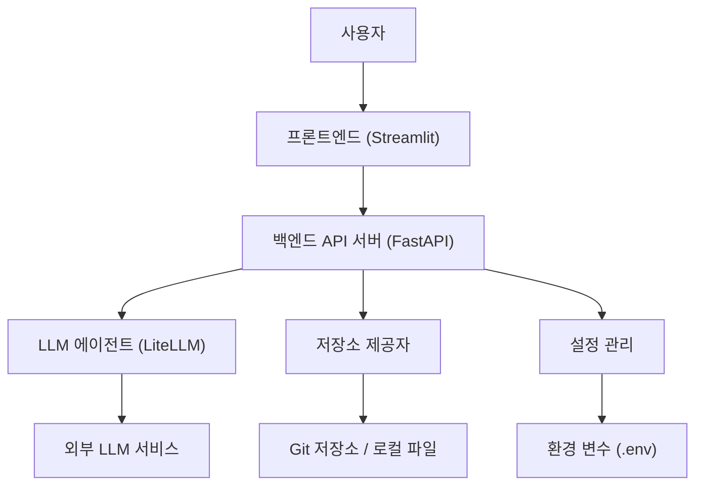

## 2. 프론트엔드 애플리케이션 (`src/app.py`)

프론트엔드 애플리케이션은 Streamlit을 기반으로 구축되어 사용자에게 직관적인 인터페이스를 제공합니다. 사용자는 여기서 저장소 정보와 위키 생성 설정을 입력하고, 생성 진행 상황을 확인하며, 최종 결과를 다운로드할 수 있습니다.

### 2.1. 주요 기능

*   **사용자 입력 처리**: 저장소 URL 또는 로컬 경로, 생성 언어, 포괄적 보기 설정 등을 입력받습니다.
*   **API 요청 시작**: 사용자가 "Generate Wiki" 버튼을 클릭하면 백엔드 API에 위키 생성 요청을 보냅니다.
*   **작업 상태 폴링**: 백엔드에서 반환된 `task_id`를 사용하여 주기적으로 작업 상태를 조회하고, 사용자에게 진행 상황을 업데이트합니다.
*   **결과 표시**: 위키 생성이 완료되면 Markdown 콘텐츠를 화면에 미리 보여주고 다운로드 옵션을 제공합니다. Mermaid 다이어그램은 별도로 렌더링합니다.

### 2.2. 핵심 컴포넌트

*   `render_sidebar()`: 사용자 입력을 위한 사이드바 UI를 렌더링하고, `WikiGenerationRequest` 객체를 구성합니다.
    *   Sources: [src/app.py](render_sidebar function)
*   `start_generation_task()`: 백엔드 API에 위키 생성 작업을 시작하도록 요청하고 `task_id`를 반환합니다.
    *   Sources: [src/app.py](start_generation_task function)
*   `poll_task_status()`: 백엔드 API를 주기적으로 호출하여 작업 상태를 확인하고, 완료 또는 실패 시 결과를 반환합니다.
    *   Sources: [src/app.py](poll_task_status function)
*   `render_main_content()`: 생성된 Markdown 콘텐츠를 표시하고, 다운로드 버튼 및 Mermaid 다이어그램 렌더링을 처리합니다.
    *   Sources: [src/app.py](render_main_content function)

## 3. 백엔드 API 서버 (`src/server.py`)

백엔드 API 서버는 FastAPI 프레임워크를 사용하여 구축되었으며, 시스템의 핵심 로직을 담당합니다. 프론트엔드로부터의 요청을 처리하고, LLM과의 통신을 조율하며, 저장소에서 데이터를 가져오는 역할을 수행합니다.

### 3.1. 주요 기능

*   **API 엔드포인트 제공**: 위키 생성 시작, 작업 상태 조회 등의 RESTful API 엔드포인트를 노출합니다.
*   **작업 오케스트레이션**: 위키 생성 요청을 받으면 비동기 작업을 시작하고, 그 진행 상황을 관리합니다.
*   **모듈 통합**: LLM 에이전트, 저장소 제공자, 설정 관리 모듈과 통합하여 전체 워크플로우를 실행합니다.

### 3.2. API 엔드포인트

| 경로 | HTTP 메서드 | 설명 | 태그 |
|---|---|---|---|
| `/` | `GET` | 서버 상태 확인 (Health Check) | Health Check |
| `/api/v1/wiki/generate/text` | `POST` | 위키 생성 작업을 시작합니다. | Wiki Generation |
| `/api/v1/wiki/status/{task_id}` | `GET` | 특정 작업 ID의 상태를 조회합니다. | Wiki Generation |
| `/api/v1/webhook` | `POST` | 웹훅 통합을 위한 엔드포인트입니다. | Webhook Integration |

Sources: [src/server.py](app.include_router calls)

## 4. 설정 관리 (`src/core/config.py`)

시스템의 모든 설정은 `src/core/config.py` 파일에서 Pydantic Settings를 사용하여 중앙 집중식으로 관리됩니다. 이는 환경 변수(`.env` 파일 포함)로부터 설정을 로드하여 애플리케이션 전반에 걸쳐 일관된 구성을 보장합니다.

### 4.1. 주요 설정 항목

| 설정 항목 | 설명 | 기본값 |
|---|---|---|
| `LLM_PROVIDER` | 사용할 LLM 서비스 제공자 (예: `google`, `openai`) | `google` |
| `MODEL_NAME` | 사용할 LLM 모델의 이름 | `gemini-2.5-flash` |
| `OPENAI_API_KEY` | OpenAI API 키 | `None` |
| `ANTHROPIC_API_KEY` | Anthropic API 키 | `None` |
| `OPENROUTER_API_KEY` | OpenRouter API 키 | `None` |
| `XAI_API_KEY` | xAI API 키 | `None` |
| `LLM_BASE_URL` | 커스텀 LLM API 베이스 URL (Ollama 등) | `None` |
| `USE_STRUCTURED_OUTPUT` | LLM의 구조화된 출력 사용 여부 | `True` |
| `temperature` | LLM 응답의 무작위성 제어 | `0.0` |
| `max_retries` | LLM 호출 재시도 횟수 | `3` |
| `max_concurrency` | 동시 LLM 호출 수 | `5` |
| `GIT_API_TOKEN` | Git API 접근 토큰 | `None` |
| `language` | 생성될 위키의 기본 언어 | `None` |
| `GCP_PROJECT_NAME` | Google Cloud 프로젝트 이름 | `None` |
| `GCP_MODEL_LOCATION` | Google Cloud 모델 위치 | `None` |
| `GOOGLE_APPLICATION_CREDENTIALS` | Google Cloud 인증 정보 경로 | `None` |
| `IGNORED_PATTERNS` | 파일 스캔 시 무시할 패턴 목록 | 기본 목록 참조 |
| `GITHUB_WEBHOOK_SECRET` | GitHub 웹훅 시크릿 | `None` |

Sources: [src/core/config.py](Settings class)

## 5. LLM 에이전트 (`src/agent/llm.py`)

LLM 에이전트는 LiteLLM 라이브러리를 활용하여 다양한 LLM 서비스 제공자와의 통합을 추상화합니다. 이를 통해 백엔드 로직은 특정 LLM 공급자에 종속되지 않고 유연하게 모델을 교체할 수 있습니다.

### 5.1. `LLMWikiMaker` 클래스

`LLMWikiMaker` 클래스는 LLM 호출을 위한 래퍼 역할을 합니다.

*   **다중 LLM 공급자 지원**: Google, OpenAI, Anthropic, OpenRouter, xAI, Ollama 등 다양한 LLM 공급자를 지원합니다.
*   **설정 기반 구성**: `src/core/config.py`에 정의된 설정을 기반으로 LLM 모델 및 호출 인자를 구성합니다.
*   **구조화된 출력**: Pydantic 스키마를 사용하여 LLM으로부터 구조화된 JSON 응답을 받을 수 있도록 지원합니다.
*   **비동기 호출**: `ainvoke` 메서드를 통해 비동기적으로 LLM을 호출합니다.

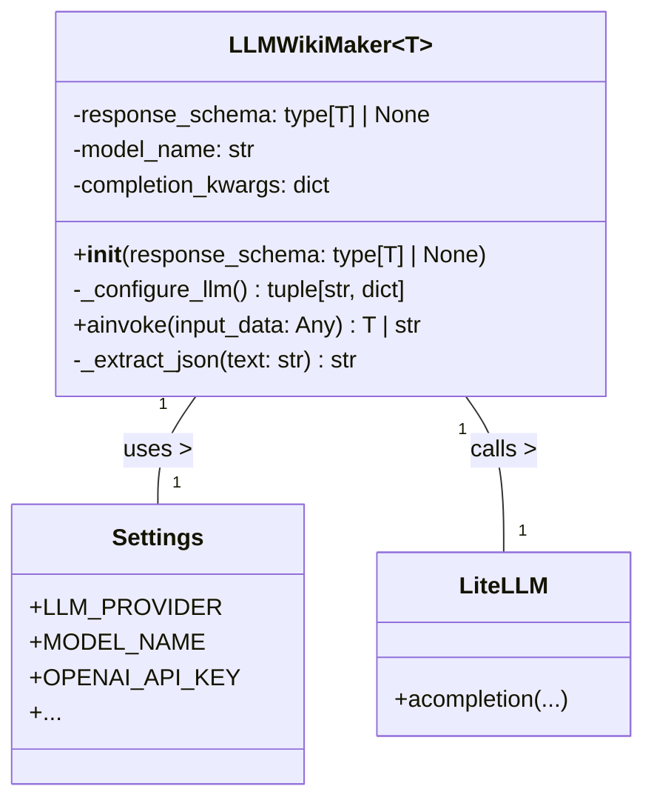
Sources: [src/agent/llm.py](LLMWikiMaker class)

## 6. 저장소 제공자 (`src/providers/base.py`)

`RepositoryProvider`는 다양한 유형의 코드 저장소(예: GitHub, GitLab, 로컬 파일 시스템)에서 파일 구조 및 콘텐츠를 가져오는 기능을 추상화하는 기본 추상 클래스입니다.

### 6.1. `RepositoryProvider` 추상 클래스

*   **추상 메서드**: 각 구체적인 저장소 제공자(예: `GitHubProvider`, `LocalProvider`)는 다음 추상 메서드를 구현해야 합니다.
    *   `fetch_structure()`: 저장소의 파일 트리 및 README를 가져옵니다.
    *   `fetch_file_content(file_path: str)`: 특정 파일의 내용을 가져옵니다.
*   **HTTP 클라이언트**: `httpx.AsyncClient`를 내장하여 비동기 HTTP 요청을 처리합니다.

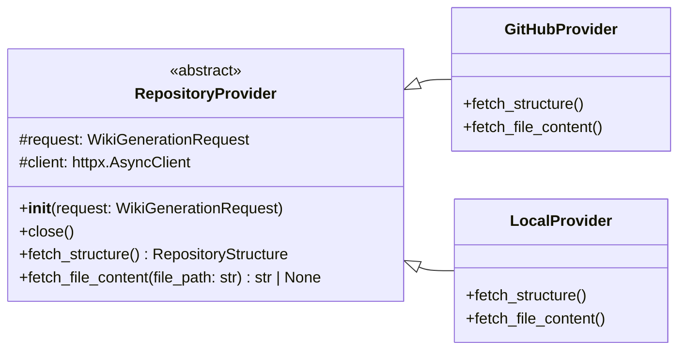
Sources: [src/providers/base.py](RepositoryProvider class)

## 7. 데이터 흐름: 위키 생성 요청

사용자가 위키 생성을 요청할 때 시스템 내에서 데이터가 어떻게 흐르는지 보여주는 시퀀스 다이어그램입니다.

```mermaid
sequenceDiagram
    participant User as "사용자"
    participant FE as "프론트엔드 (Streamlit)"
    participant BE as "백엔드 API (FastAPI)"
    participant RP as "저장소 제공자"
    participant LLMA as "LLM 에이전트"
    participant LLMS as "LLM 서비스"

    User->>FE: "저장소 정보 입력 및 '생성' 클릭"
    FE->>BE: "POST /api/v1/wiki/generate/text (WikiGenerationRequest)"
    activate BE
    BE->>BE: "비동기 작업 시작 (task_id 반환)"
    BE-->>FE: "task_id 반환"
    deactivate BE

    loop "작업 완료/실패까지 폴링"
        FE->>BE: "GET /api/v1/wiki/status/{task_id}"
        activate BE
        alt "작업 진행 중"
            BE-->>FE: "상태: 'in_progress'"
        else "작업 완료"
            BE-->>FE: "상태: 'completed', 결과: Markdown"
            break
        else "작업 실패"
            BE-->>FE: "상태: 'failed', 에러 메시지"
            break
        end
        deactivate BE
    end

    Note over BE,LLMS: "백엔드 내부 작업 흐름 (비동기)"
    activate BE
    BE->>RP: "저장소 구조 및 파일 내용 가져오기"
    activate RP
    RP->>RP: "Git API 호출 또는 로컬 파일 읽기"
    RP-->>BE: "저장소 구조 및 파일 내용"
    deactivate RP

    BE->>LLMA: "LLM 에이전트에 위키 생성 요청"
    activate LLMA
    LLMA->>LLMS: "LLM 모델 호출 (프롬프트 전송)"
    activate LLMS
    LLMS-->>LLMA: "생성된 위키 콘텐츠 (Markdown)"
    deactivate LLMS
    LLMA-->>BE: "생성된 위키 콘텐츠"
    deactivate LLMA

    BE->>BE: "결과 취합 및 저장"
    deactivate BE

    FE->>User: "생성된 위키 미리보기 및 다운로드"
```

## 8. 결론

"Wiki As Readme" 프로젝트는 Streamlit 기반의 사용자 친화적인 프론트엔드, FastAPI 기반의 강력한 백엔드 API, LiteLLM을 통한 유연한 LLM 통합, 그리고 추상화된 저장소 접근 계층을 통해 모듈화되고 확장 가능한 아키텍처를 제공합니다. 이러한 설계는 다양한 LLM 서비스와 저장소 유형을 지원하며, 코드베이스 문서화 프로세스를 자동화하고 간소화하는 데 중점을 둡니다.

---

<a name="llm-통합-및-설정"></a>

<details>
<summary>Relevant source files</summary>

The following files were used as context for generating this wiki page:

- [src/agent/llm.py](src/agent/llm.py)
- [src/core/config.py](src/core/config.py)
- [.env example](.env example)
- [src/prompts/wiki_contents_generator.yaml](src/prompts/wiki_contents_generator.yaml)
- [src/prompts/wiki_structure_generator.yaml](src/prompts/wiki_structure_generator.yaml)
</details>

# LLM 통합 및 설정

## 1. 서론

이 문서는 프로젝트 내에서 대규모 언어 모델(LLM)을 통합하고 설정하는 방법에 대해 설명합니다. LLM은 위키 페이지 생성과 같은 핵심 작업에 활용되며, `LiteLLM` 라이브러리를 기반으로 유연하고 확장 가능한 방식으로 구현되었습니다. 설정은 `Pydantic` 기반의 `Settings` 클래스를 통해 관리되며, 다양한 LLM 제공업체(Google, OpenAI, Anthropic 등)를 지원하고 구조화된 출력을 처리하는 기능을 포함합니다.

주요 목표는 다음과 같습니다:
*   다양한 LLM 제공업체에 대한 통합 및 설정 간소화.
*   유형 안전성(Type Safety)을 갖춘 구조화된 LLM 응답 처리.
*   환경 변수를 통한 유연한 LLM 구성.

## 2. LLM 통합 아키텍처

LLM 통합의 핵심은 `src/agent/llm.py` 파일에 정의된 `LLMWikiMaker` 클래스와 `src/core/config.py` 파일에 정의된 `Settings` 클래스입니다.

### 2.1. LLM Wrapper: `LLMWikiMaker`

`LLMWikiMaker` 클래스는 `LiteLLM`을 활용하여 위키 생성 작업을 수행하는 래퍼입니다. 제네릭(Generics)을 통해 유형 안전성을 갖춘 구조화된 출력을 지원합니다.

**클래스 정의:**
```python
class LLMWikiMaker[T: BaseModel]:
    """
    Wrapper for LiteLLM to perform wiki generation tasks.
    Supports Structured Output with Type Safety via Generics.
    """
    def __init__(self, response_schema: type[T] | None = None):
        self.response_schema = response_schema
        self.model_name, self.completion_kwargs = self._configure_llm()
```
Sources: [src/agent/llm.py](LLMWikiMaker class)

**주요 메서드:**

#### 2.1.1. `_configure_llm()`: LLM 설정 구성

이 메서드는 `src/core/config.py`의 `settings` 객체에 정의된 `LLM_PROVIDER`에 따라 모델 이름과 호출 인수를 동적으로 구성합니다. 각 제공업체에 특화된 API 키, 기본 URL, 프로젝트 정보 등을 처리합니다.

**지원되는 LLM 제공업체:**
*   **Google Vertex AI**: `vertex_ai/` 접두사 사용, `GCP_PROJECT_NAME`, `GCP_MODEL_LOCATION` 설정.
*   **OpenAI (GPT)**: `openai/` 접두사 사용, `OPENAI_API_KEY` 또는 `LLM_BASE_URL` 필요.
*   **Anthropic (Claude)**: `anthropic/` 접두사 사용, `ANTHROPIC_API_KEY` 필요.
*   **OpenRouter**: `openrouter/` 접두사 사용, `OPENROUTER_API_KEY` 필요.
*   **xAI (Grok)**: `xai/` 접두사 사용, `XAI_API_KEY` 필요.
*   **Ollama / On-premise**: `ollama/` 접두사 사용, `LLM_BASE_URL` 설정 가능.

모든 제공업체에 공통적으로 `temperature`와 `max_retries` 설정이 적용됩니다.

**LLM 구성 흐름:**
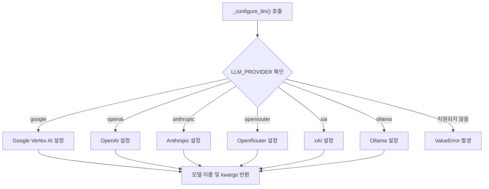
Sources: [src/agent/llm.py](LLMWikiMaker._configure_llm method)

#### 2.1.2. `ainvoke()`: 비동기 LLM 호출

이 비동기 메서드는 `LiteLLM`을 사용하여 LLM을 호출합니다. `response_schema`가 설정된 경우 구조화된 응답을 반환하고, 그렇지 않으면 문자열을 반환합니다.

**처리 단계:**
1.  **입력 데이터 처리**: `input_data`를 문자열 프롬프트로 변환합니다.
2.  **LLM 호출 설정**: 모델 이름, 메시지, `completion_kwargs`를 포함한 호출 인수를 준비합니다.
3.  **구조화된 출력 설정**: `response_schema`가 설정되어 있고 `USE_STRUCTURED_OUTPUT`이 `True`인 경우, `response_format`을 설정합니다.
4.  **LLM 호출**: `litellm.acompletion`을 호출하여 응답을 받습니다.
5.  **LLM 응답 파싱**:
    *   `LiteLLM`이 이미 JSON으로 파싱한 경우(`message.parsed`), 해당 객체를 반환합니다.
    *   응답이 JSON 문자열인 경우, `_extract_json`을 통해 마크다운 코드 블록에서 JSON을 추출하고 `response_schema.model_validate_json`을 사용하여 파싱합니다.

**`ainvoke` 흐름:**
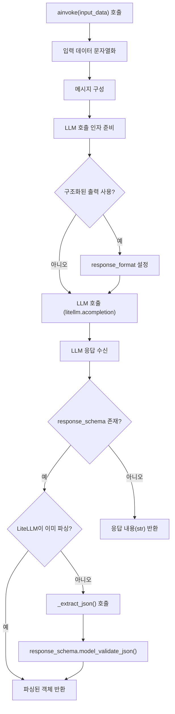
Sources: [src/agent/llm.py](LLMWikiMaker.ainvoke method)

#### 2.1.3. `_extract_json()`: JSON 추출 유틸리티

LLM이 마크다운 코드 블록(` ```json ... ``` `) 내에 JSON을 반환하는 경우, 이 메서드는 정규 표현식을 사용하여 JSON 문자열을 추출합니다.
Sources: [src/agent/llm.py](LLMWikiMaker._extract_json method)

### 2.2. 설정 관리: `src/core/config.py`

`src/core/config.py` 파일은 `Pydantic BaseSettings`를 사용하여 애플리케이션의 모든 설정을 관리합니다. LLM 관련 설정은 `.env` 파일에서 로드되거나 환경 변수에서 직접 가져옵니다.

**주요 LLM 관련 설정:**

| 설정명 | 타입 | 기본값 | 설명 |
|---|---|---|---|
| `LLM_PROVIDER` | `Literal` | `"google"` | 사용할 LLM 제공업체 (google, openai, anthropic, openrouter, xai, ollama) |
| `MODEL_NAME` | `str` | `"gemini-2.5-flash"` | 사용할 LLM 모델의 이름 |
| `OPENAI_API_KEY` | `str | None` | `None` | OpenAI API 키 |
| `ANTHROPIC_API_KEY` | `str | None` | `None` | Anthropic API 키 |
| `OPENROUTER_API_KEY` | `str | None` | `None` | OpenRouter API 키 |
| `XAI_API_KEY` | `str | None` | `None` | xAI API 키 |
| `LLM_BASE_URL` | `str | None` | `None` | LLM API의 커스텀 기본 URL (Ollama 또는 프록시용) |
| `USE_STRUCTURED_OUTPUT` | `bool` | `True` | 구조화된 JSON 출력 모드 사용 여부 (모델 지원 필요) |
| `temperature` | `float` | `0.0` | LLM 응답의 무작위성 제어 (0.0: 결정론적, 1.0: 창의적) |
| `max_retries` | `int` | `3` | 실패한 LLM 요청에 대한 최대 재시도 횟수 |
| `max_concurrency` | `int` | `5` | 속도 제한 방지를 위한 병렬 LLM 호출 수 제한 |
| `GCP_PROJECT_NAME` | `str | None` | `None` | Google Cloud Platform 프로젝트 이름 (Google Vertex AI용) |
| `GCP_MODEL_LOCATION` | `str | None` | `None` | Google Cloud Platform 모델 위치 (Google Vertex AI용) |

Sources: [src/core/config.py](Settings class)

`SettingsConfigDict(env_file=".env", env_file_encoding="utf-8", extra="ignore")` 설정을 통해 `.env` 파일에서 환경 변수를 로드합니다.
Sources: [src/core/config.py](Settings.model_config)

### 2.3. 환경 변수 설정: `.env example`

`.env` 파일은 LLM 통합을 위한 환경 변수를 설정하는 데 사용됩니다. `LLM_PROVIDER`, `MODEL_NAME`, 각 제공업체의 API 키, `LLM_BASE_URL` 등 핵심 설정들이 이 파일을 통해 관리됩니다.

**예시:**
```ini
# --- LLM Provider Settings ---
LLM_PROVIDER=google
MODEL_NAME=gemini-2.0-flash-exp

# --- LLM API Keys ---
OPENAI_API_KEY=
ANTHROPIC_API_KEY=
OPENROUTER_API_KEY=
XAI_API_KEY=

# --- LLM Configuration ---
# LLM_BASE_URL=http://localhost:11434/v1
USE_STRUCTURED_OUTPUT=true
temperature=0.0
max_retries=3
max_concurrency=5

# --- Google Cloud Platform Settings (Only for Google Vertex AI) ---
GCP_PROJECT_NAME=
GCP_MODEL_LOCATION=
```
Sources: [.env example](LLM Provider Settings, LLM API Keys, LLM Configuration, Google Cloud Platform Settings sections)

### 2.4. 프롬프트 템플릿 활용

LLM 통합은 `src/prompts/wiki_contents_generator.yaml` 및 `src/prompts/wiki_structure_generator.yaml`과 같은 Jinja2 템플릿 기반 프롬프트를 사용하여 LLM의 동작을 안내합니다. 이 프롬프트들은 `use_structured_output`과 같은 변수를 통해 `USE_STRUCTURED_OUTPUT` 설정과 연동되어 LLM이 특정 형식의 출력을 생성하도록 지시합니다.

예를 들어, `wiki_contents_generator.yaml` 프롬프트는 `use_structured_output` 변수가 `False`일 때 `WikiPage` Pydantic 모델의 `content` 필드에 들어갈 마크다운 문자열만 반환하도록 LLM에 지시합니다.
Sources: [src/prompts/wiki_contents_generator.yaml](OUTPUT SPECIFICATION section)

## 3. 결론

이 프로젝트의 LLM 통합 및 설정은 `LiteLLM` 래퍼와 `Pydantic` 기반의 설정 관리를 통해 강력하고 유연하게 설계되었습니다. 다양한 LLM 제공업체를 지원하고, 환경 변수를 통한 쉬운 구성, 그리고 유형 안전성을 갖춘 구조화된 출력 처리를 통해 위키 생성과 같은 복잡한 작업을 효율적으로 수행할 수 있습니다. 이러한 설계는 향후 LLM 기술 변화에 대한 적응성과 확장성을 보장합니다.

---

<a name="주요-서비스-컴포넌트"></a>

<details>
<summary>Relevant source files</summary>

The following files were used as context for generating this wiki page:

- [src/services/repo_fetcher.py](src/services/repo_fetcher.py)
- [src/services/structure_analyzer.py](src/services/structure_analyzer.py)
- [src/services/wiki_generator.py](src/services/wiki_generator.py)
- [src/services/wiki_formatter.py](src/services/wiki_formatter.py)
- [src/services/wiki_worker.py](src/services/wiki_worker.py)
</details>

# 주요 서비스 컴포넌트

이 문서는 위키 생성 시스템의 핵심 서비스 컴포넌트들을 설명합니다. 이 컴포넌트들은 저장소에서 정보를 가져오고, 위키 구조를 결정하며, LLM(대규모 언어 모델)을 사용하여 콘텐츠를 생성하고, 최종 마크다운 문서를 포맷팅하며, 전체 프로세스를 조율하는 역할을 합니다. 각 서비스는 특정 책임을 가지며, 서로 협력하여 자동화된 위키 생성 파이프라인을 구성합니다.

## 1. RepositoryFetcher (저장소 정보 추출기)

`RepositoryFetcher` 서비스는 다양한 저장소 제공자(GitHub, GitLab, Bitbucket, 로컬)로부터 저장소 구조와 파일 내용을 가져오는 역할을 담당합니다. 이는 위키 생성 프로세스의 첫 단계로, LLM이 분석할 원시 데이터를 제공합니다.

### 주요 기능 및 특징

*   **다양한 저장소 지원**: `_PROVIDER_MAP`을 통해 GitHub, GitLab, Bitbucket, 로컬 저장소에 대한 플러그형 지원을 제공합니다. 요청(`WikiGenerationRequest`)에 따라 적절한 `RepositoryProvider` 인스턴스를 생성합니다.
    *   Sources: [src/services/repo_fetcher.py](_PROVIDER_MAP)
*   **저장소 구조 가져오기**: `fetch_repository_structure` 메서드는 저장소의 파일 트리 구조를 비동기적으로 가져옵니다.
    *   Sources: [src/services/repo_fetcher.py](fetch_repository_structure)
*   **파일 내용 가져오기**: `fetch_file_content` 메서드는 특정 파일의 내용을 비동기적으로 가져옵니다. 이는 `WikiStructureDeterminer`가 페이지 콘텐츠를 생성할 때 사용합니다.
    *   Sources: [src/services/repo_fetcher.py](fetch_file_content)
*   **비동기 컨텍스트 관리자**: `async with` 구문을 지원하여 리소스 정리(`close` 메서드 호출)를 자동으로 처리합니다.
    *   Sources: [src/services/repo_fetcher.py](__aenter__ and __aexit__)

## 2. WikiStructureDeterminer (위키 구조 결정 및 콘텐츠 생성기)

`WikiStructureDeterminer` 서비스는 `RepositoryFetcher`로부터 가져온 정보를 바탕으로 위키의 구조를 결정하고, LLM을 활용하여 각 위키 페이지의 내용을 생성하는 핵심 로직을 포함합니다.

### 주요 기능 및 특징

*   **LLM 통합**: `LLMWikiMaker`를 사용하여 위키 구조 및 페이지 콘텐츠 생성을 위한 LLM 호출을 관리합니다.
    *   Sources: [src/services/structure_analyzer.py](LLMWikiMaker)
*   **프롬프트 템플릿 로딩**: `_load_prompt_template` 메서드를 통해 YAML 파일에서 프롬프트 템플릿을 로드하고 캐싱합니다.
    *   Sources: [src/services/structure_analyzer.py](_load_prompt_template)
*   **파일 내용 병렬 처리**: `_fetch_and_format_files` 메서드는 `RepositoryFetcher`를 사용하여 여러 파일을 비동기적으로 병렬로 가져오고, LLM 입력에 적합한 형식으로 포맷팅합니다.
    *   Sources: [src/services/structure_analyzer.py](_fetch_and_format_files)
*   **위키 구조 결정**: `determine_wiki_structure` 메서드는 파일 트리와 README 내용을 기반으로 LLM을 호출하여 전체 위키 구조(`WikiStructure`)를 생성합니다.
    *   Sources: [src/services/structure_analyzer.py](determine_wiki_structure)
*   **페이지 콘텐츠 생성**: `generate_page_content` 메서드는 개별 위키 페이지에 대한 콘텐츠를 LLM을 통해 생성합니다. `asyncio.Semaphore`를 사용하여 동시 LLM 호출 수를 제한합니다.
    *   Sources: [src/services/structure_analyzer.py](generate_page_content)
*   **상태 관리**: `generated_pages`, `pages_in_progress`, `is_loading`, `error` 등의 속성을 통해 현재 생성 진행 상황 및 상태를 추적합니다.
    *   Sources: [src/services/structure_analyzer.py](State Management in __init__)
*   **비동기 컨텍스트 관리자**: `async with` 구문을 지원하여 리소스 정리(`close` 메서드 호출)를 자동으로 처리합니다.
    *   Sources: [src/services/structure_analyzer.py](__aenter__ and __aexit__)

## 3. WikiGenerationService (위키 생성 서비스)

`WikiGenerationService`는 위키 생성 파이프라인의 엔드-투-엔드 조정을 담당하는 메인 서비스입니다. `RepositoryFetcher`, `WikiStructureDeterminer`, `WikiFormatter`를 통합하여 전체 위키 생성 흐름을 관리합니다.

### 주요 기능 및 특징

*   **요청 유효성 검사**: `validate_request` 메서드를 통해 입력 요청(`WikiGenerationRequest`)의 유효성을 확인합니다.
    *   Sources: [src/services/wiki_generator.py](validate_request)
*   **생성 준비**: `prepare_generation` 메서드는 `WikiStructureDeterminer`를 초기화하고 초기 위키 구조를 결정합니다. 이는 구조 확인 후 콘텐츠 생성을 시작하는 "Human-in-the-loop" 시나리오에 유용합니다.
    *   Sources: [src/services/wiki_generator.py](prepare_generation)
*   **전체 위키 생성 파이프라인 실행**: `generate_wiki` 메서드는 전체 위키 생성 프로세스를 실행합니다.
    *   새로운 `WikiStructureDeterminer`를 생성하여 처음부터 시작하거나, 이미 준비된 `WikiStructureDeterminer`를 사용하여 특정 상태에서 이어서 진행할 수 있습니다.
    *   콘텐츠 생성이 완료될 때까지 대기하고, `WikiFormatter`를 사용하여 최종 마크다운을 통합합니다.
    *   Sources: [src/services/wiki_generator.py](generate_wiki)
*   **파일 저장**: `save_to_file` 메서드는 생성된 마크다운 콘텐츠를 로컬 파일 시스템에 저장합니다.
    *   Sources: [src/services/wiki_generator.py](save_to_file)

## 4. WikiFormatter (위키 포맷터)

`WikiFormatter` 서비스는 `WikiStructureDeterminer`에서 생성된 위키 구조와 개별 페이지 콘텐츠를 단일 마크다운 문자열로 통합하는 역할을 합니다.

### 주요 기능 및 특징

*   **파일 이름 정리**: `sanitize_filename` 메서드는 파일 이름으로 사용하기에 안전한 문자열을 생성합니다.
    *   Sources: [src/services/wiki_formatter.py](sanitize_filename)
*   **마크다운 통합**: `consolidate_markdown` 메서드는 `WikiStructure` 객체와 생성된 페이지 콘텐츠 딕셔너리를 받아, 목차(Table of Contents)를 포함한 단일 마크다운 문서를 생성합니다. 각 페이지 제목에 대한 앵커 링크를 생성하여 문서 내 이동을 지원합니다.
    *   Sources: [src/services/wiki_formatter.py](consolidate_markdown)

## 5. Wiki Worker (백그라운드 위키 작업자)

`process_wiki_generation_task` 함수는 비동기 위키 생성을 위한 백그라운드 작업 핸들러입니다. 이는 장시간 실행될 수 있는 위키 생성 프로세스를 별도의 태스크로 처리하여 메인 애플리케이션의 응답성을 유지합니다.

### 주요 기능 및 특징

*   **통합 백그라운드 태스크 핸들러**: `WikiGenerationService`를 사용하여 위키 생성 프로세스를 실행합니다.
    *   Sources: [src/services/wiki_worker.py](process_wiki_generation_task)
*   **태스크 상태 업데이트**: `update_task_status` 함수를 호출하여 태스크의 진행 상황(완료, 실패) 및 결과를 기록합니다.
    *   Sources: [src/services/wiki_worker.py](update_task_status)
*   **오류 처리**: 생성 과정에서 발생하는 예외를 처리하고, 태스크 상태를 "failed"로 업데이트합니다.
    *   Sources: [src/services/wiki_worker.py](Exception handling in process_wiki_generation_task)
*   **리소스 정리**: 외부에서 주입된 `WikiStructureDeterminer`가 있다면 작업 완료 후 `close()` 메서드를 호출하여 리소스를 정리합니다.
    *   Sources: [src/services/wiki_worker.py](finally block in process_wiki_generation_task)

## 서비스 간의 상호작용 흐름

다음 다이어그램은 위키 생성 요청이 들어왔을 때 주요 서비스 컴포넌트들이 어떻게 상호작용하는지 보여줍니다.

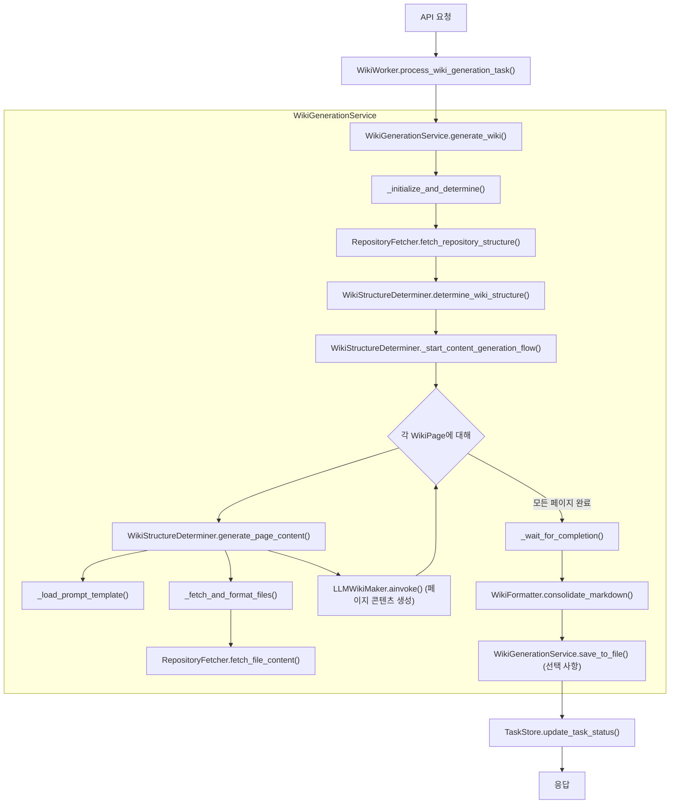

## 결론

이 시스템의 주요 서비스 컴포넌트들은 모듈화되어 각자의 명확한 책임을 가집니다. `RepositoryFetcher`는 외부 저장소와의 인터페이스를 제공하고, `WikiStructureDeterminer`는 LLM을 활용하여 지능적으로 위키 구조와 내용을 생성합니다. `WikiGenerationService`는 이 모든 과정을 조율하며, `WikiFormatter`는 최종 출력을 담당합니다. `WikiWorker`는 이 복잡한 프로세스를 백그라운드에서 안정적으로 실행할 수 있도록 지원하여, 확장 가능하고 효율적인 위키 자동 생성 시스템을 구축합니다.

---

<a name="api-엔드포인트-참조"></a>

<details>
<summary>Relevant source files</summary>

The following files were used as context for generating this wiki page:

- [src/api/v1/endpoints/wiki.py](src/api/v1/endpoints/wiki.py)
- [src/api/v1/endpoints/webhook.py](src/api/v1/endpoints/webhook.py)
- [src/models/api_schema.py](src/models/api_schema.py)
- [src/models/github_webhook_schema.py](src/models/github_webhook_schema.py)
</details>

# API 엔드포인트 참조

## 소개

이 문서는 위키 생성 및 GitHub 통합을 위한 API 엔드포인트에 대한 포괄적인 참조를 제공합니다. 이 시스템은 사용자가 요청 시 위키 문서를 생성하거나, GitHub 푸시 이벤트를 통해 자동으로 위키를 생성하고 저장소에 업데이트할 수 있도록 설계되었습니다. 주요 기능은 비동기 작업 처리, GitHub 웹훅 보안 검증, 그리고 생성된 콘텐츠를 GitHub 저장소에 커밋하는 것을 포함합니다.

제공되는 API는 크게 두 가지 범주로 나뉩니다: 위키 생성 작업을 직접 제어하는 엔드포인트와 GitHub 웹훅 이벤트를 처리하여 자동화된 위키 업데이트를 트리거하는 엔드포인트입니다. 모든 API는 Pydantic 모델을 사용하여 요청 및 응답 스키마를 정의하며, FastAPI 프레임워크를 기반으로 구축되었습니다.

## 위키 생성 API 엔드포인트

이 섹션에서는 위키 문서 생성 및 해당 작업 상태를 조회하는 데 사용되는 엔드포인트를 설명합니다. 모든 위키 생성 작업은 백그라운드에서 비동기적으로 처리됩니다.

### 1. 위키 생성 및 파일 저장 (`POST /api/v1/wiki/generate/file`)

이 엔드포인트는 위키 생성을 트리거하고, 생성된 마크다운 파일을 서버의 `output/` 디렉토리에 저장합니다. 작업의 진행 상황을 추적할 수 있는 작업 ID를 반환합니다.

*   **URL:** `/api/v1/wiki/generate/file`
*   **메서드:** `POST`
*   **설명:** 위키 생성을 시작하고 결과를 서버 파일 시스템에 저장합니다.
*   **요청 본문:** `WikiGenerationRequest`
*   **응답 본문:** `WikiGenerationResponse`

**요청 예시:**

```json
{
  "repo_owner": "octocat",
  "repo_name": "Spoon-Knife",
  "repo_type": "github",
  "language": "ko",
  "is_comprehensive_view": true
}
```

**응답 예시:**

```json
{
  "message": "Wiki generation started in the background (File mode).",
  "task_id": "some-unique-task-id",
  "title": "Spoon-Knife 프로젝트 위키",
  "description": "Spoon-Knife 저장소에 대한 포괄적인 위키 문서입니다."
}
```

Sources: [src/api/v1/endpoints/wiki.py](generate_wiki_file function)

### 2. 위키 생성 및 텍스트 반환 (`POST /api/v1/wiki/generate/text`)

이 엔드포인트는 위키 생성을 트리거하지만, 생성된 마크다운 파일을 서버에 저장하지 않습니다. 생성된 텍스트 콘텐츠는 작업 상태 조회 시 결과로 제공됩니다.

*   **URL:** `/api/v1/wiki/generate/text`
*   **메서드:** `POST`
*   **설명:** 위키 생성을 시작하고 결과를 텍스트로 반환합니다 (서버에 저장 안 함).
*   **요청 본문:** `WikiGenerationRequest`
*   **응답 본문:** `WikiGenerationResponse`

Sources: [src/api/v1/endpoints/wiki.py](generate_wiki_text function)

### 3. 위키 생성 작업 상태 조회 (`GET /api/v1/wiki/status/{task_id}`)

이 엔드포인트는 특정 위키 생성 작업의 현재 상태를 조회합니다.

*   **URL:** `/api/v1/wiki/status/{task_id}`
*   **메서드:** `GET`
*   **설명:** `task_id`에 해당하는 위키 생성 작업의 상태를 조회합니다.
*   **경로 파라미터:**
    *   `task_id` (string): 조회할 작업의 고유 ID.
*   **응답 본문:** `TaskStatusResponse`

**응답 예시:**

```json
{
  "task_id": "some-unique-task-id",
  "status": "in_progress",
  "result": null
}
```
또는 완료 시:
```json
{
  "task_id": "some-unique-task-id",
  "status": "completed",
  "result": "# 생성된 위키 내용\n\n이것은 마크다운 형식의 위키 내용입니다."
}
```

Sources: [src/api/v1/endpoints/wiki.py](get_wiki_generation_status function)

### 위키 생성 흐름 다이어그램

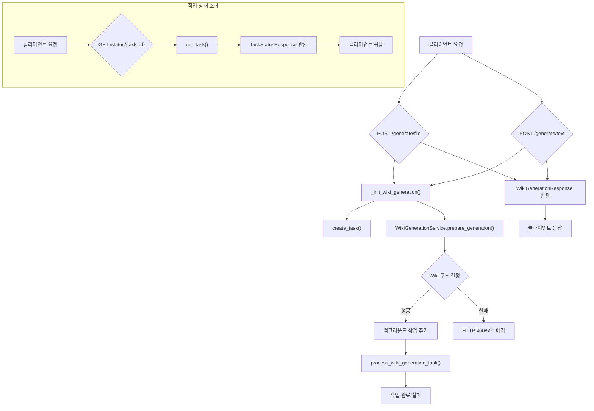

## GitHub 웹훅 API 엔드포인트

이 섹션에서는 GitHub 푸시 이벤트를 수신하고 처리하여 저장소의 위키(또는 README.md)를 자동으로 업데이트하는 엔드포인트를 설명합니다.

### 1. GitHub 푸시 이벤트 처리 (`POST /api/v1/webhook/github`)

이 엔드포인트는 GitHub 저장소에서 푸시 이벤트가 발생했을 때 호출됩니다. 웹훅 시그니처를 검증하고, 봇 자신의 커밋을 무시하며, `main` 브랜치에 대한 푸시 이벤트에 대해서만 위키 생성 및 GitHub 업데이트 작업을 트리거합니다.

*   **URL:** `/api/v1/webhook/github`
*   **메서드:** `POST`
*   **설명:** GitHub 푸시 이벤트를 수신하고, 위키를 생성한 후 GitHub 저장소의 `WIKI.md` 파일을 업데이트합니다.
*   **요청 본문:** `GitHubPushPayload` (GitHub 웹훅 페이로드)
*   **응답 본문:** `{"message": "..."}`

**주요 처리 로직:**
1.  **시그니처 검증:** `X-Hub-Signature-256` 헤더를 사용하여 GitHub 웹훅의 유효성을 검증합니다. `GITHUB_WEBHOOK_SECRET` 환경 변수가 설정되어 있어야 합니다.
2.  **봇 커밋 무시:** `BOT_COMMITTER_NAME` 또는 커밋 메시지에 "via Wiki-As-Readme"가 포함된 커밋은 무시하여 무한 루프를 방지합니다.
3.  **브랜치 필터링:** `main` 브랜치에 대한 푸시 이벤트만 처리합니다.
4.  **위키 생성 및 업데이트:** 백그라운드 작업 `process_full_cycle`을 시작하여 다음을 수행합니다:
    *   내부적으로 `/api/v1/wiki/generate/file` 엔드포인트를 호출하여 위키를 생성합니다.
    *   생성된 마크다운 콘텐츠를 `update_github_readme` 함수를 통해 GitHub 저장소의 `WIKI.md` 파일에 커밋합니다. 이 과정에는 `GITHUB_ACCESS_TOKEN` (PAT)이 필요합니다.

Sources: [src/api/v1/endpoints/webhook.py](github_webhook function)

### GitHub 웹훅 처리 흐름 다이어그램

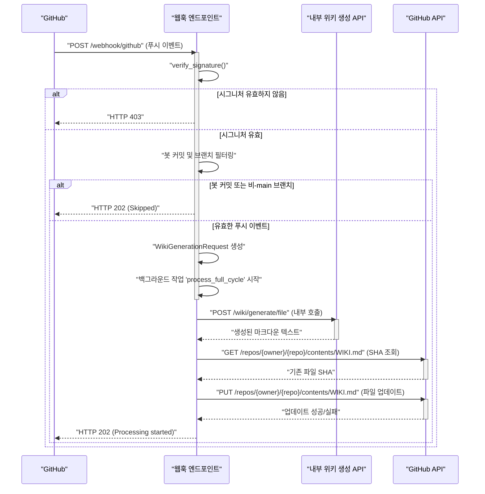

## 공통 데이터 모델

API 엔드포인트에서 사용되는 주요 Pydantic 데이터 모델은 다음과 같습니다.

### 1. `WikiGenerationRequest`

위키 생성을 요청할 때 사용되는 입력 모델입니다.

| 필드명 | 타입 | 설명 |
|---|---|---|
| `repo_owner` | `str` \| `None` | 저장소 소유자 (사용자 또는 조직) |
| `repo_name` | `str` \| `None` | 저장소 이름 |
| `repo_type` | `Literal["github", "gitlab", "bitbucket", "local"]` | 저장소 유형 (기본값: `github`) |
| `repo_url` | `str` \| `None` | 원격 저장소 클론 URL |
| `local_path` | `str` \| `None` | `repo_type`이 `local`일 경우 로컬 저장소 경로 |
| `language` | `str` | 생성될 위키 콘텐츠의 언어 (기본값: `ko`) |
| `is_comprehensive_view` | `bool` | 저장소의 포괄적인 뷰를 생성할지 여부 (기본값: `True`) |

Sources: [src/models/api_schema.py](WikiGenerationRequest class)

### 2. `WikiGenerationResponse`

위키 생성 요청에 대한 초기 응답 모델입니다.

| 필드명 | 타입 | 설명 |
|---|---|---|
| `message` | `str` | 요청 상태를 나타내는 메시지 |
| `task_id` | `str` | 시작된 백그라운드 작업의 ID |
| `title` | `str` | 생성될 위키의 제목 |
| `description` | `str` | 생성될 위키의 설명 |

Sources: [src/models/api_schema.py](WikiGenerationResponse class)

### 3. `TaskStatusResponse`

백그라운드 작업의 상태를 조회할 때 사용되는 응답 모델입니다.

| 필드명 | 타입 | 설명 |
|---|---|---|
| `task_id` | `str` | 작업의 ID |
| `status` | `Literal["in_progress", "completed", "failed"]` | 작업의 현재 상태 |
| `result` | `Any` \| `None` | 작업이 완료되거나 실패했을 경우의 결과 |

Sources: [src/models/api_schema.py](TaskStatusResponse class)

### 4. `GitHubPushPayload`

GitHub 웹훅 푸시 이벤트의 페이로드를 나타내는 모델입니다. 이 모델은 GitHub의 실제 페이로드 구조를 반영합니다.

| 필드명 | 타입 | 설명 |
|---|---|---|
| `ref` | `str` | 푸시된 브랜치 참조 (예: `refs/heads/main`) |
| `repository` | `GitHubRepository` | 푸시가 발생한 저장소 정보 |
| `pusher` | `GitHubPusher` \| `None` | 푸시를 수행한 사용자 정보 |
| `head_commit` | `GitHubCommit` \| `None` | 최신 커밋 정보 |

Sources: [src/models/github_webhook_schema.py](GitHubPushPayload class)

## 결론

이 문서에서는 위키 생성 및 GitHub 통합을 위한 API 엔드포인트에 대해 상세히 설명했습니다. 사용자는 직접 API를 호출하여 위키를 생성하고 관리할 수 있으며, GitHub 웹훅을 통해 저장소 변경 사항에 따라 위키가 자동으로 업데이트되도록 설정할 수 있습니다. 이러한 엔드포인트는 비동기 처리, 보안 검증, 그리고 유연한 데이터 모델을 통해 안정적이고 확장 가능한 위키 자동화 솔루션을 제공합니다.

---

<a name="환경-설정-가이드"></a>

<details>
<summary>Relevant source files</summary>

The following files were used as context for generating this wiki page:

- [.env example](.env example)
- [src/core/config.py](src/core/config.py)
- [README.md](README.md)
</details>

# 환경 설정 가이드

## 1. 서론

이 문서는 "Wiki As Readme" 프로젝트의 환경 설정을 위한 포괄적인 가이드입니다. 프로젝트는 다양한 LLM(Large Language Model) 제공업체, Git 플랫폼 및 배포 환경에서 유연하게 작동하도록 설계되었으며, 이러한 유연성은 강력하고 사용자 정의 가능한 환경 설정 시스템을 통해 가능합니다.

주요 설정은 `.env` 파일을 통해 관리되며, `src/core/config.py` 파일에 정의된 Pydantic `Settings` 클래스를 통해 로드되고 검증됩니다. 이 가이드는 `.env` 파일의 각 설정 항목과 `config.py`에서 설정이 처리되는 방식에 대해 자세히 설명합니다. 올바른 환경 설정은 프로젝트의 정상적인 작동과 원하는 결과물 생성을 위해 필수적입니다.

## 2. 환경 설정 개요

"Wiki As Readme" 프로젝트의 설정은 주로 두 가지 소스에서 관리됩니다:

1.  **`.env` 파일**: 애플리케이션 실행 시 로드되는 환경 변수를 정의합니다. 민감한 정보(API 키) 및 배포 환경별 설정을 포함합니다.
2.  **`src/core/config.py`**: Pydantic `BaseSettings`를 사용하여 애플리케이션의 모든 설정 항목을 정의하고 기본값, 타입 검증, 유효성 검사를 처리합니다. `.env` 파일의 값은 `config.py`에 정의된 기본값을 재정의합니다.

### 설정 로딩 흐름

다음 다이어그램은 애플리케이션이 환경 설정을 로드하는 과정을 보여줍니다.

```mermaid
graph TD
    A["애플리케이션 시작"] --> B["Pydantic Settings 로드"];
    B --> C["`.env` 파일 읽기"];
    C --> D["`src/core/config.py`의 `Settings` 클래스"];
    D -- "환경 변수 주입 및 기본값 적용" --> E["최종 설정 객체"];
    E --> F["애플리케이션 사용"];
```
Sources: [src/core/config.py](src/core/config.py), [.env example](.env example)

## 3. `.env` 파일 설정 상세

`.env` 파일은 프로젝트의 동작을 제어하는 핵심 환경 변수를 정의합니다. `.env example` 파일을 복사하여 `.env` 파일을 생성하고 필요에 따라 값을 설정해야 합니다.

### 3.1. LLM 제공업체 설정 (LLM Provider Settings)

| 변수명 | 설명 | 예시 |
|---|---|---|
| `LLM_PROVIDER` | 사용할 LLM 제공업체를 선택합니다. 지원되는 값: `google`, `openai`, `anthropic`, `xai`, `openrouter`, `ollama`. | `google` |
| `MODEL_NAME` | 선택한 제공업체에서 사용할 특정 모델 식별자입니다. | `gemini-2.0-flash-exp`, `gpt-4o`, `claude-3-5-sonnet-latest` |
Sources: [.env example](.env example), [src/core/config.py](LLM_PROVIDER)

### 3.2. LLM API 키 (LLM API Keys)

선택한 LLM 제공업체에 따라 해당 API 키를 설정해야 합니다. 사용하지 않는 제공업체의 키는 비워두거나 주석 처리할 수 있습니다.

| 변수명 | 설명 |
|---|---|
| `OPENAI_API_KEY` | OpenAI API 키 |
| `ANTHROPIC_API_KEY` | Anthropic API 키 |
| `OPENROUTER_API_KEY` | OpenRouter API 키 |
| `XAI_API_KEY` | xAI API 키 |
Sources: [.env example](.env example), [src/core/config.py](OPENAI_API_KEY)

### 3.3. LLM 구성 (LLM Configuration)

LLM 호출의 동작을 미세 조정하는 설정입니다.

| 변수명 | 설명 | 예시 |
|---|---|---|
| `LLM_BASE_URL` | LLM API의 사용자 정의 기본 URL (예: Ollama 또는 프록시 사용 시). | `http://localhost:11434/v1` |
| `USE_STRUCTURED_OUTPUT` | 구조화된 JSON 출력 모드 사용 여부 (모델 지원 필요). | `true` |
| `temperature` | LLM 응답의 무작위성 제어 (0.0: 결정론적, 1.0: 창의적). | `0.0` |
| `max_retries` | 실패한 LLM 요청에 대한 최대 재시도 횟수. | `3` |
| `max_concurrency` | 속도 제한 방지를 위한 병렬 LLM 호출 수 제한. | `5` |
Sources: [.env example](.env example), [src/core/config.py](LLM_BASE_URL)

### 3.4. 파일 필터링 설정 (File Filtering Settings)

LLM 컨텍스트에서 제외할 파일 패턴을 정의하여 토큰 사용량을 절약하고 LLM의 초점을 개선합니다.

| 변수명 | 설명 | 예시 |
|---|---|---|
| `IGNORED_PATTERNS` | LLM 컨텍스트에서 제외할 glob 패턴 목록입니다. **중요**: 여기에 정의하면 `src/core/config.py`의 기본 목록을 재정의합니다. 값은 단일 라인 JSON 배열 문자열이어야 합니다. | `'["uv.lock", "node_modules", "*.pyc"]'` |
Sources: [.env example](.env example), [src/core/config.py](IGNORED_PATTERNS)

### 3.5. 저장소 접근 설정 (Repository Access Settings)

비공개 저장소 접근 또는 높은 API 요청 제한을 위해 사용됩니다.

| 변수명 | 설명 |
|---|---|
| `GIT_API_TOKEN` | GitHub/GitLab 개인 액세스 토큰. |
Sources: [.env example](.env example), [src/core/config.py](GIT_API_TOKEN)

### 3.6. 지역화 설정 (Localization Settings)

생성될 위키의 대상 언어를 설정합니다.

| 변수명 | 설명 | 예시 |
|---|---|---|
| `language` | 생성될 위키의 대상 언어 (예: `ko`, `en`, `ja`, `zh`). | `en` |
Sources: [.env example](.env example), [src/core/config.py](language)

### 3.7. Google Cloud Platform 설정 (Google Vertex AI 전용)

`LLM_PROVIDER`가 `google`로 설정된 경우에만 필요합니다.

| 변수명 | 설명 |
|---|---|
| `GCP_PROJECT_NAME` | Google Cloud 프로젝트 이름. |
| `GCP_MODEL_LOCATION` | Vertex AI 모델이 배포된 지역 (예: `us-central1`). |
| `GOOGLE_APPLICATION_CREDENTIALS` | 서비스 계정 키 파일 경로 (일반적으로 `.env`에는 직접 설정하지 않고, GitHub Actions 등에서 파일로 생성하여 사용). |
Sources: [.env example](.env example), [src/core/config.py](GCP_PROJECT_NAME)

## 4. `src/core/config.py` 상세

`src/core/config.py` 파일은 Pydantic `BaseSettings`를 활용하여 애플리케이션의 모든 설정 항목을 정의하고 관리합니다.

### 4.1. `DEFAULT_IGNORED_PATTERNS`

이 상수는 `IGNORED_PATTERNS`가 `.env` 파일에 명시적으로 설정되지 않았을 때 사용되는 기본 제외 패턴 목록을 정의합니다. 여기에는 일반적인 잠금 파일, 빌드 아티팩트, 버전 관리 시스템 폴더, IDE 설정 폴더, 바이너리 파일 등이 포함됩니다.

```python
DEFAULT_IGNORED_PATTERNS = [
    "uv.lock", "package-lock.json", "yarn.lock", "pnpm-lock.yaml",
    # ... (생략) ...
    "__pycache__", ".git", ".venv", "node_modules", ".idea", ".vscode",
    # ... (생략) ...
    "*.png", "*.jpg", "*.pdf", "*.doc", "*.zip",
]
```
Sources: [src/core/config.py](DEFAULT_IGNORED_PATTERNS)

### 4.2. `Settings` 클래스

`Settings` 클래스는 `BaseSettings`를 상속받아 모든 환경 변수를 타입 힌트와 함께 정의합니다. 각 필드는 기본값을 가질 수 있으며, 이는 `.env` 파일에 해당 변수가 없을 경우 사용됩니다.

```python
class Settings(BaseSettings):
    LLM_PROVIDER: Literal[
        "google", "openai", "anthropic", "openrouter", "xai", "ollama"
    ] = "google"
    MODEL_NAME: str = "gemini-2.5-flash"
    # ... (다른 설정 필드들) ...
    IGNORED_PATTERNS: Any = DEFAULT_IGNORED_PATTERNS
    # ... (기타 필드) ...
    model_config = SettingsConfigDict(
        env_file=".env", env_file_encoding="utf-8", extra="ignore"
    )
```
Sources: [src/core/config.py](Settings class)

*   **`model_config`**: `SettingsConfigDict`를 사용하여 `.env` 파일을 로드하도록 설정합니다. `env_file=".env"`는 `.env` 파일에서 환경 변수를 읽도록 지시하며, `extra="ignore"`는 `Settings` 클래스에 정의되지 않은 환경 변수를 무시하도록 합니다.

### 4.3. `parse_ignored_patterns` 유효성 검사기

`IGNORED_PATTERNS` 필드에 대한 `@field_validator`는 `.env` 파일에서 `IGNORED_PATTERNS` 값이 문자열로 제공될 때 이를 올바른 리스트 형식으로 파싱하는 역할을 합니다.

```python
    @field_validator("IGNORED_PATTERNS", mode="before")
    @classmethod
    def parse_ignored_patterns(cls, v: Any) -> list[str]:
        if isinstance(v, str):
            if not v.strip(): # 빈 문자열인 경우 기본값 사용
                return DEFAULT_IGNORED_PATTERNS
            try: # JSON 배열로 파싱 시도
                parsed = json.loads(v)
                if isinstance(parsed, list):
                    return parsed
            except (json.JSONDecodeError, TypeError): # JSON 파싱 실패 시 콤마로 분리
                return [s.strip() for s in v.split(",") if s.strip()]
        return v
```
Sources: [src/core/config.py](parse_ignored_patterns function)

*   이 유효성 검사기는 `IGNORED_PATTERNS`가 `.env`에서 문자열로 제공될 때, JSON 배열 문자열(`'["a", "b"]'`)이거나 콤마로 구분된 문자열(`'a, b, c'`)일 수 있음을 처리합니다.
*   만약 값이 비어있으면 `DEFAULT_IGNORED_PATTERNS`를 반환합니다.
*   JSON 파싱에 실패하면 콤마로 분리하여 리스트를 생성합니다.

## 5. GitHub Actions에서의 설정

GitHub Actions 워크플로우에서는 `.env` 파일을 직접 사용하기보다는 `env` 블록을 통해 환경 변수를 설정하거나 GitHub Secrets를 활용하여 민감한 정보를 안전하게 전달합니다.

예시 워크플로우에서 환경 변수를 설정하는 방법은 다음과 같습니다:

```yaml
      - name: Generate Wiki Content
        uses: docker://ghcr.io/catuscio/wiki-as-readme-action:latest
        env:
          # --- Basic Settings ---
          LANGUAGE: "en"
          OUTPUT_FILE: ${{ env.OUTPUT_FILE }}
          
          # --- LLM Provider and Model Settings ---
          LLM_PROVIDER: "google"
          MODEL_NAME: "gemini-2.5-flash"
          
          # --- API Key Settings ---
          GCP_PROJECT_NAME: ${{ secrets.GCP_PROJECT_NAME }}
          GCP_MODEL_LOCATION: ${{ secrets.GCP_MODEL_LOCATION }}
          GOOGLE_APPLICATION_CREDENTIALS: /github/workspace/gcp-key.json # 파일 경로
          
          # OPENAI_API_KEY: ${{ secrets.OPENAI_API_KEY }}
          
          # --- GitHub Token ---
          GIT_API_TOKEN: ${{ secrets.GITHUB_TOKEN }}
```
Sources: [README.md](GitHub Action section)

*   `secrets.GCP_PROJECT_NAME`과 같이 `secrets` 컨텍스트를 사용하여 GitHub 저장소에 저장된 비밀 값을 안전하게 주입할 수 있습니다.
*   `GOOGLE_APPLICATION_CREDENTIALS`와 같은 파일 경로는 워크플로우 내에서 파일을 생성한 후 해당 경로를 지정하는 방식으로 처리됩니다.

## 6. 결론

"Wiki As Readme" 프로젝트의 환경 설정은 `.env` 파일과 `src/core/config.py` 파일의 조합을 통해 이루어집니다. `.env` 파일은 배포 환경에 특화된 값과 민감한 정보를 제공하며, `config.py`는 모든 설정 항목의 정의, 기본값, 타입 검증 및 유효성 검사를 담당합니다. 이 가이드를 통해 프로젝트의 다양한 측면을 효과적으로 구성하고 제어하여 원하는 문서화 결과를 얻을 수 있습니다.

---

<a name="기여-가이드"></a>

<details>
<summary>Relevant source files</summary>

The following files were used as context for generating this wiki page:

- [README.md](README.md)
- [LICENSE](LICENSE)
- [.github/workflows/version-sync.yml](.github/workflows/version-sync.yml)
</details>

# 기여 가이드

## 1. 소개

Wiki As Readme 프로젝트에 관심을 가져주셔서 감사합니다! 이 문서는 프로젝트에 기여하고자 하는 개발자들을 위한 가이드라인을 제공합니다. 여러분의 기여는 이 프로젝트를 더욱 강력하고 유용하게 만드는 데 큰 도움이 됩니다. 버그 수정, 새로운 기능 제안, 문서 개선 등 어떤 형태의 기여든 환영합니다.

## 2. 기여 시작하기

### 2.1. 기여 절차

프로젝트에 기여하는 일반적인 절차는 다음과 같습니다. 이는 표준 GitHub 워크플로우를 따릅니다.

1.  **프로젝트 포크 (Fork the project):** GitHub에서 `catuscio/wiki-as-readme` 저장소를 본인의 계정으로 포크합니다.
2.  **기능 브랜치 생성 (Create your feature branch):** 새로운 기능이나 버그 수정을 위한 브랜치를 생성합니다.
    ```bash
    git checkout -b feature/AmazingFeature
    ```
3.  **변경 사항 커밋 (Commit your changes):** 의미 있는 커밋 메시지와 함께 변경 사항을 커밋합니다.
    ```bash
    git commit -m 'Add some AmazingFeature'
    ```
4.  **브랜치 푸시 (Push to the branch):** 변경 사항을 본인의 포크된 저장소의 해당 브랜치로 푸시합니다.
    ```bash
    git push origin feature/AmazingFeature
    ```
5.  **Pull Request 열기 (Open a Pull Request):** 원본 저장소(`catuscio/wiki-as-readme`)의 `main` 브랜치로 Pull Request를 생성합니다.

**기여 워크플로우:**
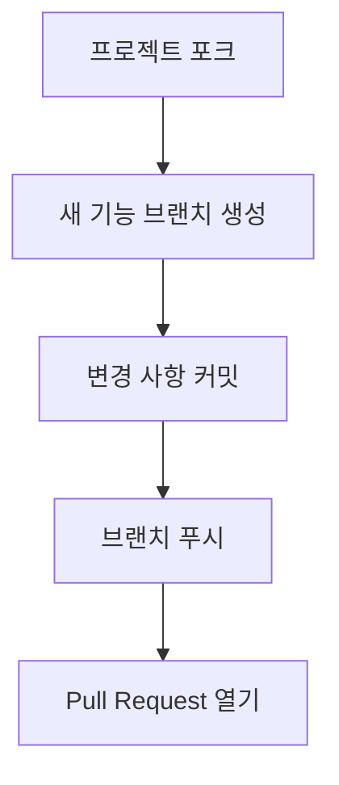
Sources: [README.md](https://github.com/catuscio/wiki-as-readme/blob/main/README.md#contributing)

### 2.2. 개발 환경 설정

로컬에서 프로젝트를 개발하고 테스트하기 위한 환경 설정 방법입니다.

**전제 조건:** Python 3.12+, [uv](https://github.com/astral-sh/uv)

1.  **저장소 클론 및 의존성 설치:**
    ```bash
    git clone https://github.com/catuscio/wiki-as-readme.git
    cd wiki-as-readme
    uv sync
    source .venv/bin/activate
    ```
2.  **.env 파일 설정:**
    `.env example` 파일을 `.env`로 복사하고 필요한 환경 변수(예: `LLM_PROVIDER`, `OPENAI_API_KEY` 등)를 설정합니다.
3.  **백엔드 실행:**
    ```bash
    uv run uvicorn src.server:app --reload --port 8000
    ```
4.  **프론트엔드 실행:**
    ```bash
    uv run streamlit run src/app.py
    ```
Sources: [README.md](https://github.com/catuscio/wiki-as-readme/blob/main/README.md#3-local-python-development)

## 3. 프로젝트 관리 및 자동화

### 3.1. 버전 동기화 워크플로우

프로젝트는 `pyproject.toml` 파일에 정의된 버전을 여러 파일에 자동으로 동기화하는 GitHub Actions 워크플로우를 사용합니다. 기여자들은 이 워크플로우가 어떻게 작동하는지 이해하는 것이 좋습니다.

**워크플로우 파일:** `.github/workflows/version-sync.yml`

**작동 방식:**
*   `main` 브랜치에 푸시되거나 수동으로 트리거될 때 실행됩니다.
*   `pyproject.toml` 파일의 변경 사항이 감지되면 워크플로우가 시작됩니다.
*   Python 스크립트 (`.github/scripts/sync_version.py`)를 실행하여 `pyproject.toml`의 `version` 값을 `src/server.py`, `Dockerfile`, `Dockerfile.action`, `Dockerfile.server` 파일에 동기화합니다.
*   변경 사항이 있을 경우, `github-actions[bot]` 사용자로 커밋하고 `main` 브랜치에 푸시합니다.

**버전 동기화 워크플로우:**
```mermaid
graph TD
    A["main 브랜치에 푸시 또는 수동 실행"] --> B{"pyproject.toml 변경 감지?"};
    B -- "예" --> C["코드 체크아웃"];
    C --> D["Python 환경 설정"];
    D --> E["버전 동기화 스크립트 실행"];
    E --> F{"파일 변경 사항 감지?"};
    F -- "예" --> G["Git 사용자 설정"];
    G --> H["변경 파일 추가 및 커밋"];
    H --> I["변경 사항 푸시"];
    B -- "아니오" --> J["워크플로우 종료"];
    F -- "아니오" --> J;
```
Sources: [.github/workflows/version-sync.yml](https://github.com/catuscio/wiki-as-readme/blob/main/.github/workflows/version-sync.yml)

## 4. 기타 중요 사항

### 4.1. 라이선스

이 프로젝트는 MIT 라이선스 하에 배포됩니다. 모든 기여는 이 라이선스 조건에 따라 이루어져야 합니다. Pull Request를 제출함으로써, 귀하의 기여가 MIT 라이선스에 따라 라이선스될 것에 동의하는 것으로 간주됩니다.
Sources: [LICENSE](https://github.com/catuscio/wiki-as-readme/blob/main/LICENSE)

### 4.2. 코드 스타일

명시적인 코드 스타일 가이드라인은 없지만, 기존 코드베이스의 스타일과 컨벤션을 따르는 것을 권장합니다. 일관된 코드 스타일은 코드 가독성과 유지보수성을 높이는 데 중요합니다.

## 5. 결론

Wiki As Readme 프로젝트에 기여해 주셔서 다시 한번 감사드립니다. 여러분의 참여는 이 프로젝트의 성장과 발전에 필수적입니다. 질문이 있거나 도움이 필요하면 언제든지 Pull Request나 이슈를 통해 문의해 주세요.

---
