# Wiki As Readme Project Wiki

A comprehensive wiki for the 'Wiki As Readme' project, an AI-powered tool that generates structured documentation from Git repositories.

## Table of Contents

- [Overview of Wiki As Readme](#overview-of-wiki-as-readme)
- [Key Features](#key-features)
- [Prerequisites and Installation](#prerequisites-and-installation)
- [Configuration Guide](#configuration-guide)
- [Running the Application](#running-the-application)
- [Docker Deployment](#docker-deployment)
- [System Architecture](#system-architecture)
- [LLM Integration](#llm-integration)
- [Wiki Generation Workflow](#wiki-generation-workflow)
- [Data Models and Schemas](#data-models-and-schemas)
- [Backend API Endpoints](#backend-api-endpoints)
- [Contributing to the Project](#contributing-to-the-project)

---

<a name="overview-of-wiki-as-readme"></a>

<details>
<summary>Relevant source files</summary>

The following files were used as context for generating this wiki page:

- [README.md](README.md)
- [LICENSE](LICENSE)
- [pyproject.toml](pyproject.toml)
</details>

# Overview of Wiki As Readme

**Wiki As Readme** is an AI-powered tool designed to transform a software project's codebase into a comprehensive, structured wiki, delivered primarily as a single consolidated `README.md` file. It automates the documentation process by analyzing Git repositories (GitHub, GitLab, Bitbucket, or local file systems) and leveraging advanced Large Language Models (LLMs) to understand code structure, generate detailed content, and create visual diagrams. The project aims to provide professional-grade documentation quickly and efficiently.
Sources: [README.md](https://github.com/catuscio/wiki-as-readme/blob/main/README.md)

## Core Purpose and Capabilities

The primary goal of Wiki As Readme is to turn a codebase into a comprehensive wiki in minutes. It achieves this by:
*   **Deep Context Analysis:** Understanding file structure and relationships to grasp the project's architecture.
*   **Smart Structure Generation:** Automatically creating a logical hierarchy (Sections > Pages) for the documentation.
*   **Comprehensive Content Generation:** Writing detailed pages covering architecture overviews, installation guides, API references, and more.
*   **Automatic Diagram Generation:** Producing Mermaid.js diagrams (Flowcharts, Sequence diagrams, Class diagrams) to visualize complex architectures.
*   **Universal Repository Support:** Working with various Git platforms and local file systems.
*   **Hybrid Output:** Generating both individual Markdown files for a wiki and a single, consolidated `README.md`.
*   **Multi-LLM Support:** Utilizing LiteLLM to integrate with a wide range of LLM providers, including Google Vertex AI (Gemini), OpenAI (GPT-4), Anthropic (Claude), xAI (Grok), Ollama, and OpenRouter.
Sources: [README.md](https://github.com/catuscio/wiki-as-readme/blob/main/README.md#--features)

## Architecture

The Wiki As Readme application is built with a clear separation of concerns, featuring a frontend for user interaction and a robust backend for processing and generation tasks.

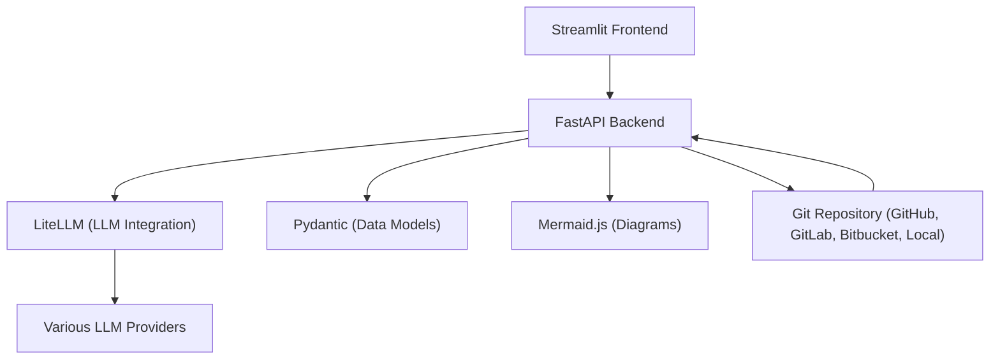
Sources: [README.md](https://github.com/catuscio/wiki-as-readme/blob/main/README.md#--architecture)

### Key Architectural Components

*   **Frontend (Streamlit):** Provides the user interface for interacting with the application. Users input repository details, configure settings, trigger wiki generation, and download results.
    Sources: [README.md](https://github.com/catuscio/wiki-as-readme/blob/main/README.md#--architecture), [pyproject.toml](https://github.com/catuscio/wiki-as-readme/blob/main/pyproject.toml#L17)
*   **Backend (FastAPI):** Serves as the REST API, handling requests from the frontend, managing background tasks for wiki generation, and orchestrating interactions with other services. It is designed to be asynchronous and scalable.
    Sources: [README.md](https://github.com/catuscio/wiki-as-readme/blob/main/README.md#--architecture), [pyproject.toml](https://github.com/catuscio/wiki-as-readme/blob/main/pyproject.toml#L10)
*   **LLM Integration (LiteLLM):** A crucial component that provides a unified interface to over 100 different Large Language Models. This allows the system to be flexible in its choice of AI backend for content generation.
    Sources: [README.md](https://github.com/catuscio/wiki-as-readme/blob/main/README.md#--architecture), [pyproject.toml](https://github.com/catuscio/wiki-as-readme/blob/main/pyproject.toml#L14)
*   **Data Models (Pydantic):** Used for type safety and validation of data structures, especially for structured output from LLMs and API requests/responses.
    Sources: [README.md](https://github.com/catuscio/wiki-as-readme/blob/main/README.md#--architecture), [pyproject.toml](https://github.com/catuscio/wiki-as-readme/blob/main/pyproject.toml#L15)
*   **Diagrams (Mermaid.js):** Integrated to generate various types of diagrams (Flowcharts, Sequence diagrams, Class diagrams) directly within the Markdown output, enhancing visual understanding of the project.
    Sources: [README.md](https://github.com/catuscio/wiki-as-readme/blob/main/README.md#--architecture), [pyproject.toml](https://github.com/catuscio/wiki-as-readme/blob/main/pyproject.toml#L18)

## Getting Started

To use Wiki As Readme, you need Python 3.12+ and `uv` for dependency management. API keys for your chosen LLM provider are also required.
Sources: [README.md](https://github.com/catuscio/wiki-as-readme/blob/main/README.md#prerequisites)

### Installation

1.  **Clone the repository:**
    ```bash
    git clone https://github.com/catuscio/wiki-as-readme.git
    cd wiki-as-readme
    ```
2.  **Install dependencies using `uv`:**
    ```bash
    # Install uv if you haven't already
    curl -LsSf https://astral.sh/uv/install.sh | sh

    # Sync dependencies
    uv sync
    ```
3.  **Activate Virtual Environment:**
    ```bash
    source .venv/bin/activate
    ```
Sources: [README.md](https://github.com/catuscio/wiki-as-readme/blob/main/README.md#installation)

### Configuration (`.env`)

The project uses a `.env` file for sensitive configurations and API keys. An example file `".env example"` is provided.
Sources: [README.md](https://github.com/catuscio/wiki-as-readme/blob/main/README.md#configuration-env)

| Category | Variable | Description | Example |
|---|---|---|---|
| **LLM Provider** | `LLM_PROVIDER` | Choose provider: `google`, `openai`, `anthropic`, `xai`, `openrouter`, `ollama` | `google` |
| | `MODEL_NAME` | Specific model identifier | `gemini-2.0-flash-exp` or `gpt-4o` |
| **Auth (Choose 1)** | `OPENAI_API_KEY` | For OpenAI provider | `sk-...` |
| | `ANTHROPIC_API_KEY`| For Anthropic provider | `sk-ant-...` |
| | `GCP_PROJECT_NAME` | **(Google Only)** Vertex AI Project ID | `my-genai-project` |
| | `GCP_MODEL_LOCATION`| **(Google Only)** Region | `us-central1` |
| **Advanced LLM** | `USE_STRUCTURED_OUTPUT`| Use native JSON mode (Requires model support) | `true` |
| **Filtering** | `IGNORED_PATTERNS` | **JSON array** of glob patterns to exclude from analysis | `'["*.log", "node_modules/*"]'` |
| **Git Access** | `GIT_API_TOKEN` | **Critical for private repos** and to avoid rate limits | `ghp_...` |
| **App Config** | `API_BASE_URL` | URL for the backend API | `http://localhost:8000/api/v1` |
| | `language` | Target language for the Wiki | `en`, `ko`, `ja` |
Sources: [README.md](https://github.com/catuscio/wiki-as-readme/blob/main/README.md#configuration-env)

**Important Configuration Notes:**
*   `USE_STRUCTURED_OUTPUT`: Recommended to be `true` for modern LLMs to improve reliability and consistency of generated wiki structures.
*   `IGNORED_PATTERNS`: Crucial for token optimization and preventing LLM distraction. It allows excluding files/directories like `node_modules` or build artifacts.
Sources: [README.md](https://github.com/catuscio/wiki-as-readme/blob/main/README.md#detailed-settings)

## Usage

The application requires both the FastAPI backend and the Streamlit UI to be running concurrently.

### 1. Start the Backend API

Open a terminal and execute:
```bash
uv run uvicorn src.server:app --reload --port 8000
```
Sources: [README.md](https://github.com/catuscio/wiki-as-readme/blob/main/README.md#1-start-the-backend-api)

### 2. Start the Streamlit UI

Open a **new** terminal window and execute:
```bash
uv run streamlit run src/app.py
```
Sources: [README.md](https://github.com/catuscio/wiki-as-readme/blob/main/README.md#2-start-the-streamlit-ui)

### 3. Generate Wiki

1.  Access the Streamlit UI in your browser (typically `http://localhost:8501`).
2.  Provide the Repository URL or Local Path.
3.  Adjust settings like "Comprehensive View" or target language.
4.  Click **✨ Generate Wiki**.
5.  Once the background process completes, preview and download the consolidated `README.md`.
Sources: [README.md](https://github.com/catuscio/wiki-as-readme/blob/main/README.md#3-generate-wiki)

## API Reference

The FastAPI backend provides an interactive Swagger documentation at `http://localhost:8000/docs` when running.
Sources: [README.md](https://github.com/catuscio/wiki-as-readme/blob/main/README.md#--api-reference)

### Wiki Generation Endpoints

*   **`POST /api/v1/wiki/generate/file`**: Initiates a background task to generate the wiki and saves it as a Markdown file on the server.
    ```json
    {
      "repo_url": "https://github.com/owner/repo",
      "repo_type": "github",
      "language": "en",
      "is_comprehensive_view": true
    }
    ```
*   **`POST /api/v1/wiki/generate/text`**: Starts a background task to generate the wiki, storing the resulting text within the task status.
*   **`GET /api/v1/wiki/status/{task_id}`**: Retrieves the current status and result of a previously initiated generation task.
Sources: [README.md](https://github.com/catuscio/wiki-as-readme/blob/main/README.md#wiki-generation)

### Webhooks

*   **`POST /api/v1/webhook/github`**: An endpoint designed for GitHub Webhooks. It can trigger automatic wiki generation upon push events to the `main` branch.
Sources: [README.md](https://github.com/catuscio/wiki-as-readme/blob/main/README.md#webhooks)

## Examples

The project provides sample outputs to demonstrate the quality and structure of the generated documentation:
*   [LangGraph Wiki Example (English)](https://github.com/catuscio/wiki-as-readme/blob/main/examples/langgraph_readme_en.md)
*   [LangGraph Wiki Example (Korean)](https://github.com/catuscio/wiki-as-readme/blob/main/examples/langgraph_readme_ko.md)
*   [Wiki As Readme's Own Wiki](https://github.com/catuscio/wiki-as-readme/blob/main/examples/wiki_as_README.md) (documentation for this project, generated by itself).
Sources: [README.md](https://github.com/catuscio/wiki-as-readme/blob/main/README.md#--examples)

## Licensing and Contributions

Wiki As Readme is licensed under the MIT License. Contributions are welcomed, encouraging users to fork the project, create feature branches, and submit Pull Requests.
Sources: [README.md](https://github.com/catuscio/wiki-as-readme/blob/main/README.md#--contributing), [README.md](https://github.com/catuscio/wiki-as-readme/blob/main/README.md#--license), [LICENSE](https://github.com/catuscio/wiki-as-readme/blob/main/LICENSE)

## Conclusion

Wiki As Readme offers a powerful, AI-driven solution for automating the creation of comprehensive and well-structured project documentation. By integrating with various LLMs and supporting diverse repository types, it significantly reduces the manual effort involved in maintaining up-to-date and informative project wikis, ultimately enhancing project understanding and collaboration.
Sources: [README.md](https://github.com/catuscio/wiki-as-readme/blob/main/README.md)

---

<a name="key-features"></a>

<details>
<summary>Relevant source files</summary>

The following files were used as context for generating this wiki page:

- [README.md](README.md)
</details>

# Key Features

## Introduction

"Wiki As Readme" is an AI-powered tool designed to transform a Git repository into a comprehensive, structured technical wiki, delivered primarily as a single `README.md` file. It leverages advanced Large Language Models (LLMs) via LiteLLM to analyze code structure, understand source files, and generate professional-grade documentation. This includes detailed content like architecture overviews, installation guides, API references, and automatically generated Mermaid diagrams for visualization. The tool aims to streamline the documentation process by automating the creation of a detailed and accessible project wiki.

Sources: [README.md](Introduction and Features sections)

## Core Documentation Generation Features

The "Wiki As Readme" tool provides a robust set of features focused on intelligent documentation generation and repository analysis.

### Multi-LLM Support
The system is powered by LiteLLM, offering broad compatibility with various Large Language Models. This allows users to choose their preferred LLM provider based on performance, cost, or specific requirements.

*   **Supported Providers:** Google Vertex AI (Gemini), OpenAI (GPT-4), Anthropic (Claude), xAI (Grok), Ollama, and OpenRouter.
Sources: [README.md](Features section)

### Deep Context Analysis
Before generating any content, the tool performs an in-depth analysis of the project's file structure and the relationships between different components. This foundational step ensures a comprehensive understanding of the project's architecture, leading to more accurate and relevant documentation.

Sources: [README.md](Features section)

### Smart Structure Generation
The system automatically determines a logical and intuitive hierarchy for the generated documentation. It organizes content into appropriate sections and pages, ensuring readability and ease of navigation for the end-user.

Sources: [README.md](Features section)

### Comprehensive Content Generation
Beyond just structure, the tool writes detailed and informative content for various aspects of the project. This includes:

*   Architecture overviews
*   Installation guides
*   API references
*   Core concepts and explanations

Sources: [README.md](Features section)

### Automatic Diagram Generation
To enhance understanding and visualize complex systems, "Wiki As Readme" automatically generates diagrams using Mermaid.js. This capability supports various diagram types to illustrate different aspects of the project:

*   **Flowcharts:** For process flows and system interactions.
*   **Sequence diagrams:** For illustrating the order of operations between components.
*   **Class diagrams:** For representing the structure of classes and their relationships.
Sources: [README.md](Features section)

### Universal Repository Support
The tool is designed to work with a wide range of Git repository hosting services and local file systems, providing flexibility for different development environments.

*   **Supported Platforms:** GitHub, GitLab, Bitbucket, and Local File Systems.
Sources: [README.md](Features section)

### Hybrid Output Generation
"Wiki As Readme" offers versatile output options to suit different documentation needs. It can generate:

*   Individual Markdown files, suitable for a traditional wiki structure.
*   A single, consolidated `README.md` file, ideal for project overviews and quick starts.
Sources: [README.md](Features section)

### Asynchronous and Scalable Architecture
Built with FastAPI and AsyncIO, the backend is designed for efficiency and scalability. This architecture supports non-blocking operations, making it capable of handling the generation of large documentations without performance bottlenecks.

Sources: [README.md](Features section)

## Advanced Configuration Features

The tool provides specific configuration options to fine-tune its behavior and optimize resource usage.

### Structured Output Mode
The `USE_STRUCTURED_OUTPUT` setting enables the use of the LLM's native structured output capabilities (e.g., JSON mode). When set to `true`, this significantly enhances the reliability of generated wiki structures and ensures consistent metadata, especially with modern LLMs.

Sources: [README.md](Configuration (.env) section)

### Ignored Patterns for Token Optimization
The `IGNORED_PATTERNS` configuration allows users to specify glob patterns for files or directories to be excluded from AI analysis. This feature is crucial for:

*   **Token Optimization:** Reducing the amount of data sent to the LLM, thereby saving costs.
*   **Focusing LLM Attention:** Preventing the LLM from being distracted by irrelevant files (e.g., `node_modules`, build artifacts, lock files).
Sources: [README.md](Configuration (.env) section)

### Configuration Variables
The following table details key configuration variables available via the `.env` file:

| Category | Variable | Description | Example |
|---|---|---|---|
| **LLM Provider** | `LLM_PROVIDER` | Choose provider: `google`, `openai`, `anthropic`, `xai`, `openrouter`, `ollama` | `google` |
| | `MODEL_NAME` | Specific model identifier | `gemini-2.0-flash-exp` or `gpt-4o` |
| **Auth (Choose 1)** | `OPENAI_API_KEY` | For OpenAI provider | `sk-...` |
| | `ANTHROPIC_API_KEY` | For Anthropic provider | `sk-ant-...` |
| | `GCP_PROJECT_NAME` | **(Google Only)** Vertex AI Project ID | `my-genai-project` |
| | `GCP_MODEL_LOCATION` | **(Google Only)** Region | `us-central1` |
| **Advanced LLM** | `USE_STRUCTURED_OUTPUT` | Use native JSON mode (Requires model support) | `true` |
| **Filtering** | `IGNORED_PATTERNS` | **JSON array** of glob patterns to exclude from analysis | `'["*.log", "node_modules/*"]'` |
| **Git Access** | `GIT_API_TOKEN` | **Critical for private repos** and to avoid rate limits | `ghp_...` |
| **App Config** | `API_BASE_URL` | URL for the backend API | `http://localhost:8000/api/v1` |
| | `language` | Target language for the Wiki | `en`, `ko`, `ja` |

Sources: [README.md](Configuration (.env) section)

## Architectural Components

The "Wiki As Readme" project is built upon a modern, modular architecture, leveraging several key technologies to deliver its features.

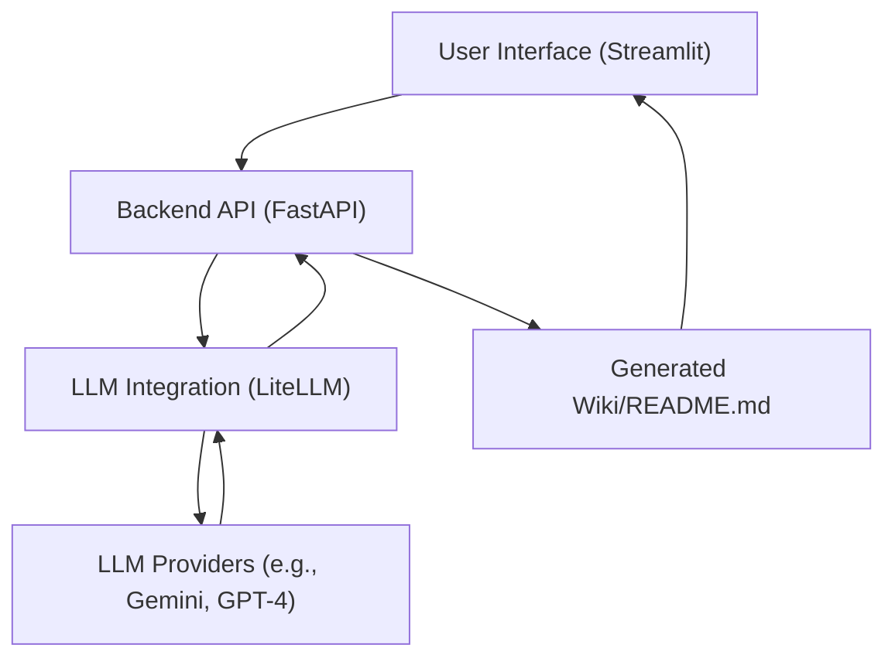

*   **Frontend (Streamlit):** Provides an interactive and user-friendly web interface for configuring and initiating wiki generation.
*   **Backend (FastAPI):** Serves as the REST API, handling requests, managing background tasks, and orchestrating the documentation generation process.
*   **LLM Integration (LiteLLM):** Acts as a unified interface, abstracting away the complexities of interacting with over 100 different LLM providers.
*   **Data Models (Pydantic):** Ensures type safety and facilitates structured output validation, crucial for reliable data handling and LLM interactions.
*   **Diagrams (Mermaid.js):** The technology used by the tool itself to generate visual representations within the documentation.

Sources: [README.md](Architecture section)

## API Endpoints

The backend API, built with FastAPI, exposes several endpoints for programmatic interaction and wiki generation.

| Endpoint | Method | Description |
|---|---|---|
| `/api/v1/wiki/generate/file` | `POST` | Initiates a background task to generate the wiki and saves it as a Markdown file on the server. |
| `/api/v1/wiki/generate/text` | `POST` | Initiates a background task to generate the wiki, storing the resulting text within the task status. |
| `/api/v1/wiki/status/{task_id}` | `GET` | Retrieves the current status and the final result of a previously initiated generation task. |
| `/api/v1/webhook/github` | `POST` | Serves as an endpoint for GitHub webhooks (specifically Push events), triggering automatic wiki generation upon pushes to the `main` branch. |

Sources: [README.md](API Reference section)

## Conclusion

The "Wiki As Readme" project offers a powerful and flexible solution for automated documentation. Its key features, ranging from multi-LLM support and deep context analysis to automatic diagram generation and universal repository compatibility, enable developers to quickly transform their codebase into comprehensive, structured, and easily maintainable technical wikis. The robust FastAPI backend and Streamlit frontend provide a scalable and user-friendly experience, making high-quality documentation more accessible than ever.

Sources: [README.md](Summary of project capabilities)

---

<a name="prerequisites-and-installation"></a>

<details>
<summary>Relevant source files</summary>

The following files were used as context for generating this wiki page:

- [README.md](README.md)
- [Dockerfile](Dockerfile)
- [pyproject.toml](pyproject.toml)
- [.python-version](.python-version)
</details>

# Prerequisites and Installation

This document outlines the necessary prerequisites and detailed steps to install and set up the "Wiki As Readme" project. Following these instructions will enable you to run the application, which leverages AI to generate comprehensive documentation from your codebase. The project is designed to be easy to set up, requiring a Python environment and specific tools for dependency management and configuration.

Sources: [README.md](Introduction), [pyproject.toml](project section)

## Prerequisites

Before proceeding with the installation, ensure your system meets the following requirements:

### 1. Python Environment

The "Wiki As Readme" project requires Python version 3.12 or higher.
Sources: [README.md](Prerequisites section), [pyproject.toml](requires-python), [.python-version](file content)

### 2. Dependency Management Tool

`uv` is the recommended tool for managing project dependencies. It is a fast Python package installer and resolver.
Sources: [README.md](Prerequisites section), [Dockerfile](builder stage)

### 3. API Keys for LLM Providers

To utilize the AI-powered documentation generation, you will need API keys for your chosen Large Language Model (LLM) provider. The project supports various providers via LiteLLM.
Sources: [README.md](Prerequisites section), [README.md](Configuration (.env) table)

*   **Google Cloud Project:** For Google Vertex AI (Gemini), you'll need a project name and location. Additionally, local authentication via `gcloud auth application-default login` is required.
    Sources: [README.md](Configuration (.env) table), [README.md](Note for Google Vertex AI Users)
*   **OpenAI API Key:** For OpenAI models (GPT-4).
    Sources: [README.md](Configuration (.env) table)
*   **Anthropic API Key:** For Anthropic models (Claude).
    Sources: [README.md](Configuration (.env) table)
*   Other providers like xAI, Ollama, and OpenRouter also require appropriate authentication, typically API keys.
    Sources: [README.md](Features section), [README.md](Configuration (.env) table)

## Installation

Follow these steps to get the "Wiki As Readme" project up and running on your local machine.

### 1. Clone the Repository

First, clone the project repository from GitHub to your local machine using Git.
Sources: [README.md](Installation section)

```bash
git clone https://github.com/catuscio/wiki-as-readme.git
cd wiki-as-readme
```

### 2. Install Dependencies using `uv`

Install `uv` if you don't have it, then use it to synchronize the project's dependencies.
Sources: [README.md](Installation section), [Dockerfile](builder stage)

```bash
# Install uv if you haven't already
curl -LsSf https://astral.sh/uv/install.sh | sh

# Sync dependencies
uv sync
```

### 3. Activate Virtual Environment

After installing dependencies, activate the newly created Python virtual environment. This ensures that project-specific packages are isolated from your system's global Python environment.
Sources: [README.md](Installation section)

```bash
source .venv/bin/activate
```

## Configuration (`.env`)

The project uses a `.env` file to manage configuration settings, including LLM provider details and API keys.
Sources: [README.md](Configuration (.env) section)

### 1. Copy the Example Environment File

Create your `.env` file by copying the provided example.
Sources: [README.md](Configuration (.env) section)

```bash
cp ".env example" .env
```

### 2. Edit `.env` Variables

Open the newly created `.env` file and set the required variables according to your chosen LLM provider and project needs.
Sources: [README.md](Configuration (.env) section)

| Category | Variable | Description | Example |
|---|---|---|---|
| **LLM Provider** | `LLM_PROVIDER` | Choose provider: `google`, `openai`, `anthropic`, `xai`, `openrouter`, `ollama` | `google` |
| | `MODEL_NAME` | Specific model identifier | `gemini-2.0-flash-exp` or `gpt-4o` |
| **Auth (Choose 1)** | `OPENAI_API_KEY` | For OpenAI provider | `sk-...` |
| | `ANTHROPIC_API_KEY` | For Anthropic provider | `sk-ant-...` |
| | `GCP_PROJECT_NAME` | **(Google Only)** Vertex AI Project ID | `my-genai-project` |
| | `GCP_MODEL_LOCATION` | **(Google Only)** Region | `us-central1` |
| **Advanced LLM** | `USE_STRUCTURED_OUTPUT` | Use native JSON mode (Requires model support) | `true` |
| **Filtering** | `IGNORED_PATTERNS` | **JSON array** of glob patterns to exclude from analysis | `'["*.log", "node_modules/*"]'` |
| **Git Access** | `GIT_API_TOKEN` | **Critical for private repos** and to avoid rate limits | `ghp_...` |
| **App Config** | `API_BASE_URL` | URL for the backend API | `http://localhost:8000/api/v1` |
| | `language` | Target language for the Wiki | `en`, `ko`, `ja` |

Sources: [README.md](Configuration (.env) table)

#### Detailed Settings

*   **`USE_STRUCTURED_OUTPUT`**: Setting this to `true` enables the LLM's native structured output capabilities (e.g., JSON mode), which significantly enhances the reliability and consistency of generated wiki structures and metadata. It is recommended to keep this `true` for modern LLMs.
    Sources: [README.md](Detailed Settings section)
*   **`IGNORED_PATTERNS`**: This variable allows you to specify glob patterns for files or directories that should be excluded from AI analysis. This is crucial for optimizing token usage and preventing the LLM from processing irrelevant content like large dependency folders (`node_modules`) or build artifacts. The value must be a single-line JSON array string.
    Sources: [README.md](Detailed Settings section)

## Running the Application

The "Wiki As Readme" application consists of two main components: a FastAPI Backend and a Streamlit Frontend. Both need to be running for the application to function correctly.
Sources: [README.md](Usage section)

### 1. Start the Backend API

Open a terminal and execute the following command to start the FastAPI backend server. The `--reload` flag enables automatic restarts on code changes, useful for development.
Sources: [README.md](Start the Backend API section), [Dockerfile](CMD instruction)

```bash
uv run uvicorn src.server:app --reload --port 8000
```

### 2. Start the Streamlit UI

Open a **new** terminal window and run the Streamlit frontend application. This will launch the user interface in your web browser.
Sources: [README.md](Start the Streamlit UI section)

```bash
uv run streamlit run src/app.py
```

### 3. Generate Wiki

Once both the backend and frontend are running:
Sources: [README.md](Generate Wiki section)

1.  Navigate to the URL provided by Streamlit in your browser (typically `http://localhost:8501`).
2.  Enter the repository URL (e.g., `https://github.com/owner/repo`) or a local path to your codebase.
3.  Adjust settings like "Comprehensive View" or target language if desired.
4.  Click the "✨ Generate Wiki" button.
5.  The generation process will run in the background.
6.  Upon completion, you can preview the generated content and download the consolidated `README.md` file.

## Docker Support

For containerized deployment, the API server can be run using Docker Compose.
Sources: [README.md](Docker Support section), [Dockerfile](file content)

```bash
docker-compose up --build
```
Note that this command primarily starts the API server. For a complete Dockerized solution including the Streamlit frontend, further adaptation of the `docker-compose.yml` file would be required.
Sources: [README.md](Docker Support section)

## Conclusion

By following these prerequisites and installation steps, you will have the "Wiki As Readme" application successfully set up and ready to generate comprehensive documentation for your projects. Proper configuration of the `.env` file, especially regarding LLM API keys and ignored patterns, is crucial for optimal performance and cost efficiency.

---

<a name="configuration-guide"></a>

<details>
<summary>Relevant source files</summary>

The following files were used as context for generating this wiki page:

- [README.md](README.md)
- [.env example](.env example)
- [src/core/config.py](src/core/config.py)
</details>

# Configuration Guide

## Introduction

The "Wiki As Readme" project relies on a robust and flexible configuration system to manage its operational parameters, particularly those related to Large Language Models (LLMs), API keys, and repository access. This guide details how to configure the application, focusing on environment variables defined in the `.env` file and their internal handling by the `src/core/config.py` module. Proper configuration is essential for the application to connect to LLM providers, access repositories, and tailor the wiki generation process to specific needs.

The configuration system is designed for ease of use and security, leveraging environment variables to keep sensitive information out of the codebase and Pydantic for structured validation and default values.

## Configuration Management Overview

The application's configuration is primarily managed through two components:
1.  **`.env` file**: An external file used to define environment variables specific to the deployment. This file is not committed to version control and typically contains sensitive information like API keys.
2.  **`src/core/config.py`**: An internal Python module that uses `Pydantic Settings` to load, validate, and provide access to these environment variables throughout the application. It defines the structure and default values for all configurable parameters.

This separation ensures that configuration is both flexible for different environments and securely handled.

Sources: [README.md](Configuration (`.env`) section), [.env example](.env example), [src/core/config.py](src/core/config.py)

## `.env` File Configuration

The `.env` file is the primary interface for users to customize the application's behavior. An example file, `.env example`, is provided to illustrate the available options. To configure the application, users should copy `.env example` to `.env` and populate the variables.

Sources: [README.md](Configuration (`.env`) section), [.env example](.env example)

### Key Configuration Variables

The following table details the essential variables that can be set in the `.env` file:

| Category | Variable | Description | Example Value |
|---|---|---|---|
| **LLM Provider** | `LLM_PROVIDER` | Specifies the Large Language Model provider to use. Supported options include `google`, `openai`, `anthropic`, `xai`, `openrouter`, `ollama`. | `google` |
| | `MODEL_NAME` | The specific identifier for the chosen LLM model. | `gemini-2.0-flash-exp` or `gpt-4o` |
| **Auth** | `OPENAI_API_KEY` | API key for OpenAI services. | `sk-...` |
| | `ANTHROPIC_API_KEY` | API key for Anthropic services. | `sk-ant-...` |
| | `OPENROUTER_API_KEY` | API key for OpenRouter services. | (Your OpenRouter Key) |
| | `XAI_API_KEY` | API key for xAI services. | (Your xAI Key) |
| | `GCP_PROJECT_NAME` | **(Google Only)** The Google Cloud Project ID for Vertex AI. | `my-genai-project` |
| | `GCP_MODEL_LOCATION` | **(Google Only)** The region for Google Vertex AI models. | `us-central1` |
| **Advanced LLM** | `LLM_BASE_URL` | Optional custom base URL for the LLM API, useful for local models like Ollama or proxies. | `http://localhost:11434/v1` |
| | `USE_STRUCTURED_OUTPUT` | When `true`, enables the LLM's native structured JSON output mode, improving reliability for modern models. | `true` |
| | `temperature` | Controls the randomness of LLM output. `0.0` for deterministic, `1.0` for creative. | `0.0` |
| | `max_retries` | Maximum number of retry attempts for failed LLM requests. | `3` |
| | `max_concurrency` | Limits the number of parallel LLM calls to prevent rate limiting. | `5` |
| **Filtering** | `IGNORED_PATTERNS` | A JSON array string of glob patterns to exclude files/directories from LLM analysis. Crucial for token optimization. | `'["*.log", "node_modules/*"]'` |
| **Git Access** | `GIT_API_TOKEN` | Personal access token for GitHub/GitLab, necessary for private repositories or to avoid rate limits. | `ghp_...` |
| **App Config** | `language` | Target language for the generated Wiki. | `en`, `ko`, `ja` |

Sources: [README.md](Configuration (`.env`) section, Detailed Settings), [.env example](.env example)

### Important Notes on Specific Settings

*   **`USE_STRUCTURED_OUTPUT`**: This setting is highly recommended to be `true` for modern LLMs (e.g., Gemini 1.5 Pro/Flash, GPT-4o, Claude 3.5 Sonnet) as it significantly enhances the reliability and consistency of generated wiki structures.
    Sources: [README.md](Detailed Settings - `USE_STRUCTURED_OUTPUT`)
*   **`IGNORED_PATTERNS`**: This variable is critical for managing LLM token usage and focus. By excluding irrelevant files (e.g., `node_modules`, build artifacts, lock files, image assets), you can reduce costs and improve the quality of the LLM's analysis. The value must be a single-line JSON array string. If defined in `.env`, it overrides the default list in `src/core/config.py`.
    Sources: [README.md](Detailed Settings - `IGNORED_PATTERNS`), [.env example](IGNORED_PATTERNS comment)
*   **Google Vertex AI Users**: If `LLM_PROVIDER` is set to `google`, you must authenticate your local environment using the `gcloud` CLI: `gcloud auth application-default login`.
    Sources: [README.md](Note for Google Vertex AI Users)

## `src/core/config.py` - Internal Configuration

The `src/core/config.py` module defines the `Settings` class, which inherits from `pydantic_settings.BaseSettings`. This class is responsible for loading environment variables from the `.env` file, providing default values, and ensuring type safety for all configuration parameters.

Sources: [src/core/config.py](src/core/config.py)

### `Settings` Class Attributes

The `Settings` class declares all configurable parameters with their expected types and default values:

```python
class Settings(BaseSettings):
    LLM_PROVIDER: Literal[
        "google", "openai", "anthropic", "openrouter", "xai", "ollama"
    ] = "google"
    MODEL_NAME: str = "gemini-2.5-flash"

    OPENAI_API_KEY: str | None = None
    ANTHROPIC_API_KEY: str | None = None
    OPENROUTER_API_KEY: str | None = None
    XAI_API_KEY: str | None = None
    LLM_BASE_URL: str | None = None
    USE_STRUCTURED_OUTPUT: bool = True

    temperature: float = 0.0
    max_retries: int = 3
    max_concurrency: int = 5

    GIT_API_TOKEN: str | None = None

    language: (
        Literal["ko", "en", "ja", "zh", "zh-tw", "es", "vi", "pt-br", "fr", "ru"] | None
    ) = None

    GCP_PROJECT_NAME: str | None = None
    GCP_MODEL_LOCATION: str | None = None

    IGNORED_PATTERNS: list[str] = [
        # ... default patterns ...
    ]

    model_config = SettingsConfigDict(
        env_file=".env", env_file_encoding="utf-8", extra="ignore"
    )
```

Sources: [src/core/config.py](Settings class)

*   **Type Hinting**: Each attribute has a type hint (e.g., `str`, `bool`, `float`, `list[str]`, `Literal`) which Pydantic uses for validation. `| None` indicates that the variable is optional.
*   **Default Values**: If an environment variable is not set in the `.env` file, the default value specified in the `Settings` class will be used. For example, `LLM_PROVIDER` defaults to `"google"`.
*   **`model_config`**: The `SettingsConfigDict` within `model_config` specifies that Pydantic should load variables from a file named `.env` using UTF-8 encoding. The `extra="ignore"` setting means that any variables in the `.env` file not explicitly defined in the `Settings` class will be ignored, preventing errors.
    Sources: [src/core/config.py](model_config)
*   **Default `IGNORED_PATTERNS`**: The `Settings` class includes a comprehensive default list of `IGNORED_PATTERNS` to exclude common irrelevant files and directories. This list is overridden if `IGNORED_PATTERNS` is explicitly set in the `.env` file.
    Sources: [src/core/config.py](IGNORED_PATTERNS attribute)

## Configuration Loading Flow

The application loads its configuration in a straightforward manner:

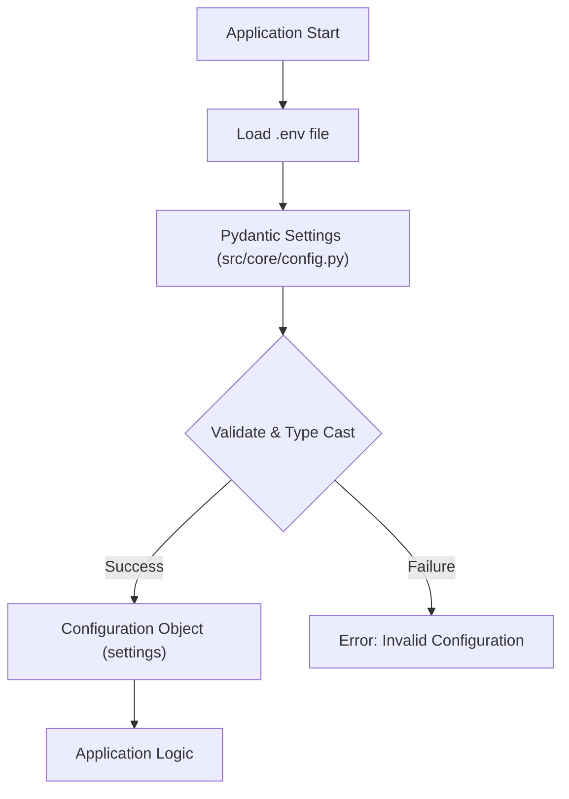

Sources: [src/core/config.py](Settings class, model_config), [README.md](Configuration (`.env`) section)

## Conclusion

The configuration system of "Wiki As Readme," built upon `.env` files and Pydantic Settings, provides a robust, secure, and user-friendly way to manage application parameters. By understanding and correctly utilizing the variables detailed in this guide, users can effectively tailor the application's behavior, connect to various LLM providers, and optimize the wiki generation process for their specific project needs. This structured approach ensures both flexibility in deployment and reliability in operation.

---

<a name="running-the-application"></a>

<details>
<summary>Relevant source files</summary>

The following files were used as context for generating this wiki page:

- [README.md](README.md)
- [src/server.py](src/server.py)
- [src/app.py](src/app.py)
</details>

# Running the Application

This document outlines the process for setting up and running the "Wiki As Readme" application. The application consists of two main components: a FastAPI backend API and a Streamlit frontend user interface. Both components must be running for the application to function correctly.

The FastAPI backend handles the core logic of repository analysis, LLM interaction, and wiki generation, while the Streamlit frontend provides an intuitive web interface for users to configure and trigger the generation process.

## Prerequisites

Before running the application, ensure the following prerequisites are met:

*   **Python 3.12** or higher.
*   **`uv`**: A fast Python package installer and resolver, recommended for dependency management.
*   **API Keys**: For your chosen Large Language Model (LLM) provider (e.g., Google Cloud Project credentials, OpenAI API Key).

Sources: [https://github.com/catuscio/wiki-as-readme/blob/main/README.md](Prerequisites section)

## Installation

To get the application ready for execution, follow these steps:

1.  **Clone the repository**:
    ```bash
    git clone https://github.com/catuscio/wiki-as-readme.git
    cd wiki-as-readme
    ```
    Sources: [https://github.com/catuscio/wiki-as-readme/blob/main/README.md](Installation section)

2.  **Install dependencies using `uv`**:
    If `uv` is not installed, first install it:
    ```bash
    curl -LsSf https://astral.sh/uv/install.sh | sh
    ```
    Then, sync the project dependencies:
    ```bash
    uv sync
    ```
    Sources: [https://github.com/catuscio/wiki-as-readme/blob/main/README.md](Installation section)

3.  **Activate Virtual Environment**:
    ```bash
    source .venv/bin/activate
    ```
    Sources: [https://github.com/catuscio/wiki-as-readme/blob/main/README.md](Installation section)

## Configuration

The application uses a `.env` file for configuration, primarily for LLM settings and API keys.

1.  **Copy the example file**:
    ```bash
    cp ".env example" .env
    ```
    Sources: [https://github.com/catuscio/wiki-as-readme/blob/main/README.md](Configuration (.env) section)

2.  **Edit `.env`**: Set the required variables according to your LLM provider and project needs.

    | Category | Variable | Description | Example |
    |---|---|---|---|
    | **LLM Provider** | `LLM_PROVIDER` | Choose provider: `google`, `openai`, `anthropic`, `xai`, `openrouter`, `ollama` | `google` |
    | | `MODEL_NAME` | Specific model identifier | `gemini-2.0-flash-exp` or `gpt-4o` |
    | **Auth (Choose 1)** | `OPENAI_API_KEY` | For OpenAI provider | `sk-...` |
    | | `ANTHROPIC_API_KEY`| For Anthropic provider | `sk-ant-...` |
    | | `GCP_PROJECT_NAME` | **(Google Only)** Vertex AI Project ID | `my-genai-project` |
    | | `GCP_MODEL_LOCATION`| **(Google Only)** Region | `us-central1` |
    | **Advanced LLM** | `USE_STRUCTURED_OUTPUT`| Use native JSON mode (Requires model support) | `true` |
    | **Filtering** | `IGNORED_PATTERNS` | **JSON array** of glob patterns to exclude from analysis | `'["*.log", "node_modules/*"]'` |
    | **Git Access** | `GIT_API_TOKEN` | **Critical for private repos** and to avoid rate limits | `ghp_...` |
    | **App Config** | `API_BASE_URL` | URL for the backend API | `http://localhost:8000/api/v1` |
    | | `language` | Target language for the Wiki | `en`, `ko`, `ja` |

    Sources: [https://github.com/catuscio/wiki-as-readme/blob/main/README.md](Configuration (.env) section)

    **Note for Google Vertex AI Users:** You must authenticate your local environment using `gcloud`:
    ```bash
    gcloud auth application-default login
    ```
    Sources: [https://github.com/catuscio/wiki-as-readme/blob/main/README.md](Note for Google Vertex AI Users)

## Application Components and Execution

The application is split into a backend API and a frontend UI, which must be run separately.

### 1. FastAPI Backend

The backend is built with FastAPI and serves as the core processing engine. It exposes API endpoints for triggering wiki generation, checking task status, and handling webhooks.

To start the backend API:

1.  Open a terminal.
2.  Ensure your virtual environment is activated.
3.  Run the following command:
    ```bash
    uv run uvicorn src.server:app --reload --port 8000
    ```
    This command starts the Uvicorn server, hosting the FastAPI application defined in `src/server.py` on `http://127.0.0.1:8000`. The `--reload` flag enables automatic server restarts on code changes, which is useful for development.
    Sources: [https://github.com/catuscio/wiki-as-readme/blob/main/README.md](Start the Backend API section), [https://github.com/catuscio/wiki-as-readme/blob/main/src/server.py](if __name__ == "__main__" block)

### 2. Streamlit Frontend

The frontend is a Streamlit application that provides the graphical user interface for interacting with the backend. It allows users to input repository details, configure generation settings, trigger the wiki generation, and view/download the results.

To start the Streamlit UI:

1.  Open a **new** terminal window (separate from the backend terminal).
2.  Ensure your virtual environment is activated.
3.  Run the following command:
    ```bash
    uv run streamlit run src/app.py
    ```
    This command launches the Streamlit application defined in `src/app.py`, which will typically open in your web browser at `http://localhost:8501`.
    Sources: [https://github.com/catuscio/wiki-as-readme/blob/main/README.md](Start the Streamlit UI section), [https://github.com/catuscio/wiki-as-readme/blob/main/src/app.py](main function)

## Overall Application Flow

The following diagram illustrates the typical flow of running the application and generating a wiki:

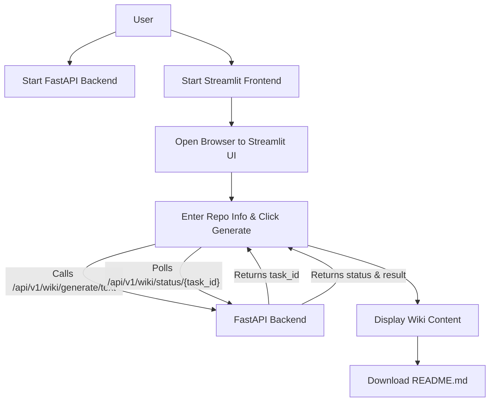

### Wiki Generation Process

Once both the backend and frontend are running, the wiki generation process involves interaction between the Streamlit UI and the FastAPI API.

1.  **Access the UI**: Open your browser to the URL provided by Streamlit (usually `http://localhost:8501`).
2.  **Input Repository Information**: In the sidebar, enter the repository URL (e.g., `https://github.com/owner/repo`) or a local file path.
3.  **Configure Settings**: Adjust settings like "Comprehensive View" or target language.
4.  **Initiate Generation**: Click the "✨ Generate Wiki" button.
    Sources: [https://github.com/catuscio/wiki-as-readme/blob/main/README.md](Generate Wiki section), [https://github.com/catuscio/wiki-as-readme/blob/main/src/app.py](render_sidebar function)

The Streamlit frontend (`src/app.py`) then initiates an asynchronous process to communicate with the FastAPI backend (`src/server.py`).

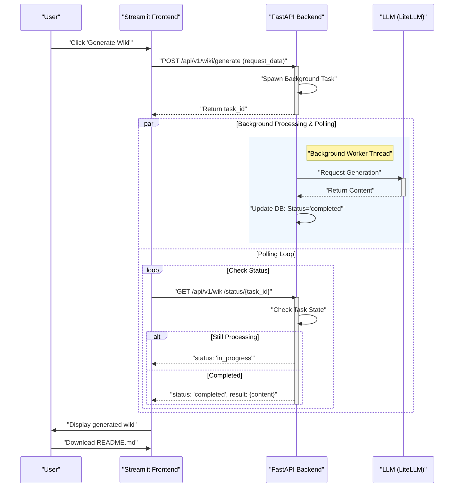
Sources: [https://github.com/catuscio/wiki-as-readme/blob/main/src/app.py](start_generation_task function), [https://github.com/catuscio/wiki-as-readme/blob/main/src/app.py](poll_task_status function), [https://github.com/catuscio/wiki-as-readme/blob/main/src/server.py](wiki.router inclusion)

The `API_BASE_URL` for the frontend defaults to `http://localhost:8000/api/v1`, which can be overridden by an environment variable.
Sources: [https://github.com/catuscio/wiki-as-readme/blob/main/src/app.py](API_BASE_URL variable)

## Docker Support

For running the API server in a containerized environment, Docker Compose is provided.

To start the API server using Docker:
```bash
docker-compose up --build
```
Note that this command currently only starts the API server on port 8000. The Streamlit application would still need to be run locally or integrated into the Docker Compose setup.
Sources: [https://github.com/catuscio/wiki-as-readme/blob/main/README.md](Docker Support section)

## Conclusion

Running the "Wiki As Readme" application involves concurrently operating its FastAPI backend and Streamlit frontend. The backend provides the robust API for AI-driven wiki generation, while the frontend offers an accessible interface for users. Proper configuration of environment variables and API keys is crucial for successful operation, especially for LLM integration.

---

<a name="docker-deployment"></a>

<details>
<summary>Relevant source files</summary>

The following files were used as context for generating this wiki page:

- [Dockerfile](Dockerfile)
- [docker-compose.yml](docker-compose.yml)
</details>

# Docker Deployment

## Introduction

This document outlines the Docker-based deployment strategy for the application, leveraging a multi-stage `Dockerfile` for efficient image creation and `docker-compose.yml` for simplified local development and deployment orchestration. The primary goal is to containerize the application, manage its dependencies, and provide a consistent execution environment.

The deployment utilizes `uv` for dependency management within the Docker build process, ensuring fast and reproducible installations. The application is served using Gunicorn with Uvicorn workers, exposed on port 8000. `docker-compose` facilitates building the Docker image, mapping ports, managing environment variables, and persisting data through volumes.

## Dockerfile: Application Image Construction

The `Dockerfile` defines the steps to build the application's Docker image. It employs a multi-stage build pattern to optimize image size and build times by separating the build environment from the runtime environment.

### Build Stages

The `Dockerfile` consists of two main stages: `builder` and the final runtime stage.

#### 1. Builder Stage

The `builder` stage is responsible for installing application dependencies and preparing the Python virtual environment.

```dockerfile
FROM python:3.12-slim-bookworm AS builder

COPY --from=ghcr.io/astral-sh/uv:latest /uv /bin/uv

WORKDIR /app

ENV UV_COMPILE_BYTECODE=1
ENV UV_LINK_MODE=copy

COPY pyproject.toml uv.lock ./

RUN uv sync --frozen --no-dev --no-install-project
```
Sources: [Dockerfile](lines 1-14)

**Key Steps:**
*   **Base Image:** Starts with `python:3.12-slim-bookworm` for a lightweight Python environment. Sources: [Dockerfile](line 1)
*   **Install `uv`:** Copies the `uv` executable from its official container image into the builder stage. `uv` is used for fast and reliable dependency resolution and installation. Sources: [Dockerfile](line 3)
*   **Working Directory:** Sets `/app` as the working directory. Sources: [Dockerfile](line 5)
*   **`uv` Environment Variables:**
    *   `UV_COMPILE_BYTECODE=1`: Ensures Python bytecode is compiled. Sources: [Dockerfile](line 7)
    *   `UV_LINK_MODE=copy`: Configures `uv` to copy rather than link installed packages, which is beneficial for containerization. Sources: [Dockerfile](line 8)
*   **Copy Project Files:** Copies `pyproject.toml` (project metadata) and `uv.lock` (locked dependencies) into the container. Sources: [Dockerfile](line 10)
*   **Install Dependencies:** Executes `uv sync` to install project dependencies into a virtual environment (`.venv`) within `/app`. The `--frozen` flag ensures that `uv.lock` is strictly adhered to, `--no-dev` excludes development dependencies, and `--no-install-project` prevents installing the project itself as an editable package. Sources: [Dockerfile](line 12)

#### 2. Final Runtime Stage

The final stage creates the lean production image, containing only the necessary components to run the application.

```dockerfile
FROM python:3.12-slim-bookworm

WORKDIR /app

COPY --from=builder /app/.venv /app/.venv

ENV PATH="/app/.venv/bin:$PATH"
ENV PYTHONPATH="/app/src"

COPY src ./src

CMD ["gunicorn", "-k", "uvicorn.workers.UvicornWorker", "-w", "4", "-b", "0.0.0.0:8000", "src.server:app"]
```
Sources: [Dockerfile](lines 16-26)

**Key Steps:**
*   **Base Image:** Again, starts with `python:3.12-slim-bookworm` for a clean, minimal runtime environment. Sources: [Dockerfile](line 16)
*   **Working Directory:** Sets `/app` as the working directory. Sources: [Dockerfile](line 18)
*   **Copy Virtual Environment:** Copies the pre-built virtual environment from the `builder` stage, avoiding the need to reinstall dependencies in the final image. Sources: [Dockerfile](line 20)
*   **Environment Variables:**
    *   `PATH="/app/.venv/bin:$PATH"`: Adds the virtual environment's `bin` directory to the `PATH`, making installed executables (like `gunicorn`) directly accessible. Sources: [Dockerfile](line 22)
    *   `PYTHONPATH="/app/src"`: Adds the application's source directory to the `PYTHONPATH`, allowing Python to find modules within `src`. Sources: [Dockerfile](line 23)
*   **Copy Source Code:** Copies the application's source code from the host into the container. Sources: [Dockerfile](line 25)
*   **Command to Run:** Defines the default command to execute when the container starts. It uses `gunicorn` with `uvicorn.workers.UvicornWorker` to serve the `src.server:app` ASGI application, binding to `0.0.0.0:8000` with 4 worker processes. Sources: [Dockerfile](line 26)

### Dockerfile Build Process Flow

The following diagram illustrates the multi-stage build process defined in the `Dockerfile`:

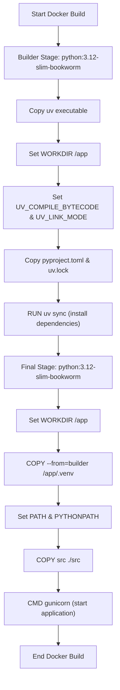

## Docker Compose Configuration

The `docker-compose.yml` file defines and runs the multi-container Docker application. In this setup, it orchestrates a single service named `api`.

```yaml
services:
  api:
    build: .
    container_name: wiki-generator-api
    ports:
      - "8000:8000"
    env_file:
      - .env
    volumes:
      - ./output:/app/output
    restart: always
```
Sources: [docker-compose.yml](lines 1-11)

### Service Definition: `api`

The `api` service is configured as follows:

| Option | Description | Source |
|---|---|---|
| `build: .` | Instructs Docker Compose to build the Docker image using the `Dockerfile` located in the current directory. | [docker-compose.yml](line 3) |
| `container_name: wiki-generator-api` | Assigns a specific, human-readable name to the container instance. | [docker-compose.yml](line 4) |
| `ports: - "8000:8000"` | Maps port 8000 on the host machine to port 8000 inside the container, allowing external access to the application. | [docker-compose.yml](lines 5-6) |
| `env_file: - .env` | Loads environment variables from a `.env` file in the project root, providing a flexible way to manage configuration without hardcoding. | [docker-compose.yml](lines 7-8) |
| `volumes: - ./output:/app/output` | Mounts the local `./output` directory into the container at `/app/output`. This is crucial for persisting any generated output from the application, ensuring data is not lost when the container is stopped or removed. | [docker-compose.yml](lines 9-10) |
| `restart: always` | Configures the container to always restart if it stops, unless explicitly stopped. This ensures high availability for the service. | [docker-compose.yml](line 11) |

### Docker Compose Service Flow

The following diagram illustrates how `docker-compose` orchestrates the `api` service:

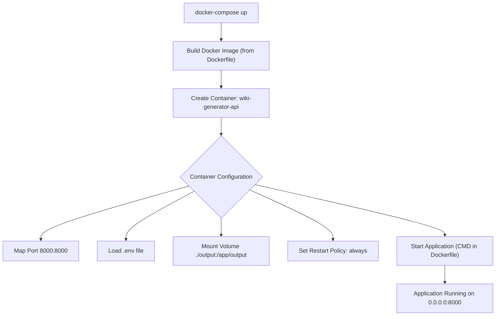

## Conclusion

The Docker deployment strategy provides a robust and reproducible method for running the application. The multi-stage `Dockerfile` ensures a lean and efficient production image, while `uv` streamlines dependency management. `docker-compose.yml` simplifies the orchestration of the application, handling image building, port exposure, environment configuration, and data persistence, making it ideal for both development and production environments.

---

<a name="system-architecture"></a>

<details>
<summary>Relevant source files</summary>

The following files were used as context for generating this wiki page:

- [README.md](README.md)
- [src/server.py](src/server.py)
- [src/app.py](src/app.py)
- [src/core/config.py](src/core/config.py)
- [src/agent/llm.py](src/agent/llm.py)
- [src/providers/base.py](src/providers/base.py)
- [src/services/repo_fetcher.py](src/services/repo_fetcher.py)
- [src/services/wiki_generator.py](src/services/wiki_generator.py)
</details>

# System Architecture

The "Wiki As Readme" project is an AI-powered tool designed to automatically generate comprehensive technical documentation from a Git repository. It leverages modern Large Language Models (LLMs) to analyze code structure, read source files, and produce detailed wiki pages, including Mermaid diagrams, which can be output as individual Markdown files or a single consolidated `README.md`.

The system is built as a hybrid application, featuring a Streamlit-based frontend for user interaction and a FastAPI backend that orchestrates the core logic, LLM interactions, and repository analysis. This modular design ensures scalability, efficient processing of documentation generation tasks, and flexibility in integrating various LLM providers.

## Overall System Design

The architecture follows a client-server model, where the Streamlit frontend acts as the client, communicating with the FastAPI backend via a RESTful API. The backend, in turn, interacts with various services for repository fetching, LLM processing, and wiki generation.

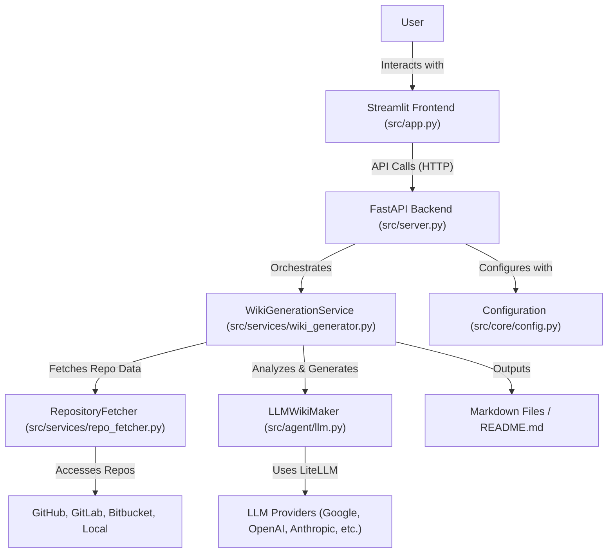
Sources: [README.md](README.md), [src/server.py](src/server.py), [src/app.py](src/app.py), [src/services/wiki_generator.py](src/services/wiki_generator.py), [src/services/repo_fetcher.py](src/services/repo_fetcher.py), [src/agent/llm.py](src/agent/llm.py), [src/core/config.py](src/core/config.py)

## Component Breakdown

### 1. Frontend: Streamlit Application

The user interface is built using Streamlit, providing an interactive way for users to input repository details and trigger wiki generation. It handles user input, displays progress, and renders the generated Markdown content.

*   **File:** `src/app.py`
*   **Key Responsibilities:**
    *   **User Input:** Collects repository URL/path, generation settings (language, comprehensive view).
    *   **API Interaction:** Initiates wiki generation tasks by sending requests to the FastAPI backend and polls for task status.
    *   **Progress Display:** Shows real-time progress and status updates during generation.
    *   **Content Rendering:** Previews the generated Markdown, including rendering Mermaid diagrams using `streamlit_mermaid`.
    *   **Download Functionality:** Allows users to download the consolidated `README.md`.
*   **Core Functions:**
    *   `main()`: Entry point for the Streamlit app, manages session state.
    *   `render_sidebar()`: Handles repository information and generation settings input.
    *   `start_generation_task()`: Sends `POST /api/v1/wiki/generate/text` request to the backend.
    *   `poll_task_status()`: Periodically sends `GET /api/v1/wiki/status/{task_id}` requests to check task completion.
    *   `render_main_content()`: Displays the final generated wiki content.

```mermaid
sequenceDiagram
    participant U as "User"
    participant SA as "Streamlit Frontend (src/app.py)"
    participant FB as "FastAPI Backend (src/server.py)"
    participant WGS as "WikiGenerationService"

    U->>SA: "Enter Repo Info & Click 'Generate Wiki'"
    SA->>FB: "POST /api/v1/wiki/generate/text (WikiGenerationRequest)"
    activate FB
    FB->>WGS: "Starts Async Wiki Generation Task"
    activate WGS
    FB-->>SA: "Returns task_id"
    deactivate FB
    loop Polling for Status
        SA->>FB: "GET /api/v1/wiki/status/{task_id}"
        activate FB
        alt Task In Progress
            FB-->>SA: "Returns {status: 'in_progress'}"
            SA->>SA: "Updates UI with progress"
        else Task Completed
            FB-->>SA: "Returns {status: 'completed', result: {markdown_content: '...'}}"
            deactivate FB
            break
        end
    end
    WGS-->>FB: "Task Completes, Stores Result"
    SA->>SA: "Renders markdown_content"
    SA->>U: "Displays Wiki & Download Option"
```
Sources: [src/app.py](src/app.py), [README.md](README.md)

### 2. Backend: FastAPI Server

The backend is a FastAPI application that exposes a REST API for wiki generation and webhook integration. It's responsible for orchestrating the complex process of fetching repository data, analyzing it, interacting with LLMs, and formatting the output.

*   **File:** `src/server.py`
*   **Key Responsibilities:**
    *   **API Endpoints:** Provides endpoints for starting generation tasks, checking task status, and handling webhooks.
    *   **Task Management:** Manages background tasks for wiki generation, allowing the frontend to poll for results.
    *   **Service Integration:** Includes routers for `wiki` generation and `webhook` integration, delegating logic to respective services.
    *   **Health Check:** Basic `/` endpoint to verify server status.
*   **Core Components:**
    *   `FastAPI` instance: `app`.
    *   `uvicorn`: Used to run the ASGI server.
    *   `src.api.v1.endpoints.wiki`: Handles wiki generation API logic.
    *   `src.api.v1.endpoints.webhook`: Handles webhook events (e.g., GitHub push events).
*   **API Reference:**
    *   `POST /api/v1/wiki/generate/file`: Starts generation and saves to a file.
    *   `POST /api/v1/wiki/generate/text`: Starts generation and stores result in task status.
    *   `GET /api/v1/wiki/status/{task_id}`: Retrieves status and result of a task.
    *   `POST /api/v1/webhook/github`: GitHub webhook endpoint for automatic generation.

Sources: [src/server.py](src/server.py), [README.md](README.md)

### 3. Core Services

The `src/services` directory contains the business logic for the application, abstracting complex operations into modular units.

#### 3.1. Wiki Generation Service

This service orchestrates the entire wiki generation pipeline, from fetching repository data to formatting the final Markdown.

*   **File:** `src/services/wiki_generator.py`
*   **Key Responsibilities:**
    *   **Pipeline Coordination:** Manages the sequence of operations: repository fetching, structure determination, content generation, and formatting.
    *   **Error Handling:** Validates requests and handles errors throughout the generation process.
    *   **Resource Management:** Ensures proper cleanup of resources (e.g., `RepositoryFetcher`).
    *   **Output Management:** Saves the generated Markdown content to a file if requested.
*   **Core Functions:**
    *   `validate_request()`: Ensures `WikiGenerationRequest` parameters are valid.
    *   `prepare_generation()`: Initializes `WikiStructureDeterminer` and fetches initial repository structure.
    *   `generate_wiki()`: The main method that executes the full generation pipeline.
    *   `_initialize_and_determine()`: Fetches repository structure using `RepositoryFetcher` and determines the wiki structure using `WikiStructureDeterminer`.
    *   `save_to_file()`: Writes the final Markdown content to a file.

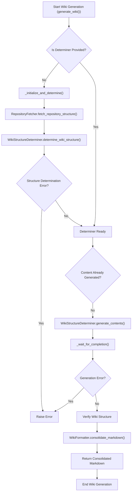
Sources: [src/services/wiki_generator.py](src/services/wiki_generator.py)

#### 3.2. Repository Fetcher

This service provides a unified interface for accessing different types of code repositories (GitHub, GitLab, Bitbucket, Local). It abstracts away the specifics of each provider.

*   **File:** `src/services/repo_fetcher.py`
*   **Key Responsibilities:**
    *   **Provider Abstraction:** Selects and instantiates the correct `RepositoryProvider` based on the `repo_type` in the request.
    *   **Structure Fetching:** Delegates to the chosen provider to fetch the repository's file tree and README.
    *   **File Content Fetching:** Delegates to the chosen provider to retrieve the content of specific files.
    *   **Resource Management:** Implements `__aenter__` and `__aexit__` for async context management to ensure client closure.
*   **Core Components:**
    *   `_PROVIDER_MAP`: A dictionary mapping `repo_type` strings to `RepositoryProvider` subclasses.
    *   `provider`: An instance of the selected `RepositoryProvider`.
*   **Core Functions:**
    *   `fetch_repository_structure()`: Calls `self.provider.fetch_structure()`.
    *   `fetch_file_content()`: Calls `self.provider.fetch_file_content()`.

Sources: [src/services/repo_fetcher.py](src/services/repo_fetcher.py)

#### 3.3. Repository Providers

The `src/providers` directory defines the interface and concrete implementations for interacting with various repository types.

*   **File:** `src/providers/base.py`
*   **Key Responsibilities:**
    *   **Abstract Interface:** Defines the common methods (`fetch_structure`, `fetch_file_content`) that all repository providers must implement.
    *   **HTTP Client:** Provides an `httpx.AsyncClient` for making asynchronous HTTP requests to remote repositories.
*   **Core Class:**
    *   `RepositoryProvider(ABC)`: An abstract base class.
*   **Abstract Methods:**
    *   `fetch_structure()`: Must be implemented by subclasses to return a `RepositoryStructure`.
    *   `fetch_file_content(file_path: str)`: Must be implemented by subclasses to return file content.

Sources: [src/providers/base.py](src/providers/base.py)

### 4. LLM Integration

The system uses LiteLLM as a unified interface to interact with various Large Language Models, abstracting away provider-specific API calls and configurations.

*   **File:** `src/agent/llm.py`
*   **Key Responsibilities:**
    *   **Unified LLM Access:** Provides a single interface (`LLMWikiMaker`) to interact with over 100 LLMs supported by LiteLLM.
    *   **Provider Configuration:** Dynamically configures LLM settings (model name, API keys, base URLs) based on the chosen provider from `src/core/config.py`.
    *   **Structured Output:** Supports native structured output (JSON mode) from LLMs when available, or extracts JSON from Markdown code blocks.
    *   **Asynchronous Invocation:** Uses `litellm.acompletion` for non-blocking LLM calls.
*   **Core Class:**
    *   `LLMWikiMaker[T: BaseModel]`: A generic class that wraps LiteLLM, allowing for type-safe structured output.
*   **Core Functions:**
    *   `_configure_llm()`: Sets up the model name and completion arguments based on `LLM_PROVIDER` (e.g., `google`, `openai`, `anthropic`, `openrouter`, `xai`, `ollama`).
    *   `ainvoke(input_data: Any)`: Asynchronously calls the LLM with the given input and processes the response, potentially validating it against a Pydantic schema.
    *   `_extract_json(text: str)`: Helper to extract JSON from Markdown code blocks.

Sources: [src/agent/llm.py](src/agent/llm.py), [README.md](README.md)

### 5. Configuration Management

Application settings, including LLM provider details, API keys, and operational parameters, are managed through a Pydantic `BaseSettings` class.

*   **File:** `src/core/config.py`
*   **Key Responsibilities:**
    *   **Centralized Settings:** Defines all configurable parameters for the application.
    *   **Environment Variable Loading:** Automatically loads settings from a `.env` file using `SettingsConfigDict`.
    *   **Type Safety:** Uses Pydantic for type validation and default values.
    *   **LLM Provider Selection:** `LLM_PROVIDER` and `MODEL_NAME` control which LLM is used.
    *   **Filtering:** `IGNORED_PATTERNS` allows excluding specific files/directories from analysis, crucial for token optimization.
*   **Core Class:**
    *   `Settings(BaseSettings)`: Defines fields like `LLM_PROVIDER`, `MODEL_NAME`, `OPENAI_API_KEY`, `GCP_PROJECT_NAME`, `GIT_API_TOKEN`, `IGNORED_PATTERNS`, etc.

#### Key Configuration Variables

| Variable | Description | Source |
|---|---|---|
| `LLM_PROVIDER` | Specifies the LLM service to use (e.g., `google`, `openai`, `anthropic`). | [src/core/config.py](src/core/config.py) |
| `MODEL_NAME` | The specific model identifier for the chosen LLM provider. | [src/core/config.py](src/core/config.py) |
| `OPENAI_API_KEY` | API key for OpenAI services. | [src/core/config.py](src/core/config.py) |
| `ANTHROPIC_API_KEY` | API key for Anthropic services. | [src/core/config.py](src/core/config.py) |
| `GCP_PROJECT_NAME` | Google Cloud Project ID for Vertex AI. | [src/core/config.py](src/core/config.py) |
| `GCP_MODEL_LOCATION` | Region for Google Vertex AI models. | [src/core/config.py](src/core/config.py) |
| `USE_STRUCTURED_OUTPUT` | Enables native JSON mode for LLMs if supported, improving reliability. | [src/core/config.py](src/core/config.py) |
| `IGNORED_PATTERNS` | JSON array of glob patterns to exclude files/directories from analysis. | [src/core/config.py](src/core/config.py) |
| `GIT_API_TOKEN` | API token for accessing private repositories or avoiding rate limits. | [src/core/config.py](src/core/config.py) |
| `API_BASE_URL` | URL for the backend API, used by the Streamlit frontend. | [src/app.py](src/app.py) |
| `language` | Target language for the generated wiki. | [src/core/config.py](src/core/config.py) |

Sources: [src/core/config.py](src/core/config.py), [README.md](README.md), [src/app.py](src/app.py)

## Conclusion

The "Wiki As Readme" system architecture is designed for modularity, extensibility, and efficiency. By separating the frontend, backend, and core services, and leveraging powerful tools like FastAPI, Streamlit, and LiteLLM, it provides a robust platform for automated, AI-driven documentation generation across various repository types and LLM providers. The clear separation of concerns, from configuration to LLM interaction and repository access, allows for easy maintenance and future enhancements.

---

<a name="llm-integration"></a>

<details>
<summary>Relevant source files</summary>

The following files were used as context for generating this wiki page:

- [src/agent/llm.py](src/agent/llm.py)
- [src/core/config.py](src/core/config.py)
- [src/prompts/wiki_contents_generator.yaml](src/prompts/wiki_contents_generator.yaml)
- [src/prompts/wiki_structure_generator.yaml](src/prompts/wiki_structure_generator.yaml)
</details>

# LLM Integration

## Introduction

The LLM Integration component provides a robust and flexible interface for interacting with various Large Language Models (LLMs) within the project, primarily for wiki generation tasks. It leverages the LiteLLM library to abstract away the complexities of different LLM providers, offering a unified API for model invocation, configuration, and structured output parsing. This integration is crucial for dynamically generating wiki content and structures based on source code analysis and predefined prompts.

The core of this integration is the `LLMWikiMaker` class, which handles model selection, API key management, and response processing, including support for type-safe structured outputs using Pydantic schemas. Configuration is managed centrally via the `Settings` class, allowing easy switching between LLM providers and fine-tuning model parameters.

## Core Components

### 1. Configuration Management (`src/core/config.py`)

The `src.core.config.py` file defines the `Settings` class, which uses Pydantic Settings to manage all application-wide configurations, including those pertinent to LLM integration. These settings are loaded from environment variables or a `.env` file, ensuring sensitive information like API keys is not hardcoded.

Sources: [src/core/config.py](Settings class)

#### Key LLM-Related Settings

| Parameter | Type | Description | Default |
|---|---|---|---|
| `LLM_PROVIDER` | `Literal` | Specifies the LLM service provider (e.g., "google", "openai", "anthropic"). | "google" |
| `MODEL_NAME` | `str` | The specific model identifier to use (e.g., "gemini-2.5-flash", "gpt-4o"). | "gemini-2.5-flash" |
| `OPENAI_API_KEY` | `str \| None` | API key for OpenAI models. | `None` |
| `ANTHROPIC_API_KEY` | `str \| None` | API key for Anthropic models. | `None` |
| `OPENROUTER_API_KEY` | `str \| None` | API key for OpenRouter models. | `None` |
| `XAI_API_KEY` | `str \| None` | API key for xAI models. | `None` |
| `LLM_BASE_URL` | `str \| None` | Custom base URL for LLM API endpoints (e.g., for local Ollama instances or proxy). | `None` |
| `USE_STRUCTURED_OUTPUT` | `bool` | Flag to enable or disable native structured output features of LiteLLM. | `True` |
| `temperature` | `float` | Controls the randomness of the LLM's output. Lower values make output more deterministic. | `0.0` |
| `max_retries` | `int` | Maximum number of retries for LLM API calls in case of failure. | `3` |
| `GCP_PROJECT_NAME` | `str \| None` | Google Cloud Project name for Vertex AI models. | `None` |
| `GCP_MODEL_LOCATION` | `str \| None` | Google Cloud region for Vertex AI models. | `None` |

### 2. LLM Wrapper (`src/agent/llm.py`)

The `src.agent.llm.py` module contains the `LLMWikiMaker` class, which acts as the primary interface for all LLM interactions. It wraps LiteLLM, providing a streamlined way to invoke LLMs with specific configurations and handle their responses, especially for structured data.

Sources: [src/agent/llm.py](LLMWikiMaker class)

#### `LLMWikiMaker` Class

The `LLMWikiMaker` class is designed for:
*   **Unified LLM Access:** Provides a single entry point for interacting with various LLM providers.
*   **Structured Output:** Supports type-safe structured output by integrating Pydantic schemas, allowing the LLM to generate JSON that conforms to a predefined model.
*   **Provider-Specific Configuration:** Automatically handles the nuances of different LLM providers, including API key management and model naming conventions.

Sources: [src/agent/llm.py](LLMWikiMaker class docstring)

#### Initialization (`__init__`)

Upon instantiation, `LLMWikiMaker` takes an optional `response_schema` (a Pydantic `BaseModel` type) to enable structured output. It then calls `_configure_llm` to set up the model name and completion arguments.

Sources: [src/agent/llm.py](LLMWikiMaker.__init__ method)

#### LLM Configuration (`_configure_llm`)

This private method dynamically configures the LLM based on the `LLM_PROVIDER` and `MODEL_NAME` settings. It handles:
*   **Provider Prefixes:** Adds necessary prefixes (e.g., `vertex_ai/`, `openai/`) to the `MODEL_NAME`.
*   **API Key Management:** Sets environment variables for API keys if they are provided in `Settings` but not already in `os.environ`.
*   **Provider-Specific Arguments:** Adds arguments like `vertex_project`, `vertex_location` for Google Vertex AI, or `api_base` for OpenAI/Ollama.
*   **Global Settings:** Applies `temperature` and `max_retries` from `Settings` to all LLM calls.

Sources: [src/agent/llm.py](LLMWikiMaker._configure_llm method)

#### Asynchronous Invocation (`ainvoke`)

The `ainvoke` method is the primary way to call the LLM. It performs the following steps:
1.  **Input Processing:** Converts the `input_data` into a prompt string, supporting objects with a `to_string()` method.
2.  **LLM Call Settings:** Constructs the `call_kwargs` for `litellm.acompletion`, including the model, messages, and global completion arguments.
3.  **Structured Output:** If `response_schema` is provided and `USE_STRUCTURED_OUTPUT` is enabled, it adds `response_format` to `call_kwargs`, instructing LiteLLM to attempt structured JSON output.
4.  **LLM Call:** Asynchronously calls `litellm.acompletion`.
5.  **Response Parsing:**
    *   If LiteLLM natively parsed the response into a Pydantic model (Case A), it returns the parsed object.
    *   If the model returns a JSON string (e.g., within a Markdown code block), it attempts to extract and validate it against the `response_schema` (Case B), using `_extract_json` if `USE_STRUCTURED_OUTPUT` is false.
    *   If no `response_schema` is set, it returns the raw content as a string.

Sources: [src/agent/llm.py](LLMWikiMaker.ainvoke method)

#### JSON Extraction (`_extract_json`)

This helper method is used when `USE_STRUCTURED_OUTPUT` is disabled or the LLM returns JSON embedded in a Markdown code block (e.g., ````json ... ````). It uses regular expressions to extract the JSON string, ensuring it can be parsed by Pydantic.

Sources: [src/agent/llm.py](LLMWikiMaker._extract_json method)

### 3. Prompt Templates (`src/prompts/*.yaml`)

The project utilizes Jinja2-based YAML prompt templates to define the instructions and context for LLM interactions. These templates are critical for guiding the LLM to generate specific types of output, such as wiki page content or wiki structure definitions.

Sources: [src/prompts/wiki_contents_generator.yaml](template), [src/prompts/wiki_structure_generator.yaml](template)

#### `wiki_contents_generator.yaml`

This prompt defines the instructions for generating the content of a single wiki page. It includes:
*   **Role:** Expert technical writer and software architect.
*   **Input Variables:** `pageTitle`, `filePaths`, `relevant_source_files_content`, `language`, `use_structured_output`.
*   **Output Specification:** Conditionally includes a Pydantic schema for `WikiPage` if `use_structured_output` is false, guiding the LLM to return only the Markdown content.
*   **Formatting Rules:** Strict rules for Markdown output, including the `<details>` block for source files, heading structure, Mermaid diagrams, tables, and citations.

#### `wiki_structure_generator.yaml`

This prompt is used to generate the overall wiki structure (pages and sections) for a given repository. It includes:
*   **Role:** Expert technical writer and software architect.
*   **Input Variables:** `owner`, `repo`, `fileTree`, `readme`, `language`, `isComprehensiveView`, `use_structured_output`.
*   **Output Specification:** Conditionally includes Pydantic schemas for `WikiSection`, `WikiPage`, and `WikiStructure` if `use_structured_output` is false, requiring the LLM to return a JSON object conforming to `WikiStructure`.
*   **Guidelines:** Instructions for creating a logical wiki hierarchy, selecting relevant file paths, and populating page/section metadata.

## LLM Integration Flow

The following diagram illustrates the high-level flow of how LLMs are integrated into the wiki generation process:

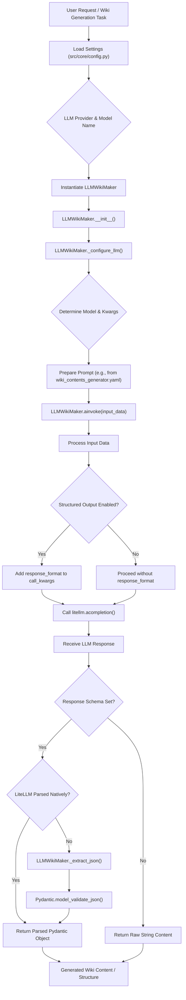

## Conclusion

The LLM Integration component provides a flexible, configurable, and robust mechanism for leveraging various LLMs in the wiki generation pipeline. By centralizing configuration, abstracting provider-specific details with LiteLLM, and enforcing structured outputs through Pydantic schemas, the system ensures consistent and high-quality wiki content generation. The use of prompt templates further allows for precise control over the LLM's behavior and output format, making it an indispensable part of the project's automated documentation capabilities.

---

<a name="wiki-generation-workflow"></a>

<details>
<summary>Relevant source files</summary>

The following files were used as context for generating this wiki page:

- [src/services/repo_fetcher.py](src/services/repo_fetcher.py)
- [src/services/structure_analyzer.py](src/services/structure_analyzer.py)
- [src/services/wiki_generator.py](src/services/wiki_generator.py)
- [src/services/wiki_worker.py](src/services/wiki_worker.py)
- [src/utils/file_filter.py](src/utils/file_filter.py)
- [src/providers/github.py](src/providers/github.py)
- [src/providers/gitlab.py](src/providers/gitlab.py)
- [src/providers/bitbucket.py](src/providers/bitbucket.py)
- [src/providers/local.py](src/providers/local.py)
</details>

# Wiki Generation Workflow

## Introduction

The Wiki Generation Workflow is a comprehensive system designed to automatically create technical wiki documentation from a given software repository. It leverages Large Language Models (LLMs) to analyze repository content, determine a logical wiki structure, and generate detailed page content. The system is modular, supporting various repository providers (GitHub, GitLab, Bitbucket, Local filesystem) and offering both automated and human-in-the-loop generation flows. This document outlines the architecture, key components, and the end-to-end process of generating a wiki.

## Overall Architecture

The wiki generation workflow is orchestrated by the `WikiGenerationService`, which coordinates several specialized components to perform repository fetching, structure analysis, content generation, and final formatting. Background processing is handled by the `WikiWorker`.

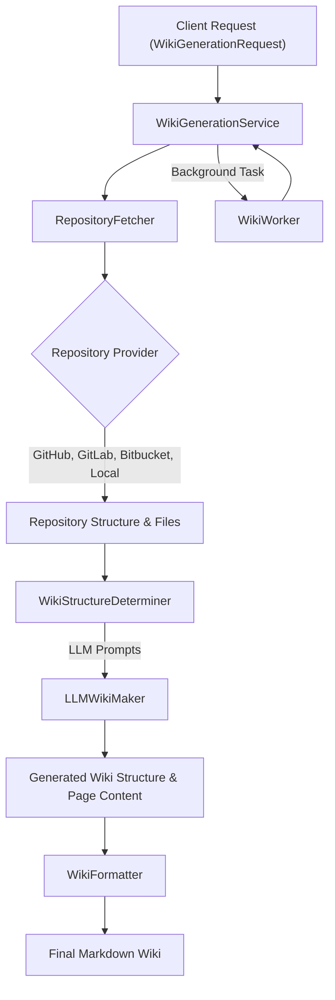
Sources: [src/services/wiki_generator.py](WikiGenerationService class), [src/services/repo_fetcher.py](RepositoryFetcher class), [src/services/structure_analyzer.py](WikiStructureDeterminer class), [src/services/wiki_worker.py](process_wiki_generation_task function)

## Key Components and Data Flow

The workflow is broken down into several distinct stages, each managed by a dedicated service or module.

### 1. Repository Fetching

The `RepositoryFetcher` service is responsible for abstracting the details of interacting with different source code management systems. It dynamically selects the appropriate `RepositoryProvider` based on the `repo_type` specified in the `WikiGenerationRequest`.

#### 1.1. RepositoryFetcher

*   **Purpose:** Provides a unified interface to fetch repository metadata (file tree, README) and individual file contents, regardless of the underlying repository host.
*   **Provider Map:** Uses `_PROVIDER_MAP` to associate repository types (e.g., "github", "gitlab", "bitbucket", "local") with their respective provider implementations.
*   **Asynchronous Context Manager:** Supports `async with` syntax for proper resource management, ensuring `close()` is called.

Sources: [src/services/repo_fetcher.py](RepositoryFetcher class)

#### 1.2. Repository Providers

Each provider implements the `RepositoryProvider` interface (implicitly defined by common methods) to handle specific API interactions or local file system access. They are responsible for:
*   Authenticating with the respective service (if an API token is provided).
*   Fetching the repository's file tree, including filtering out ignored files using `should_ignore`.
*   Retrieving the main README file content.
*   Determining the default branch of the repository.
*   Fetching the content of specific files on demand.

| Provider | Description | Key Methods |
|---|---|---|
| `GitHubProvider` | Interacts with the GitHub REST API. Uses Base64 decoding for file content. | `fetch_structure()`, `fetch_file_content()` |
| `GitLabProvider` | Supports GitLab API, including self-hosted instances by parsing the `repo_url`. Handles project path encoding. | `fetch_structure()`, `fetch_file_content()` |
| `BitbucketProvider` | Interacts with the Bitbucket Cloud API. | `fetch_structure()`, `fetch_file_content()` |
| `LocalProvider` | Scans a local directory. Uses `asyncio.to_thread` to offload synchronous disk I/O. | `fetch_structure()`, `fetch_file_content()` |

Sources: [src/providers/github.py](GitHubProvider class), [src/providers/gitlab.py](GitLabProvider class), [src/providers/bitbucket.py](BitbucketProvider class), [src/providers/local.py](LocalProvider class)

#### 1.3. File Filtering

The `should_ignore` utility function in `src/utils/file_filter.py` is used by repository providers to exclude files and directories based on glob patterns defined in `settings.IGNORED_PATTERNS`. This prevents irrelevant files (e.g., build artifacts, configuration files) from being included in the wiki generation process.

Sources: [src/utils/file_filter.py](should_ignore function)

### 2. Wiki Structure Determination and Content Generation

The `WikiStructureDeterminer` is the core component for intelligent analysis and content creation, heavily relying on LLMs.

#### 2.1. WikiStructureDeterminer

*   **Purpose:** Analyzes the repository's file tree and README to propose a logical wiki structure (pages, titles, associated files) and then generates the content for each proposed page using LLMs.
*   **State Management:** Maintains internal state for `generated_pages`, `pages_in_progress`, `is_loading`, and `error` to track the generation process.
*   **Concurrency Control:** Uses `asyncio.Semaphore` to limit the number of concurrent LLM calls, preventing API rate limits or resource exhaustion.
*   **Prompt Loading:** Loads LLM prompt templates from YAML files (e.g., `prompts/wiki_structure_generator.yaml`, `prompts/wiki_contents_generator.yaml`) using `_load_prompt_template`.

Sources: [src/services/structure_analyzer.py](WikiStructureDeterminer class)

#### 2.2. Structure Determination Flow

1.  **Initial Fetch:** The `WikiGenerationService` first uses `RepositoryFetcher` to get the `file_tree` and `readme` content.
2.  **LLM Invocation:** `determine_wiki_structure` method formats a prompt using the `file_tree`, `readme`, and request parameters (e.g., `isComprehensiveView`, `language`).
3.  **Structured Output:** The prompt is sent to an LLM (via `LLMWikiMaker`) configured to return a `WikiStructure` object, which includes a list of `WikiPage` objects. Each `WikiPage` specifies its title, ID, and a list of `file_paths` relevant to its content.

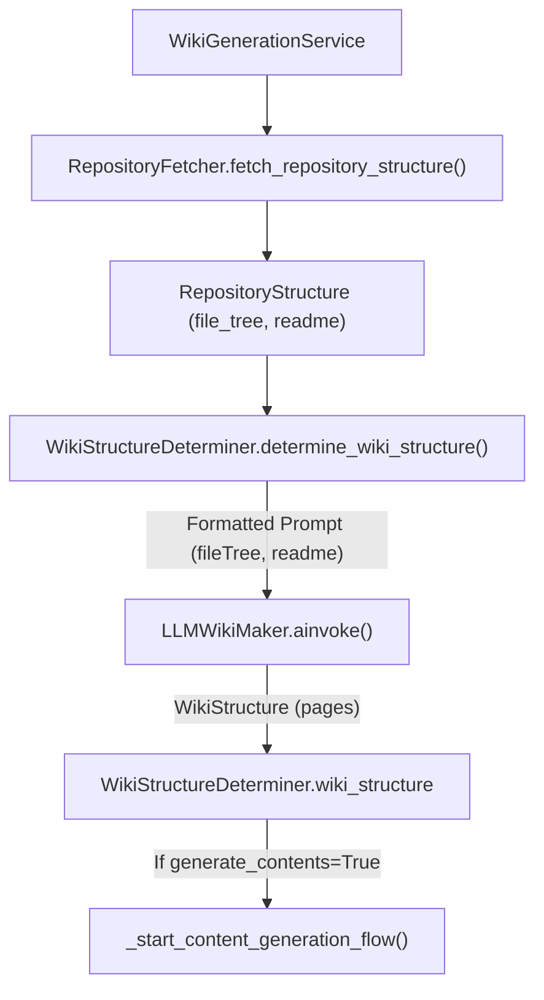
Sources: [src/services/wiki_generator.py](_initialize_and_determine function), [src/services/structure_analyzer.py](determine_wiki_structure function)

#### 2.3. Content Generation Flow

1.  **Parallel Fetching:** For each `WikiPage` identified in the structure, `_fetch_and_format_files` is called. This method uses `RepositoryFetcher.fetch_file_content` to retrieve the content of all associated files in parallel using `asyncio.gather`.
2.  **Prompt Formatting:** The fetched file contents, along with the page title and other context, are formatted into a prompt using a Jinja2 template.
3.  **LLM Invocation:** `generate_page_content` sends this prompt to the `LLMWikiMaker` to generate the actual Markdown content for the wiki page.
4.  **Concurrency:** Multiple `generate_page_content` tasks run concurrently, limited by the `asyncio.Semaphore`, to speed up the overall generation process.
5.  **Storage:** The generated content for each page is stored in `self.generated_pages` dictionary, keyed by page ID.

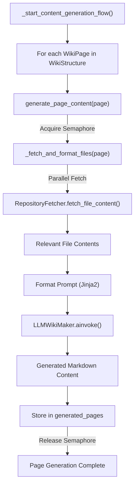
Sources: [src/services/structure_analyzer.py](_start_content_generation_flow function), [src/services/structure_analyzer.py](generate_page_content function), [src/services/structure_analyzer.py](_fetch_and_format_files function)

### 3. Orchestration and Workflow Management

The `WikiGenerationService` acts as the primary orchestrator, managing the entire lifecycle of a wiki generation request. The `WikiWorker` handles background execution.

#### 3.1. WikiGenerationService

*   **Purpose:** Coordinates the `RepositoryFetcher`, `WikiStructureDeterminer`, and `WikiFormatter` to execute the full wiki generation pipeline.
*   **`validate_request()`:** Ensures that the incoming `WikiGenerationRequest` has all necessary parameters for the specified repository type.
*   **`prepare_generation()`:** Initializes the `WikiStructureDeterminer` and fetches the initial repository structure. This method is useful for "human-in-the-loop" scenarios where the structure might be reviewed or modified before content generation.
*   **`generate_wiki()`:** Executes the full pipeline. It can either start from scratch or continue from a pre-initialized `WikiStructureDeterminer`. It waits for all content generation tasks to complete and then consolidates the results.
*   **`_wait_for_completion()`:** A helper method to asynchronously wait for all LLM content generation tasks to finish.
*   **`save_to_file()`:** Writes the final consolidated Markdown content to a file in the `output` directory.

Sources: [src/services/wiki_generator.py](WikiGenerationService class), [src/services/wiki_generator.py](generate_wiki function)

#### 3.2. WikiWorker

*   **Purpose:** Provides an asynchronous background task handler for wiki generation requests. This allows the main application to remain responsive while long-running generation tasks are processed.
*   **`process_wiki_generation_task()`:** The entry point for background tasks. It instantiates `WikiGenerationService`, calls `generate_wiki`, and optionally saves the output to a file.
*   **Task Status Updates:** Integrates with a `task_store` (not provided in the source, but implied by `update_task_status`) to report the status of the generation task (e.g., "completed", "failed") and its results.

Sources: [src/services/wiki_worker.py](process_wiki_generation_task function)

### 4. Wiki Formatting

The `WikiFormatter` (referenced in `WikiGenerationService.consolidate_markdown` but its source not provided) is responsible for taking the generated `WikiStructure` and the `generated_pages` content and assembling them into a single, coherent Markdown document. It also includes utilities like `sanitize_filename` for safe file saving.

Sources: [src/services/wiki_generator.py](consolidate_markdown function call)

## Conclusion

The Wiki Generation Workflow provides a robust, modular, and extensible solution for automating documentation. By separating concerns into distinct services for repository access, LLM-driven analysis, and orchestration, the system can efficiently generate comprehensive wiki content from diverse codebases. The asynchronous nature and concurrency controls ensure scalability and responsiveness, while the support for various repository providers makes it highly adaptable.

---

<a name="data-models-and-schemas"></a>

<details>
<summary>Relevant source files</summary>

The following files were used as context for generating this wiki page:

- [src/models/api_schema.py](src/models/api_schema.py)
- [src/models/github_webhook_schema.py](src/models/github_webhook_schema.py)
- [src/models/wiki_schema.py](src/models/wiki_schema.py)
</details>

# Data Models and Schemas

## Introduction

This document outlines the core data models and schemas used within the project, primarily defined using Pydantic. These models serve several critical functions:
1.  **API Request/Response Validation:** Ensuring that incoming API requests conform to expected structures and that API responses are consistently formatted.
2.  **External Data Integration:** Defining structures for parsing and handling data from external sources, such as GitHub webhooks.
3.  **Internal Data Representation:** Structuring complex internal data, such as the generated wiki content and repository metadata, for consistent processing and storage.

The use of Pydantic provides robust data validation, serialization, and deserialization capabilities, enhancing the reliability and maintainability of the codebase.

## API Schemas

The `src/models/api_schema.py` module defines the Pydantic models used for interacting with the project's API endpoints. These models cover requests to initiate wiki generation, responses from such requests, and the status of background tasks.

Sources: [src/models/api_schema.py](src/models/api_schema.py)

### WikiGenerationRequest

This model represents the payload for initiating a wiki generation task. It includes parameters for specifying the repository details, desired language, and the scope of the wiki generation.

| Parameter | Type | Description |
|---|---|---|
| `repo_owner` | `str \| None` | The owner of the repository (user or organization). |
| `repo_name` | `str \| None` | The name of the repository. |
| `repo_type` | `Literal["github", "gitlab", "bitbucket", "local"]` | The type of the repository, defaulting to "github". |
| `repo_url` | `str \| None` | The URL for cloning a remote repository. |
| `local_path` | `str \| None` | The local path to the repository if `repo_type` is 'local'. |
| `language` | `str` | The language for the generated wiki content, defaulting to "ko". |
| `is_comprehensive_view` | `bool` | Whether to generate a comprehensive view of the repository, defaulting to `True`. |

**Validation Logic:**
The `WikiGenerationRequest` includes a `model_validator` that attempts to derive `repo_owner` and `repo_name` from `repo_url` if they are not explicitly provided and the `repo_type` is "github". This helps in cases where only a GitHub URL is supplied.

Sources: [src/models/api_schema.py](WikiGenerationRequest.derive_repo_details), [src/models/api_schema.py](WikiGenerationRequest._parse_github_url)

### WikiGenerationResponse

This model defines the structure of the response returned immediately after a wiki generation request is successfully initiated. It provides feedback on the task's status and an identifier for tracking.

| Parameter | Type | Description |
|---|---|---|
| `message` | `str` | A message indicating the status of the request. |
| `task_id` | `str` | The ID of the background task initiated. |
| `title` | `str` | The title of the generated wiki. |
| `description` | `str` | The description of the generated wiki. |

Sources: [src/models/api_schema.py](WikiGenerationResponse)

### TaskStatusResponse

This model is used to convey the current status and potential results of an asynchronous background task.

| Parameter | Type | Description |
|---|---|---|
| `task_id` | `str` | The ID of the task. |
| `status` | `Literal["in_progress", "completed", "failed"]` | Current status of the task. |
| `result` | `Any \| None` | Result of the task, if completed or failed. |

Sources: [src/models/api_schema.py](TaskStatusResponse)

### API Schemas Class Diagram

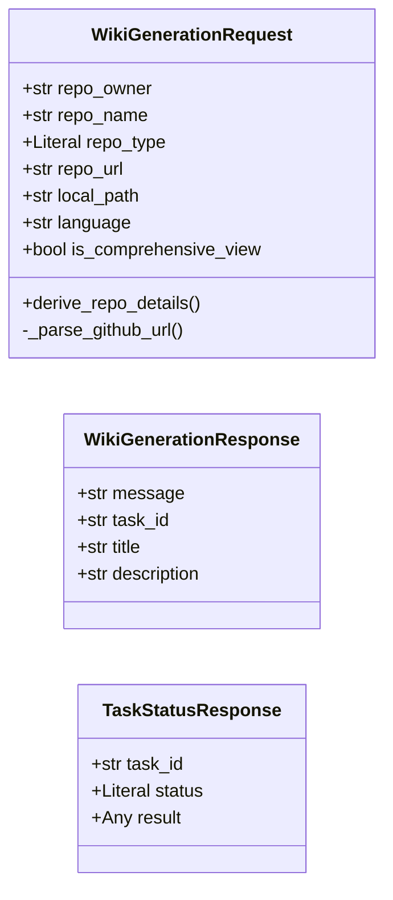

## GitHub Webhook Schemas

The `src/models/github_webhook_schema.py` module defines Pydantic models specifically for parsing and validating incoming GitHub webhook push payloads. These models ensure that the application can reliably extract relevant information from GitHub events.

Sources: [src/models/github_webhook_schema.py](src/models/github_webhook_schema.py)

### GitHubRepositoryOwner

A nested model representing the owner of a GitHub repository.

| Parameter | Type | Description |
|---|---|---|
| `login` | `str` | The login name of the repository owner. |

Sources: [src/models/github_webhook_schema.py](GitHubRepositoryOwner)

### GitHubRepository

A nested model representing a GitHub repository, including its name and owner.

| Parameter | Type | Description |
|---|---|---|
| `name` | `str` | The name of the repository. |
| `owner` | `GitHubRepositoryOwner` | The owner of the repository. |

Sources: [src/models/github_webhook_schema.py](GitHubRepository)

### GitHubPushPayload

The top-level model for a GitHub push webhook event. It encapsulates the reference (`ref`) and repository details.

| Parameter | Type | Description |
|---|---|---|
| `ref` | `str` | The Git ref (e.g., `refs/heads/main`) that was pushed. |
| `repository` | `GitHubRepository` | Details about the repository where the push occurred. |

Sources: [src/models/github_webhook_schema.py](GitHubPushPayload)

### GitHub Webhook Schemas Class Diagram

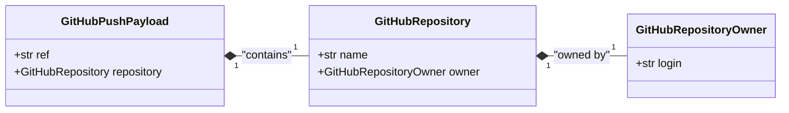

## Wiki Structure Schemas

The `src/models/wiki_schema.py` module defines the comprehensive data structures used to represent the generated wiki content, including its overall structure, individual pages, sections, and internal repository metadata.

Sources: [src/models/wiki_schema.py](src/models/wiki_schema.py)

### WikiSection

Represents a logical section within the wiki, which can contain pages and subsections.

| Parameter | Type | Description |
|---|---|---|
| `id` | `str` | Unique identifier for the section (e.g., "section-overview"). |
| `title` | `str` | Title of the section (e.g., "Overview"). |
| `pages` | `list[str]` | List of `WikiPage` IDs that belong directly to this section. |
| `subsections` | `list[str] \| None` | List of `WikiSection` IDs that are children of this section. |

Sources: [src/models/wiki_schema.py](WikiSection)

### WikiPage

Defines the structure of an individual wiki page, including its content, associated files, and relationships.

| Parameter | Type | Description |
|---|---|---|
| `id` | `str` | Unique identifier for the page (e.g., "page-getting-started"). |
| `title` | `str` | Title of the page (e.g., "Getting Started"). |
| `content` | `str` | The actual Markdown content of the page (initially empty, generated later). |
| `file_paths` | `list[str]` | List of relevant file paths from the repository for this page. |
| `importance` | `Literal["high", "medium", "low"]` | Importance level of the page. |
| `related_pages` | `list[str]` | List of `WikiPage` IDs that are related to this page. |
| `parent_id` | `str \| None` | ID of the parent section this page belongs to. Can be null for top-level pages. |

Sources: [src/models/wiki_schema.py](WikiPage)

### WikiStructure

The top-level model representing the entire generated wiki. It aggregates all pages and sections, defining the overall organization.

| Parameter | Type | Description |
|---|---|---|
| `id` | `str` | Overall unique identifier for the wiki (e.g., "repository-wiki"). |
| `title` | `str` | Overall title for the wiki (e.g., "My Project Wiki"). |
| `description` | `str` | Brief description of the entire wiki/repository. |
| `pages` | `list[WikiPage]` | List of all `WikiPage` objects in the wiki. |
| `sections` | `list[WikiSection]` | List of all `WikiSection` objects in the wiki. |
| `root_sections` | `list[str]` | List of `WikiSection` IDs that are top-level sections. |

Sources: [src/models/wiki_schema.py](WikiStructure)

### RepositoryStructure

An internal model used to hold parsed information about the repository's file structure, README content, and default branch. This is typically used during the wiki generation process.

| Parameter | Type | Description |
|---|---|---|
| `file_tree` | `str` | A string representation of the repository's file tree. |
| `readme` | `str` | The content of the repository's README file. |
| `default_branch` | `str` | The default branch of the repository, defaulting to "main". |
| `error` | `str \| None` | An optional field to store any error encountered during repository structure parsing. |

Sources: [src/models/wiki_schema.py](RepositoryStructure)

### Wiki Structure Schemas Class Diagram

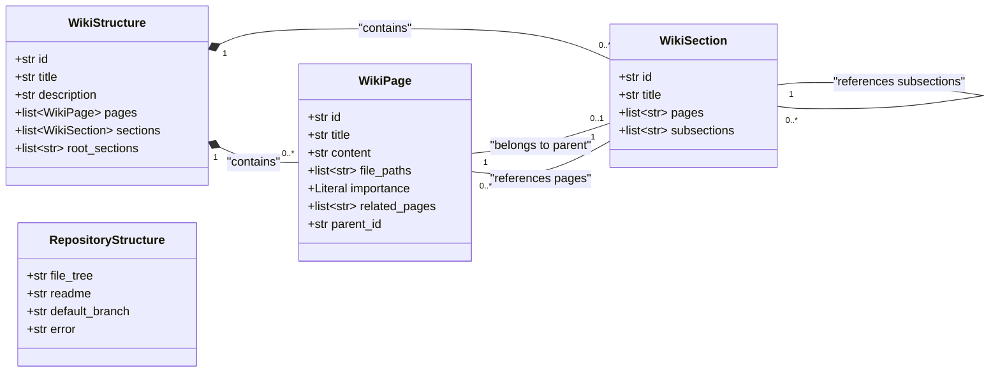

## Conclusion

The Pydantic data models defined across `src/models/api_schema.py`, `src/models/github_webhook_schema.py`, and `src/models/wiki_schema.py` are fundamental to the project's operation. They provide a clear, validated, and extensible framework for handling API interactions, processing external events, and structuring the complex output of the wiki generation process. This structured approach ensures data integrity, simplifies development, and facilitates robust communication between different components of the system.

---

<a name="backend-api-endpoints"></a>

<details>
<summary>Relevant source files</summary>

The following files were used as context for generating this wiki page:

- [src/api/v1/endpoints/webhook.py](src/api/v1/endpoints/webhook.py)
- [src/api/v1/endpoints/wiki.py](src/api/v1/endpoints/wiki.py)
- [src/server.py](src/server.py)
- [src/models/api_schema.py](src/models/api_schema.py)
</details>

# Backend API Endpoints

## Introduction

The Backend API Endpoints define the external and internal interfaces for the "Wiki as Readme" application, built using FastAPI. These endpoints facilitate the core functionality of the system, including receiving external webhooks (e.g., from GitHub), triggering asynchronous wiki generation tasks, and providing status updates for these tasks. The API is versioned under `/api/v1` and is structured into two main logical groups: "Webhook Integration" and "Wiki Generation".

The API leverages Pydantic models for robust request and response validation, ensuring data integrity and clear contract definitions. Asynchronous processing is a key architectural choice, allowing long-running wiki generation tasks to be handled in the background without blocking the API server.

Sources: [src/server.py](app initialization), [src/api/v1/endpoints/webhook.py](router definition), [src/api/v1/endpoints/wiki.py](router definition)

## Overall API Structure

The application's API is orchestrated by `src/server.py`, which initializes the FastAPI application and includes routers for different functional areas.

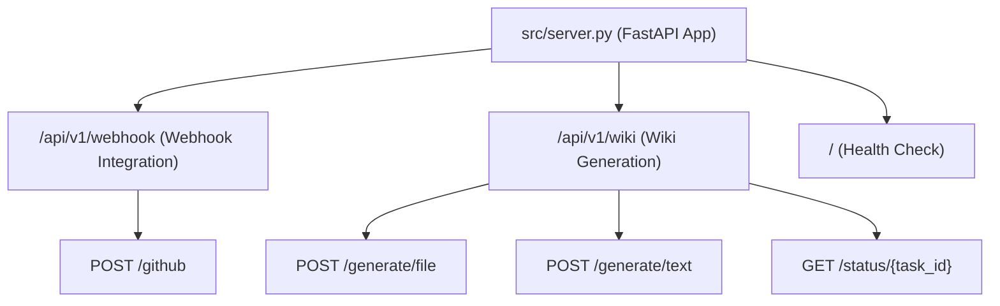
Sources: [src/server.py](app.include_router)

## Webhook Integration Endpoints

The webhook integration endpoints are responsible for receiving external events, primarily from version control systems like GitHub, and initiating internal processes based on these events.

### `POST /api/v1/webhook/github`

This endpoint is designed to receive push event webhooks from GitHub. Upon receiving a valid push event to the `main` branch, it triggers an internal wiki generation process.

*   **Method:** `POST`
*   **Path:** `/api/v1/webhook/github`
*   **Status Code:** `202 Accepted` (indicating that the request has been accepted for processing, but the processing is not yet complete).
*   **Description:** Receives a GitHub push webhook, validates it, and initiates wiki generation if the push is to the `main` branch.
*   **Request Body:** Expects a `GitHubPushPayload` (defined elsewhere, but its structure is inferred from usage).
*   **Response Body:**
    *   `202 Accepted`: `{"message": "Webhook received. Wiki generation process initiated...", "triggered_task": {...}}`
    *   `200 OK`: `{"message": "Ignoring push to non-main branch: {ref}"}` (if not `main` branch)
    *   `503 Service Unavailable`: If internal generation service call fails.
    *   `500 Internal Server Error`: For unexpected errors.

#### Logic Flow

1.  **Receive Payload:** The endpoint receives a `GitHubPushPayload` from GitHub.
2.  **Branch Validation:** It checks if the `payload.ref` corresponds to the `main` branch (`refs/heads/main`). If not, it returns an informational message and does not proceed.
3.  **Extract Repository Details:** `repo_owner` and `repo_name` are extracted from the payload.
4.  **Construct Internal Request:** A `WikiGenerationRequest` object is created using the extracted details, setting `repo_type` to "github", `language` to "ko", and `is_comprehensive_view` to `True`.
5.  **Internal API Call:** An asynchronous HTTP POST request is made to the internal `/api/v1/wiki/generate/file` endpoint to trigger the wiki generation. The `base_url` from the incoming request is used to construct the full internal URL.
6.  **Error Handling:** Catches `httpx.RequestError` for issues with the internal call and general `Exception` for other unexpected errors, raising appropriate `HTTPException`s.

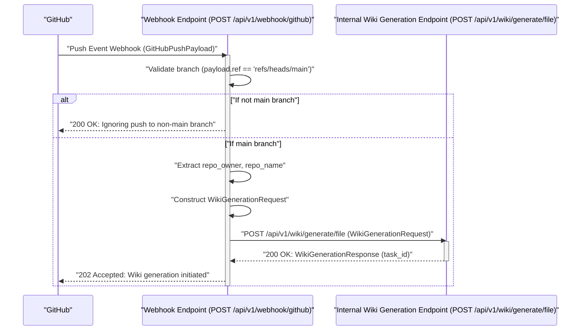
Sources: [src/api/v1/endpoints/webhook.py](github_webhook function)

## Wiki Generation Endpoints

These endpoints manage the asynchronous generation of wiki content, either saving it to a file or returning it as text, and provide mechanisms to check the status of these tasks.

### Helper Function: `_init_wiki_generation`

This internal asynchronous helper function is used by both wiki generation endpoints to perform common initialization steps.

*   **Purpose:** Validates the `WikiGenerationRequest`, creates a new background task entry, and prepares the `WikiGenerationService`. It also determines the initial wiki structure.
*   **Raises:** `HTTPException` (400 for validation errors, 500 for initialization failures).
*   **Returns:** A tuple containing `(task_id, determiner, service)`.

Sources: [src/api/v1/endpoints/wiki.py](_init_wiki_generation function)

### `POST /api/v1/wiki/generate/file`

Triggers the generation of a wiki and saves the output as a Markdown file on the server's filesystem.

*   **Method:** `POST`
*   **Path:** `/api/v1/wiki/generate/file`
*   **Description:** Initiates a background task to generate a wiki and save it as a Markdown file. Returns a task ID for status tracking.
*   **Request Body:** `WikiGenerationRequest`
*   **Response Body:** `WikiGenerationResponse` (contains `message`, `task_id`, `title`, `description`).

#### Logic Flow

1.  **Initialization:** Calls `_init_wiki_generation` to validate the request, create a task, and determine the wiki structure.
2.  **Background Task:** Adds `process_wiki_generation_task` to FastAPI's `BackgroundTasks`, passing the `task_id`, `request`, `determiner`, and `save_file=True`.
3.  **Response:** Returns a `WikiGenerationResponse` with a message indicating file-mode generation started and the `task_id`.

Sources: [src/api/v1/endpoints/wiki.py](generate_wiki_file function)

### `POST /api/v1/wiki/generate/text`

Triggers the generation of a wiki and makes the output text available via the task status endpoint, without saving it to the server's filesystem.

*   **Method:** `POST`
*   **Path:** `/api/v1/wiki/generate/text`
*   **Description:** Initiates a background task to generate a wiki and store its content as text in the task result. Returns a task ID for status tracking.
*   **Request Body:** `WikiGenerationRequest`
*   **Response Body:** `WikiGenerationResponse` (contains `message`, `task_id`, `title`, `description`).

#### Logic Flow

1.  **Initialization:** Calls `_init_wiki_generation` to validate the request, create a task, and determine the wiki structure.
2.  **Background Task:** Adds `process_wiki_generation_task` to FastAPI's `BackgroundTasks`, passing the `task_id`, `request`, `determiner`, and `save_file=False`.
3.  **Response:** Returns a `WikiGenerationResponse` with a message indicating text-mode generation started and the `task_id`.

Sources: [src/api/v1/endpoints/wiki.py](generate_wiki_text function)

### `GET /api/v1/wiki/status/{task_id}`

Retrieves the current status and result of a previously initiated wiki generation task.

*   **Method:** `GET`
*   **Path:** `/api/v1/wiki/status/{task_id}`
*   **Description:** Fetches the status of a background wiki generation task using its unique ID.
*   **Path Parameters:**
    *   `task_id` (string): The ID of the task to query.
*   **Response Body:**
    *   `200 OK`: `TaskStatusResponse` (contains `task_id`, `status`, `result`).
    *   `404 Not Found`: If the `task_id` does not exist.

#### Logic Flow

1.  **Retrieve Task:** Calls `get_task(task_id)` from the `task_store` service.
2.  **Task Not Found:** If no task is found for the given `task_id`, raises an `HTTPException` with status 404.
3.  **Return Status:** Returns the retrieved `TaskStatusResponse` object.

Sources: [src/api/v1/endpoints/wiki.py](get_wiki_generation_status function)

### Wiki Generation Process Overview

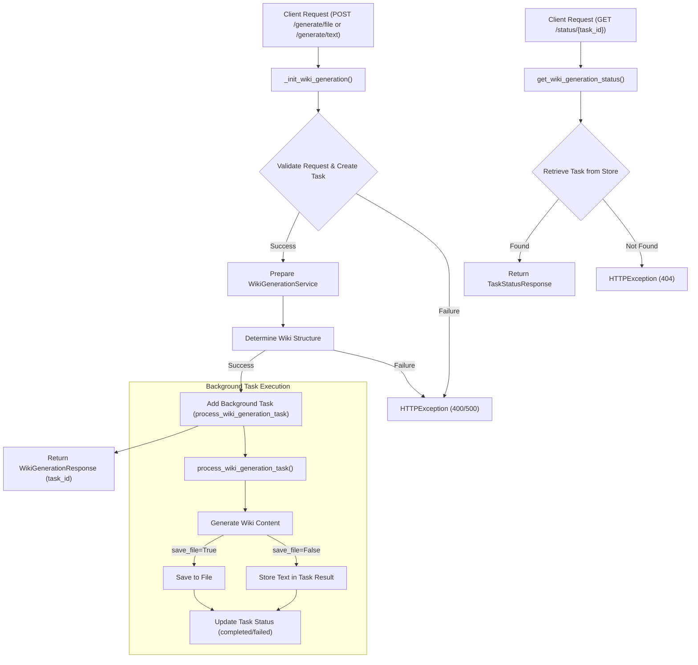
Sources: [src/api/v1/endpoints/wiki.py](generate_wiki_file function, generate_wiki_text function, get_wiki_generation_status function, _init_wiki_generation function)

## API Data Models

The `src/models/api_schema.py` file defines the Pydantic models used for validating request bodies and structuring API responses.

### `WikiGenerationRequest`

This model defines the parameters required to initiate a wiki generation task.

| Parameter | Type | Description |
|---|---|---|
| `repo_owner` | `str` \| `None` | The owner of the repository (user or organization). |
| `repo_name` | `str` \| `None` | The name of the repository. |
| `repo_type` | `Literal["github", "gitlab", "bitbucket", "local"]` | The type of the repository. Defaults to "github". |
| `repo_url` | `str` \| `None` | The URL for cloning a remote repository. |
| `local_path` | `str` \| `None` | The local path to the repository if `repo_type` is 'local'. |
| `language` | `str` | The language for the generated wiki content. Defaults to "ko". |
| `is_comprehensive_view` | `bool` | Whether to generate a comprehensive view of the repository. Defaults to `True`. |

**Validation Logic:**
A `@model_validator(mode="after")` is implemented to automatically derive `repo_owner` and `repo_name` from `repo_url` if `repo_type` is "github" and these fields are not explicitly provided. This parsing specifically handles GitHub URLs.

Sources: [src/models/api_schema.py](WikiGenerationRequest class)

### `WikiGenerationResponse`

This model defines the standard response structure for successful wiki generation initiation.

| Parameter | Type | Description |
|---|---|---|
| `message` | `str` | A message indicating the status of the request. |
| `task_id` | `str` | The ID of the background task initiated. |
| `title` | `str` | The title of the generated wiki. |
| `description` | `str` | The description of the generated wiki. |

Sources: [src/models/api_schema.py](WikiGenerationResponse class)

### `TaskStatusResponse`

This model defines the structure for retrieving the status of a background task.

| Parameter | Type | Description |
|---|---|---|
| `task_id` | `str` | The ID of the task. |
| `status` | `Literal["in_progress", "completed", "failed"]` | Current status of the task. |
| `result` | `Any` \| `None` | Result of the task, if completed or failed. This can contain the generated wiki text if `generate/text` was used. |

Sources: [src/models/api_schema.py](TaskStatusResponse class)

## Conclusion

The Backend API Endpoints provide a robust and asynchronous interface for the "Wiki as Readme" application. They enable seamless integration with external systems via webhooks, offer flexible options for wiki generation (saving to file or returning text), and allow clients to monitor the progress of these potentially long-running tasks. The use of FastAPI and Pydantic ensures a well-defined, validated, and maintainable API contract.

---

<a name="contributing-to-the-project"></a>

<details>
<summary>Relevant source files</summary>

The following files were used as context for generating this wiki page:

- [README.md](README.md)
- [LICENSE](LICENSE)
</details>

# Contributing to the Project

This document outlines the guidelines and processes for contributing to the "Wiki As Readme" project. Contributions are highly encouraged and can range from bug fixes and feature enhancements to documentation improvements. By following these guidelines, you help ensure a smooth and effective collaboration process.

Sources: [README.md](https://github.com/catuscio/wiki-as-readme/blob/main/README.md)

## How to Contribute

The project welcomes contributions from the community. The standard GitHub workflow for contributing is followed, ensuring that all changes are reviewed before being merged into the main codebase.

To contribute, please follow these steps:

1.  **Fork the project:** Start by forking the `wiki-as-readme` repository to your personal GitHub account. This creates a copy of the project under your control where you can make changes.
    Sources: [README.md](https://github.com/catuscio/wiki-as-readme/blob/main/README.md#contributing)
2.  **Create your feature branch:** Once forked, clone your repository locally and create a new branch for your specific feature or bug fix. It's good practice to name your branch descriptively (e.g., `feature/add-new-llm-support`, `bugfix/fix-api-error`).
    ```bash
    git checkout -b feature/AmazingFeature
    ```
    Sources: [README.md](https://github.com/catuscio/wiki-as-readme/blob/main/README.md#contributing)
3.  **Commit your changes:** Make your desired changes to the codebase. Ensure your commits are atomic and have clear, concise messages explaining the purpose of the changes.
    ```bash
    git commit -m 'Add some AmazingFeature'
    ```
    Sources: [README.md](https://github.com/catuscio/wiki-as-readme/blob/main/README.md#contributing)
4.  **Push to the branch:** After committing, push your new branch and its commits to your forked repository on GitHub.
    ```bash
    git push origin feature/AmazingFeature
    ```
    Sources: [README.md](https://github.com/catuscio/wiki-as-readme/blob/main/README.md#contributing)
5.  **Open a Pull Request:** Navigate to the original `wiki-as-readme` repository on GitHub and open a Pull Request (PR) from your feature branch to the `main` branch. Provide a detailed description of your changes, including why they are necessary and what problem they solve.
    Sources: [README.md](https://github.com/catuscio/wiki-as-readme/blob/main/README.md#contributing)

## Project License

The "Wiki As Readme" project is licensed under the MIT License. This is a permissive free software license, meaning you are free to use, copy, modify, merge, publish, distribute, sublicense, and/or sell copies of the software, provided that the original copyright notice and this permission notice are included in all copies or substantial portions of the Software.

For the full text of the license, please refer to the `LICENSE` file in the project root.

Sources: [README.md](https://github.com/catuscio/wiki-as-readme/blob/main/README.md#license), [LICENSE](https://github.com/catuscio/wiki-as-readme/blob/main/LICENSE)

## Acknowledgments

The project acknowledges and appreciates the foundational work and inspiration from other open-source initiatives. Specifically, it is heavily influenced by and utilizes core logic from [deepwiki-open](https://github.com/AsyncFuncAI/deepwiki-open). The project also recognizes the power of open-source libraries and the general need for improved automated documentation as key inspirations.

Sources: [README.md](https://github.com/catuscio/wiki-as-readme/blob/main/README.md#acknowledgments)

## Conclusion

Contributing to "Wiki As Readme" is a straightforward process designed to integrate community efforts effectively. By adhering to the outlined contribution workflow and understanding the project's MIT License, contributors can help enhance this tool for automated documentation generation.

---
