# Wiki As Readme Project Wiki

Comprehensive documentation for the Wiki As Readme project, an AI-powered tool to generate detailed wikis from codebases.

## Table of Contents

- [Introduction to Wiki As Readme](#introduction-to-wiki-as-readme)
- [Core Features Overview](#core-features-overview)
- [Universal Compatibility (Model, Platform, Deployment)](#universal-compatibility-(model,-platform,-deployment))
- [LLM Integration and Configuration](#llm-integration-and-configuration)
- [Using as a GitHub Action](#using-as-a-github-action)
- [Local Development and Docker Setup](#local-development-and-docker-setup)
- [Deploying as a Server with Webhooks](#deploying-as-a-server-with-webhooks)
- [Environment Variables and Configuration](#environment-variables-and-configuration)
- [Backend API Endpoints](#backend-api-endpoints)
- [Project Architecture Overview](#project-architecture-overview)
- [Contributing to Wiki As Readme](#contributing-to-wiki-as-readme)
- [Examples of Generated Wikis](#examples-of-generated-wikis)

---

<a name="introduction-to-wiki-as-readme"></a>

<details>
<summary>Relevant source files</summary>

The following files were used as context for generating this wiki page:

- [README.md](README.md)
- [action.yml](action.yml)
</details>

# Introduction to Wiki As Readme

## Introduction

Wiki As Readme is a highly flexible AI-powered documentation tool designed to transform any codebase into a comprehensive wiki or `README.md` file within minutes. It emphasizes universal compatibility, allowing users to leverage various Large Language Models (LLMs), integrate with any Git platform or local repository, and deploy in diverse environments. The tool aims to be a "drop-in" solution for automated, high-quality technical documentation.

The project is built to be truly pluggable, adapting to different technology stacks and operational needs. It supports a wide range of LLM providers, from commercial APIs like OpenAI and Google Vertex AI to local models via Ollama. It seamlessly integrates with cloud-based Git repositories (GitHub, GitLab, Bitbucket) as well as local file systems, and can be deployed as a CI/CD action, Docker container, API service, or CLI tool.

Sources: [README.md](Introduction section), [README.md](Universal Compatibility section)

## Core Capabilities and Features

Wiki As Readme offers a robust set of features designed to generate detailed and structured documentation.

### Universal Compatibility

The tool's design prioritizes flexibility across three key dimensions:

#### 1. Model Agnostic (Powered by LiteLLM)
Wiki As Readme integrates with a wide array of LLM providers through LiteLLM, ensuring users can choose their preferred model.
*   **Commercial APIs:** Google Vertex AI (Gemini), OpenAI (GPT-4), Anthropic (Claude), xAI (Grok).
*   **Open/Local Models:** Ollama, OpenRouter, HuggingFace.
*   **On-Premise:** Connects securely to private LLM endpoints.

Sources: [README.md](Model Agnostic section)

#### 2. Platform Agnostic
It supports various code hosting platforms and local development environments.
*   **Cloud Repos:** GitHub, GitLab, Bitbucket.
*   **Local Development:** Analyzes code directly from the local file system.
*   **Private/Enterprise:** Full support for private instances and self-hosted Git servers.

Sources: [README.md](Platform Agnostic section)

#### 3. Deployment Agnostic
The tool can be deployed and utilized in multiple operational contexts.
*   **CI/CD:** Integrates as a GitHub Action.
*   **Container:** Runs via Docker Compose.
*   **Service:** Deploys as a long-running API server with Webhooks.
*   **CLI:** Executes locally for development workflows.

Sources: [README.md](Deployment Agnostic section)

### Key Features

The generation process is driven by several core features:

*   **Deep Context Analysis:** Analyzes file structure and relationships to understand project architecture before documentation generation.
*   **Smart Structure Generation:** Automatically determines a logical hierarchy (Sections > Pages) for the documentation.
*   **Comprehensive Content:** Generates detailed pages, including architecture overviews, installation guides, and API references.
*   **Automatic Diagrams:** Creates Mermaid.js diagrams (Flowcharts, Sequence diagrams, Class diagrams) to visualize architecture.
*   **Hybrid Output:** Produces both individual Markdown files for a wiki and a single consolidated `README.md`.
*   **Async & Scalable:** Built with FastAPI and AsyncIO for efficient, non-blocking generation of large documentation sets.

Sources: [README.md](Core Features section)

## Usage Modes

Wiki As Readme is designed to be pluggable, offering several ways to integrate it into a workflow.

### 1. GitHub Action (Recommended)

This mode automates documentation updates within a CI/CD pipeline. It can be triggered on `push` events or manually via `workflow_dispatch`.

#### Workflow Overview
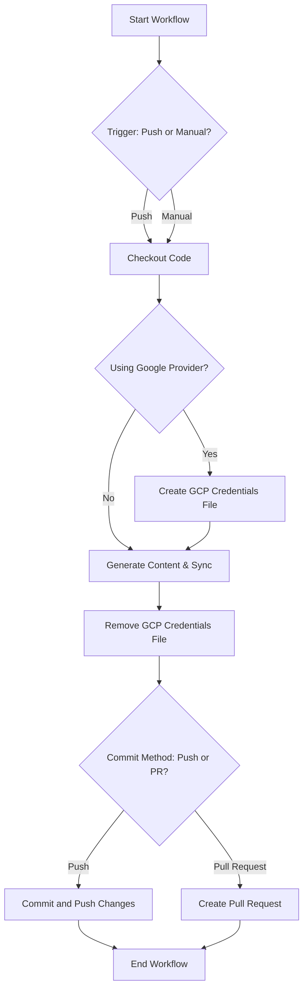
Sources: [README.md](GitHub Action section)

#### Configuration Inputs for GitHub Action
The GitHub Action (`action.yml`) exposes several inputs for customization:

| Input Name | Description | Default |
|---|---|---|
| `language` | Language for generated content (e.g., `ko`, `en`) | `en` |
| `wiki_output_path` | File path to save generated wiki content | `WIKI.md` |
| `llm_provider` | LLM provider (`google`, `openai`, `anthropic`, etc.) | `google` |
| `model_name` | Specific model name to use | `gemini-2.5-flash` |
| `openai_api_key` | OpenAI API Key | |
| `anthropic_api_key` | Anthropic API Key | |
| `openrouter_api_key` | OpenRouter API Key | |
| `xai_api_key` | xAI API Key | |
| `git_api_token` | GitHub/GitLab API Token for private repos | |
| `gcp_project_name` | GCP Project Name | |
| `gcp_model_location` | GCP Model Location | |
| `google_application_credentials` | GCP Service Account JSON Key (Content or Path) | |
| `llm_base_url` | Custom base URL for LLM API | |
| `use_structured_output` | Whether to use structured JSON output | `true` |
| `temperature` | LLM temperature (0.0 to 1.0) | `0.0` |
| `max_retries` | Max retry attempts | `3` |
| `max_concurrency` | Max parallel LLM calls | `5` |
| `ignored_patterns` | JSON array of glob patterns to ignore | `[]` |

Sources: [action.yml](inputs section)

### 2. Docker Compose (Local)

For local execution with a UI, Docker Compose provides an easy setup.
1.  Configure `.env` file with API keys and optional Notion sync settings.
2.  Run `docker-compose up --build`.
3.  Access Web UI at `http://localhost:8501` and API Docs at `http://localhost:8000/docs`.

Sources: [README.md](Docker Compose (Local) section)

### 3. Local Python Development

For developers modifying the source code or running without Docker.
1.  Clone the repository and install dependencies using `uv sync`.
2.  Configure `.env` file.
3.  Run backend with `uv run uvicorn src.server:app --reload --port 8000`.
4.  Run frontend with `uv run streamlit run src/app.py`.

Sources: [README.md](Local Python Development section)

### 4. Server & Webhooks

The API server can be deployed as a long-running service to handle requests or webhooks.
*   **Endpoint:** `POST /api/v1/webhook/github`
*   **Payload:** Standard GitHub push event payload.
*   **Behavior:** Triggers a background task to generate and commit the wiki for the repository.

Sources: [README.md](Server & Webhooks section)

## Configuration Reference

The application is configured via environment variables, typically set in a `.env` file.

| Category | Variable | Description | Example |
|---|---|---|---|
| **LLM Provider** | `LLM_PROVIDER` | `google`, `openai`, `anthropic`, `xai`, `openrouter`, `ollama` | `google` |
| | `MODEL_NAME` | Specific model identifier | `gemini-2.5-flash` |
| | `LLM_BASE_URL` | Custom base URL (e.g., for Ollama/Proxies) | `http://localhost:11434/v1` |
| **Auth** | `OPENAI_API_KEY` | OpenAI API Key | `sk-...` |
| | `ANTHROPIC_API_KEY` | Anthropic API Key | `sk-ant...` |
| | `GCP_PROJECT_NAME` | Vertex AI Project ID | `my-genai-project` |
| **Notion Sync** | `NOTION_SYNC_ENABLED` | Sync to Notion after generation | `true` |
| | `NOTION_API_KEY` | Notion Integration Token | `secret_...` |
| | `NOTION_DATABASE_ID` | Target Notion Database ID | `abc123...` |
| **Paths** | `WIKI_OUTPUT_PATH` | Path to save generated wiki (default: `WIKI.md` or `./output`) | `./output/WIKI.md` |
| | `LOCAL_REPO_PATH` | Local repo path for Docker mounting | `/Users/me/project` |
| **Advanced** | `USE_STRUCTURED_OUTPUT`| Use native JSON mode | `true` |
| | `IGNORED_PATTERNS` | **JSON array** of glob patterns to exclude | `'["*.log", "node_modules/*"]'` |

Sources: [README.md](Configuration Reference section)

## API Reference

The backend API is built with FastAPI and provides interactive Swagger documentation at `http://localhost:8000/docs` when running.

### Wiki Generation Endpoints

*   **`POST /api/v1/wiki/generate/file`**: Starts a background task to generate the wiki and saves it as a Markdown file on the server.
*   **`POST /api/v1/wiki/generate/text`**: Starts a background task to generate the wiki, storing the result in the task status.
*   **`GET /api/v1/wiki/status/{task_id}`**: Retrieves the status and result of a generation task.

### Webhooks

*   **`POST /api/v1/webhook/github`**: Endpoint for GitHub Webhooks (Push events), triggering automatic wiki generation on pushes to the `main` branch.

Sources: [README.md](API Reference section)

## Architecture

The project leverages a modern Python-based stack for its components:

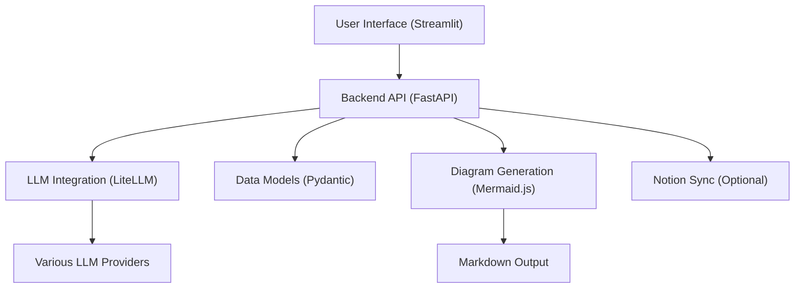

*   **Frontend:** [Streamlit](https://streamlit.io/) for the user interface.
*   **Backend:** [FastAPI](https://fastapi.tiangolo.com/) for the REST API and background task management.
*   **LLM Integration:** [LiteLLM](https://docs.litellm.ai/) provides a unified interface for over 100 LLMs.
*   **Data Models:** [Pydantic](https://docs.pydantic.dev/) ensures type safety and structured output validation.
*   **Diagrams:** [Mermaid.js](https://mermaid.js.org/) for visualizing architecture within the generated documentation.

Sources: [README.md](Architecture section)

## Conclusion

Wiki As Readme provides a powerful, flexible, and automated solution for generating comprehensive technical documentation from codebases. Its universal compatibility across LLMs, platforms, and deployment methods makes it a versatile tool for developers and teams looking to streamline their documentation efforts. By leveraging AI for deep context analysis and structured content generation, it aims to significantly reduce the manual overhead associated with maintaining up-to-date project wikis and READMEs.

---

<a name="core-features-overview"></a>

<details>
<summary>Relevant source files</summary>

The following files were used as context for generating this wiki page:

- [src/services/structure_analyzer.py](src/services/structure_analyzer.py)
- [src/services/wiki_generator.py](src/services/wiki_generator.py)
- [src/services/wiki_formatter.py](src/services/wiki_formatter.py)
- [src/prompts/wiki_contents_generator.yaml](src/prompts/wiki_contents_generator.yaml)
- [src/prompts/wiki_structure_generator.yaml](src/prompts/wiki_structure_generator.yaml)
</details>

# Core Features Overview

## Introduction

This document provides an overview of the core features and architecture of the wiki generation system. The system is designed to automatically generate comprehensive technical wikis from software repositories by leveraging Large Language Models (LLMs). It orchestrates several key services to fetch repository data, determine an optimal wiki structure, generate detailed page content, and consolidate everything into a single, well-formatted Markdown output.

The primary goal is to automate the creation of high-quality documentation, reducing manual effort and ensuring consistency across projects. This overview will detail the main components involved in this end-to-end process, from initial request validation to final markdown output.

## System Architecture and Workflow

The wiki generation process is managed by a central `WikiGenerationService` which coordinates interactions between several specialized components. The workflow typically involves fetching repository information, determining the wiki's structure, generating content for each page, and finally formatting the entire wiki.

### High-Level Workflow

The following diagram illustrates the main steps and interactions within the wiki generation pipeline:

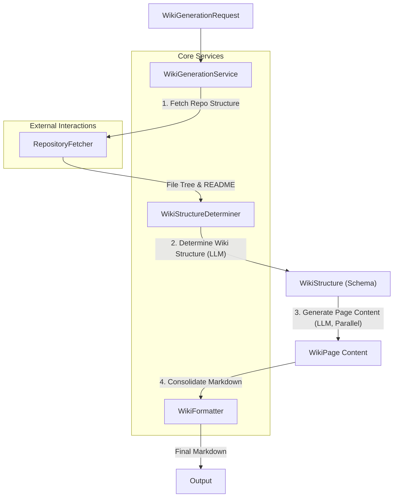

## Core Components

### 1. WikiGenerationService

The `WikiGenerationService` acts as the orchestrator for the entire wiki generation pipeline. It is responsible for validating incoming requests, initializing other services, managing the flow of data, and handling the final output.

*   **Purpose**: Coordinates the end-to-end wiki generation.
*   **Key Responsibilities**:
    *   **Request Validation**: Ensures that the `WikiGenerationRequest` contains all necessary parameters based on the repository type (e.g., `local_path` for local repos, `repo_owner` and `repo_name` for GitHub).
    *   **Initialization**: Sets up `RepositoryFetcher` and `WikiStructureDeterminer` instances.
    *   **Workflow Management**: Manages the sequence of operations: fetching repository data, determining structure, generating content, and formatting.
    *   **State Management**: Can handle both fully automated (auto-pilot) and human-in-the-loop scenarios by allowing the process to pause after structure determination.
    *   **Output Handling**: Consolidates the generated content and structure, and can save the final markdown to a file.

*   **Core Methods**:
    *   `validate_request(request: WikiGenerationRequest)`: Checks the integrity of the input request.
    *   `prepare_generation()`: Initializes the `WikiStructureDeterminer` and fetches the initial repository structure, stopping before content generation. Useful for scenarios where the user might want to review or modify the proposed structure.
    *   `generate_wiki_with_structure(determiner: WikiStructureDeterminer | None = None)`: Executes the full pipeline. If a `determiner` is provided, it continues from that state; otherwise, it starts from scratch.
    *   `_initialize_and_determine()`: Internal method to fetch repository structure and initiate the `WikiStructureDeterminer` to propose the wiki structure.
    *   `_wait_for_completion(determiner: WikiStructureDeterminer)`: Asynchronously waits for all content generation tasks to complete.
    *   `save_to_file(markdown_content: str)`: Writes the final markdown output to a specified file path.

Sources: [src/services/wiki_generator.py](WikiGenerationService class)

### 2. WikiStructureDeterminer

The `WikiStructureDeterminer` is a central component responsible for interacting with LLMs to define the wiki's overall structure and generate the content for individual pages. It manages concurrency for LLM calls and integrates with the repository fetching mechanism.

*   **Purpose**: Determines wiki structure and generates page contents using LLMs.
*   **Key Responsibilities**:
    *   **Structure Generation**: Uses an LLM (via `LLMWikiMaker`) and a specific prompt (`wiki_structure_generator.yaml`) to analyze the repository's file tree and README, proposing a `WikiStructure` (sections and pages).
    *   **Content Generation**: For each page defined in the `WikiStructure`, it fetches relevant source files, formats them, and uses another LLM prompt (`wiki_contents_generator.yaml`) to generate the page's markdown content.
    *   **Concurrency Control**: Employs `asyncio.Semaphore` to limit the number of simultaneous LLM requests, preventing rate limiting issues and managing resource usage.
    *   **Prompt Management**: Loads and renders Jinja2 templates for LLM prompts from YAML files.
    *   **File Fetching**: Coordinates with `RepositoryFetcher` to asynchronously retrieve the content of source files relevant to a specific wiki page.

*   **Core Methods**:
    *   `__init__(request: WikiGenerationRequest, max_concurrency: int)`: Initializes with the generation request, sets up state variables, `RepositoryFetcher`, `LLMWikiMaker`, and the concurrency semaphore.
    *   `_load_prompt_template(prompt_path: str)`: Caches and loads prompt templates from YAML files.
    *   `_fetch_and_format_files(page: WikiPage)`: Fetches content for all files associated with a `WikiPage` in parallel and formats them for LLM input.
    *   `generate_page_content(page: WikiPage, language: str)`: Orchestrates the LLM call to generate content for a single wiki page, applying concurrency limits.
    *   `determine_wiki_structure(file_tree: str, readme: str, default_branch: str | None = None, generate_contents: bool = True)`: Invokes the LLM to determine the overall `WikiStructure` based on the repository's file tree and README.
    *   `_start_content_generation_flow(language: str)`: Manages the asynchronous execution of all page content generation tasks.

Sources: [src/services/structure_analyzer.py](WikiStructureDeterminer class)

### 3. WikiFormatter

The `WikiFormatter` service is responsible for taking the generated wiki structure and individual page contents and assembling them into a single, coherent Markdown document. It also provides utility functions for sanitizing strings for file naming.

*   **Purpose**: Consolidates wiki structure and page content into markdown format.
*   **Key Responsibilities**:
    *   **Markdown Consolidation**: Combines the `WikiStructure` (title, description, page order) with the generated markdown content of each `WikiPage` into a single, navigable Markdown string.
    *   **Table of Contents Generation**: Automatically creates a table of contents with internal links (anchors) to each wiki page.
    *   **Filename Sanitization**: Provides a utility to clean strings, making them suitable for use as file names.

*   **Core Methods**:
    *   `sanitize_filename(name: str)`: Removes invalid characters from a string to create a safe filename.
    *   `consolidate_markdown(structure: WikiStructure, pages: dict[str, str])`: The primary method that takes the `WikiStructure` object and a dictionary of page IDs to their markdown content, then constructs the final markdown output. This includes adding the main title, description, table of contents, and each page's content with appropriate anchors.

Sources: [src/services/wiki_formatter.py](WikiFormatter class)

### 4. Prompt Templates

The system heavily relies on well-defined prompt templates to guide the LLM's behavior for both structure determination and content generation. These templates are stored in YAML files and loaded dynamically.

#### 4.1. Wiki Contents Generator Prompt

*   **File**: `src/prompts/wiki_contents_generator.yaml`
*   **Purpose**: Instructs the LLM on how to generate the markdown content for a single wiki page.
*   **Key Instructions**:
    *   **Source Context**: Requires a `<details>` block at the beginning listing all relevant source files used for context.
    *   **Content Structure**: Defines a standard structure (Introduction, Detailed Sections, Conclusion).
    *   **Visuals**: Guidelines for creating Mermaid diagrams (flowcharts, sequence, class diagrams) with strict syntax rules (e.g., "Universal Quote" rule for labels, avoiding reserved keywords for IDs).
    *   **Tables**: Formatting rules for Markdown tables (e.g., separator lines, no visual alignment).
    *   **Citations**: Mandates citing sources using absolute file URLs and function/class names.
    *   **Language & Tone**: Specifies the output language and professional tone.

Sources: [src/prompts/wiki_contents_generator.yaml](template content)

#### 4.2. Wiki Structure Generator Prompt

*   **File**: `src/prompts/wiki_structure_generator.yaml`
*   **Purpose**: Guides the LLM to analyze a repository and output a structured JSON object representing the wiki's hierarchy.
*   **Key Instructions**:
    *   **Input**: Provides the full file tree and README content of the repository.
    *   **Output Format**: Strictly requires the output to be a JSON object conforming to the `WikiStructure` Pydantic model schema.
    *   **Structure Guidelines**: Specifies the number of pages to create, how to select `file_paths` for each page, how to define `parent_id` for pages, and how to populate `sections` and `root_sections`.
    *   **Completeness**: Emphasizes generating a complete and valid JSON object without truncation.

Sources: [src/prompts/wiki_structure_generator.yaml](template content)

## Conclusion

The core features of this wiki generation system revolve around a robust, LLM-driven pipeline orchestrated by the `WikiGenerationService`. By leveraging specialized components like `WikiStructureDeterminer` for intelligent structure and content generation, and `WikiFormatter` for seamless output assembly, the system provides an efficient and scalable solution for automated technical documentation. The use of detailed prompt templates ensures high-quality, consistent, and contextually relevant wiki pages, significantly streamlining the documentation process for software projects.

---

<a name="universal-compatibility-(model,-platform,-deployment)"></a>

<details>
<summary>Relevant source files</summary>

The following files were used as context for generating this wiki page:

- [src/providers/base.py](src/providers/base.py)
- [src/providers/github.py](src/providers/github.py)
- [src/providers/gitlab.py](src/providers/gitlab.py)
- [src/providers/bitbucket.py](src/providers/bitbucket.py)
- [src/providers/local.py](src/providers/local.py)
- [Dockerfile](Dockerfile)
- [Dockerfile.action](Dockerfile.action)
- [Dockerfile.server](Dockerfile.server)
</details>

# Universal Compatibility (Model, Platform, Deployment)

## Introduction

The `wiki-as-readme` project is designed with a strong emphasis on universal compatibility, ensuring it can interact with various source code repository platforms and be deployed across diverse environments. This compatibility is achieved through a modular architecture that abstracts away platform-specific details and leverages containerization for consistent deployment.

At its core, the system employs a `RepositoryProvider` abstraction to handle different Git hosting services (GitHub, GitLab, Bitbucket) and local file systems. This allows the application to fetch repository structures and file contents uniformly, regardless of the underlying source. For deployment, the project utilizes Docker, providing specialized Dockerfiles for a full application, a GitHub Action, and a dedicated API server, ensuring operational flexibility and ease of integration into different workflows.

## Repository Platform Compatibility (Model)

The project achieves compatibility with various repository platforms through a well-defined provider pattern. This design separates the core logic of wiki generation from the specifics of how repository data is accessed.

### The `RepositoryProvider` Abstraction

The `RepositoryProvider` class, defined in `src/providers/base.py`, serves as the abstract base for all repository interactions. It establishes a contract that all concrete providers must adhere to, ensuring a consistent interface for fetching repository metadata and file content.

**Key Components:**
*   **`__init__(self, request: WikiGenerationRequest)`**: Initializes the provider with a request object containing repository details and an `httpx.AsyncClient` for making asynchronous HTTP requests.
*   **`close(self)`**: An asynchronous method for resource cleanup, specifically closing the HTTP client.
*   **`fetch_structure(self) -> RepositoryStructure`**: An abstract method responsible for retrieving the repository's file tree, README content, and default branch.
*   **`fetch_file_content(self, file_path: str) -> str | None`**: An abstract method for fetching the raw content of a specific file within the repository.

Sources: [src/providers/base.py](RepositoryProvider class)

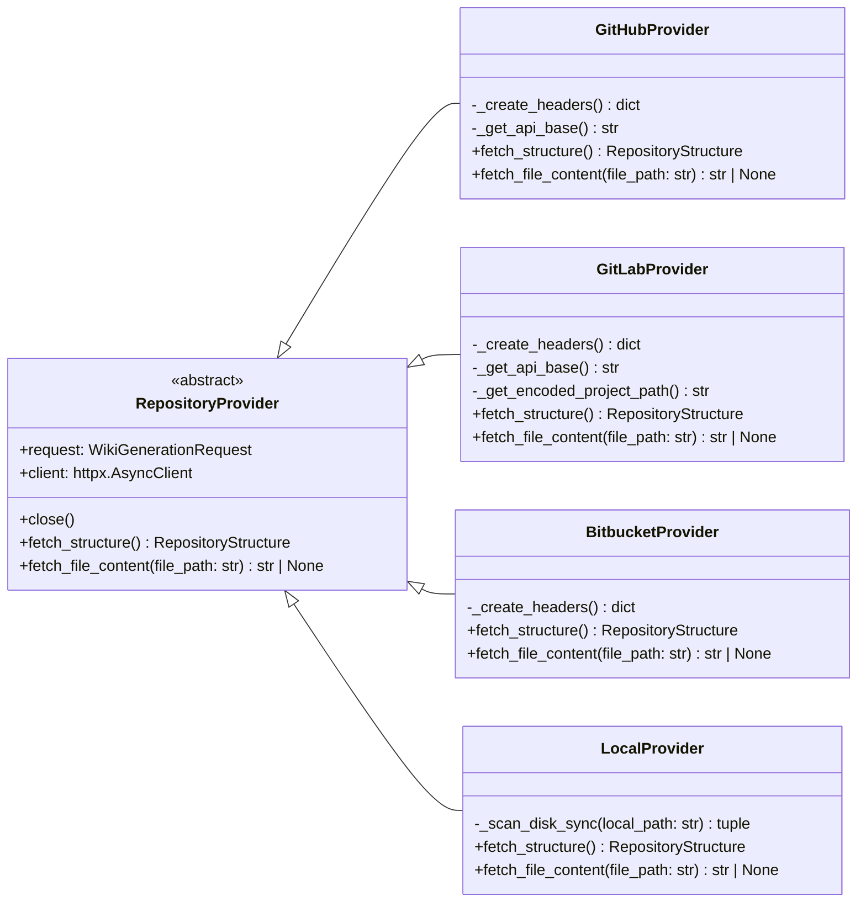

### Concrete Provider Implementations

Each concrete provider implements the abstract methods of `RepositoryProvider`, tailoring the logic to the specific API or access method of its respective platform.

#### GitHubProvider

The `GitHubProvider` (`src/providers/github.py`) interacts with the GitHub REST API.
*   **Authentication**: Uses `GIT_API_TOKEN` for authenticated requests via the `Authorization` header.
*   **API Base**: Defaults to `https://api.github.com`.
*   **Structure Fetching**:
    *   Retrieves the default branch from the repository info endpoint.
    *   Fetches the file tree recursively using the Git Trees API (`/git/trees/{default_branch}?recursive=1`).
    *   Fetches README content using the dedicated `/readme` endpoint, handling Base64 decoding.
*   **File Content Fetching**: Uses the `/contents/{file_path}` endpoint, also requiring Base64 decoding.

Sources: [src/providers/github.py](GitHubProvider class)

#### GitLabProvider

The `GitLabProvider` (`src/providers/gitlab.py`) supports both GitLab.com and self-hosted GitLab instances.
*   **Authentication**: Uses `PRIVATE-TOKEN` for authentication.
*   **API Base**: Dynamically determines the API base URL by parsing `repo_url` to support self-hosted instances (e.g., `https://your-gitlab.com/api/v4`). Defaults to `https://gitlab.com/api/v4`.
*   **Project Path Encoding**: Encodes the `owner/repo` path (e.g., `owner%2Frepo`) as required by GitLab's API.
*   **Structure Fetching**:
    *   Retrieves the default branch from the project info endpoint.
    *   Fetches the file tree using the repository tree API (`/repository/tree`), handling pagination.
    *   Fetches README content directly from the raw file API (`/repository/files/README.md/raw`).
*   **File Content Fetching**: Uses the raw file API (`/repository/files/{encoded_file_path}/raw`) to get plain text content.

Sources: [src/providers/gitlab.py](GitLabProvider class)

#### BitbucketProvider

The `BitbucketProvider` (`src/providers/bitbucket.py`) integrates with the Bitbucket Cloud API.
*   **Authentication**: Uses `Bearer` token for authorization.
*   **API Base**: Fixed to `https://api.bitbucket.org/2.0/repositories`.
*   **Structure Fetching**:
    *   Retrieves the default branch from the repository information (`mainbranch` field).
    *   Fetches the file tree using the `/src/{default_branch}/` endpoint with `recursive=true` and pagination.
    *   Fetches README content from the `/src/{default_branch}/README.md` endpoint.
*   **File Content Fetching**: Uses the `/src/{branch}/{file_path}` endpoint to retrieve raw file content.

Sources: [src/providers/bitbucket.py](BitbucketProvider class)

#### LocalProvider

The `LocalProvider` (`src/providers/local.py`) handles repositories located on the local filesystem.
*   **No External Client**: Does not use `httpx.AsyncClient` as it interacts directly with the file system.
*   **Structure Fetching**:
    *   Uses `os.walk` to traverse the local directory.
    *   Filters files and directories based on `IGNORED_PATTERNS`.
    *   Reads `README.md` if present.
    *   Performs disk I/O in a separate thread using `asyncio.to_thread` to prevent blocking the event loop.
*   **File Content Fetching**: Reads file content directly from the local path, also using `asyncio.to_thread`.

Sources: [src/providers/local.py](LocalProvider class)

### Repository Data Fetching Flow

The overall flow for fetching repository data is standardized across all providers, leveraging the `RepositoryProvider` interface.

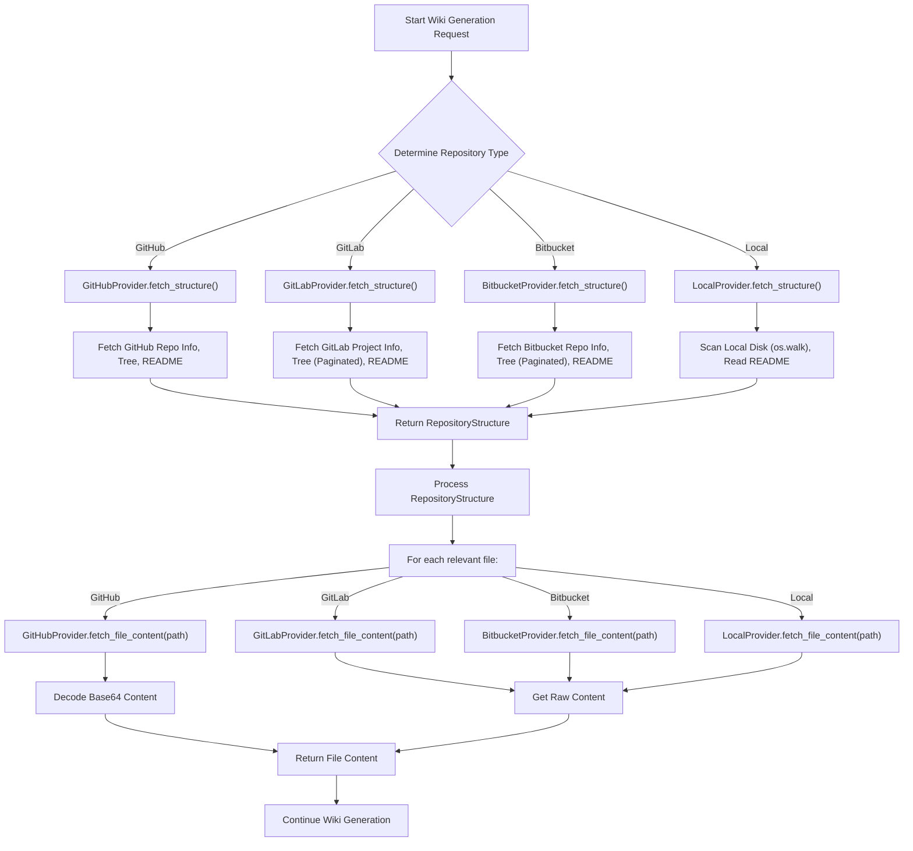

## Deployment Platform Compatibility (Deployment)

The project ensures deployment compatibility across various environments through the use of Docker and multi-stage builds. This approach provides isolated, reproducible, and efficient deployments for different use cases.

### Multi-Stage Docker Builds

All Dockerfiles (`Dockerfile`, `Dockerfile.action`, `Dockerfile.server`) utilize a two-stage build process:
1.  **Builder Stage**: Installs dependencies using `uv` and creates a virtual environment. This stage is optimized for caching and reduces the final image size.
2.  **Final Image Stage**: Copies the virtual environment and application source code from the builder stage into a minimal base image, resulting in a lean production image.

**Common Patterns:**
*   **Base Image**: `python:3.12-slim-bookworm` is used consistently for both stages.
*   **Dependency Management**: `uv` is used for fast and reliable dependency installation (`uv sync --frozen --no-dev --no-install-project`).
*   **`uv` Environment Variables**: `UV_COMPILE_BYTECODE=1` and `UV_LINK_MODE=copy` are set for performance.
*   **User Isolation**: `appuser` is created and used in the final image for enhanced security.
*   **Environment Variables**: `PATH` is updated to include the virtual environment's binaries, and `PYTHONPATH` is set to `/app` for module resolution.

Sources: [Dockerfile](Dockerfile), [Dockerfile.action](Dockerfile.action), [Dockerfile.server](Dockerfile.server)

### Specific Deployment Targets

#### Full Application (Dockerfile)

This `Dockerfile` builds an image containing both the API server and the Streamlit UI.
*   **Dependencies**: Installs all dependencies (`--extra all`).
*   **Exposed Ports**: `8000` (for API) and `8501` (for Streamlit) are exposed.
*   **Entrypoint**: Uses `entrypoint.sh` to start the application, implying it orchestrates both API and UI services.

Sources: [Dockerfile](Dockerfile)

#### GitHub Action (Dockerfile.action)

This `Dockerfile.action` is tailored for deployment as a GitHub Action.
*   **Dependencies**: Installs dependencies specific to the action, potentially including Notion integration (`--extra notion`).
*   **Working Directory**: Sets `WORKDIR /github/workspace` to align with GitHub Actions' execution context.
*   **Entrypoint**: The `ENTRYPOINT` is set directly to `["python", "/app/src/action_entrypoint.py"]`, indicating a direct execution of the action's main script.

Sources: [Dockerfile.action](Dockerfile.action)

#### API Server (Dockerfile.server)

This `Dockerfile.server` creates a dedicated image for the API server component.
*   **Dependencies**: Installs API-specific dependencies (`--extra api`).
*   **Exposed Port**: Only `8000` (for API) is exposed.
*   **Command**: Uses `gunicorn` to serve the FastAPI application (`src.server:app`) with `uvicorn.workers.UvicornWorker`, configured for production with multiple workers and logging.

Sources: [Dockerfile.server](Dockerfile.server)

### Deployment Architecture Overview

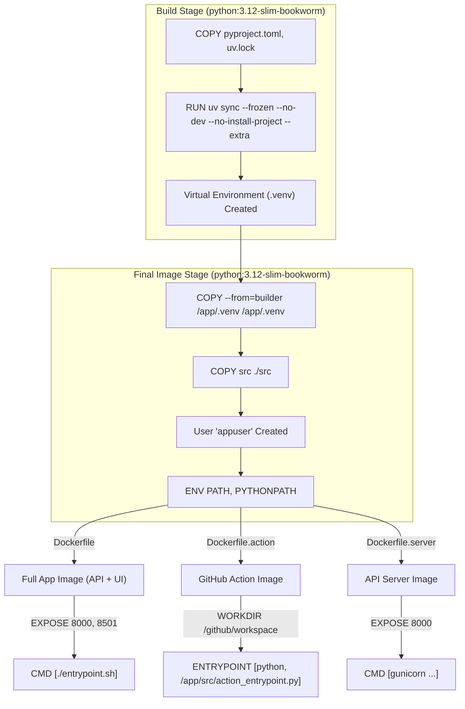

## Conclusion

The `wiki-as-readme` project demonstrates robust universal compatibility through its architectural design. Repository platform compatibility is achieved via a flexible `RepositoryProvider` abstraction, allowing seamless integration with GitHub, GitLab, Bitbucket, and local filesystems. Deployment compatibility is ensured through well-structured, multi-stage Dockerfiles that cater to different operational needs: a full application, a GitHub Action, and a dedicated API server. This comprehensive approach guarantees that the project can be utilized effectively across a wide spectrum of development environments and workflows.

---

<a name="llm-integration-and-configuration"></a>

<details>
<summary>Relevant source files</summary>

The following files were used as context for generating this wiki page:

- [src/agent/llm.py](src/agent/llm.py)
- [src/core/config.py](src/core/config.py)
- [.env example](.env example)
</details>

# LLM Integration and Configuration

## Introduction

This document details the architecture and configuration for integrating Large Language Models (LLMs) into the project, primarily for wiki generation tasks. The system leverages `LiteLLM` as a unified interface to interact with various LLM providers, ensuring flexibility and ease of switching between models. Configuration is managed centrally through Pydantic settings, allowing for environment-based adjustments and provider-specific parameters.

The core components involved are the `LLMWikiMaker` class in `src/agent/llm.py`, which acts as a wrapper around `LiteLLM`, and the `Settings` class in `src/core/config.py`, which defines all configurable parameters related to LLMs and their providers.

## LLM Wrapper: `LLMWikiMaker`

The `LLMWikiMaker` class provides a type-safe, generic wrapper around the `LiteLLM` library, designed specifically for wiki generation. It abstracts away the complexities of interacting with different LLM APIs, offering a consistent interface for making LLM calls, including support for structured output.

Sources: [src/agent/llm.py](LLMWikiMaker class)

### Class Definition and Initialization

```python
class LLMWikiMaker[T: BaseModel]:
    def __init__(self, response_schema: type[T] | None = None):
        self.response_schema = response_schema
        self.model_name, self.completion_kwargs = self._configure_llm()
```

*   **Generics (`[T: BaseModel]`):** Enables type-safe structured output. If a `response_schema` (a Pydantic `BaseModel`) is provided, the `ainvoke` method will attempt to return an instance of that schema.
*   **`response_schema`:** An optional Pydantic model used to guide the LLM to produce structured JSON output and to validate/parse the response.
*   **`_configure_llm()`:** This private method is called during initialization to determine the specific LLM model name and provider-specific keyword arguments based on the global settings.

Sources: [src/agent/llm.py](LLMWikiMaker.__init__)

### LLM Configuration Logic: `_configure_llm()`

This method is responsible for dynamically setting up the LLM model and its parameters based on the `LLM_PROVIDER` specified in the application settings. It handles provider-specific prefixes for model names (e.g., `vertex_ai/`, `openai/`) and injects necessary API keys or base URLs into the environment or `LiteLLM` call arguments.

```python
    def _configure_llm(self) -> tuple[str, dict]:
        # ... logic for different providers ...
```

The configuration process involves:
1.  Retrieving `LLM_PROVIDER` and `MODEL_NAME` from `settings`.
2.  Setting global parameters like `temperature` and `max_retries`.
3.  Conditionally configuring provider-specific details:
    *   **Google Vertex AI:** Requires `GCP_PROJECT_NAME` and `GCP_MODEL_LOCATION`.
    *   **OpenAI:** Requires `OPENAI_API_KEY` or `LLM_BASE_URL`.
    *   **Anthropic:** Requires `ANTHROPIC_API_KEY`.
    *   **OpenRouter:** Requires `OPENROUTER_API_KEY`.
    *   **xAI:** Requires `XAI_API_KEY`.
    *   **Ollama / On-premise:** Uses `LLM_BASE_URL` for local endpoints.
4.  Ensuring API keys are set in `os.environ` if not already present, as required by `LiteLLM` for some providers.

Sources: [src/agent/llm.py](LLMWikiMaker._configure_llm)

#### `_configure_llm()` Flowchart

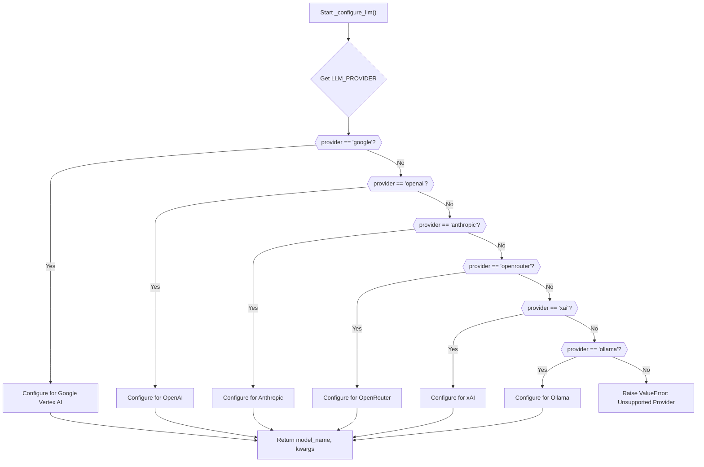

### Asynchronous Invocation: `ainvoke()`

This is the primary method for making calls to the LLM. It handles input preparation, LLM invocation via `litellm.acompletion`, and response parsing, especially for structured outputs.

```python
    async def ainvoke(self, input_data: Any) -> T | str:
        # ...
```

Key steps within `ainvoke`:
1.  **Input Processing:** Converts `input_data` into a string prompt. If `input_data` has a `to_string()` method, it's used; otherwise, `str()` is called.
2.  **LLM Call Settings:** Constructs the `call_kwargs` dictionary, including the model name, messages, and general completion arguments.
3.  **Structured Output:** If `response_schema` is provided and `settings.USE_STRUCTURED_OUTPUT` is `True`, `response_format` is added to `call_kwargs`, instructing `LiteLLM` (and the underlying LLM if supported) to return JSON.
4.  **LLM Call:** Executes the asynchronous call using `await litellm.acompletion(**call_kwargs)`.
5.  **Response Parsing:**
    *   If `response_schema` is set, it attempts to parse the LLM's response into the specified Pydantic model.
    *   It first checks if `LiteLLM` already parsed the response (`message.parsed`).
    *   If not, it extracts JSON from markdown code blocks (using `_extract_json`) and then uses `response_schema.model_validate_json()` for parsing.
    *   If `response_schema` is not set, the raw string content is returned.

Sources: [src/agent/llm.py](LLMWikiMaker.ainvoke)

### JSON Extraction: `_extract_json()`

A utility method to robustly extract JSON strings from LLM responses that might be wrapped in markdown code blocks (e.g., ````json\n...\n````). This ensures that even if the LLM doesn't natively support structured output, the system can still parse JSON when `USE_STRUCTURED_OUTPUT` is `False` but the model is prompted to return JSON.

Sources: [src/agent/llm.py](LLMWikiMaker._extract_json)

## Configuration Management: `src.core.config.py`

The `src.core.config.py` file defines the `Settings` class using Pydantic's `BaseSettings`. This class centralizes all application configurations, including those related to LLM integration. Settings are loaded from environment variables, with `.env` files providing a convenient way to manage local configurations.

Sources: [src/core/config.py](Settings class)

### Key LLM-Related Configuration Parameters

The following table outlines the primary settings that control LLM behavior and provider selection. These can be set via environment variables or in a `.env` file.

| Parameter | Type | Description |
|---|---|---|
| `LLM_PROVIDER` | `Literal` | Specifies the LLM service to use: `google`, `openai`, `anthropic`, `openrouter`, `xai`, `ollama`. |
| `MODEL_NAME` | `str` | The specific model identifier (e.g., `gemini-2.5-flash`, `gpt-4o`). |
| `OPENAI_API_KEY` | `str | None` | API key for OpenAI models. |
| `ANTHROPIC_API_KEY` | `str | None` | API key for Anthropic models. |
| `OPENROUTER_API_KEY` | `str | None` | API key for OpenRouter models. |
| `XAI_API_KEY` | `str | None` | API key for xAI models. |
| `LLM_BASE_URL` | `str | None` | Custom base URL for LLM APIs (e.g., for Ollama or local proxies). |
| `USE_STRUCTURED_OUTPUT` | `bool` | If `True`, attempts to use native structured JSON output features of the LLM. |
| `temperature` | `float` | Controls the randomness of the LLM's output (0.0 for deterministic, 1.0 for creative). |
| `max_retries` | `int` | Maximum number of retry attempts for failed LLM requests. |
| `max_concurrency` | `int` | Limits the number of parallel LLM calls to prevent rate limits. |
| `GCP_PROJECT_NAME` | `str | None` | Google Cloud project name for Vertex AI. |
| `GCP_MODEL_LOCATION` | `str | None` | Google Cloud region for Vertex AI models. |
| `GOOGLE_APPLICATION_CREDENTIALS` | `SecretStr | None` | Path to Google Cloud service account JSON key (handled by `LiteLLM` implicitly or via `GOOGLE_APPLICATION_CREDENTIALS` env var). |
| `IGNORED_PATTERNS` | `list[str]` | Glob patterns for files/directories to exclude from LLM context. Can be provided as a JSON string or comma-separated string. |

Sources: [src/core/config.py](Settings class), [.env example](.env example)

### `IGNORED_PATTERNS` Parsing

The `IGNORED_PATTERNS` setting has a custom validator (`parse_ignored_patterns`) that allows it to be defined in several ways:
*   As a JSON array string (e.g., `'["file1.txt", "*.log"]'`).
*   As a comma-separated string (e.g., `"file1.txt, *.log"`).
*   If empty or invalid, it defaults to `DEFAULT_IGNORED_PATTERNS`.

Sources: [src/core/config.py](parse_ignored_patterns method)

## Overall LLM Integration Flow

The following diagram illustrates how configuration settings are loaded and utilized by the `LLMWikiMaker` to interact with LLMs.

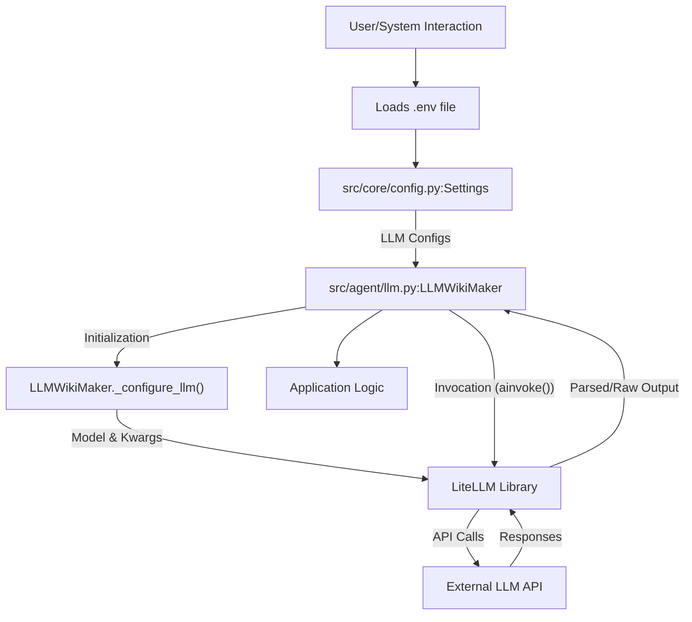

## Conclusion

The LLM integration and configuration system provides a robust, flexible, and extensible framework for leveraging various large language models. By centralizing configuration, abstracting provider-specific details through `LiteLLM`, and offering type-safe structured output, the system ensures that the application can easily adapt to different LLM providers and models while maintaining code clarity and reliability for wiki generation tasks.

---

<a name="using-as-a-github-action"></a>

<details>
<summary>Relevant source files</summary>

The following files were used as context for generating this wiki page:

- [.github/workflows/wiki-as-readme-action.yml](.github/workflows/wiki-as-readme-action.yml)
- [action.yml](action.yml)
- [WIKI-AS-README-AS-ACTION.yml](WIKI-AS-README-AS-ACTION.yml)
</details>

# Using as a GitHub Action

The `Wiki-As-Readme` project provides a GitHub Action that automates the generation of comprehensive documentation (wiki or README) directly from your codebase. This action leverages Large Language Models (LLMs) to analyze repository content and produce structured, human-readable documentation, which can then be committed back to the repository or synchronized with external platforms like Notion.

This document details how to integrate and configure the `Wiki-As-Readme` action within your GitHub workflows, covering its inputs, triggers, and operational flow.

## Action Overview (`action.yml`)

The `Wiki-As-Readme` GitHub Action is defined by `action.yml`, which specifies its metadata, inputs, and execution environment. It runs as a Docker container, encapsulating all necessary dependencies.

### Action Inputs

The action accepts various inputs to control its behavior, LLM configuration, and integration with external services. These inputs are typically passed as environment variables to the Docker container.

| Input Name | Description | Default | Required |
|---|---|---|---|
| `language` | Language for the generated content (e.g., `ko`, `en`, `ja`) | `en` | No |
| `wiki_output_path` | The file path to save the generated wiki content | `WIKI.md` | No |
| `llm_provider` | LLM provider to use (e.g., `google`, `openai`, `anthropic`, `openrouter`, `xai`, `ollama`) | `google` | No |
| `model_name` | Specific model name to use (e.g., `gemini-2.5-flash`, `gpt-4o`) | `gemini-2.5-flash` | No |
| `openai_api_key` | OpenAI API Key | | No |
| `anthropic_api_key` | Anthropic API Key | | No |
| `openrouter_api_key` | OpenRouter API Key | | No |
| `xai_api_key` | xAI API Key | | No |
| `git_api_token` | GitHub/GitLab API Token for private repos | | No |
| `gcp_project_name` | GCP Project Name (for Google LLM providers) | | No |
| `gcp_model_location` | GCP Model Location (for Google LLM providers) | | No |
| `google_application_credentials` | GCP Service Account JSON Key (Content or Path) | | No |
| `llm_base_url` | Custom base URL for LLM API (for self-hosted or proxy setups) | | No |
| `use_structured_output` | Whether to use structured JSON output from LLM | `true` | No |
| `temperature` | LLM temperature (0.0 to 1.0) | `0.0` | No |
| `max_retries` | Max retry attempts for LLM calls | `3` | No |
| `max_concurrency` | Max parallel LLM calls | `5` | No |
| `ignored_patterns` | JSON array of glob patterns to ignore during codebase analysis | `[]` | No |

Sources: [action.yml](action.yml)

## Workflow Integration

The action is typically integrated into a GitHub Actions workflow (`.github/workflows/*.yml`) to automate its execution. The provided examples (`.github/workflows/wiki-as-readme-action.yml` and `WIKI-AS-README-AS-ACTION.yml`) demonstrate common configurations.

### Workflow Triggers

The action can be triggered in two primary ways:

1.  **`push` event:** Automatically runs when changes are pushed to the `main` branch. It is configured to ignore changes to `README.md`, `WIKI.md`, and its own workflow file to prevent infinite loops.
    ```yaml
    on:
      push:
        branches:
          - main
        paths-ignore:
          - 'README.md'
          - 'WIKI.md'
          - '.github/workflows/WIKI-AS-README-AS-ACTION.yml'
    ```
    Sources: [.github/workflows/wiki-as-readme-action.yml](.github/workflows/wiki-as-readme-action.yml)

2.  **`workflow_dispatch` event:** Allows manual triggering of the workflow from the GitHub UI, providing an interface for custom inputs. This is useful for on-demand generation with specific settings.

    | Input Name | Description | Type | Default |
    |---|---|---|---|
    | `language` | Language code (e.g., `ko`, `en`, `ja`, etc.) | `string` | `en` |
    | `llm_provider` | LLM Provider (e.g., `google`, `openai`, `anthropic`, etc.) | `string` | `google` |
    | `model_name` | Model Name | `string` | `gemini-2.5-flash` |
    | `sync_to_notion` | Sync to Notion? | `boolean` | `false` |
    | `commit_method` | How to apply changes (`push` or `pull-request`) | `choice` | `push` |

    Sources: [.github/workflows/wiki-as-readme-action.yml](.github/workflows/wiki-as-readme-action.yml)

### Workflow Job Structure

A typical workflow job (`wiki-time`) using the `Wiki-As-Readme` action includes several steps:

#### 1. Job Configuration

*   **`runs-on: ubuntu-latest`**: Specifies the runner environment.
*   **`permissions`**: Requires `contents: write` to commit changes and `pull-requests: write` to create pull requests.
*   **`env`**: Defines environment variables, such as `WIKI_OUTPUT_PATH`, which can be overridden by action inputs.

#### 2. Checkout Code

The `actions/checkout@v4` action is used to fetch the repository's code.

```yaml
- name: Checkout code
  uses: actions/checkout@v4
```
Sources: [.github/workflows/wiki-as-readme-action.yml](.github/workflows/wiki-as-readme-action.yml)

#### 3. GCP Credentials Setup (Optional)

If Google is selected as the LLM provider (or if it's the default for a `push` event), this step conditionally creates a `gcp-key.json` file from the `GOOGLE_APPLICATION_CREDENTIALS` secret. A warning is issued if the secret is missing.

```yaml
- name: Create GCP Credentials File
  if: ${{ (inputs.llm_provider == 'google') || (inputs.llm_provider == '') || (github.event_name == 'push') }}
  env:
    GCP_KEY: ${{ secrets.GOOGLE_APPLICATION_CREDENTIALS }}
  run: |
    if [ -n "$GCP_KEY" ]; then
      echo "$GCP_KEY" > ./gcp-key.json
    else
      echo "::warning::GOOGLE_APPLICATION_CREDENTIALS secret is missing, but provider is set to google."
    fi
```
Sources: [.github/workflows/wiki-as-readme-action.yml](.github/workflows/wiki-as-readme-action.yml)

#### 4. Generate Wiki Content & Sync

This is the core step where the `Wiki-As-Readme` action is invoked. It uses the Docker image `ghcr.io/catuscio/wiki-as-readme-action:latest`. Inputs from `workflow_dispatch` or default values are passed as environment variables to the action.

Key environment variables configured:
*   **Basic Settings**: `LANGUAGE`, `WIKI_OUTPUT_PATH`.
*   **LLM Settings**: `LLM_PROVIDER`, `MODEL_NAME`.
*   **API Keys**: `GCP_PROJECT_NAME`, `GCP_MODEL_LOCATION`, `GOOGLE_APPLICATION_CREDENTIALS` (pointing to the created file), `OPENAI_API_KEY`, `ANTHROPIC_API_KEY`.
*   **GitHub Token**: `GIT_API_TOKEN` (using `GITHUB_TOKEN` for repository access).
*   **Notion Sync**: `NOTION_SYNC_ENABLED`, `NOTION_API_KEY`, `NOTION_DATABASE_ID`.

```yaml
- name: Generate Content (and Sync to Notion if enabled)
  uses: docker://ghcr.io/catuscio/wiki-as-readme-action:latest
  env:
    # ... (environment variables as described above) ...
```
Sources: [.github/workflows/wiki-as-readme-action.yml](.github/workflows/wiki-as-readme-action.yml)

#### 5. GCP Credentials Cleanup (Optional)

Ensures the temporary `gcp-key.json` file is removed, regardless of previous step outcomes.

```yaml
- name: Remove GCP Credentials File
  if: always()
  run: rm -f ./gcp-key.json
```
Sources: [.github/workflows/wiki-as-readme-action.yml](.github/workflows/wiki-as-readme-action.yml)

#### 6. Commit and Push Changes

After content generation, the workflow handles updating the repository. This can be done in two ways, controlled by the `commit_method` input:

*   **Direct Push (`push`):** Uses `stefanzweifel/git-auto-commit-action@v5` to commit and push changes directly to the branch. This is the default for `push` events.
    ```yaml
    - name: Commit and Push changes
      if: ${{ inputs.commit_method == 'push' || github.event_name == 'push' }}
      uses: stefanzweifel/git-auto-commit-action@v5
      with:
        commit_message: "✨📚 Update ${{ env.WIKI_OUTPUT_PATH }} via Wiki-As-Readme Action (${{ inputs.language || 'en' }})"
        file_pattern: ${{ env.WIKI_OUTPUT_PATH }}
    ```
    Sources: [.github/workflows/wiki-as-readme-action.yml](.github/workflows/wiki-as-readme-action.yml)

*   **Create Pull Request (`pull-request`):** Uses `peter-evans/create-pull-request@v7` to create a new pull request with the generated content.
    ```yaml
    - name: Create Pull Request
      if: ${{ inputs.commit_method == 'pull-request' }}
      uses: peter-evans/create-pull-request@v7
      with:
        title: "✨📚 Update ${{ env.WIKI_OUTPUT_PATH }} via Wiki-As-Readme Action"
        # ... (body, branch, commit-message, add-paths) ...
    ```
    Sources: [.github/workflows/wiki-as-readme-action.yml](.github/workflows/wiki-as-readme-action.yml)

### Workflow Execution Flow

The following diagram illustrates the sequence of steps within the `wiki-time` job:

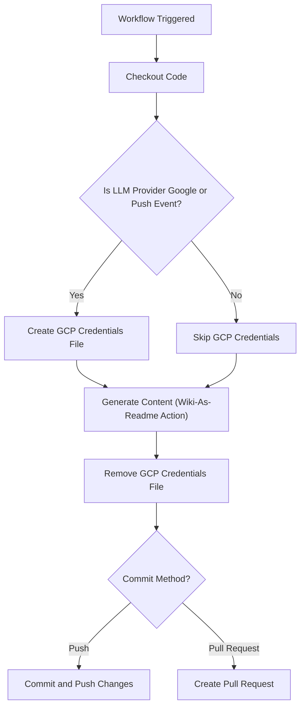

## Conclusion

The `Wiki-As-Readme` GitHub Action provides a robust and automated solution for generating and maintaining project documentation. By integrating it into your CI/CD pipeline, you can ensure your project's wiki or README is always up-to-date, reflecting the current state of your codebase. Its flexible configuration options allow for customization across various LLM providers, output formats, and commit strategies, making it adaptable to diverse project needs.

---

<a name="local-development-and-docker-setup"></a>

<details>
<summary>Relevant source files</summary>

The following files were used as context for generating this wiki page:

- [docker-compose.yml](docker-compose.yml)
- [Dockerfile](Dockerfile)
- [Dockerfile.server](Dockerfile.server)
- [src/server.py](src/server.py)
- [src/app.py](src/app.py)
- [pyproject.toml](pyproject.toml)
</details>

# Local Development and Docker Setup

## Introduction

This document outlines the local development environment setup for the `wiki-as-readme` project, primarily leveraging Docker and Docker Compose. This setup provides a consistent and isolated environment for running both the FastAPI backend API and the Streamlit user interface, ensuring that the application behaves identically across different development machines. By containerizing the application, developers can quickly get the project running without worrying about local dependency conflicts or system-specific configurations.

The Docker setup supports two main deployment scenarios: a full application stack including both the API and UI, and a server-only deployment for just the API. This flexibility allows for efficient development and deployment tailored to specific needs.

## Docker Compose Configuration

The `docker-compose.yml` file orchestrates the multi-container application, defining how the `wiki-as-readme` service is built, configured, and run. It simplifies the process of launching the entire application stack with a single command.

### Service Definition

The primary service defined is `wiki-as-readme`, which encapsulates the full application (API + UI).

```yaml
services:
  wiki-as-readme:
    build: .
    container_name: wiki-as-readme
    ports:
      - "8000:8000" # API
      - "8501:8501" # Streamlit UI
    env_file:
      - .env
    environment:
      - GOOGLE_APPLICATION_CREDENTIALS=/app/credentials.json # Optional, for Google Cloud
    volumes:
      - ${WIKI_OUTPUT_PATH:-./output}:/app/output
      - ${GOOGLE_CREDENTIALS_PATH:-./credentials.json}:/app/credentials.json # Optional
      - ${LOCAL_REPO_PATH:-./}:/app/target_repo
    restart: always
```
Sources: [docker-compose.yml](docker-compose.yml)

### Key Configuration Details

| Configuration | Description | Details |
|---|---|---|
| `build: .` | Specifies that Docker Compose should build the image from the `Dockerfile` in the current directory. | Uses `Dockerfile` by default. |
| `container_name` | Assigns a static name to the container. | `wiki-as-readme` |
| `ports` | Maps container ports to host ports. | `8000:8000` for FastAPI API, `8501:8501` for Streamlit UI. |
| `env_file` | Loads environment variables from a specified file. | `.env` file is used for project-specific environment variables. |
| `environment` | Sets specific environment variables within the container. | `GOOGLE_APPLICATION_CREDENTIALS` is set if using Google Cloud services, pointing to a path within the container. |
| `volumes` | Mounts host paths into the container, enabling data persistence and local code access. | See table below for details. |
| `restart` | Defines the container's restart policy. | `always` ensures the container restarts if it stops. |

### Volume Mappings

Volumes are crucial for local development, allowing the container to interact with the host filesystem for input repositories, output files, and credentials.

| Host Path (Default) | Container Path | Description | Environment Variable |
|---|---|---|---|
| `./output` | `/app/output` | Directory to save generated wiki files. | `WIKI_OUTPUT_PATH` |
| `./credentials.json` | `/app/credentials.json` | Path to Google Cloud credentials file. | `GOOGLE_CREDENTIALS_PATH` |
| `./` (current directory) | `/app/target_repo` | Mounts a local repository for analysis. This is the path to reference when providing local paths in the Streamlit UI. | `LOCAL_REPO_PATH` |
Sources: [docker-compose.yml](docker-compose.yml), [src/app.py](render_generator_page function)

## Docker Images

The project provides two distinct Dockerfiles to cater to different deployment needs: one for the full application (API + UI) and another for the API server only. Both leverage a multi-stage build process for efficiency.

### `Dockerfile` (Full Application: API + UI)

This Dockerfile builds an image containing both the FastAPI API and the Streamlit UI. It's used by default when `docker-compose.yml` specifies `build: .`.

#### Build Stages

1.  **Stage 1: `builder`**
    *   **Base Image:** `python:3.12-slim-bookworm`
    *   **Dependency Manager:** Copies `uv` (a fast Python package installer) from `ghcr.io/astral-sh/uv:latest`.
    *   **Dependencies:** Installs all project dependencies, including `ui` and `api` extras, using `uv sync --frozen --no-dev --no-install-project --extra all`. This ensures all components (FastAPI, Streamlit, etc.) are available.
    Sources: [Dockerfile](Dockerfile), [pyproject.toml](project.optional-dependencies)

2.  **Stage 2: Final Image**
    *   **Base Image:** `python:3.12-slim-bookworm`
    *   **Metadata:** Includes OCI labels for maintainer, description, source, license, authors, title, and version.
    *   **User:** Creates a non-root `appuser` for security.
    *   **Application Copy:** Copies the installed virtual environment (`.venv`) from the `builder` stage and the application source code (`src`).
    *   **Entrypoint:** Copies `entrypoint.sh` (not provided in context, but implied) and makes it executable.
    *   **Environment:** Sets `PATH` to include the virtual environment binaries and `PYTHONPATH` to `/app` for module imports.
    *   **Exposed Ports:** `8000` (API) and `8501` (Streamlit UI).
    *   **User:** Switches to `appuser`.
    *   **Command:** Executes `./entrypoint.sh` when the container starts.
    Sources: [Dockerfile](Dockerfile)

### `Dockerfile.server` (API Server Only)

This Dockerfile builds a lighter image containing only the FastAPI API server. This is suitable for deployments where the UI is not needed or is hosted separately.

#### Build Stages

1.  **Stage 1: `builder`**
    *   **Base Image:** `python:3.12-slim-bookworm`
    *   **Dependency Manager:** Copies `uv`.
    *   **Dependencies:** Installs only the `api` extra dependencies using `uv sync --frozen --no-dev --no-install-project --extra api`.
    Sources: [Dockerfile.server](Dockerfile.server), [pyproject.toml](project.optional-dependencies)

2.  **Stage 2: Final Image**
    *   **Base Image:** `python:3.12-slim-bookworm`
    *   **Metadata:** Similar OCI labels as the full application Dockerfile, but with `wiki-as-readme-server` title.
    *   **User:** Creates `appuser`.
    *   **Application Copy:** Copies the virtual environment and `src` directory.
    *   **Environment:** Sets `PATH` and `PYTHONPATH`.
    *   **Exposed Port:** `8000` (API only).
    *   **User:** Switches to `appuser`.
    *   **Command:** Runs the FastAPI application using `gunicorn` with `uvicorn.workers.UvicornWorker` on port `0.0.0.0:8000`.
    Sources: [Dockerfile.server](Dockerfile.server)

## Application Components

### FastAPI Server (`src/server.py`)

The backend API is built with FastAPI, providing endpoints for wiki generation and webhook integration.

*   **Entry Point:** `src.server:app`
*   **Health Check:** `GET /` returns `{"status": "ok"}`.
*   **API Routers:**
    *   `/api/v1/wiki`: Handles wiki generation requests.
    *   `/api/v1/webhook`: Handles webhook integrations.
*   **Local Execution:** When run directly (`python src/server.py`), it uses `uvicorn` on `127.0.0.1:8000` with `reload=True`.
*   **Container Execution:** In `Dockerfile.server`, it's served by `gunicorn` on `0.0.0.0:8000`.
Sources: [src/server.py](src/server.py)

### Streamlit UI (`src/app.py`)

The frontend user interface is built with Streamlit, allowing users to interact with the wiki generation process.

*   **API Interaction:** Communicates with the FastAPI backend via `API_BASE_URL`, which defaults to `http://localhost:8000/api/v1`. This can be overridden by an environment variable.
*   **Wiki Generation Flow:**
    1.  User inputs repository details (URL or local path) and configuration (comprehensive view, language).
    2.  A `WikiGenerationRequest` is sent to `/api/v1/wiki/generate/file`.
    3.  The UI polls `/api/v1/wiki/status/{task_id}` for task completion.
    4.  Generated markdown content is displayed and available for download.
*   **Local Path Hint:** Provides a tip for Docker users: "For local analysis, use paths starting with `/app/target_repo`". This directly relates to the `LOCAL_REPO_PATH` volume mount.
*   **Output Directory:** Generated files are saved to the `output` directory (mapped via Docker volume).
*   **Mermaid Rendering:** Includes a helper function `render_markdown_with_mermaid` to correctly display Mermaid diagrams embedded in markdown.
Sources: [src/app.py](src/app.py)

## Local Development Workflow

### Starting the Full Application Stack

To start both the API and the Streamlit UI using Docker Compose:

1.  **Ensure Docker is running.**
2.  **Create a `.env` file** in the project root if you need to override default volume paths or provide specific credentials (e.g., `GOOGLE_CREDENTIALS_PATH`).
3.  **Run Docker Compose:**
    ```bash
    docker-compose up --build
    ```
    The `--build` flag ensures that the Docker image is rebuilt if there are changes to the Dockerfile or its context.

### Accessing the Application

Once the containers are running:

*   **Streamlit UI:** Access the user interface in your web browser at `http://localhost:8501`.
*   **FastAPI API:** The API will be available at `http://localhost:8000`. You can access its interactive documentation (Swagger UI) at `http://localhost:8000/docs`.

### Providing Local Repository Paths

When using the Streamlit UI to analyze a local repository mounted via Docker, ensure you provide the path relative to the container's `/app/target_repo` directory. For example, if your `docker-compose.yml` mounts `./my-project` to `/app/target_repo`, and you want to analyze a subfolder `src` within `my-project`, you would input `/app/target_repo/src` into the Streamlit UI.
Sources: [docker-compose.yml](docker-compose.yml), [src/app.py](render_generator_page function)

## System Architecture Overview

The following diagram illustrates the interaction between the host machine and the `wiki-as-readme` Docker container, highlighting port mappings and volume mounts essential for local development.

```mermaid
graph TD
    subgraph "Host Machine"
        HostBrowser["Web Browser"]
        HostTerminal["Terminal"]
        HostOutput["./output"]
        HostCredentials["./credentials.json"]
        HostRepo["./ (Local Repo)"]
    end

    subgraph "Docker Container: wiki-as-readme"
        ContainerAPI["FastAPI Server (Port 8000)"]
        ContainerUI["Streamlit UI (Port 8501)"]
        ContainerOutput["/app/output"]
        ContainerCredentials["/app/credentials.json"]
        ContainerTargetRepo["/app/target_repo"]
    end

    HostBrowser -- "Accesses" --> HostPort8501["Host Port 8501"]
    HostBrowser -- "Accesses" --> HostPort8000["Host Port 8000"]

    HostPort8501 -- "Maps to" --> ContainerUI
    HostPort8000 -- "Maps to" --> ContainerAPI

    HostOutput -- "Mounts to" --> ContainerOutput
    HostCredentials -- "Mounts to" --> ContainerCredentials
    HostRepo -- "Mounts to" --> ContainerTargetRepo

    ContainerUI -- "API Calls" --> ContainerAPI
    ContainerAPI -- "Reads from" --> ContainerTargetRepo
    ContainerAPI -- "Writes to" --> ContainerOutput
    ContainerAPI -- "Uses" --> ContainerCredentials
    HostTerminal -- "docker-compose up" --> DockerCompose["Docker Compose"]
    DockerCompose -- "Manages" --> "wiki-as-readme"
```

## UI-API Interaction Flow

This sequence diagram details how the Streamlit UI initiates a wiki generation task and subsequently monitors its progress with the FastAPI backend.

```mermaid
sequenceDiagram
    participant UI as "Streamlit UI"
    participant API as "FastAPI Server"
    participant Worker as "Wiki Generation Worker"

    UI->>API: POST /api/v1/wiki/generate/file (WikiGenerationRequest)
    API->>API: "Validate Request"
    API->>Worker: "Start Async Task"
    API-->>UI: "Return Task ID"

    loop "Poll Task Status"
        UI->>API: GET /api/v1/wiki/status/{task_id}
        API->>API: "Check Task Status"
        alt "Task Completed"
            API-->>UI: "Status: completed, Result: markdown_content"
            break
        else "Task Failed"
            API-->>UI: "Status: failed, Result: error_message"
            break
        else "Task In Progress"
            API-->>UI: "Status: in_progress"
            UI->>UI: "Update Progress Bar"
            UI->>UI: "Wait 2 seconds"
        end
    end
    UI->>UI: "Display Result / Error"
```
Sources: [src/app.py](start_generation_task function, poll_task_status function)

## Conclusion

The Docker and Docker Compose setup for `wiki-as-readme` provides a robust, consistent, and isolated environment for local development. By clearly defining services, port mappings, and volume mounts, developers can quickly set up the full application stack or just the API server. This containerized approach streamlines the development workflow, minimizes environment-related issues, and ensures that the application runs reliably from development to deployment.

---

<a name="deploying-as-a-server-with-webhooks"></a>

<details>
<summary>Relevant source files</summary>

The following files were used as context for generating this wiki page:

- [src/server.py](src/server.py)
- [src/api/v1/endpoints/webhook.py](src/api/v1/endpoints/webhook.py)
- [src/models/github_webhook_schema.py](src/models/github_webhook_schema.py)
- [Dockerfile.server](Dockerfile.server)
</details>

# Deploying as a Server with Webhooks

## Introduction

This document details the architecture and deployment strategy for the Wiki As Readme application when run as a standalone server, specifically focusing on its webhook integration capabilities. The server provides an API to generate comprehensive wiki documentation from a codebase and can automatically update a GitHub repository's `WIKI.md` file in response to code pushes via webhooks. This enables a continuous documentation workflow, ensuring the wiki remains synchronized with the latest codebase changes.

The core of the server is built using FastAPI, offering a robust and scalable API interface. It integrates with GitHub webhooks to automate the documentation generation and update process, making it a powerful tool for maintaining up-to-date project documentation with minimal manual intervention.

## Server Architecture Overview

The Wiki As Readme server is structured around a FastAPI application, serving multiple API endpoints. It leverages a modular design, separating concerns into different Python modules for API endpoints, data models, and core server logic.

### Core Components

*   **`src/server.py`**: The main entry point for the FastAPI application, responsible for initializing the API, registering routers, and starting the Uvicorn server.
*   **`src/api/v1/endpoints/webhook.py`**: Contains the logic for handling incoming GitHub webhooks, including signature verification, payload processing, and orchestrating the wiki generation and GitHub update process.
*   **`src/models/github_webhook_schema.py`**: Defines Pydantic models for parsing GitHub webhook push event payloads, ensuring data integrity and ease of access.
*   **`Dockerfile.server`**: Provides instructions for building a Docker image of the server, enabling containerized deployment.

## Server Setup and API Endpoints

The `src/server.py` file initializes the FastAPI application named "Wiki as Readme". It sets up basic metadata like title, description, and version.

```python
app = FastAPI(
    title="Wiki as Readme",
    description="Turn your codebase into a comprehensive Wiki in minutes, delivered in a single Readme.",
    version="1.3.0",
)
```
Sources: [src/server.py](app initialization)

The server exposes the following primary API routers:

*   **`/api/v1/wiki`**: Handles wiki generation requests.
*   **`/api/v1/webhook`**: Manages webhook integrations, specifically for GitHub.

A health check endpoint is also available at the root path (`/`) to verify server operational status.

```python
@app.get("/", tags=["Health Check"])
def health_check():
    return {"status": "ok"}
```
Sources: [src/server.py](health_check function)

The server is designed to run using Uvicorn, typically on `http://127.0.0.1:8000` in development, or `0.0.0.0:8000` when exposed in a containerized environment.

## Webhook Integration

The `src/api/v1/endpoints/webhook.py` module is dedicated to handling GitHub push webhooks, enabling automated wiki updates.

### GitHub Webhook Endpoint

The primary endpoint for GitHub integration is `POST /api/v1/webhook/github`. This endpoint is designed to be triggered by GitHub `push` events.

```python
@router.post("/github", status_code=status.HTTP_202_ACCEPTED)
async def github_webhook(
    payload: GitHubPushPayload, request: Request, background_tasks: BackgroundTasks
):
    # ...
```
Sources: [src/api/v1/endpoints/webhook.py](github_webhook function)

Upon receiving a push event, the endpoint performs several critical steps:

1.  **Signature Verification**: Ensures the request originates from GitHub and has not been tampered with.
2.  **Bot Commit Filtering**: Prevents infinite loops by ignoring commits made by the `Wiki-As-Readme-Bot` itself.
3.  **Branch Filtering**: Processes only push events to the `main` branch.
4.  **Background Task Initiation**: Dispatches the full wiki generation and update cycle to a background task to avoid blocking the webhook response.

### Security: Signature Verification

To ensure the authenticity and integrity of incoming webhooks, the server verifies the `X-Hub-Signature-256` header using a shared secret. This process uses HMAC SHA256.

```python
async def verify_signature(request: Request):
    """HMAC signature verification"""
    if not GITHUB_WEBHOOK_SECRET:
        return
    # ...
```
Sources: [src/api/v1/endpoints/webhook.py](verify_signature function)

The `GITHUB_WEBHOOK_SECRET` environment variable must be configured on the server and match the secret configured in the GitHub webhook settings. If the signature is missing or invalid, a `403 Forbidden` HTTP exception is raised.

### Automated Workflow: Full Cycle Processing

The `process_full_cycle` asynchronous function orchestrates the entire automated documentation update. This function is executed as a background task.

```python
async def process_full_cycle(
    generate_url: str, request_data_json: str, repo_owner: str, repo_name: str
):
    """
    Full process: Wiki Generation -> Get Result -> Upload to GitHub
    """
    # ...
```
Sources: [src/api/v1/endpoints/webhook.py](process_full_cycle function)

The workflow involves three main stages:

1.  **Call Internal Wiki Generation API**: An internal API call is made to the `/api/v1/wiki/generate/file` endpoint to generate the markdown content based on the repository information from the webhook payload.
2.  **Extract Generated Markdown**: The response from the generation API is parsed to extract the resulting markdown content.
3.  **Upload to GitHub**: The generated markdown is then committed to the `WIKI.md` file in the specified GitHub repository.

#### Webhook Processing Sequence Diagram

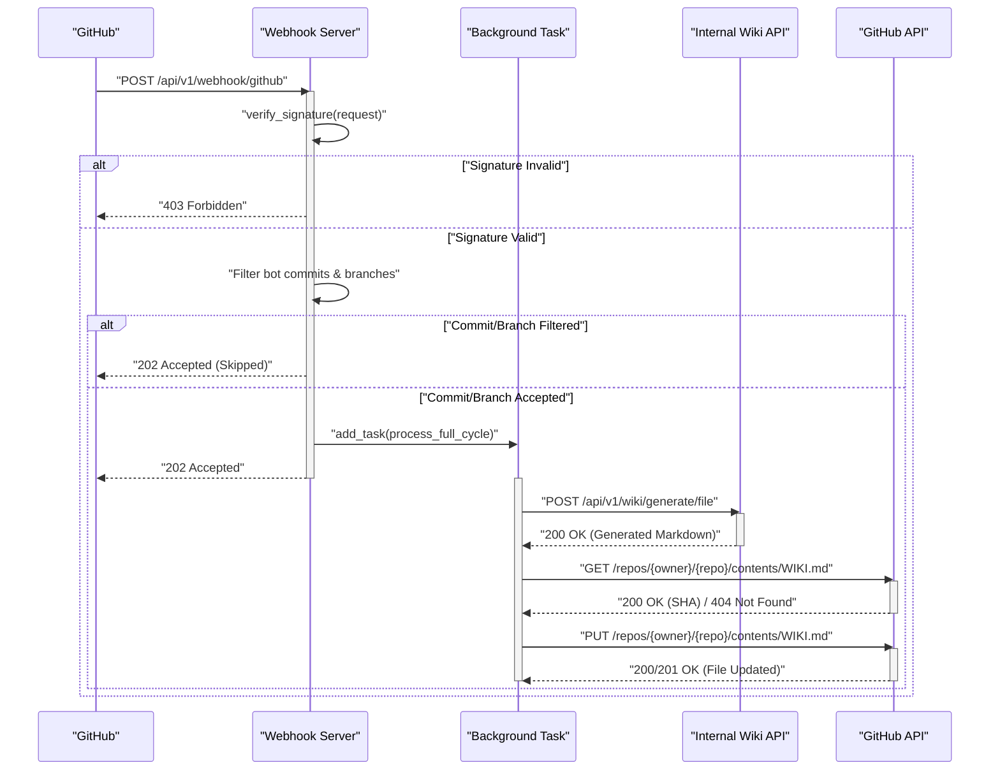

### GitHub Content Update

The `update_github_readme` function handles the actual commit of the generated markdown content back to GitHub.

```python
async def update_github_readme(repo_owner: str, repo_name: str, content: str):
    """
    [Core Feature] Commits the generated markdown content to GitHub's README.md (or WIKI.md).
    """
    # ...
```
Sources: [src/api/v1/endpoints/webhook.py](update_github_readme function)

This function requires a `GITHUB_ACCESS_TOKEN` (Personal Access Token) with appropriate write permissions to the repository. It first attempts to retrieve the SHA of the existing `WIKI.md` file (if any) to correctly update it. The content is base64 encoded as required by the GitHub API, and then a `PUT` request is made to update the file.

### Environment Variables

The webhook functionality relies on several environment variables for configuration:

| Variable | Description | Required |
|---|---|---|
| `GITHUB_WEBHOOK_SECRET` | Secret key used to verify the authenticity of GitHub webhook payloads. | Yes (for security) |
| `GITHUB_ACCESS_TOKEN` | GitHub Personal Access Token (PAT) with `repo` scope to allow the bot to write to repositories. | Yes (for GitHub updates) |
| `BOT_COMMITTER_NAME` | The name used by the bot when committing changes. Used to prevent infinite webhook loops. | No (defaults to "Wiki-As-Readme-Bot") |

Sources: [src/api/v1/endpoints/webhook.py](environment variable definitions)

## GitHub Webhook Payload Schema

The `src/models/github_webhook_schema.py` file defines the Pydantic models used to parse the incoming JSON payload from GitHub push events. This ensures that the data is correctly structured and validated.

The primary model is `GitHubPushPayload`, which includes nested models for `GitHubRepository`, `GitHubRepositoryOwner`, `GitHubPusher`, and `GitHubCommit`. This structured approach allows for easy access to relevant information like repository name, owner, pusher details, and commit messages.

Sources: [src/models/github_webhook_schema.py](GitHubPushPayload class)

## Containerized Deployment with Docker

The `Dockerfile.server` provides a multi-stage build process to create an efficient and secure Docker image for the Wiki As Readme server.

### Build Stages

1.  **Builder Stage**:
    *   Uses `python:3.12-slim-bookworm` as the base image.
    *   Copies the `uv` package manager.
    *   Installs Python dependencies specified in `pyproject.toml` and `uv.lock` into a virtual environment.
2.  **Final Image Stage**:
    *   Also uses `python:3.12-slim-bookworm` for a minimal runtime environment.
    *   Adds metadata labels for better image discoverability.
    *   Creates a non-root user `appuser` for security best practices.
    *   Copies the virtual environment and application source code from the builder stage.
    *   Sets `PATH` and `PYTHONPATH` environment variables.
    *   Exposes port `8000`.
    *   Sets `appuser` as the default user.
    *   Defines the `CMD` to run the application using `gunicorn` with `uvicorn.workers.UvicornWorker` for production-ready ASGI serving.

```dockerfile
CMD ["gunicorn", "-k", "uvicorn.workers.UvicornWorker", \
     "--bind", "0.0.0.0:8000", \
     "--workers", "2", \
     "--access-logfile", "-", \
     "--error-logfile", "-", \
     "src.server:app"]
```
Sources: [Dockerfile.server](CMD instruction)

This Dockerfile ensures that the server can be easily deployed in various container orchestration environments.

## Conclusion

Deploying Wiki As Readme as a server with webhook capabilities provides a powerful automation solution for documentation. By integrating directly with GitHub push events, the system ensures that project wikis are always up-to-date with the latest codebase changes, reducing manual effort and improving documentation accuracy. The FastAPI framework, combined with robust webhook handling, security measures, and containerization, makes this a reliable and scalable solution for continuous documentation.

---

<a name="environment-variables-and-configuration"></a>

<details>
<summary>Relevant source files</summary>

The following files were used as context for generating this wiki page:

- [.env example](.env example)
- [src/core/config.py](src/core/config.py)
</details>

# Environment Variables and Configuration

This document details how the application manages its configuration through environment variables and a centralized `Settings` class. This system allows for flexible deployment and customization without modifying the core codebase, enabling users to tailor the application's behavior, integrate with various LLM providers, and define operational parameters.

The configuration is primarily driven by values defined in a `.env` file, which are then loaded and validated by a Pydantic `Settings` class. This approach ensures type safety, default values, and robust parsing for application-wide settings.

## Configuration Loading Mechanism

The application utilizes `pydantic-settings` to manage its configuration. The core of this mechanism is the `Settings` class defined in `src/core/config.py`. This class is configured to automatically load environment variables from a `.env` file located in the project root.

The `model_config` within the `Settings` class specifies:
- `env_file=".env"`: Instructs Pydantic to load variables from a file named `.env`.
- `env_file_encoding="utf-8"`: Specifies the encoding for the `.env` file.
- `extra="ignore"`: Ignores any environment variables or `.env` entries that are not explicitly defined as fields in the `Settings` class, preventing errors from unexpected inputs.

This setup ensures that any variable defined in the `.env` file (or directly in the environment) that matches a field in the `Settings` class will be loaded and used, overriding any default values specified in the class.

Sources: [src/core/config.py](SettingsConfigDict)

## The `Settings` Class

The `Settings` class (`src/core/config.py`) serves as the single source of truth for all application configurations. It defines various parameters, their types, default values, and in some cases, validation logic.

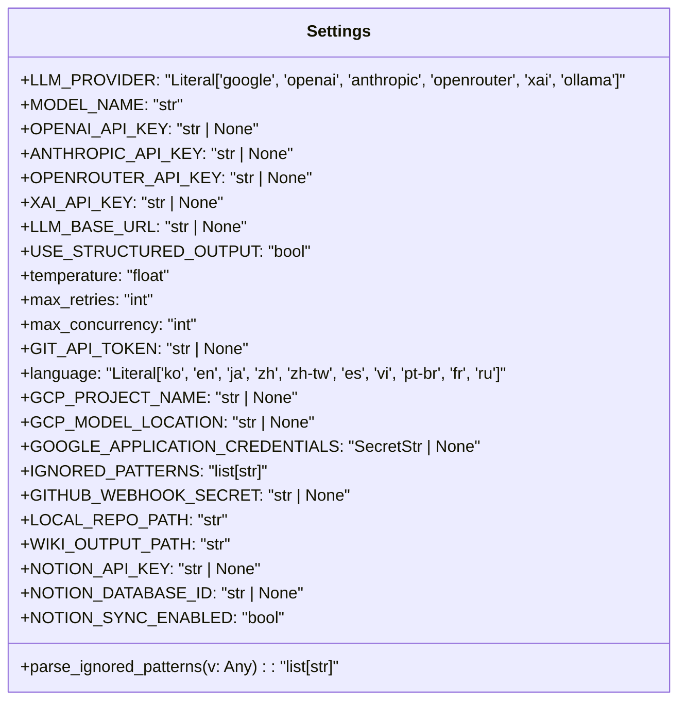

### LLM Provider Settings

These settings control which Large Language Model (LLM) provider the application will use and the specific model.

| Environment Variable | Type | Default | Description |
|---|---|---|---|
| `LLM_PROVIDER` | `Literal` | `google` | Specifies the LLM service to use. Supported values: `google`, `openai`, `anthropic`, `openrouter`, `xai`, `ollama`. |
| `MODEL_NAME` | `str` | `gemini-2.5-flash` | The specific identifier for the LLM model (e.g., `gpt-4o`, `claude-3-5-sonnet-latest`). |

Sources: [.env example](LLM_PROVIDER), [src/core/config.py](LLM_PROVIDER)

### LLM API Keys

API keys for authenticating with various LLM providers. These should be kept confidential.

| Environment Variable | Type | Default | Description |
|---|---|---|---|
| `OPENAI_API_KEY` | `str | None` | `None` | API key for OpenAI services. |
| `ANTHROPIC_API_KEY` | `str | None` | `None` | API key for Anthropic services. |
| `OPENROUTER_API_KEY` | `str | None` | `None` | API key for OpenRouter services. |
| `XAI_API_KEY` | `str | None` | `None` | API key for xAI services. |

Sources: [.env example](OPENAI_API_KEY), [src/core/config.py](OPENAI_API_KEY)

### LLM Configuration

General settings that influence LLM behavior.

| Environment Variable | Type | Default | Description |
|---|---|---|---|
| `LLM_BASE_URL` | `str | None` | `None` | Optional custom base URL for the LLM API (e.g., for Ollama or a proxy). |
| `USE_STRUCTURED_OUTPUT` | `bool` | `True` | Whether to request structured JSON output from the LLM (requires model support). |
| `temperature` | `float` | `0.0` | Controls the randomness of LLM output. `0.0` for deterministic, `1.0` for creative. |
| `max_retries` | `int` | `3` | Maximum number of retry attempts for failed LLM requests. |
| `max_concurrency` | `int` | `5` | Limits the number of parallel LLM calls to prevent rate limiting. |

Sources: [.env example](LLM_BASE_URL), [src/core/config.py](LLM_BASE_URL)

### File Filtering Settings

These settings define which files and directories should be excluded from being processed by the LLM, saving tokens and improving focus.

| Environment Variable | Type | Default | Description |
|---|---|---|---|
| `IGNORED_PATTERNS` | `list[str]` | `DEFAULT_IGNORED_PATTERNS` | A list of glob patterns to exclude. Can be provided as a JSON array string or comma-separated string. Overrides the default list. |

Sources: [.env example](IGNORED_PATTERNS), [src/core/config.py](IGNORED_PATTERNS)

#### `IGNORED_PATTERNS` Parsing Logic

The `IGNORED_PATTERNS` field has a custom `field_validator` named `parse_ignored_patterns`. This validator handles different input formats for the `IGNORED_PATTERNS` environment variable:

1.  **Empty String:** If `IGNORED_PATTERNS` is an empty or whitespace-only string, it defaults to `DEFAULT_IGNORED_PATTERNS`.
2.  **JSON Array String:** If the value is a valid JSON array string (e.g., `'["file1.txt", "*.log"]'`), it will be parsed into a Python list of strings.
3.  **Comma-Separated String:** If it's not a valid JSON array but contains commas (e.g., `"file1.txt, *.log"`), it will be split by commas into a list of strings.
4.  **Default:** If none of the above conditions are met, the value is used as-is (assuming it's already a list or a single string to be treated as a list).

The `DEFAULT_IGNORED_PATTERNS` is a predefined list of common files and directories to exclude, such as lock files, build artifacts, version control directories, and common media files.

Sources: [src/core/config.py](parse_ignored_patterns), [src/core/config.py](DEFAULT_IGNORED_PATTERNS)

### Repository Access Settings

Settings related to accessing code repositories.

| Environment Variable | Type | Default | Description |
|---|---|---|---|
| `GIT_API_TOKEN` | `str | None` | `None` | Personal access token for GitHub/GitLab, used for private repositories or higher API rate limits. |
| `GITHUB_WEBHOOK_SECRET` | `str | None` | `None` | Secret for validating GitHub webhooks (if applicable). |

Sources: [.env example](GIT_API_TOKEN), [src/core/config.py](GIT_API_TOKEN)

### Localization Settings

Controls the target language for generated content.

| Environment Variable | Type | Default | Description |
|---|---|---|---|
| `language` | `Literal` | `en` | Target language for generated wiki content. Supported values include `ko`, `en`, `ja`, `zh`, `es`, etc. |

Sources: [.env example](language), [src/core/config.py](language)

### Google Cloud Platform Settings

Specific settings for integrating with Google Cloud services, particularly Vertex AI.

| Environment Variable | Type | Default | Description |
|---|---|---|---|
| `GCP_PROJECT_NAME` | `str | None` | `None` | Your Google Cloud project ID. |
| `GCP_MODEL_LOCATION` | `str | None` | `None` | The region where your Vertex AI model is deployed (e.g., `us-central1`). |
| `GOOGLE_APPLICATION_CREDENTIALS` | `SecretStr | None` | `None` | Path to your Google Cloud Service Account JSON key file. This is typically handled by mounting the file into the container or setting the environment variable directly. |

Sources: [.env example](GCP_PROJECT_NAME), [src/core/config.py](GCP_PROJECT_NAME)

### Docker & Local Path Settings

These settings define paths for input repositories and output wiki files, especially relevant in containerized environments.

| Environment Variable | Type | Default | Description |
|---|---|---|---|
| `LOCAL_REPO_PATH` | `str` | `.` | The absolute path to the local repository to be analyzed. Default is the current directory. |
| `WIKI_OUTPUT_PATH` | `str` | `./WIKI.md` | The absolute path where generated wiki files will be saved. Default is `WIKI.md` in the current directory. |

Sources: [.env example](LOCAL_REPO_PATH), [src/core/config.py](LOCAL_REPO_PATH)

### Notion Sync Settings (Optional)

Configuration for automatically syncing generated wiki content to Notion.

| Environment Variable | Type | Default | Description |
|---|---|---|---|
| `NOTION_SYNC_ENABLED` | `bool` | `False` | Set to `true` to enable automatic synchronization to Notion after wiki generation. |
| `NOTION_API_KEY` | `str | None` | `None` | Your Notion Integration Token. |
| `NOTION_DATABASE_ID` | `str | None` | `None` | The ID of the Notion database where repository wikis will be added as items. |

Sources: [.env example](NOTION_SYNC_ENABLED), [src/core/config.py](NOTION_SYNC_ENABLED)

## `.env` File Usage

The `.env` file serves as the primary user-facing interface for configuring the application. It is a simple text file where each line defines an environment variable in the format `KEY=VALUE`. Comments can be added using the `#` symbol.

**Example `.env` snippet:**

```ini
# --- LLM Provider Settings ---
LLM_PROVIDER=openai
MODEL_NAME=gpt-4o

# --- LLM API Keys ---
OPENAI_API_KEY=sk-your-openai-api-key

# --- File Filtering Settings ---
# This will override the default ignored patterns
IGNORED_PATTERNS='["*.log", "temp_files/", "build/"]'
```

Users should create a `.env` file in the project root directory and populate it with their desired settings. Variables not explicitly set in `.env` will fall back to the default values defined in the `Settings` class.

Sources: [.env example](.)

## Conclusion

The environment variable and configuration system provides a robust and flexible way to manage application settings. By leveraging `.env` files and Pydantic's `Settings` class, the project ensures that configuration is externalized, type-safe, and easily customizable for different environments and user preferences, from LLM provider selection to output paths and integration with external services like Notion.

---

<a name="backend-api-endpoints"></a>

<details>
<summary>Relevant source files</summary>

The following files were used as context for generating this wiki page:

- [src/api/v1/endpoints/wiki.py](src/api/v1/endpoints/wiki.py)
- [src/models/api_schema.py](src/models/api_schema.py)
- [src/api/v1/endpoints/webhook.py](src/api/v1/endpoints/webhook.py)
</details>

# Backend API Endpoints

This document provides a comprehensive overview of the backend API endpoints within the project, focusing on their functionality, data models, and interaction patterns. These endpoints primarily facilitate the generation of wiki content from source code repositories, manage the status of these generation tasks, and integrate with external services like GitHub via webhooks to automate documentation updates.

The API is structured into two main categories: direct wiki generation and status retrieval, and webhook-driven automation. It leverages FastAPI for rapid development, Pydantic for robust data validation, and background tasks for asynchronous processing, ensuring a responsive user experience while handling potentially long-running operations.

## 1. Wiki Generation and Status Endpoints

The `src/api/v1/endpoints/wiki.py` module defines the core API for initiating wiki generation and querying task statuses. These endpoints are designed to be asynchronous, offloading the heavy lifting to background workers.

### 1.1. Helper Function: `_init_wiki_generation`

This internal asynchronous helper function is responsible for the initial setup required before a wiki generation task can begin. It validates the incoming request, creates a new task entry in the task store, and prepares the `WikiGenerationService` to determine the wiki's structure.

**Process:**
1.  Validates the `WikiGenerationRequest`.
2.  Creates a new task in the `task_store` with an initial message.
3.  Initializes `WikiGenerationService` with the request.
4.  Calls `service.prepare_generation()` to determine the wiki structure.
5.  Returns the `task_id`, the `determiner` object (containing the wiki structure), and the `service` instance.
6.  Handles `ValueError` for bad requests (400) and general exceptions (500).

Sources: [src/api/v1/endpoints/wiki.py](_init_wiki_generation)

### 1.2. `POST /generate/file`

This endpoint triggers the generation of a wiki and saves the resulting Markdown content as a file on the server's filesystem, typically in an `output/` directory. The actual generation process runs as a background task.

*   **Method:** `POST`
*   **Path:** `/api/v1/wiki/generate/file`
*   **Request Model:** `WikiGenerationRequest`
*   **Response Model:** `WikiGenerationResponse`
*   **Function:** `generate_wiki_file`
*   **Behavior:**
    *   Calls `_init_wiki_generation` to set up the task.
    *   Adds `process_wiki_generation_task` to `BackgroundTasks` with `save_file=True`.
    *   Returns a `WikiGenerationResponse` containing a message, `task_id`, and the determined wiki title/description.

Sources: [src/api/v1/endpoints/wiki.py](generate_wiki_file)

### 1.3. `POST /generate/text`

This endpoint triggers the generation of a wiki but does **not** save the output to the server's filesystem. Instead, the generated Markdown text is stored as part of the task's result, which can be retrieved via the status endpoint.

*   **Method:** `POST`
*   **Path:** `/api/v1/wiki/generate/text`
*   **Request Model:** `WikiGenerationRequest`
*   **Response Model:** `WikiGenerationResponse`
*   **Function:** `generate_wiki_text`
*   **Behavior:**
    *   Calls `_init_wiki_generation` to set up the task.
    *   Adds `process_wiki_generation_task` to `BackgroundTasks` with `save_file=False`.
    *   Returns a `WikiGenerationResponse` containing a message, `task_id`, and the determined wiki title/description.

Sources: [src/api/v1/endpoints/wiki.py](generate_wiki_text)

### 1.4. `GET /status/{task_id}`

This endpoint allows clients to retrieve the current status and, if completed, the result of a previously initiated wiki generation task.

*   **Method:** `GET`
*   **Path:** `/api/v1/wiki/status/{task_id}`
*   **Path Parameter:** `task_id` (string) - The unique identifier of the task.
*   **Response Model:** `TaskStatusResponse`
*   **Function:** `get_wiki_generation_status`
*   **Behavior:**
    *   Retrieves the task from the `task_store` using the provided `task_id`.
    *   If the task is not found, raises an `HTTPException` (404).
    *   Returns the `TaskStatusResponse` object.

Sources: [src/api/v1/endpoints/wiki.py](get_wiki_generation_status)

### 1.5. Wiki Generation Flow

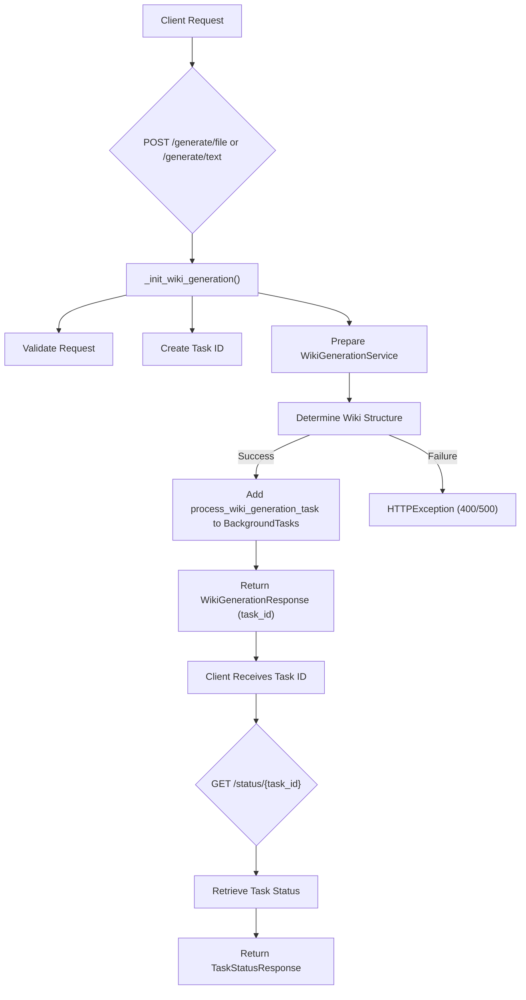

## 2. Webhook Endpoints

The `src/api/v1/endpoints/webhook.py` module handles incoming webhooks, specifically from GitHub, to automate the wiki generation and update process.

### 2.1. `POST /github`

This endpoint acts as a receiver for GitHub push events. Upon receiving a valid push event, it triggers a full cycle of wiki generation and updates the repository's `WIKI.md` file.

*   **Method:** `POST`
*   **Path:** `/api/v1/webhook/github`
*   **Request Body:** `GitHubPushPayload` (Pydantic model for GitHub webhook payload)
*   **Response Status:** `202 Accepted`
*   **Function:** `github_webhook`
*   **Behavior:**
    1.  **Signature Verification:** Calls `verify_signature` to ensure the request originates from GitHub and is authentic, using `GITHUB_WEBHOOK_SECRET`.
    2.  **Bot Commit Filtering:** Checks if the commit was made by the bot itself (`BOT_COMMITTER_NAME` or commit message containing "via Wiki-As-Readme") to prevent infinite loops. If so, it skips processing.
    3.  **Branch Filtering:** Only processes pushes to the `main` branch.
    4.  **Internal Request Creation:** Constructs a `WikiGenerationRequest` object based on the GitHub payload (repo owner, name, URL).
    5.  **Background Task:** Adds `process_full_cycle` to `BackgroundTasks`. This function orchestrates the internal wiki generation call and subsequent GitHub update.
    6.  Returns a `202 Accepted` status with a message indicating processing has started.

Sources: [src/api/v1/endpoints/webhook.py](github_webhook)

### 2.2. Helper Function: `verify_signature`

This function validates the `X-Hub-Signature-256` header from GitHub webhooks against the request body and a shared secret (`GITHUB_WEBHOOK_SECRET`). This is crucial for security to ensure that webhook events are legitimate.

Sources: [src/api/v1/endpoints/webhook.py](verify_signature)

### 2.3. Helper Function: `update_github_readme`

This asynchronous function is responsible for committing the generated Markdown content back to a GitHub repository. It targets `WIKI.md` within the specified repository.

**Process:**
1.  Requires `GITHUB_ACCESS_TOKEN` for authentication.
2.  Constructs the GitHub API URL for the `WIKI.md` file.
3.  **Retrieves SHA:** Makes a `GET` request to get the SHA of the existing `WIKI.md` (required for updating/overwriting files via GitHub API).
4.  **Encodes Content:** Base64 encodes the new Markdown content.
5.  **Prepares Commit Data:** Creates a JSON payload including the commit message, encoded content, committer details (`BOT_COMMITTER_NAME`), and the retrieved SHA (if updating).
6.  **Updates File:** Makes a `PUT` request to the GitHub API to update the `WIKI.md` file.
7.  Logs success or failure.

Sources: [src/api/v1/endpoints/webhook.py](update_github_readme)

### 2.4. Helper Function: `process_full_cycle`

This function encapsulates the end-to-end process triggered by a GitHub webhook: generating the wiki content internally and then pushing it back to GitHub. It runs as a background task.

**Process:**
1.  **Calls Internal API:** Makes an HTTP `POST` request to the internal `/api/v1/wiki/generate/text` endpoint to generate the wiki content.
2.  **Extracts Result:** Parses the response from the internal API to extract the generated Markdown text.
3.  **Uploads to GitHub:** Calls `update_github_readme` with the extracted Markdown content, repository owner, and name.
4.  Handles any exceptions during this process.

Sources: [src/api/v1/endpoints/webhook.py](process_full_cycle)

### 2.5. GitHub Webhook Automation Flow

```mermaid
sequenceDiagram
    participant G as "GitHub"
    participant W as "Webhook Endpoint"
    participant I as "Internal Wiki API"
    participant GH as "GitHub API"

    G->>W: "POST /webhook/github" (Push Event)
    activate W
    W->>W: "verify_signature()"
    alt Valid Signature & Not Bot Commit & Main Branch
        W->>W: "Construct WikiGenerationRequest"
        W->>W: "Add process_full_cycle to BackgroundTasks"
        W-->>G: "202 Accepted"
        deactivate W

        W->>I: "POST /wiki/generate/text" (Internal Call)
        activate I
        I-->>W: "WikiGenerationResponse" (with generated Markdown)
        deactivate I

        W->>GH: "GET /repos/{owner}/{repo}/contents/WIKI.md" (Get SHA)
        activate GH
        GH-->>W: "File SHA"
        deactivate GH

        W->>GH: "PUT /repos/{owner}/{repo}/contents/WIKI.md" (Update WIKI.md)
        activate GH
        GH-->>W: "200/201 Success"
        deactivate GH
    else Invalid Signature or Bot Commit or Other Branch
        W-->>G: "403 Forbidden" or "202 Accepted" (Skipped)
        deactivate W
    end
```

## 3. API Data Models

The `src/models/api_schema.py` module defines the Pydantic models used for request and response bodies across the API.

### 3.1. `WikiGenerationRequest`

This model defines the structure for requests to initiate wiki generation. It includes details about the repository and generation preferences.

| Parameter | Type | Description |
|---|---|---|
| `repo_owner` | `str` \| `None` | The owner of the repository (user or organization). |
| `repo_name` | `str` \| `None` | The name of the repository. |
| `repo_type` | `Literal["github", "gitlab", "bitbucket", "local"]` | The type of the repository. Defaults to "github". |
| `repo_url` | `str` \| `None` | The URL for cloning a remote repository. |
| `local_path` | `str` \| `None` | The local path to the repository if `repo_type` is 'local'. |
| `language` | `str` | The language for the generated wiki content. Defaults to "ko". |
| `is_comprehensive_view` | `bool` | Whether to generate a comprehensive view of the repository. Defaults to `True`. |

**Validation (`derive_repo_details`):**
A `model_validator` automatically attempts to derive `repo_owner` and `repo_name` from `repo_url` if `repo_type` is "github" and these fields are not explicitly provided. This simplifies client requests by allowing just a `repo_url` for GitHub repositories.

Sources: [src/models/api_schema.py](WikiGenerationRequest)

### 3.2. `WikiGenerationResponse`

This model defines the standard response structure for successful wiki generation initiation requests.

| Parameter | Type | Description |
|---|---|---|
| `message` | `str` | A message indicating the status of the request. |
| `task_id` | `str` | The ID of the background task initiated. |
| `title` | `str` | The title of the generated wiki. |
| `description` | `str` | The description of the generated wiki. |

Sources: [src/models/api_schema.py](WikiGenerationResponse)

### 3.3. `TaskStatusResponse`

This model defines the structure for responses when querying the status of a background task.

| Parameter | Type | Description |
|---|---|---|
| `task_id` | `str` | The ID of the task. |
| `status` | `Literal["in_progress", "completed", "failed"]` | Current status of the task. |
| `result` | `Any` \| `None` | Result of the task, if completed or failed. This can contain the generated Markdown text. |

Sources: [src/models/api_schema.py](TaskStatusResponse)

## Conclusion

The backend API endpoints provide a robust and flexible interface for managing wiki generation. The `wiki.py` endpoints offer direct control over generation tasks, supporting both file-based output and text-based retrieval, with asynchronous processing for scalability. The `webhook.py` endpoints enable powerful automation by integrating with GitHub, allowing for continuous documentation updates based on repository activity. Together with well-defined Pydantic models, these endpoints form the backbone of the wiki generation system, ensuring data integrity, security, and efficient operation.

---

<a name="project-architecture-overview"></a>

<details>
<summary>Relevant source files</summary>

The following files were used as context for generating this wiki page:

- [src/app.py](src/app.py)
- [src/server.py](src/server.py)
- [src/agent/llm.py](src/agent/llm.py)
</details>

# Project Architecture Overview

## Introduction

The "Wiki As Readme" project is designed to generate comprehensive wiki documentation from a codebase, delivering it as a single Markdown file. This system leverages a client-server architecture, integrating a user-friendly Streamlit frontend, a robust FastAPI backend, and a flexible LLM agent for content generation. The primary goal is to automate the creation of detailed project documentation, making it accessible and easy to consume.

## Overall System Architecture

The project follows a clear separation of concerns, with a frontend application handling user interaction, a backend API managing requests and orchestrating tasks, and a dedicated agent layer for interacting with Large Language Models (LLMs).

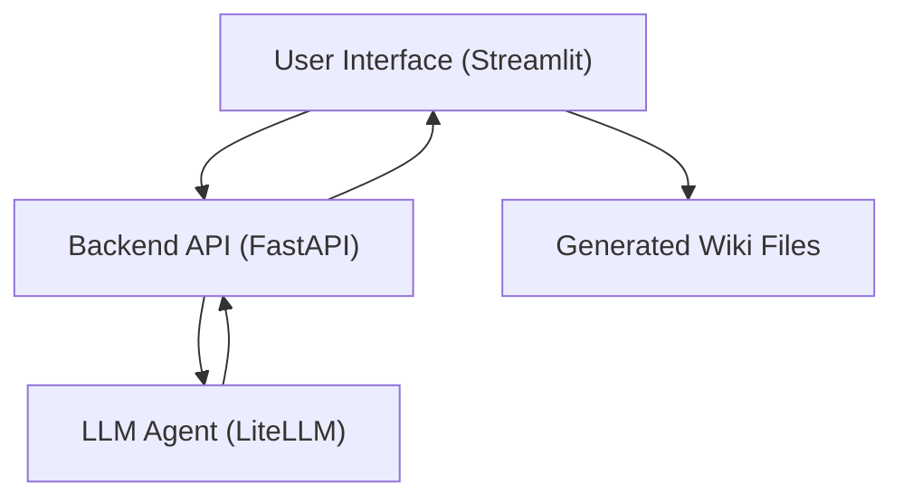

## Frontend Application: `src/app.py`

The `src/app.py` file implements the Streamlit-based user interface, serving as the primary interaction point for users. It allows users to input repository details, configure generation options, initiate the wiki generation process, and view/download the results.

### Key Components and Functionality

*   **`main()`**: The entry point of the Streamlit application, responsible for setting up page configurations, initializing session states, and managing navigation between different views (Generator and History).
    *   Sources: [src/app.py](main function)
*   **`render_generator_page()`**: This function renders the main page where users configure and trigger wiki generation.
    *   It collects repository information (URL or local path), generation options (comprehensive view, language).
    *   Constructs a `WikiGenerationRequest` object.
    *   Initiates the generation task via the backend API.
    *   Polls the API for task status and displays progress.
    *   Renders the generated Markdown content, including Mermaid diagrams.
    *   Sources: [src/app.py](render_generator_page function)
*   **`render_history_page()`**: Displays a list of previously generated wiki files from the `output` directory, allowing users to view or download them.
    *   Sources: [src/app.py](render_history_page function)
*   **`start_generation_task(request_data: WikiGenerationRequest)`**: An asynchronous function that sends a POST request to the backend API's `/wiki/generate/file` endpoint to start a new wiki generation task. It returns a `task_id`.
    *   Sources: [src/app.py](start_generation_task function)
*   **`poll_task_status(task_id: str)`**: An asynchronous function that periodically queries the backend API's `/wiki/status/{task_id}` endpoint to check the progress and status of a generation task. It updates the UI with progress and displays the final result or any errors.
    *   Sources: [src/app.py](poll_task_status function)
*   **`render_markdown_with_mermaid(markdown_content: str)`**: A utility function that parses Markdown content, identifies Mermaid diagram blocks, and renders them using `streamlit_mermaid`, while rendering other Markdown parts normally.
    *   Sources: [src/app.py](render_markdown_with_mermaid function)

### Frontend-Backend Interaction Flow

The following sequence diagram illustrates how the Streamlit frontend interacts with the FastAPI backend to initiate and monitor a wiki generation task.

```mermaid
sequenceDiagram
    participant UI as "Streamlit UI (app.py)"
    participant API as "FastAPI Backend (server.py)"
    participant LLM as "LLM Agent (llm.py)"

    UI->>UI: "User inputs repo details"
    UI->>UI: "Constructs WikiGenerationRequest"
    UI->>API: "POST /api/v1/wiki/generate/file"
    API->>API: "Validates request, starts background task"
    API->>LLM: "Invokes LLM for generation"
    LLM-->>API: "Returns generated content"
    API-->>API: "Saves content, updates task status"
    API-->>UI: "Returns task_id"
    UI->>UI: "Stores task_id, starts polling"
    loop Polling Task Status
        UI->>API: "GET /api/v1/wiki/status/{task_id}"
        API-->>UI: "Returns {status: 'in_progress', ...}"
        UI->>UI: "Updates progress bar"
        alt Task Completed
            API-->>UI: "Returns {status: 'completed', result: {...}}"
            UI->>UI: "Displays generated wiki"
            break
        else Task Failed
            API-->>UI: "Returns {status: 'failed', result: {error: '...'}}"
            UI->>UI: "Displays error message"
            break
        end
    end
```

### Wiki Generation Request Data Model

The `WikiGenerationRequest` object, used to send data to the backend, encapsulates the parameters for the generation task.

| Parameter | Type | Description |
|---|---|---|
| `repo_type` | `str` | Type of repository (e.g., "github", "gitlab", "local"). |
| `repo_url` | `str` | URL of the repository (for remote repos). |
| `local_path` | `str` | Local path to the repository (for local repos). |
| `language` | `str` | Target language for the wiki (e.g., "en", "ko"). |
| `is_comprehensive_view` | `bool` | Flag to request a more detailed wiki. |
|---|---|---|
Sources: [src/app.py](render_generator_page function, WikiGenerationRequest instantiation)

## Backend API: `src/server.py`

The `src/server.py` file defines the FastAPI application that serves as the backend for the wiki generation service. It exposes RESTful API endpoints for initiating generation tasks, checking their status, and potentially integrating with webhooks.

### Key Components

*   **`FastAPI` Application**: The main application instance, configured with a title, description, and version.
    *   Sources: [src/server.py](FastAPI instantiation)
*   **`health_check()`**: A simple GET endpoint at `/` to verify the server's operational status.
    *   Sources: [src/server.py](health_check function)
*   **API Routers**:
    *   `wiki.router`: Handles all endpoints related to wiki generation, typically under `/api/v1/wiki`. This includes endpoints for starting generation and querying task status.
    *   `webhook.router`: (Mentioned but not detailed in provided files) Intended for webhook integrations, typically under `/api/v1/webhook`.
    *   Sources: [src/server.py](app.include_router calls)
*   **`uvicorn.run()`**: The entry point for running the FastAPI server, configured to listen on `127.0.0.1:8000` with hot-reloading enabled for development.
    *   Sources: [src/server.py](uvicorn.run call)

## LLM Agent: `src/agent/llm.py`

The `src/agent/llm.py` module provides an abstraction layer for interacting with various Large Language Models (LLMs) using the `LiteLLM` library. This module is central to the actual content generation process.

### `LLMWikiMaker` Class

This class is a generic wrapper designed to simplify LLM calls, especially for structured output.

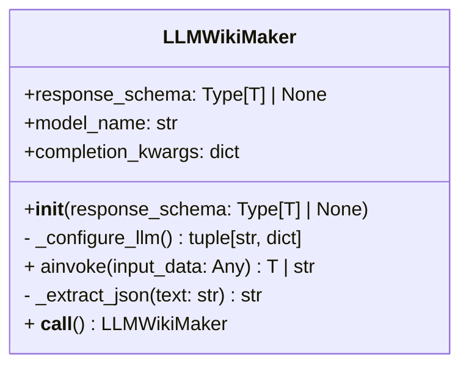

### Key Methods and Functionality

*   **`__init__(self, response_schema: type[T] | None = None)`**:
    *   Initializes the LLM wrapper.
    *   Takes an optional `response_schema` (Pydantic model) for structured output.
    *   Calls `_configure_llm()` to set up the specific LLM model and its parameters.
    *   Sources: [src/agent/llm.py](LLMWikiMaker.__init__ method)
*   **`_configure_llm(self) -> tuple[str, dict]`**:
    *   Determines the LLM provider (e.g., Google, OpenAI, Anthropic, OpenRouter, xAI, Ollama) from `settings.LLM_PROVIDER`.
    *   Constructs the full model name (e.g., `vertex_ai/gemini-pro`).
    *   Sets provider-specific parameters like API keys (from environment variables or `settings`), base URLs, project names, and locations.
    *   Handles global settings like `temperature` and `max_retries`.
    *   Raises `ValueError` for unsupported providers or missing API keys.
    *   Sources: [src/agent/llm.py](LLMWikiMaker._configure_llm method)
*   **`ainvoke(self, input_data: Any) -> T | str`**:
    *   The core asynchronous method to invoke the LLM.
    *   Converts `input_data` into a prompt string.
    *   Prepares the `messages` payload for the LLM call.
    *   Applies `response_format` if `response_schema` is provided and `settings.USE_STRUCTURED_OUTPUT` is enabled.
    *   Calls `litellm.acompletion()` to get the LLM response.
    *   Parses the LLM response:
        *   If `response_schema` is set, it attempts to validate the response against the schema, handling both native structured output and JSON string extraction from markdown blocks.
        *   Otherwise, it returns the raw content as a string.
    *   Sources: [src/agent/llm.py](LLMWikiMaker.ainvoke method)
*   **`_extract_json(self, text: str) -> str`**: A helper method to extract a JSON string from a Markdown code block (e.g., ````json ... ````) within the LLM's raw text response.
    *   Sources: [src/agent/llm.py](LLMWikiMaker._extract_json method)

### LLM Configuration

The `LLMWikiMaker` class dynamically configures the LLM based on environment variables and project settings, supporting a wide range of providers:

| Provider | Configuration Details |
|---|---|
| `google` | Uses `vertex_ai/` prefix, requires `GCP_PROJECT_NAME`, `GCP_MODEL_LOCATION`. |
| `openai` | Uses `openai/` prefix, requires `OPENAI_API_KEY` or `LLM_BASE_URL`. |
| `anthropic` | Uses `anthropic/` prefix, requires `ANTHROPIC_API_KEY`. |
| `openrouter` | Uses `openrouter/` prefix, requires `OPENROUTER_API_KEY`. |
| `xai` | Uses `xai/` prefix, requires `XAI_API_KEY`. |
| `ollama` | Uses `ollama/` prefix, supports `LLM_BASE_URL` for local instances. |
|---|---|---|
Sources: [src/agent/llm.py](LLMWikiMaker._configure_llm method)

## Conclusion

The "Wiki As Readme" project is structured as a modular and extensible application. The clear separation between the Streamlit frontend, FastAPI backend, and the LiteLLM-powered agent layer ensures maintainability and scalability. This architecture allows for easy integration of new LLM providers, flexible UI enhancements, and robust API management, all contributing to an efficient and powerful wiki generation system.

---

<a name="contributing-to-wiki-as-readme"></a>

<details>
<summary>Relevant source files</summary>

The following files were used as context for generating this wiki page:

- [README.md](README.md)
- [LICENSE](LICENSE)
- [.pre-commit-config.yaml](.pre-commit-config.yaml)
</details>

# Contributing to Wiki As Readme

## Introduction

**Wiki As Readme** is an AI-powered documentation tool designed to transform codebases into comprehensive wikis. It emphasizes universal compatibility across LLM models, Git platforms, and deployment environments. This project thrives on community contributions, welcoming developers to enhance its features, fix bugs, and improve its overall utility. This document outlines the process and guidelines for contributing to the Wiki As Readme project, ensuring a smooth and collaborative development experience.

The project is built to be truly pluggable, supporting various LLM providers (commercial and local), Git platforms (GitHub, GitLab, Bitbucket, local), and deployment methods (CI/CD, Docker, API server, CLI). Contributions are highly valued to expand its capabilities and maintain its flexibility.
Sources: [README.md](Introduction section)

## How to Contribute

Contributing to Wiki As Readme follows a standard open-source workflow. The project encourages new features, bug fixes, and improvements.

### Contribution Workflow

The general steps for contributing are as follows:

1.  **Fork the Project**: Create a personal copy of the repository on your GitHub account.
2.  **Create a Feature Branch**: Branch off from the `main` branch to develop your changes. Use a descriptive name for your branch (e.g., `feature/add-new-llm-provider`, `fix/bug-in-notion-sync`).
3.  **Commit Your Changes**: Make your changes and commit them with clear, concise commit messages.
4.  **Push to the Branch**: Push your local branch to your forked repository on GitHub.
5.  **Open a Pull Request (PR)**: Submit a Pull Request from your feature branch to the `main` branch of the original Wiki As Readme repository. Ensure your PR description clearly explains the changes, their purpose, and any relevant context.

Sources: [README.md](Contributing section)

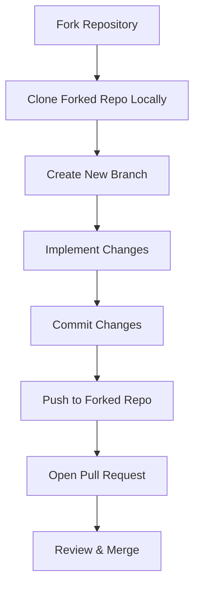

## Setting Up Your Development Environment

For developers looking to modify the source code or run the application without Docker, a local Python development setup is recommended.

### Prerequisites

*   **Python**: Version 3.12 or newer.
*   **uv**: A fast Python package installer and resolver.

### Installation Steps

1.  **Clone the Repository**:
    ```bash
    git clone https://github.com/catuscio/wiki-as-readme.git
    cd wiki-as-readme
    ```
2.  **Install Dependencies**: Use `uv` to synchronize dependencies and create a virtual environment.
    ```bash
    uv sync
    source .venv/bin/activate
    ```
3.  **Configure Environment Variables**: Copy the example environment file and populate it with necessary API keys and settings.
    ```bash
    cp .env.example .env
    # Edit .env to set LLM_PROVIDER, API_KEYS, etc.
    ```

Sources: [README.md](3. Local Python Development section)

### Running the Application Locally

Once the environment is set up, you can run the backend API and frontend UI separately.

*   **Run Backend (FastAPI)**:
    ```bash
    uv run uvicorn src.server:app --reload --port 8000
    ```
    The API documentation will be available at `http://localhost:8000/docs`.
*   **Run Frontend (Streamlit)**:
    ```bash
    uv run streamlit run src/app.py
    ```
    The Web UI will be accessible at `http://localhost:8501`.

Sources: [README.md](3. Local Python Development section)

## Code Quality and Standards

To maintain code quality and consistency across the project, `pre-commit` hooks are utilized with `ruff` for linting and formatting.

### Pre-commit Hooks

The project uses `pre-commit` to automatically run checks before each commit. This helps catch common issues early and ensures code adheres to defined standards.

The `.pre-commit-config.yaml` specifies the following:
*   **ruff**: Used for both linting (`--fix`) and formatting. This ensures Python code is consistently styled and common errors are automatically corrected.

To enable pre-commit hooks after cloning the repository and setting up the environment, you typically run `pre-commit install` (though `uv sync` might handle this if `pre-commit` is a dependency).

Sources: [.pre-commit-config.yaml](entire file)

## Project Architecture (for context)

Understanding the core technologies used in Wiki As Readme can help contributors navigate the codebase more effectively.

*   **Frontend**: [Streamlit](https://streamlit.io/) for the interactive user interface.
*   **Backend**: [FastAPI](https://fastapi.tiangolo.com/) for building the REST API and managing background tasks.
*   **LLM Integration**: [LiteLLM](https://docs.litellm.ai/) provides a unified interface to interact with over 100 different Large Language Models.
*   **Data Models**: [Pydantic](https://docs.pydantic.dev/) is used for data validation, settings management, and structured output.
*   **Diagrams**: [Mermaid.js](https://mermaid.js.org/) is used for generating visual diagrams within the documentation.

Sources: [README.md](Architecture section)

## Licensing

Wiki As Readme is distributed under the **MIT License**. This permissive license allows for broad use, modification, and distribution of the software.

Key aspects of the MIT License include:
*   **Permission**: Granted free of charge, to any person obtaining a copy of this software and associated documentation files.
*   **Rights**: Users are free to deal in the Software without restriction, including without limitation the rights to use, copy, modify, merge, publish, distribute, sublicense, and/or sell copies of the Software.
*   **Conditions**: The above copyright notice and this permission notice shall be included in all copies or substantial portions of the Software.
*   **Disclaimer**: The software is provided "AS IS", without warranty of any kind, express or implied.

Contributors should be aware that their contributions will also fall under this license.
Sources: [LICENSE](entire file)

## Conclusion

Contributing to Wiki As Readme is a great way to impact the future of AI-powered documentation. By following these guidelines, you can help improve the tool for everyone. We appreciate your efforts and look forward to your contributions!

---

<a name="examples-of-generated-wikis"></a>

<details>
<summary>Relevant source files</summary>

The following files were used as context for generating this wiki page:

- [examples/langgraph_readme_en.md](examples/langgraph_readme_en.md)
- [examples/langgraph_readme_ko.md](examples/langgraph_readme_ko.md)
- [examples/wiki_as_README.md](examples/wiki_as_README.md)
</details>

# Examples of Generated Wikis

## Introduction

This page presents examples of comprehensive technical wiki pages generated from software project source files. The purpose of these examples is to illustrate the structure, depth, and accuracy achievable through automated documentation generation. By analyzing codebases and relevant documentation files, AI-powered tools can produce detailed wikis that cover architecture, features, usage, and deployment aspects of a software system.

The examples provided include documentation for the LangGraph framework (in both English and Korean) and the "Wiki As Readme" tool itself. These demonstrate how generated wikis can provide structured information, code examples, diagrams, and detailed explanations, serving as valuable resources for developers and stakeholders.

## LangGraph Wiki (English)

The LangGraph Wiki in English provides comprehensive documentation for the LangGraph framework, a low-level orchestration framework for building stateful agents. This example showcases a detailed table of contents, an introduction to the framework, its core benefits, ecosystem integrations, and practical code examples.

### Structure and Content Highlights

The English LangGraph Wiki is structured to guide users through various aspects of the framework:

*   **Table of Contents:** A comprehensive list of topics, including Introduction, Core Concepts, Quickstart Guide, Graph Structure, Durable Execution, and more.
*   **Introduction to LangGraph:** Defines LangGraph as a low-level orchestration framework for stateful agents, emphasizing its integration with LangChain and LangSmith. Sources: [examples/langgraph_readme_en.md](Introduction to LangGraph)
*   **Core Benefits:** Details key advantages such as Durable Execution, Human-in-the-Loop integration, Comprehensive Memory, Debugging with LangSmith, and Production-Ready Deployment. Sources: [examples/langgraph_readme_en.md](Core Benefits)
*   **LangGraph Ecosystem:** Explains how LangGraph integrates with LangSmith, LangSmith Deployment, and LangChain. Sources: [examples/langgraph_readme_en.md](LangGraph Ecosystem)
*   **Simple Workflow Example:** Provides a Python code snippet demonstrating how to create a basic graph with nodes and edges, along with a Mermaid diagram for visualization. Sources: [examples/langgraph_readme_en.md](Simple Workflow Example)

### Simple Workflow Example

This example illustrates a basic LangGraph workflow:

```python
from langgraph.graph import START, StateGraph
from typing_extensions import TypedDict


class State(TypedDict):
    text: str


def node_a(state: State) -> dict:
    return {"text": state["text"] + "a"}


def node_b(state: State) -> dict:
    return {"text": state["text"] + "b"}


graph = StateGraph(State)
graph.add_node("node_a", node_a)
graph.add_node("node_b", node_b)
graph.add_edge(START, "node_a")
graph.add_edge("node_a", "node_b")

print(graph.compile().invoke({"text": ""}))
# {'text': 'ab'}
```
Sources: [examples/langgraph_readme_en.md](Simple Workflow Example)

### Workflow Diagram

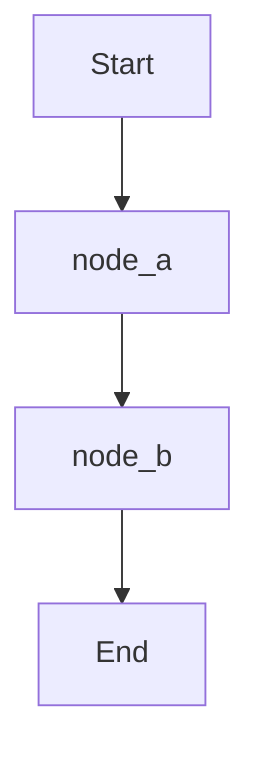
Sources: [examples/langgraph_readme_en.md](Workflow Diagram)

## LangGraph Wiki (Korean)

This example demonstrates a generated wiki page for LangGraph in Korean, showcasing the ability to produce documentation in multiple languages. It mirrors the structure and core information found in the English version, adapted for a Korean-speaking audience.

### Structure and Content Highlights

The Korean LangGraph Wiki includes:

*   **Table of Contents:** Similar to the English version, covering Introduction, Quickstart, Core Benefits, Durable Execution, Human Intervention, Memory, Examples, and more. Sources: [examples/langgraph_readme_ko.md](Table of Contents)
*   **Introduction:** Defines LangGraph as a low-level orchestration framework for long-running, stateful agents, highlighting its core benefits and integration with the LangChain ecosystem. Sources: [examples/langgraph_readme_ko.md](소개)
*   **Quickstart:** Provides installation instructions and a simple workflow example to get started with LangGraph. Sources: [examples/langgraph_readme_ko.md](빠른 시작)
*   **Core Benefits:** Lists key advantages such as durable execution, human-in-the-loop, comprehensive memory, debugging with LangSmith, and production-ready deployment. Sources: [examples/langgraph_readme_ko.md](핵심 이점)

### Simple Workflow Example (Korean)

The quickstart section includes the same Python example for creating a simple workflow:

```python
from langgraph.graph import START, StateGraph
from typing_extensions import TypedDict


class State(TypedDict):
    text: str


def node_a(state: State) -> dict:
    return {"text": state["text"] + "a"}


def node_b(state: State) -> dict:
    return {"text": state["text"] + "b"}


graph = StateGraph(State)
graph.add_node("node_a", node_a)
graph.add_node("node_b", node_b)
graph.add_edge(START, "node_a")
graph.add_edge("node_a", "node_b")

print(graph.compile().invoke({"text": ""}))
# {'text': 'ab'}
```
Sources: [examples/langgraph_readme_ko.md](간단한 워크플로우 생성)

### Workflow Diagram (Korean)

```mermaid
graph TD
    A["Start"] --> B["node_a"];
    B --> C["node_b"];
```
Sources: [examples/langgraph_readme_ko.md](워크플로우 시각화)

## Wiki As Readme Documentation

This example showcases the documentation for the "Wiki As Readme" tool itself, which is designed to transform codebases into wikis. It highlights the tool's capabilities, architecture, and usage modes, demonstrating how a generated wiki can describe a complex software project.

### Structure and Content Highlights

The "Wiki As Readme" documentation includes:

*   **Table of Contents:** Covers Introduction, Core Features, Universal Compatibility, Usage as a GitHub Action, Docker Compose, Server Deployment, Configuration, API Endpoints, System Architecture, Core Components, and Contributing. Sources: [examples/wiki_as_README.md](Table of Contents)
*   **Introduction to Wiki As Readme:** Describes the tool as a versatile AI-powered documentation tool for transforming codebases into wikis, emphasizing its universal compatibility. Sources: [examples/wiki_as_README.md](Introduction to Wiki As Readme)
*   **Core Philosophy and Universal Compatibility:** Details its model-agnostic (LiteLLM), platform-agnostic (GitHub, GitLab, Local), and deployment-agnostic (CI/CD, Docker, Server) nature. Sources: [examples/wiki_as_README.md](Core Philosophy and Universal Compatibility)
*   **Key Features:** Lists features like Deep Context Analysis, Smart Structure Generation, Comprehensive Content, Automatic Diagrams (Mermaid.js), Hybrid Output, and Async & Scalable architecture. Sources: [examples/wiki_as_README.md](Key Features)
*   **Usage Modes:** Explains how to use the tool as a GitHub Action, with Docker Compose, for local Python development, and as a server with webhooks. Sources: [examples/wiki_as_README.md](Usage Modes)
*   **Architecture:** Provides an overview of the system's components (Streamlit Frontend, FastAPI Backend, LiteLLM, Pydantic, Mermaid.js) and their interactions. Sources: [examples/wiki_as_README.md](Architecture)

### System Architecture Diagram

```mermaid
graph TD
    A["User/CI Trigger"] --> B["Wiki As Readme Application"];
    B --> C["FastAPI Backend"];
    B --> D["Streamlit Frontend"];
    C --> E["LiteLLM (LLM Integration)"];
    E --> F["Various LLMs (OpenAI, Google, Ollama, etc.)"];
    C --> G["Git Repository (GitHub, GitLab, Local)"];
    G --> H["Codebase"];
    C --> I["Output (Markdown File/Text)"];
```
Sources: [examples/wiki_as_README.md](Architecture)

### GitHub Action Workflow Diagram

```mermaid
sequenceDiagram
    participant GH["GitHub Push/Workflow Dispatch"]
    participant GHA["GitHub Actions Runner"]
    participant WAR["Wiki-As-Readme Action"]
    participant LLM["LLM Provider"]
    participant Repo["Repository"]

    GH->>GHA: "Trigger workflow (push/dispatch)"
    GHA->>GHA: "Checkout code"
    GHA->>WAR: "Run Wiki-As-Readme Action (Docker)"
    WAR->>Repo: "Read codebase files"
    WAR->>LLM: "Request documentation generation"
    LLM-->>WAR: "Return generated content"
    WAR->>Repo: "Write generated WIKI.md"
    GHA->>Repo: "Commit and push WIKI.md"
```
Sources: [examples/wiki_as_README.md](GitHub Action Workflow Diagram)

## Conclusion

These examples demonstrate the capability of AI-driven tools to generate comprehensive, accurate, and well-structured technical wiki pages. From framework documentation like LangGraph (in multiple languages) to the self-documentation of a tool like "Wiki As Readme," these generated outputs provide detailed insights into software projects. They effectively utilize markdown formatting, code snippets, and visual diagrams to enhance clarity and serve as valuable, up-to-date resources for developers and users.

---
