# Wiki As Readme Documentation

Comprehensive documentation for the Wiki As Readme project, an AI-powered tool to generate wikis from codebases.

## Table of Contents

- [Introduction to Wiki As Readme](#introduction-to-wiki-as-readme)
- [Core Features](#core-features)
- [Universal Compatibility](#universal-compatibility)
- [GitHub Action Usage](#github-action-usage)
- [Docker Compose Setup](#docker-compose-setup)
- [Local Development Guide](#local-development-guide)
- [Server and Webhooks Deployment](#server-and-webhooks-deployment)
- [System Architecture](#system-architecture)
- [Configuration Reference](#configuration-reference)
- [API Reference](#api-reference)
- [Notion Integration](#notion-integration)
- [Contributing Guidelines](#contributing-guidelines)

---

<a name="introduction-to-wiki-as-readme"></a>

<details>
<summary>Relevant source files</summary>

The following files were used as context for generating this wiki page:

- [README.md](README.md)
- [action.yml](action.yml)
- [src/action_entrypoint.py](src/action_entrypoint.py)
</details>

# Introduction to Wiki As Readme

**Wiki As Readme** is a versatile AI-powered documentation tool designed to transform a codebase into a comprehensive wiki or `README.md` file rapidly. It emphasizes flexibility and universal compatibility, allowing users to generate detailed documentation regardless of their chosen LLM (Large Language Model), code repository platform, or deployment environment. The tool aims to be a "drop-in" solution for automated documentation, providing deep context analysis and smart structure generation to produce high-quality, structured content, including architecture overviews, installation guides, API references, and Mermaid.js diagrams.

This project is built to be truly pluggable, offering various usage modes from CI/CD integration via GitHub Actions to local development and API server deployments. It leverages modern asynchronous frameworks like FastAPI and Streamlit for a scalable and efficient user experience.

## Core Features

Wiki As Readme provides a suite of features designed to automate and enhance the documentation process:

*   **🧠 Deep Context Analysis:** Analyzes the project's file structure and inter-file relationships to build a comprehensive understanding of the architecture before content generation.
*   **📦 Smart Structure Generation:** Automatically determines a logical hierarchy for the documentation, organizing content into sections and pages.
*   **🔍 Comprehensive Content:** Generates detailed pages covering architecture overviews, installation instructions, and API references.
*   **📊 Automatic Diagrams:** Integrates Mermaid.js to visualize architectural components through flowcharts, sequence diagrams, and class diagrams.
*   **🚗 Hybrid Output:** Produces both individual Markdown files suitable for a wiki and a single consolidated `README.md` file.
*   **⚡ Async & Scalable:** Built with FastAPI and AsyncIO, ensuring non-blocking and efficient generation, especially for large documentation sets.

Sources: [README.md](README.md)

## Universal Compatibility

A cornerstone of Wiki As Readme's design is its universal compatibility, making it adaptable to diverse development stacks.

### Model Agnostic (Powered by LiteLLM)

The tool supports a wide array of LLM providers, ensuring users can leverage their preferred model:

*   **Commercial APIs:** Google Vertex AI (Gemini), OpenAI (GPT-4), Anthropic (Claude), xAI (Grok).
*   **Open/Local Models:** Ollama, OpenRouter, HuggingFace.
*   **On-Premise:** Connects securely to private LLM endpoints.

### Platform Agnostic

It integrates seamlessly with various code hosting platforms and local environments:

*   **Cloud Repos:** Full support for GitHub, GitLab, and Bitbucket.
*   **Local Development:** Analyzes code directly from the local file system without requiring a push to a remote repository.
*   **Private/Enterprise:** Compatible with private instances and self-hosted Git servers.

### Deployment Agnostic

Wiki As Readme can be deployed and utilized in multiple operational contexts:

*   **CI/CD:** Easily integrated into GitHub Actions workflows for automated documentation updates.
*   **Container:** Can be run via Docker Compose for isolated and portable execution.
*   **Service:** Deployable as a long-running API server with webhook support for event-driven generation.
*   **CLI:** Usable as a command-line tool for local, on-demand documentation generation.

Sources: [README.md](README.md)

## Usage Modes

Wiki As Readme offers several flexible usage modes to fit different workflows:

### 1. GitHub Action (Recommended)

The GitHub Action provides an automated way to keep documentation up-to-date within a CI/CD pipeline. It can be triggered on `push` events or manually via `workflow_dispatch`, allowing for custom configurations.

#### Workflow Configuration (`.github/workflows/update-wiki.yml`)

The action is configured via a YAML file in the `.github/workflows` directory. It defines triggers, inputs, and job steps.

```yaml
name: Wiki-As-Readme As Action

on:
  push: # Automatic trigger on push to main
    branches: [main]
    paths-ignore: ['README.md', 'WIKI.md', '.github/workflows/update-wiki.yml']
  workflow_dispatch: # Manual trigger with customizable inputs
    inputs:
      language: { description: 'Language code', default: 'en' }
      llm_provider: { description: 'LLM Provider', default: 'google' }
      model_name: { description: 'Model Name', default: 'gemini-2.5-flash' }
      sync_to_notion: { type: boolean, default: false }
      commit_method: { type: choice, options: ['push', 'pull-request'], default: 'push' }
```

#### Action Steps

The `wiki-time` job within the workflow performs the following sequence:

1.  **Checkout code:** Retrieves the repository content.
2.  **Create GCP Credentials File (Optional):** If using Google LLM provider, it sets up credentials from secrets.
3.  **Generate Content:** Utilizes the `docker://ghcr.io/catuscio/wiki-as-readme-action:latest` Docker image to run the generation process. This step passes various environment variables for configuration, including LLM settings, API keys, and Notion sync parameters.
4.  **Remove GCP Credentials File (Optional):** Cleans up the temporary GCP credentials.
5.  **Commit and Push Changes / Create Pull Request:** Based on the `commit_method` input, it either directly pushes the updated `WIKI.md` file or creates a new pull request for review.

Sources: [README.md](README.md), [action.yml](action.yml)

#### GitHub Action Workflow Diagram

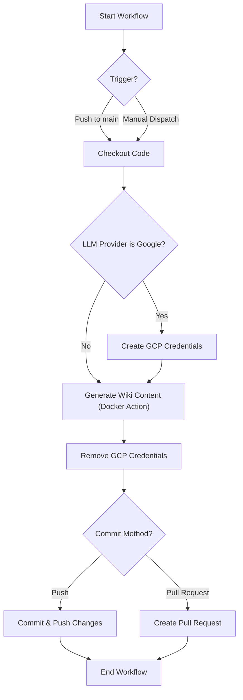
```mermaid
graph TD
    A["Start Workflow"] --> B{"Trigger?"}
    B -- "Push to main" --> C["Checkout Code"]
    B -- "Manual Dispatch" --> C
    C --> D{"LLM Provider is Google?"}
    D -- "Yes" --> E["Create GCP Credentials"]
    D -- "No" --> F["Generate Wiki Content (Docker Action)"]
    E --> F
    F --> G["Remove GCP Credentials"]
    G --> H{"Commit Method?"}
    H -- "Push" --> I["Commit & Push Changes"]
    H -- "Pull Request" --> J["Create Pull Request"]
    I --> K["End Workflow"]
    J --> K
```

### 2. Docker Compose (Local)

For local execution with a UI, Docker Compose provides a simple setup:

1.  **Configure `.env`:** Copy `.env.example` to `.env` and set API keys and optional Notion sync settings.
2.  **Run:** Execute `docker-compose up --build`.
3.  **Access:** Web UI at `http://localhost:8501`, API Docs at `http://localhost:8000/docs`.

Sources: [README.md](README.md)

### 3. Local Python Development

Developers can run the project directly using Python for modification or without Docker:

1.  **Prerequisites:** Python 3.12+, `uv`.
2.  **Setup:** Clone the repository, `cd` into it, run `uv sync`, and activate the virtual environment.
3.  **Configure `.env`:** Set environment variables.
4.  **Run Backend:** `uv run uvicorn src.server:app --reload --port 8000`.
5.  **Run Frontend:** `uv run streamlit run src/app.py`.

Sources: [README.md](README.md)

### 4. Server & Webhooks

The API server can be deployed as a long-running service to handle requests or webhooks:

*   **Endpoint:** `POST /api/v1/webhook/github`
*   **Payload:** Standard GitHub push event.
*   **Behavior:** Triggers a background task to generate and commit the wiki.

Sources: [README.md](README.md)

## Configuration Reference (`.env`)

Configuration is managed through environment variables, typically set in a `.env` file:

| Category | Variable | Description | Example |
|---|---|---|---|
| **LLM Provider** | `LLM_PROVIDER` | Specifies the LLM service to use. | `google` |
| | `MODEL_NAME` | The specific model identifier. | `gemini-2.5-flash` |
| | `LLM_BASE_URL` | Custom base URL for LLM APIs (e.g., Ollama). | `http://localhost:11434/v1` |
| **Auth** | `OPENAI_API_KEY` | API key for OpenAI. | `sk-...` |
| | `ANTHROPIC_API_KEY` | API key for Anthropic. | `sk-ant...` |
| | `GCP_PROJECT_NAME` | Google Cloud Project ID for Vertex AI. | `my-genai-project` |
| **Notion Sync** | `NOTION_SYNC_ENABLED` | Enables/disables syncing to Notion. | `true` |
| | `NOTION_API_KEY` | Notion integration token. | `secret_...` |
| | `NOTION_DATABASE_ID` | Target Notion database ID. | `abc123...` |
| **Paths** | `WIKI_OUTPUT_PATH` | Path to save the generated wiki file. | `./output/WIKI.md` |
| | `LOCAL_REPO_PATH` | Local repository path for Docker mounts. | `/Users/me/project` |
| **Advanced** | `USE_STRUCTURED_OUTPUT` | Use native JSON mode for LLM. | `true` |
| | `IGNORED_PATTERNS` | JSON array of glob patterns to exclude from analysis. | `'["*.log", "node_modules/*"]'` |

Sources: [README.md](README.md)

## API Reference

The backend API is built with FastAPI, offering interactive Swagger documentation at `http://localhost:8000/docs`.

### Wiki Generation Endpoints

*   **`POST /api/v1/wiki/generate/file`**: Initiates a background task to generate the wiki and save it as a Markdown file on the server.
*   **`POST /api/v1/wiki/generate/text`**: Initiates a background task to generate the wiki, storing the resulting text in the task status.
*   **`GET /api/v1/wiki/status/{task_id}`**: Retrieves the status and result of a specific generation task.

### Webhooks

*   **`POST /api/v1/webhook/github`**: Endpoint for GitHub Push event webhooks, triggering automatic wiki generation.

Sources: [README.md](README.md)

## Architecture

The project's architecture leverages a modern tech stack for scalability and maintainability:

*   **Frontend:** [Streamlit](https://streamlit.io/) for the user interface.
*   **Backend:** [FastAPI](https://fastapi.tiangolo.com/) for the REST API and background task management.
*   **LLM Integration:** [LiteLLM](https://docs.litellm.ai/) provides a unified interface for over 100 LLMs.
*   **Data Models:** [Pydantic](https://docs.pydantic.dev/) ensures type safety and structured output validation.
*   **Diagrams:** [Mermaid.js](https://mermaid.js.org/) for generating visual representations of architecture.

Sources: [README.md](README.md)

## GitHub Action Entrypoint Logic (`src/action_entrypoint.py`)

The `action_entrypoint.py` script serves as the core logic executed when the GitHub Action runs. It orchestrates the wiki generation process within the CI/CD environment.

### Execution Flow

1.  **Input Retrieval:** Reads configuration from environment variables, which are automatically mapped by `pydantic-settings` to the `settings` object. This includes `LOCAL_REPO_PATH`, `WIKI_OUTPUT_PATH`, `language`, and Notion sync parameters.
2.  **Request Construction:** Creates a `WikiGenerationRequest` object. For GitHub Actions, `repo_type` is set to `"local"` as the code is checked out into the runner's workspace.
3.  **Service Initialization & Generation:** An instance of `WikiGenerationService` is created with the constructed request. The `generate_wiki_with_structure()` method is then called asynchronously to produce the Markdown content, wiki structure, and individual pages.
4.  **Output Writing:** The generated Markdown content is written to the specified `WIKI_OUTPUT_PATH` within the repository.
5.  **Notion Synchronization (Optional):** If Notion sync is enabled and configured, the `sync_wiki_to_notion` function is called. It uses the generated wiki structure and page content to create or update pages in the specified Notion database. Error handling is included to prevent the action from failing if Notion sync encounters issues, as the primary output (the Markdown file) would have already been written.

Sources: [src/action_entrypoint.py](src/action_entrypoint.py)

### `action_entrypoint.py` Sequence Diagram

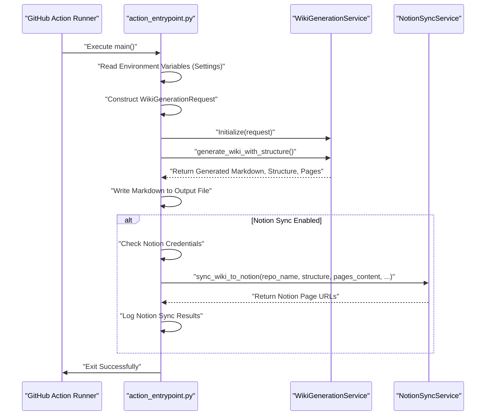
```mermaid
sequenceDiagram
    participant GHA as "GitHub Action Runner"
    participant AE as "action_entrypoint.py"
    participant WS as "WikiGenerationService"
    participant NS as "NotionSyncService"

    GHA->>AE: "Execute main()"
    AE->>AE: "Read Environment Variables (Settings)"
    AE->>AE: "Construct WikiGenerationRequest"
    AE->>WS: "Initialize(request)"
    AE->>WS: "generate_wiki_with_structure()"
    WS-->>AE: "Return Generated Markdown, Structure, Pages"
    AE->>AE: "Write Markdown to Output File"
    alt Notion Sync Enabled
        AE->>AE: "Check Notion Credentials"
        AE->>NS: "sync_wiki_to_notion(repo_name, structure, pages_content, ...)"
        NS-->>AE: "Return Notion Page URLs"
        AE->>AE: "Log Notion Sync Results"
    end
    AE->>GHA: "Exit Successfully"
```

## Conclusion

Wiki As Readme offers a robust and highly adaptable solution for automated documentation. Its model, platform, and deployment agnostic design, coupled with powerful features like deep context analysis and automatic diagram generation, make it an invaluable tool for maintaining up-to-date and comprehensive project documentation. Whether integrated into a CI/CD pipeline or used for local development, it streamlines the process of turning codebases into accessible knowledge bases.

---

<a name="core-features"></a>

<details>
<summary>Relevant source files</summary>

The following files were used as context for generating this wiki page:

- [README.md](README.md)
- [src/services/structure_analyzer.py](src/services/structure_analyzer.py)
- [src/services/wiki_generator.py](src/services/wiki_generator.py)
- [src/prompts/wiki_contents_generator.yaml](src/prompts/wiki_contents_generator.yaml)
</details>

# 핵심 기능

이 문서는 **Wiki As Readme** 프로젝트의 핵심 기능을 상세히 설명합니다. **Wiki As Readme**는 코드베이스를 포괄적인 기술 위키로 변환하는 AI 기반 문서화 도구입니다. 이 도구는 다양한 LLM(대규모 언어 모델) 및 Git 플랫폼과의 호환성을 제공하며, 효율적이고 확장 가능한 방식으로 고품질 문서를 생성하도록 설계되었습니다.

## 1. 심층 컨텍스트 분석 (Deep Context Analysis)

**Wiki As Readme**는 단순히 파일을 읽는 것을 넘어, 프로젝트의 파일 구조와 파일 간의 관계를 분석하여 전체 아키텍처를 이해합니다. 이 기능은 문서 작성 전에 프로젝트의 맥락을 깊이 파악하는 데 필수적입니다.

*   **작동 방식:**
    *   `RepositoryFetcher` 서비스는 대상 저장소의 파일 트리와 `README.md` 내용을 가져옵니다.
    *   `WikiStructureDeterminer`는 이 정보를 바탕으로 LLM을 활용하여 프로젝트의 전반적인 구조와 핵심 구성 요소를 파악합니다.
    *   이를 통해 LLM은 단순히 코드 조각을 요약하는 것이 아니라, 프로젝트의 목적과 설계 의도를 이해하고 문서를 생성할 수 있습니다.

*   **관련 파일:**
    *   `src/services/structure_analyzer.py`: `WikiStructureDeterminer` 클래스가 저장소 구조를 분석하고 LLM에 전달하는 역할을 합니다.
    *   `src/services/repo_fetcher.py` (제공되지 않음): 저장소에서 파일 트리와 `README.md`를 가져오는 역할을 합니다.
    *   `src/services/wiki_generator.py`: `_initialize_and_determine` 메서드에서 `RepositoryFetcher`를 사용하여 저장소 구조를 가져오고 `WikiStructureDeterminer`를 초기화합니다.

## 2. 스마트 구조 생성 (Smart Structure Generation)

이 기능은 프로젝트의 복잡성을 기반으로 문서의 논리적인 계층 구조(섹션 > 페이지)를 자동으로 결정합니다. 이는 수동으로 문서 구조를 설계하는 데 드는 시간과 노력을 절약해 줍니다.

*   **작동 방식:**
    *   `WikiStructureDeterminer.determine_wiki_structure` 메서드는 `RepositoryFetcher`로부터 얻은 파일 트리와 `README.md`를 입력으로 받아 LLM에 전달합니다.
    *   LLM은 프로젝트의 특성과 규모에 따라 가장 적합한 위키 구조(`WikiStructure` 객체)를 제안합니다. 이 구조는 섹션과 각 섹션에 포함될 페이지들로 구성됩니다.
    *   이 과정에서 `prompts/wiki_structure_generator.yaml` (제공되지 않음)과 같은 프롬프트 템플릿이 사용되어 LLM이 일관된 형식으로 구조를 생성하도록 안내합니다.

*   **관련 파일:**
    *   `src/services/structure_analyzer.py`: `determine_wiki_structure` 메서드가 이 기능을 담당합니다.
    *   `src/models/wiki_schema.py` (제공되지 않음): `WikiStructure` 및 `WikiPage`와 같은 데이터 모델을 정의합니다.

## 3. 포괄적인 콘텐츠 생성 (Comprehensive Content)

**Wiki As Readme**는 아키텍처 개요, 설치 가이드, API 참조 등 상세하고 깊이 있는 위키 페이지를 작성합니다. 각 페이지는 관련 소스 코드 파일을 기반으로 정확하고 유용한 정보를 제공합니다.

*   **작동 방식:**
    *   `WikiStructureDeterminer.generate_page_content` 메서드는 특정 위키 페이지에 할당된 관련 파일들을 비동기적으로 가져옵니다 (`_fetch_and_format_files`).
    *   가져온 파일 내용과 페이지 제목을 `prompts/wiki_contents_generator.yaml` 템플릿에 렌더링하여 LLM에 전달합니다.
    *   LLM은 이 프롬프트와 소스 코드를 기반으로 서론, 상세 섹션, 결론을 포함하는 마크다운 콘텐츠를 생성합니다.

*   **관련 파일:**
    *   `src/services/structure_analyzer.py`: `generate_page_content` 메서드가 개별 페이지 콘텐츠 생성을 담당합니다.
    *   `src/prompts/wiki_contents_generator.yaml`: 콘텐츠 생성의 핵심 지침을 담고 있습니다. 이 프롬프트는 페이지 구조, Mermaid 다이어그램 사용 규칙, 테이블 형식, 인용 규칙, 언어 및 톤 등을 상세히 정의하여 LLM이 고품질의 일관된 문서를 생성하도록 유도합니다.

## 4. 자동 다이어그램 생성 (Automatic Diagrams)

복잡한 로직이나 데이터 흐름을 시각화하기 위해 **Mermaid.js** 다이어그램(플로우차트, 시퀀스 다이어그램, 클래스 다이어그램)을 자동으로 생성합니다. 이는 문서의 가독성과 이해도를 크게 향상시킵니다.

*   **작동 방식:**
    *   콘텐츠 생성 과정에서 `prompts/wiki_contents_generator.yaml` 프롬프트는 LLM에게 Mermaid 다이어그램을 생성해야 하는 시점과 방법에 대한 명확한 지침을 제공합니다.
    *   프롬프트는 다이어그램의 품질, 구문 규칙(예: 모든 텍스트 레이블은 반드시 큰따옴표로 묶어야 함), 예약어 사용 금지 등 엄격한 규칙을 명시하여 유효하고 렌더링 가능한 다이어그램이 생성되도록 합니다.

*   **관련 파일:**
    *   `src/prompts/wiki_contents_generator.yaml`: Mermaid 다이어그램 생성에 대한 모든 규칙과 지침이 정의되어 있습니다.

## 5. 하이브리드 출력 (Hybrid Output)

개별 마크다운 파일 형태의 위키와 단일 통합 `README.md` 파일을 모두 생성합니다. 이는 다양한 문서화 요구사항에 유연하게 대응할 수 있도록 합니다.

*   **작동 방식:**
    *   `WikiStructureDeterminer`가 모든 페이지 콘텐츠 생성을 완료하면, `WikiGenerationService`는 `WikiFormatter.consolidate_markdown` 메서드를 호출하여 생성된 모든 페이지 콘텐츠를 하나의 마크다운 파일로 결합합니다.
    *   이 통합된 마크다운은 `README.md`로 사용되거나, 필요에 따라 개별 파일로 분리되어 위키 시스템에 업로드될 수 있습니다.

*   **관련 파일:**
    *   `src/services/wiki_generator.py`: `generate_wiki_with_structure` 메서드 내에서 `WikiFormatter.consolidate_markdown`을 사용하여 최종 마크다운을 생성합니다. `save_to_file` 메서드는 생성된 콘텐츠를 파일로 저장합니다.
    *   `src/services/wiki_formatter.py` (제공되지 않음): 마크다운 콘텐츠를 통합하고 파일 이름을 정리하는 유틸리티를 제공합니다.

## 6. 비동기 및 확장 가능 (Async & Scalable)

**FastAPI**와 **AsyncIO**를 기반으로 구축되어 대규모 문서 생성 작업에서도 비차단(non-blocking) 방식으로 효율적인 성능을 제공합니다.

*   **작동 방식:**
    *   `src/services/structure_analyzer.py` 및 `src/services/wiki_generator.py`의 모든 핵심 메서드는 `async` 함수로 구현되어 비동기 작업을 지원합니다.
    *   `WikiStructureDeterminer`는 `asyncio.Semaphore`를 사용하여 동시 LLM 호출 수를 제한함으로써 API 속도 제한을 준수하고 시스템 부하를 관리합니다.
    *   `asyncio.gather`를 사용하여 여러 파일 콘텐츠 가져오기 및 여러 페이지 콘텐츠 생성을 병렬로 처리하여 전체 생성 시간을 단축합니다.

*   **관련 파일:**
    *   `src/services/structure_analyzer.py`: `asyncio.Semaphore`, `asyncio.gather`를 사용하여 동시성 및 비동기 처리를 관리합니다.
    *   `src/services/wiki_generator.py`: 모든 주요 메서드가 `async`로 정의되어 비동기 워크플로우를 지원합니다.

## 위키 생성 흐름 다이어그램

다음 다이어그램은 **Wiki As Readme**의 핵심 기능들이 어떻게 상호작용하여 최종 위키 문서를 생성하는지 보여줍니다.

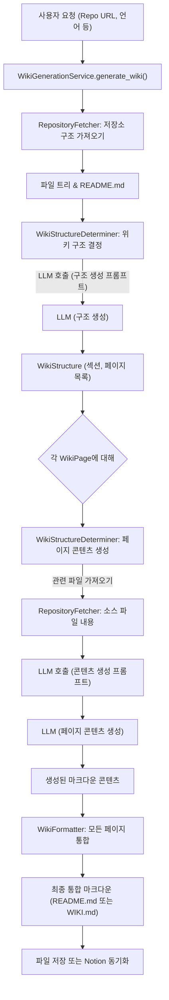
```mermaid
graph TD
    A["사용자 요청 (Repo URL, 언어 등)"] --> B["WikiGenerationService.generate_wiki()"]

    B --> C["RepositoryFetcher: 저장소 구조 가져오기"]
    C --> D["파일 트리 & README.md"]

    D --> E["WikiStructureDeterminer: 위키 구조 결정"]
    E -- "LLM 호출 (구조 생성 프롬프트)" --> F["LLM (구조 생성)"]
    F --> G["WikiStructure (섹션, 페이지 목록)"]

    G --> H{"각 WikiPage에 대해"}
    H --> I["WikiStructureDeterminer: 페이지 콘텐츠 생성"]
    I -- "관련 파일 가져오기" --> J["RepositoryFetcher: 소스 파일 내용"]
    J --> K["LLM 호출 (콘텐츠 생성 프롬프트)"]
    K --> L["LLM (페이지 콘텐츠 생성)"]
    L --> M["생성된 마크다운 콘텐츠"]

    M --> N["WikiFormatter: 모든 페이지 통합"]
    N --> O["최종 통합 마크다운 (README.md 또는 WIKI.md)"]
    O --> P["파일 저장 또는 Notion 동기화"]
```
Sources: [README.md](README.md), [src/services/structure_analyzer.py](src/services/structure_analyzer.py), [src/services/wiki_generator.py](src/services/wiki_generator.py)

## 결론

**Wiki As Readme**의 핵심 기능들은 프로젝트의 문서화 과정을 자동화하고 최적화하는 데 중점을 둡니다. 심층적인 코드 분석부터 지능적인 구조 생성, 포괄적인 콘텐츠 작성, 시각적 다이어그램 지원, 유연한 출력 형식, 그리고 확장 가능한 비동기 아키텍처에 이르기까지, 이 도구는 개발자가 코드 작성에 더 집중하고 문서화 부담을 줄일 수 있도록 설계되었습니다.

---

<a name="universal-compatibility"></a>

<details>
<summary>Relevant source files</summary>

The following files were used as context for generating this wiki page:

- [README.md](README.md)
- [src/agent/llm.py](src/agent/llm.py)
- [src/providers/github.py](src/providers/github.py)
- [src/providers/gitlab.py](src/providers/gitlab.py)
- [src/providers/bitbucket.py](src/providers/bitbucket.py)
- [src/providers/local.py](src/providers/local.py)
</details>

# 범용 호환성

`Wiki As Readme` 프로젝트는 "어떤 모델, 어떤 저장소, 어떤 환경에서도" 작동하도록 설계된 핵심 원칙인 범용 호환성을 기반으로 구축되었습니다. 이 기능은 사용자가 특정 기술 스택이나 배포 환경에 얽매이지 않고 유연하게 문서를 생성할 수 있도록 보장합니다. 이 페이지에서는 `Wiki As Readme`가 모델, 플랫폼 및 배포 전반에 걸쳐 어떻게 광범위한 호환성을 달성하는지 자세히 설명합니다.

## 1. 모델 독립성 (Model Agnostic)

`Wiki As Readme`는 특정 대규모 언어 모델(LLM) 공급업체에 종속되지 않도록 설계되었습니다. 이는 `LiteLLM` 라이브러리를 활용하여 다양한 LLM API 및 로컬 모델에 대한 통합 인터페이스를 제공함으로써 달성됩니다. 사용자는 자신의 요구 사항과 인프라에 가장 적합한 모델을 자유롭게 선택할 수 있습니다.

### 1.1. 지원되는 LLM 공급업체

`Wiki As Readme`는 다음을 포함한 광범위한 LLM 공급업체를 지원합니다.

*   **상용 API:** Google Vertex AI (Gemini), OpenAI (GPT-4), Anthropic (Claude), xAI (Grok).
*   **오픈/로컬 모델:** Ollama, OpenRouter, HuggingFace.
*   **온프레미스:** 자체 프라이빗 LLM 엔드포인트에 안전하게 연결할 수 있습니다.

Sources: [README.md](Universal Compatibility - Model Agnostic)

### 1.2. 구현 세부 정보: `LLMWikiMaker`

`src/agent/llm.py` 파일의 `LLMWikiMaker` 클래스는 `LiteLLM`을 래핑하여 LLM 호출을 처리합니다. 이 클래스는 `_configure_llm` 메서드를 통해 구성된 `LLM_PROVIDER` 및 `MODEL_NAME` 환경 변수를 기반으로 동적으로 LLM 설정을 조정합니다.

#### `_configure_llm` 메서드

이 메서드는 구성된 공급업체에 따라 모델 이름에 적절한 접두사를 추가하고, API 키를 설정하며, 공급업체별 매개변수(예: Google Vertex AI의 `vertex_project`, `vertex_location` 또는 OpenAI의 `api_base`)를 `litellm.acompletion` 호출에 전달할 `kwargs` 딕셔너리에 추가합니다.

| 공급업체 | 모델 접두사 | 필수 환경 변수/설정 |
|---|---|---|
| `google` | `vertex_ai/` | `GCP_PROJECT_NAME`, `GCP_MODEL_LOCATION` |
| `openai` | `openai/` | `OPENAI_API_KEY` 또는 `LLM_BASE_URL` |
| `anthropic` | `anthropic/` | `ANTHROPIC_API_KEY` |
| `openrouter` | `openrouter/` | `OPENROUTER_API_KEY` |
| `xai` | `xai/` | `XAI_API_KEY` |
| `ollama` | `ollama/` | `LLM_BASE_URL` (선택 사항) |

Sources: [src/agent/llm.py](LLMWikiMaker._configure_llm)

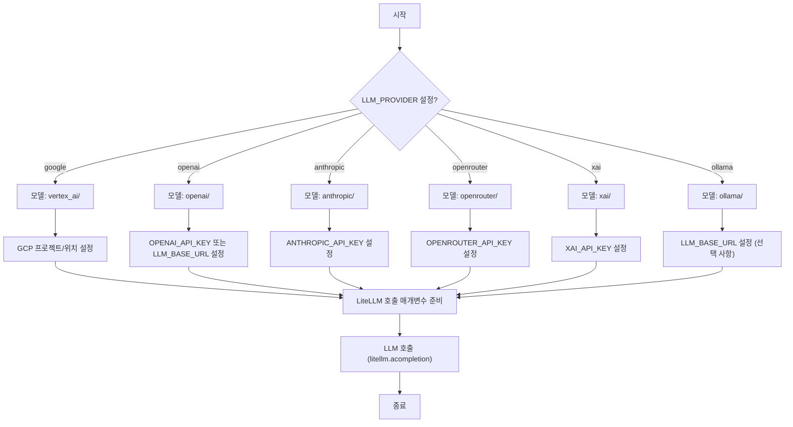
```mermaid
graph TD
    A["시작"] --> B{"LLM_PROVIDER 설정?"}
    B -- "google" --> C["모델: vertex_ai/"]
    B -- "openai" --> D["모델: openai/"]
    B -- "anthropic" --> E["모델: anthropic/"]
    B -- "openrouter" --> F["모델: openrouter/"]
    B -- "xai" --> G["모델: xai/"]
    B -- "ollama" --> H["모델: ollama/"]
    C --> I["GCP 프로젝트/위치 설정"]
    D --> J["OPENAI_API_KEY 또는 LLM_BASE_URL 설정"]
    E --> K["ANTHROPIC_API_KEY 설정"]
    F --> L["OPENROUTER_API_KEY 설정"]
    G --> M["XAI_API_KEY 설정"]
    H --> N["LLM_BASE_URL 설정 (선택 사항)"]
    I --> O["LiteLLM 호출 매개변수 준비"]
    J --> O
    K --> O
    L --> O
    M --> O
    N --> O
    O --> P["LLM 호출 (litellm.acompletion)"]
    P --> Q["종료"]
```

## 2. 플랫폼 독립성 (Platform Agnostic)

`Wiki As Readme`는 코드가 저장된 위치에 관계없이 작동하도록 설계되었습니다. 이는 다양한 코드 저장소 플랫폼 및 로컬 파일 시스템을 지원하는 플러그형 `RepositoryProvider` 구현을 통해 달성됩니다.

### 2.1. 지원되는 플랫폼

*   **클라우드 저장소:** GitHub, GitLab, Bitbucket.
*   **로컬 개발:** 로컬 파일 시스템에서 직접 코드를 분석합니다.
*   **프라이빗/엔터프라이즈:** 프라이빗 인스턴스 및 자체 호스팅 Git 서버를 완벽하게 지원합니다.

Sources: [README.md](Universal Compatibility - Platform Agostic)

### 2.2. 구현 세부 정보: 저장소 공급업체

프로젝트는 각 플랫폼에 대한 전용 공급업체 클래스를 제공합니다. 이 클래스들은 `RepositoryProvider` 추상화(제공된 파일에는 없지만 구현에서 유추됨)를 따르며, 저장소 구조를 가져오고 개별 파일 내용을 가져오는 공통 인터페이스를 제공합니다.

*   **`GitHubProvider` (`src/providers/github.py`):** GitHub REST API를 사용하여 저장소 구조 및 파일 내용을 가져옵니다.
*   **`GitLabProvider` (`src/providers/gitlab.py`):** GitLab API를 사용하여 저장소 구조 및 파일 내용을 가져옵니다. `repo_url`을 분석하여 자체 호스팅 GitLab 인스턴스를 지원합니다.
*   **`BitbucketProvider` (`src/providers/bitbucket.py`):** Bitbucket Cloud API를 사용하여 저장소 구조 및 파일 내용을 가져옵니다.
*   **`LocalProvider` (`src/providers/local.py`):** 로컬 파일 시스템을 스캔하여 저장소 구조를 구축하고 파일 내용을 읽습니다. CPU/디스크 바운드 작업을 `asyncio.to_thread`를 사용하여 별도의 스레드로 오프로드합니다.

각 공급업체는 `fetch_structure()` 및 `fetch_file_content()` 메서드를 구현하여 `RepositoryStructure`를 반환하고 파일 내용을 문자열로 반환합니다.

Sources:
- [src/providers/github.py](GitHubProvider)
- [src/providers/gitlab.py](GitLabProvider)
- [src/providers/bitbucket.py](BitbucketProvider)
- [src/providers/local.py](LocalProvider)

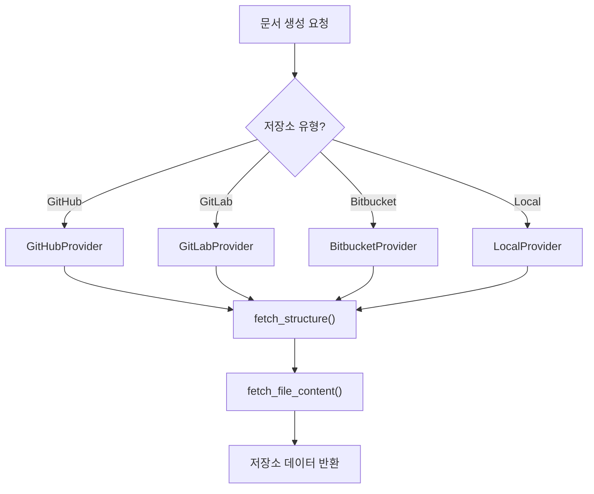
```mermaid
graph TD
    A["문서 생성 요청"] --> B{"저장소 유형?"}
    B -- "GitHub" --> C["GitHubProvider"]
    B -- "GitLab" --> D["GitLabProvider"]
    B -- "Bitbucket" --> E["BitbucketProvider"]
    B -- "Local" --> F["LocalProvider"]
    C --> G["fetch_structure()"]
    D --> G
    E --> G
    F --> G
    G --> H["fetch_file_content()"]
    H --> I["저장소 데이터 반환"]
```

## 3. 배포 독립성 (Deployment Agnostic)

`Wiki As Readme`는 다양한 환경에 쉽게 통합될 수 있도록 유연하게 설계되었습니다. 이는 CI/CD 파이프라인, 컨테이너화된 환경, 장기 실행 서비스 또는 로컬 CLI 도구로 배포할 수 있음을 의미합니다.

### 3.1. 지원되는 배포 모드

*   **CI/CD:** GitHub Actions에 통합하여 코드 변경 시 문서 업데이트를 자동화할 수 있습니다.
*   **컨테이너:** Docker Compose를 통해 로컬에서 전체 UI/API를 실행할 수 있습니다.
*   **서비스:** 웹훅 지원을 통해 장기 실행 API 서버로 배포할 수 있습니다.
*   **CLI:** 코딩 중에 로컬에서 실행할 수 있습니다.

Sources: [README.md](Universal Compatibility - Deployment Agnostic), [README.md](Usage Modes)

### 3.2. GitHub Action 예시

`README.md`에 제공된 GitHub Action 워크플로는 `Wiki As Readme`가 CI/CD 파이프라인에 어떻게 통합될 수 있는지 보여주는 대표적인 예시입니다. 이 워크플로는 `push` 이벤트 또는 수동 트리거 시 `WIKI.md` 파일을 자동으로 생성하거나 업데이트하고, Notion과 동기화하며, 변경 사항을 직접 푸시하거나 Pull Request를 생성할 수 있습니다.

Sources: [README.md](1. GitHub Action (Recommended))

## 결론

`Wiki As Readme`의 범용 호환성은 핵심 설계 원칙으로, 사용자가 선호하는 LLM, 코드 저장소 플랫폼 및 배포 전략에 관계없이 강력하고 유연한 문서 생성 도구를 제공합니다. 이러한 다재다능함은 프로젝트를 다양한 개발 워크플로에 대한 "드롭인" 솔루션으로 만듭니다.

---

<a name="github-action-usage"></a>

<details>
<summary>Relevant source files</summary>

The following files were used as context for generating this wiki page:

- [.github/workflows/wiki-as-readme-action.yml](.github/workflows/wiki-as-readme-action.yml)
- [action.yml](action.yml)
- [WIKI-AS-README-AS-ACTION.yml](WIKI-AS-README-AS-ACTION.yml)
- [src/action_entrypoint.py](src/action_entrypoint.py)
</details>

# GitHub 액션 사용법

## 소개

이 문서는 `Wiki-As-Readme` GitHub 액션의 사용법과 내부 구조를 설명합니다. 이 액션은 LLM(대규모 언어 모델)을 사용하여 코드베이스에서 포괄적인 위키 또는 README 파일을 자동으로 생성하고, 선택적으로 Notion 데이터베이스와 동기화하는 기능을 제공합니다. 이 액션은 GitHub 워크플로우 내에서 실행되도록 설계되었으며, 수동 트리거 또는 특정 브랜치에 대한 푸시 이벤트에 의해 활성화될 수 있습니다.

주요 기능은 다음과 같습니다:
*   **자동 문서 생성**: 저장소의 코드를 분석하여 상세한 위키 콘텐츠를 생성합니다.
*   **다양한 LLM 지원**: Google, OpenAI, Anthropic 등 다양한 LLM 제공업체를 지원합니다.
*   **Notion 동기화**: 생성된 위키 콘텐츠를 Notion 데이터베이스에 동기화할 수 있습니다.
*   **유연한 커밋 방식**: 생성된 파일을 저장소에 직접 푸시하거나 풀 리퀘스트를 생성하여 변경 사항을 적용할 수 있습니다.

## 액션 정의 (`action.yml`)

`action.yml` 파일은 `Wiki-As-Readme` 액션 자체의 메타데이터와 입력 매개변수를 정의합니다. 이 파일은 액션이 GitHub Marketplace에 게시되거나 다른 워크플로우에서 `uses:` 키워드를 통해 참조될 때 사용됩니다.

### 입력 매개변수

액션은 다음과 같은 입력 매개변수를 받습니다. 이 매개변수들은 워크플로우 파일에서 `with:` 키워드를 통해 전달되거나, 환경 변수로 설정될 수 있습니다.

| 매개변수 | 설명 | 기본값 | 필수 여부 |
|---|---|---|---|
| `language` | 생성될 콘텐츠의 언어 코드 (예: `ko`, `en`) | `en` | 아니요 |
| `wiki_output_path` | 생성된 위키 콘텐츠를 저장할 파일 경로 | `WIKI.md` | 아니요 |
| `llm_provider` | 사용할 LLM 제공업체 (예: `google`, `openai`, `anthropic`) | `google` | 아니요 |
| `model_name` | 사용할 특정 모델 이름 | `gemini-2.5-flash` | 아니요 |
| `openai_api_key` | OpenAI API 키 | | 아니요 |
| `anthropic_api_key` | Anthropic API 키 | | 아니요 |
| `openrouter_api_key` | OpenRouter API 키 | | 아니요 |
| `xai_api_key` | xAI API 키 | | 아니요 |
| `git_api_token` | 비공개 저장소 접근을 위한 GitHub/GitLab API 토큰 | | 아니요 |
| `gcp_project_name` | GCP 프로젝트 이름 (Google LLM 사용 시) | | 아니요 |
| `gcp_model_location` | GCP 모델 위치 (Google LLM 사용 시) | | 아니요 |
| `google_application_credentials` | GCP 서비스 계정 JSON 키 (내용 또는 경로) | | 아니요 |
| `llm_base_url` | LLM API를 위한 사용자 정의 기본 URL | | 아니요 |
| `use_structured_output` | 구조화된 JSON 출력을 사용할지 여부 | `true` | 아니요 |
| `temperature` | LLM 온도 (0.0 ~ 1.0) | `0.0` | 아니요 |
| `max_retries` | 최대 재시도 횟수 | `3` | 아니요 |
| `max_concurrency` | 최대 병렬 LLM 호출 수 | `5` | 아니요 |
| `ignored_patterns` | 무시할 glob 패턴의 JSON 배열 | `[]` | 아니요 |

액션은 `docker`를 사용하여 실행되며, `Dockerfile.action` 이미지를 사용합니다. 모든 입력 매개변수는 내부적으로 환경 변수로 매핑되어 Docker 컨테이너 내의 스크립트에서 접근할 수 있습니다.
Sources: [action.yml](inputs), [action.yml](runs)

## 워크플로우 사용법

`Wiki-As-Readme` 액션은 두 가지 주요 GitHub 워크플로우 파일에서 사용됩니다:
1.  `.github/workflows/wiki-as-readme-action.yml`
2.  `WIKI-AS-README-AS-ACTION.yml`

이 두 파일은 거의 동일한 기능을 수행하지만, `WIKI_OUTPUT_PATH`의 기본값과 `commit_method`의 기본값에서 약간의 차이가 있습니다.

### 워크플로우 트리거

두 워크플로우 모두 두 가지 방식으로 트리거될 수 있습니다:

1.  **`push` 이벤트**: `main` 브랜치에 푸시될 때 자동으로 실행됩니다. `README.md`, `WIKI.md`, 워크플로우 파일 자체의 변경은 이 트리거를 무시합니다.
    Sources: [.github/workflows/wiki-as-readme-action.yml](on.push), [WIKI-AS-README-AS-ACTION.yml](on.push)
2.  **`workflow_dispatch` 이벤트**: GitHub UI에서 수동으로 워크플로우를 실행할 수 있도록 합니다. 이 경우 사용자 정의 입력 설정을 제공할 수 있습니다.
    Sources: [.github/workflows/wiki-as-readme-action.yml](on.workflow_dispatch), [WIKI-AS-README-AS-ACTION.yml](on.workflow_dispatch)

`workflow_dispatch`를 통해 제공되는 입력은 다음과 같습니다:

| 입력 | 설명 | 타입 | 기본값 |
|---|---|---|---|
| `language` | 언어 코드 (예: `ko`, `en`, `ja`) | `string` | `en` |
| `llm_provider` | LLM 제공업체 (예: `google`, `openai`, `anthropic`) | `string` | `google` |
| `model_name` | 모델 이름 | `string` | `gemini-2.5-flash` |
| `sync_to_notion` | Notion에 동기화할지 여부 | `boolean` | `false` |
| `commit_method` | 변경 사항을 적용하는 방법 | `choice` (`push`, `pull-request`) | `pull-request` (wiki-as-readme-action.yml), `push` (WIKI-AS-README-AS-ACTION.yml) |

### 워크플로우 `jobs`

두 워크플로우 모두 `wiki-time`이라는 단일 작업을 정의합니다.

#### `wiki-time` 작업 설정

*   **`runs-on`**: `ubuntu-latest` 환경에서 실행됩니다.
*   **`permissions`**:
    *   `contents: write`: 저장소 콘텐츠에 쓰기 권한을 부여합니다 (파일 업데이트, 푸시).
    *   `pull-requests: write`: 풀 리퀘스트를 생성하고 수정할 권한을 부여합니다.
*   **`env`**:
    *   `WIKI_OUTPUT_PATH`: 생성된 위키 파일의 출력 경로를 정의합니다.
        *   `.github/workflows/wiki-as-readme-action.yml`: `"examples/wiki_as_README.md"`
        *   `WIKI-AS-README-AS-ACTION.yml`: `"WIKI.md"`

#### `wiki-time` 작업 단계

1.  **코드 체크아웃**:
    *   `actions/checkout@v4` 액션을 사용하여 현재 저장소 코드를 워크플로우 실행 환경으로 가져옵니다.
    *   Sources: [.github/workflows/wiki-as-readme-action.yml](steps.Checkout code), [WIKI-AS-README-AS-ACTION.yml](steps.Checkout code)

2.  **GCP 자격 증명 설정 (선택 사항)**:
    *   LLM 제공업체가 `google`이거나 지정되지 않은 경우, 또는 `push` 이벤트인 경우 `GOOGLE_APPLICATION_CREDENTIALS` 시크릿을 사용하여 `gcp-key.json` 파일을 생성합니다.
    *   Sources: [.github/workflows/wiki-as-readme-action.yml](steps.Create GCP Credentials File), [WIKI-AS-README-AS-ACTION.yml](steps.Create GCP Credentials File)

3.  **콘텐츠 생성 및 동기화**:
    *   `docker://ghcr.io/catuscio/wiki-as-readme-action:latest` Docker 이미지를 사용하여 실제 위키 생성 및 Notion 동기화 작업을 수행합니다.
    *   이 단계에서는 `action.yml`에 정의된 입력 매개변수들을 환경 변수로 전달합니다. `workflow_dispatch` 입력이 있는 경우 해당 값을 사용하고, 그렇지 않으면 기본값을 사용합니다.
    *   **주요 환경 변수**:
        *   `LANGUAGE`, `WIKI_OUTPUT_PATH`, `LLM_PROVIDER`, `MODEL_NAME`
        *   API 키: `GCP_PROJECT_NAME`, `GCP_MODEL_LOCATION`, `GOOGLE_APPLICATION_CREDENTIALS`, `OPENAI_API_KEY`, `ANTHROPIC_API_KEY`
        *   `GIT_API_TOKEN`: `GITHUB_TOKEN` 시크릿을 사용합니다.
        *   Notion 동기화: `NOTION_SYNC_ENABLED`, `NOTION_API_KEY`, `NOTION_DATABASE_ID`
    *   Sources: [.github/workflows/wiki-as-readme-action.yml](steps.Generate Content), [WIKI-AS-README-AS-ACTION.yml](steps.Generate Content)

4.  **GCP 자격 증명 정리 (선택 사항)**:
    *   `gcp-key.json` 파일을 삭제하여 보안을 강화합니다. 이 단계는 항상 실행됩니다 (`if: always()`).
    *   Sources: [.github/workflows/wiki-as-readme-action.yml](steps.Remove GCP Credentials File), [WIKI-AS-README-AS-ACTION.yml](steps.Remove GCP Credentials File)

5.  **변경 사항 커밋 및 푸시**:
    *   **옵션 A: 직접 푸시**: `commit_method`가 `'push'`로 설정되었거나 `push` 이벤트인 경우 `stefanzweifel/git-auto-commit-action@v5`를 사용하여 변경 사항을 직접 푸시합니다.
    *   **옵션 B: 풀 리퀘스트 생성**: `commit_method`가 `'pull-request'`로 설정된 경우 `peter-evans/create-pull-request@v7`를 사용하여 새로운 브랜치에 커밋하고 풀 리퀘스트를 생성합니다.
    *   Sources: [.github/workflows/wiki-as-readme-action.yml](steps.Commit and Push changes), [.github/workflows/wiki-as-readme-action.yml](steps.Create Pull Request), [WIKI-AS-README-AS-ACTION.yml](steps.Commit and Push changes), [WIKI-AS-README-AS-ACTION.yml](steps.Create Pull Request)

### 워크플로우 흐름 다이어그램

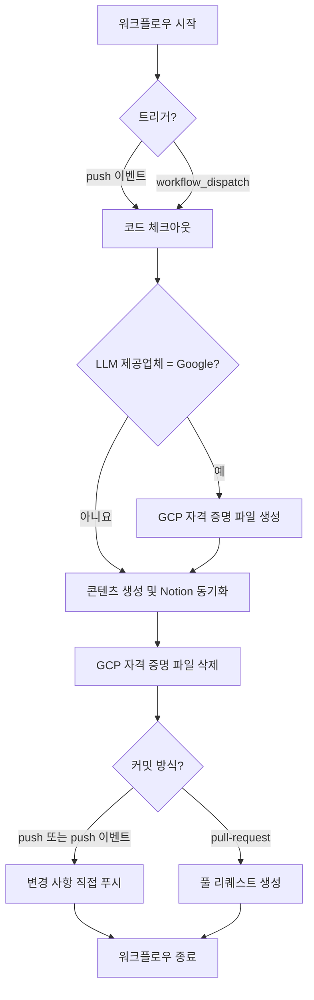
```mermaid
graph TD
    A["워크플로우 시작"] --> B{"트리거?"}
    B -- "push 이벤트" --> C["코드 체크아웃"]
    B -- "workflow_dispatch" --> C
    C --> D{"LLM 제공업체 = Google?"}
    D -- "예" --> E["GCP 자격 증명 파일 생성"]
    D -- "아니요" --> F["콘텐츠 생성 및 Notion 동기화"]
    E --> F
    F --> G["GCP 자격 증명 파일 삭제"]
    G --> H{"커밋 방식?"}
    H -- "push 또는 push 이벤트" --> I["변경 사항 직접 푸시"]
    H -- "pull-request" --> J["풀 리퀘스트 생성"]
    I --> K["워크플로우 종료"]
    J --> K
```

## 액션 엔트리포인트 (`src/action_entrypoint.py`)

`src/action_entrypoint.py` 파일은 `Wiki-As-Readme` GitHub 액션의 핵심 로직을 포함하는 Python 스크립트입니다. 이 스크립트는 Docker 컨테이너 내에서 실행되며, 실제 위키 생성 및 Notion 동기화 작업을 조정합니다.

### `main()` 함수

`async def main()` 함수는 액션의 주요 실행 흐름을 정의합니다.

1.  **입력 설정 로드**:
    *   `src.core.config.settings`를 통해 환경 변수에서 필요한 설정(출력 경로, 언어, Notion 동기화 설정 등)을 자동으로 로드합니다.
    *   Sources: [src/action_entrypoint.py](main function, lines 16-23)

2.  **요청 객체 구성**:
    *   `WikiGenerationRequest` 객체를 생성합니다. `repo_type`은 `local`로 설정되고, `local_path`는 현재 작업 디렉토리로 지정됩니다.
    *   Sources: [src/action_entrypoint.py](main function, lines 32-39)

3.  **위키 생성 서비스 초기화 및 실행**:
    *   `WikiGenerationService`를 초기화하고 `generate_wiki_with_structure()` 메서드를 호출하여 위키 콘텐츠와 구조를 생성합니다.
    *   생성된 마크다운 콘텐츠가 비어 있으면 오류와 함께 종료됩니다.
    *   Sources: [src/action_entrypoint.py](main function, lines 42-54)

4.  **출력 파일 작성**:
    *   생성된 마크다운 콘텐츠를 `settings.WIKI_OUTPUT_PATH`에 지정된 파일에 씁니다. 필요한 경우 상위 디렉토리를 생성합니다.
    *   Sources: [src/action_entrypoint.py](main function, lines 59-65)

5.  **Notion 동기화 (선택 사항)**:
    *   `notion_sync_enabled`가 `True`이고 Notion API 키 및 데이터베이스 ID가 설정되어 있으면 `src.services.notion_sync.sync_wiki_to_notion` 함수를 호출하여 생성된 위키 콘텐츠를 Notion에 동기화합니다.
    *   `GITHUB_REPOSITORY` 환경 변수를 사용하여 저장소 이름을 결정합니다.
    *   Notion 클라이언트가 설치되지 않았거나 동기화 중 오류가 발생하면 경고 또는 오류를 로깅하지만, 액션 실행을 중단하지는 않습니다 (위키 파일은 이미 작성되었으므로).
    *   Sources: [src/action_entrypoint.py](main function, lines 68-104)

### `main()` 함수 흐름 다이어그램

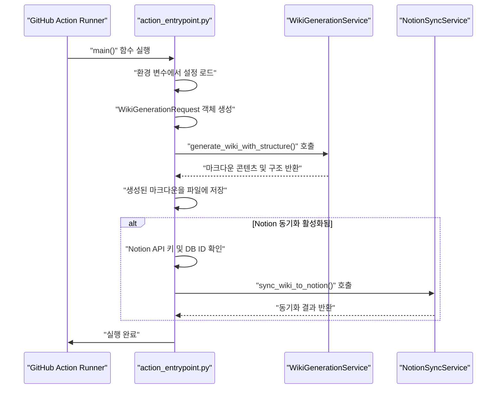
```mermaid
sequenceDiagram
    participant A as "GitHub Action Runner"
    participant B as "action_entrypoint.py"
    participant C as "WikiGenerationService"
    participant D as "NotionSyncService"

    A->>B: "main()" 함수 실행
    B->>B: "환경 변수에서 설정 로드"
    B->>B: "WikiGenerationRequest 객체 생성"
    B->>C: "generate_wiki_with_structure()" 호출
    C-->>B: "마크다운 콘텐츠 및 구조 반환"
    B->>B: "생성된 마크다운을 파일에 저장"
    alt Notion 동기화 활성화됨
        B->>B: "Notion API 키 및 DB ID 확인"
        B->>D: "sync_wiki_to_notion()" 호출
        D-->>B: "동기화 결과 반환"
    end
    B->>A: "실행 완료"
```

## 결론

`Wiki-As-Readme` GitHub 액션은 코드베이스 문서를 자동화하는 강력하고 유연한 도구입니다. `action.yml`을 통해 구성 가능한 입력 매개변수를 제공하고, `.github/workflows` 파일에서 정의된 워크플로우를 통해 자동화된 실행을 지원합니다. 내부적으로 `src/action_entrypoint.py`는 LLM 기반 콘텐츠 생성, 파일 시스템 출력, 그리고 Notion과의 선택적 동기화를 처리하여 개발자가 문서화에 들이는 시간을 절약하고 코드베이스와 문서 간의 일관성을 유지할 수 있도록 돕습니다.

---

<a name="docker-compose-setup"></a>

<details>
<summary>Relevant source files</summary>

The following files were used as context for generating this wiki page:

- [docker-compose.yml](docker-compose.yml)
- [Dockerfile](Dockerfile)
- [Dockerfile.action](Dockerfile.action)
- [Dockerfile.server](Dockerfile.server)
- [.env example](.env example)
</details>

# Docker Compose 설정

## 소개

이 문서는 `wiki-as-readme` 프로젝트의 Docker Compose 설정을 상세히 설명합니다. Docker Compose는 다중 컨테이너 Docker 애플리케이션을 정의하고 실행하기 위한 도구입니다. 이 프로젝트에서는 `docker-compose.yml` 파일을 사용하여 애플리케이션의 API 서버와 Streamlit UI를 포함하는 단일 서비스를 정의하고 관리합니다. 이 설정을 통해 개발 환경을 쉽게 구축하고, 애플리케이션을 일관된 방식으로 배포할 수 있습니다.

## 핵심 구성 요소

Docker Compose 설정은 주로 다음 파일들을 중심으로 이루어집니다:

*   **`docker-compose.yml`**: Docker Compose 서비스의 정의, 빌드 지시사항, 포트 매핑, 환경 변수, 볼륨 마운트 등을 포함하는 메인 구성 파일입니다.
*   **`Dockerfile`**: `wiki-as-readme` 애플리케이션의 메인 Docker 이미지를 빌드하는 데 사용되는 지시사항을 포함합니다. 이 이미지는 API와 Streamlit UI를 모두 포함합니다.
*   **`.env example`**: 애플리케이션의 동작을 구성하는 데 사용되는 환경 변수들의 예시를 제공합니다. `docker-compose.yml`은 이 파일을 통해 환경 변수를 로드합니다.

## Docker Compose 설정 상세

### `docker-compose.yml`

`docker-compose.yml` 파일은 `wiki-as-readme` 애플리케이션을 컨테이너화하여 실행하는 방법을 정의합니다.

```yaml
services:
  wiki-as-readme:
    build: .
    container_name: wiki-as-readme
    ports:
      - "8000:8000" # API
      - "8501:8501" # Streamlit UI
    env_file:
      - .env
    environment:
      # Comment out the line below if NOT using Google Cloud (Vertex AI)
      - GOOGLE_APPLICATION_CREDENTIALS=/app/credentials.json
    volumes:
      - ${WIKI_OUTPUT_PATH:-./output}:/app/output # Save generated files to host
      # Comment out the line below if NOT using Google Cloud (Vertex AI)
      - ${GOOGLE_CREDENTIALS_PATH:-./credentials.json}:/app/credentials.json # Google Cloud Credentials
      - ${LOCAL_REPO_PATH:-./}:/app/target_repo # Mount local directory (Default: current dir)
    restart: always
```
Sources: [docker-compose.yml](docker-compose.yml)

*   **`services`**: `wiki-as-readme`라는 단일 서비스를 정의합니다.
*   **`build: .`**: 현재 디렉토리(`docker-compose.yml`이 위치한 곳)에 있는 `Dockerfile`을 사용하여 이미지를 빌드하도록 지시합니다.
*   **`container_name: wiki-as-readme`**: 생성될 컨테이너의 이름을 `wiki-as-readme`로 지정합니다.
*   **`ports`**:
    *   `8000:8000`: 호스트의 8000번 포트를 컨테이너의 8000번 포트(API)에 매핑합니다.
    *   `8501:8501`: 호스트의 8501번 포트를 컨테이너의 8501번 포트(Streamlit UI)에 매핑합니다.
*   **`env_file: - .env`**: `.env` 파일에서 환경 변수를 로드합니다. 이 파일은 `.env example`을 기반으로 사용자가 직접 생성해야 합니다.
*   **`environment`**:
    *   `GOOGLE_APPLICATION_CREDENTIALS=/app/credentials.json`: Google Cloud (Vertex AI)를 사용하는 경우 컨테이너 내에서 서비스 계정 키 파일의 경로를 지정합니다. 이 설정은 `.env` 파일의 `GOOGLE_CREDENTIALS_PATH`와 함께 사용됩니다.
*   **`volumes`**: 호스트 머신과 컨테이너 간의 데이터 공유를 설정합니다.
    *   `${WIKI_OUTPUT_PATH:-./output}:/app/output`: 생성된 위키 파일이 저장될 호스트 경로를 컨테이너의 `/app/output`에 마운트합니다. `WIKI_OUTPUT_PATH` 환경 변수가 설정되지 않으면 기본값으로 `./output`이 사용됩니다.
    *   `${GOOGLE_CREDENTIALS_PATH:-./credentials.json}:/app/credentials.json`: Google Cloud 자격 증명 파일의 호스트 경로를 컨테이너의 `/app/credentials.json`에 마운트합니다. `GOOGLE_CREDENTIALS_PATH`가 설정되지 않으면 기본값으로 `./credentials.json`이 사용됩니다.
    *   `${LOCAL_REPO_PATH:-./}:/app/target_repo`: 분석할 로컬 저장소의 호스트 경로를 컨테이너의 `/app/target_repo`에 마운트합니다. `LOCAL_REPO_PATH`가 설정되지 않으면 기본값으로 현재 디렉토리(`./`)가 사용됩니다.
*   **`restart: always`**: 컨테이너가 종료되거나 Docker 데몬이 재시작될 때 항상 컨테이너를 다시 시작하도록 설정합니다.

### `Dockerfile`

메인 `Dockerfile`은 `wiki-as-readme` 애플리케이션의 전체 이미지를 빌드하는 데 사용됩니다. 이는 API와 Streamlit UI를 모두 포함합니다.

```dockerfile
# Stage 1: Builder
FROM python:3.12-slim-bookworm AS builder

COPY --from=ghcr.io/astral-sh/uv:latest /uv /bin/uv

WORKDIR /app

ENV UV_COMPILE_BYTECODE=1
ENV UV_LINK_MODE=copy

COPY pyproject.toml uv.lock ./

# Install all dependencies (api + ui)
RUN uv sync --frozen --no-dev --no-install-project --extra all

# Stage 2: Final Image
FROM python:3.12-slim-bookworm

LABEL maintainer="catuscio <catuscio@hotmail.com>"
LABEL description="Full application for wiki-as-readme (API + UI)"
LABEL org.opencontainers.image.source="https://github.com/catuscio/wiki-as-readme"
LABEL org.opencontainers.image.description="Turn your codebase into a comprehensive Wiki in minutes"
LABEL org.opencontainers.image.licenses="MIT"
LABEL org.opencontainers.image.authors="catuscio <catuscio@hotmail.com>"
LABEL org.opencontainers.image.title="wiki-as-readme"
LABEL org.opencontainers.image.version="1.3.0"

RUN useradd -m -u 1000 appuser

WORKDIR /app

COPY --from=builder /app/.venv /app/.venv

COPY src ./src
COPY entrypoint.sh .

RUN chown -R appuser:appuser /app && \
    chmod +x entrypoint.sh

ENV PATH="/app/.venv/bin:$PATH"
ENV PYTHONPATH="/app"

# Expose API and Streamlit ports
EXPOSE 8000
EXPOSE 8501

USER appuser

CMD ["./entrypoint.sh"]
```
Sources: [Dockerfile](Dockerfile)

이 `Dockerfile`은 두 단계의 빌드 프로세스를 사용합니다:

1.  **`builder` 스테이지**:
    *   `python:3.12-slim-bookworm`을 기본 이미지로 사용합니다.
    *   `uv` (빠른 Python 패키지 관리자)를 설치합니다.
    *   작업 디렉토리를 `/app`으로 설정합니다.
    *   `UV_COMPILE_BYTECODE` 및 `UV_LINK_MODE` 환경 변수를 설정하여 `uv`의 성능을 최적화합니다.
    *   `pyproject.toml` 및 `uv.lock` 파일을 복사합니다.
    *   `uv sync --extra all` 명령을 사용하여 모든 종속성(API 및 UI 관련)을 가상 환경에 설치합니다.
2.  **`Final Image` 스테이지**:
    *   `python:3.12-slim-bookworm`을 기본 이미지로 사용합니다.
    *   메타데이터 레이블을 설정합니다.
    *   `appuser`라는 비루트 사용자를 생성합니다.
    *   `builder` 스테이지에서 생성된 가상 환경(`.venv`)을 복사합니다.
    *   애플리케이션 소스 코드(`src`)와 `entrypoint.sh` 스크립트를 복사합니다.
    *   `appuser`에게 `/app` 디렉토리의 소유권을 부여하고 `entrypoint.sh`에 실행 권한을 부여합니다.
    *   `PATH` 및 `PYTHONPATH` 환경 변수를 설정하여 가상 환경과 소스 코드를 올바르게 참조하도록 합니다.
    *   API(8000) 및 Streamlit UI(8501) 포트를 노출합니다.
    *   `appuser`로 전환하여 보안을 강화합니다.
    *   컨테이너 시작 시 `entrypoint.sh` 스크립트를 실행하도록 `CMD`를 설정합니다.

### `.env example`

`.env example` 파일은 `wiki-as-readme` 애플리케이션의 다양한 설정을 위한 환경 변수 템플릿을 제공합니다. `docker-compose.yml`은 이 파일을 기반으로 생성된 `.env` 파일에서 변수를 로드합니다.

```ini
# --- LLM Provider Settings ---
# Choose your LLM provider: google, openai, anthropic, xai, openrouter, ollama
LLM_PROVIDER=google
# Specific model identifier
# (e.g., gemini-2.5-flash, gpt-4o, claude-3-5-sonnet-latest, nvidia/nemotron-3-nano-30b-a3b:free)
MODEL_NAME=gemini-2.5-flash


# --- LLM API Keys ---
# Provide the API key for your chosen provider
OPENAI_API_KEY=
ANTHROPIC_API_KEY=
OPENROUTER_API_KEY=
XAI_API_KEY=


# --- LLM Configuration ---
# Optional: Set a custom base URL for the LLM API (e.g., for Ollama or proxy)
# LLM_BASE_URL=http://localhost:11434/v1
# Whether to use structured JSON output mode (requires model support)
USE_STRUCTURED_OUTPUT=true
# Controls randomness: 0.0 for deterministic, 1.0 for creative
temperature=0.0
# Maximum number of retry attempts for failed LLM requests
max_retries=3
# Limit the number of parallel LLM calls to prevent rate limits
max_concurrency=5


# --- File Filtering Settings -s--
# List of glob patterns to exclude from LLM context to save tokens and improve focus.
# IMPORTANT: Defining this here will OVERRIDE the default list in src/core/config.py.
# The value must be a single-line JSON array string.
# Examples:
# IGNORED_PATTERNS='["uv.lock", "package-lock.json", "yarn.lock", "pnpm-lock.yaml", "poetry.lock", "Gemfile.lock", "composer.lock", "*.pyc", "*.pyo", "*.pyd", "__pycache__", ".git", ".venv", "node_modules", ".idea", ".vscode", ".DS_Store", "*.png", "*.jpg", "*.jpeg", "*.gif", "*.svg", "*.ico", "*.woff", "*.woff2", "*.ttf", "*.eot", "*.mp4", "*.webm", "*.mp3", "*.wav", "*.zip", "*.tar", "*.gz", "*.rar", "*.7z", "*.pdf", "*.doc", "*.docx", "*.xls", "*.xlsx", "*.ppt", "*.pptx"]'
# IGNORED_PATTERNS=


# --- Repository Access Settings ---
# GitHub/GitLab personal access token for private repos or higher rate limits
GIT_API_TOKEN=


# --- Localization Settings ---
# Target language for the generated wiki (e.g., ko, en, ja, zh)
language=en


# --- Google Cloud Platform Settings (Only for Google Vertex AI) ---
GCP_PROJECT_NAME=
GCP_MODEL_LOCATION=


# --- Docker & Local Path Settings ---
# [Host Path] The absolute path to the local repository you want to analyze.
# Default is the current directory (./) in docker-compose.
# LOCAL_REPO_PATH=/Users/username/your-project

# [Host Path] The absolute path where generated wiki files will be saved.
# Default is ./output in docker-compose.
# WIKI_OUTPUT_PATH=/Users/username/wiki-output

# [Host Path] The absolute path to your Google Cloud Service Account JSON key.
# Comment out the line below if NOT using Google Cloud (Vertex AI)
# Default is ./credentials.json in docker-compose.
# GOOGLE_CREDENTIALS_PATH=/Users/username/downloads/vertex-ai-key.json


# --- Notion Sync Settings (Optional) ---
# Enable automatic sync to Notion after wiki generation.
# NOTION_SYNC_ENABLED=true

# Notion Integration Token (get from https://www.notion.so/my-integrations)
# NOTION_API_KEY=secret_xxx...

# The Notion Database ID where each repository will be added as an item.
# Each repo becomes a DB item, with wiki sections as sub-pages inside.
# Get from DB URL: https://notion.so/workspace/{32-char-ID}?v=...
# NOTION_DATABASE_ID=abc123...
```
Sources: [.env example](.env example)

`docker-compose.yml`에서 직접 참조하는 주요 환경 변수는 다음과 같습니다:

| 환경 변수 | 설명 | 기본값 (docker-compose.yml) |
|---|---|---|
| `LOCAL_REPO_PATH` | 분석할 로컬 저장소의 호스트 경로 | `./` (현재 디렉토리) |
| `WIKI_OUTPUT_PATH` | 생성된 위키 파일이 저장될 호스트 경로 | `./output` |
| `GOOGLE_CREDENTIALS_PATH` | Google Cloud 서비스 계정 JSON 키 파일의 호스트 경로 | `./credentials.json` |

이 외에도 LLM 공급자 설정, API 키, 파일 필터링, Notion 동기화 등 다양한 애플리케이션 관련 설정이 이 파일을 통해 관리됩니다. 사용자는 이 파일을 `.env`로 복사하고 필요에 따라 값을 수정해야 합니다.

### 기타 Dockerfile (`Dockerfile.action`, `Dockerfile.server`)

프로젝트에는 `Dockerfile.action` 및 `Dockerfile.server`와 같은 다른 Dockerfile도 존재합니다.
*   **`Dockerfile.action`**: GitHub Actions 워크플로우에서 사용하기 위한 이미지를 빌드합니다. Notion 동기화 관련 종속성만 설치하는 등 특정 용도에 최적화되어 있습니다.
Sources: [Dockerfile.action](Dockerfile.action)
*   **`Dockerfile.server`**: API 서버만 실행하는 경량 이미지를 빌드합니다. `gunicorn`을 사용하여 API를 서빙하며 Streamlit UI 관련 구성 요소는 포함하지 않습니다.
Sources: [Dockerfile.server](Dockerfile.server)

`docker-compose.yml`은 명시적으로 `build: .`을 사용하므로, 기본적으로 메인 `Dockerfile`을 사용하여 전체 애플리케이션(API + UI) 이미지를 빌드합니다.

## Docker Compose 설정 흐름

다음 다이어그램은 Docker Compose가 애플리케이션을 어떻게 구성하고 실행하는지 보여줍니다.

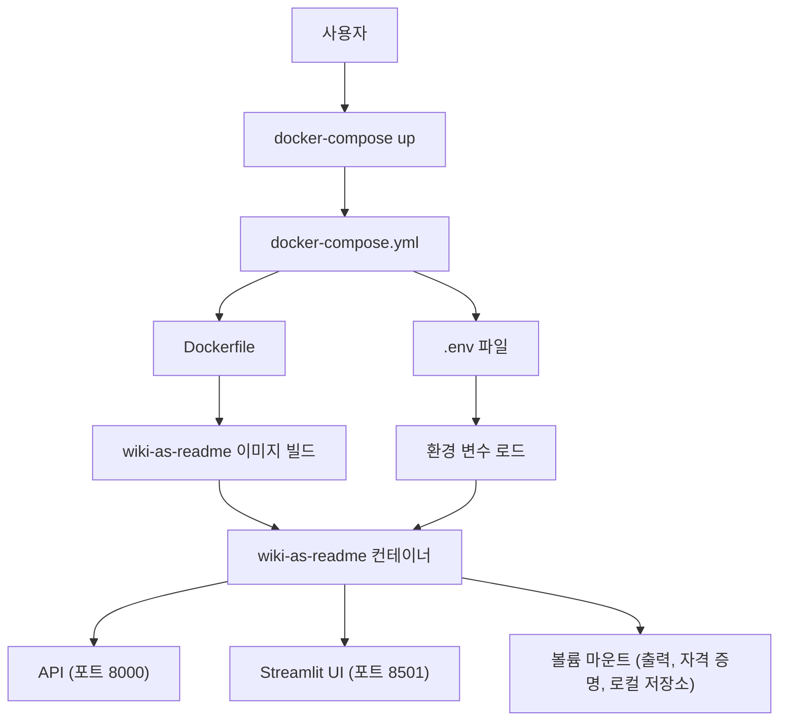
```mermaid
graph TD
    A["사용자"] --> B["docker-compose up"]
    B --> C["docker-compose.yml"]
    C --> D["Dockerfile"]
    C --> E[".env 파일"]
    D --> F["wiki-as-readme 이미지 빌드"]
    E --> G["환경 변수 로드"]
    F & G --> H["wiki-as-readme 컨테이너"]
    H --> I["API (포트 8000)"]
    H --> J["Streamlit UI (포트 8501)"]
    H --> K["볼륨 마운트 (출력, 자격 증명, 로컬 저장소)"]
```

## 결론

Docker Compose 설정은 `wiki-as-readme` 애플리케이션을 로컬 환경에서 쉽게 실행하고 관리할 수 있는 강력한 방법을 제공합니다. `docker-compose.yml`과 `Dockerfile`, 그리고 `.env` 파일을 통해 애플리케이션의 빌드, 실행, 포트 매핑, 볼륨 관리 및 환경 변수 구성을 중앙 집중식으로 처리할 수 있습니다. 이를 통해 개발자는 환경 설정에 드는 시간을 줄이고 애플리케이션 개발에 집중할 수 있습니다.

---

<a name="local-development-guide"></a>

<details>
<summary>Relevant source files</summary>

The following files were used as context for generating this wiki page:

- [pyproject.toml](pyproject.toml)
- [src/app.py](src/app.py)
- [src/server.py](src/server.py)
- [entrypoint.sh](entrypoint.sh)
- [.python-version](.python-version)
</details>

# 로컬 개발 가이드

이 문서는 "Wiki as Readme" 프로젝트를 로컬 개발 환경에서 설정하고 실행하는 방법에 대한 포괄적인 가이드를 제공합니다. 프로젝트의 주요 구성 요소, 의존성 설치, 애플리케이션 실행 방법, 그리고 개발 도구 사용법을 다룹니다.

"Wiki as Readme"는 코드베이스를 포괄적인 위키로 변환하는 도구로, FastAPI 기반의 백엔드 API와 Streamlit 기반의 사용자 인터페이스(UI)로 구성되어 있습니다. 로컬에서 개발하거나 테스트하기 위해 이 가이드를 따를 수 있습니다.

## 1. 프로젝트 개요 및 구성 요소

"Wiki as Readme" 프로젝트는 다음과 같은 주요 구성 요소로 이루어져 있습니다.

*   **`pyproject.toml`**: 프로젝트의 메타데이터, 의존성, Python 버전 요구 사항, 개발 도구(예: Ruff) 설정을 정의합니다.
*   **`src/server.py`**: FastAPI 프레임워크를 사용하여 위키 생성 요청을 처리하는 백엔드 API 서버의 진입점입니다.
*   **`src/app.py`**: Streamlit 프레임워크를 사용하여 사용자 친화적인 인터페이스를 제공하는 프론트엔드 애플리케이션입니다. 이 앱은 백엔드 API와 통신하여 위키 생성 작업을 시작하고 상태를 폴링합니다.
*   **`entrypoint.sh`**: API 서버와 Streamlit 앱을 함께 시작하는 쉘 스크립트로, 주로 컨테이너화된 환경에서 사용됩니다.
*   **`.python-version`**: 프로젝트에서 권장하는 Python 버전을 명시합니다.

### 1.1. 아키텍처 개요

로컬 개발 환경에서 애플리케이션의 주요 구성 요소 간의 상호 작용은 다음과 같습니다.

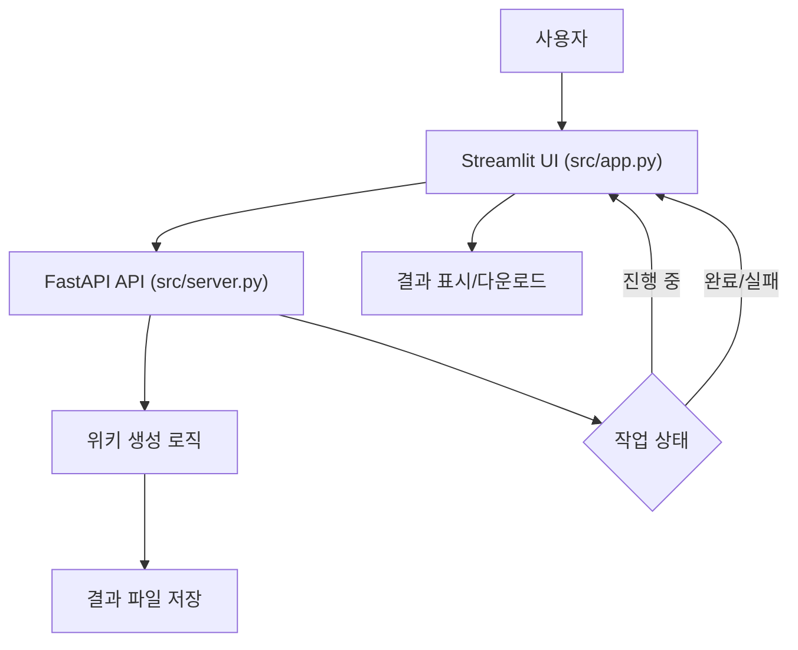
```mermaid
graph TD
    A["사용자"] --> B["Streamlit UI (src/app.py)"];
    B --> C["FastAPI API (src/server.py)"];
    C --> D["위키 생성 로직"];
    D --> E["결과 파일 저장"];
    C --> F{"작업 상태"};
    F -- "진행 중" --> B;
    F -- "완료/실패" --> B;
    B --> G["결과 표시/다운로드"];
```
Sources: [src/app.py](start_generation_task function), [src/server.py](app initialization)

## 2. 개발 환경 설정

### 2.1. Python 버전

프로젝트는 Python 3.12 이상을 요구합니다.
Sources: [pyproject.toml](project.requires-python), [.python-version]

```bash
python --version
# Python 3.12.x 이상인지 확인
```

### 2.2. 의존성 설치

프로젝트의 모든 의존성은 `pyproject.toml` 파일에 정의되어 있습니다. `pip` 또는 `poetry`와 같은 패키지 관리자를 사용하여 설치할 수 있습니다.

**모든 의존성 설치 (핵심, UI, API, Notion, 개발 도구 포함):**

```bash
pip install ".[all,dev]"
```

**주요 의존성:**

| 패키지 | 설명 |
|---|---|
| `google-auth` | Google 인증 관련 기능 |
| `httpx` | 비동기 HTTP 클라이언트 (API 통신용) |
| `jinja2` | 템플릿 엔진 |
| `litellm` | 다양한 LLM API 통합 |
| `loguru` | 로깅 라이브러리 |
| `pydantic` | 데이터 유효성 검사 및 설정 관리 |
| `pydantic-settings` | Pydantic 기반 설정 관리 |
| `python-dotenv` | `.env` 파일에서 환경 변수 로드 |
| `pyyaml` | YAML 파싱 |
| `requests` | 동기 HTTP 클라이언트 |
Sources: [pyproject.toml](project.dependencies)

**선택적 의존성:**

| 그룹 | 패키지 | 설명 |
|---|---|---|
| `ui` | `streamlit`, `streamlit-mermaid` | Streamlit 기반 UI 및 Mermaid 다이어그램 렌더링 |
| `api` | `fastapi`, `uvicorn`, `gunicorn` | FastAPI 웹 프레임워크 및 ASGI 서버 |
| `notion` | `notion-client` | Notion API 연동 |
Sources: [pyproject.toml](project.optional-dependencies)

**개발 의존성:**

| 그룹 | 패키지 | 설명 |
|---|---|---|
| `dev` | `pre-commit`, `ruff` | 코드 품질 관리 및 린팅 도구 |
Sources: [pyproject.toml](dependency-groups.dev)

## 3. 애플리케이션 실행

"Wiki as Readme"는 백엔드 API 서버와 프론트엔드 Streamlit UI, 두 가지 주요 구성 요소로 실행됩니다.

### 3.1. API 서버 실행

FastAPI 서버는 `uvicorn`을 사용하여 실행할 수 있습니다.

```bash
uvicorn src.server:app --host 127.0.0.1 --port 8000 --reload
```
*   `--host 127.0.0.1`: 서버가 로컬호스트에서만 접근 가능하도록 설정합니다.
*   `--port 8000`: 서버가 8000번 포트에서 수신 대기하도록 설정합니다.
*   `--reload`: 코드 변경 시 서버를 자동으로 재시작합니다 (개발용).

서버가 성공적으로 시작되면 `http://127.0.0.1:8000`에서 접근할 수 있습니다.
Sources: [src/server.py](uvicorn.run call)

### 3.2. Streamlit UI 실행

Streamlit 애플리케이션은 다음 명령어로 실행할 수 있습니다.

```bash
streamlit run src/app.py --server.address=0.0.0.0 --server.port=8501
```
*   `--server.address=0.0.0.0`: Streamlit 앱이 모든 네트워크 인터페이스에서 접근 가능하도록 설정합니다.
*   `--server.port=8501`: Streamlit 앱이 8501번 포트에서 수신 대기하도록 설정합니다.

앱이 성공적으로 시작되면 `http://localhost:8501` (또는 네트워크 환경에 따라 다른 IP)에서 접근할 수 있습니다.
Sources: [entrypoint.sh](streamlit run command)

### 3.3. 통합 실행 (entrypoint.sh)

`entrypoint.sh` 스크립트는 API 서버와 Streamlit 앱을 순차적으로 시작하는 방법을 보여줍니다. 이는 주로 Docker와 같은 컨테이너 환경에서 사용됩니다.

```bash
#!/bin/bash
set -e

echo "Starting API server..."
gunicorn -k uvicorn.workers.UvicornWorker \
    --bind 0.0.0.0:8000 \
    --workers 1 \
    --access-logfile - \
    --error-logfile - \
    src.server:app &

echo "Waiting for API to initialize..."
sleep 5

echo "Starting Streamlit app..."
streamlit run src/app.py --server.address=0.0.0.0 --server.port=8501
```
이 스크립트는 다음 단계를 수행합니다:
1.  `gunicorn`을 사용하여 FastAPI 서버를 백그라운드(`&`)에서 시작합니다. `uvicorn.workers.UvicornWorker`를 사용하여 Uvicorn 워커를 사용합니다.
2.  API 서버가 초기화될 시간을 주기 위해 5초 동안 기다립니다.
3.  Streamlit 앱을 시작합니다.
Sources: [entrypoint.sh]

## 4. 주요 설정

### 4.1. 환경 변수 (`.env`)

애플리케이션은 `.env` 파일을 통해 환경 변수를 로드할 수 있습니다. `src/app.py`에서 `.env` 파일 설정의 중요성을 강조합니다.
Sources: [src/app.py](render_generator_page function, "💡 **Note:** Setup `.env` first")

### 4.2. API 베이스 URL

Streamlit 앱은 백엔드 API와 통신하기 위해 `API_BASE_URL`을 사용합니다.

*   **기본값**: `http://localhost:8000/api/v1`
*   **오버라이드**: `API_BASE_URL` 환경 변수를 설정하여 변경할 수 있습니다.

예시 (`.env` 파일):
```
API_BASE_URL=http://your-api-server:8000/api/v1
```
Sources: [src/app.py](API_BASE_URL constant)

### 4.3. 출력 디렉토리

생성된 위키 파일은 `OUTPUT_DIR`에 저장됩니다.

*   **기본값**: `output` 디렉토리 (프로젝트 루트 기준)

Sources: [src/app.py](OUTPUT_DIR constant)

### 4.4. Docker 환경에서의 로컬 경로

Docker 컨테이너 내에서 로컬 저장소를 분석할 경우, Streamlit UI에서 경로를 `/app/target_repo/your-project`와 같이 지정해야 합니다. 이는 컨테이너 내부의 파일 시스템 경로를 반영합니다.
Sources: [src/app.py](render_generator_page function, "🐳 **Docker Tip:**")

## 5. 개발 도구

### 5.1. Ruff

`ruff`는 Python 코드의 린팅 및 포매팅을 위한 매우 빠른 도구입니다. `pyproject.toml`에 상세한 설정이 정의되어 있습니다.

*   **줄 길이**: 88자
*   **대상 Python 버전**: 3.12
*   **선택된 린트 규칙**: `F`, `W`, `E`, `I`, `UP`, `C4`, `FA`, `ISC`, `ICN`, `RET`, `SIM`, `TID`, `TC`, `TD`, `NPY`
*   **무시된 규칙**: `E501` (줄 길이 초과)
*   **자동 수정 가능**: 모든 규칙
*   **포맷팅 스타일**: 큰따옴표, 스페이스 들여쓰기

Sources: [pyproject.toml](tool.ruff section)

### 5.2. Pre-commit

`pre-commit`은 커밋 전에 코드 품질 검사를 자동으로 실행하는 프레임워크입니다. `dev` 의존성에 포함되어 있으며, 프로젝트의 `.pre-commit-config.yaml` 파일(제공되지 않음)에 설정되어 있을 것으로 예상됩니다.

## 6. 결론

이 가이드는 "Wiki as Readme" 프로젝트를 로컬 환경에서 성공적으로 설정하고 실행하는 데 필요한 모든 정보를 제공합니다. 개발 환경 설정부터 애플리케이션 실행, 주요 설정 및 개발 도구 활용까지, 이 문서를 통해 프로젝트에 기여하거나 기능을 테스트할 수 있습니다.

---

<a name="server-and-webhooks-deployment"></a>

<details>
<summary>Relevant source files</summary>

The following files were used as context for generating this wiki page:

- [Dockerfile.server](Dockerfile.server)
- [src/server.py](src/server.py)
- [src/api/v1/endpoints/webhook.py](src/api/v1/endpoints/webhook.py)
- [src/api/v1/endpoints/wiki.py](src/api/v1/endpoints/wiki.py)
- [src/models/github_webhook_schema.py](src/models/github_webhook_schema.py)
</details>

# 서버 및 웹훅 배포

## 소개

이 문서는 `wiki-as-readme` 프로젝트의 서버 구성 및 웹훅 배포 메커니즘에 대해 설명합니다. 이 시스템은 FastAPI 기반의 API 서버로, 코드베이스를 기반으로 위키 문서를 생성하고, GitHub 웹훅을 통해 코드 변경 사항에 자동으로 반응하여 `WIKI.md` 파일을 업데이트하는 기능을 제공합니다. 배포는 Docker를 사용하여 컨테이너화되어 일관되고 효율적인 환경을 보장합니다.

주요 목표는 개발자가 코드 변경에 집중하는 동안 문서화 프로세스를 자동화하여, 항상 최신 상태의 포괄적인 위키를 유지하는 것입니다.

## 서버 아키텍처

`wiki-as-readme` 서버는 Python의 FastAPI 프레임워크를 기반으로 구축되었으며, Gunicorn과 Uvicorn 워커를 사용하여 프로덕션 환경에서 실행됩니다. Docker를 통해 컨테이너화되어 배포됩니다.

### FastAPI 애플리케이션

`src/server.py` 파일은 FastAPI 애플리케이션의 진입점입니다.

*   **애플리케이션 인스턴스**: `FastAPI` 인스턴스를 생성하며, 애플리케이션의 제목, 설명, 버전을 정의합니다.
*   **로깅**: `src.core.logger_config.setup_logging()`을 통해 로깅이 초기화됩니다.
*   **헬스 체크**: 루트 경로 (`/`)에 간단한 헬스 체크 엔드포인트가 있어 서버의 가용성을 확인할 수 있습니다.
*   **API 라우터 포함**:
    *   `/api/v1/wiki` 경로에 위키 생성 관련 엔드포인트 (`src.api.v1.endpoints.wiki`)를 포함합니다.
    *   `/api/v1/webhook` 경로에 웹훅 통합 관련 엔드포인트 (`src.api.v1.endpoints.webhook`)를 포함합니다.

로컬 개발 환경에서는 `uvicorn.run`을 사용하여 서버를 시작할 수 있습니다.
Sources: [src/server.py](src/server.py)

### Docker 배포

서버는 `Dockerfile.server`를 사용하여 Docker 이미지로 빌드됩니다. 이는 두 단계 빌드(multi-stage build) 방식을 채택하여 최종 이미지의 크기를 최적화합니다.

#### 1단계: 빌더 (Builder)

*   `python:3.12-slim-bookworm` 이미지를 기반으로 합니다.
*   `uv` (Python 패키지 관리자)를 복사하여 사용합니다.
*   `pyproject.toml` 및 `uv.lock` 파일을 복사한 후 `uv sync`를 사용하여 의존성을 설치합니다. 이 단계에서 개발 의존성은 제외하고 `api` 추가 의존성만 설치합니다.
Sources: [Dockerfile.server](Stage 1: Builder)

#### 2단계: 최종 이미지 (Final Image)

*   `python:3.12-slim-bookworm` 이미지를 기반으로 합니다.
*   **메타데이터**: `LABEL` 지시어를 사용하여 이미지에 대한 메타데이터(유지보수자, 설명, 라이선스 등)를 추가합니다.
*   **사용자**: `appuser`라는 비루트 사용자를 생성하고 애플리케이션을 이 사용자 권한으로 실행하여 보안을 강화합니다.
*   **가상 환경 복사**: 빌더 단계에서 생성된 `.venv` 가상 환경을 최종 이미지로 복사합니다.
*   **소스 코드 복사**: `src` 디렉토리를 이미지로 복사하고 `appuser`가 소유하도록 권한을 변경합니다.
*   **환경 변수**:
    *   `PATH`: 가상 환경의 `bin` 디렉토리를 `PATH`에 추가하여 설치된 실행 파일을 직접 호출할 수 있도록 합니다.
    *   `PYTHONPATH`: `/app`을 `PYTHONPATH`에 추가하여 `src` 모듈을 쉽게 임포트할 수 있도록 합니다.
*   **포트 노출**: `EXPOSE 8000`을 통해 애플리케이션이 8000번 포트에서 수신 대기함을 알립니다.
*   **명령어**: `CMD` 지시어를 사용하여 Gunicorn을 통해 FastAPI 애플리케이션을 실행합니다.
    *   `-k uvicorn.workers.UvicornWorker`: Uvicorn 워커 클래스를 사용합니다.
    *   `--bind 0.0.0.0:8000`: 모든 네트워크 인터페이스의 8000번 포트에 바인딩합니다.
    *   `--workers 2`: 두 개의 워커 프로세스를 실행합니다.
    *   `--access-logfile -`, `--error-logfile -`: 접근 및 오류 로그를 표준 출력으로 보냅니다.
    *   `src.server:app`: 실행할 FastAPI 애플리케이션의 모듈과 인스턴스를 지정합니다.
Sources: [Dockerfile.server](Stage 2: Final Image)

## 웹훅 통합

`wiki-as-readme` 서버는 GitHub 웹훅을 수신하여 코드 변경 시 자동으로 위키를 업데이트하는 기능을 제공합니다. 이 기능은 `src/api/v1/endpoints/webhook.py` 파일에 구현되어 있습니다.

### GitHub 웹훅 엔드포인트 (`/api/v1/webhook/github`)

이 엔드포인트는 GitHub의 `push` 이벤트에 반응합니다.

*   **HTTP 메서드**: `POST`
*   **경로**: `/api/v1/webhook/github`
*   **응답 코드**: `202 Accepted` (비동기 처리를 나타냄)
*   **페이로드**: `GitHubPushPayload` 모델을 사용하여 GitHub 웹훅 페이로드를 파싱합니다.
Sources: [src/api/v1/endpoints/webhook.py](github_webhook function)

### 보안: 서명 검증

GitHub 웹훅의 보안을 위해 HMAC 서명 검증이 구현되어 있습니다.

*   `verify_signature` 함수는 `X-Hub-Signature-256` 헤더와 `GITHUB_WEBHOOK_SECRET` 환경 변수를 사용하여 수신된 페이로드의 무결성을 검증합니다.
*   서명이 없거나 유효하지 않으면 `403 Forbidden` 오류를 반환합니다.
*   `GITHUB_WEBHOOK_SECRET`이 설정되지 않은 경우 서명 검증은 건너뜁니다.
Sources: [src/api/v1/endpoints/webhook.py](verify_signature function)

### 웹훅 처리 로직

`github_webhook` 함수는 다음과 같은 로직으로 웹훅 이벤트를 처리합니다.

1.  **서명 검증**: `await verify_signature(request)`를 호출하여 요청의 유효성을 확인합니다.
2.  **무한 루프 방지**:
    *   `BOT_COMMITTER_NAME` (예: "Wiki-As-Readme-Bot")과 동일한 `pusher.name`을 가진 커밋은 무시합니다.
    *   커밋 메시지에 "via Wiki-As-Readme" 문자열이 포함된 경우에도 무시합니다. 이는 봇 자신이 생성한 커밋으로 인한 무한 업데이트 루프를 방지합니다.
3.  **브랜치 필터링**: `main` 브랜치에 대한 푸시 이벤트만 처리하고, 다른 브랜치는 무시합니다.
4.  **위키 생성 요청 구성**: 수신된 GitHub 페이로드에서 저장소 소유자, 이름, URL을 추출하여 `WikiGenerationRequest` 객체를 생성합니다. 기본적으로 한국어(`ko`)와 포괄적인 뷰(`is_comprehensive_view=True`)로 설정됩니다.
5.  **백그라운드 작업 시작**: `process_full_cycle` 함수를 백그라운드 작업으로 등록하여 위키 생성 및 GitHub 업데이트 프로세스를 비동기적으로 실행합니다.
Sources: [src/api/v1/endpoints/webhook.py](github_webhook function)

### 전체 사이클 처리 (`process_full_cycle`)

이 비동기 함수는 위키 생성부터 GitHub 업데이트까지의 전체 워크플로우를 담당합니다.

1.  **내부 위키 생성 API 호출**:
    *   `httpx.AsyncClient`를 사용하여 서버 자체의 `/api/v1/wiki/generate/file` 엔드포인트를 호출합니다.
    *   `WikiGenerationRequest` 객체를 JSON 형식으로 전송합니다.
    *   생성 API의 응답에서 생성된 마크다운 콘텐츠를 추출합니다.
2.  **GitHub `WIKI.md` 업데이트**:
    *   `update_github_readme` 함수를 호출하여 생성된 마크다운 콘텐츠를 GitHub 저장소의 `WIKI.md` 파일에 커밋합니다.
    *   이 과정은 `GITHUB_ACCESS_TOKEN` (GitHub Personal Access Token)을 필요로 합니다.
    *   기존 파일의 SHA를 가져와 파일을 덮어쓰거나, 파일이 없으면 새로 생성합니다.
    *   콘텐츠는 GitHub API 요구사항에 따라 Base64로 인코딩됩니다.
    *   커밋 메시지와 커미터 정보(봇 이름 및 이메일)가 포함됩니다.
Sources: [src/api/v1/endpoints/webhook.py](process_full_cycle function), [src/api/v1/endpoints/webhook.py](update_github_readme function)

#### GitHub 웹훅 처리 흐름

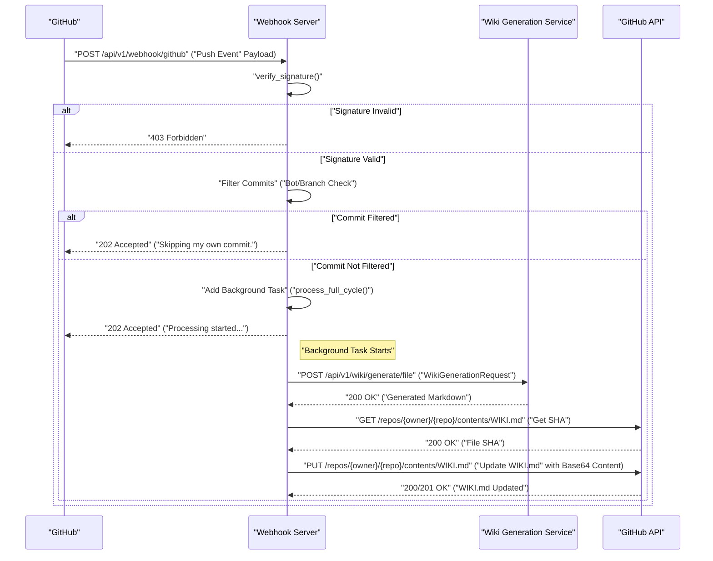
```mermaid
sequenceDiagram
    participant GH as "GitHub"
    participant WS as "Webhook Server"
    participant WGS as "Wiki Generation Service"
    participant GHA as "GitHub API"

    GH->>WS: "POST /api/v1/webhook/github" ("Push Event" Payload)
    WS->>WS: "verify_signature()"
    alt "Signature Invalid"
        WS-->>GH: "403 Forbidden"
    else "Signature Valid"
        WS->>WS: "Filter Commits" ("Bot/Branch Check")
        alt "Commit Filtered"
            WS-->>GH: "202 Accepted" ("Skipping my own commit.")
        else "Commit Not Filtered"
            WS->>WS: "Add Background Task" ("process_full_cycle()")
            WS-->>GH: "202 Accepted" ("Processing started...")
            Note right of WS: "Background Task Starts"
            WS->>WGS: "POST /api/v1/wiki/generate/file" ("WikiGenerationRequest")
            WGS-->>WS: "200 OK" ("Generated Markdown")
            WS->>GHA: "GET /repos/{owner}/{repo}/contents/WIKI.md" ("Get SHA")
            GHA-->>WS: "200 OK" ("File SHA")
            WS->>GHA: "PUT /repos/{owner}/{repo}/contents/WIKI.md" ("Update WIKI.md" with Base64 Content)
            GHA-->>WS: "200/201 OK" ("WIKI.md Updated")
        end
    end
```

## 위키 생성 서비스

위키 생성 서비스는 `src/api/v1/endpoints/wiki.py` 파일에 정의되어 있으며, 위키 생성 작업을 시작하고 상태를 조회하는 엔드포인트를 제공합니다.

### 위키 엔드포인트 (`/api/v1/wiki`)

*   **`POST /generate/file`**:
    *   비동기적으로 위키 생성을 트리거합니다.
    *   생성된 마크다운 파일을 서버의 `output/` 디렉토리에 저장합니다.
    *   작업 진행 상황을 추적할 수 있는 `task_id`를 반환합니다.
*   **`POST /generate/text`**:
    *   비동기적으로 위키 생성을 트리거합니다.
    *   생성된 마크다운 파일을 서버 파일 시스템에 저장하지 않습니다.
    *   생성된 텍스트는 작업 상태 조회 시 결과로 제공됩니다.
    *   작업 진행 상황을 추적할 수 있는 `task_id`를 반환합니다.
*   **`GET /status/{task_id}`**:
    *   특정 `task_id`에 해당하는 위키 생성 작업의 현재 상태를 조회합니다.
    *   작업이 완료되면 결과(파일 경로 또는 텍스트)를 포함합니다.

모든 생성 엔드포인트는 `_init_wiki_generation` 헬퍼 함수를 사용하여 초기 유효성 검사, 작업 생성 및 `WikiGenerationService` 초기화를 수행합니다. 실제 위키 생성 로직은 `process_wiki_generation_task` 백그라운드 작업에서 실행됩니다.
Sources: [src/api/v1/endpoints/wiki.py](generate_wiki_file function), [src/api/v1/endpoints/wiki.py](generate_wiki_text function), [src/api/v1/endpoints/wiki.py](get_wiki_generation_status function)

### 데이터 모델

GitHub 웹훅 페이로드를 처리하기 위한 Pydantic 모델은 `src/models/github_webhook_schema.py`에 정의되어 있습니다.

#### `GitHubPushPayload`

GitHub `push` 이벤트의 핵심 정보를 담고 있는 모델입니다.

| 필드 | 타입 | 설명 |
|---|---|---|
| `ref` | `str` | 푸시된 브랜치 또는 태그의 참조 (예: `refs/heads/main`) |
| `repository` | `GitHubRepository` | 푸시가 발생한 저장소 정보 |
| `pusher` | `GitHubPusher` | 푸시를 수행한 사용자 정보 |
| `head_commit` | `GitHubCommit` | 푸시의 최신 커밋 정보 |
Sources: [src/models/github_webhook_schema.py](GitHubPushPayload class)

## 결론

`wiki-as-readme` 서버는 FastAPI, Docker, GitHub 웹훅을 활용하여 코드베이스 문서화 프로세스를 자동화하는 강력한 시스템을 제공합니다. 이 아키텍처는 코드 변경 사항에 대한 즉각적인 반응을 통해 `WIKI.md` 파일을 최신 상태로 유지하며, 개발자가 문서화 부담 없이 핵심 개발에 집중할 수 있도록 지원합니다. Docker를 통한 배포는 환경 일관성과 쉬운 확장을 보장합니다.

---

<a name="system-architecture"></a>

<details>
<summary>Relevant source files</summary>

The following files were used as context for generating this wiki page:

- [src/app.py](src/app.py)
- [src/server.py](src/server.py)
- [src/agent/llm.py](src/agent/llm.py)
- [src/services/wiki_generator.py](src/services/wiki_generator.py)
- [src/api/v1/endpoints/wiki.py](src/api/v1/endpoints/wiki.py)
- [src/core/config.py](src/core/config.py)
</details>

# System Architecture

## Introduction

The "Wiki As Readme" project is designed to automatically generate comprehensive wiki documentation from a given codebase. This system leverages Large Language Models (LLMs) to analyze repository content, determine an optimal wiki structure, and generate detailed markdown pages. The architecture is composed of a user-friendly Streamlit frontend, a robust FastAPI backend API, and a suite of modular services that orchestrate the wiki generation process, including interaction with various LLM providers. This document outlines the key components, their responsibilities, and how they interact to deliver the core functionality.

## Overall System Architecture

The system follows a client-server architecture, separating the user interface from the core logic and LLM interactions.

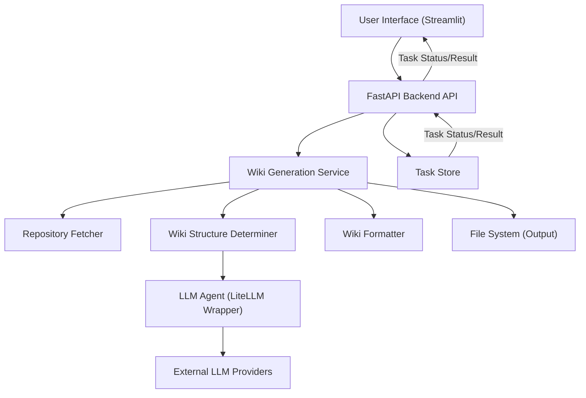
```mermaid
graph TD
    A["User Interface (Streamlit)"] --> B["FastAPI Backend API"];
    B --> C["Wiki Generation Service"];
    C --> D["Repository Fetcher"];
    C --> E["Wiki Structure Determiner"];
    C --> F["Wiki Formatter"];
    E --> G["LLM Agent (LiteLLM Wrapper)"];
    G --> H["External LLM Providers"];
    B --> I["Task Store"];
    C --> J["File System (Output)"];
    I -- "Task Status/Result" --> B;
    B -- "Task Status/Result" --> A;
```

## Component Breakdown

### 1. Frontend: Streamlit Application (`src/app.py`)

The Streamlit application serves as the primary user interface for interacting with the Wiki Generator. It provides a simple and intuitive way for users to initiate wiki generation and view results.

*   **Purpose:** User input, task initiation, status monitoring, and display of generated wikis.
*   **Key Features:**
    *   **Repository Input:** Allows users to specify a GitHub/GitLab URL or a local path to a repository.
    *   **Configuration Options:** Toggles for "Comprehensive View" and language selection.
    *   **API Interaction:** Asynchronously communicates with the FastAPI backend to start generation tasks (`start_generation_task`) and poll for their status (`poll_task_status`).
    *   **Result Display:** Renders the generated markdown content, including support for Mermaid diagrams, and provides a download option.
    *   **History Page:** Lists previously generated wiki files from the local `output` directory, allowing users to view and download them.
*   **API Interaction Flow:**
    1.  User submits repository details.
    2.  `start_generation_task` sends a `WikiGenerationRequest` to `/api/v1/wiki/generate/file` (or `/text`).
    3.  The backend returns a `task_id`.
    4.  `poll_task_status` repeatedly queries `/api/v1/wiki/status/{task_id}` until the task is `completed` or `failed`.
    5.  The UI updates with progress and displays the final result.

### 2. Backend: FastAPI Service (`src/server.py`, `src/api/v1/endpoints/wiki.py`)

The FastAPI application provides the RESTful API endpoints that the Streamlit frontend (and other potential clients) interact with. It manages the lifecycle of wiki generation tasks.

*   **Purpose:** Expose API endpoints, handle requests, orchestrate background tasks, and manage task status.
*   **Key Files:**
    *   `src/server.py`: The main entry point for the FastAPI application, defining the app instance and including API routers.
    *   `src/api/v1/endpoints/wiki.py`: Defines the API endpoints specifically for wiki generation and status retrieval.
*   **Endpoints:**
    *   `POST /api/v1/wiki/generate/file`: Initiates a wiki generation task in the background. The generated markdown is saved to the server's filesystem.
    *   `POST /api/v1/wiki/generate/text`: Initiates a wiki generation task in the background. The generated markdown content is returned as part of the task result, but not saved to the server's filesystem.
    *   `GET /api/v1/wiki/status/{task_id}`: Retrieves the current status and result of a specific generation task.
*   **Task Management:**
    *   Uses `BackgroundTasks` to offload the heavy wiki generation process, ensuring the API remains responsive.
    *   Relies on a `Task Store` (implied by `create_task` and `get_task` functions) to persist and retrieve task states and results.
    *   The `process_wiki_generation_task` function (executed as a background task) is responsible for invoking the core `WikiGenerationService`.

### 3. Core Services

These services encapsulate the business logic for fetching repositories, analyzing their structure, generating content, and formatting the final output.

#### 3.1. Wiki Generation Service (`src/services/wiki_generator.py`)

This is the central orchestrator for the entire wiki generation pipeline.

*   **Purpose:** Coordinates the steps from repository fetching to final markdown consolidation.
*   **Key Class:** `WikiGenerationService`
*   **Workflow:**
    1.  **`prepare_generation()`:** Initializes and determines the initial wiki structure using `RepositoryFetcher` and `WikiStructureDeterminer`.
    2.  **`generate_wiki_with_structure()`:**
        *   Fetches repository structure using a `RepositoryFetcher` component.
        *   Determines the optimal wiki structure (sections, pages) using a `WikiStructureDeterminer` component.
        *   Triggers content generation for each page via the `WikiStructureDeterminer`.
        *   Consolidates all generated pages into a single markdown document using a `WikiFormatter` component.
    3.  **`save_to_file()`:** Persists the final markdown content to a specified output directory on the server.

#### 3.2. Repository Fetcher (Component within `WikiGenerationService`)

*   **Purpose:** Responsible for cloning or accessing the target repository and extracting its file tree and README content.
*   **Interaction:** Used by `WikiGenerationService` to get the raw repository data.

#### 3.3. Wiki Structure Determiner (Component within `WikiGenerationService`)

*   **Purpose:** Analyzes the repository structure and README to propose a logical wiki hierarchy (sections, pages). It then uses the LLM to generate content for each identified page.
*   **Interaction:** Uses the `LLMWikiMaker` to interact with LLMs for both structure determination and content generation.

#### 3.4. Wiki Formatter (Component within `WikiGenerationService`)

*   **Purpose:** Takes the determined wiki structure and the generated content for individual pages, then consolidates them into a single, well-formatted markdown document.

### 4. LLM Agent (`src/agent/llm.py`)

This module provides a standardized interface for interacting with various Large Language Models.

*   **Purpose:** Abstract away the complexities of different LLM providers and ensure consistent interaction.
*   **Key Class:** `LLMWikiMaker`
*   **Features:**
    *   **LiteLLM Wrapper:** Uses LiteLLM to support a wide range of LLM providers (Google, OpenAI, Anthropic, OpenRouter, xAI, Ollama).
    *   **Provider Configuration:** Dynamically configures LLM calls based on `LLM_PROVIDER` and `MODEL_NAME` settings from `src/core/config.py`, handling API keys and base URLs.
    *   **Structured Output:** Supports structured JSON output using Pydantic schemas, either natively via LLM provider capabilities or by parsing JSON from markdown code blocks.
    *   **Asynchronous Invocation:** Provides an `ainvoke` method for non-blocking LLM calls.

### 5. Configuration (`src/core/config.py`)

The `config` module centralizes all application settings, making the system configurable and adaptable to different environments and LLM providers.

*   **Purpose:** Manage environment-specific and application-wide settings.
*   **Key Class:** `Settings` (Pydantic `BaseSettings`)
*   **Settings Examples:**
    *   `LLM_PROVIDER`, `MODEL_NAME`, `OPENAI_API_KEY`, `GCP_PROJECT_NAME`, etc.
    *   `temperature`, `max_retries`, `max_concurrency` for LLM calls.
    *   `IGNORED_PATTERNS` for repository analysis.
    *   `WIKI_OUTPUT_PATH` for saving generated files.
    *   Notion integration settings.

## Detailed Data Flow: Wiki Generation

This sequence diagram illustrates the end-to-end process when a user requests a wiki generation.

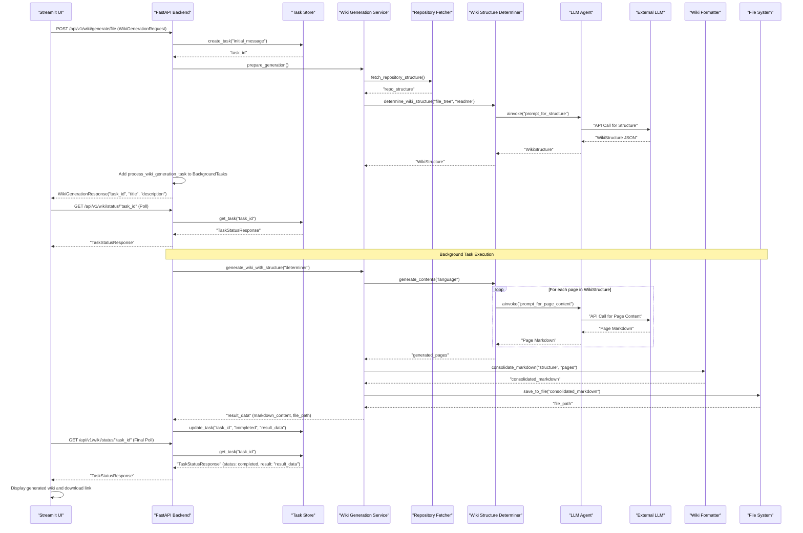
```mermaid
sequenceDiagram
    participant UI as "Streamlit UI"
    participant BE as "FastAPI Backend"
    participant TS as "Task Store"
    participant WGS as "Wiki Generation Service"
    participant RF as "Repository Fetcher"
    participant WSD as "Wiki Structure Determiner"
    participant LLMA as "LLM Agent"
    participant LLM as "External LLM"
    participant WF as "Wiki Formatter"
    participant FS as "File System"

    UI->>BE: POST /api/v1/wiki/generate/file (WikiGenerationRequest)
    BE->>TS: create_task("initial_message")
    TS-->>BE: "task_id"
    BE->>WGS: prepare_generation()
    WGS->>RF: fetch_repository_structure()
    RF-->>WGS: "repo_structure"
    WGS->>WSD: determine_wiki_structure("file_tree", "readme")
    WSD->>LLMA: ainvoke("prompt_for_structure")
    LLMA->>LLM: "API Call for Structure"
    LLM-->>LLMA: "WikiStructure JSON"
    LLMA-->>WSD: "WikiStructure"
    WSD-->>WGS: "WikiStructure"
    BE->>BE: Add process_wiki_generation_task to BackgroundTasks
    BE-->>UI: WikiGenerationResponse("task_id", "title", "description")

    UI->>BE: GET /api/v1/wiki/status/"task_id" (Poll)
    BE->>TS: get_task("task_id")
    TS-->>BE: "TaskStatusResponse"
    BE-->>UI: "TaskStatusResponse"

    Note over BE,FS: Background Task Execution
    BE->>WGS: generate_wiki_with_structure("determiner")
    WGS->>WSD: generate_contents("language")
    loop For each page in WikiStructure
        WSD->>LLMA: ainvoke("prompt_for_page_content")
        LLMA->>LLM: "API Call for Page Content"
        LLM-->>LLMA: "Page Markdown"
        LLMA-->>WSD: "Page Markdown"
    end
    WSD-->>WGS: "generated_pages"
    WGS->>WF: consolidate_markdown("structure", "pages")
    WF-->>WGS: "consolidated_markdown"
    WGS->>FS: save_to_file("consolidated_markdown")
    FS-->>WGS: "file_path"
    WGS-->>BE: "result_data" (markdown_content, file_path)
    BE->>TS: update_task("task_id", "completed", "result_data")

    UI->>BE: GET /api/v1/wiki/status/"task_id" (Final Poll)
    BE->>TS: get_task("task_id")
    TS-->>BE: "TaskStatusResponse" (status: completed, result: "result_data")
    BE-->>UI: "TaskStatusResponse"
    UI->>UI: Display generated wiki and download link
```

## Conclusion

The "Wiki As Readme" system is built on a modular and scalable architecture. The clear separation of concerns between the frontend, backend API, core services, and LLM integration layer allows for independent development, easier maintenance, and flexibility in adopting new technologies or LLM providers. The use of asynchronous processing and background tasks ensures a responsive user experience, while robust configuration management makes the application adaptable to various deployment environments.

---

<a name="configuration-reference"></a>

<details>
<summary>Relevant source files</summary>

The following files were used as context for generating this wiki page:

- [.env example](.env example)
- [src/core/config.py](src/core/config.py)
- [README.md](README.md)
</details>

# 설정 참조

이 문서는 Wiki As Readme 프로젝트의 설정 옵션에 대한 포괄적인 참조를 제공합니다. 이 프로젝트는 `.env` 파일을 통해 환경 변수를 사용하여 구성되며, `src/core/config.py` 파일의 Pydantic `Settings` 클래스에 의해 로드되고 검증됩니다. 올바른 구성은 LLM 제공자 선택부터 출력 경로 및 Notion 동기화 설정에 이르기까지 애플리케이션의 동작을 제어하는 데 필수적입니다.

## 설정 로딩 메커니즘

Wiki As Readme는 `pydantic-settings` 라이브러리를 활용하여 애플리케이션 구성을 관리합니다.
`src/core/config.py`에 정의된 `Settings` 클래스는 `.env` 파일에서 환경 변수를 읽고, 기본값을 제공하며, 데이터 유형 유효성 검사를 수행합니다. 이를 통해 애플리케이션 전체에서 일관되고 안전한 구성 접근 방식을 보장합니다.

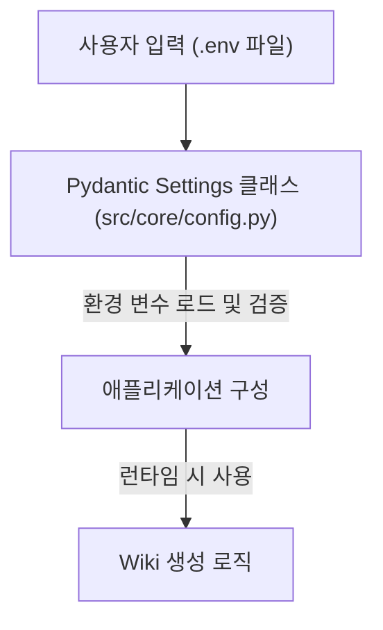
```mermaid
graph TD
    A["사용자 입력 (.env 파일)"] --> B["Pydantic Settings 클래스 (src/core/config.py)"];
    B -- "환경 변수 로드 및 검증" --> C["애플리케이션 구성"];
    C -- "런타임 시 사용" --> D["Wiki 생성 로직"];
```
Sources: [src/core/config.py](Settings class), [.env example](.env example)

## 구성 변수 참조

다음 표는 Wiki As Readme 프로젝트에서 사용할 수 있는 모든 구성 변수를 자세히 설명합니다. 이 변수들은 `.env` 파일에 설정하거나 환경 변수로 직접 제공할 수 있습니다.

| 카테고리 | 변수 | 설명 | 유형 | 기본값 | 예시 |
|---|---|---|---|---|---|
| **LLM 제공자** | `LLM_PROVIDER` | 사용할 LLM 제공자를 선택합니다. 지원되는 값: `google`, `openai`, `anthropic`, `xai`, `openrouter`, `ollama`. | `Literal` | `google` | `google` |
| | `MODEL_NAME` | 선택한 제공자의 특정 모델 식별자입니다. | `str` | `gemini-2.5-flash` | `gpt-4o` |
| | `LLM_BASE_URL` | LLM API를 위한 사용자 정의 기본 URL (예: Ollama 또는 프록시용). | `str` | `None` | `http://localhost:11434/v1` |
| | `USE_STRUCTURED_OUTPUT` | 구조화된 JSON 출력 모드 사용 여부 (모델 지원 필요). | `bool` | `true` | `true` |
| | `temperature` | LLM 응답의 무작위성을 제어합니다. `0.0`은 결정적이고, `1.0`은 창의적입니다. | `float` | `0.0` | `0.0` |
| | `max_retries` | 실패한 LLM 요청에 대한 최대 재시도 횟수입니다. | `int` | `3` | `3` |
| | `max_concurrency` | 속도 제한을 방지하기 위해 병렬 LLM 호출 수를 제한합니다. | `int` | `5` | `5` |
| **LLM API 키** | `OPENAI_API_KEY` | OpenAI API 키입니다. | `str` | `None` | `sk-...` |
| | `ANTHROPIC_API_KEY` | Anthropic API 키입니다. | `str` | `None` | `sk-ant...` |
| | `OPENROUTER_API_KEY` | OpenRouter API 키입니다. | `str` | `None` | `sk-or-...` |
| | `XAI_API_KEY` | xAI API 키입니다. | `str` | `None` | `sk-xai-...` |
| **파일 필터링** | `IGNORED_PATTERNS` | LLM 컨텍스트에서 제외할 glob 패턴 목록입니다. 토큰을 절약하고 초점을 개선합니다. `.env`에서 정의하면 `src/core/config.py`의 기본 목록을 재정의합니다. **단일 라인 JSON 배열 문자열**이어야 합니다. | `list[str]` | `DEFAULT_IGNORED_PATTERNS` | `'["*.log", "node_modules/*"]'` |
| **저장소 접근** | `GIT_API_TOKEN` | 비공개 저장소 또는 더 높은 속도 제한을 위한 GitHub/GitLab 개인 액세스 토큰입니다. | `str` | `None` | `ghp_...` |
| **지역화** | `language` | 생성된 위키의 대상 언어입니다 (예: `ko`, `en`, `ja`, `zh`). | `Literal` | `en` | `ko` |
| **Google Cloud Platform** | `GCP_PROJECT_NAME` | Google Vertex AI를 사용하는 경우 GCP 프로젝트 이름입니다. | `str` | `None` | `my-genai-project` |
| | `GCP_MODEL_LOCATION` | Google Vertex AI 모델 위치입니다 (예: `us-central1`). | `str` | `None` | `us-central1` |
| | `GOOGLE_APPLICATION_CREDENTIALS` | Google Cloud 서비스 계정 JSON 키 파일의 경로입니다. Docker 환경에서는 컨테이너 내부 경로를 지정합니다. | `SecretStr` | `None` | `/github/workspace/gcp-key.json` |
| **경로 설정** | `LOCAL_REPO_PATH` | 분석할 로컬 저장소의 절대 경로입니다. Docker Compose의 기본값은 현재 디렉토리 (`./`)입니다. | `str` | `.` | `/Users/username/your-project` |
| | `WIKI_OUTPUT_PATH` | 생성된 위키 파일이 저장될 절대 경로입니다. Docker Compose의 기본값은 `./output`입니다. | `str` | `./WIKI.md` | `./output/my_wiki.md` |
| **Notion 동기화** | `NOTION_SYNC_ENABLED` | 위키 생성 후 Notion으로 자동 동기화를 활성화합니다. | `bool` | `false` | `true` |
| | `NOTION_API_KEY` | Notion 통합 토큰입니다. | `str` | `None` | `secret_xxx...` |
| | `NOTION_DATABASE_ID` | 각 저장소가 항목으로 추가될 Notion 데이터베이스 ID입니다. | `str` | `None` | `abc123...` |
| **웹훅** | `GITHUB_WEBHOOK_SECRET` | GitHub 웹훅 서명 검증에 사용되는 비밀 키입니다. | `str` | `None` | `my_webhook_secret` |

Sources: [.env example](.env example), [src/core/config.py](Settings class), [README.md](Configuration Reference (`.env`) table)

### `IGNORED_PATTERNS` 처리

`IGNORED_PATTERNS` 변수는 특별한 처리를 받습니다.
`src/core/config.py`의 `parse_ignored_patterns` 유효성 검사기는 다음과 같이 작동합니다:
1.  값이 문자열인 경우:
    *   비어 있으면 `DEFAULT_IGNORED_PATTERNS`를 반환합니다.
    *   JSON으로 파싱을 시도합니다. 성공하고 결과가 리스트이면 해당 리스트를 사용합니다.
    *   JSON 파싱에 실패하면 쉼표로 구분된 문자열로 간주하고 분할하여 리스트를 생성합니다.
2.  문자열이 아닌 경우 (예: 이미 리스트인 경우) 값을 그대로 사용합니다.

이 메커니즘은 `.env` 파일에서 `IGNORED_PATTERNS`를 JSON 배열 문자열로 제공하거나, 간단한 쉼표 구분 문자열로 제공할 수 있도록 유연성을 제공합니다.

Sources: [src/core/config.py](parse_ignored_patterns method, DEFAULT_IGNORED_PATTERNS)

## GitHub Actions에서의 구성

GitHub Actions 워크플로우에서는 환경 변수를 통해 구성이 전달됩니다. `update-wiki.yml` 예시에서 볼 수 있듯이, `inputs` (수동 트리거 시) 또는 기본값을 사용하여 `LANGUAGE`, `LLM_PROVIDER`, `MODEL_NAME`, API 키 등을 설정할 수 있습니다. 비밀 정보는 GitHub Secrets를 통해 안전하게 관리됩니다.

Sources: [README.md](1. GitHub Action (Recommended) section)

## 결론

Wiki As Readme의 구성 시스템은 유연하고 강력하여 다양한 배포 환경과 LLM 제공자에 적응할 수 있습니다. `.env` 파일을 통해 이러한 설정을 이해하고 올바르게 구성함으로써, 사용자는 특정 요구 사항에 맞게 위키 생성 프로세스를 미세 조정할 수 있습니다.

---

<a name="api-reference"></a>

<details>
<summary>Relevant source files</summary>

The following files were used as context for generating this wiki page:

- [src/api/v1/endpoints/wiki.py](src/api/v1/endpoints/wiki.py)
- [src/api/v1/endpoints/webhook.py](src/api/v1/endpoints/webhook.py)
- [src/models/api_schema.py](src/models/api_schema.py)
- [src/models/github_webhook_schema.py](src/models/github_webhook_schema.py)
- [src/server.py](src/server.py)
</details>

# API 참조

## 소개

이 문서는 "Wiki as Readme" 프로젝트의 API 엔드포인트에 대한 포괄적인 참조를 제공합니다. 이 API는 코드베이스에서 위키 문서를 생성하고, 생성 작업의 상태를 추적하며, GitHub 웹훅을 통해 자동화된 문서 업데이트를 지원하도록 설계되었습니다. 주요 기능에는 파일 시스템에 위키를 저장하거나 텍스트로 반환하는 기능, 그리고 GitHub 푸시 이벤트에 반응하여 `WIKI.md` 파일을 자동으로 업데이트하는 기능이 포함됩니다.

API는 `FastAPI` 프레임워크를 기반으로 구축되었으며, 비동기 작업을 위해 백그라운드 태스크를 활용하여 장시간 실행되는 위키 생성 프로세스가 사용자 경험을 차단하지 않도록 합니다.

## API 엔드포인트 개요

"Wiki as Readme" API는 두 가지 주요 섹션으로 나뉩니다: 위키 생성 및 웹훅 통합. 모든 엔드포인트는 `/api/v1` 접두사 아래에 있습니다.

*   **위키 생성 엔드포인트**: `/api/v1/wiki`
*   **웹훅 통합 엔드포인트**: `/api/v1/webhook`

## 위키 생성 API (`/api/v1/wiki`)

이 섹션의 엔드포인트는 코드 저장소에서 위키 문서를 생성하고 해당 작업의 상태를 조회하는 기능을 제공합니다. 모든 생성 작업은 백그라운드에서 비동기적으로 처리됩니다.

### 1. 위키 생성 및 파일 저장

`POST /api/v1/wiki/generate/file`

이 엔드포인트는 지정된 저장소에 대한 위키 생성을 트리거하고, 생성된 마크다운 파일을 서버의 `output/` 디렉토리에 저장합니다. 작업 진행 상황을 추적하기 위한 작업 ID를 반환합니다.

*   **메서드**: `POST`
*   **경로**: `/generate/file`
*   **설명**: 위키 생성을 시작하고 결과를 서버 파일 시스템에 저장합니다.
*   **요청 모델**: `WikiGenerationRequest`
*   **응답 모델**: `WikiGenerationResponse`
*   **처리 흐름**:
    1.  `_init_wiki_generation` 헬퍼 함수를 호출하여 요청을 검증하고, 새 작업을 생성하며, 위키 구조를 결정합니다.
    2.  `process_wiki_generation_task` 함수를 `save_file=True` 플래그와 함께 백그라운드 태스크로 추가합니다.
    3.  작업 ID, 제목, 설명을 포함하는 초기 응답을 반환합니다.

Sources: [src/api/v1/endpoints/wiki.py](generate_wiki_file function)

### 2. 위키 생성 및 텍스트 반환

`POST /api/v1/wiki/generate/text`

이 엔드포인트는 지정된 저장소에 대한 위키 생성을 트리거하지만, 결과를 서버 파일 시스템에 저장하지 않습니다. 생성된 텍스트는 작업 상태 조회 시 결과 필드에서 사용할 수 있습니다.

*   **메서드**: `POST`
*   **경로**: `/generate/text`
*   **설명**: 위키 생성을 시작하고 생성된 마크다운 텍스트를 작업 결과로 반환합니다 (파일 저장 안 함).
*   **요청 모델**: `WikiGenerationRequest`
*   **응답 모델**: `WikiGenerationResponse`
*   **처리 흐름**:
    1.  `_init_wiki_generation` 헬퍼 함수를 호출하여 요청을 검증하고, 새 작업을 생성하며, 위키 구조를 결정합니다.
    2.  `process_wiki_generation_task` 함수를 `save_file=False` 플래그와 함께 백그라운드 태스크로 추가합니다.
    3.  작업 ID, 제목, 설명을 포함하는 초기 응답을 반환합니다.

Sources: [src/api/v1/endpoints/wiki.py](generate_wiki_text function)

### 3. 위키 생성 상태 조회

`GET /api/v1/wiki/status/{task_id}`

이 엔드포인트는 특정 위키 생성 작업의 현재 상태를 검색합니다.

*   **메서드**: `GET`
*   **경로**: `/status/{task_id}`
*   **설명**: 특정 작업 ID에 대한 위키 생성 작업의 현재 상태를 반환합니다.
*   **경로 매개변수**:
    *   `task_id` (문자열): 조회할 작업의 고유 ID.
*   **응답 모델**: `TaskStatusResponse`
*   **오류**: 작업 ID를 찾을 수 없는 경우 `HTTP 404 Not Found`를 반환합니다.

Sources: [src/api/v1/endpoints/wiki.py](get_wiki_generation_status function)

### 위키 생성 흐름 다이어그램

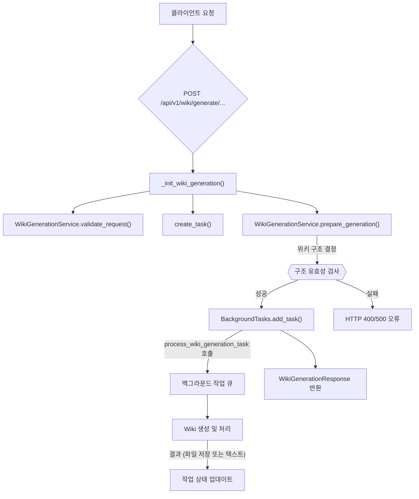
```mermaid
graph TD
    A["클라이언트 요청"] --> B{"POST /api/v1/wiki/generate/..."};
    B --> C["_init_wiki_generation()"];
    C --> D["WikiGenerationService.validate_request()"];
    C --> E["create_task()"];
    C --> F["WikiGenerationService.prepare_generation()"];
    F -- "위키 구조 결정" --> G{{"구조 유효성 검사"}};
    G -- "성공" --> H["BackgroundTasks.add_task()"];
    H -- "process_wiki_generation_task 호출" --> I["백그라운드 작업 큐"];
    I --> J["Wiki 생성 및 처리"];
    J -- "결과 (파일 저장 또는 텍스트)" --> K["작업 상태 업데이트"];
    H --> L["WikiGenerationResponse 반환"];
    G -- "실패" --> M["HTTP 400/500 오류"];
```

## 웹훅 통합 API (`/api/v1/webhook`)

이 섹션의 엔드포인트는 외부 서비스(예: GitHub)의 웹훅 이벤트를 수신하고 처리합니다.

### 1. GitHub 웹훅 처리

`POST /api/v1/webhook/github`

이 엔드포인트는 GitHub 푸시 이벤트를 수신하고 처리합니다. 유효한 푸시 이벤트가 감지되면, 해당 저장소에 대한 위키 생성을 트리거하고 생성된 내용을 GitHub 저장소의 `WIKI.md` 파일로 커밋합니다.

*   **메서드**: `POST`
*   **경로**: `/github`
*   **설명**: GitHub 푸시 이벤트를 수신하고, 위키를 생성한 다음 GitHub `WIKI.md` 파일을 업데이트합니다.
*   **요청 모델**: `GitHubPushPayload`
*   **응답**: `HTTP 202 Accepted`와 함께 처리 시작 메시지.
*   **보안**: `X-Hub-Signature-256` 헤더를 사용하여 HMAC 서명 검증을 수행합니다.
*   **무한 루프 방지**: `BOT_COMMITTER_NAME` 또는 특정 커밋 메시지를 통해 봇 자신의 커밋은 무시합니다.
*   **브랜치 필터링**: `main` 브랜치에 대한 푸시 이벤트만 처리합니다.
*   **처리 흐름**:
    1.  `verify_signature` 함수를 호출하여 GitHub 웹훅 서명을 검증합니다.
    2.  푸셔 이름 또는 커밋 메시지를 확인하여 봇 자신의 커밋을 건너뜁니다.
    3.  `main` 브랜치에 대한 푸시인지 확인합니다.
    4.  `WikiGenerationRequest` 객체를 생성하여 내부 위키 생성 API를 호출할 준비를 합니다.
    5.  `process_full_cycle` 함수를 백그라운드 태스크로 추가합니다. 이 함수는 내부 `generate/file` 엔드포인트를 호출하고, 생성된 마크다운을 가져와 `update_github_readme` 함수를 통해 GitHub에 커밋합니다.

Sources: [src/api/v1/endpoints/webhook.py](github_webhook function)

### GitHub 웹훅 처리 흐름 다이어그램

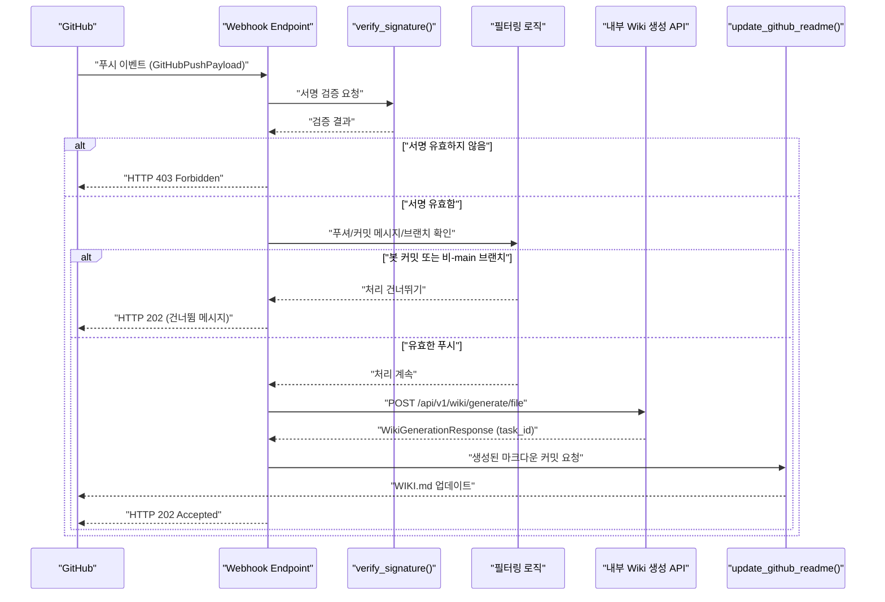
```mermaid
sequenceDiagram
    participant GH as "GitHub"
    participant WH as "Webhook Endpoint"
    participant VS as "verify_signature()"
    participant FL as "필터링 로직"
    participant IGA as "내부 Wiki 생성 API"
    participant UGR as "update_github_readme()"

    GH->>WH: "푸시 이벤트 (GitHubPushPayload)"
    WH->>VS: "서명 검증 요청"
    VS-->>WH: "검증 결과"
    alt "서명 유효하지 않음"
        WH-->>GH: "HTTP 403 Forbidden"
    else "서명 유효함"
        WH->>FL: "푸셔/커밋 메시지/브랜치 확인"
        alt "봇 커밋 또는 비-main 브랜치"
            FL-->>WH: "처리 건너뛰기"
            WH-->>GH: "HTTP 202 (건너뜀 메시지)"
        else "유효한 푸시"
            FL-->>WH: "처리 계속"
            WH->>IGA: "POST /api/v1/wiki/generate/file"
            IGA-->>WH: "WikiGenerationResponse (task_id)"
            WH->>UGR: "생성된 마크다운 커밋 요청"
            UGR-->>GH: "WIKI.md 업데이트"
            WH-->>GH: "HTTP 202 Accepted"
        end
    end
```

## API 데이터 모델

API 요청 및 응답에 사용되는 Pydantic 모델입니다.

### 1. `WikiGenerationRequest`

위키 생성을 요청할 때 사용되는 모델입니다.

| 필드 | 타입 | 설명 |
|---|---|---|
| `repo_owner` | `str` \| `None` | 저장소 소유자 (사용자 또는 조직). |
| `repo_name` | `str` \| `None` | 저장소 이름. |
| `repo_type` | `Literal["github", "gitlab", "bitbucket", "local"]` | 저장소 유형. 기본값: `"github"`. |
| `repo_url` | `str` \| `None` | 원격 저장소를 클론하기 위한 URL. |
| `local_path` | `str` \| `None` | `repo_type`이 `"local"`인 경우 저장소의 로컬 경로. |
| `language` | `str` | 생성될 위키 콘텐츠의 언어. 기본값: `"ko"`. |
| `is_comprehensive_view` | `bool` | 저장소의 포괄적인 뷰를 생성할지 여부. 기본값: `True`. |

**유효성 검사**: `repo_url`에서 `repo_owner`와 `repo_name`을 파싱하는 `model_validator`가 포함되어 있습니다.
Sources: [src/models/api_schema.py](WikiGenerationRequest class)

### 2. `WikiGenerationResponse`

위키 생성 요청에 대한 응답 모델입니다.

| 필드 | 타입 | 설명 |
|---|---|---|
| `message` | `str` | 요청 상태를 나타내는 메시지. |
| `task_id` | `str` | 시작된 백그라운드 작업의 ID. |
| `title` | `str` | 생성된 위키의 제목. |
| `description` | `str` | 생성된 위키의 설명. |

Sources: [src/models/api_schema.py](WikiGenerationResponse class)

### 3. `TaskStatusResponse`

위키 생성 작업의 상태를 조회할 때 사용되는 모델입니다.

| 필드 | 타입 | 설명 |
|---|---|---|
| `task_id` | `str` | 작업의 ID. |
| `status` | `Literal["in_progress", "completed", "failed"]` | 작업의 현재 상태. |
| `result` | `Any` \| `None` | 작업이 완료되거나 실패한 경우의 결과. |

Sources: [src/models/api_schema.py](TaskStatusResponse class)

### 4. `GitHubPushPayload`

GitHub 웹훅 푸시 이벤트의 페이로드를 나타내는 모델입니다. 저장소 정보, 푸셔 정보, 커밋 세부 정보 등을 포함합니다.
Sources: [src/models/github_webhook_schema.py](GitHubPushPayload class)

## 서버 구조 (`src/server.py`)

`src/server.py` 파일은 FastAPI 애플리케이션의 진입점입니다. 로깅을 설정하고, 기본 상태 확인 엔드포인트 (`/`)를 정의하며, `wiki` 및 `webhook` 라우터를 애플리케이션에 포함시킵니다. 이를 통해 모든 API 엔드포인트가 `/api/v1` 접두사 아래에서 접근 가능하게 됩니다.

Sources: [src/server.py](app.include_router calls)

## 결론

"Wiki as Readme" API는 코드 저장소에서 동적으로 위키 문서를 생성하고 관리하기 위한 강력한 인터페이스를 제공합니다. 비동기 처리, GitHub 웹훅 통합, 명확하게 정의된 데이터 모델을 통해 개발자는 문서화 프로세스를 자동화하고 코드베이스와 문서를 동기화 상태로 유지할 수 있습니다.

---

<a name="notion-integration"></a>

<details>
<summary>Relevant source files</summary>

The following files were used as context for generating this wiki page:

- [src/services/notion_converter.py](src/services/notion_converter.py)
- [src/services/notion_sync.py](src/services/notion_sync.py)
- [README.md](README.md)
</details>

# Notion 통합

Notion 통합 기능은 `Wiki As Readme` 프로젝트에서 생성된 위키 콘텐츠를 Notion 데이터베이스 및 페이지로 동기화하는 핵심 서비스입니다. 이 기능을 통해 사용자는 생성된 문서를 Notion에서 쉽게 관리하고 공유할 수 있습니다. 이 문서는 Notion 통합의 아키텍처, 주요 구성 요소 및 작동 방식을 상세히 설명합니다.

## 개요

Notion 통합은 두 가지 주요 구성 요소로 이루어져 있습니다:

1.  **`NotionConverter`**: 마크다운 형식의 콘텐츠를 Notion API가 이해할 수 있는 블록 형식으로 변환합니다.
2.  **`NotionSyncService`**: 변환된 콘텐츠를 Notion API를 통해 실제 Notion 데이터베이스 및 페이지에 동기화하는 역할을 담당합니다.

이 통합은 `Wiki As Readme`가 생성한 포괄적인 문서를 Notion의 유연한 플랫폼으로 확장하여, 사용자가 선호하는 도구에서 문서를 소비하고 관리할 수 있도록 지원합니다.

## NotionSyncService (Notion 동기화 서비스)

`NotionSyncService` 클래스는 위키 콘텐츠를 Notion 데이터베이스에 동기화하는 전체 프로세스를 관리합니다. 이 서비스는 Notion API와 상호 작용하여 데이터베이스 항목을 생성/업데이트하고, 페이지를 만들고, 콘텐츠 블록을 추가합니다.

Sources: [src/services/notion_sync.py](NotionSyncService class)

### 초기화 (`__init__`)

서비스는 Notion API 키와 대상 데이터베이스 ID로 초기화됩니다. `notion-client` 라이브러리가 설치되어 있어야 하며, 필수 환경 변수(`NOTION_API_KEY`, `NOTION_DATABASE_ID`)가 설정되어 있지 않으면 오류가 발생합니다. 데이터베이스 ID는 URL에서 추출될 수 있도록 정규식을 통해 처리됩니다.

Sources: [src/services/notion_sync.py](NotionSyncService.__init__ method)

### 위키 동기화 흐름 (`sync_wiki`)

`sync_wiki` 메서드는 특정 저장소의 전체 위키 구조와 콘텐츠를 Notion에 동기화하는 주 진입점입니다.

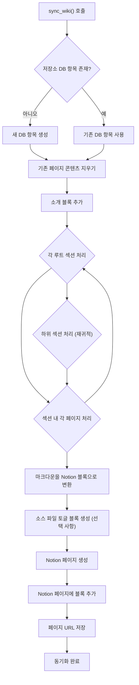
```mermaid
graph TD
    A["sync_wiki() 호출"] --> B{"저장소 DB 항목 존재?"}
    B -- "아니오" --> C["새 DB 항목 생성"]
    B -- "예" --> D["기존 DB 항목 사용"]
    C --> E["기존 페이지 콘텐츠 지우기"]
    D --> E
    E --> F["소개 블록 추가"]
    F --> G{"각 루트 섹션 처리"}
    G --> H{"섹션 내 각 페이지 처리"}
    H --> I["마크다운을 Notion 블록으로 변환"]
    I --> J["소스 파일 토글 블록 생성 (선택 사항)"]
    J --> K["Notion 페이지 생성"]
    K --> L["Notion 페이지에 블록 추가"]
    L --> M["페이지 URL 저장"]
    H --> G
    G --> N{"하위 섹션 처리 (재귀적)"}
    N --> H
    M --> O["동기화 완료"]
```

**주요 단계:**

1.  **저장소 DB 항목 Upsert**: Notion 데이터베이스에서 현재 저장소 이름에 해당하는 항목을 찾거나 새로 생성합니다. 이 항목은 위키의 최상위 컨테이너 역할을 합니다.
    Sources: [src/services/notion_sync.py](_upsert_database_item method)
2.  **기존 콘텐츠 지우기**: 저장소 페이지의 기존 자식 페이지를 보관(archive)하고 모든 블록을 삭제하여 깨끗한 상태로 만듭니다.
    Sources: [src/services/notion_sync.py](_clear_existing_content method)
3.  **소개 블록 추가**: 위키의 제목과 설명을 포함하는 초기 블록을 저장소 페이지에 추가합니다.
4.  **섹션 및 페이지 처리**: 위키 구조(`WikiStructure`)를 순회하며 각 페이지를 Notion 페이지로 변환하고 저장소 페이지 아래에 생성합니다.
    *   `NotionConverter`를 사용하여 마크다운 콘텐츠를 Notion 블록으로 변환합니다.
    *   관련 소스 파일 목록이 있는 경우, 이를 표시하는 토글 블록을 생성하여 페이지 상단에 추가합니다.
    *   모든 페이지는 저장소 페이지 바로 아래에 평면적인 구조로 생성됩니다. 하위 섹션도 동일하게 처리됩니다.
    Sources: [src/services/notion_sync.py](_sync_subsection_flat method)
5.  **결과 URL 반환**: 동기화된 각 위키 페이지의 Notion URL을 맵 형태로 반환합니다.

Sources: [src/services/notion_sync.py](sync_wiki method)

### 핵심 내부 메서드

*   **`_get_title_property_name()`**: Notion 데이터베이스 스키마에서 제목 속성의 실제 이름을 동적으로 가져옵니다. 이는 데이터베이스마다 제목 속성 이름이 다를 수 있기 때문에 유연성을 제공합니다.
    Sources: [src/services/notion_sync.py](_get_title_property_name method)
*   **`_upsert_database_item(repo_name: str)`**: Notion 데이터베이스에서 `repo_name`과 일치하는 페이지를 쿼리하고, 존재하면 해당 ID를 반환하고, 없으면 새 페이지를 생성합니다.
    Sources: [src/services/notion_sync.py](_upsert_database_item method)
*   **`_clear_existing_content(page_id: str)`**: 주어진 Notion 페이지의 모든 자식 블록을 삭제하고, 자식 페이지가 있다면 보관 처리(archive)합니다.
    Sources: [src/services/notion_sync.py](_clear_existing_content method)
*   **`_create_page(parent_id: str, title: str)`**: 지정된 부모 페이지 아래에 새 Notion 페이지를 생성하고 해당 ID를 반환합니다.
    Sources: [src/services/notion_sync.py](_create_page method)
*   **`_append_blocks_safe(page_id: str, blocks: list[dict[str, Any]])`**: Notion 페이지에 블록 목록을 추가합니다. Notion API의 페이로드 크기 제한(413 Payload Too Large)을 처리하기 위해 배치 크기를 동적으로 줄여가며 재시도하는 로직이 포함되어 있습니다.
    Sources: [src/services/notion_sync.py](_append_blocks_safe method)
*   **`_create_source_files_block(file_paths: list[str])`**: 관련 소스 파일 목록을 표시하는 Notion 토글 블록을 생성합니다.
    Sources: [src/services/notion_sync.py](_create_source_files_block method)

## NotionConverter (마크다운-노션 블록 변환기)

`NotionConverter` 클래스는 마크다운 형식의 텍스트를 Notion API가 요구하는 JSON 기반의 블록 구조로 변환하는 역할을 합니다. 이는 `NotionSyncService`가 Notion에 콘텐츠를 게시하기 전에 필수적인 전처리 단계입니다.

Sources: [src/services/notion_converter.py](NotionConverter class)

### 마크다운을 블록으로 변환 (`markdown_to_blocks`)

이 정적 메서드는 마크다운 문자열을 받아 Notion 블록 객체의 리스트로 변환합니다. 라인별로 마크다운 구문을 파싱하여 해당 Notion 블록 유형으로 매핑합니다.

**지원되는 마크다운 요소:**

*   **구분선**: `---`, `***`, `___`
*   **테이블**: 표준 마크다운 테이블 구문
*   **코드 블록**: ```` ```language ````
*   **세부 정보/토글 블록**: `<details><summary>...</summary>...</details>` HTML 태그
*   **제목**: `#`, `##`, `###`
*   **번호 매기기 목록**: `1. `
*   **글머리 기호 목록**: `- `, `* `
*   **일반 단락**
*   **앵커 태그**: `<a name="...">` (무시됨)

Sources: [src/services/notion_converter.py](markdown_to_blocks method)

### 핵심 내부 메서드 (파싱 로직)

*   **`_parse_table_block(lines: list[str], start: int)`**: 마크다운 테이블을 Notion 테이블 블록으로 파싱합니다. Notion 테이블은 헤더를 필수로 요구합니다.
    Sources: [src/services/notion_converter.py](_parse_table_block method)
*   **`_parse_code_block(lines: list[str], start: int)`**: 마크다운 코드 블록을 Notion 코드 블록으로 변환합니다.
    *   언어를 자동으로 감지하고 Notion이 지원하는 언어로 매핑합니다.
    *   Notion 블록의 텍스트 길이 제한(2000자)을 초과하는 긴 코드 블록은 여러 개의 Notion 코드 블록으로 분할하여 처리합니다.
    Sources: [src/services/notion_converter.py](_parse_code_block method)
*   **`_parse_details_block(lines: list[str], start: int)`**: HTML `<details>` 태그를 Notion 토글 블록으로 변환합니다. `<summary>` 태그의 내용을 토글 제목으로 사용하고, 내부 콘텐츠는 재귀적으로 `markdown_to_blocks`를 호출하여 자식 블록으로 변환합니다.
    Sources: [src/services/notion_converter.py](_parse_details_block method)
*   **`_parse_rich_text(text: str)`**: 텍스트 내의 인라인 마크다운 서식(굵게 `**`, 기울임 `*`, 인라인 코드 `` ` `` , 링크 `[text](url)`)을 Notion의 `rich_text` 형식으로 변환합니다.
    *   링크의 경우 `www.`로 시작하는 URL에 `https://`를 자동으로 추가하여 유효한 URL로 만듭니다.
    *   유효하지 않은 URL(예: 상대 경로, 앵커)은 일반 텍스트로 렌더링됩니다.
    Sources: [src/services/notion_converter.py](_parse_rich_text method)
*   **`MAX_TEXT_LENGTH`**: Notion API의 단일 텍스트 블록에 대한 최대 문자열 길이(2000자)를 정의합니다. 이는 특히 코드 블록을 분할하는 데 사용됩니다.
    Sources: [src/services/notion_converter.py](MAX_TEXT_LENGTH constant)

## 통합 흐름

`NotionSyncService`와 `NotionConverter`는 다음과 같이 협력하여 위키 콘텐츠를 Notion으로 동기화합니다.

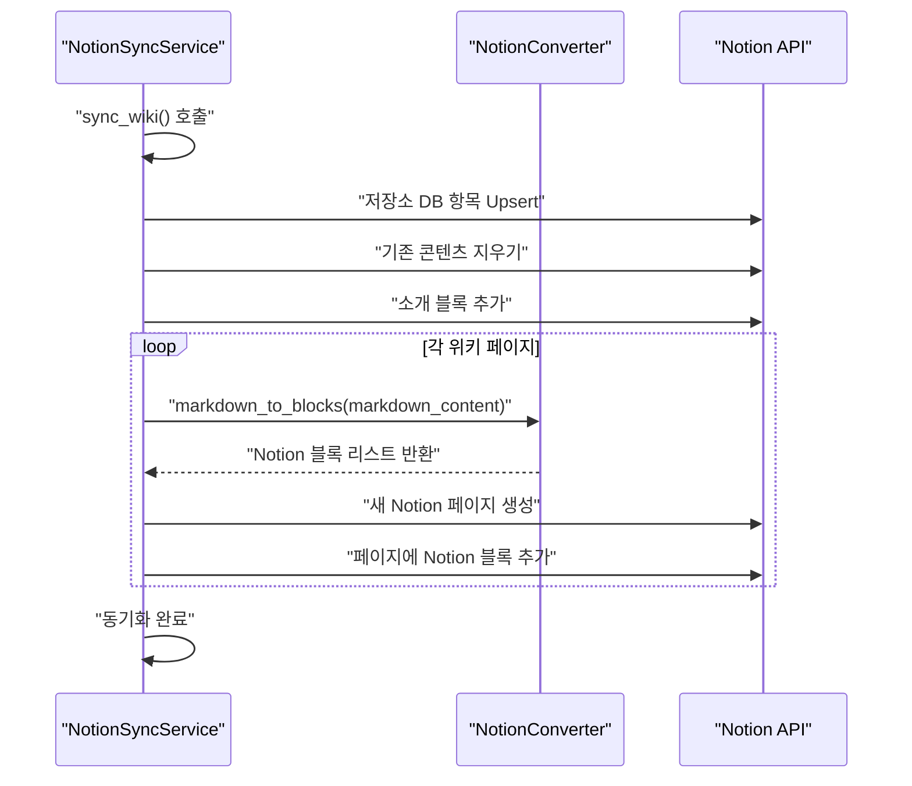
```mermaid
sequenceDiagram
    participant S as "NotionSyncService"
    participant C as "NotionConverter"
    participant N as "Notion API"

    S->>S: "sync_wiki() 호출"
    S->>N: "저장소 DB 항목 Upsert"
    S->>N: "기존 콘텐츠 지우기"
    S->>N: "소개 블록 추가"
    loop 각 위키 페이지
        S->>C: "markdown_to_blocks(markdown_content)"
        C-->>S: "Notion 블록 리스트 반환"
        S->>N: "새 Notion 페이지 생성"
        S->>N: "페이지에 Notion 블록 추가"
    end
    S->>S: "동기화 완료"
```

1.  `NotionSyncService`의 `sync_wiki` 메서드가 호출되어 동기화 프로세스를 시작합니다.
2.  `NotionSyncService`는 Notion API와 직접 통신하여 데이터베이스 항목을 관리하고 페이지를 생성합니다.
3.  각 위키 페이지의 마크다운 콘텐츠를 Notion에 추가하기 전에, `NotionSyncService`는 `NotionConverter`의 `markdown_to_blocks` 메서드를 호출하여 마크다운을 Notion API가 이해할 수 있는 블록 구조로 변환합니다.
4.  변환된 블록 리스트를 받은 `NotionSyncService`는 이를 Notion API를 통해 새로 생성된 Notion 페이지에 추가합니다.

## 설정

Notion 통합을 사용하려면 다음 환경 변수가 필요합니다. 이들은 `.env` 파일 또는 GitHub Actions 비밀 변수로 설정할 수 있습니다.

Sources: [README.md](Configuration Reference section)

| 변수 | 설명 | 예시 |
|---|---|---|
| `NOTION_SYNC_ENABLED` | 생성 후 Notion으로 동기화할지 여부 | `true` |
| `NOTION_API_KEY` | Notion 통합 토큰 | `secret_...` |
| `NOTION_DATABASE_ID` | 대상 Notion 데이터베이스 ID | `abc123...` |

## 결론

Notion 통합 기능은 `Wiki As Readme` 프로젝트의 핵심 확장 기능으로, 생성된 기술 문서를 Notion의 강력한 문서 관리 플랫폼으로 원활하게 가져올 수 있도록 합니다. `NotionConverter`의 정교한 마크다운 파싱과 `NotionSyncService`의 견고한 동기화 로직을 통해, 사용자는 코드베이스에서 직접 생성된 최신 문서를 Notion에서 편리하게 접근하고 활용할 수 있습니다.

---

<a name="contributing-guidelines"></a>

<details>
<summary>Relevant source files</summary>

The following files were used as context for generating this wiki page:

- [LICENSE](LICENSE)
- [NOTICE.md](NOTICE.md)
- [.pre-commit-config.yaml](.pre-commit-config.yaml)
- [.github/scripts/sync_version.py](.github/scripts/sync_version.py)
- [.github/workflows/version-sync.yml](.github/workflows/version-sync.yml)
</details>

# 기여 가이드라인

이 문서는 프로젝트에 기여하고자 하는 개발자를 위한 가이드라인을 제공합니다. 프로젝트의 라이선스, 코드 품질 유지 방법, 그리고 버전 관리 자동화 프로세스에 대한 정보를 포함합니다. 이 가이드라인을 준수함으로써 프로젝트의 일관성과 품질을 유지하고, 모든 기여자가 원활하게 협업할 수 있도록 돕습니다.

## 1. 라이선스 및 저작권 고지

본 프로젝트는 MIT 라이선스 하에 배포됩니다. 이는 누구나 자유롭게 소프트웨어를 사용, 수정, 배포할 수 있음을 의미합니다. 기여자는 자신의 코드가 이 라이선스 조건에 따라 배포될 것임을 이해하고 동의해야 합니다.

*   **MIT 라이선스:**
    *   소프트웨어의 사용, 복사, 수정, 병합, 게시, 배포, 서브라이선스, 판매를 허용합니다.
    *   모든 복사본 또는 상당 부분에 저작권 고지 및 이 허가 고지가 포함되어야 합니다.
    *   소프트웨어는 "있는 그대로" 제공되며, 어떠한 보증도 제공하지 않습니다.
    *   자세한 내용은 [LICENSE](LICENSE) 파일을 참조하십시오.

*   **저작권 고지:**
    *   본 프로젝트에는 Deepwiki-open 프로젝트(https://github.com/AsyncFuncAI/deepwiki-open)에서 파생된 코드가 포함되어 있습니다.
    *   원래 저장소: AsyncFuncAI/deepwiki-open
    *   저작권: Copyright (c) 2024 Sheing Ng
    *   라이선스: MIT License
    *   자세한 내용은 [NOTICE.md](NOTICE.md) 파일을 참조하십시오.

## 2. 코드 품질 및 서식

프로젝트의 코드 품질과 일관성을 유지하기 위해 `pre-commit` 훅과 `ruff`를 사용합니다. 기여자는 커밋하기 전에 이 도구들이 실행되도록 설정하는 것이 좋습니다.

### 2.1. Pre-commit 훅 설정

`pre-commit`은 커밋하기 전에 특정 스크립트를 자동으로 실행하여 코드 품질 검사 및 서식 지정을 수행하는 프레임워크입니다.

*   **설정 파일:** `.pre-commit-config.yaml`
*   **사용 도구:** `ruff`
    *   `ruff`: Python 코드의 린팅(linting)을 수행하여 잠재적인 오류나 스타일 문제를 감지합니다. `--fix` 인자를 사용하여 자동으로 수정 가능한 문제를 해결합니다.
    *   `ruff-format`: Python 코드의 서식을 지정하여 일관된 코드 스타일을 유지합니다.

```yaml
# .pre-commit-config.yaml
repos:
  - repo: https://github.com/astral-sh/ruff-pre-commit
    rev: v0.11.13
    hooks:
      - id: ruff
        args: [--fix]
      - id: ruff-format
```
Sources: [.pre-commit-config.yaml](.pre-commit-config.yaml)

**설정 방법:**
1.  `pre-commit`을 설치합니다: `pip install pre-commit`
2.  프로젝트 루트 디렉토리에서 `pre-commit install` 명령어를 실행하여 Git 훅을 활성화합니다.
이제 커밋할 때마다 `ruff`가 자동으로 실행되어 코드 스타일을 검사하고 수정합니다.

## 3. 버전 동기화 자동화

프로젝트의 버전 정보는 `pyproject.toml` 파일에서 관리되며, 이 정보는 `src/server.py` 및 여러 `Dockerfile`에 자동으로 동기화됩니다. 이 과정은 GitHub Actions 워크플로우를 통해 자동화되어 있습니다.

### 3.1. 버전 동기화 워크플로우 (`version-sync.yml`)

`version-sync.yml` 워크플로우는 `pyproject.toml` 파일의 변경 사항을 감지하여 프로젝트의 여러 구성 요소에 버전 정보를 자동으로 업데이트하고 커밋합니다.

*   **워크플로우 이름:** Version Sync
*   **트리거:**
    *   `develop` 브랜치에 `pyproject.toml` 파일이 변경되어 푸시될 때.
    *   수동으로 `workflow_dispatch`를 통해 실행될 때.
*   **권한:** `contents: write` (파일을 수정하고 푸시하기 위함)

#### 3.1.1. 워크플로우 단계

1.  **Checkout code:** 저장소 코드를 체크아웃합니다.
2.  **Set up Python:** Python 3.12 환경을 설정합니다.
3.  **Sync versions:** `sync_version.py` 스크립트를 실행하여 버전 동기화를 수행합니다.
4.  **Check for changes:** `git diff --exit-code`를 사용하여 스크립트 실행 후 변경 사항이 있는지 확인합니다. 변경 사항이 있으면 `changes=true`를 출력합니다.
5.  **Commit and push changes:** 이전 단계에서 변경 사항이 감지된 경우에만 실행됩니다.
    *   `github-actions[bot]` 사용자로 Git 설정을 구성합니다.
    *   `pyproject.toml`에서 현재 버전을 추출합니다.
    *   `src/server.py`, `Dockerfile`, `Dockerfile.action`, `Dockerfile.server` 파일을 스테이징합니다.
    *   `chore: sync version to <VERSION>` 형식의 커밋 메시지로 변경 사항을 커밋합니다.
    *   변경 사항을 `develop` 브랜치로 푸시합니다.

Sources: [.github/workflows/version-sync.yml](.github/workflows/version-sync.yml)

#### 3.1.2. 버전 동기화 워크플로우 흐름

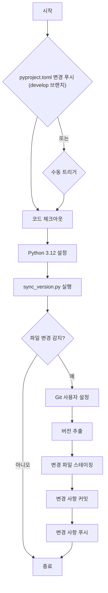
```mermaid
graph TD
    A["시작"] --> B{"pyproject.toml 변경 푸시 (develop 브랜치)"};
    B -- 또는 --> C{"수동 트리거"};
    B --> D["코드 체크아웃"];
    C --> D;
    D --> E["Python 3.12 설정"];
    E --> F["sync_version.py 실행"];
    F --> G{"파일 변경 감지?"};
    G -- "아니오" --> H["종료"];
    G -- "예" --> I["Git 사용자 설정"];
    I --> J["버전 추출"];
    J --> K["변경 파일 스테이징"];
    K --> L["변경 사항 커밋"];
    L --> M["변경 사항 푸시"];
    M --> H;
```

### 3.2. 버전 동기화 스크립트 (`sync_version.py`)

`sync_version.py` 스크립트는 `pyproject.toml`에서 버전을 읽어와 `src/server.py` 및 다양한 `Dockerfile`에 업데이트하는 역할을 합니다.

*   **`get_version()`:** `pyproject.toml` 파일에서 `project.version` 값을 읽어옵니다.
*   **`update_server_py(version)`:** `src/server.py` 파일 내의 FastAPI 앱 인스턴스에서 `version="x.y.z"` 패턴을 찾아 주어진 `version`으로 업데이트합니다.
*   **`update_dockerfile(path_str, version)`:** 지정된 `Dockerfile` 경로에서 `LABEL org.opencontainers.image.version="x.y.z"` 패턴을 찾아 주어진 `version`으로 업데이트합니다. `Dockerfile`, `Dockerfile.action`, `Dockerfile.server` 파일에 대해 실행됩니다.
*   **`main()`:** 위 함수들을 호출하여 전체 버전 동기화 프로세스를 실행합니다.

Sources: [.github/scripts/sync_version.py](.github/scripts/sync_version.py)

#### 3.2.1. `sync_version.py` 스크립트 로직 흐름

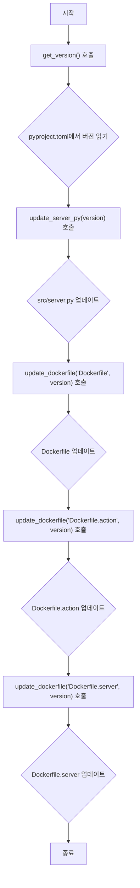
```mermaid
graph TD
    A["시작"] --> B["get_version() 호출"];
    B --> C{"pyproject.toml에서 버전 읽기"};
    C --> D["update_server_py(version) 호출"];
    D --> E{"src/server.py 업데이트"};
    E --> F["update_dockerfile('Dockerfile', version) 호출"];
    F --> G{"Dockerfile 업데이트"};
    G --> H["update_dockerfile('Dockerfile.action', version) 호출"];
    H --> I{"Dockerfile.action 업데이트"};
    I --> J["update_dockerfile('Dockerfile.server', version) 호출"];
    J --> K{"Dockerfile.server 업데이트"};
    K --> L["종료"];
```

## 4. 결론

이 문서는 프로젝트에 기여하기 위한 필수적인 가이드라인을 제공합니다. MIT 라이선스 준수, `pre-commit` 훅을 통한 코드 품질 유지, 그리고 자동화된 버전 동기화 프로세스 이해는 모든 기여자가 프로젝트의 표준을 따르고 효율적으로 협업하는 데 중요합니다. 이 가이드라인을 숙지하고 준수함으로써 프로젝트의 지속적인 성장과 안정성에 기여할 수 있습니다.

---
