# Wiki As Readme Documentation

Comprehensive documentation for Wiki As Readme, a flexible AI documentation tool that transforms codebases into wikis.

## Table of Contents

- [What is Wiki As Readme?](#what-is-wiki-as-readme)
- [Key Features](#key-features)
- [Universal Compatibility](#universal-compatibility)
- [Using the GitHub Action](#using-the-github-action)
- [Local Deployment (Docker & Python)](#local-deployment-(docker-&-python))
- [Server Deployment & Webhooks](#server-deployment-&-webhooks)
- [Configuration Reference](#configuration-reference)
- [API Endpoints](#api-endpoints)
- [System Architecture](#system-architecture)
- [Contribution Guide](#contribution-guide)

---

<a name="what-is-wiki-as-readme"></a>

<details>
<summary>Relevant source files</summary>

The following files were used as context for generating this wiki page:

- [README.md](README.md)
- [action.yml](action.yml)
- [WIKI-AS-README-AS-ACTION.yml](WIKI-AS-README-AS-ACTION.yml)
</details>

# What is Wiki As Readme?

**Wiki As Readme** is a versatile AI-powered documentation tool designed to transform a codebase into a comprehensive wiki or `README.md` file rapidly. It emphasizes flexibility, supporting various Large Language Models (LLMs), Git platforms, and deployment environments. The core mission is to provide a "drop-in" solution for automated, high-quality technical documentation. Sources: [README.md](Introduction)

The tool is built to be truly pluggable, allowing users to choose how and where it runs, and which LLM powers its generation capabilities. It aims to simplify the documentation process by automating the creation of detailed, structured, and visually enhanced content directly from source code. Sources: [README.md](Introduction)

## Core Capabilities and Features

Wiki As Readme offers a suite of features designed to produce rich and accurate documentation:

*   **Deep Context Analysis:** The tool analyzes the project's file structure and inter-file relationships to build a comprehensive understanding of the software architecture before generating content. Sources: [README.md](Core Features)
*   **Smart Structure Generation:** It automatically determines a logical hierarchy for the documentation, organizing content into sections and pages for optimal readability and navigation. Sources: [README.md](Core Features)
*   **Comprehensive Content:** Generated pages include detailed explanations such as architecture overviews, installation guides, and API references, ensuring thorough coverage of the project. Sources: [README.md](Core Features)
*   **Automatic Diagrams:** To enhance understanding, Wiki As Readme generates Mermaid.js diagrams (Flowcharts, Sequence diagrams, Class diagrams) to visualize complex architectural components and flows. Sources: [README.md](Core Features)
*   **Hybrid Output:** It can produce both individual Markdown files suitable for a wiki and a single, consolidated `README.md` file, catering to different documentation needs. Sources: [README.md](Core Features)
*   **Async & Scalable:** Built with FastAPI and AsyncIO, the system is designed for non-blocking, efficient generation, capable of handling large documentation tasks. Sources: [README.md](Core Features)

## Universal Compatibility

A cornerstone of Wiki As Readme is its universal compatibility, making it adaptable to almost any development stack.

### Model Agnostic (Powered by LiteLLM)

The tool integrates with LiteLLM, providing a unified interface to over 100 LLMs, ensuring broad model support:
*   **Commercial APIs:** Supports leading commercial LLM providers like Google Vertex AI (Gemini), OpenAI (GPT-4), Anthropic (Claude), and xAI (Grok). Sources: [README.md](Model Agnostic)
*   **Open/Local Models:** Compatible with open-source and locally runnable models via platforms like Ollama, OpenRouter, and HuggingFace. Sources: [README.md](Model Agnostic)
*   **On-Premise:** Can securely connect to private, on-premise LLM endpoints. Sources: [README.md](Model Agnostic)

### Platform Agnostic

Wiki As Readme works seamlessly across various code hosting and development environments:
*   **Cloud Repositories:** Full integration with popular Git platforms such as GitHub, GitLab, and Bitbucket. Sources: [README.md](Platform Agnostic)
*   **Local Development:** Capable of analyzing code directly from a local file system, eliminating the need to push changes to a remote repository. Sources: [README.md](Platform Agnostic)
*   **Private/Enterprise:** Offers full support for private instances and self-hosted Git servers, catering to enterprise environments. Sources: [README.md](Platform Agnostic)

### Deployment Agnostic

The tool can be deployed and utilized in multiple ways to fit different workflows:
*   **CI/CD Integration:** Easily integrated into CI/CD pipelines, such as GitHub Actions, for automated documentation updates. Sources: [README.md](Deployment Agnostic)
*   **Containerization:** Can be run via Docker Compose for isolated and reproducible local execution. Sources: [README.md](Deployment Agnostic)
*   **Service Deployment:** Deployable as a long-running API server with Webhook support for continuous integration. Sources: [README.md](Deployment Agnostic)
*   **CLI:** Can be run as a command-line tool for local, on-demand documentation generation during development. Sources: [README.md](Deployment Agnostic)

## Usage Modes

Wiki As Readme supports several usage modes to accommodate different user preferences and integration requirements.

### 1. GitHub Action (Recommended)

This mode automates documentation updates within a CI/CD pipeline.
*   **Automation:** Configured via a `.github/workflows/update-wiki.yml` file, it can automatically update a `WIKI.md` file on `push` events. Sources: [README.md](GitHub Action), [WIKI-AS-README-AS-ACTION.yml](Workflow Trigger)
*   **Manual Trigger:** Workflows can be manually triggered from the GitHub Actions tab, allowing for on-the-fly customization of language, LLM provider, model, Notion sync, and commit method. Sources: [README.md](GitHub Action), [WIKI-AS-README-AS-ACTION.yml](workflow_dispatch inputs)
*   **Notion Sync:** Optionally synchronizes generated content to a specified Notion Database. Sources: [README.md](GitHub Action), [WIKI-AS-README-AS-ACTION.yml](NOTION_SYNC_ENABLED)
*   **Commit Methods:** Users can choose to directly push changes to a branch or open a Pull Request for review. Sources: [README.md](GitHub Action), [WIKI-AS-README-AS-ACTION.yml](commit_method)

### 2. Docker Compose (Local)

For local execution with a UI, Docker Compose provides an easy setup:
*   **Configuration:** Requires setting API keys and other parameters in a `.env` file. Sources: [README.md](Docker Compose)
*   **Execution:** Run with `docker-compose up --build`. Sources: [README.md](Docker Compose)
*   **Access:** Provides a Web UI (Streamlit) at `http://localhost:8501` and API Docs (FastAPI Swagger) at `http://localhost:8000/docs`. Sources: [README.md](Docker Compose)

### 3. Local Python Development

For developers who wish to modify the source code or run without Docker:
*   **Prerequisites:** Python 3.12+ and `uv` package manager. Sources: [README.md](Local Python Development)
*   **Setup:** Clone the repository, install dependencies using `uv sync`, and activate the virtual environment. Sources: [README.md](Local Python Development)
*   **Execution:** Run the backend with `uv run uvicorn src.server:app` and the frontend with `uv run streamlit run src/app.py`. Sources: [README.md](Local Python Development)

### 4. Server & Webhooks

The API server can be deployed as a long-running service:
*   **Endpoint:** `POST /api/v1/webhook/github` handles standard GitHub push event payloads. Sources: [README.md](Server & Webhooks)
*   **Behavior:** Triggers a background task to generate the wiki for the repository and commits it back, requiring a `GIT_API_TOKEN`. Sources: [README.md](Server & Webhooks)

## Configuration Reference

Configuration is managed via environment variables, typically set in a `.env` file or directly in the deployment environment.

| Category | Variable | Description | Example |
|---|---|---|---|
| **LLM Provider** | `LLM_PROVIDER` | Specifies the LLM service to use | `google` |
| | `MODEL_NAME` | The specific model identifier | `gemini-2.5-flash` |
| | `LLM_BASE_URL` | Custom base URL for LLM API (e.g., Ollama) | `http://localhost:11434/v1` |
| **Auth** | `OPENAI_API_KEY` | API Key for OpenAI | `sk-...` |
| | `ANTHROPIC_API_KEY` | API Key for Anthropic | `sk-ant...` |
| | `GCP_PROJECT_NAME` | Vertex AI Project ID | `my-genai-project` |
| **Notion Sync** | `NOTION_SYNC_ENABLED` | Enables/disables Notion synchronization | `true` |
| | `NOTION_API_KEY` | Notion Integration Token | `secret_...` |
| | `NOTION_DATABASE_ID` | Target Notion Database ID | `abc123...` |
| **Paths** | `WIKI_OUTPUT_PATH` | Path to save the generated wiki | `./output/WIKI.md` |
| | `LOCAL_REPO_PATH` | Local repository path for Docker mounts | `/Users/me/project` |
| **Advanced** | `USE_STRUCTURED_OUTPUT` | Use native JSON mode for LLM | `true` |
| | `IGNORED_PATTERNS` | JSON array of glob patterns to exclude | `'["*.log", "node_modules/*"]'` |
Sources: [README.md](Configuration Reference)

## API Reference

The backend API is built with FastAPI, offering interactive Swagger documentation at `http://localhost:8000/docs` when running.

### Wiki Generation Endpoints

*   **`POST /api/v1/wiki/generate/file`**: Initiates a background task to generate the wiki and save it as a Markdown file on the server. Sources: [README.md](API Reference)
*   **`POST /api/v1/wiki/generate/text`**: Starts a background task to generate the wiki, storing the resulting text within the task status. Sources: [README.md](API Reference)
*   **`GET /api/v1/wiki/status/{task_id}`**: Retrieves the current status and the final result of a specific generation task. Sources: [README.md](API Reference)

### Webhook Endpoints

*   **`POST /api/v1/webhook/github`**: An endpoint designed to receive GitHub Webhook push events, triggering automatic wiki generation for the affected repository. Sources: [README.md](API Reference)

## Architecture Overview

Wiki As Readme employs a modern, asynchronous architecture to ensure scalability and responsiveness.

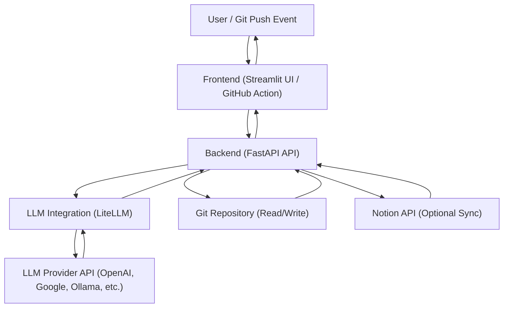
```mermaid
graph TD
    A["User / Git Push Event"] --> B["Frontend (Streamlit UI / GitHub Action)"]
    B --> C["Backend (FastAPI API)"]
    C --> D["LLM Integration (LiteLLM)"]
    D --> E["LLM Provider API (OpenAI, Google, Ollama, etc.)"]
    E --> D
    D --> C
    C --> F["Git Repository (Read/Write)"]
    C --> G["Notion API (Optional Sync)"]
    F --> C
    G --> C
    C --> B
    B --> A
```
Sources: [README.md](Architecture)

*   **Frontend:** [Streamlit](https://streamlit.io/) provides the interactive user interface for local Docker and Python development modes. Sources: [README.md](Architecture)
*   **Backend:** [FastAPI](https://fastapi.tiangolo.com/) powers the REST API, handles background tasks, and orchestrates the wiki generation process. Sources: [README.md](Architecture)
*   **LLM Integration:** [LiteLLM](https://docs.litellm.ai/) serves as a unified interface, abstracting away the complexities of interacting with over 100 different LLMs. Sources: [README.md](Architecture)
*   **Data Models:** [Pydantic](https://docs.pydantic.dev/) is used for type safety and validation of structured outputs, ensuring data integrity. Sources: [README.md](Architecture)
*   **Diagrams:** [Mermaid.js](https://mermaid.js.org/) is utilized for generating various architectural diagrams within the documentation. Sources: [README.md](Architecture)

## GitHub Action Workflow Details

The GitHub Action (`action.yml`) defines the inputs and environment variables for the Docker container that performs the wiki generation. The workflow file (`WIKI-AS-README-AS-ACTION.yml`) orchestrates the steps within a GitHub Actions job.

### `action.yml` Inputs

The `action.yml` file specifies the configurable parameters for the GitHub Action:

| Input Name | Description | Default |
|---|---|---|
| `language` | Language for generated content | `en` |
| `wiki_output_path` | File path to save the wiki | `WIKI.md` |
| `llm_provider` | LLM provider to use | `google` |
| `model_name` | Specific LLM model name | `gemini-2.5-flash` |
| `openai_api_key` | OpenAI API Key | |
| `anthropic_api_key` | Anthropic API Key | |
| `git_api_token` | GitHub/GitLab API Token | |
| `gcp_project_name` | GCP Project Name | |
| `google_application_credentials` | GCP Service Account JSON Key | |
| `llm_base_url` | Custom base URL for LLM API | |
| `use_structured_output` | Use structured JSON output | `true` |
| `temperature` | LLM temperature (0.0 to 1.0) | `0.0` |
| `max_retries` | Max retry attempts for LLM calls | `3` |
| `max_concurrency` | Max parallel LLM calls | `5` |
| `ignored_patterns` | JSON array of glob patterns to ignore | `[]` |
Sources: [action.yml](inputs)

### Workflow Execution Flow (`WIKI-AS-README-AS-ACTION.yml`)

The following sequence diagram illustrates the typical execution flow of the Wiki-As-Readme GitHub Action:

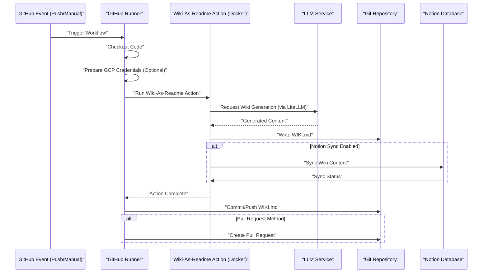
```mermaid
sequenceDiagram
    participant GH_Event as "GitHub Event (Push/Manual)"
    participant GH_Runner as "GitHub Runner"
    participant WikiAction as "Wiki-As-Readme Action (Docker)"
    participant LLM_Service as "LLM Service"
    participant Git_Repo as "Git Repository"
    participant Notion_DB as "Notion Database"

    GH_Event->>GH_Runner: "Trigger Workflow"
    GH_Runner->>GH_Runner: "Checkout Code"
    GH_Runner->>GH_Runner: "Prepare GCP Credentials (Optional)"
    GH_Runner->>WikiAction: "Run Wiki-As-Readme Action"
    WikiAction->>LLM_Service: "Request Wiki Generation (via LiteLLM)"
    LLM_Service-->>WikiAction: "Generated Content"
    WikiAction->>Git_Repo: "Write WIKI.md"
    alt Notion Sync Enabled
        WikiAction->>Notion_DB: "Sync Wiki Content"
        Notion_DB-->>WikiAction: "Sync Status"
    end
    WikiAction-->>GH_Runner: "Action Complete"
    GH_Runner->>Git_Repo: "Commit/Push WIKI.md"
    alt Pull Request Method
        GH_Runner->>Git_Repo: "Create Pull Request"
    end
```
Sources: [WIKI-AS-README-AS-ACTION.yml](jobs.wiki-time.steps)

## Conclusion

Wiki As Readme stands as a powerful, flexible, and highly compatible solution for automated technical documentation. By leveraging AI and integrating seamlessly into various development workflows, it significantly reduces the manual effort required to maintain up-to-date and comprehensive project wikis and READMEs, adapting to virtually any technical stack.

---

<a name="key-features"></a>

<details>
<summary>Relevant source files</summary>

The following files were used as context for generating this wiki page:

- [README.md](README.md)
- [src/services/structure_analyzer.py](src/services/structure_analyzer.py)
- [src/services/wiki_generator.py](src/services/wiki_generator.py)
- [src/prompts/wiki_structure_generator.yaml](src/prompts/wiki_structure_generator.yaml)
- [src/prompts/wiki_contents_generator.yaml](src/prompts/wiki_contents_generator.yaml)
</details>

# Key Features

Wiki As Readme is a versatile AI-powered documentation tool designed to transform codebases into comprehensive wikis. It stands out for its adaptability across various models, platforms, and deployment environments, coupled with intelligent content generation capabilities. This page details the core features that enable its powerful and flexible documentation workflow.

## 1. Universal Compatibility

Wiki As Readme is engineered for maximum flexibility, allowing users to integrate it seamlessly into diverse development stacks and workflows.

### 1.1. Model Agnostic (Powered by LiteLLM)
The tool supports a wide array of Large Language Models (LLMs), ensuring users can leverage their preferred or available AI backend. This is facilitated by `LiteLLM`, which provides a unified interface.
*   **Commercial APIs:** Integration with major providers like Google Vertex AI (Gemini), OpenAI (GPT-4), Anthropic (Claude), and xAI (Grok).
*   **Open/Local Models:** Support for local models via **Ollama**, as well as OpenRouter and HuggingFace.
*   **On-Premise:** Capability to connect securely to private, self-hosted LLM endpoints.

**Implementation Detail:** The `LLMWikiMaker` class, utilized within `src/services/structure_analyzer.py`, abstracts the LLM interaction, allowing the system to switch between different providers configured via environment variables (`LLM_PROVIDER`, `MODEL_NAME`).
Sources: [README.md](Model Agnostic), [src/services/structure_analyzer.py](LLMWikiMaker)

### 1.2. Platform Agnostic
Wiki As Readme can analyze code from various sources, making it adaptable to different repository hosting solutions.
*   **Cloud Repos:** Seamless integration with **GitHub**, **GitLab**, and **Bitbucket**.
*   **Local Development:** Ability to analyze code directly from the local file system, ideal for pre-commit documentation generation.
*   **Private/Enterprise:** Full support for private instances and self-hosted Git servers.

**Implementation Detail:** The `RepositoryFetcher` service, used in both `src/services/structure_analyzer.py` and `src/services/wiki_generator.py`, handles fetching repository content from different sources (local, GitHub, etc.) based on the `repo_type` specified in the `WikiGenerationRequest`.
Sources: [README.md](Platform Agnostic), [src/services/repo_fetcher.py](RepositoryFetcher)

### 1.3. Deployment Agnostic
The tool offers multiple deployment options to fit various operational needs, from automated CI/CD pipelines to local development.
*   **CI/CD:** Can be integrated as a GitHub Action for automated documentation updates.
*   **Container:** Deployable via Docker Compose for isolated and reproducible environments.
*   **Service:** Can run as a long-running API server with Webhook support for real-time updates.
*   **CLI:** Usable as a command-line tool for local, on-demand generation.
Sources: [README.md](Deployment Agnostic), [README.md](Usage Modes)

## 2. Core Generation Features

The heart of Wiki As Readme lies in its intelligent content generation pipeline, leveraging LLMs to produce structured, comprehensive, and visually rich documentation.

### 2.1. Deep Context Analysis
Before generating any content, the system performs a thorough analysis of the project's structure and existing documentation. This ensures the generated wiki is contextually relevant and accurate.
*   Analyzes the file tree and relationships between files.
*   Incorporates the project's `README.md` for initial understanding.

**Implementation Detail:** The `WikiStructureDeterminer` in `src/services/structure_analyzer.py` takes the `file_tree` and `readme` as input when calling the LLM for structure generation. The `src/prompts/wiki_structure_generator.yaml` prompt explicitly instructs the LLM to use these inputs for context.
Sources: [README.md](Deep Context Analysis), [src/services/structure_analyzer.py](determine_wiki_structure function), [src/prompts/wiki_structure_generator.yaml](template)

### 2.2. Smart Structure Generation
The tool automatically determines a logical hierarchy for the documentation, organizing content into sections and pages.
*   Automatically creates a `WikiStructure` object, including `WikiSection` and `WikiPage` definitions.
*   Assigns relevant file paths to each generated page.

**Implementation Detail:** The `determine_wiki_structure` method in `src/services/structure_analyzer.py` is responsible for this. It invokes the LLM with the prompt defined in `src/prompts/wiki_structure_generator.yaml`, which guides the LLM to output a JSON object conforming to the `WikiStructure` Pydantic model.
Sources: [README.md](Smart Structure Generation), [src/services/structure_analyzer.py](determine_wiki_structure function), [src/prompts/wiki_structure_generator.yaml](template)

### 2.3. Comprehensive Content Generation
For each page identified in the structure, detailed content is generated, covering various aspects of the codebase.
*   Includes architecture overviews, installation guides, and API references.
*   Generates content based *solely* on the provided relevant source files.

**Implementation Detail:** The `generate_page_content` method in `src/services/structure_analyzer.py` fetches the content of files specified for a `WikiPage` and then uses the `src/prompts/wiki_contents_generator.yaml` prompt to instruct the LLM to write the page content in Markdown.
Sources: [README.md](Comprehensive Content), [src/services/structure_analyzer.py](generate_page_content function), [src/prompts/wiki_contents_generator.yaml](template)

### 2.4. Automatic Diagrams (Mermaid.js)
To enhance clarity and understanding, the tool can generate various diagrams to visualize architectural components and flows.
*   Supports Flowcharts (`flowchart TD`), Sequence diagrams (`sequenceDiagram`), and Class diagrams (`classDiagram`).
*   Diagram generation is guided by strict syntax rules to ensure rendering correctness.

**Implementation Detail:** The `src/prompts/wiki_contents_generator.yaml` prompt includes detailed instructions for the LLM on when and how to generate Mermaid diagrams, emphasizing syntax, quoting rules, and avoiding reserved keywords.
Sources: [README.md](Automatic Diagrams), [src/prompts/wiki_contents_generator.yaml](Visuals (Mermaid Diagrams) section)

### 2.5. Hybrid Output
The system can produce documentation in multiple formats to suit different needs.
*   Generates individual Markdown files for a structured wiki.
*   Can consolidate all content into a single `README.md` file for a comprehensive overview.

**Implementation Detail:** The `WikiGenerationService` in `src/services/wiki_generator.py` uses `WikiFormatter.consolidate_markdown` to combine the generated page contents into a single output string.
Sources: [README.md](Hybrid Output), [src/services/wiki_generator.py](generate_wiki_with_structure function)

### 2.6. Async & Scalable Architecture
Built for performance and efficiency, especially when dealing with large codebases.
*   Utilizes **FastAPI** for the backend API and **AsyncIO** for non-blocking operations.
*   Employs concurrency controls to manage LLM requests efficiently.

**Implementation Detail:** `src/services/structure_analyzer.py` uses `asyncio.Semaphore` to limit concurrent LLM calls (`max_concurrency`) and `asyncio.gather` to run multiple page generation tasks in parallel, ensuring efficient resource utilization. The entire backend is built on FastAPI, as indicated in `README.md`.
Sources: [README.md](Async & Scalable), [src/services/structure_analyzer.py](semaphore, run_page_generation_tasks function)

## 3. Wiki Generation Flow

The following diagram illustrates the high-level process of how Wiki As Readme generates documentation, integrating several of its key features.

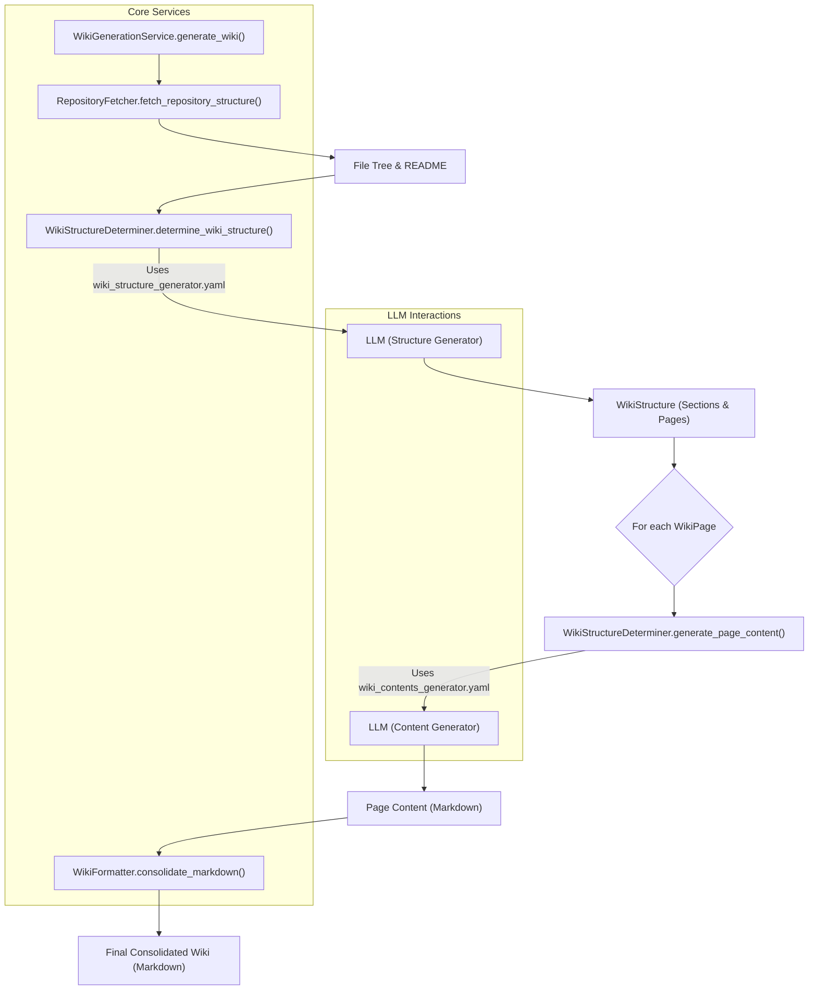
```mermaid
graph TD
    A["WikiGenerationService.generate_wiki()"] --> B["RepositoryFetcher.fetch_repository_structure()"];
    B --> C["File Tree & README"];
    C --> D["WikiStructureDeterminer.determine_wiki_structure()"];
    D -- "Uses wiki_structure_generator.yaml" --> E["LLM (Structure Generator)"];
    E --> F["WikiStructure (Sections & Pages)"];
    F --> G{"For each WikiPage"};
    G --> H["WikiStructureDeterminer.generate_page_content()"];
    H -- "Uses wiki_contents_generator.yaml" --> I["LLM (Content Generator)"];
    I --> J["Page Content (Markdown)"];
    J --> K["WikiFormatter.consolidate_markdown()"];
    K --> L["Final Consolidated Wiki (Markdown)"];

    subgraph LLM Interactions
        E
        I
    end
    subgraph Core Services
        A
        B
        D
        K
    end
```

## Conclusion

The key features of Wiki As Readme—universal compatibility, deep context analysis, smart structure generation, comprehensive content creation with diagrams, hybrid output, and an asynchronous architecture—collectively provide a robust and flexible solution for automated technical documentation. These features ensure that developers can quickly and efficiently transform their codebases into high-quality, maintainable wikis across any environment.

---

<a name="universal-compatibility"></a>

<details>
<summary>Relevant source files</summary>

The following files were used as context for generating this wiki page:

- [README.md](README.md)
- [src/providers/base.py](src/providers/base.py)
- [src/providers/github.py](src/providers/github.py)
- [src/providers/gitlab.py](src/providers/gitlab.py)
- [src/providers/bitbucket.py](src/providers/bitbucket.py)
- [src/providers/local.py](src/providers/local.py)
- [src/agent/llm.py](src/agent/llm.py)
</details>

# Universal Compatibility

## Introduction

The "Wiki As Readme" project is engineered with a core philosophy of "Universal Compatibility," aiming to be the most flexible AI documentation tool available. This principle ensures that the tool can adapt to virtually any development stack, environment, and model choice. It achieves this by being truly pluggable across three key dimensions: model agnosticism, platform agnosticism, and deployment agnosticism. This design allows users to integrate the documentation generation process seamlessly, whether they are using commercial LLM APIs, local open-source models, cloud-hosted Git repositories, or local file systems, and deploy it in various operational contexts from CI/CD pipelines to long-running services.

Sources: [README.md](Universal Compatibility section)

## Model Agnostic (Powered by LiteLLM)

The system's model agnosticism is primarily facilitated by `LiteLLM`, a unified interface for over 100 Large Language Models (LLMs). This allows "Wiki As Readme" to interact with a wide array of AI models without requiring specific code changes for each. The `LLMWikiMaker` class in `src/agent/llm.py` encapsulates this functionality, providing a consistent API for invoking different LLMs.

### LLMWikiMaker Class

The `LLMWikiMaker` class is responsible for configuring and interacting with various LLM providers. Its `_configure_llm` method dynamically sets up the model name and completion arguments based on the `LLM_PROVIDER` and `MODEL_NAME` settings. It handles provider-specific requirements such as API key environment variables, base URLs, and project/location details for cloud-based LLMs.

Sources: [src/agent/llm.py](LLMWikiMaker class), [src/agent/llm.py](LLMWikiMaker._configure_llm method)

### Supported LLM Providers

The `LLMWikiMaker` supports a broad spectrum of LLM providers, including:

| Provider | Description | Configuration Details |
|---|---|---|
| `google` | Google Vertex AI (Gemini) | Requires `GCP_PROJECT_NAME`, `GCP_MODEL_LOCATION`. Model prefixed with `vertex_ai/`. |
| `openai` | OpenAI (GPT) | Requires `OPENAI_API_KEY` or `LLM_BASE_URL`. Model prefixed with `openai/`. |
| `anthropic` | Anthropic (Claude) | Requires `ANTHROPIC_API_KEY`. Model prefixed with `anthropic/`. |
| `openrouter` | OpenRouter | Requires `OPENROUTER_API_KEY`. Model prefixed with `openrouter/`. |
| `xai` | xAI (Grok) | Requires `XAI_API_KEY`. Model prefixed with `xai/`. |
| `ollama` | Ollama / On-premise | Uses `LLM_BASE_URL` for custom endpoints. Model prefixed with `ollama/`. |

Sources: [src/agent/llm.py](LLMWikiMaker._configure_llm method)

### LLM Configuration Flow

The following diagram illustrates how `LLMWikiMaker` configures the LLM based on the specified provider:

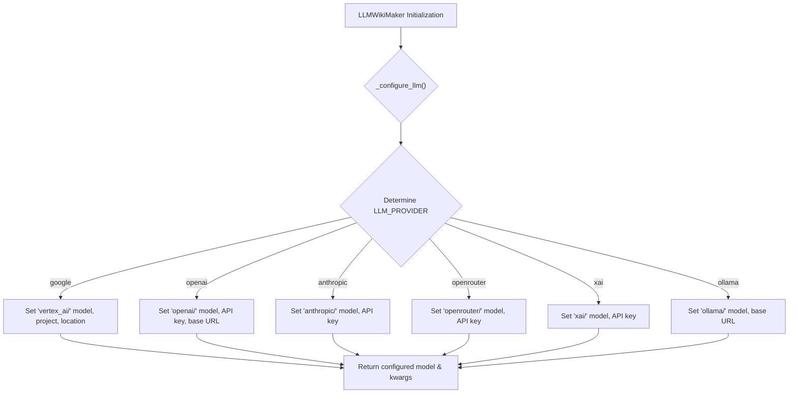
```mermaid
flowchart TD
    A["LLMWikiMaker Initialization"] --> B{"_configure_llm()"};
    B --> C{"Determine LLM_PROVIDER"};
    C -- "google" --> D["Set 'vertex_ai/' model, project, location"];
    C -- "openai" --> E["Set 'openai/' model, API key, base URL"];
    C -- "anthropic" --> F["Set 'anthropic/' model, API key"];
    C -- "openrouter" --> G["Set 'openrouter/' model, API key"];
    C -- "xai" --> H["Set 'xai/' model, API key"];
    C -- "ollama" --> I["Set 'ollama/' model, base URL"];
    D & E & F & G & H & I --> J["Return configured model & kwargs"];
```

## Platform Agnostic (Repository Providers)

The project's platform agnosticism is achieved through a modular design using an abstract `RepositoryProvider` class and concrete implementations for various Git platforms and local file systems. This allows the system to fetch repository structure and file content uniformly, regardless of where the code resides.

### RepositoryProvider Abstraction

The `RepositoryProvider` abstract base class defines the interface for interacting with any code source. It mandates two core abstract methods: `fetch_structure()` to retrieve the file tree and README, and `fetch_file_content(file_path: str)` to get the content of a specific file. This abstraction ensures that the core logic of wiki generation remains decoupled from the specifics of each repository platform.

Sources: [src/providers/base.py](RepositoryProvider class)

### Concrete Implementations

Several concrete classes extend `RepositoryProvider` to support different platforms:

*   **`GitHubProvider`**: Implements logic for fetching data from GitHub repositories using the GitHub REST API. It handles authentication via `GIT_API_TOKEN` and decodes Base64-encoded content.
    Sources: [src/providers/github.py](GitHubProvider class)
*   **`GitLabProvider`**: Supports GitLab, including self-hosted instances, by parsing the repository URL to determine the API base. It uses `PRIVATE-TOKEN` for authentication and handles URL encoding for project paths.
    Sources: [src/providers/gitlab.py](GitLabProvider class)
*   **`BitbucketProvider`**: Interacts with Bitbucket Cloud API, using `Bearer` tokens for authorization. It manages pagination for file trees and fetches README content.
    Sources: [src/providers/bitbucket.py](BitbucketProvider class)
*   **`LocalProvider`**: Designed for analyzing code directly from the local file system. It performs synchronous disk scans in a separate thread to avoid blocking and reads file content directly from disk.
    Sources: [src/providers/local.py](LocalProvider class)

### Repository Provider Class Hierarchy

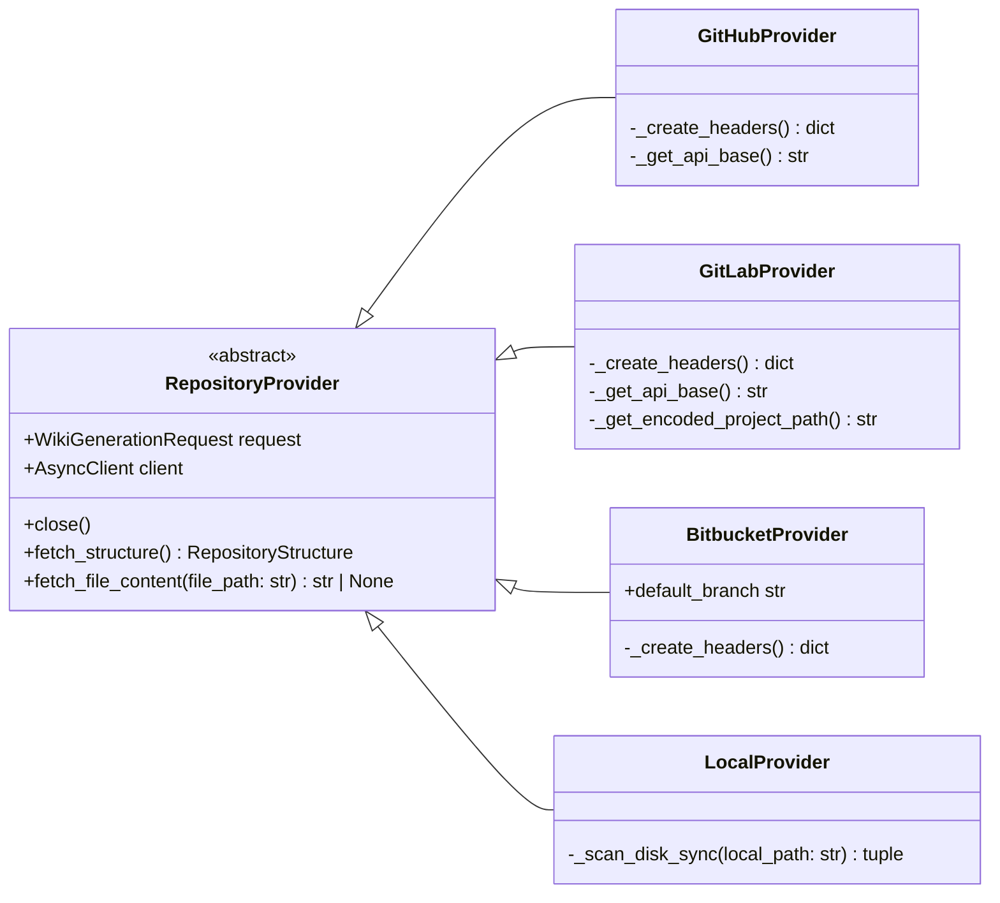
```mermaid
classDiagram
    direction LR
    class RepositoryProvider {
        <<abstract>>
        +WikiGenerationRequest request
        +AsyncClient client
        +close()
        +fetch_structure() RepositoryStructure
        +fetch_file_content(file_path: str) str | None
    }
    class GitHubProvider {
        -_create_headers() dict
        -_get_api_base() str
    }
    class GitLabProvider {
        -_create_headers() dict
        -_get_api_base() str
        -_get_encoded_project_path() str
    }
    class BitbucketProvider {
        -_create_headers() dict
        +default_branch str
    }
    class LocalProvider {
        -_scan_disk_sync(local_path: str) tuple
    }
    RepositoryProvider <|-- GitHubProvider
    RepositoryProvider <|-- GitLabProvider
    RepositoryProvider <|-- BitbucketProvider
    RepositoryProvider <|-- LocalProvider
```

### Repository Structure Fetching Flow

The general process for fetching repository structure, abstracted by the `RepositoryProvider` interface, is as follows:

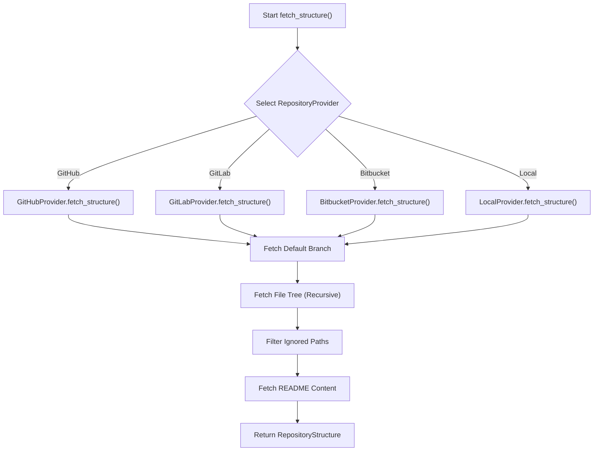
```mermaid
flowchart TD
    A["Start fetch_structure()"] --> B{"Select RepositoryProvider"};
    B -- "GitHub" --> C["GitHubProvider.fetch_structure()"];
    B -- "GitLab" --> D["GitLabProvider.fetch_structure()"];
    B -- "Bitbucket" --> E["BitbucketProvider.fetch_structure()"];
    B -- "Local" --> F["LocalProvider.fetch_structure()"];
    C & D & E & F --> G["Fetch Default Branch"];
    G --> H["Fetch File Tree (Recursive)"];
    H --> I["Filter Ignored Paths"];
    I --> J["Fetch README Content"];
    J --> K["Return RepositoryStructure"];
```

## Deployment Agnostic

"Wiki As Readme" is designed to be deployable in various environments, catering to different operational needs. This flexibility ensures that users can integrate the tool into their existing workflows seamlessly.

### Deployment Modes

*   **CI/CD Integration (GitHub Action)**: The tool can be dropped into GitHub Actions workflows to automate documentation updates on code pushes or manual triggers. This allows for continuous documentation generation as part of the development lifecycle.
    Sources: [README.md](1. GitHub Action (Recommended) section)
*   **Containerized Deployment (Docker Compose)**: For local development or self-contained environments, the application can be run via Docker Compose, providing a full UI/API stack without requiring local Python dependency management.
    Sources: [README.md](2. Docker Compose (Local) section)
*   **Local Python Development**: Developers can run the application directly from source, enabling easy modification and debugging.
    Sources: [README.md](3. Local Python Development section)
*   **Server & Webhooks**: The API server can be deployed as a long-running service, capable of handling requests and webhooks (e.g., GitHub push events) to trigger automated wiki generation.
    Sources: [README.md](4. Server & Webhooks section)

This deployment flexibility ensures that "Wiki As Readme" can fit into diverse infrastructure setups, from automated cloud pipelines to local development machines and dedicated API services.

## Conclusion

The "Universal Compatibility" of "Wiki As Readme" is a cornerstone of its design, making it an exceptionally adaptable tool for AI-powered documentation. By abstracting away the specifics of LLM providers, Git platforms, and deployment environments, the project offers unparalleled flexibility. This architectural approach ensures that users can leverage the tool with their preferred models, integrate it with any repository, and deploy it in a manner that best suits their operational needs, truly embodying the "Any Model. Any Repo. Any Environment." promise.

---

<a name="using-the-github-action"></a>

<details>
<summary>Relevant source files</summary>

The following files were used as context for generating this wiki page:

- [.github/workflows/wiki-as-readme-action.yml](.github/workflows/wiki-as-readme-action.yml)
- [action.yml](action.yml)
- [WIKI-AS-README-AS-ACTION.yml](WIKI-AS-README-AS-ACTION.yml)
- [README.md](README.md)
</details>

# Using the GitHub Action

The `Wiki-As-Readme` GitHub Action provides a seamless way to automate the generation and maintenance of your project's documentation directly within your CI/CD pipeline. By integrating this action into your GitHub workflows, you can ensure that your project's wiki or `README.md` is always up-to-date with the latest codebase changes, leveraging Large Language Models (LLMs) for comprehensive content generation.

This page details how to set up and configure the `Wiki-As-Readme` action in your repository, covering its triggers, inputs, and various operational modes, including direct pushes and pull request creation.

## Action Overview

The `Wiki-As-Readme` GitHub Action is designed to transform your codebase into a structured wiki or `README.md` file. It operates as a Docker-based action, encapsulating all necessary dependencies and logic to interact with various LLM providers and optionally synchronize content with Notion.

**Key Capabilities:**
*   **Automated Documentation:** Generates detailed documentation based on your repository's code.
*   **LLM Agnostic:** Supports multiple LLM providers (Google, OpenAI, Anthropic, etc.) via LiteLLM.
*   **Notion Integration:** Optionally syncs generated content to a specified Notion database.
*   **Flexible Commit Strategies:** Can either directly push updates to a branch or create a pull request for review.
*   **Manual and Automated Triggers:** Supports both `push` events for continuous updates and `workflow_dispatch` for manual, configurable runs.

Sources: [README.md](Core Features), [action.yml](name, description)

## Workflow Configuration

To use the `Wiki-As-Readme` action, you need to define a GitHub Actions workflow file (e.g., `.github/workflows/update-wiki.yml`) in your repository.

### Triggers

The action can be triggered in two primary ways:

1.  **On Push to Main Branch:** Automatically runs when changes are pushed to the `main` branch, ignoring specified files to prevent infinite loops.
    ```yaml
    on:
      push:
        branches:
          - main
        paths-ignore:
          - 'README.md'
          - 'WIKI.md'
          - '.github/workflows/update-wiki.yml'
    ```
    Sources: [.github/workflows/wiki-as-readme-action.yml](on.push), [README.md](1. GitHub Action (Recommended))

2.  **Manual Trigger (`workflow_dispatch`):** Allows users to manually trigger the workflow from the GitHub Actions UI, providing custom inputs for each run.
    ```yaml
    on:
      workflow_dispatch:
        inputs:
          language:
            description: 'Language code (e.g., ko, en, ja, etc.)'
            required: false
            default: 'en'
          llm_provider:
            description: 'LLM Provider (google, openai, anthropic, etc.)'
            required: false
            default: 'google'
          # ... other inputs
    ```
    Sources: [.github/workflows/wiki-as-readme-action.yml](on.workflow_dispatch), [README.md](1. GitHub Action (Recommended))

### Permissions

The workflow requires specific permissions to checkout code, write files, and create pull requests.

```yaml
jobs:
  wiki-time:
    runs-on: ubuntu-latest
    permissions:
      contents: write
      pull-requests: write
```
Sources: [.github/workflows/wiki-as-readme-action.yml](jobs.wiki-time.permissions)

### Workflow Steps

The typical workflow consists of several steps:

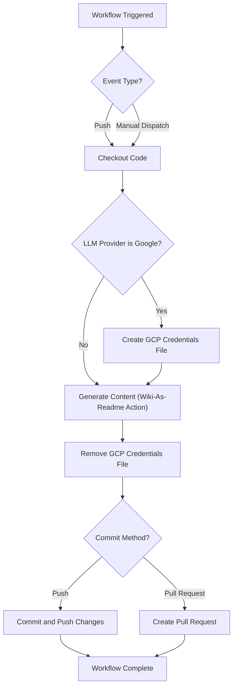
```mermaid
graph TD
    A["Workflow Triggered"] --> B{"Event Type?"}
    B -- "Push" --> C["Checkout Code"]
    B -- "Manual Dispatch" --> C
    C --> D{"LLM Provider is Google?"}
    D -- "Yes" --> E["Create GCP Credentials File"]
    D -- "No" --> F["Generate Content (Wiki-As-Readme Action)"]
    E --> F
    F --> G["Remove GCP Credentials File"]
    G --> H{"Commit Method?"}
    H -- "Push" --> I["Commit and Push Changes"]
    H -- "Pull Request" --> J["Create Pull Request"]
    I --> K["Workflow Complete"]
    J --> K
```

1.  **Checkout Code:** Retrieves the repository's code.
    ```yaml
    - name: Checkout code
      uses: actions/checkout@v4
    ```
    Sources: [.github/workflows/wiki-as-readme-action.yml](steps.1)

2.  **GCP Credentials Setup (Optional):** Conditionally creates a GCP service account key file if Google is the selected LLM provider. This step uses a GitHub Secret `GOOGLE_APPLICATION_CREDENTIALS`.
    ```yaml
    - name: Create GCP Credentials File
      if: ${{ (inputs.llm_provider == 'google') || (inputs.llm_provider == '') || (github.event_name == 'push') }}
      env:
        GCP_KEY: ${{ secrets.GOOGLE_APPLICATION_CREDENTIALS }}
      run: |
        if [ -n "$GCP_KEY" ]; then
          echo "$GCP_KEY" > ./gcp-key.json
        else
          echo "::warning::GOOGLE_APPLICATION_CREDENTIALS secret is missing, but provider is set to google."
        fi
    ```
    Sources: [.github/workflows/wiki-as-readme-action.yml](steps.Create GCP Credentials File)

3.  **Generate Wiki Content & Sync:** This is the core step where the `Wiki-As-Readme` action is invoked. It uses the Docker image `ghcr.io/catuscio/wiki-as-readme-action:latest` and passes various configuration parameters as environment variables.
    ```yaml
    - name: Generate Content (and Sync to Notion if enabled)
      uses: docker://ghcr.io/catuscio/wiki-as-readme-action:latest
      env:
        # --- Basic Settings ---
        LANGUAGE: ${{ inputs.language || 'en' }}
        WIKI_OUTPUT_PATH: ${{ env.WIKI_OUTPUT_PATH }}
        
        # --- LLM Provider and Model Settings ---
        LLM_PROVIDER: ${{ inputs.llm_provider || 'google' }}
        MODEL_NAME: ${{ inputs.model_name || 'gemini-2.5-flash' }}
        
        # --- API Key Settings ---
        GCP_PROJECT_NAME: ${{ secrets.GCP_PROJECT_NAME }}
        GCP_MODEL_LOCATION: ${{ secrets.GCP_MODEL_LOCATION }}
        GOOGLE_APPLICATION_CREDENTIALS: /github/workspace/gcp-key.json
        OPENAI_API_KEY: ${{ secrets.OPENAI_API_KEY }}
        ANTHROPIC_API_KEY: ${{ secrets.ANTHROPIC_API_KEY }}
        
        # --- GitHub Token ---
        GIT_API_TOKEN: ${{ secrets.GITHUB_TOKEN }}

        # --- Notion Sync Settings ---
        NOTION_SYNC_ENABLED: ${{ inputs.sync_to_notion || 'false' }}
        NOTION_API_KEY: ${{ secrets.NOTION_API_KEY }}
        NOTION_DATABASE_ID: ${{ secrets.NOTION_DATABASE_ID }}
    ```
    Sources: [.github/workflows/wiki-as-readme-action.yml](steps.Generate Content (and Sync to Notion if enabled))

4.  **GCP Credentials Cleanup (Optional):** Removes the temporary GCP key file.
    ```yaml
    - name: Remove GCP Credentials File
      if: always()
      run: rm -f ./gcp-key.json
    ```
    Sources: [.github/workflows/wiki-as-readme-action.yml](steps.Remove GCP Credentials File)

5.  **Commit and Push Changes:** If the `commit_method` is `push` (or for `push` events), changes are directly committed to the branch.
    ```yaml
    - name: Commit and Push changes
      if: ${{ inputs.commit_method == 'push' || github.event_name == 'push' }}
      uses: stefanzweifel/git-auto-commit-action@v5
      with:
        commit_message: "✨📚 Update ${{ env.WIKI_OUTPUT_PATH }} via Wiki-As-Readme Action (${{ inputs.language || 'en' }})"
        file_pattern: ${{ env.WIKI_OUTPUT_PATH }}
    ```
    Sources: [.github/workflows/wiki-as-readme-action.yml](steps.Commit and Push changes)

6.  **Create Pull Request:** If the `commit_method` is `pull-request`, a new pull request is created with the generated changes.
    ```yaml
    - name: Create Pull Request
      if: ${{ inputs.commit_method == 'pull-request' }}
      uses: peter-evans/create-pull-request@v7
      with:
        title: "✨📚 Update ${{ env.WIKI_OUTPUT_PATH }} via Wiki-As-Readme Action"
        body: |
          This PR was automatically generated by [Wiki-As-Readme](https://github.com/catuscio/wiki-as-readme) Action.
          # ... (PR body content)
        branch: wiki-update-${{ github.run_id }}
        commit-message: "✨📚 Update ${{ env.WIKI_OUTPUT_PATH }} via Wiki-As-Readme Action (${{ inputs.language || 'en' }})"
        add-paths: ${{ env.WIKI_OUTPUT_PATH }}
    ```
    Sources: [.github/workflows/wiki-as-readme-action.yml](steps.Create Pull Request)

## Action Inputs

The `Wiki-As-Readme` action (`action.yml`) exposes a comprehensive set of inputs to control its behavior. These inputs are typically passed as environment variables to the Docker container running the action.

| Input Name | Description | Default | Required |
|---|---|---|---|
| `language` | Language for the generated content (e.g., `ko`, `en`) | `en` | No |
| `wiki_output_path` | The file path to save the generated wiki content | `WIKI.md` | No |
| `llm_provider` | LLM provider (`google`, `openai`, `anthropic`, `openrouter`, `xai`, `ollama`) | `google` | No |
| `model_name` | Specific model name to use | `gemini-2.5-flash` | No |
| `openai_api_key` | OpenAI API Key | | No |
| `anthropic_api_key` | Anthropic API Key | | No |
| `openrouter_api_key` | OpenRouter API Key | | No |
| `xai_api_key` | xAI API Key | | No |
| `git_api_token` | GitHub/GitLab API Token for private repos | | No |
| `gcp_project_name` | GCP Project Name (for Vertex AI) | | No |
| `gcp_model_location` | GCP Model Location (for Vertex AI) | | No |
| `google_application_credentials` | GCP Service Account JSON Key (Content or Path) | | No |
| `llm_base_url` | Custom base URL for LLM API (e.g., for Ollama) | | No |
| `use_structured_output` | Whether to use structured JSON output | `true` | No |
| `temperature` | LLM temperature (0.0 to 1.0) | `0.0` | No |
| `max_retries` | Max retry attempts for LLM calls | `3` | No |
| `max_concurrency` | Max parallel LLM calls | `5` | No |
| `ignored_patterns` | JSON array of glob patterns to ignore | `[]` | No |

Sources: [action.yml](inputs)

## Secrets Management

It is crucial to manage API keys and sensitive credentials using GitHub Secrets. These secrets are then referenced in the workflow file using `${{ secrets.SECRET_NAME }}`.

**Common Secrets:**
*   `GOOGLE_APPLICATION_CREDENTIALS`
*   `GCP_PROJECT_NAME`
*   `GCP_MODEL_LOCATION`
*   `OPENAI_API_KEY`
*   `ANTHROPIC_API_KEY`
*   `NOTION_API_KEY`
*   `NOTION_DATABASE_ID`

The `GITHUB_TOKEN` secret is automatically provided by GitHub Actions and grants permissions to interact with the repository (e.g., pushing commits, creating PRs).

Sources: [.github/workflows/wiki-as-readme-action.yml](env section for API keys)

## Example Workflow

Here's a complete example of a GitHub Actions workflow that uses the `Wiki-As-Readme` action, combining automatic updates on push and manual dispatch capabilities.

```yaml
name: Wiki-As-Readme As Action

on:
  # 1. When pushing to main branch (runs automatically with defaults)
  push:
    branches:
      - main
    paths-ignore:
      - 'README.md'
      - 'WIKI.md'
      - '.github/workflows/update-wiki.yml'
  
  # 2. Manual trigger (allows custom input settings)
  workflow_dispatch:
    inputs:
      language:
        description: 'Language code (e.g., ko, en, ja, etc.)'
        required: false
        default: 'en'
      llm_provider:
        description: 'LLM Provider (google, openai, anthropic, etc.)'
        required: false
        default: 'google'
      model_name:
        description: 'Model Name'
        required: false
        default: 'gemini-2.5-flash'
      sync_to_notion:
        description: 'Sync to Notion? (true/false)'
        type: boolean
        required: false
        default: false
      commit_method:
        description: 'How to apply changes'
        type: choice
        options:
          - push
          - pull-request
        default: 'push'

jobs:
  wiki-time:
    runs-on: ubuntu-latest
    permissions:
      contents: write
      pull-requests: write

    env:
      WIKI_OUTPUT_PATH: "WIKI.md" # Output file path

    steps:
      - name: Checkout code
        uses: actions/checkout@v4

      - name: Create GCP Credentials File
        if: ${{ (inputs.llm_provider == 'google') || (inputs.llm_provider == '') || (github.event_name == 'push') }}
        env:
          GCP_KEY: ${{ secrets.GOOGLE_APPLICATION_CREDENTIALS }}
        run: |
          if [ -n "$GCP_KEY" ]; then
            echo "$GCP_KEY" > ./gcp-key.json
          else
            echo "::warning::GOOGLE_APPLICATION_CREDENTIALS secret is missing, but provider is set to google."
          fi

      - name: Generate Content (and Sync to Notion if enabled)
        uses: docker://ghcr.io/catuscio/wiki-as-readme-action:latest
        env:
          LANGUAGE: ${{ inputs.language || 'en' }}
          WIKI_OUTPUT_PATH: ${{ env.WIKI_OUTPUT_PATH }}
          LLM_PROVIDER: ${{ inputs.llm_provider || 'google' }}
          MODEL_NAME: ${{ inputs.model_name || 'gemini-2.5-flash' }}
          GCP_PROJECT_NAME: ${{ secrets.GCP_PROJECT_NAME }}
          GCP_MODEL_LOCATION: ${{ secrets.GCP_MODEL_LOCATION }}
          GOOGLE_APPLICATION_CREDENTIALS: /github/workspace/gcp-key.json
          OPENAI_API_KEY: ${{ secrets.OPENAI_API_KEY }}
          ANTHROPIC_API_KEY: ${{ secrets.ANTHROPIC_API_KEY }}
          GIT_API_TOKEN: ${{ secrets.GITHUB_TOKEN }}
          NOTION_SYNC_ENABLED: ${{ inputs.sync_to_notion || 'false' }}
          NOTION_API_KEY: ${{ secrets.NOTION_API_KEY }}
          NOTION_DATABASE_ID: ${{ secrets.NOTION_DATABASE_ID }}

      - name: Remove GCP Credentials File
        if: always()
        run: rm -f ./gcp-key.json

      - name: Commit and Push changes
        if: ${{ inputs.commit_method == 'push' || github.event_name == 'push' }}
        uses: stefanzweifel/git-auto-commit-action@v5
        with:
          commit_message: "✨📚 Update ${{ env.WIKI_OUTPUT_PATH }} via Wiki-As-Readme Action (${{ inputs.language || 'en' }})"
          file_pattern: ${{ env.WIKI_OUTPUT_PATH }}

      - name: Create Pull Request
        if: ${{ inputs.commit_method == 'pull-request' }}
        uses: peter-evans/create-pull-request@v7
        with:
          title: "✨📚 Update ${{ env.WIKI_OUTPUT_PATH }} via Wiki-As-Readme Action"
          body: |
            This PR was automatically generated by [Wiki-As-Readme](https://github.com/catuscio/wiki-as-readme) Action.
            
            It includes the following changes:
            - Updated wiki content in **${{ env.WIKI_OUTPUT_PATH }}** based on the current state of the repository.
            - (If enabled) Synchronized changes to the linked Notion database.            

            ---

            > 📖 Powered by [Wiki-As-Readme](https://github.com/catuscio/wiki-as-readme)
            > Turn your codebase into a comprehensive Wiki in minutes, delivered in a single Readme.
            > Works with Any Model. Any Repo. Any Environment.
          branch: wiki-update-${{ github.run_id }}
          commit-message: "✨📚 Update ${{ env.WIKI_OUTPUT_PATH }} via Wiki-As-Readme Action (${{ inputs.language || 'en' }})"
          add-paths: ${{ env.WIKI_OUTPUT_PATH }}
```
Sources: [README.md](1. GitHub Action (Recommended)), [WIKI-AS-README-AS-ACTION.yml](full content)

## Conclusion

The `Wiki-As-Readme` GitHub Action provides a powerful and flexible solution for automating your project's documentation. By integrating it into your CI/CD pipeline, you can ensure that your wiki or `README.md` remains current, comprehensive, and consistent with your codebase, reducing manual effort and improving developer experience. Its extensive configuration options and support for various LLM providers and output methods make it adaptable to a wide range of project needs.

---

<a name="local-deployment-(docker-&-python)"></a>

<details>
<summary>Relevant source files</summary>

The following files were used as context for generating this wiki page:

- [Dockerfile](Dockerfile)
- [Dockerfile.action](Dockerfile.action)
- [Dockerfile.server](Dockerfile.server)
- [docker-compose.yml](docker-compose.yml)
- [pyproject.toml](pyproject.toml)
- [src/app.py](src/app.py)
- [src/server.py](src/server.py)
- [README.md](README.md)
- [.env example](.env example)
</details>

# Local Deployment (Docker & Python)

This document outlines the methods and configurations for deploying the `wiki-as-readme` application locally, focusing on Docker-based containerization and direct Python execution. Local deployment enables developers to run the full application (API and Streamlit UI), the API server only, or the GitHub Action locally for development, testing, and immediate usage without external hosting. The project leverages Docker for consistent environments and `uv` for efficient Python dependency management.

## Docker-based Deployment

The project provides several Dockerfiles tailored for different deployment scenarios, all built upon `python:3.12-slim-bookworm` and utilizing a multi-stage build process for optimized image size and build performance. The `uv` package manager is used for dependency resolution and installation.

### Dockerfile Overview

All Dockerfiles follow a similar two-stage build pattern:

1.  **Stage 1: Builder**
    *   Uses `python:3.12-slim-bookworm` as the base.
    *   Copies the `uv` binary for efficient dependency management.
    *   Sets `WORKDIR /app`.
    *   Configures `UV_COMPILE_BYTECODE=1` and `UV_LINK_MODE=copy` for performance.
    *   Copies `pyproject.toml` and `uv.lock` for dependency caching.
    *   Installs dependencies using `uv sync --frozen --no-dev --no-install-project --extra <extra_group>`.

2.  **Stage 2: Final Image**
    *   Uses `python:3.12-slim-bookworm` as the base.
    *   Adds metadata labels (maintainer, description, source, version).
    *   Creates a dedicated `appuser` with UID 1000 for security.
    *   Copies the `.venv` from the builder stage.
    *   Copies application source code (`src`).
    *   Sets `PATH` and `PYTHONPATH` environment variables.
    *   Defines exposed ports and the entrypoint/command.

#### `Dockerfile` (Full Application: API + UI)

This Dockerfile builds an image containing both the FastAPI backend and the Streamlit frontend. It installs all dependencies required for both components.

*   **Dependencies:** `uv sync --extra all` (includes `ui`, `api`, `notion`).
*   **Exposed Ports:** `8000` (API) and `8501` (Streamlit UI).
*   **Entrypoint:** `entrypoint.sh` (not provided, but implied to start both services or a supervisor).

Sources: [Dockerfile](Dockerfile)

#### `Dockerfile.server` (API Server Only)

This Dockerfile builds a lightweight image specifically for the FastAPI backend. It's suitable for deploying the API as a standalone service.

*   **Dependencies:** `uv sync --extra api`.
*   **Exposed Ports:** `8000` (API).
*   **Command:** `gunicorn -k uvicorn.workers.UvicornWorker --bind 0.0.0.0:8000 --workers 2 src.server:app`. This command starts the FastAPI application using Gunicorn for production-grade serving.

Sources: [Dockerfile.server](Dockerfile.server)

#### `Dockerfile.action` (GitHub Action)

This Dockerfile is tailored for the GitHub Action variant of the application. It includes dependencies specific to Notion integration.

*   **Dependencies:** `uv sync --extra notion`.
*   **Entrypoint:** `python /app/src/action_entrypoint.py`. This directly executes the Python script designed for the GitHub Action workflow.
*   **Working Directory:** Sets `/github/workspace` as the final working directory, which is standard for GitHub Actions.

Sources: [Dockerfile.action](Dockerfile.action)

### Docker Build Process

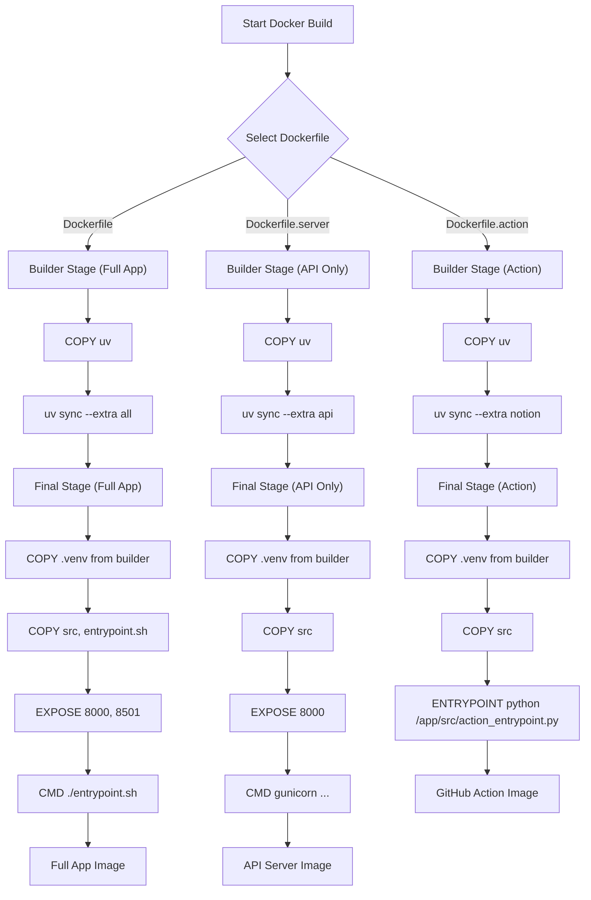
```mermaid
graph TD
    A["Start Docker Build"] --> B{"Select Dockerfile"};
    B -- "Dockerfile" --> C["Builder Stage (Full App)"];
    B -- "Dockerfile.server" --> D["Builder Stage (API Only)"];
    B -- "Dockerfile.action" --> E["Builder Stage (Action)"];

    C --> C1["COPY uv"];
    D --> D1["COPY uv"];
    E --> E1["COPY uv"];

    C1 --> C2["uv sync --extra all"];
    D1 --> D2["uv sync --extra api"];
    E1 --> E2["uv sync --extra notion"];

    C2 --> F["Final Stage (Full App)"];
    D2 --> G["Final Stage (API Only)"];
    E2 --> H["Final Stage (Action)"];

    F --> F1["COPY .venv from builder"];
    G --> G1["COPY .venv from builder"];
    H --> H1["COPY .venv from builder"];

    F1 --> F2["COPY src, entrypoint.sh"];
    G1 --> G2["COPY src"];
    H1 --> H2["COPY src"];

    F2 --> F3["EXPOSE 8000, 8501"];
    G2 --> G3["EXPOSE 8000"];
    H2 --> H3["ENTRYPOINT python /app/src/action_entrypoint.py"];

    F3 --> F4["CMD ./entrypoint.sh"];
    G3 --> G4["CMD gunicorn ..."];

    F4 --> I["Full App Image"];
    G4 --> J["API Server Image"];
    H3 --> K["GitHub Action Image"];
```

## Docker Compose Orchestration

The `docker-compose.yml` file simplifies the local deployment of the full application (API + UI) using the default `Dockerfile`. It defines a single service, `wiki-as-readme`, and configures its build context, port mappings, environment variables, and volume mounts.

### `docker-compose.yml` Configuration

| Configuration | Description | Value/Example |
|---|---|---|
| `build` | Specifies the build context, using the default `Dockerfile` in the current directory. | `.` |
| `container_name` | Assigns a fixed name to the container. | `wiki-as-readme` |
| `ports` | Maps container ports to host ports. | `8000:8000` (API), `8501:8501` (Streamlit UI) |
| `env_file` | Loads environment variables from a local `.env` file. | `.env` |
| `environment` | Sets specific environment variables directly. | `GOOGLE_APPLICATION_CREDENTIALS=/app/credentials.json` |
| `volumes` | Mounts host paths into the container for data persistence and local access. | `${WIKI_OUTPUT_PATH:-./output}:/app/output`, `${GOOGLE_CREDENTIALS_PATH:-./credentials.json}:/app/credentials.json`, `${LOCAL_REPO_PATH:-./}:/app/target_repo` |
| `restart` | Configures the container to always restart if it stops. | `always` |

Sources: [docker-compose.yml](docker-compose.yml)

### Docker Compose Flow

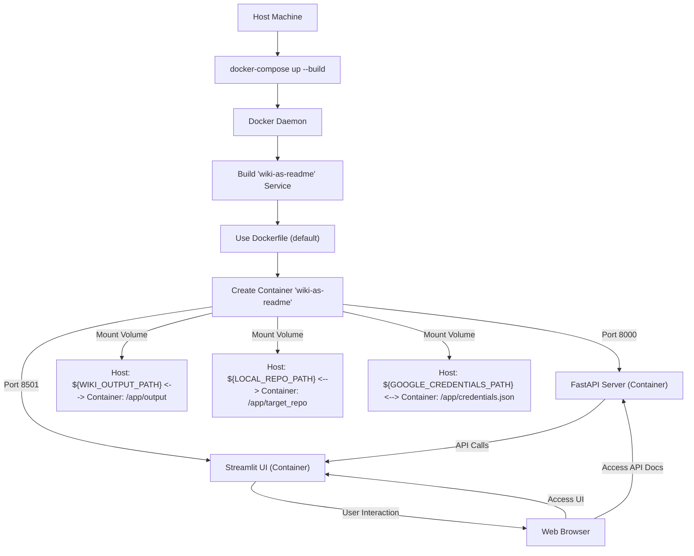
```mermaid
graph TD
    A["Host Machine"] --> B["docker-compose up --build"];
    B --> C["Docker Daemon"];
    C --> D["Build 'wiki-as-readme' Service"];
    D --> E["Use Dockerfile (default)"];
    E --> F["Create Container 'wiki-as-readme'"];

    F -- "Port 8000" --> G["FastAPI Server (Container)"];
    F -- "Port 8501" --> H["Streamlit UI (Container)"];

    F -- "Mount Volume" --> I["Host: ${WIKI_OUTPUT_PATH} <--> Container: /app/output"];
    F -- "Mount Volume" --> J["Host: ${LOCAL_REPO_PATH} <--> Container: /app/target_repo"];
    F -- "Mount Volume" --> K["Host: ${GOOGLE_CREDENTIALS_PATH} <--> Container: /app/credentials.json"];

    G -- "API Calls" --> H;
    H -- "User Interaction" --> L["Web Browser"];
    L -- "Access UI" --> H;
    L -- "Access API Docs" --> G;
```

## Python-based Local Development

For developers who prefer to run the application directly on their host machine without Docker, the project supports standard Python virtual environment setup and execution.

### Project Dependencies (`pyproject.toml`)

The `pyproject.toml` file defines the project's metadata, core dependencies, and optional dependency groups. The `uv` tool is used to manage these dependencies.

*   **Core Dependencies:** `google-auth`, `httpx`, `jinja2`, `litellm`, `loguru`, `pydantic`, `pydantic-settings`, `python-dotenv`, `pyyaml`, `requests`.
*   **Optional Dependencies:**
    *   `ui`: `streamlit`, `streamlit-mermaid` (for the frontend).
    *   `api`: `fastapi`, `uvicorn`, `gunicorn` (for the backend).
    *   `notion`: `notion-client` (for Notion integration).
    *   `all`: Combines `ui`, `api`, and `notion`.
*   **Development Dependencies:** `pre-commit`, `ruff`.

Sources: [pyproject.toml](pyproject.toml)

### Backend Server (`src/server.py`)

The `src/server.py` file is the entry point for the FastAPI application. It initializes the FastAPI app, includes API routers (`wiki`, `webhook`), and provides a health check endpoint.

*   **Initialization:** `FastAPI` instance with title, description, and version.
*   **Routers:** Includes `wiki.router` for generation tasks and `webhook.router` for integrations.
*   **Local Execution:** When run directly (`if __name__ == "__main__":`), it starts `uvicorn` on `http://127.0.0.1:8000` with `reload=True` for development.

Sources: [src/server.py](src/server.py)

### Frontend Application (`src/app.py`)

The `src/app.py` file implements the Streamlit user interface. It allows users to configure wiki generation parameters, trigger generation via the API, and view results.

*   **API Interaction:** Uses `httpx.AsyncClient` to communicate with the FastAPI backend (`API_BASE_URL`).
*   **Generation Flow:**
    *   `start_generation_task`: Sends `WikiGenerationRequest` to `/api/v1/wiki/generate/file`.
    *   `poll_task_status`: Periodically checks `/api/v1/wiki/status/{task_id}` for task completion or failure.
*   **UI Components:** Streamlit widgets for repository input, language selection, comprehensive view toggle, and displaying generation progress/results.
*   **Markdown Rendering:** `render_markdown_with_mermaid` function handles rendering Markdown content, specifically integrating `streamlit_mermaid` for Mermaid diagrams.
*   **History Page:** Displays previously generated wiki files from the `output` directory.

Sources: [src/app.py](src/app.py)

### UI-API Interaction Flow

```mermaid
sequenceDiagram
    participant User as "User (Browser)"
    participant Streamlit as "Streamlit UI (src/app.py)"
    participant FastAPI as "FastAPI API (src/server.py)"
    participant LLM as "LLM Provider"

    User->>Streamlit: "Access http://localhost:8501"
    User->>Streamlit: "Enter Repo Details & Click 'Generate Wiki'"
    Streamlit->>FastAPI: POST /api/v1/wiki/generate/file (WikiGenerationRequest)
    activate FastAPI
    FastAPI-->>Streamlit: "task_id"
    deactivate FastAPI

    loop Poll Task Status
        Streamlit->>FastAPI: GET /api/v1/wiki/status/{task_id}
        activate FastAPI
        alt Task In Progress
            FastAPI-->>Streamlit: {"status": "in_progress", "progress": "..."}
        else Task Completed
            FastAPI-->>Streamlit: {"status": "completed", "result": {"markdown_content": "..."}}
            break
        else Task Failed
            FastAPI-->>Streamlit: {"status": "failed", "result": {"error": "..."}}
            break
        end
        deactivate FastAPI
        Streamlit->>Streamlit: "Update Progress Bar"
    end

    Streamlit->>User: "Display Generated Wiki (Markdown & Mermaid)"
    Streamlit->>User: "Offer Download Button"
```

## Configuration (`.env`)

Both Docker-based and Python-based local deployments rely on environment variables for configuration, typically managed via a `.env` file. The `.env example` file provides a comprehensive list of configurable parameters.

Key configuration categories include:

*   **LLM Provider Settings:** `LLM_PROVIDER`, `MODEL_NAME`, `LLM_BASE_URL`.
*   **LLM API Keys:** `OPENAI_API_KEY`, `ANTHROPIC_API_KEY`, `GCP_PROJECT_NAME`.
*   **Notion Sync Settings:** `NOTION_SYNC_ENABLED`, `NOTION_API_KEY`, `NOTION_DATABASE_ID`.
*   **Paths:** `WIKI_OUTPUT_PATH`, `LOCAL_REPO_PATH`, `GOOGLE_CREDENTIALS_PATH`.
*   **Advanced:** `USE_STRUCTURED_OUTPUT`, `IGNORED_PATTERNS`.

Sources: [.env example](.env example)

## Local Usage Instructions

The `README.md` provides clear instructions for setting up and running the application locally.

### Docker Compose (Local)

1.  **Configure `.env`**: Copy `.env example` to `.env` and set API keys and other desired configurations.
2.  **Run**: Execute `docker-compose up --build` in the project root.
3.  **Access**:
    *   Web UI: `http://localhost:8501`
    *   API Docs: `http://localhost:8000/docs`

Sources: [README.md](2. Docker Compose (Local))

### Local Python Development

1.  **Prerequisites**: Python 3.12+, `uv`.
2.  **Clone & Install**:
    ```bash
    git clone https://github.com/catuscio/wiki-as-readme.git
    cd wiki-as-readme
    uv sync
    source .venv/bin/activate
    ```
3.  **Configure `.env`**: Copy `.env example` to `.env` and set variables.
4.  **Run Backend**: `uv run uvicorn src.server:app --reload --port 8000`
5.  **Run Frontend**: `uv run streamlit run src/app.py`

Sources: [README.md](3. Local Python Development)

## Conclusion

The `wiki-as-readme` project offers flexible local deployment options to suit various development and usage needs. Whether leveraging Docker and Docker Compose for a containerized, isolated environment or running directly with Python for development, the provided configurations and scripts ensure a smooth setup process. The modular Dockerfiles allow for deploying the full application, API-only server, or the GitHub Action component independently, catering to specific operational requirements.

---

<a name="server-deployment-&-webhooks"></a>

<details>
<summary>Relevant source files</summary>

The following files were used as context for generating this wiki page:

- [Dockerfile.server](Dockerfile.server)
- [src/server.py](src/server.py)
- [src/api/v1/endpoints/webhook.py](src/api/v1/endpoints/webhook.py)
- [src/api/v1/endpoints/wiki.py](src/api/v1/endpoints/wiki.py)
- [src/models/github_webhook_schema.py](src/models/github_webhook_schema.py)
- [README.md](README.md)
</details>

# Server Deployment & Webhooks

## Introduction

The Wiki As Readme project provides a FastAPI-based API server designed to generate comprehensive documentation from codebases and automate its deployment. This document details the server's deployment strategy using Docker and its robust webhook integration, primarily focusing on GitHub push events. The server acts as a central component, orchestrating wiki generation and subsequent updates to version control systems, ensuring documentation remains synchronized with code changes.

The server is built for scalability and asynchronous operations, leveraging FastAPI's capabilities for efficient handling of background tasks. Its webhook functionality enables a "set-it-and-forget-it" approach to documentation, where code pushes automatically trigger documentation updates, reducing manual overhead and ensuring consistency.

## Server Deployment

The Wiki As Readme API server is designed for containerized deployment using Docker, ensuring a consistent and isolated environment. The `Dockerfile.server` defines a multi-stage build process to create a lean and efficient production image.

### Docker Build Process

The Dockerfile utilizes a two-stage build: a `builder` stage for dependency installation and a `final` stage for the runtime environment.

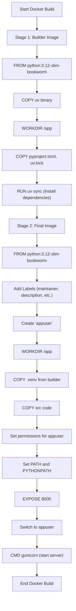
```mermaid
flowchart TD
    A["Start Docker Build"] --> B["Stage 1: Builder Image"]
    B --> C["FROM python:3.12-slim-bookworm"]
    C --> D["COPY uv binary"]
    D --> E["WORKDIR /app"]
    E --> F["COPY pyproject.toml, uv.lock"]
    F --> G["RUN uv sync (install dependencies)"]
    G --> H["Stage 2: Final Image"]
    H --> I["FROM python:3.12-slim-bookworm"]
    I --> J["Add Labels (maintainer, description, etc.)"]
    J --> K["Create 'appuser'"]
    K --> L["WORKDIR /app"]
    L --> M["COPY .venv from builder"]
    M --> N["COPY src code"]
    N --> O["Set permissions for appuser"]
    O --> P["Set PATH and PYTHONPATH"]
    P --> Q["EXPOSE 8000"]
    Q --> R["Switch to appuser"]
    R --> S["CMD gunicorn (start server)"]
    S --> T["End Docker Build"]
```
Sources: [Dockerfile.server](https://github.com/catuscio/wiki-as-readme/blob/main/Dockerfile.server)

#### Stage 1: Builder

This stage is responsible for installing Python dependencies efficiently using `uv`, a fast Python package installer and resolver.
*   **Base Image**: `python:3.12-slim-bookworm`
*   **Dependency Management**: `uv` is copied into the image and used to synchronize dependencies defined in `pyproject.toml` and `uv.lock`. This ensures a reproducible and optimized virtual environment.
*   **Environment Variables**: `UV_COMPILE_BYTECODE=1` and `UV_LINK_MODE=copy` are set for performance and efficiency.

#### Stage 2: Final Image

This stage creates the production-ready image, minimizing its size by only including necessary components.
*   **Base Image**: `python:3.12-slim-bookworm` (same as builder for consistency).
*   **Metadata**: Open Container Initiative (OCI) labels are applied, providing information about the image (maintainer, description, source, license, version).
*   **Security**: A dedicated non-root user `appuser` (UID 1000) is created and used to run the application, enhancing security.
*   **Application Files**: The pre-built virtual environment (`.venv`) from the `builder` stage and the application source code (`src`) are copied.
*   **Environment Configuration**: `PATH` is updated to include the virtual environment's binaries, and `PYTHONPATH` is set to `/app` for module resolution.
*   **Port Exposure**: The server listens on port `8000`, which is exposed.
*   **Command**: The application is started using `gunicorn`, a WSGI HTTP server, with `uvicorn.workers.UvicornWorker` for ASGI compatibility. It binds to `0.0.0.0:8000` and uses 2 worker processes.

## API Server Architecture

The core of the server is a FastAPI application, defined in `src/server.py`. It serves as the entry point for all API interactions, including wiki generation and webhook processing.

### Application Entry Point

The `src/server.py` file initializes the FastAPI application:
*   **Title & Description**: "Wiki as Readme" with a descriptive overview.
*   **Version**: `1.3.0`.
*   **Logging**: Configured using `src.core.logger_config.setup_logging`.
*   **Health Check**: A simple GET endpoint `/` returns `{"status": "ok"}` to verify server availability.
*   **API Routers**:
    *   `/api/v1/wiki`: Handles all wiki generation and status-related endpoints, managed by `src.api.v1.endpoints.wiki`.
    *   `/api/v1/webhook`: Manages webhook integration, specifically for GitHub, handled by `src.api.v1.endpoints.webhook`.

Sources: [src/server.py](https://github.com/catuscio/wiki-as-readme/blob/main/src/server.py)

## Webhook Integration

The server provides a robust webhook integration, primarily designed to automate wiki updates in response to GitHub push events. This feature is managed by the `src/api/v1/endpoints/webhook.py` module.

### GitHub Webhook Endpoint

*   **Endpoint**: `POST /api/v1/webhook/github`
*   **Purpose**: Receives push event payloads from GitHub.
*   **Status Code**: Returns `202 Accepted` immediately, indicating that processing has started in the background.

Sources: [src/api/v1/endpoints/webhook.py](https://github.com/catuscio/wiki-as-readme/blob/main/src/api/v1/endpoints/webhook.py)

### Webhook Payload Structure

The incoming GitHub push event payload is validated against the `GitHubPushPayload` Pydantic model. This model captures essential information about the push event, such as the repository, pusher, and commit details.

| Field | Type | Description |
|---|---|---|
| `ref` | `str` | The Git ref being pushed (e.g., `refs/heads/main`). |
| `repository` | `GitHubRepository` | Details about the repository (name, owner login). |
| `pusher` | `GitHubPusher` | Information about the user who pushed. |
| `head_commit` | `GitHubCommit` | Details of the latest commit in the push. |

Sources: [src/models/github_webhook_schema.py](https://github.com/catuscio/wiki-as-readme/blob/main/src/models/github_webhook_schema.py)

### Security: Signature Verification

To ensure the authenticity and integrity of incoming webhooks, the server implements HMAC SHA256 signature verification.
*   **Mechanism**: The `verify_signature` asynchronous function checks the `X-Hub-Signature-256` header against a computed hash of the request body using a shared secret (`GITHUB_WEBHOOK_SECRET`).
*   **Requirement**: If `GITHUB_WEBHOOK_SECRET` is configured, a missing or invalid signature results in a `403 Forbidden` HTTP exception.

Sources: [src/api/v1/endpoints/webhook.py](https://github.com/catuscio/wiki-as-readme/blob/main/src/api/v1/endpoints/webhook.py#L30-L42)

### Webhook Processing Workflow

Upon receiving a valid GitHub push event, the server initiates a background task to perform the full cycle of wiki generation and update.

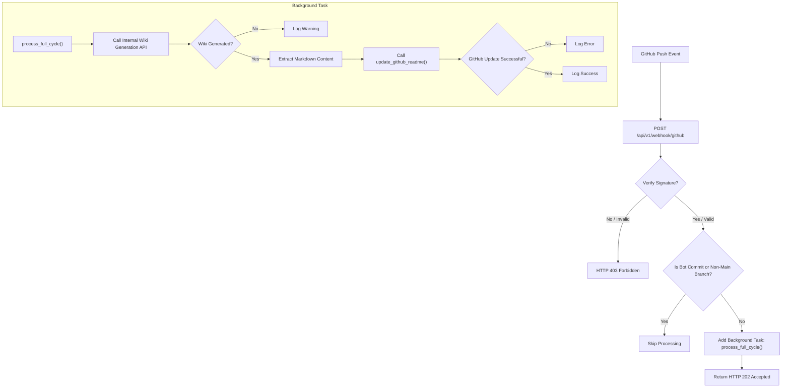
```mermaid
flowchart TD
    A["GitHub Push Event"] --> B["POST /api/v1/webhook/github"];
    B --> C{"Verify Signature?"};
    C -- "No / Invalid" --> D["HTTP 403 Forbidden"];
    C -- "Yes / Valid" --> E{"Is Bot Commit or Non-Main Branch?"};
    E -- "Yes" --> F["Skip Processing"];
    E -- "No" --> G["Add Background Task: process_full_cycle()"];
    G --> H["Return HTTP 202 Accepted"];

    subgraph Background Task
        H_sub["process_full_cycle()"] --> I["Call Internal Wiki Generation API"];
        I --> J{"Wiki Generated?"};
        J -- "No" --> K["Log Warning"];
        J -- "Yes" --> L["Extract Markdown Content"];
        L --> M["Call update_github_readme()"];
        M --> N{"GitHub Update Successful?"};
        N -- "No" --> O["Log Error"];
        N -- "Yes" --> P["Log Success"];
    end
```
Sources: [src/api/v1/endpoints/webhook.py](https://github.com/catuscio/wiki-as-readme/blob/main/src/api/v1/endpoints/webhook.py#L129-L167)

#### 1. Preventing Infinite Loops

A critical feature is the mechanism to prevent the bot from triggering itself in an infinite loop.
*   **Logic**: If the `pusher.name` matches `BOT_COMMITTER_NAME` ("Wiki-As-Readme-Bot") or the `head_commit.message` contains "via Wiki-As-Readme", the webhook processing is skipped.
*   **Branch Filtering**: Only pushes to the `main` branch are processed; other branches are ignored.

Sources: [src/api/v1/endpoints/webhook.py](https://github.com/catuscio/wiki-as-readme/blob/main/src/api/v1/endpoints/webhook.py#L136-L143)

#### 2. Background Task: `process_full_cycle`

The `process_full_cycle` function orchestrates the entire automated workflow:
1.  **Internal Wiki Generation**: It makes an internal HTTP POST request to the `/api/v1/wiki/generate/file` endpoint. This call uses `httpx.AsyncClient` and includes a timeout of 60 seconds to accommodate generation time. The request payload is constructed from the GitHub push event details.
2.  **Content Extraction**: Upon successful generation, the markdown content is extracted from the response.
3.  **GitHub Update**: The extracted markdown content is then passed to `update_github_readme` to commit it back to the repository.

Sources: [src/api/v1/endpoints/webhook.py](https://github.com/catuscio/wiki-as-readme/blob/main/src/api/v1/endpoints/webhook.py#L89-L126)

#### 3. Updating GitHub (`update_github_readme`)

This function handles the interaction with the GitHub API to commit the generated markdown.
*   **Authentication**: Requires `GITHUB_ACCESS_TOKEN` (a Personal Access Token with `repo` scope) for authorization.
*   **API Endpoint**: Targets `https://api.github.com/repos/{repo_owner}/{repo_name}/contents/WIKI.md`.
*   **Process**:
    1.  **Fetch SHA**: Retrieves the SHA of the existing `WIKI.md` (if any) to correctly update the file.
    2.  **Encode Content**: The markdown content is Base64 encoded, as required by the GitHub API.
    3.  **Commit Data**: Constructs the commit payload, including a commit message ("docs: Update README.md via Wiki-As-Readme") and committer details (using `BOT_COMMITTER_NAME`).
    4.  **PUT Request**: Sends a PUT request to the GitHub API to create or update the `WIKI.md` file.

Sources: [src/api/v1/endpoints/webhook.py](https://github.com/catuscio/wiki-as-readme/blob/main/src/api/v1/endpoints/webhook.py#L45-L86)

### Configuration for Webhooks

The webhook functionality relies on several environment variables:

| Variable | Description | Source |
|---|---|---|
| `GITHUB_WEBHOOK_SECRET` | Secret key used to verify the HMAC signature of incoming GitHub webhooks. | `os.getenv("GITHUB_WEBHOOK_SECRET")` |
| `GITHUB_ACCESS_TOKEN` | GitHub Personal Access Token (PAT) with `repo` scope, used to commit generated files back to GitHub. | `os.getenv("GITHUB_ACCESS_TOKEN")` |
| `BOT_COMMITTER_NAME` | The name used for commits made by the bot, also used to prevent infinite loops. | `BOT_COMMITTER_NAME = "Wiki-As-Readme-Bot"` |

Sources: [src/api/v1/endpoints/webhook.py](https://github.com/catuscio/wiki-as-readme/blob/main/src/api/v1/endpoints/webhook.py#L18-L24)

## Wiki Generation API (Webhook Interaction)

The webhook integration leverages the internal wiki generation API endpoints defined in `src/api/v1/endpoints/wiki.py`. Specifically, the `process_full_cycle` function calls `/api/v1/wiki/generate/file`.

*   **`POST /api/v1/wiki/generate/file`**: Triggers a background task to generate the wiki and saves the resulting Markdown content as a file on the server. This is the mode used by the webhook to ensure the content is fully generated before being pushed to GitHub.
*   **Asynchronous Processing**: All generation tasks are handled asynchronously using FastAPI's `BackgroundTasks`, ensuring that API responses are fast and long-running generation processes do not block the server.

Sources: [src/api/v1/endpoints/wiki.py](https://github.com/catuscio/wiki-as-readme/blob/main/src/api/v1/endpoints/wiki.py#L50-L72)

## Conclusion

The Wiki As Readme server provides a robust and automated solution for documentation generation and deployment. Its Docker-based deployment ensures portability and consistency, while the FastAPI framework delivers a scalable and responsive API. The integrated webhook system, particularly for GitHub, automates the entire documentation lifecycle from code push to wiki update, significantly streamlining development workflows and maintaining documentation accuracy. Security measures like signature verification and loop prevention mechanisms ensure reliable and safe operation.

---

<a name="configuration-reference"></a>

<details>
<summary>Relevant source files</summary>

The following files were used as context for generating this wiki page:

- [.env example](.env example)
- [src/core/config.py](src/core/config.py)
- [README.md](README.md)
</details>

# Configuration Reference

## Introduction

This document provides a comprehensive reference for configuring the Wiki-As-Readme application. The application's behavior, integrations, and operational parameters are controlled through a set of environment variables, primarily defined in a `.env` file. These settings are then loaded and validated by the internal configuration system, which leverages Pydantic for type safety and structured access. Understanding these configuration options is crucial for deploying, customizing, and integrating the Wiki-As-Readme tool effectively across various environments, including local development, Docker, and CI/CD pipelines.

The configuration system is designed for flexibility, allowing users to specify LLM providers, API keys, output paths, and integration details (like Notion sync) with ease. It also includes advanced settings for fine-tuning LLM behavior and file filtering.

## Configuration Sources and Loading

The application's configuration is primarily managed through two main sources:

1.  **`.env` file**: This file serves as the primary interface for users to define their settings. It contains key-value pairs for environment variables that the application reads at startup. A `.env example` file is provided to illustrate available options and their expected formats.
    Sources: [[.env example](.env example)]

2.  **`src/core/config.py`**: This Python module defines the `Settings` class using Pydantic's `BaseSettings`. It specifies the expected types, default values, and validation rules for each configuration parameter. The `SettingsConfigDict` is configured to load variables from the `.env` file, ensuring that user-defined values override the defaults.
    Sources: [[src/core/config.py](src/core/config.py)]

### Configuration Loading Flow

The following diagram illustrates how configuration values are loaded into the application:

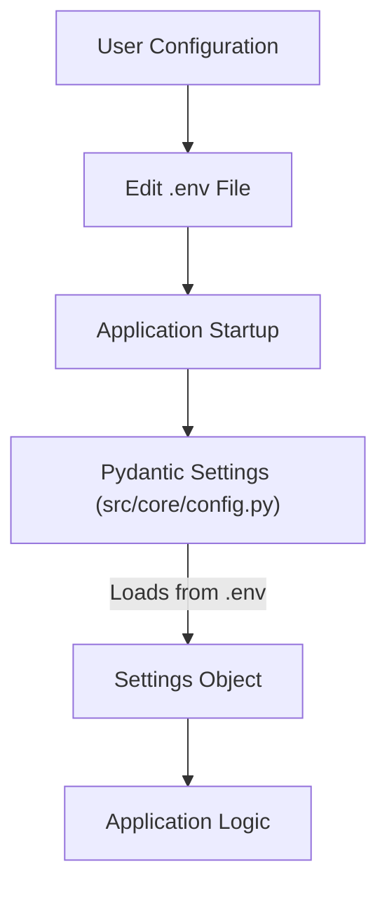
```mermaid
graph TD
    A["User Configuration"] --> B["Edit .env File"];
    B --> C["Application Startup"];
    C --> D["Pydantic Settings (src/core/config.py)"];
    D -- "Loads from .env" --> E["Settings Object"];
    E --> F["Application Logic"];
```

## Detailed Configuration Options

The following table lists all available configuration variables, their descriptions, types, default values, and examples.

| Category | Variable | Description | Type/Options | Default Value | Source |
|---|---|---|---|---|---|
| **LLM Provider** | `LLM_PROVIDER` | Specifies the Large Language Model provider to use. | `google`, `openai`, `anthropic`, `xai`, `openrouter`, `ollama` | `google` | [.env example](.env example), [src/core/config.py](src/core/config.py) |
| | `MODEL_NAME` | The specific model identifier for the chosen LLM provider. | String (e.g., `gemini-2.5-flash`, `gpt-4o`) | `gemini-2.5-flash` | [.env example](.env example), [src/core/config.py](src/core/config.py) |
| | `LLM_BASE_URL` | Optional custom base URL for the LLM API (e.g., for Ollama or proxy servers). | String (URL) | `None` | [.env example](.env example), [src/core/config.py](src/core/config.py) |
| **LLM API Keys** | `OPENAI_API_KEY` | API key for OpenAI services. | String | `None` | [.env example](.env example), [src/core/config.py](src/core/config.py) |
| | `ANTHROPIC_API_KEY` | API key for Anthropic services. | String | `None` | [.env example](.env example), [src/core/config.py](src/core/config.py) |
| | `OPENROUTER_API_KEY` | API key for OpenRouter services. | String | `None` | [.env example](.env example), [src/core/config.py](src/core/config.py) |
| | `XAI_API_KEY` | API key for xAI services. | String | `None` | [.env example](.env example), [src/core/config.py](src/core/config.py) |
| **LLM Behavior** | `USE_STRUCTURED_OUTPUT` | Whether to request structured JSON output from the LLM (requires model support). | Boolean (`true`/`false`) | `true` | [.env example](.env example), [src/core/config.py](src/core/config.py) |
| | `temperature` | Controls the randomness of LLM output. `0.0` for deterministic, `1.0` for creative. | Float (0.0 - 1.0) | `0.0` | [.env example](.env example), [src/core/config.py](src/core/config.py) |
| | `max_retries` | Maximum number of retry attempts for failed LLM requests. | Integer | `3` | [.env example](.env example), [src/core/config.py](src/core/config.py) |
| | `max_concurrency` | Limits the number of parallel LLM calls to prevent rate limits. | Integer | `5` | [.env example](.env example), [src/core/config.py](src/core/config.py) |
| **File Filtering** | `IGNORED_PATTERNS` | List of glob patterns to exclude from LLM context. Overrides default patterns if defined. Must be a single-line JSON array string in `.env`. | JSON array string or List of strings | Default list (see `src/core/config.py`) | [.env example](.env example), [src/core/config.py](src/core/config.py) |
| **Repository Access** | `GIT_API_TOKEN` | GitHub/GitLab personal access token for private repositories or higher API rate limits. | String | `None` | [.env example](.env example), [src/core/config.py](src/core/config.py) |
| **Localization** | `language` | Target language for the generated wiki. | `ko`, `en`, `ja`, `zh`, `zh-tw`, `es`, `vi`, `pt-br`, `fr`, `ru` | `en` | [.env example](.env example), [src/core/config.py](src/core/config.py) |
| **Google Cloud** | `GCP_PROJECT_NAME` | Google Cloud Project ID for Vertex AI. | String | `None` | [.env example](.env example), [src/core/config.py](src/core/config.py) |
| | `GCP_MODEL_LOCATION` | Google Cloud region for Vertex AI models. | String | `None` | [.env example](.env example), [src/core/config.py](src/core/config.py) |
| | `GOOGLE_CREDENTIALS_PATH` / `GOOGLE_APPLICATION_CREDENTIALS` | Absolute path to your Google Cloud Service Account JSON key file. Used by Vertex AI. | String (file path) | `None` | [.env example](.env example), [src/core/config.py](src/core/config.py) |
| **Path Settings** | `LOCAL_REPO_PATH` | The absolute path to the local repository to be analyzed. | String (file path) | `.` (current directory) | [.env example](.env example), [src/core/config.py](src/core/config.py) |
| | `WIKI_OUTPUT_PATH` | The absolute path where generated wiki files will be saved. | String (file path) | `./WIKI.md` | [.env example](.env example), [src/core/config.py](src/core/config.py) |
| **Notion Sync** | `NOTION_SYNC_ENABLED` | Enables automatic synchronization of the generated wiki to Notion. | Boolean (`true`/`false`) | `false` | [.env example](.env example), [src/core/config.py](src/core/config.py) |
| | `NOTION_API_KEY` | Notion Integration Token. | String (`secret_xxx...`) | `None` | [.env example](.env example), [src/core/config.py](src/core/config.py) |
| | `NOTION_DATABASE_ID` | The Notion Database ID where each repository will be added as an item. | String (32-char ID) | `None` | [.env example](.env example), [src/core/config.py](src/core/config.py) |
| **Webhooks** | `GITHUB_WEBHOOK_SECRET` | Secret token for validating GitHub webhook payloads. | String | `None` | [src/core/config.py](src/core/config.py) |

### Special Handling for `IGNORED_PATTERNS`

The `IGNORED_PATTERNS` setting has specific parsing logic to accommodate different input formats:

*   **Default Value**: If `IGNORED_PATTERNS` is not set in the `.env` file, a predefined list of common patterns (e.g., lock files, build artifacts, version control directories) from `src/core/config.py` is used.
    Sources: [[src/core/config.py](src/core/config.py), `DEFAULT_IGNORED_PATTERNS`]
*   **JSON Array String**: When provided in the `.env` file, it expects a single-line JSON array string (e.g., `'["*.log", "node_modules/*"]'`). This is the recommended format for overriding the default list.
    Sources: [[.env example](.env example)]
*   **Comma-Separated String**: If the value is a string but not a valid JSON array, it will attempt to parse it as a comma-separated list of patterns.
*   **Pydantic Validator**: A `field_validator` named `parse_ignored_patterns` in `src/core/config.py` handles this parsing logic, ensuring the final value is always a `list[str]`.
    Sources: [[src/core/config.py](src/core/config.py), `parse_ignored_patterns` method]

## Usage Contexts

These configuration variables are utilized across all deployment and usage modes of Wiki-As-Readme:

*   **GitHub Action**: Environment variables are passed directly to the Docker action.
*   **Docker Compose**: Variables are loaded from the `.env` file mounted into the Docker containers.
*   **Local Python Development**: Variables are read from the `.env` file in the project root.
*   **Server & Webhooks**: The deployed server reads its configuration from environment variables, typically sourced from a `.env` file or directly from the deployment environment.

Sources: [[README.md](README.md), "Usage Modes" section]

## Conclusion

The configuration system of Wiki-As-Readme provides a robust and flexible way to tailor the application to diverse needs and environments. By leveraging `.env` files for user-friendly configuration and Pydantic for internal validation and type safety, the system ensures both ease of use and reliability. Understanding these settings is key to unlocking the full potential of the tool for automated documentation generation.

---

<a name="api-endpoints"></a>

<details>
<summary>Relevant source files</summary>

The following files were used as context for generating this wiki page:

- [src/api/v1/endpoints/wiki.py](src/api/v1/endpoints/wiki.py)
- [src/api/v1/endpoints/webhook.py](src/api/v1/endpoints/webhook.py)
- [src/models/api_schema.py](src/models/api_schema.py)
- [src/models/github_webhook_schema.py](src/models/github_webhook_schema.py)
- [README.md](README.md)
</details>

# API Endpoints

This document provides a comprehensive overview of the API endpoints exposed by the Wiki-As-Readme application. These endpoints facilitate the generation of wiki content, retrieval of task statuses, and integration with external services like GitHub webhooks for automated documentation updates. The API is built using FastAPI, leveraging asynchronous operations and background tasks for efficient processing.

The primary functionalities include triggering wiki generation in various modes (saving to file or returning text), monitoring the progress of these generation tasks, and automatically updating GitHub repositories based on push events.

## 1. Wiki Generation Endpoints

The `src/api/v1/endpoints/wiki.py` module defines the core API for initiating and monitoring wiki generation tasks. These endpoints utilize background tasks to ensure non-blocking operations, providing immediate feedback to the client while the generation process runs asynchronously.

Sources: [src/api/v1/endpoints/wiki.py](src/api/v1/endpoints/wiki.py)

### 1.1. `POST /api/v1/wiki/generate/file`

This endpoint triggers the generation of a wiki and saves the resulting Markdown content as a file on the server's filesystem, typically in an `output/` directory. It returns a `task_id` which can be used to query the status of the background operation.

*   **Description:** Asynchronously generates wiki content and saves it to a file.
*   **Request Model:** `WikiGenerationRequest`
*   **Response Model:** `WikiGenerationResponse`
*   **Behavior:** Initiates `process_wiki_generation_task` in the background with `save_file=True`.

Sources: [src/api/v1/endpoints/wiki.py](generate_wiki_file function)

### 1.2. `POST /api/v1/wiki/generate/text`

This endpoint triggers the generation of a wiki but does not save the content to the server's filesystem. Instead, the generated Markdown text is stored as part of the task's result, accessible via the status endpoint once the task completes.

*   **Description:** Asynchronously generates wiki content and makes the text available in the task status.
*   **Request Model:** `WikiGenerationRequest`
*   **Response Model:** `WikiGenerationResponse`
*   **Behavior:** Initiates `process_wiki_generation_task` in the background with `save_file=False`.

Sources: [src/api/v1/endpoints/wiki.py](generate_wiki_text function)

### 1.3. `GET /api/v1/wiki/status/{task_id}`

This endpoint allows clients to retrieve the current status and, if completed, the result of a previously initiated wiki generation task.

*   **Description:** Retrieves the current status of a wiki generation task.
*   **Path Parameter:** `task_id` (string) - The unique identifier for the task.
*   **Response Model:** `TaskStatusResponse`
*   **Error Handling:** Returns `404 Not Found` if the `task_id` does not correspond to an active or known task.

Sources: [src/api/v1/endpoints/wiki.py](get_wiki_generation_status function)

### 1.4. Wiki Generation Flow

The generation process involves an initialization step (`_init_wiki_generation`) which validates the request, creates a task, and prepares the wiki structure. This is followed by a background task that performs the actual content generation.

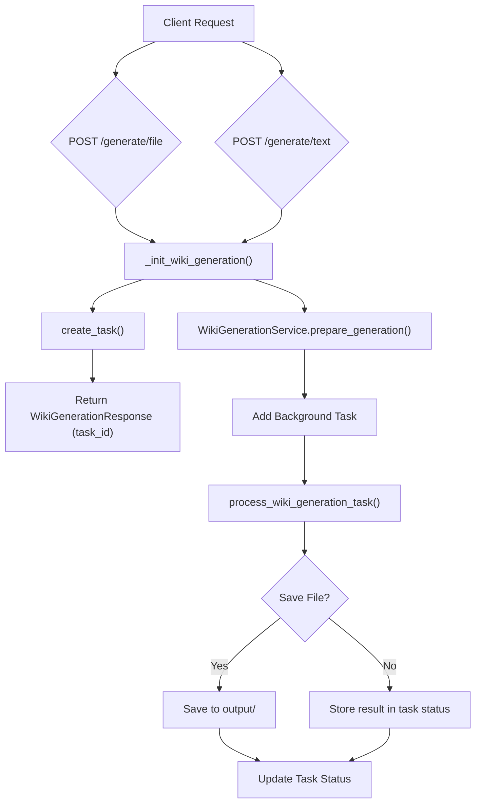
```mermaid
graph TD
    A["Client Request"] --> B{"POST /generate/file"};
    A --> C{"POST /generate/text"};
    B --> D["_init_wiki_generation()"];
    C --> D;
    D --> E["create_task()"];
    D --> F["WikiGenerationService.prepare_generation()"];
    E --> G["Return WikiGenerationResponse (task_id)"];
    F --> H["Add Background Task"];
    H --> I["process_wiki_generation_task()"];
    I --> J{"Save File?"};
    J -- "Yes" --> K["Save to output/"];
    J -- "No" --> L["Store result in task status"];
    K --> M["Update Task Status"];
    L --> M;
```
Sources: [src/api/v1/endpoints/wiki.py](generate_wiki_file function, generate_wiki_text function, _init_wiki_generation function)

## 2. Webhook Endpoints

The `src/api/v1/endpoints/webhook.py` module provides an endpoint for integrating with GitHub webhooks, enabling automated wiki updates upon repository changes.

Sources: [src/api/v1/endpoints/webhook.py](src/api/v1/endpoints/webhook.py)

### 2.1. `POST /api/v1/webhook/github`

This endpoint is designed to receive push event payloads from GitHub webhooks. Upon receiving a valid push event, it triggers a full cycle of wiki generation and subsequent update of a `WIKI.md` file in the respective GitHub repository.

*   **Description:** Handles GitHub push events to automatically generate and update repository documentation.
*   **Request Model:** `GitHubPushPayload`
*   **Security:** Requires HMAC signature verification using `X-Hub-Signature-256` header and `GITHUB_WEBHOOK_SECRET`.
*   **Filtering:**
    *   Ignores commits made by the bot itself (`BOT_COMMITTER_NAME` or commit message containing "via Wiki-As-Readme") to prevent infinite loops.
    *   Only processes pushes to the `main` branch.
*   **Behavior:** Initiates `process_full_cycle` as a background task.

Sources: [src/api/v1/endpoints/webhook.py](github_webhook function)

### 2.2. Core Webhook Logic

#### `verify_signature(request: Request)`

This asynchronous helper function validates the authenticity of incoming GitHub webhook requests by comparing the `X-Hub-Signature-256` header with a computed HMAC signature of the request body, using `GITHUB_WEBHOOK_SECRET`.

Sources: [src/api/v1/endpoints/webhook.py](verify_signature function)

#### `update_github_readme(repo_owner: str, repo_name: str, content: str)`

This function is responsible for committing the generated Markdown content back to the GitHub repository. It interacts with the GitHub API to fetch the SHA of the existing `WIKI.md` (or `README.md` as per context in `README.md` file) and then performs a `PUT` request to update the file. It requires `GITHUB_ACCESS_TOKEN` for authentication.

Sources: [src/api/v1/endpoints/webhook.py](update_github_readme function)

#### `process_full_cycle(generate_url: str, request_data_json: str, repo_owner: str, repo_name: str)`

This background task orchestrates the entire automated documentation update process:
1.  Calls the internal `/api/v1/wiki/generate/file` endpoint to generate the wiki content.
2.  Extracts the generated Markdown text from the response.
3.  Calls `update_github_readme` to commit the new content to GitHub.

Sources: [src/api/v1/endpoints/webhook.py](process_full_cycle function)

### 2.3. GitHub Webhook Processing Flow

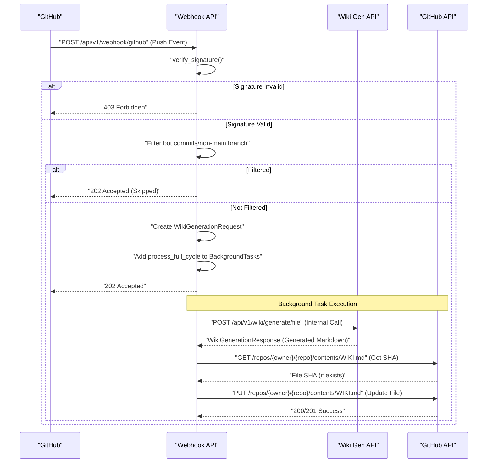
```mermaid
sequenceDiagram
    participant GH as "GitHub"
    participant WA as "Webhook API"
    participant WGA as "Wiki Gen API"
    participant GHA as "GitHub API"

    GH->>WA: "POST /api/v1/webhook/github" (Push Event)
    WA->>WA: "verify_signature()"
    alt Signature Invalid
        WA-->>GH: "403 Forbidden"
    else Signature Valid
        WA->>WA: "Filter bot commits/non-main branch"
        alt Filtered
            WA-->>GH: "202 Accepted (Skipped)"
        else Not Filtered
            WA->>WA: "Create WikiGenerationRequest"
            WA->>WA: "Add process_full_cycle to BackgroundTasks"
            WA-->>GH: "202 Accepted"
            Note over WA,GHA: Background Task Execution
            WA->>WGA: "POST /api/v1/wiki/generate/file" (Internal Call)
            WGA-->>WA: "WikiGenerationResponse (Generated Markdown)"
            WA->>GHA: "GET /repos/{owner}/{repo}/contents/WIKI.md" (Get SHA)
            GHA-->>WA: "File SHA (if exists)"
            WA->>GHA: "PUT /repos/{owner}/{repo}/contents/WIKI.md" (Update File)
            GHA-->>WA: "200/201 Success"
        end
    end
```
Sources: [src/api/v1/endpoints/webhook.py](github_webhook function, process_full_cycle function, update_github_readme function)

## 3. API Data Models

The `src/models/api_schema.py` module defines the Pydantic models used for request and response bodies across the API.

Sources: [src/models/api_schema.py](src/models/api_schema.py)

### 3.1. `WikiGenerationRequest`

This model defines the structure for requests initiating wiki generation. It includes details about the repository and generation preferences.

| Field | Type | Description |
|---|---|---|
| `repo_owner` | `str \| None` | The owner of the repository (user or organization). |
| `repo_name` | `str \| None` | The name of the repository. |
| `repo_type` | `Literal["github", "gitlab", "bitbucket", "local"]` | The type of the repository (default: `github`). |
| `repo_url` | `str \| None` | The URL for cloning a remote repository. |
| `local_path` | `str \| None` | The local path to the repository if `repo_type` is 'local'. |
| `language` | `str` | The language for the generated wiki content (default: `ko`). |
| `is_comprehensive_view` | `bool` | Whether to generate a comprehensive view of the repository (default: `True`). |

**Validator:** The `derive_repo_details` validator automatically extracts `repo_owner` and `repo_name` from `repo_url` if they are not explicitly provided and `repo_type` is `github`.

Sources: [src/models/api_schema.py](WikiGenerationRequest class)

### 3.2. `WikiGenerationResponse`

This model defines the standard response structure for successful wiki generation initiation.

| Field | Type | Description |
|---|---|---|
| `message` | `str` | A message indicating the status of the request. |
| `task_id` | `str` | The ID of the background task initiated. |
| `title` | `str` | The title of the generated wiki. |
| `description` | `str` | The description of the generated wiki. |

Sources: [src/models/api_schema.py](WikiGenerationResponse class)

### 3.3. `TaskStatusResponse`

This model defines the structure for responses when querying the status of a background task.

| Field | Type | Description |
|---|---|---|
| `task_id` | `str` | The ID of the task. |
| `status` | `Literal["in_progress", "completed", "failed"]` | Current status of the task. |
| `result` | `Any \| None` | Result of the task, if completed or failed. |

Sources: [src/models/api_schema.py](TaskStatusResponse class)

## 4. GitHub Webhook Data Models

The `src/models/github_webhook_schema.py` module contains Pydantic models specifically designed to parse the structure of GitHub push event payloads. These models ensure type safety and correct data extraction from incoming webhooks.

Sources: [src/models/github_webhook_schema.py](src/models/github_webhook_schema.py)

Key models include:
*   `GitHubRepositoryOwner`
*   `GitHubRepository`
*   `GitHubPusher`
*   `GitHubCommit`
*   `GitHubPushPayload` (the top-level model for a push event)

## Conclusion

The API endpoints provide a robust and flexible interface for managing wiki generation within the Wiki-As-Readme project. Through dedicated endpoints for file-based and text-based generation, task status monitoring, and automated GitHub webhook integration, the system supports both manual and automated documentation workflows. The use of FastAPI's asynchronous capabilities and Pydantic models ensures a performant, type-safe, and well-defined API surface.

---

<a name="system-architecture"></a>

<details>
<summary>Relevant source files</summary>

The following files were used as context for generating this wiki page:

- [src/app.py](src/app.py)
- [src/server.py](src/server.py)
- [src/agent/llm.py](src/agent/llm.py)
- [src/services/wiki_generator.py](src/services/wiki_generator.py)
- [src/services/repo_fetcher.py](src/services/repo_fetcher.py)
- [src/services/structure_analyzer.py](src/services/structure_analyzer.py)
- [src/services/wiki_formatter.py](src/services/wiki_formatter.py)
- [src/services/notion_sync.py](src/services/notion_sync.py)
- [README.md](README.md)
</details>

# System Architecture

## Introduction

The "Wiki As Readme" project is designed to transform a codebase into a comprehensive wiki, delivered as a single Markdown file or synchronized to external platforms like Notion. Its architecture emphasizes modularity, extensibility, and asynchronous processing to support various LLM providers, repository types, and deployment environments. The system operates as a client-server application, with a Streamlit-based frontend interacting with a FastAPI backend that orchestrates the wiki generation pipeline.

The core objective is to provide a flexible and universal documentation tool capable of deep context analysis, smart structure generation, comprehensive content creation, and automatic diagram generation, all while being model, platform, and deployment agnostic.

## Overall System Architecture

The system follows a clear separation of concerns, dividing functionality into a user-facing frontend and a robust backend API. The frontend handles user interaction and displays results, while the backend manages the complex, resource-intensive tasks of repository analysis, LLM interaction, and content generation. Communication between the frontend and backend occurs via RESTful API calls, with long-running tasks managed asynchronously.

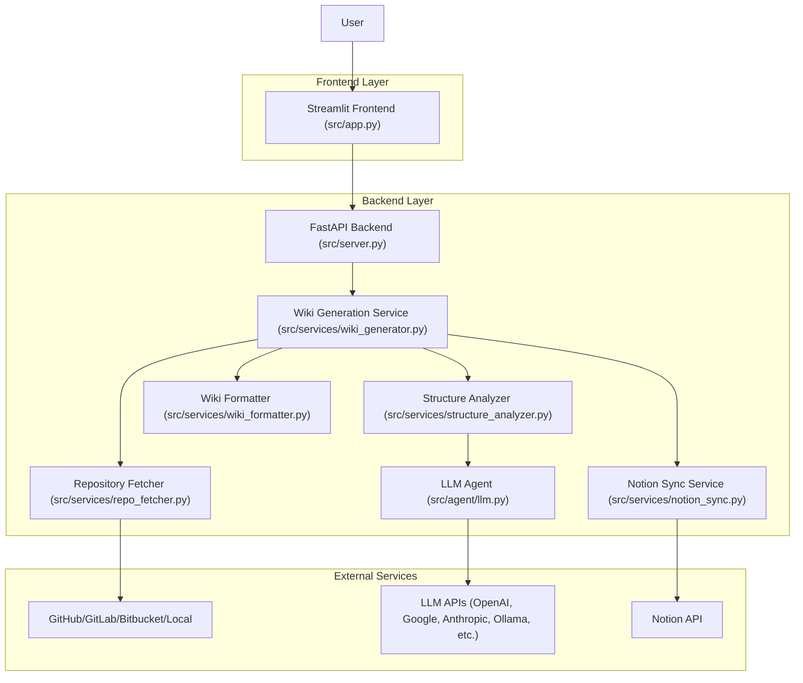
```mermaid
graph TD
    User["User"] --> Frontend["Streamlit Frontend (src/app.py)"]
    Frontend --> API_Gateway["FastAPI Backend (src/server.py)"]
    API_Gateway --> WikiGenService["Wiki Generation Service (src/services/wiki_generator.py)"]
    WikiGenService --> RepoFetcher["Repository Fetcher (src/services/repo_fetcher.py)"]
    WikiGenService --> StructAnalyzer["Structure Analyzer (src/services/structure_analyzer.py)"]
    StructAnalyzer --> LLM_Agent["LLM Agent (src/agent/llm.py)"]
    WikiGenService --> WikiFormatter["Wiki Formatter (src/services/wiki_formatter.py)"]
    WikiGenService --> NotionSync["Notion Sync Service (src/services/notion_sync.py)"]
    RepoFetcher --> GitProviders["GitHub/GitLab/Bitbucket/Local"]
    LLM_Agent --> LLM_APIs["LLM APIs (OpenAI, Google, Anthropic, Ollama, etc.)"]
    NotionSync --> NotionAPI["Notion API"]

    subgraph Frontend Layer
        Frontend
    end

    subgraph Backend Layer
        API_Gateway
        WikiGenService
        RepoFetcher
        StructAnalyzer
        LLM_Agent
        WikiFormatter
        NotionSync
    end

    subgraph External Services
        GitProviders
        LLM_APIs
        NotionAPI
    end
```
Sources: [README.md](Architecture), [src/app.py](main function), [src/server.py](app initialization)

## Frontend Application (Streamlit)

The frontend is built using Streamlit, providing an interactive web interface for users to initiate wiki generation and view results.

### `src/app.py`

This module serves as the entry point for the Streamlit application. It manages user inputs, orchestrates API calls to the backend, handles task status polling, and renders the generated Markdown content, including Mermaid diagrams.

**Key Responsibilities:**
*   **User Interface:** Provides input fields for repository URL/path, language, and generation options.
*   **API Interaction:** Initiates wiki generation tasks (`start_generation_task`) and polls for their status (`poll_task_status`) using `httpx.AsyncClient`.
*   **State Management:** Utilizes Streamlit's `st.session_state` to maintain application state across reruns (e.g., `is_generating`, `task_id`, `generation_result`).
*   **Content Rendering:** Displays generated Markdown, specifically handling and rendering Mermaid diagrams using `streamlit_mermaid`.
*   **History Management:** Lists previously generated wiki files from the local `output` directory.

**Core Functions:**
*   `start_generation_task(request_data: WikiGenerationRequest)`: Sends a POST request to the backend to start a wiki generation task.
*   `poll_task_status(task_id: str)`: Periodically queries the backend for the status of a given task, updating the UI with progress.
*   `render_markdown_with_mermaid(markdown_content: str)`: Parses Markdown content to identify and render Mermaid code blocks separately.
*   `render_generator_page()`: Renders the main page for initiating wiki generation.
*   `render_history_page()`: Renders a page displaying a list of previously generated wiki files.

Sources: [src/app.py](module docstring, start_generation_task, poll_task_status, render_generator_page, render_history_page)

## Backend API (FastAPI)

The backend is a FastAPI application that exposes RESTful endpoints for wiki generation, status checking, and webhook integration. It is designed for high performance and asynchronous operation.

### `src/server.py`

This module is the entry point for the FastAPI server. It sets up the application, includes API routers, and defines basic health checks.

**Key Responsibilities:**
*   **API Gateway:** Provides the `/api/v1` base path for all API endpoints.
*   **Routing:** Integrates routers for wiki generation (`src.api.v1.endpoints.wiki`) and webhook handling (`src.api.v1.endpoints.webhook`).
*   **Health Check:** Exposes a root endpoint (`/`) to verify server availability.
*   **Logging:** Configures `loguru` for structured logging.

**Core Endpoints:**
*   `GET /`: Health check.
*   `POST /api/v1/wiki/generate/file`: Initiates wiki generation and saves the result to a file on the server.
*   `GET /api/v1/wiki/status/{task_id}`: Retrieves the current status and result of a background generation task.
*   `POST /api/v1/webhook/github`: Handles GitHub push event webhooks to trigger automated wiki generation.

Sources: [src/server.py](module docstring, app initialization, health_check, app.include_router calls)

## Core Wiki Generation Pipeline

The heart of the system is the wiki generation pipeline, orchestrated by `WikiGenerationService`. This pipeline involves several specialized services working in concert.

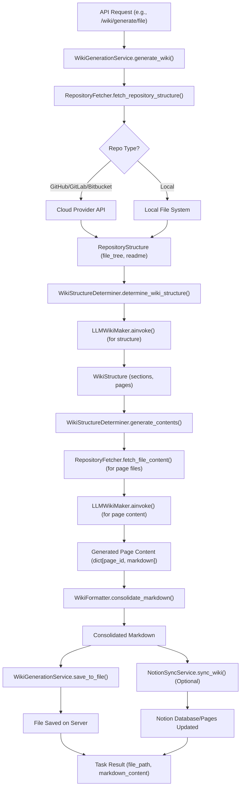
```mermaid
graph TD
    A["API Request (e.g., /wiki/generate/file)"] --> B["WikiGenerationService.generate_wiki()"]
    B --> C["RepositoryFetcher.fetch_repository_structure()"]
    C --> D{"Repo Type?"}
    D -- "GitHub/GitLab/Bitbucket" --> E["Cloud Provider API"]
    D -- "Local" --> F["Local File System"]
    E --> G["RepositoryStructure (file_tree, readme)"]
    F --> G
    G --> H["WikiStructureDeterminer.determine_wiki_structure()"]
    H --> I["LLMWikiMaker.ainvoke() (for structure)"]
    I --> J["WikiStructure (sections, pages)"]
    J --> K["WikiStructureDeterminer.generate_contents()"]
    K --> L["RepositoryFetcher.fetch_file_content() (for page files)"]
    L --> M["LLMWikiMaker.ainvoke() (for page content)"]
    M --> N["Generated Page Content (dict[page_id, markdown])"]
    N --> O["WikiFormatter.consolidate_markdown()"]
    O --> P["Consolidated Markdown"]
    P --> Q["WikiGenerationService.save_to_file()"]
    P --> R["NotionSyncService.sync_wiki() (Optional)"]
    Q --> S["File Saved on Server"]
    R --> T["Notion Database/Pages Updated"]
    S --> U["Task Result (file_path, markdown_content)"]
    T --> U
```
Sources: [src/services/wiki_generator.py](generate_wiki_with_structure), [src/services/repo_fetcher.py](fetch_repository_structure), [src/services/structure_analyzer.py](determine_wiki_structure, generate_page_content), [src/agent/llm.py](ainvoke), [src/services/wiki_formatter.py](consolidate_markdown), [src/services/notion_sync.py](sync_wiki)

### 1. Wiki Generation Service

### `src/services/wiki_generator.py`

This is the central orchestration service for the entire wiki generation process. It coordinates the fetching of repository data, determination of wiki structure, generation of content, and final formatting/saving.

**Key Responsibilities:**
*   **Pipeline Orchestration:** Manages the flow from repository fetching to final markdown consolidation.
*   **Request Validation:** Ensures that the `WikiGenerationRequest` is valid for the specified repository type.
*   **Resource Management:** Handles the lifecycle of `RepositoryFetcher` and `WikiStructureDeterminer` instances.
*   **Output Persistence:** Saves the final generated markdown content to a specified file path.

**Core Methods:**
*   `generate_wiki_with_structure()`: The main method that executes the full pipeline, returning the consolidated markdown, structure, and individual page contents.
*   `_initialize_and_determine()`: Fetches repository structure and initiates the structure determination phase.
*   `save_to_file(markdown_content: str)`: Writes the generated markdown to a file on the server.

Sources: [src/services/wiki_generator.py](module docstring, generate_wiki_with_structure, _initialize_and_determine, save_to_file)

### 2. Repository Fetching

### `src/services/repo_fetcher.py`

This service abstracts the process of fetching repository information (file tree, README, file contents) from various sources.

**Key Responsibilities:**
*   **Provider Abstraction:** Uses a `_PROVIDER_MAP` to dynamically instantiate the correct `RepositoryProvider` (GitHub, GitLab, Bitbucket, Local) based on the request.
*   **Structure Fetching:** Retrieves the overall file tree and README content of a repository.
*   **File Content Fetching:** Fetches the content of specific files as needed during content generation.
*   **Resource Cleanup:** Manages the closing of underlying HTTP clients or local file handles.

**Core Methods:**
*   `__init__(self, request: WikiGenerationRequest)`: Initializes the appropriate repository provider.
*   `fetch_repository_structure()`: Delegates to the selected provider to get the `RepositoryStructure`.
*   `fetch_file_content(file_path: str)`: Delegates to the selected provider to retrieve a file's content.

Sources: [src/services/repo_fetcher.py](module docstring, _PROVIDER_MAP, fetch_repository_structure, fetch_file_content)

### 3. Wiki Structure and Content Analysis

### `src/services/structure_analyzer.py`

This service is responsible for interacting with the LLM to determine the optimal wiki structure and then generating the content for each page.

**Key Responsibilities:**
*   **Structure Determination:** Prompts the LLM with the repository file tree and README to generate a `WikiStructure` (sections and pages hierarchy).
*   **Content Generation:** For each page in the determined structure, it fetches relevant source files, formats them, and prompts the LLM to generate the page's markdown content.
*   **Concurrency Control:** Uses `asyncio.Semaphore` to limit the number of concurrent LLM calls, preventing rate limit issues and managing resource usage.
*   **Prompt Management:** Loads and renders Jinja2 templates for LLM prompts from YAML files.

**Core Methods:**
*   `determine_wiki_structure(...)`: Orchestrates the LLM call to define the overall wiki structure.
*   `generate_page_content(page: WikiPage, language: str)`: Fetches files, prepares the prompt, and calls the LLM to generate content for a single wiki page.
*   `_fetch_and_format_files(page: WikiPage)`: Fetches multiple files in parallel for a given page and formats them for the LLM prompt.
*   `_load_prompt_template(prompt_path: str)`: Caches and loads LLM prompt templates from YAML files.

Sources: [src/services/structure_analyzer.py](module docstring, determine_wiki_structure, generate_page_content, _fetch_and_format_files, _load_prompt_template)

### 4. LLM Integration

### `src/agent/llm.py`

This module provides a unified interface for interacting with various Large Language Models (LLMs) using LiteLLM. It handles provider-specific configurations and supports structured output.

**Key Responsibilities:**
*   **LLM Abstraction:** Wraps LiteLLM to provide a consistent API for different LLM providers (Google, OpenAI, Anthropic, Ollama, etc.).
*   **Configuration Management:** Configures LLM model names, API keys, base URLs, and other parameters based on environment settings.
*   **Structured Output:** Supports Pydantic models for structured JSON output from LLMs, either natively or by parsing JSON from markdown code blocks.
*   **Error Handling:** Manages environment variable setup for API keys and raises errors for unsupported providers or missing credentials.

**Core Class:**
*   `LLMWikiMaker[T: BaseModel]`: A generic class that can be initialized with a `response_schema` for type-safe structured output.

**Core Methods:**
*   `_configure_llm()`: Determines the LLM provider and sets up model-specific parameters and environment variables.
*   `ainvoke(self, input_data: Any) -> T | str`: Asynchronously calls the configured LLM with the given input, returning either a parsed Pydantic model instance or a raw string.
*   `_extract_json(self, text: str)`: Helper to extract JSON content from markdown code blocks.

Sources: [src/agent/llm.py](module docstring, LLMWikiMaker class, _configure_llm, ainvoke, _extract_json)

### 5. Wiki Formatting

### `src/services/wiki_formatter.py`

This service is responsible for taking the generated wiki structure and individual page contents and consolidating them into a single, well-formatted Markdown string.

**Key Responsibilities:**
*   **Markdown Consolidation:** Combines the `WikiStructure` (title, description, page order) and the content of individual pages into a single Markdown document.
*   **Table of Contents Generation:** Automatically creates a table of contents with internal links (anchors) to each page.
*   **Filename Sanitization:** Provides a utility to create safe filenames from page titles.

**Core Methods:**
*   `consolidate_markdown(structure: WikiStructure, pages: dict[str, str]) -> str`: The main method to assemble the final Markdown output.
*   `sanitize_filename(name: str) -> str`: Cleans a string to be suitable for use as a filename or Markdown anchor.

Sources: [src/services/wiki_formatter.py](module docstring, consolidate_markdown, sanitize_filename)

## External Integrations

### `src/services/notion_sync.py`

This service provides functionality to synchronize the generated wiki content to a Notion database and its associated pages.

**Key Responsibilities:**
*   **Notion API Interaction:** Uses the `notion-client` library to interact with the Notion API.
*   **Database Management:** Finds or creates a database item (page) for the repository in Notion.
*   **Content Synchronization:** Converts Markdown content into Notion blocks and appends them to Notion pages.
*   **Structure Mapping:** Maps the wiki's hierarchical structure to Notion pages, creating child pages as needed.
*   **Error Handling:** Includes retry logic for "Payload Too Large" errors when appending blocks.

**Core Methods:**
*   `sync_wiki(repo_name: str, structure: WikiStructure, pages_content: dict[str, str])`: The main method to initiate the synchronization process.
*   `_upsert_database_item(repo_name: str)`: Creates or retrieves the main Notion page for the repository.
*   `_clear_existing_content(page_id: str)`: Clears previous content from a Notion page before syncing new content.
*   `_append_blocks_safe(page_id: str, blocks: list[dict[str, Any]])`: Appends blocks to a Notion page, handling batching and payload size limits.

Sources: [src/services/notion_sync.py](module docstring, NotionSyncService class, sync_wiki, _upsert_database_item, _clear_existing_content, _append_blocks_safe)

## Conclusion

The "Wiki As Readme" system architecture is designed for flexibility, scalability, and maintainability. By separating concerns into distinct services for frontend, backend API, repository fetching, LLM interaction, and content formatting, the system can easily adapt to new LLM providers, repository types, and output formats. The asynchronous nature of the backend, coupled with robust error handling and structured logging, ensures efficient and reliable wiki generation for diverse codebases.

---

<a name="contribution-guide"></a>

<details>
<summary>Relevant source files</summary>

The following files were used as context for generating this wiki page:

- [LICENSE](LICENSE)
- [README.md](README.md)
- [.pre-commit-config.yaml](.pre-commit-config.yaml)
- [.github/workflows/version-sync.yml](.github/workflows/version-sync.yml)
</details>

# Contribution Guide

## Introduction

The "Wiki As Readme" project thrives on community contributions. This guide outlines the process, best practices, and technical considerations for anyone looking to contribute to the project, whether it's fixing a bug, adding a new feature, or improving documentation. We welcome all contributions that help make this tool more robust, flexible, and user-friendly. By following these guidelines, you can ensure your contributions are integrated smoothly and efficiently.

Sources: [README.md](https://github.com/catuscio/wiki-as-readme/blob/main/README.md#contributing)

## General Contribution Workflow

Contributing to "Wiki As Readme" follows a standard open-source contribution model. The primary method for contributing code or significant changes is via Pull Requests (PRs) on the project's GitHub repository.

### Steps to Contribute

The general workflow for contributing is as follows:

1.  **Fork the Project:** Create a fork of the `wiki-as-readme` repository to your personal GitHub account.
2.  **Create Your Feature Branch:** From your forked repository, create a new branch for your specific feature or bug fix. Use a descriptive name (e.g., `feature/add-ollama-support`, `fix/typo-in-docs`).
    ```bash
    git checkout -b feature/AmazingFeature
    ```
3.  **Commit Your Changes:** Make your desired changes, ensuring they adhere to the project's code style and quality standards. Commit your changes with clear and concise messages.
    ```bash
    git commit -m 'Add some AmazingFeature'
    ```
4.  **Push to the Branch:** Push your local branch with the committed changes to your forked repository on GitHub.
    ```bash
    git push origin feature/AmazingFeature
    ```
5.  **Open a Pull Request:** Navigate to the original `wiki-as-readme` repository on GitHub and open a Pull Request from your feature branch to the `main` branch. Provide a detailed description of your changes, why they are necessary, and any relevant context.

Sources: [README.md](https://github.com/catuscio/wiki-as-readme/blob/main/README.md#contributing)

### Contribution Workflow Diagram

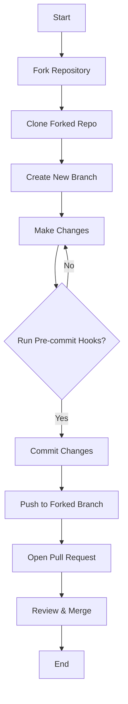
```mermaid
graph TD
    A["Start"] --> B["Fork Repository"];
    B --> C["Clone Forked Repo"];
    C --> D["Create New Branch"];
    D --> E["Make Changes"];
    E --> F{"Run Pre-commit Hooks?"};
    F -- "Yes" --> G["Commit Changes"];
    F -- "No" --> E;
    G --> H["Push to Forked Branch"];
    H --> I["Open Pull Request"];
    I --> J["Review & Merge"];
    J --> K["End"];
```

### Code Style and Quality

To maintain code quality and consistency, "Wiki As Readme" utilizes `ruff` for linting and formatting. These tools are integrated via pre-commit hooks.

*   **Ruff:** A fast Python linter and formatter.
*   **Ruff Format:** Ensures consistent code formatting.

When you attempt to commit changes, these hooks will automatically run. If any issues are detected, the commit will be blocked, and you will be prompted to fix them. This ensures that all code pushed to the repository adheres to the defined style guidelines.

Sources: [.pre-commit-config.yaml](.pre-commit-config.yaml)

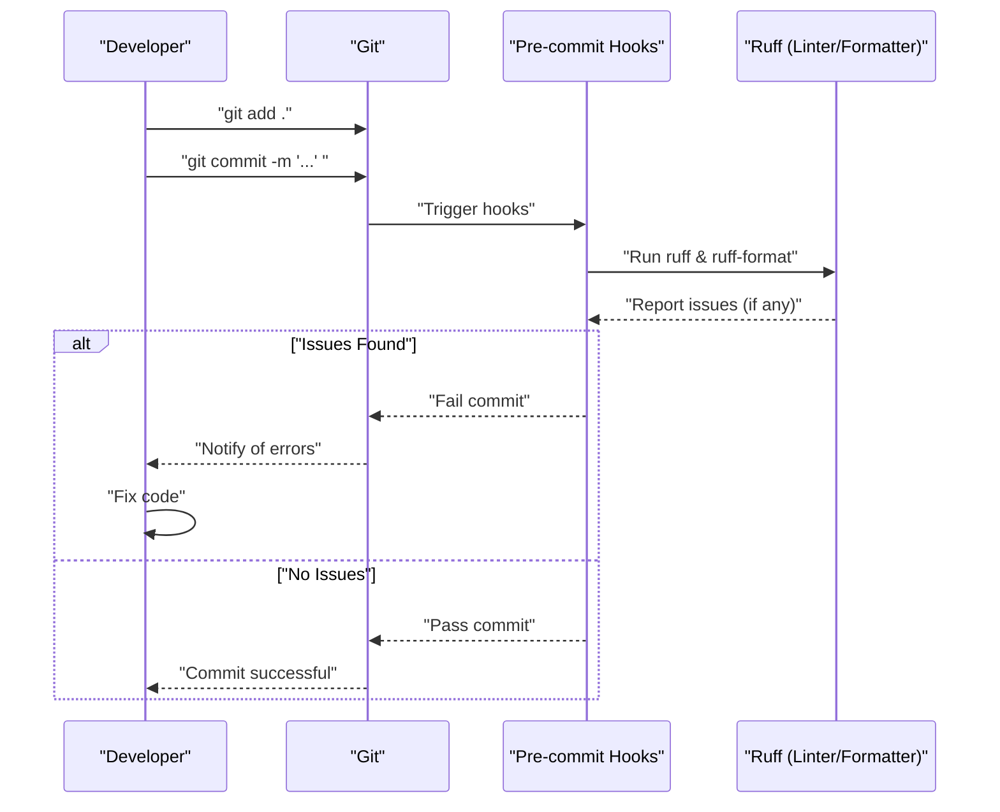
```mermaid
sequenceDiagram
    participant Dev as "Developer"
    participant Git as "Git"
    participant PreCommit as "Pre-commit Hooks"
    participant Ruff as "Ruff (Linter/Formatter)"

    Dev->>Git: "git add ."
    Dev->>Git: "git commit -m '...' "
    Git->>PreCommit: "Trigger hooks"
    PreCommit->>Ruff: "Run ruff & ruff-format"
    Ruff-->>PreCommit: "Report issues (if any)"
    alt "Issues Found"
        PreCommit-->>Git: "Fail commit"
        Git-->>Dev: "Notify of errors"
        Dev->>Dev: "Fix code"
    else "No Issues"
        PreCommit-->>Git: "Pass commit"
        Git-->>Dev: "Commit successful"
    end
```

## Setting Up for Development

To contribute effectively, you'll need to set up a local development environment. There are two primary methods: using Docker Compose or setting up a local Python environment.

### Local Python Development

This method is recommended for developers who want to modify the source code directly without Docker.

**Prerequisites:**
*   Python 3.12+
*   `uv` (a fast Python package installer and resolver)

**Steps:**

1.  **Clone the Repository:**
    ```bash
    git clone https://github.com/catuscio/wiki-as-readme.git
    cd wiki-as-readme
    ```
2.  **Install Dependencies:**
    ```bash
    uv sync
    source .venv/bin/activate
    ```
3.  **Configure Environment Variables:** Copy `.env example` to `.env` and populate it with necessary API keys and configurations.
4.  **Run Backend (FastAPI):**
    ```bash
    uv run uvicorn src.server:app --reload --port 8000
    ```
5.  **Run Frontend (Streamlit):**
    ```bash
    uv run streamlit run src/app.py
    ```

Sources: [README.md](https://github.com/catuscio/wiki-as-readme/blob/main/README.md#3-local-python-development)

### Docker Compose (Local)

This method allows you to run the entire application (UI and API) locally with a single command, without installing Python dependencies directly on your system.

**Steps:**

1.  **Configure `.env`:** Copy `.env example` to `.env`. Set your LLM API keys (e.g., `LLM_PROVIDER`, `OPENAI_API_KEY`) and optionally Notion Sync settings or `LOCAL_REPO_PATH`.
2.  **Run Application:**
    ```bash
    docker-compose up --build
    ```
3.  **Access:**
    *   **Web UI:** `http://localhost:8501`
    *   **API Docs:** `http://localhost:8000/docs`

Sources: [README.md](https://github.com/catuscio/wiki-as-readme/blob/main/README.md#2-docker-compose-local)

## Understanding Automated Workflows

The project utilizes GitHub Actions for automation. Contributors should be aware of these workflows as they impact how changes are integrated and how the project maintains consistency.

### Wiki-As-Readme GitHub Action

The `update-wiki.yml` workflow automates the generation and update of the `WIKI.md` file. This workflow runs on `push` to the `main` branch (excluding changes to `README.md`, `WIKI.md`, or the workflow itself) and can also be triggered manually via `workflow_dispatch`.

**Key aspects for contributors:**

*   **Manual Trigger:** You can test the action with custom inputs (language, LLM provider, model, Notion sync, commit method) from the GitHub Actions tab.
*   **Commit Method:** The action can either directly push changes to the branch or create a Pull Request for review. This is configurable via `commit_method` input.
*   **Environment Variables:** The action relies heavily on environment variables for configuration (LLM keys, Notion keys, GitHub token). When contributing to the action itself, ensure proper handling of these.
*   **GCP Credentials:** A step is included to create and clean up a GCP credentials file if the Google LLM provider is used.

If you are contributing to the core logic of how the wiki is generated, understanding this workflow is crucial for testing your changes in an automated context.

Sources: [.github/workflows/update-wiki.yml](.github/workflows/update-wiki.yml)

### Version Synchronization Workflow

The `version-sync.yml` workflow ensures that the project version, defined in `pyproject.toml`, is consistently updated across other relevant files. This workflow runs on `push` to the `develop` branch when `pyproject.toml` changes, or can be triggered manually.

**Files updated by this workflow:**

*   `src/server.py`
*   `Dockerfile`
*   `Dockerfile.action`
*   `Dockerfile.server`

**Implications for contributors:**
If your contribution involves updating the project version, you should only modify `pyproject.toml`. The `version-sync.yml` workflow will automatically propagate this change to other necessary files. This prevents manual errors and ensures version consistency across the project's components.

Sources: [.github/workflows/version-sync.yml](.github/workflows/version-sync.yml)

## License and Acknowledgments

### License

This project is licensed under the **MIT License**. By contributing, you agree that your contributions will be licensed under the same terms. Please see the `LICENSE` file for full details.

Sources: [LICENSE](LICENSE), [README.md](https://github.com/catuscio/wiki-as-readme/blob/main/README.md#license)

### Acknowledgments

The project acknowledges and appreciates the foundational work and inspiration from:

*   **deepwiki-open** by AsyncFuncAI, which heavily influenced core logic.
*   Various open-source libraries used throughout the project.
*   The general need for improved automated documentation.

Sources: [README.md](https://github.com/catuscio/wiki-as-readme/blob/main/README.md#acknowledgments)

## Conclusion

Your contributions are vital to the growth and improvement of "Wiki As Readme". By following this guide, you can help maintain a high standard of code quality, ensure smooth integration of new features, and contribute to a tool that benefits the wider development community. We look forward to your Pull Requests!

---
