# Wiki As Readme Documentation

Comprehensive documentation for Wiki As Readme, a flexible AI documentation tool that turns codebases into wikis. It supports various LLMs, Git platforms, and deployment methods.

## Table of Contents

- [Introduction to Wiki As Readme](#introduction-to-wiki-as-readme)
- [Core Features](#core-features)
- [Universal Compatibility](#universal-compatibility)
- [Using as a GitHub Action](#using-as-a-github-action)
- [Docker Compose & Local Development](#docker-compose-&-local-development)
- [Deploying as a Server with Webhooks](#deploying-as-a-server-with-webhooks)
- [Configuration Reference](#configuration-reference)
- [API Endpoints](#api-endpoints)
- [System Architecture](#system-architecture)
- [Core Components Overview](#core-components-overview)
- [Contributing to Wiki As Readme](#contributing-to-wiki-as-readme)

---

<a name="introduction-to-wiki-as-readme"></a>

<details>
<summary>Relevant source files</summary>

The following files were used as context for generating this wiki page:

- [README.md](README.md)
- [action.yml](action.yml)
- [pyproject.toml](pyproject.toml)
</details>

# Introduction to Wiki As Readme

**Wiki As Readme** is a versatile AI-powered documentation tool designed to transform any codebase into a comprehensive wiki or `README.md` file rapidly. It emphasizes universal compatibility, adapting to various LLM providers, Git platforms, and deployment environments. The tool aims to provide a "drop-in" solution for automated documentation, generating detailed content, including architecture overviews, installation guides, API references, and visual diagrams.

This project leverages modern asynchronous programming with FastAPI and Streamlit for its backend and frontend, respectively, and integrates with a wide array of Large Language Models (LLMs) through LiteLLM. It supports multiple usage modes, from CI/CD integration via GitHub Actions to local development and long-running API services.

## Core Philosophy and Universal Compatibility

Wiki As Readme is built on the principle of being "truly pluggable," offering unparalleled flexibility across its operational stack. This ensures it can integrate into virtually any development workflow or infrastructure.

### Model Agnostic (Powered by LiteLLM)
The tool's LLM integration is handled by LiteLLM, providing a unified interface to over 100 different language models. This allows users to choose their preferred model without changing the core application logic.
*   **Commercial APIs:** Supports major providers like Google Vertex AI (Gemini), OpenAI (GPT-4), Anthropic (Claude), and xAI (Grok).
*   **Open/Local Models:** Integrates with platforms like Ollama, OpenRouter, and HuggingFace for local or community-driven models.
*   **On-Premise:** Can connect securely to private, self-hosted LLM endpoints.
Sources: [README.md](Model Agnostic (Powered by LiteLLM))

### Platform Agnostic
Wiki As Readme can analyze code from various sources, making it adaptable to different repository hosting solutions.
*   **Cloud Repositories:** Seamlessly works with GitHub, GitLab, and Bitbucket.
*   **Local Development:** Capable of analyzing code directly from a local file system, eliminating the need to push changes to a remote repository.
*   **Private/Enterprise:** Offers full support for private instances and self-hosted Git servers.
Sources: [README.md](Platform Agnostic)

### Deployment Agnostic
The tool is designed for flexible deployment, fitting into diverse operational contexts.
*   **CI/CD Integration:** Can be easily incorporated into CI/CD pipelines, such as GitHub Actions, for automated documentation updates.
*   **Containerization:** Deployable via Docker Compose for isolated and reproducible environments.
*   **Service Deployment:** Can run as a long-running API server, supporting webhooks for event-driven documentation generation.
*   **CLI:** Provides a command-line interface for local, on-demand documentation generation during development.
Sources: [README.md](Deployment Agnostic)

## Key Features

Wiki As Readme provides a robust set of features to ensure high-quality and comprehensive documentation.

*   **🧠 Deep Context Analysis:** The tool analyzes the project's file structure and inter-file relationships to build a comprehensive understanding of the codebase architecture before generating content.
*   **📦 Smart Structure Generation:** It automatically determines a logical hierarchy for the documentation, organizing content into sections and pages for optimal readability.
*   **🔍 Comprehensive Content:** Generates detailed documentation pages, including architecture overviews, installation guides, API references, and core concept explanations.
*   **📊 Automatic Diagrams:** Integrates Mermaid.js to automatically generate visual diagrams (Flowcharts, Sequence diagrams, Class diagrams) that illustrate project architecture and data flows.
*   **🚗 Hybrid Output:** Produces both individual Markdown files suitable for a wiki and a single consolidated `README.md` file.
*   **⚡ Async & Scalable:** Built with FastAPI and AsyncIO, ensuring non-blocking, efficient generation of documentation, even for large projects.
Sources: [README.md](Core Features)

## Usage Modes

Wiki As Readme offers several distinct usage modes to cater to different user needs and integration points.

### 1. GitHub Action (Recommended)
This mode automates documentation updates within a CI/CD pipeline. A GitHub Actions workflow can be configured to trigger documentation generation on specific events, such as pushes to the `main` branch.

**Workflow Example:**
```yaml
name: Update Wiki README

on:
  push:
    branches:
      - main
    paths-ignore:
      - 'README.md'
      - 'WIKI.md'
      - '.github/workflows/WIKI-AS-README-AS-ACTION.yml'
  workflow_dispatch:

jobs:
  generate-and-commit:
    runs-on: ubuntu-latest
    permissions:
      contents: write

    env:
      OUTPUT_FILE: "WIKI.md"

    steps:
      - name: Checkout code
        uses: actions/checkout@v4

      - name: Generate Wiki Content
        uses: docker://ghcr.io/catuscio/wiki-as-readme-action:latest
        env:
          LANGUAGE: "en"
          OUTPUT_FILE: ${{ env.OUTPUT_FILE }}
          LLM_PROVIDER: "google"
          MODEL_NAME: "gemini-2.5-flash"
          GCP_PROJECT_NAME: ${{ secrets.GCP_PROJECT_NAME }}
          GCP_MODEL_LOCATION: ${{ secrets.GCP_MODEL_LOCATION }}
          GOOGLE_APPLICATION_CREDENTIALS: /github/workspace/gcp-key.json
          GIT_API_TOKEN: ${{ secrets.GITHUB_TOKEN }}

      - name: Commit and Push changes
        uses: stefanzweifel/git-auto-commit-action@v5
        with:
          commit_message: "docs: ✨Update ${{ env.OUTPUT_FILE }} via Wiki-As-Readme Action"
          file_pattern: ${{ env.OUTPUT_FILE }}
```
Sources: [README.md](1. GitHub Action (Recommended)), [action.yml](action.yml)

### 2. Docker Compose (Local)
For local execution with minimal setup, Docker Compose provides a convenient way to run the entire application stack, including the web UI and API.
```bash
docker-compose up --build
```
Access points:
*   **Web UI**: `http://localhost:8501`
*   **API Docs**: `http://localhost:8000/docs`
Sources: [README.md](2. Docker Compose (Local))

### 3. Local Python Development
Developers can run the application directly from source for modification or without Docker. This requires Python 3.12+ and `uv` for dependency management.
```bash
git clone https://github.com/catuscio/wiki-as-readme.git
cd wiki-as-readme
uv sync
source .venv/bin/activate
uv run uvicorn src.server:app --reload --port 8000 # Backend
uv run streamlit run src/app.py # Frontend
```
Sources: [README.md](3. Local Python Development), [pyproject.toml](project.requires-python)

### 4. Server & Webhooks
The API server can be deployed as a long-running service to handle requests or webhooks, such as GitHub push events.
*   **Endpoint**: `POST /api/v1/webhook/github`
*   **Payload**: Standard GitHub push event payload.
*   **Behavior**: Triggers a background task to generate and commit the wiki for the repository.
Sources: [README.md](4. Server & Webhooks)

## Configuration Reference

Configuration is primarily managed through environment variables, which can be set in a `.env` file or directly in the deployment environment (e.g., GitHub Actions secrets).

| Category | Variable | Description | Example | Source |
|---|---|---|---|---|
| **General** | `LANGUAGE` | Language for generated content | `en` | [README.md](Configuration Reference (.env)), [action.yml](inputs.language) |
| | `OUTPUT_FILE` | Filename to save generated content | `WIKI.md` | [README.md](Configuration Reference (.env)), [action.yml](inputs.output_file) |
| **LLM Provider** | `LLM_PROVIDER` | LLM provider to use | `google`, `openai`, `ollama` | [README.md](Configuration Reference (.env)), [action.yml](inputs.llm_provider) |
| | `MODEL_NAME` | Specific model identifier | `gemini-2.5-flash` | [README.md](Configuration Reference (.env)), [action.yml](inputs.model_name) |
| | `LLM_BASE_URL` | Custom base URL for LLM API | `http://localhost:11434` | [action.yml](inputs.llm_base_url) |
| **Auth** | `OPENAI_API_KEY` | OpenAI API Key | `sk-...` | [README.md](Configuration Reference (.env)), [action.yml](inputs.openai_api_key) |
| | `ANTHROPIC_API_KEY` | Anthropic API Key | `sk-...` | [action.yml](inputs.anthropic_api_key) |
| | `OPENROUTER_API_KEY` | OpenRouter API Key | `sk-...` | [action.yml](inputs.openrouter_api_key) |
| | `XAI_API_KEY` | xAI API Key | `sk-...` | [action.yml](inputs.xai_api_key) |
| | `GIT_API_TOKEN` | GitHub/GitLab API Token for private repos | `ghp_...` | [action.yml](inputs.git_api_token) |
| **Google Cloud** | `GCP_PROJECT_NAME` | Vertex AI Project ID | `my-genai-project` | [README.md](Configuration Reference (.env)), [action.yml](inputs.gcp_project_name) |
| | `GCP_MODEL_LOCATION` | GCP Model Location | `us-central1` | [action.yml](inputs.gcp_model_location) |
| | `GOOGLE_APPLICATION_CREDENTIALS` | GCP Service Account JSON Key (Content or Path) | `/path/to/key.json` | [action.yml](inputs.google_application_credentials) |
| **Advanced LLM** | `USE_STRUCTURED_OUTPUT` | Use native JSON mode for LLM | `true` | [README.md](Configuration Reference (.env)), [action.yml](inputs.use_structured_output) |
| | `TEMPERATURE` | LLM temperature (0.0 to 1.0) | `0.0` | [action.yml](inputs.temperature) |
| | `MAX_RETRIES` | Max retry attempts for LLM calls | `3` | [action.yml](inputs.max_retries) |
| | `MAX_CONCURRENCY` | Max parallel LLM calls | `5` | [action.yml](inputs.max_concurrency) |
| **Filtering** | `IGNORED_PATTERNS` | JSON array of glob patterns to exclude | `'["*.log", "node_modules/*"]'` | [README.md](Configuration Reference (.env)), [action.yml](inputs.ignored_patterns) |

## API Reference

The backend API is built with FastAPI, providing interactive Swagger documentation at `/docs` when the server is running.

### Wiki Generation Endpoints

*   **`POST /api/v1/wiki/generate/file`**
    *   **Description:** Initiates a background task to generate the wiki and saves the output as a Markdown file on the server.
    *   **Request Body Example:**
        ```json
        {
          "repo_url": "https://github.com/owner/repo",
          "repo_type": "github",
          "language": "en",
          "is_comprehensive_view": true
        }
        ```

*   **`POST /api/v1/wiki/generate/text`**
    *   **Description:** Starts a background task to generate the wiki. The resulting Markdown text is stored within the task status for retrieval.

*   **`GET /api/v1/wiki/status/{task_id}`**
    *   **Description:** Retrieves the current status and the final result (if completed) of a specific wiki generation task.

### Webhook Endpoints

*   **`POST /api/v1/webhook/github`**
    *   **Description:** Endpoint designed to receive GitHub Webhook push events. Upon receiving a push event to the `main` branch, it triggers an automatic wiki generation for the associated repository.
Sources: [README.md](API Reference)

## Architecture

Wiki As Readme employs a modern, decoupled architecture to ensure scalability, maintainability, and flexibility.

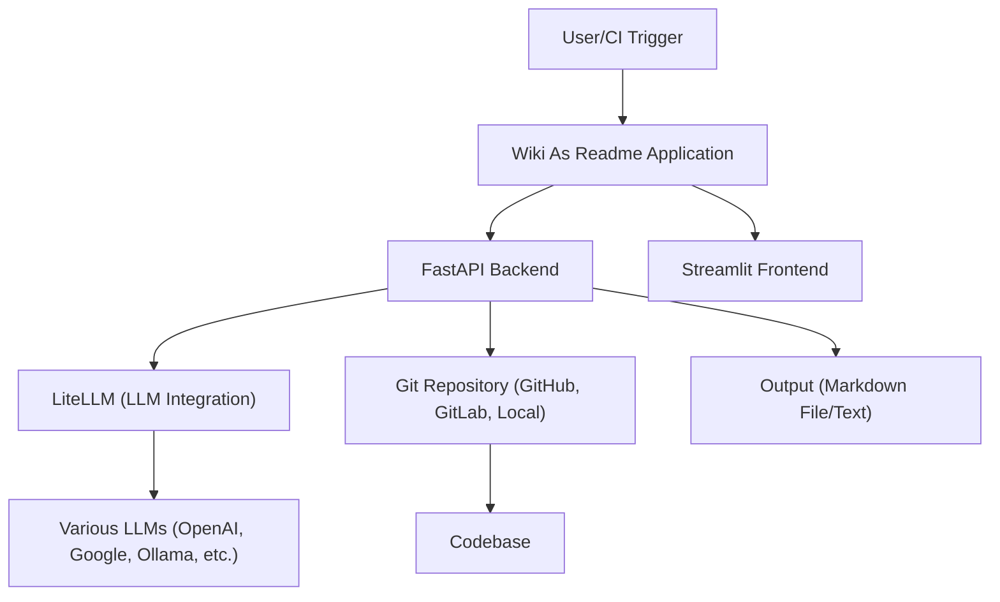

*   **Frontend:** [Streamlit](https://streamlit.io/) is used to build the interactive user interface, allowing users to configure and trigger documentation generation.
*   **Backend:** [FastAPI](https://fastapi.tiangolo.com/) powers the REST API, handles background tasks for documentation generation, and manages webhook integrations.
*   **LLM Integration:** [LiteLLM](https://docs.litellm.ai/) provides a unified and simplified interface for interacting with over 100 different Large Language Models, abstracting away provider-specific API calls.
*   **Data Models:** [Pydantic](https://docs.pydantic.dev/) is utilized for data validation, settings management, and ensuring type safety, especially for structured LLM outputs.
*   **Diagrams:** [Mermaid.js](https://mermaid.js.org/) is integrated to generate various types of diagrams (flowcharts, sequence diagrams, class diagrams) directly within the Markdown output.
Sources: [README.md](Architecture), [pyproject.toml](project.dependencies), [pyproject.toml](project.optional-dependencies)

## GitHub Action Workflow Diagram

The following sequence diagram illustrates the typical flow when using Wiki As Readme as a GitHub Action.

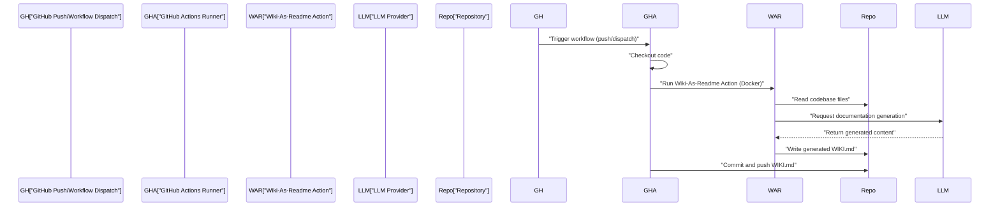
Sources: [README.md](1. GitHub Action (Recommended)), [action.yml](action.yml)

## Conclusion

Wiki As Readme offers a powerful, flexible, and highly compatible solution for automating codebase documentation. By supporting a wide range of LLMs, Git platforms, and deployment methods, it aims to be the ultimate "drop-in" tool for generating comprehensive and structured wikis or `README.md` files. Its feature set, including deep context analysis, automatic diagram generation, and hybrid output, makes it an invaluable asset for maintaining up-to-date and high-quality project documentation.

---

<a name="core-features"></a>

<details>
<summary>Relevant source files</summary>

The following files were used as context for generating this wiki page:

- [README.md](README.md)
- [src/services/wiki_generator.py](src/services/wiki_generator.py)
- [src/services/structure_analyzer.py](src/services/structure_analyzer.py)
- [src/prompts/wiki_contents_generator.yaml](src/prompts/wiki_contents_generator.yaml)
</details>

# Core Features

## Introduction

"Wiki As Readme" is designed to transform codebases into comprehensive documentation with minimal effort. This page outlines the core features that enable its flexibility, power, and automation. These features span universal compatibility with various models, platforms, and deployment methods, alongside intelligent content generation capabilities like deep context analysis, smart structure generation, and automatic diagramming. The underlying architecture leverages asynchronous processing for scalability and efficiency.

## Universal Compatibility

A foundational aspect of "Wiki As Readme" is its commitment to universal compatibility, ensuring it can integrate into virtually any development environment or workflow. This pluggable design is achieved through three key pillars:

### Model Agnostic (Powered by LiteLLM)
The system can interface with a wide array of Large Language Models (LLMs), both commercial and open-source. This flexibility is primarily enabled by [LiteLLM](https://docs.litelllm.ai/), which provides a unified API for over 100 LLMs.
*   **Commercial APIs:** Supports Google Vertex AI (Gemini), OpenAI (GPT-4), Anthropic (Claude), xAI (Grok).
*   **Open/Local Models:** Integrates with Ollama, OpenRouter, and HuggingFace models.
*   **On-Premise:** Can connect to private LLM endpoints for secure, internal use.
Sources: [README.md](Model Agnostic (Powered by LiteLLM) section)

### Platform Agnostic
"Wiki As Readme" is designed to work seamlessly across different code hosting platforms and local environments.
*   **Cloud Repos:** Full support for GitHub, GitLab, and Bitbucket.
*   **Local Development:** Ability to analyze code directly from the local file system, facilitating rapid iteration without needing to push changes.
*   **Private/Enterprise:** Compatibility with private instances and self-hosted Git servers.
Sources: [README.md](Platform Agnostic section)

### Deployment Agnostic
The tool offers multiple deployment options to fit various operational needs, from automated CI/CD pipelines to long-running services.
*   **CI/CD:** Can be integrated into GitHub Actions workflows for automated documentation updates.
*   **Container:** Deployable via Docker Compose for isolated and reproducible environments.
*   **Service:** Can run as a long-running API server with webhook support for event-driven generation.
*   **CLI:** Provides a command-line interface for local, on-demand documentation generation.
Sources: [README.md](Deployment Agnostic section)

## Core Content Generation Features

The intelligence of "Wiki As Readme" lies in its ability to understand, structure, and generate high-quality technical documentation.

### Deep Context Analysis
Before generating any content, the system performs a deep analysis of the project's file structure and the relationships between files. This allows it to build a comprehensive understanding of the project's architecture, which is crucial for producing accurate and relevant documentation.
*   **Mechanism:** The `WikiStructureDeterminer` service plays a key role here, taking the repository's file tree and README as input to inform its understanding.
Sources: [README.md](Deep Context Analysis), [src/services/structure_analyzer.py](WikiStructureDeterminer class)

### Smart Structure Generation
The tool automatically determines a logical hierarchy for the documentation, organizing it into sections and pages. This ensures that the generated wiki is well-structured and easy to navigate.
*   **Mechanism:** The `WikiStructureDeterminer.determine_wiki_structure` method uses an LLM to analyze the project context and output a `WikiStructure` object, defining the hierarchy and content for each page.
Sources: [README.md](Smart Structure Generation), [src/services/structure_analyzer.py](determine_wiki_structure method)

### Comprehensive Content
"Wiki As Readme" generates detailed wiki pages covering various aspects of a project, including architecture overviews, installation guides, and API references.
*   **Mechanism:** The `WikiStructureDeterminer.generate_page_content` method is responsible for invoking the LLM with relevant source file content and a specific page topic to produce detailed Markdown. The prompt defined in `wiki_contents_generator.yaml` guides the LLM on content structure, tone, and required elements.
Sources: [README.md](Comprehensive Content), [src/services/structure_analyzer.py](generate_page_content method), [src/prompts/wiki_contents_generator.yaml](template)

### Automatic Diagrams
To enhance clarity and understanding, the system can generate visual representations of architecture and processes using [Mermaid.js](https://mermaid.js.org/). This includes flowcharts, sequence diagrams, and class diagrams.
*   **Mechanism:** The `wiki_contents_generator.yaml` prompt explicitly instructs the LLM to create Mermaid diagrams where they add significant clarity, providing strict syntax rules to ensure valid and functional diagrams.
Sources: [README.md](Automatic Diagrams), [src/prompts/wiki_contents_generator.yaml](Visuals (Mermaid Diagrams) section)

### Hybrid Output
The tool offers flexibility in its output format, generating both individual Markdown files (suitable for a wiki) and a single consolidated `README.md` file.
*   **Mechanism:** After individual page contents are generated, the `WikiFormatter.consolidate_markdown` static method (called by `WikiGenerationService.generate_wiki`) merges the structured pages into a single, cohesive Markdown document.
Sources: [README.md](Hybrid Output), [src/services/wiki_generator.py](generate_wiki method)

### Async & Scalable
Built with FastAPI and AsyncIO, the system is designed for non-blocking, efficient generation of documentation, even for large projects. This ensures responsiveness and the ability to handle multiple generation requests concurrently.
*   **Mechanism:** The core services like `WikiGenerationService` and `WikiStructureDeterminer` are implemented with asynchronous methods (`async def`). Concurrency for LLM calls is managed using `asyncio.Semaphore` within `WikiStructureDeterminer` to prevent overwhelming the LLM providers.
Sources: [README.md](Async & Scalable), [src/services/wiki_generator.py](WikiGenerationService class), [src/services/structure_analyzer.py](WikiStructureDeterminer class, semaphore attribute)

## Core Wiki Generation Flow

The entire process of generating a wiki is orchestrated by the `WikiGenerationService`, which coordinates several sub-services.

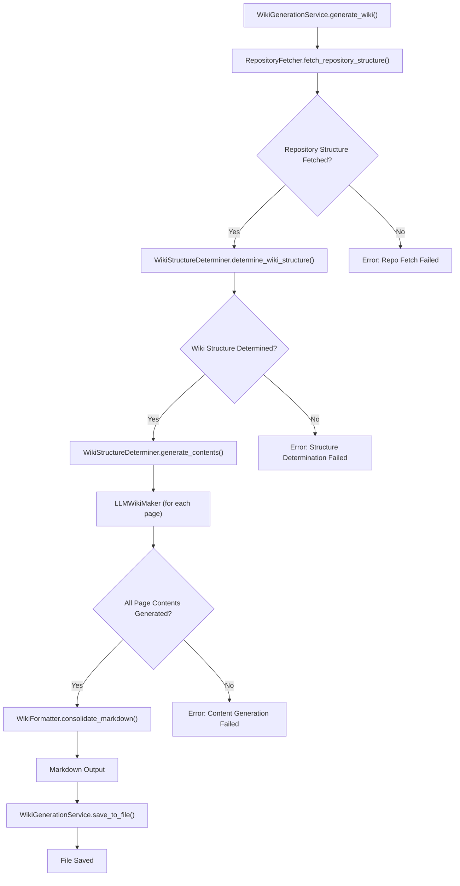
Sources: [src/services/wiki_generator.py](WikiGenerationService class), [src/services/structure_analyzer.py](WikiStructureDeterminer class)

## Conclusion

The core features of "Wiki As Readme" collectively deliver a powerful, flexible, and intelligent documentation solution. From its universal compatibility across diverse technical stacks to its advanced AI-driven content generation, including deep context analysis, smart structuring, and automatic diagramming, the project aims to significantly reduce the burden of maintaining up-to-date and comprehensive project documentation. The asynchronous architecture further ensures that these capabilities are delivered efficiently and scalably.

---

<a name="universal-compatibility"></a>

<details>
<summary>Relevant source files</summary>

The following files were used as context for generating this wiki page:

- [README.md](README.md)
- [src/providers/base.py](src/providers/base.py)
- [src/providers/github.py](src/providers/github.py)
- [src/providers/gitlab.py](src/providers/gitlab.py)
- [src/providers/bitbucket.py](src/providers/bitbucket.py)
- [src/providers/local.py](src/providers/local.py)
- [src/agent/llm.py](src/agent/llm.py)
</details>

# Universal Compatibility

The "Universal Compatibility" feature of **Wiki As Readme** is a core design principle that ensures the tool is highly flexible and adaptable to diverse development environments and technology stacks. It allows users to integrate the documentation generation process seamlessly, regardless of their chosen Large Language Model (LLM) provider, code hosting platform, or deployment strategy. This pluggable architecture makes Wiki As Readme a versatile "drop-in" solution for automated documentation.

This page details the three main pillars of its universal compatibility: model agnosticism, platform agnosticism, and deployment agnosticism. Each pillar is designed to remove barriers to adoption and provide maximum utility across various project setups, from local development to enterprise-grade CI/CD pipelines.

## Model Agnostic (Powered by LiteLLM)

Wiki As Readme is designed to work with "Any Model," providing users the freedom to choose their preferred LLM. This is primarily achieved through the integration of [LiteLLM](https://docs.litellm.ai/), which offers a unified interface to over 100 different LLMs. This abstraction layer allows the application to interact with various models without requiring significant code changes for each new provider.

### Supported LLM Providers

The `LLMWikiMaker` class dynamically configures the LLM client based on environment variables, supporting a wide range of commercial and open-source models.

*   **Commercial APIs:**
    *   Google Vertex AI (Gemini)
    *   OpenAI (GPT-4, etc.)
    *   Anthropic (Claude)
    *   xAI (Grok)
*   **Open/Local Models:**
    *   Ollama
    *   OpenRouter
    *   HuggingFace (via LiteLLM)
*   **On-Premise:** Connects to private LLM endpoints safely, often via OpenAI-compatible APIs or specific LiteLLM configurations.

Sources: [README.md](Universal Compatibility section), [src/agent/llm.py](LLMWikiMaker class)

### LLM Configuration Flow

The `_configure_llm` method within `LLMWikiMaker` is responsible for setting up the correct model name and API parameters based on the `LLM_PROVIDER` and `MODEL_NAME` settings.

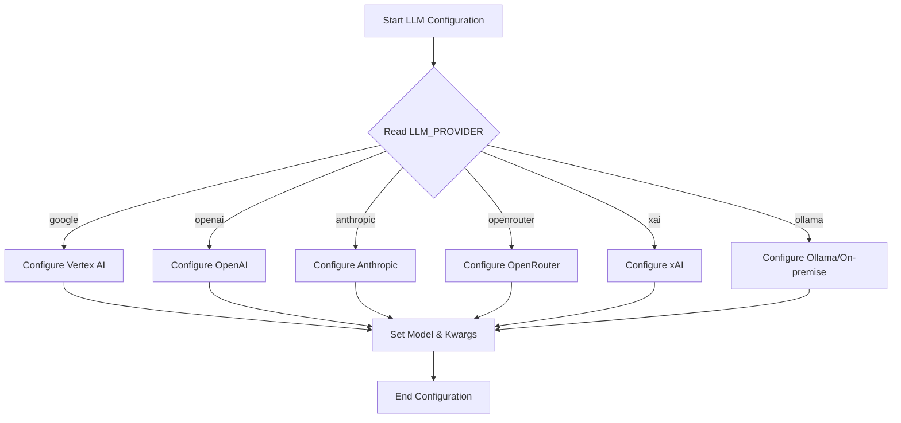
Sources: [src/agent/llm.py](LLMWikiMaker._configure_llm method)

### Configuration Variables

Users configure their LLM provider via environment variables:

| Variable | Description | Example |
|---|---|---|
| `LLM_PROVIDER` | Specifies the LLM service to use. | `google`, `openai`, `ollama` |
| `MODEL_NAME` | The specific model identifier for the chosen provider. | `gemini-2.5-flash`, `gpt-4o`, `llama3` |
| `OPENAI_API_KEY` | API key for OpenAI. | `sk-...` |
| `GCP_PROJECT_NAME` | Google Cloud Project ID for Vertex AI. | `my-genai-project` |
| `GCP_MODEL_LOCATION` | Google Cloud region for Vertex AI. | `us-central1` |
| `ANTHROPIC_API_KEY` | API key for Anthropic. | `sk-ant-...` |
| `OPENROUTER_API_KEY` | API key for OpenRouter. | `sk-or-...` |
| `XAI_API_KEY` | API key for xAI. | `sk-xai-...` |
| `LLM_BASE_URL` | Custom base URL for OpenAI-compatible APIs (e.g., Ollama). | `http://localhost:11434/v1` |

Sources: [README.md](Configuration Reference (.env) table), [src/agent/llm.py](LLMWikiMaker._configure_llm method)

## Platform Agnostic

The project supports "Any Repo," meaning it can integrate with various Git platforms and even local file systems. This is achieved through a modular `RepositoryProvider` system, where each platform has its own implementation for fetching repository structure and file content.

### Repository Provider Architecture

The `RepositoryProvider` is an abstract base class that defines the interface for interacting with different code sources. Concrete implementations handle the specifics of each platform's API or file system access.

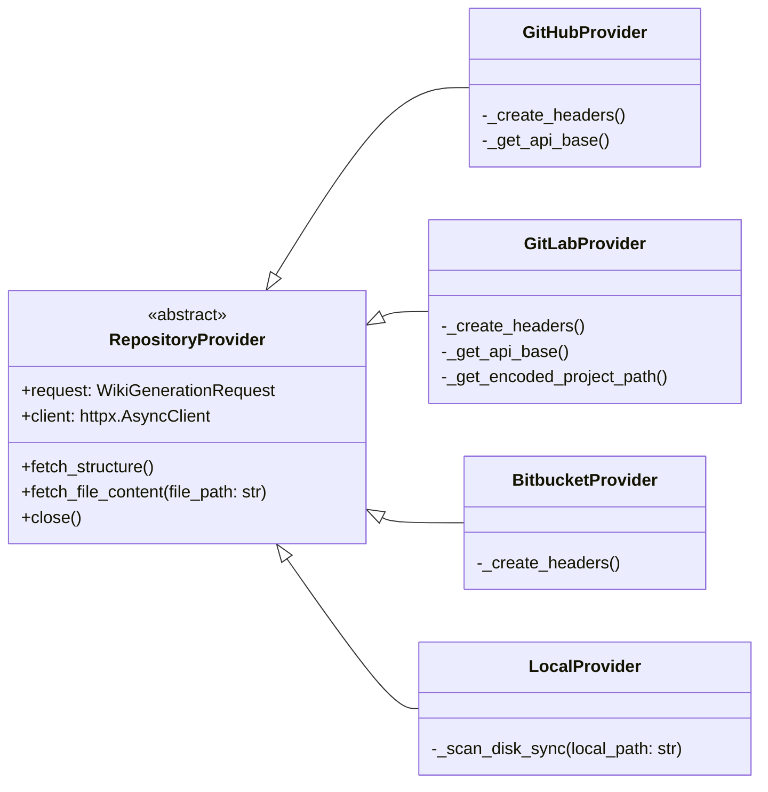
Sources: [src/providers/base.py](RepositoryProvider class)

### Supported Platforms

*   **Cloud Repositories:**
    *   **GitHub:** Utilizes the GitHub REST API to fetch repository information, file trees, and file contents. It handles authentication via `GIT_API_TOKEN` and decodes Base64-encoded content.
        Sources: [src/providers/github.py](GitHubProvider class)
    *   **GitLab:** Supports both `gitlab.com` and self-hosted GitLab instances by parsing the repository URL. It uses GitLab's API for tree traversal (with pagination) and raw file content retrieval.
        Sources: [src/providers/gitlab.py](GitLabProvider class)
    *   **Bitbucket:** Interacts with the Bitbucket Cloud API (version 2.0) to retrieve repository details, source trees, and file contents.
        Sources: [src/providers/bitbucket.py](BitbucketProvider class)
*   **Local Development:**
    *   **Local File System:** The `LocalProvider` directly scans the local disk. It uses `os.walk` to build the file tree and `pathlib` for file content retrieval, offloading these synchronous operations to a separate thread using `asyncio.to_thread`.
        Sources: [src/providers/local.py](LocalProvider class)

All providers incorporate file filtering logic (`should_ignore`) based on `IGNORED_PATTERNS` to exclude irrelevant files and directories from the analysis.
Sources: [src/providers/github.py](should_ignore usage), [src/providers/gitlab.py](should_ignore usage), [src/providers/bitbucket.py](should_ignore usage), [src/providers/local.py](should_ignore usage)

## Deployment Agnostic

Wiki As Readme is designed to run in "Any Environment," offering multiple usage modes to fit various deployment scenarios, from local development to automated CI/CD pipelines and long-running services.

### Usage Modes

*   **CI/CD (GitHub Action):** The recommended approach for automated documentation. It can be integrated into GitHub Actions workflows to generate and commit documentation (`WIKI.md`) on code pushes. This mode leverages a Docker image for consistent execution.
    Sources: [README.md](1. GitHub Action (Recommended) section)
*   **Container (Docker Compose):** Provides an easy way to run the full application (UI and API) locally without managing Python dependencies. It's ideal for quick local testing and evaluation.
    Sources: [README.md](2. Docker Compose (Local) section)
*   **CLI (Local Python Development):** For developers who want to modify the source code or run the application directly from their Python environment. This involves setting up a virtual environment and running the FastAPI backend and Streamlit frontend separately.
    Sources: [README.md](3. Local Python Development section)
*   **Service (Server & Webhooks):** The application can be deployed as a long-running API server. It exposes webhook endpoints (e.g., `POST /api/v1/webhook/github`) to trigger automatic wiki generation in response to events like Git pushes, making it suitable for continuous documentation updates in a server-side setup.
    Sources: [README.md](4. Server & Webhooks section)

## Conclusion

The universal compatibility of Wiki As Readme is a cornerstone of its design, enabling it to be a highly flexible and powerful documentation tool. By abstracting away the specifics of LLM providers, code repositories, and deployment environments, it offers a truly pluggable solution that adapts to the user's existing infrastructure, making comprehensive documentation accessible to a wider range of projects and teams.

---

<a name="using-as-a-github-action"></a>

<details>
<summary>Relevant source files</summary>

The following files were used as context for generating this wiki page:

- [action.yml](action.yml)
- [.github/workflows/WIKI-AS-README-AS-ACTION.yml](.github/workflows/WIKI-AS-README-AS-ACTION.yml)
- [Dockerfile.action](Dockerfile.action)
- [entrypoint.sh](entrypoint.sh)
</details>

# Using as a GitHub Action

The `Wiki-As-Readme` project provides a GitHub Action that automates the generation of comprehensive documentation (like `README.md` or a wiki page) directly from your codebase. This action leverages Large Language Models (LLMs) to analyze your project files and produce structured, informative content. Integrating this action into your GitHub workflows allows for continuous documentation updates, ensuring your project's documentation remains current with its development.

This page details how to configure and use the `Wiki-As-Readme` GitHub Action within your repository, covering its inputs, workflow integration, and underlying Docker image structure.

## Action Definition (`action.yml`)

The `action.yml` file defines the metadata, inputs, and execution environment for the `Wiki-As-Readme` GitHub Action. It declares the action's name, description, author, branding, and the various parameters users can configure. The action is designed to run within a Docker container, specified by `image: 'Dockerfile.action'`.

Sources: [action.yml](action.yml)

### Action Inputs

The action exposes several inputs to control its behavior, LLM provider, model, and output. These inputs are mapped directly to environment variables within the Docker container where the action executes.

| Input Name | Description | Required | Default |
|---|---|---|---|
| `language` | Language for the generated content (e.g., `ko`, `en`). | No | `ko` |
| `output_file` | The filename to save the generated content. | No | `WIKI.md` |
| `llm_provider` | LLM provider to use (e.g., `google`, `openai`, `anthropic`, `openrouter`, `xai`, `ollama`). | No | `google` |
| `model_name` | Specific model name to use (e.g., `gemini-2.5-flash`). | No | `gemini-2.5-flash` |
| `openai_api_key` | OpenAI API Key. | No | |
| `anthropic_api_key` | Anthropic API Key. | No | |
| `openrouter_api_key` | OpenRouter API Key. | No | |
| `xai_api_key` | xAI API Key. | No | |
| `git_api_token` | GitHub/GitLab API Token for private repositories. | No | |
| `gcp_project_name` | GCP Project Name (for Google Cloud Vertex AI). | No | |
| `gcp_model_location` | GCP Model Location (for Google Cloud Vertex AI). | No | |
| `google_application_credentials` | GCP Service Account JSON Key (Content or Path). | No | |
| `llm_base_url` | Custom base URL for LLM API. | No | |
| `use_structured_output` | Whether to use structured JSON output from LLM. | No | `true` |
| `temperature` | LLM temperature (0.0 to 1.0). | No | `0.0` |
| `max_retries` | Max retry attempts for LLM calls. | No | `3` |
| `max_concurrency` | Max parallel LLM calls. | No | `5` |
| `ignored_patterns` | JSON array of glob patterns to ignore (e.g., `["**/*.test.js", "**/node_modules/**"]`). | No | `[]` |

Sources: [action.yml](action.yml)

## Integrating into a GitHub Workflow

To use the `Wiki-As-Readme` action, you need to create a GitHub Actions workflow file (e.g., `.github/workflows/update-wiki.yml`) in your repository. The provided example workflow demonstrates how to generate content and commit it back to the repository.

Sources: [.github/workflows/WIKI-AS-README-AS-ACTION.yml](.github/workflows/WIKI-AS-README-AS-ACTION.yml)

### Workflow Configuration

The example workflow `WIKI-AS-README-AS-ACTION.yml` is configured to run manually via `workflow_dispatch`, allowing you to trigger it on demand. It requires `contents: write` permissions to commit the generated file.

```yaml
name: Update Wiki README

on:
  workflow_dispatch: # Allows manual triggering

jobs:
  generate-and-commit:
    runs-on: ubuntu-latest
    permissions:
      contents: write # Required to commit changes
    env:
      OUTPUT_FILE: "examples/wiki_as_README.md" # Default output file for this workflow
    steps:
      # ... (steps defined below)
```

Sources: [.github/workflows/WIKI-AS-README-AS-ACTION.yml](.github/workflows/WIKI-AS-README-AS-ACTION.yml)

### Workflow Steps

The workflow typically involves the following sequence of steps:

1.  **Checkout Code:** Retrieves your repository's code.
2.  **[Optional] GCP Credentials Setup:** If using Google Cloud (Vertex AI) as your LLM provider, this step creates a temporary JSON key file from a GitHub Secret.
3.  **Generate Wiki Content:** This is the core step where the `Wiki-As-Readme` action is invoked.
    *   It uses the Docker image `ghcr.io/catuscio/wiki-as-readme-action:latest`.
    *   Environment variables are passed to configure the action, including language, output file, LLM provider, model, and API keys (often sourced from GitHub Secrets).
4.  **[Optional] GCP Credentials Cleanup:** Removes the temporary GCP key file.
5.  **Commit and Push Changes:** Uses `stefanzweifel/git-auto-commit-action` to commit the newly generated documentation file back to the repository.

```yaml
      - name: Checkout code
        uses: actions/checkout@v4

      - name: Create GCP Credentials File # Optional
        env:
          GCP_KEY: ${{ secrets.GOOGLE_APPLICATION_CREDENTIALS }}
        run: |
          echo "$GCP_KEY" > ./gcp-key.json

      - name: Generate Wiki Content
        uses: docker://ghcr.io/catuscio/wiki-as-readme-action:latest
        env:
          LANGUAGE: "en"
          OUTPUT_FILE: ${{ env.OUTPUT_FILE }}
          LLM_PROVIDER: "google"
          MODEL_NAME: "gemini-2.5-flash"
          GCP_PROJECT_NAME: ${{ secrets.GCP_PROJECT_NAME }}
          GCP_MODEL_LOCATION: ${{ secrets.GCP_MODEL_LOCATION }}
          GOOGLE_APPLICATION_CREDENTIALS: /github/workspace/gcp-key.json # Path to the created file
          GIT_API_TOKEN: ${{ secrets.GITHUB_TOKEN }} # For accessing private repos

      - name: Remove GCP Credentials File # Optional
        if: always()
        run: rm -f ./gcp-key.json

      - name: Commit and Push changes
        uses: stefanzweifel/git-auto-commit-action@v5
        with:
          commit_message: "docs: ✨Update ${{ env.OUTPUT_FILE }} via Wiki-As-Readme Action"
          file_pattern: ${{ env.OUTPUT_FILE }}
```

Sources: [.github/workflows/WIKI-AS-README-AS-ACTION.yml](.github/workflows/WIKI-AS-README-AS-ACTION.yml)

### Workflow Execution Flow

The following diagram illustrates the typical execution flow of the `Update Wiki README` workflow.

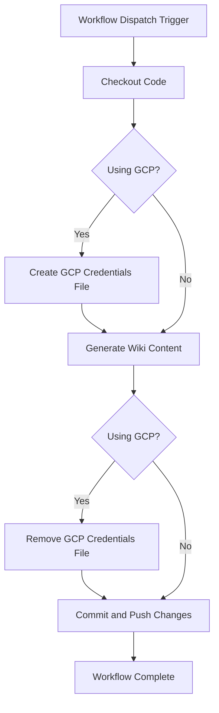

## Action's Docker Image (`Dockerfile.action`)

The `Dockerfile.action` defines how the `Wiki-As-Readme` action is packaged into a Docker image. This image contains all the necessary dependencies and the application code to execute the documentation generation process. It utilizes a multi-stage build for efficiency.

Sources: [Dockerfile.action](Dockerfile.action)

### Build Stages

1.  **Builder Stage:**
    *   Uses `python:3.12-slim-bookworm` as the base.
    *   Installs `uv` (a fast Python package installer) for dependency management.
    *   Copies `pyproject.toml` and `uv.lock` to install project dependencies efficiently, leveraging caching.
    *   Installs dependencies into a virtual environment (`.venv`).

2.  **Final Image Stage:**
    *   Also uses `python:3.12-slim-bookworm` for a lean runtime environment.
    *   Copies the virtual environment from the `builder` stage.
    *   Copies the application source code (`src`) into the image.
    *   Sets up environment variables (`PATH`, `PYTHONPATH`) to ensure the application runs correctly.
    *   Sets the working directory to `/github/workspace`, which is the standard location for GitHub Actions to access the repository's code.
    *   Defines the `ENTRYPOINT` as `["python", "/app/src/action_entrypoint.py"]`, meaning this Python script is executed when the Docker container starts.

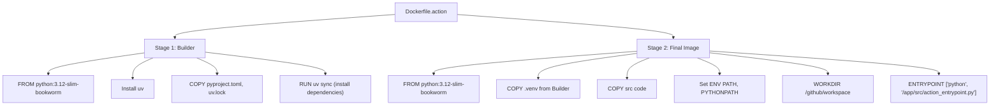

Sources: [Dockerfile.action](Dockerfile.action)

## Conclusion

The `Wiki-As-Readme` GitHub Action provides a powerful and automated way to keep your project documentation up-to-date using LLMs. By integrating it into your CI/CD pipeline, you can ensure that changes in your codebase are reflected in your documentation without manual intervention, fostering better project maintainability and collaboration. The action's flexible configuration options allow it to adapt to various LLM providers and project requirements.

---

<a name="docker-compose-&-local-development"></a>

<details>
<summary>Relevant source files</summary>

The following files were used as context for generating this wiki page:

- [docker-compose.yml](docker-compose.yml)
- [Dockerfile](Dockerfile)
- [Dockerfile.server](Dockerfile.server)
- [src/server.py](src/server.py)
- [src/app.py](src/app.py)
- [pyproject.toml](pyproject.toml)
</details>

# Docker Compose & Local Development

This document outlines the setup for local development of the `wiki-as-readme` project using Docker Compose. It details how the application's API server and Streamlit user interface are containerized and orchestrated to provide a fully functional local environment. This setup facilitates consistent development, testing, and demonstration of the application without requiring direct installation of all dependencies on the host machine.

The project leverages Docker to create isolated environments for its components and Docker Compose to define and run multi-container Docker applications. This approach ensures that the development environment closely mirrors potential deployment environments, reducing "it works on my machine" issues.

## Architecture Overview

The local development environment is orchestrated by `docker-compose.yml`, which defines a single service named `wiki-as-readme`. This service builds a Docker image based on the primary `Dockerfile`, which includes both the FastAPI API server and the Streamlit UI. The container exposes ports for both services, allowing developers to interact with the application through their web browser.

### Component Interaction Flow

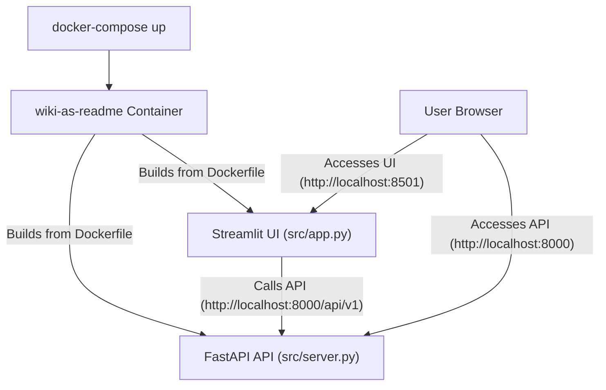

## Docker Compose Configuration

The `docker-compose.yml` file defines how the `wiki-as-readme` service is built and run.

```yaml
services:
  wiki-as-readme:
    build: .
    container_name: wiki-as-readme
    ports:
      - "8000:8000" # API
      - "8501:8501" # Streamlit UI
    env_file:
      - .env
    volumes:
      - ./output:/app/output
    restart: always
```
Sources: [docker-compose.yml](docker-compose.yml)

### Service Definition

*   **`wiki-as-readme`**: This is the primary service for the application.
    *   **`build: .`**: Instructs Docker Compose to build the image using the `Dockerfile` located in the current directory. This `Dockerfile` is configured to include both the API and the UI components.
    *   **`container_name: wiki-as-readme`**: Assigns a static name to the container, making it easier to reference.
    *   **`ports`**: Maps host ports to container ports, making the services accessible from the host machine.
        *   `8000:8000`: Exposes the FastAPI API.
        *   `8501:8501`: Exposes the Streamlit UI.
    *   **`env_file: - .env`**: Loads environment variables from a `.env` file in the project root into the container. This is crucial for configuring API keys, database connections, or other sensitive settings.
    *   **`volumes: - ./output:/app/output`**: Mounts the local `output` directory into the container's `/app/output` directory. This allows generated wiki content to be persisted on the host machine even if the container is removed.
    *   **`restart: always`**: Configures the container to automatically restart if it stops for any reason, ensuring high availability during development.

### Port Mappings

The following table summarizes the port mappings for local development:

| Service | Container Port | Host Port | Description |
|---|---|---|---|
| FastAPI API | `8000` | `8000` | Access the API endpoints (e.g., `http://localhost:8000/docs`). |
| Streamlit UI | `8501` | `8501` | Access the interactive web UI (e.g., `http://localhost:8501`). |

## Docker Images

The project uses two distinct Dockerfiles to cater to different deployment and development needs: `Dockerfile` for the full application (API + UI) and `Dockerfile.server` for an API-only deployment. Both utilize a multi-stage build process for efficiency and smaller final image sizes.

### `Dockerfile` (Full Application: API + UI)

This Dockerfile is used by `docker-compose.yml` for local development, providing both the API and the Streamlit UI.
Sources: [Dockerfile](Dockerfile)

#### Stage 1: `builder`
*   **Base Image**: `python:3.12-slim-bookworm`.
*   **Dependency Manager**: Copies `uv` (a fast Python package installer) into the image.
*   **Working Directory**: Sets `/app`.
*   **Environment Variables**: `UV_COMPILE_BYTECODE=1` and `UV_LINK_MODE=copy` optimize `uv`'s behavior.
*   **Dependency Installation**: `uv sync --frozen --no-dev --no-install-project --extra all` installs all project dependencies, including those for both the API and UI, as defined in `pyproject.toml`.

#### Stage 2: Final Image
*   **Base Image**: `python:3.12-slim-bookworm`.
*   **Metadata**: Includes `LABEL` instructions for maintainer, description, source, license, authors, title, and version.
*   **User Setup**: Creates a non-root `appuser` for security best practices.
*   **Working Directory**: Sets `/app`.
*   **Copy Artifacts**:
    *   Copies the virtual environment (`.venv`) from the `builder` stage.
    *   Copies the application source code (`src`).
    *   Copies `entrypoint.sh`, which is the script executed when the container starts.
*   **Permissions**: Sets ownership and executable permissions for `appuser`.
*   **Environment Variables**:
    *   `PATH`: Adds the virtual environment's `bin` directory to the `PATH`.
    *   `PYTHONPATH`: Adds `/app` to `PYTHONPATH` for correct module imports.
*   **Exposed Ports**: `EXPOSE 8000` and `EXPOSE 8501` declare the ports the application listens on.
*   **User**: Switches to `appuser`.
*   **Command**: `CMD ["./entrypoint.sh"]` executes the entrypoint script to start the application.

### `Dockerfile.server` (API Server Only)

This Dockerfile is designed for deploying only the FastAPI API server, without the Streamlit UI. It's suitable for backend-only deployments.
Sources: [Dockerfile.server](Dockerfile.server)

#### Stage 1: `builder`
*   Similar to the main `Dockerfile`'s builder stage.
*   **Dependency Installation**: `uv sync --frozen --no-dev --no-install-project --extra api` installs only the API-specific dependencies.

#### Stage 2: Final Image
*   Similar to the main `Dockerfile`'s final stage, but with key differences:
    *   **Metadata**: Labels reflect it's for `wiki-as-readme-server`.
    *   **No `entrypoint.sh`**: The `entrypoint.sh` script is not copied as it's tailored for the full application.
    *   **Exposed Port**: Only `EXPOSE 8000` for the API.
    *   **Command**: `CMD ["gunicorn", "-k", "uvicorn.workers.UvicornWorker", "--bind", "0.0.0.0:8000", "--workers", "2", "--access-logfile", "-", "--error-logfile", "-", "src.server:app"]` directly starts the FastAPI application using Gunicorn with Uvicorn workers. This is a common production setup for Python web applications.

## Application Entry Points

### FastAPI Server (`src/server.py`)

This file defines the core FastAPI application that provides the API endpoints for wiki generation and webhook integration.
Sources: [src/server.py](src/server.py)

*   **Initialization**: Sets up logging and initializes a `FastAPI` application instance with title, description, and version.
*   **Health Check**: Includes a basic `GET /` endpoint for health checks.
*   **Routers**: Integrates API routers from `src.api.v1.endpoints.wiki` and `src.api.v1.endpoints.webhook`.
    *   `wiki.router` is mounted at `/api/v1/wiki`.
    *   `webhook.router` is mounted at `/api/v1/webhook`.
*   **Local Execution**: The `if __name__ == "__main__":` block allows running the server directly using `uvicorn` for local development outside Docker, binding to `127.0.0.1:8000`. Within Docker, `gunicorn` (for `Dockerfile.server`) or `entrypoint.sh` (for `Dockerfile`) handles server startup.

### Streamlit UI (`src/app.py`)

This file implements the interactive web user interface using Streamlit, allowing users to trigger wiki generation and view results.
Sources: [src/app.py](src/app.py)

*   **API Base URL**: `API_BASE_URL = os.getenv("API_BASE_URL", "http://localhost:8000/api/v1")`. This environment variable allows configuring the API endpoint. By default, it points to the API server running on `localhost:8000`, which is accessible from within the Docker Compose setup.
*   **`start_generation_task`**: An asynchronous function that sends a `WikiGenerationRequest` to the FastAPI backend to initiate a wiki generation task.
*   **`poll_task_status`**: An asynchronous function that periodically polls the API for the status of a generation task, updating the UI with progress and eventually displaying the result or an error.
*   **`render_sidebar`**: Renders the Streamlit sidebar for user input (repository URL/path, generation settings) and triggers the generation process.
*   **`render_main_content`**: Displays the generated markdown content, including a download button and rendering of Mermaid diagrams.
*   **Main Application Flow (`main` function)**: Manages the Streamlit application state, handling new generation requests, polling for task status, and rendering results.

## Dependency Management (`pyproject.toml`)

The `pyproject.toml` file defines project metadata and manages dependencies using `uv`. It specifies optional dependency groups that are leveraged by the Dockerfiles.
Sources: [pyproject.toml](pyproject.toml)

*   **`[project.optional-dependencies]`**:
    *   `ui`: Lists dependencies required for the Streamlit UI (e.g., `streamlit`, `streamlit-mermaid`).
    *   `api`: Lists dependencies required for the FastAPI API server (e.g., `fastapi`, `uvicorn`, `gunicorn`).
    *   `all`: A meta-group that includes both `ui` and `api` dependencies.

This structure allows Dockerfiles to selectively install only the necessary dependencies:
*   `Dockerfile` uses `uv sync --extra all` to install everything for the full application.
*   `Dockerfile.server` uses `uv sync --extra api` to install only API-related dependencies, resulting in a leaner image.

## Conclusion

The Docker Compose setup provides a robust and consistent environment for developing the `wiki-as-readme` application. By containerizing both the FastAPI API and the Streamlit UI, developers can quickly spin up a complete local instance, interact with both components, and ensure that their local environment closely matches production expectations. The use of multi-stage Docker builds and optional dependency groups optimizes image sizes and build times, contributing to an efficient development workflow.

---

<a name="deploying-as-a-server-with-webhooks"></a>

<details>
<summary>Relevant source files</summary>

The following files were used as context for generating this wiki page:

- [src/server.py](src/server.py)
- [src/api/v1/endpoints/webhook.py](src/api/v1/endpoints/webhook.py)
- [src/api/v1/endpoints/wiki.py](src/api/v1/endpoints/wiki.py)
- [src/models/github_webhook_schema.py](src/models/github_webhook_schema.py)
- [Dockerfile.server](Dockerfile.server)
</details>

# Deploying as a Server with Webhooks

This document outlines the architecture and deployment strategy for running the Wiki As Readme application as a standalone server, with a particular focus on its webhook integration capabilities. Deploying the application as a server enables automated wiki generation and updates, primarily through GitHub webhooks, facilitating continuous documentation directly within your repositories.

The server leverages FastAPI for its API endpoints, Uvicorn for local development, and Gunicorn for production deployments. Key components include the main server entry point (`src/server.py`), dedicated API routers for wiki generation (`src/api/v1/endpoints/wiki.py`) and webhook handling (`src/api/v1/endpoints/webhook.py`), and a Dockerfile for containerized deployment.

## Server Architecture

The application is built around a FastAPI web server, providing a robust and asynchronous API. The core server setup is defined in `src/server.py`.

### FastAPI Application Setup

The `src/server.py` file initializes the FastAPI application, sets up logging, and includes various API routers.

```python
# src/server.py
app = FastAPI(
    title="Wiki as Readme",
    description="Turn your codebase into a comprehensive Wiki in minutes, delivered in a single Readme.",
    version="1.0.0",
)

@app.get("/", tags=["Health Check"])
def health_check():
    return {"status": "ok"}

app.include_router(wiki.router, prefix="/api/v1/wiki", tags=["Wiki Generation"])
app.include_router(webhook.router, prefix="/api/v1/webhook", tags=["Webhook Integration"])
```
Sources: [src/server.py](app initialization, router inclusion)

This setup exposes a health check endpoint at `/` and organizes API functionalities under `/api/v1/wiki` for wiki generation and `/api/v1/webhook` for webhook integrations.

### High-Level Server Flow

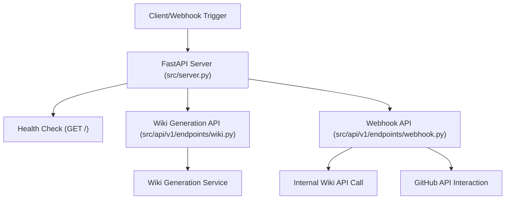

## Webhook Integration

The server provides a dedicated endpoint for handling webhooks, specifically designed for GitHub push events. This enables automated wiki updates whenever code changes are pushed to a configured repository. The logic resides in `src/api/v1/endpoints/webhook.py`.

### GitHub Webhook Endpoint

The `/api/v1/webhook/github` endpoint is the primary entry point for GitHub push events.

```python
# src/api/v1/endpoints/webhook.py
@router.post("/github", status_code=status.HTTP_202_ACCEPTED)
async def github_webhook(
    payload: GitHubPushPayload, request: Request, background_tasks: BackgroundTasks
):
    # ...
```
Sources: [src/api/v1/endpoints/webhook.py](github_webhook function)

Key functionalities of this endpoint include:

*   **Signature Verification:** Ensures the authenticity of the webhook request using HMAC SHA256, requiring `GITHUB_WEBHOOK_SECRET`.
    Sources: [src/api/v1/endpoints/webhook.py](verify_signature function)
*   **Loop Prevention:** Ignores commits made by the bot itself (`Wiki-As-Readme-Bot`) or commits containing "via Wiki-As-Readme" in their message to prevent infinite update loops.
    Sources: [src/api/v1/endpoints/webhook.py](github_webhook function, BOT_COMMITTER_NAME)
*   **Branch Filtering:** Processes only push events to the `main` branch.
    Sources: [src/api/v1/endpoints/webhook.py](github_webhook function)
*   **Asynchronous Processing:** Dispatches the full wiki generation and update cycle to a background task (`process_full_cycle`) to avoid blocking the webhook response.
    Sources: [src/api/v1/endpoints/webhook.py](github_webhook function, background_tasks.add_task)

### Full Cycle Processing (`process_full_cycle`)

This asynchronous function orchestrates the entire workflow from receiving a GitHub push to updating the `WIKI.md` file in the repository.

```python
# src/api/v1/endpoints/webhook.py
async def process_full_cycle(
    generate_url: str, request_data_json: str, repo_owner: str, repo_name: str
):
    # 1. Call internal Wiki generation API
    # 2. Extract generated result (Markdown)
    # 3. Upload to GitHub
```
Sources: [src/api/v1/endpoints/webhook.py](process_full_cycle function)

The steps involved are:
1.  **Call Internal Wiki Generation API:** It makes an HTTP POST request to the server's own `/api/v1/wiki/generate/file` endpoint, triggering the wiki generation process.
2.  **Extract Generated Markdown:** It parses the response from the wiki generation API to retrieve the generated Markdown content.
3.  **Upload to GitHub:** It then calls `update_github_readme` to commit this content back to the repository.

### GitHub README/WIKI Update (`update_github_readme`)

This function handles the interaction with the GitHub API to update the `WIKI.md` file.

```python
# src/api/v1/endpoints/webhook.py
async def update_github_readme(repo_owner: str, repo_name: str, content: str):
    # ...
```
Sources: [src/api/v1/endpoints/webhook.py](update_github_readme function)

It performs the following actions:
*   **Authentication:** Uses `GITHUB_ACCESS_TOKEN` (a Personal Access Token) for authorization.
*   **Fetch Existing SHA:** Retrieves the SHA of the existing `WIKI.md` file, which is required by the GitHub API for updating files.
*   **Base64 Encoding:** Encodes the new Markdown content to Base64, as required by the GitHub API.
*   **Commit Data Preparation:** Constructs the commit payload, including the commit message ("docs: Update README.md via Wiki-As-Readme"), committer details, and the encoded content.
*   **PUT Request:** Sends a PUT request to the GitHub API (`/repos/{owner}/{repo}/contents/WIKI.md`) to update the file.

### GitHub Webhook Flow

```mermaid
sequenceDiagram
    participant GH as "GitHub"
    participant WS as "Webhook Server"
    participant WGS as "Wiki Generation Service"
    participant GHA as "GitHub API"

    GH->>WS: "POST /api/v1/webhook/github" (Push Event Payload)
    activate WS
    WS->>WS: "Verify Signature (X-Hub-Signature-256)"
    alt Signature Invalid
        WS-->>GH: "403 Forbidden"
    else Signature Valid
        WS->>WS: "Check for Bot Commits / Branch"
        alt Bot Commit or Non-Main Branch
            WS-->>GH: "202 Accepted (Skipped)"
        else Valid Commit
            WS->>WS: "Start process_full_cycle in Background"
            WS-->>GH: "202 Accepted"
            deactivate WS

            WS->>WGS: "POST /api/v1/wiki/generate/file" (WikiGenerationRequest)
            activate WGS
            WGS-->>WS: "Generated Markdown Content"
            deactivate WGS

            WS->>GHA: "GET /repos/{owner}/{repo}/contents/WIKI.md (Get SHA)"
            activate GHA
            GHA-->>WS: "SHA of WIKI.md"
            deactivate GHA

            WS->>GHA: "PUT /repos/{owner}/{repo}/contents/WIKI.md (Update WIKI.md)"
            activate GHA
            GHA-->>WS: "200/201 Success"
            deactivate GHA
    end
```

## Wiki Generation API

The `src/api/v1/endpoints/wiki.py` module provides the API endpoints for triggering wiki generation. The webhook integration specifically uses the `/generate/file` endpoint.

*   **`/api/v1/wiki/generate/file` (POST):** Triggers an asynchronous wiki generation task. The generated Markdown content is saved as a file on the server (in the `output/` directory, though not explicitly shown in provided code, it's implied by `save_file=True`). It returns a `task_id` for status tracking.
    Sources: [src/api/v1/endpoints/wiki.py](generate_wiki_file function)
*   **`/api/v1/wiki/generate/text` (POST):** Similar to `/generate/file`, but the generated Markdown content is not saved to the server's filesystem. Instead, it's made available in the task status result.
    Sources: [src/api/v1/endpoints/wiki.py](generate_wiki_text function)
*   **`/api/v1/wiki/status/{task_id}` (GET):** Retrieves the current status and result (if completed) of a wiki generation task.
    Sources: [src/api/v1/endpoints/wiki.py](get_wiki_generation_status function)

These endpoints utilize background tasks (`process_wiki_generation_task`) to perform the potentially long-running generation process without blocking the API response.

## Deployment with Docker

The `Dockerfile.server` provides a multi-stage build process to create a production-ready Docker image for the server.

### Build Stages

1.  **Builder Stage:**
    *   Uses `python:3.12-slim-bookworm` as the base.
    *   Copies `uv` (a fast Python package installer) into the image.
    *   Installs project dependencies using `uv sync --frozen --no-dev --no-install-project --extra api`. This ensures only production dependencies for the `api` extra are installed into a virtual environment.
    Sources: [Dockerfile.server](Stage 1: Builder)

2.  **Final Image Stage:**
    *   Also uses `python:3.12-slim-bookworm` for a lean runtime environment.
    *   Adds metadata labels for image identification.
    *   Creates a non-root `appuser` for security best practices.
    *   Copies the virtual environment from the builder stage.
    *   Copies the application source code (`src/`).
    *   Sets `PATH` and `PYTHONPATH` environment variables to ensure the virtual environment and application modules are discoverable.
    *   Exposes port `8000`.
    *   Switches to `appuser`.
    *   Defines the `CMD` to run the application using `gunicorn` with `uvicorn.workers.UvicornWorker`. This is suitable for production, providing worker management and robustness.
    Sources: [Dockerfile.server](Stage 2: Final Image)

### Production Command

The Docker image is configured to run the FastAPI application using Gunicorn:

```dockerfile
# Dockerfile.server
CMD ["gunicorn", "-k", "uvicorn.workers.UvicornWorker", \
     "--bind", "0.0.0.0:8000", \
     "--workers", "2", \
     "--access-logfile", "-", \
     "--error-logfile", "-", \
     "src.server:app"]
```
Sources: [Dockerfile.server](CMD instruction)

This command binds the server to `0.0.0.0:8000`, making it accessible from outside the container, and uses two Uvicorn workers for concurrency. For local development, `src/server.py` uses `uvicorn.run("server:app", host="127.0.0.1", port=8000, reload=True)`.
Sources: [src/server.py](if __name__ == "__main__": block)

## Configuration

The server's webhook functionality relies on specific environment variables.

| Environment Variable | Description | Source |
|---|---|---|
| `GITHUB_WEBHOOK_SECRET` | Secret token used to verify the authenticity of incoming GitHub webhook payloads. | [src/api/v1/endpoints/webhook.py](GITHUB_WEBHOOK_SECRET) |
| `GITHUB_ACCESS_TOKEN` | GitHub Personal Access Token (PAT) with `repo` scope, used by the server to write the generated `WIKI.md` back to the repository. | [src/api/v1/endpoints/webhook.py](GITHUB_ACCESS_TOKEN) |

These variables must be set in the environment where the server is running (e.g., Docker environment variables, Kubernetes secrets).

## Conclusion

Deploying the Wiki As Readme application as a server with webhook integration provides a powerful mechanism for automating documentation. By leveraging GitHub webhooks, code changes can automatically trigger the generation and update of a comprehensive `WIKI.md` file, ensuring documentation remains synchronized with the codebase. The Dockerized deployment strategy ensures portability and ease of deployment in various environments.

---

<a name="configuration-reference"></a>

<details>
<summary>Relevant source files</summary>

The following files were used as context for generating this wiki page:

- [.env example](.env example)
- [src/core/config.py](src/core/config.py)
- [src/action_entrypoint.py](src/action_entrypoint.py)
</details>

# Configuration Reference

This document provides a comprehensive guide to configuring the AX Wiki Generator. The system relies on a robust configuration mechanism that allows users to customize its behavior, integrate with various LLM providers, and tailor output generation. Configuration is primarily managed through environment variables, typically loaded from a `.env` file, and defined programmatically within `src/core/config.py`.

Understanding these configuration options is crucial for deploying the generator effectively, whether as a standalone application or as a GitHub Action. This page details each configurable parameter, its purpose, and how it influences the application's operation.

## Configuration Loading Mechanism

The AX Wiki Generator uses Pydantic's `BaseSettings` to manage its configuration. This approach provides strong typing, validation, and hierarchical loading of settings.

### `Settings` Class (`src/core/config.py`)

The `Settings` class in `src/core/config.py` is the central definition for all configurable parameters. It specifies data types, default values, and validation rules.
Sources: [src/core/config.py](Settings class)

### Environment Variables and `.env` File

Configuration values are primarily sourced from environment variables. For local development or deployment, these variables are typically loaded from a `.env` file located in the project root. The `SettingsConfigDict` in `src/core/config.py` explicitly instructs Pydantic to load variables from `.env`.
Sources: [src/core/config.py](SettingsConfigDict), [.env example](.env example)

### Configuration Flow

The following diagram illustrates how configuration values are loaded and utilized within the application.

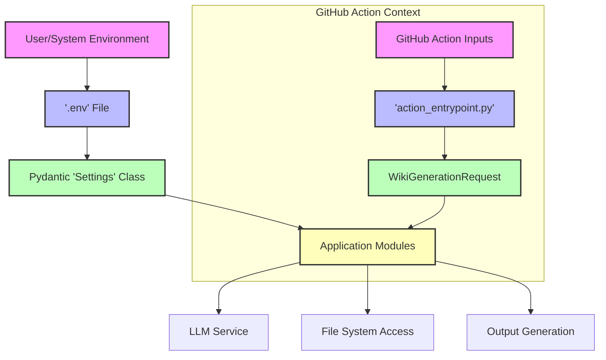

## Core Configuration Parameters

The following table details the primary configuration parameters available.

| Parameter | Type | Default | Description | Source |
|---|---|---|---|---|
| `LLM_PROVIDER` | `Literal` | `google` | Specifies the Large Language Model provider to use. Supported values: `google`, `openai`, `anthropic`, `openrouter`, `xai`, `ollama`. | [.env example](LLM_PROVIDER), [src/core/config.py](LLM_PROVIDER) |
| `MODEL_NAME` | `str` | `gemini-2.5-flash` | The specific model identifier for the chosen LLM provider (e.g., `gpt-4o`, `claude-3-5-sonnet-latest`). | [.env example](MODEL_NAME), [src/core/config.py](MODEL_NAME) |
| `OPENAI_API_KEY` | `str` | `None` | API key for OpenAI services. | [.env example](OPENAI_API_KEY), [src/core/config.py](OPENAI_API_KEY) |
| `ANTHROPIC_API_KEY` | `str` | `None` | API key for Anthropic services. | [.env example](ANTHROPIC_API_KEY), [src/core/config.py](ANTHROPIC_API_KEY) |
| `OPENROUTER_API_KEY` | `str` | `None` | API key for OpenRouter services. | [.env example](OPENROUTER_API_KEY), [src/core/config.py](OPENROUTER_API_KEY) |
| `XAI_API_KEY` | `str` | `None` | API key for xAI services. | [.env example](XAI_API_KEY), [src/core/config.py](XAI_API_KEY) |
| `LLM_BASE_URL` | `str` | `None` | Optional custom base URL for the LLM API, useful for local models (e.g., Ollama) or proxy services. | [.env example](LLM_BASE_URL), [src/core/config.py](LLM_BASE_URL) |
| `USE_STRUCTURED_OUTPUT` | `bool` | `True` | Whether to request structured JSON output from the LLM. Requires model support. | [.env example](USE_STRUCTURED_OUTPUT), [src/core/config.py](USE_STRUCTURED_OUTPUT) |
| `temperature` | `float` | `0.0` | Controls the randomness of LLM output. `0.0` for deterministic, `1.0` for creative. | [.env example](temperature), [src/core/config.py](temperature) |
| `max_retries` | `int` | `3` | Maximum number of retry attempts for failed LLM requests. | [.env example](max_retries), [src/core/config.py](max_retries) |
| `max_concurrency` | `int` | `5` | Limits the number of parallel LLM calls to prevent rate limiting. | [.env example](max_concurrency), [src/core/config.py](max_concurrency) |
| `IGNORED_PATTERNS` | `list[str]` | (See below) | A list of glob patterns to exclude files and directories from LLM context. Overrides default list if provided. | [.env example](IGNORED_PATTERNS), [src/core/config.py](IGNORED_PATTERNS) |
| `GIT_API_TOKEN` | `str` | `None` | GitHub/GitLab personal access token for accessing private repositories or increasing API rate limits. | [.env example](GIT_API_TOKEN), [src/core/config.py](GIT_API_TOKEN) |
| `language` | `Literal` | `None` | Target language for the generated wiki (e.g., `en`, `ko`, `ja`, `zh`). | [.env example](language), [src/core/config.py](language) |
| `GCP_PROJECT_NAME` | `str` | `None` | Google Cloud Project name, required for Google Vertex AI. | [.env example](GCP_PROJECT_NAME), [src/core/config.py](GCP_PROJECT_NAME) |
| `GCP_MODEL_LOCATION` | `str` | `None` | Google Cloud model location (e.g., `us-central1`), required for Google Vertex AI. | [.env example](GCP_MODEL_LOCATION), [src/core/config.py](GCP_MODEL_LOCATION) |
| `GOOGLE_APPLICATION_CREDENTIALS` | `SecretStr` | `None` | Path to Google Application Credentials JSON file, if not using default authentication. | [src/core/config.py](GOOGLE_APPLICATION_CREDENTIALS) |
| `GITHUB_WEBHOOK_SECRET` | `str` | `None` | Secret for validating GitHub webhooks (if applicable). | [src/core/config.py](GITHUB_WEBHOOK_SECRET) |

## Special Configuration Handling

### `IGNORED_PATTERNS` Parsing

The `IGNORED_PATTERNS` setting has special parsing logic to handle different input formats.
Sources: [src/core/config.py](parse_ignored_patterns)

*   **Default Value:** If `IGNORED_PATTERNS` is not set or is empty, a predefined list of common build artifacts, lock files, and media files is used.
    Sources: [src/core/config.py](DEFAULT_IGNORED_PATTERNS)
*   **JSON Array String:** If provided as a single-line JSON array string (e.g., `'["*.log", "temp/"]'`), it will be parsed into a list of strings.
*   **Comma-Separated String:** If provided as a comma-separated string (e.g., `*.log, temp/`), it will be split into a list of strings.
*   **Override:** Defining `IGNORED_PATTERNS` in the `.env` file will completely override the default list.

## GitHub Action Specific Configuration

When the AX Wiki Generator runs as a GitHub Action, certain inputs are provided via environment variables prefixed with `INPUT_`. The `action_entrypoint.py` script reads these specific environment variables to configure the generation process.
Sources: [src/action_entrypoint.py](main function)

| Environment Variable / Action Input | Description | Default |
|---|---|---|
| `INPUT_LOCAL_PATH` | The local path to the repository to be documented. | `.` (current directory) |
| `OUTPUT_FILE` / `INPUT_OUTPUT_FILE` | The name of the output Markdown file. | `WIKI.md` |
| `LANGUAGE` / `INPUT_LANGUAGE` | The target language for the generated wiki. This overrides the `language` setting from `src/core/config.py` for the `WikiGenerationRequest`. | `ko` |

These action-specific inputs are used to construct the `WikiGenerationRequest` object, which then guides the `WikiGenerationService`. Other LLM-related configurations (like API keys, model name, temperature) are still sourced from the global `settings` object loaded from `.env` or environment variables.

## Conclusion

The configuration system of the AX Wiki Generator is designed for flexibility and ease of use. By leveraging environment variables and Pydantic, it provides a clear, type-safe, and robust way to customize the application's behavior for various LLM providers, project structures, and deployment environments, including seamless integration within GitHub Actions. Proper configuration ensures optimal performance, cost efficiency, and accurate documentation generation.

---

<a name="api-endpoints"></a>

<details>
<summary>Relevant source files</summary>

The following files were used as context for generating this wiki page:

- [src/api/v1/endpoints/wiki.py](src/api/v1/endpoints/wiki.py)
- [src/api/v1/endpoints/webhook.py](src/api/v1/endpoints/webhook.py)
- [src/models/api_schema.py](src/models/api_schema.py)
- [src/server.py](src/server.py)
</details>

# API Endpoints

This document provides a comprehensive overview of the API endpoints implemented in the "Wiki as Readme" project. These endpoints facilitate the generation of wiki content from code repositories and integrate with external services like GitHub to automate the documentation process. The API is built using FastAPI, providing a clear, interactive interface for developers and services.

The core functionalities exposed through these endpoints include:
*   Initiating wiki generation tasks, either saving the output to the server's filesystem or returning it as text.
*   Retrieving the status and results of ongoing or completed generation tasks.
*   Processing GitHub webhook events to automatically trigger wiki updates upon code pushes.

## API Structure and Routing

The API is versioned under `/api/v1/` and organized into logical modules:
*   **`/api/v1/wiki`**: Handles all operations related to wiki generation and task management.
*   **`/api/v1/webhook`**: Manages integrations with external webhook providers, specifically GitHub.

The main FastAPI application (`src/server.py`) integrates these routers:
```python
app.include_router(wiki.router, prefix="/api/v1/wiki", tags=["Wiki Generation"])
app.include_router(
    webhook.router, prefix="/api/v1/webhook", tags=["Webhook Integration"]
)
```
Sources: [src/server.py](lines 22-26)

## Wiki Generation Endpoints

These endpoints, defined in `src/api/v1/endpoints/wiki.py`, allow clients to request wiki generation and monitor its progress. All generation tasks are executed asynchronously in the background.

### Common Initialization Logic

A helper function, `_init_wiki_generation`, encapsulates the initial steps required for any wiki generation request. This includes validating the request, creating a background task entry, and preparing the `WikiGenerationService` to determine the wiki's structure.

```python
async def _init_wiki_generation(...) -> tuple[str, Any, WikiGenerationService]:
    # ... validation, task creation, service initialization ...
    # ... determine initial structure ...
```
Sources: [src/api/v1/endpoints/wiki.py](_init_wiki_generation function)

### `POST /api/v1/wiki/generate/file`

This endpoint triggers the generation of a wiki and saves the resulting Markdown content as a file on the server.

*   **Description**: Initiates an asynchronous task to generate wiki content based on the provided repository details. The generated content is saved to the server's `output/` directory.
*   **Method**: `POST`
*   **Request Body**: `WikiGenerationRequest`
*   **Response**: `WikiGenerationResponse`
*   **Behavior**: Returns a `task_id` immediately, allowing the client to poll for status updates. The actual generation and file saving occur in a background task.

Sources: [src/api/v1/endpoints/wiki.py](generate_wiki_file function)

### `POST /api/v1/wiki/generate/text`

This endpoint triggers the generation of a wiki and makes the resulting Markdown content available via the task status endpoint.

*   **Description**: Initiates an asynchronous task to generate wiki content. Unlike `/generate/file`, this endpoint does not save the output to the server's filesystem. The generated Markdown text will be accessible through the `/status/{task_id}` endpoint once the task is completed.
*   **Method**: `POST`
*   **Request Body**: `WikiGenerationRequest`
*   **Response**: `WikiGenerationResponse`
*   **Behavior**: Returns a `task_id` immediately. The generated text is stored as part of the task result.

Sources: [src/api/v1/endpoints/wiki.py](generate_wiki_text function)

### `GET /api/v1/wiki/status/{task_id}`

This endpoint allows clients to retrieve the current status of a previously initiated wiki generation task.

*   **Description**: Fetches the status, progress, and eventual result (if applicable) of a background wiki generation task identified by `task_id`.
*   **Method**: `GET`
*   **Path Parameter**: `task_id` (string) - The unique identifier for the task.
*   **Response**: `TaskStatusResponse`
*   **Error Handling**: Returns `404 Not Found` if the `task_id` does not correspond to an existing task.

Sources: [src/api/v1/endpoints/wiki.py](get_wiki_generation_status function)

### Wiki Generation Flow

The following flowchart illustrates the general process for initiating a wiki generation task:

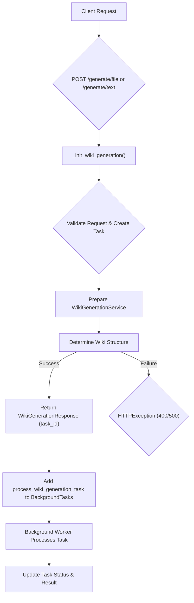

## Webhook Integration Endpoints

These endpoints, defined in `src/api/v1/endpoints/webhook.py`, handle incoming webhooks from external services, primarily GitHub, to automate wiki updates.

### `POST /api/v1/webhook/github`

This endpoint processes GitHub push events to automatically generate and update the project's `WIKI.md` file.

*   **Description**: Receives push event payloads from GitHub. Upon a valid push to the `main` branch, it triggers a background process to generate a wiki for the repository and commit it back to the repository as `WIKI.md`.
*   **Method**: `POST`
*   **Request Body**: `GitHubPushPayload` (parsed from GitHub's JSON payload)
*   **Response**: `202 Accepted` with a message indicating processing has started or why it was skipped.

Sources: [src/api/v1/endpoints/webhook.py](github_webhook function)

#### Key Logic within `/github` Endpoint:

1.  **Signature Verification (`verify_signature`)**:
    *   Ensures the webhook request originates from GitHub and has not been tampered with.
    *   Uses the `X-Hub-Signature-256` header and a pre-shared `GITHUB_WEBHOOK_SECRET` for HMAC SHA256 verification.
    *   Raises `HTTPException(403)` if the signature is missing or invalid.
    Sources: [src/api/v1/endpoints/webhook.py](verify_signature function)

2.  **Bot Commit Filtering**:
    *   Prevents infinite loops by checking if the commit was made by the `BOT_COMMITTER_NAME` ("Wiki-As-Readme-Bot") or if the commit message contains "via Wiki-As-Readme".
    *   If detected, the request is skipped with a success message.
    Sources: [src/api/v1/endpoints/webhook.py](github_webhook function, lines 100-104)

3.  **Branch Filtering**:
    *   Only processes push events to the `refs/heads/main` branch. Other branches are ignored.
    Sources: [src/api/v1/endpoints/webhook.py](github_webhook function, lines 106-107)

4.  **Full Cycle Processing (`process_full_cycle`)**:
    *   If all checks pass, a background task is initiated to execute the full workflow:
        *   Calls the internal `/api/v1/wiki/generate/file` endpoint to generate the wiki.
        *   Extracts the generated Markdown content from the response.
        *   Calls `update_github_readme` to commit the content back to the repository.
    Sources: [src/api/v1/endpoints/webhook.py](process_full_cycle function)

5.  **GitHub Update (`update_github_readme`)**:
    *   This function handles the interaction with the GitHub API to update the `WIKI.md` file.
    *   Requires `GITHUB_ACCESS_TOKEN` (Personal Access Token) for authentication.
    *   Fetches the SHA of the existing `WIKI.md` (if any) to correctly update the file.
    *   Base64 encodes the new content.
    *   Performs a `PUT` request to the GitHub Contents API (`/repos/{owner}/{repo}/contents/WIKI.md`) with the new content and commit message.
    Sources: [src/api/v1/endpoints/webhook.py](update_github_readme function)

### GitHub Webhook Processing Flow

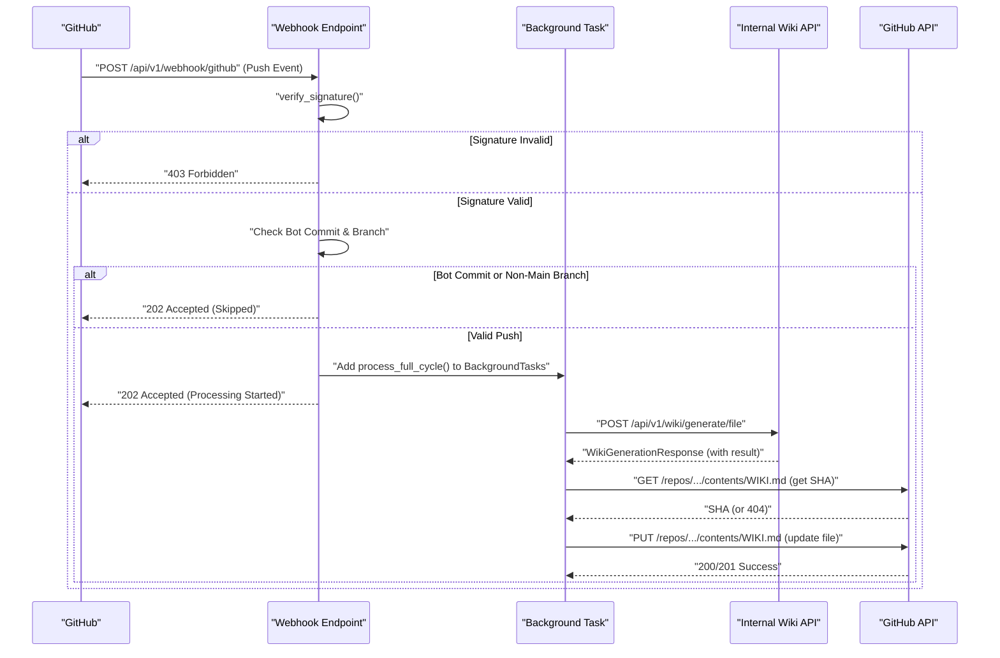

## API Schema Definitions

The `src/models/api_schema.py` file defines the Pydantic models used for request and response bodies across the API.

### `WikiGenerationRequest`

This model defines the input parameters required to initiate a wiki generation task.

| Field | Type | Description |
|---|---|---|
| `repo_owner` | `str` \| `None` | The owner of the repository (user or organization). |
| `repo_name` | `str` \| `None` | The name of the repository. |
| `repo_type` | `Literal["github", "gitlab", "bitbucket", "local"]` | The type of the repository. Defaults to `github`. |
| `repo_url` | `str` \| `None` | The URL for cloning a remote repository. |
| `local_path` | `str` \| `None` | The local path to the repository if `repo_type` is 'local'. |
| `language` | `str` | The language for the generated wiki content. Defaults to `ko`. |
| `is_comprehensive_view` | `bool` | Whether to generate a comprehensive view of the repository. Defaults to `True`. |

**Note**: A `model_validator` automatically derives `repo_owner` and `repo_name` from `repo_url` if they are not explicitly provided and `repo_type` is `github`.
Sources: [src/models/api_schema.py](WikiGenerationRequest class)

### `WikiGenerationResponse`

This model defines the response returned immediately after a wiki generation task is successfully initiated.

| Field | Type | Description |
|---|---|---|
| `message` | `str` | A message indicating the status of the request. |
| `task_id` | `str` | The ID of the background task initiated. |
| `title` | `str` | The title of the generated wiki (determined during initial structure analysis). |
| `description` | `str` | The description of the generated wiki (determined during initial structure analysis). |

Sources: [src/models/api_schema.py](WikiGenerationResponse class)

### `TaskStatusResponse`

This model defines the response returned when querying the status of a background task.

| Field | Type | Description |
|---|---|---|
| `task_id` | `str` | The ID of the task. |
| `status` | `Literal["in_progress", "completed", "failed"]` | Current status of the task. |
| `result` | `Any` \| `None` | Result of the task, if completed or failed. This can contain the generated Markdown text. |

Sources: [src/models/api_schema.py](TaskStatusResponse class)

## Conclusion

The API endpoints provide a robust and flexible interface for the "Wiki as Readme" system. They enable on-demand wiki generation, asynchronous task management, and seamless integration with GitHub for automated documentation updates. The clear separation of concerns between wiki generation and webhook processing, coupled with well-defined data schemas, ensures maintainability and extensibility of the API.

---

<a name="system-architecture"></a>

<details>
<summary>Relevant source files</summary>

The following files were used as context for generating this wiki page:

- [src/app.py](src/app.py)
- [src/server.py](src/server.py)
</details>

# System Architecture

## Introduction

The "Wiki As Readme" project is designed to generate comprehensive documentation for code repositories using AI. This document outlines the core system architecture, detailing the interaction between its primary components: a Streamlit-based user interface and a FastAPI-based backend API. The architecture follows a client-server model, enabling asynchronous processing of wiki generation requests and providing a responsive user experience.

## Overall Architecture

The system is composed of two main applications:
1.  **Frontend Application (`src/app.py`):** A Streamlit application that provides the user interface for configuring and initiating wiki generation. It acts as the client, communicating with the backend API.
2.  **Backend API (`src/server.py`):** A FastAPI application that exposes RESTful endpoints for handling wiki generation requests, managing tasks, and potentially integrating with webhooks. It serves as the central processing unit for all generation logic.

This separation allows for independent development, scaling, and deployment of the UI and the API services.

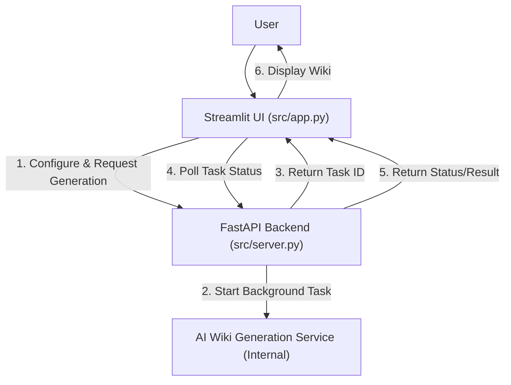
Sources: [src/app.py](main function), [src/server.py](app initialization)

## Frontend Application: Streamlit UI

The Streamlit application (`src/app.py`) is responsible for user interaction, input collection, and displaying the results of the wiki generation process. It communicates with the backend API asynchronously.

### Key Components and Flow

1.  **Configuration and Input (`render_sidebar`):**
    *   Presents a sidebar where users can input repository details (URL or local path) and generation settings (e.g., comprehensive view, language).
    *   Validates user input and constructs a `WikiGenerationRequest` object.
    *   Triggers the generation process upon button click.
    Sources: [src/app.py](render_sidebar function)

2.  **Initiating Generation (`start_generation_task`):**
    *   Sends a `POST` request to the backend API's `/api/v1/wiki/generate/text` endpoint with the `WikiGenerationRequest` payload.
    *   Uses `httpx.AsyncClient` for asynchronous HTTP communication.
    *   Handles API errors (HTTP status errors, network errors) and displays appropriate messages.
    *   Returns a `task_id` upon successful initiation, which is crucial for tracking the generation progress.
    Sources: [src/app.py](start_generation_task function)

3.  **Polling Task Status (`poll_task_status`):**
    *   Continuously queries the backend API's `/api/v1/wiki/status/{task_id}` endpoint to check the status of the generation task.
    *   Provides real-time feedback to the user via a progress bar and status messages.
    *   Updates the UI based on the task status: `completed`, `failed`, or `in progress`.
    *   Retrieves the final generated markdown content or an error message once the task is complete.
    Sources: [src/app.py](poll_task_status function)

4.  **Displaying Results (`render_main_content`):**
    *   Renders the generated wiki content in the main area of the Streamlit application.
    *   Provides a download button for the consolidated Markdown file.
    *   Intelligently parses and renders Mermaid diagrams embedded within the Markdown content using `streamlit_mermaid`.
    Sources: [src/app.py](render_main_content function)

### API Interaction Sequence

```mermaid
sequenceDiagram
    participant User
    participant StreamlitApp as "Streamlit UI (src/app.py)"
    participant FastAPIApp as "FastAPI Backend (src/server.py)"

    User->>StreamlitApp: "Enter Repo Info & Click Generate"
    StreamlitApp->>FastAPIApp: POST /api/v1/wiki/generate/text (WikiGenerationRequest)
    FastAPIApp-->>StreamlitApp: HTTP 202 Accepted (task_id)
    loop Poll for Status
        StreamlitApp->>FastAPIApp: GET /api/v1/wiki/status/{task_id}
        alt Task In Progress
            FastAPIApp-->>StreamlitApp: HTTP 200 OK (status: "in_progress")
            StreamlitApp->>StreamlitApp: "Update Progress Bar"
        else Task Completed
            FastAPIApp-->>StreamlitApp: HTTP 200 OK (status: "completed", result: {markdown_content})
            break
        else Task Failed
            FastAPIApp-->>StreamlitApp: HTTP 200 OK (status: "failed", result: {error_message})
            break
        end
    end
    StreamlitApp->>User: "Display Generated Wiki / Error"
```
Sources: [src/app.py](start_generation_task function, poll_task_status function)

### Wiki Generation Request Model

The `WikiGenerationRequest` object, used for initiating the generation process, encapsulates all necessary parameters.

| Parameter | Type | Description |
|---|---|---|
| `repo_type` | `str` | Type of repository (e.g., "github", "gitlab", "local"). |
| `repo_url` | `str` (Optional) | URL of the remote repository. |
| `local_path` | `str` (Optional) | Local file system path to the repository. |
| `language` | `str` | Target language for the wiki (e.g., "en", "ko"). |
| `is_comprehensive_view` | `bool` | Flag to request a more detailed and structured wiki. |
Sources: [src/app.py](render_sidebar function, WikiGenerationRequest usage)

## Backend API: FastAPI Server

The FastAPI application (`src/server.py`) serves as the backend for the "Wiki As Readme" system. It provides the API endpoints that the Streamlit frontend consumes.

### Core Components

1.  **FastAPI Application Instance:**
    *   Initialized with a title, description, and version.
    *   `app = FastAPI(...)`
    Sources: [src/server.py](app initialization)

2.  **Health Check Endpoint:**
    *   A simple GET endpoint at the root (`/`) to verify the server's operational status.
    *   Returns `{"status": "ok"}`.
    Sources: [src/server.py](health_check function)

3.  **API Routers:**
    *   The application includes modular routers for different API concerns:
        *   **Wiki Generation Router (`src.api.v1.endpoints.wiki`):** Mounted at `/api/v1/wiki`, this router handles requests related to starting wiki generation and checking task status.
        *   **Webhook Integration Router (`src.api.v1.endpoints.webhook`):** Mounted at `/api/v1/webhook`, this router is intended for handling incoming webhooks (e.g., from Git providers), though its specific implementation details are not provided in the given context.
    Sources: [src/server.py](app.include_router calls)

4.  **Logging:**
    *   Integrates `loguru` for structured and informative logging, configured via `src.core.logger_config`.
    Sources: [src/server.py](setup_logging call, logger usage)

5.  **Server Execution:**
    *   Uses `uvicorn` to run the FastAPI application, typically on `http://127.0.0.1:8000`.
    *   `uvicorn.run("server:app", host="127.0.0.1", port=8000, reload=True)`
    Sources: [src/server.py](uvicorn.run call)

### API Endpoints (as consumed by the client)

Based on the client-side interaction, the following API endpoints are exposed by the backend:

| Endpoint | Method | Description |
|---|---|---|
| `/api/v1/wiki/generate/text` | `POST` | Initiates a wiki generation task for a given repository. Expects a `WikiGenerationRequest` payload. Returns a `task_id`. |
| `/api/v1/wiki/status/{task_id}` | `GET` | Retrieves the current status and results of a specific wiki generation task. |
Sources: [src/app.py](start_generation_task function, poll_task_status function)

## Conclusion

The "Wiki As Readme" system employs a robust client-server architecture, leveraging Streamlit for an interactive frontend and FastAPI for a scalable backend API. This design facilitates asynchronous task processing, clear separation of concerns, and a responsive user experience for generating comprehensive documentation from code repositories. The task-based API design allows for long-running operations like AI-driven content generation to be managed efficiently.

---

<a name="core-components-overview"></a>

<details>
<summary>Relevant source files</summary>

The following files were used as context for generating this wiki page:

- [src/services/repo_fetcher.py](src/services/repo_fetcher.py)
- [src/services/structure_analyzer.py](src/services/structure_analyzer.py)
- [src/services/wiki_generator.py](src/services/wiki_generator.py)
- [src/services/wiki_formatter.py](src/services/wiki_formatter.py)
- [src/agent/llm.py](src/agent/llm.py)
- [src/providers/github.py](src/providers/github.py)
</details>

# Core Components Overview

This document provides an overview of the core components responsible for the end-to-end wiki generation process. The system is designed with a modular architecture, separating concerns such as repository interaction, LLM orchestration, content generation, and final formatting. This modularity allows for flexibility in integrating different repository providers, LLM models, and output formats.

The primary goal of these components is to take a software repository as input, analyze its structure and content, and produce a comprehensive, well-structured technical wiki page using Large Language Models (LLMs).

## 1. WikiGenerationService: The Orchestrator

The `WikiGenerationService` acts as the central coordinator for the entire wiki generation pipeline. It orchestrates the interactions between various sub-services, managing the flow from initial request validation to the final markdown output.

### Key Responsibilities

*   **Request Validation:** Ensures that the incoming `WikiGenerationRequest` contains all necessary parameters for the specified repository type.
*   **Pipeline Management:** Manages the sequence of operations: fetching repository data, determining wiki structure, generating page content, and formatting the final output.
*   **Resource Management:** Handles the lifecycle of sub-services, ensuring proper initialization and cleanup.
*   **Human-in-the-Loop Support:** Provides methods (`prepare_generation`) to allow for intermediate steps where a user might review or modify the generated structure before content generation proceeds.

### Core Methods

| Method | Description |
|---|---|
| `validate_request` | Static method to check if the `WikiGenerationRequest` is valid for the given `repo_type`. |
| `prepare_generation` | Initializes components and determines the wiki structure without generating content, returning a `WikiStructureDeterminer` instance. |
| `generate_wiki` | Executes the full pipeline: fetches structure, generates content, and consolidates markdown. Can resume from a pre-prepared `WikiStructureDeterminer`. |
| `_initialize_and_determine` | Internal method to fetch repository structure and then invoke the `WikiStructureDeterminer` to propose the wiki layout. |
| `save_to_file` | Writes the final markdown content to a specified file path. |

Sources: [src/services/wiki_generator.py](WikiGenerationService class)

### Wiki Generation Flow

The following diagram illustrates the high-level flow orchestrated by the `WikiGenerationService`:

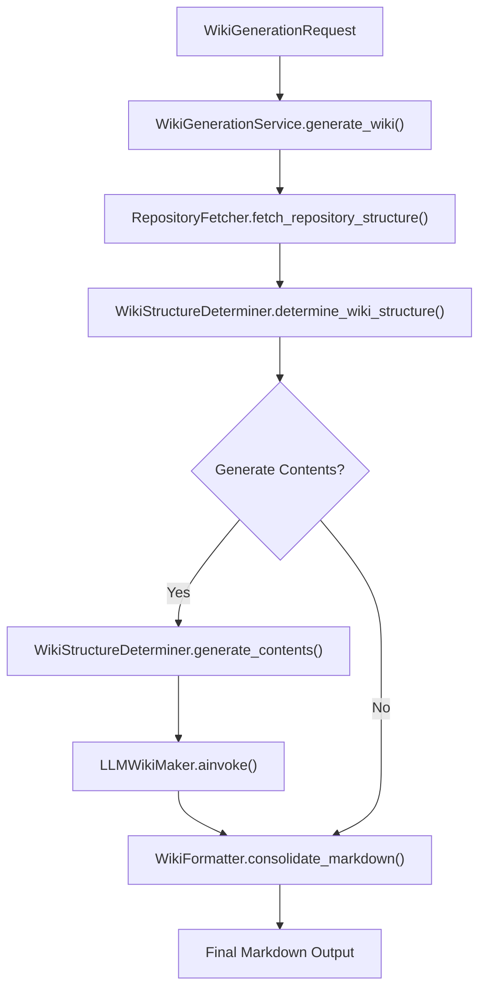

## 2. RepositoryFetcher: Data Source Abstraction

The `RepositoryFetcher` service is responsible for abstracting the details of interacting with different version control systems (VCS) or local file systems. It provides a unified interface to retrieve repository metadata (file tree, README) and individual file contents.

### Key Responsibilities

*   **Provider Abstraction:** Maps repository types (e.g., "github", "gitlab", "local") to concrete `RepositoryProvider` implementations.
*   **Repository Structure Retrieval:** Fetches the complete file tree and README content of a given repository.
*   **File Content Retrieval:** Fetches the content of specific files within the repository.
*   **Resource Management:** Manages underlying HTTP client sessions for efficient and clean resource handling, supporting asynchronous context management.

### Core Methods

| Method | Description |
|---|---|
| `__init__` | Initializes the fetcher by instantiating the correct `RepositoryProvider` based on the request. |
| `fetch_repository_structure` | Asynchronously retrieves the `RepositoryStructure` (file tree, README, default branch). |
| `fetch_file_content` | Asynchronously fetches the content of a single file given its path. |
| `close` | Cleans up resources held by the underlying provider. |
| `__aenter__`, `__aexit__` | Enables asynchronous context manager usage (`async with`). |

Sources: [src/services/repo_fetcher.py](RepositoryFetcher class)

### Repository Provider Architecture

The `RepositoryFetcher` utilizes a strategy pattern, delegating actual data fetching to specific `RepositoryProvider` implementations.

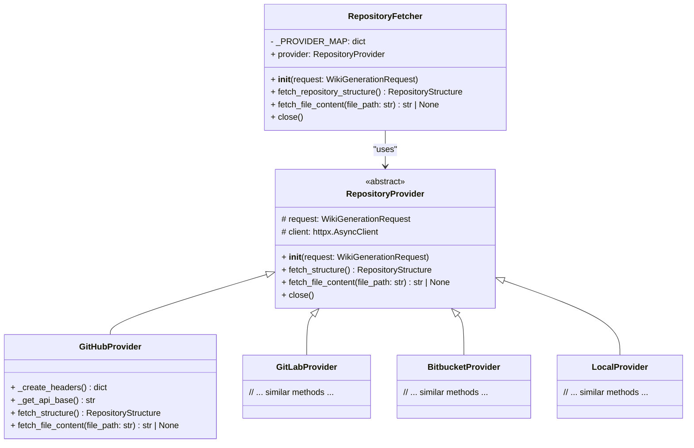

### Example: GitHubProvider

The `GitHubProvider` implements the `RepositoryProvider` interface specifically for GitHub repositories. It interacts with the GitHub REST API to fetch repository information.

*   **Authentication:** Uses `GIT_API_TOKEN` from settings for authenticated requests.
*   **Structure Fetching:** Retrieves the default branch, then uses the Git Trees API (`/git/trees/{sha}?recursive=1`) to get the file list, and the Readme API (`/repos/{owner}/{repo}/readme`) for the README content.
*   **Content Fetching:** Uses the Contents API (`/repos/{owner}/{repo}/contents/{path}`) to retrieve file content, which is typically Base64 encoded and requires decoding.

Sources: [src/providers/github.py](GitHubProvider class)

## 3. WikiStructureDeterminer: The Intelligence Core

The `WikiStructureDeterminer` is a critical service responsible for leveraging LLMs to analyze repository content and generate the wiki's structure (pages, titles, associated files) and their respective markdown content.

### Key Responsibilities

*   **Structure Generation:** Invokes an LLM to analyze the file tree and README to propose a logical wiki structure (`WikiStructure`).
*   **Content Generation:** For each proposed wiki page, it fetches relevant source files and uses an LLM to generate the page's markdown content.
*   **Prompt Management:** Loads and renders Jinja2 templates for LLM prompts.
*   **Concurrency Control:** Manages the number of concurrent LLM calls using an `asyncio.Semaphore` to prevent overwhelming the LLM provider or system resources.
*   **State Management:** Tracks the progress of page generation, including pages in progress, completed pages, and any errors.

### Core Methods

| Method | Description |
|---|---|
| `__init__` | Initializes with a `WikiGenerationRequest`, `RepositoryFetcher`, `LLMWikiMaker`, and a concurrency `semaphore`. |
| `_load_prompt_template` | Cached method to load LLM prompt templates from YAML files. |
| `_fetch_and_format_files` | Fetches content for a list of file paths in parallel using `RepositoryFetcher` and formats them for LLM input. |
| `generate_page_content` | Orchestrates the generation of a single wiki page's content using an LLM, respecting concurrency limits. |
| `determine_wiki_structure` | Invokes an LLM to analyze the repository's file tree and README to create the initial `WikiStructure`. |
| `_start_content_generation_flow` | Manages the asynchronous execution of all page content generation tasks. |

Sources: [src/services/structure_analyzer.py](WikiStructureDeterminer class)

### Structure and Content Generation Flow

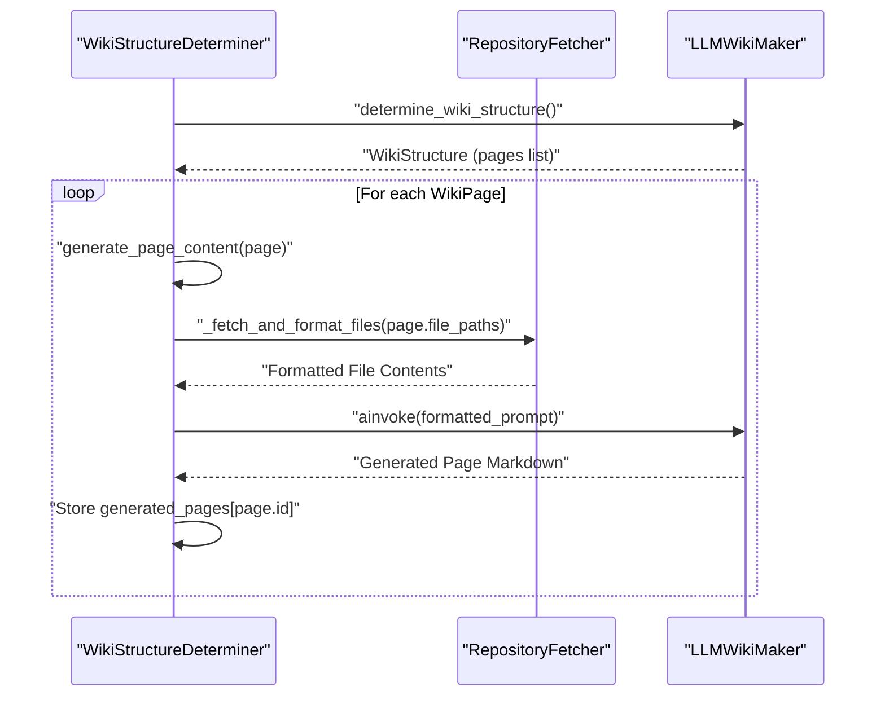

## 4. LLMWikiMaker: The AI Agent

The `LLMWikiMaker` class provides a standardized interface for interacting with various Large Language Models (LLMs) through the LiteLLM library. It abstracts away provider-specific configurations and handles structured output parsing.

### Key Responsibilities

*   **LLM Provider Configuration:** Dynamically configures LLM models based on `settings` (e.g., OpenAI, Google Vertex AI, Anthropic, Ollama), handling API keys and base URLs.
*   **Asynchronous Invocation:** Provides an `ainvoke` method for non-blocking calls to LLMs.
*   **Structured Output:** Supports returning Pydantic models directly from LLM responses, either through native structured output capabilities of the LLM provider or by parsing JSON from the LLM's text output.
*   **Error Handling:** Includes basic error handling for LLM interactions and response parsing.

### Core Methods

| Method | Description |
|---|---|
| `__init__` | Initializes with an optional `response_schema` for structured output and configures the LLM. |
| `_configure_llm` | Determines the LLM model name and specific parameters (e.g., API keys, base URLs) based on the configured provider. |
| `ainvoke` | Asynchronously calls the configured LLM with the given input, returning either a string or a Pydantic model instance. |
| `_extract_json` | Helper method to extract JSON content from markdown code blocks in LLM responses. |

Sources: [src/agent/llm.py](LLMWikiMaker class)

### Supported LLM Providers

The `LLMWikiMaker` supports a variety of LLM providers, configured via environment variables and application settings:

*   Google Vertex AI
*   OpenAI (GPT models)
*   Anthropic (Claude models)
*   OpenRouter
*   xAI (Grok)
*   Ollama / On-premise (OpenAI-compatible endpoints)

## 5. WikiFormatter: Output Generation

The `WikiFormatter` service is responsible for taking the generated wiki structure and individual page contents and consolidating them into a single, well-formatted Markdown string.

### Key Responsibilities

*   **Markdown Consolidation:** Merges the `WikiStructure` (title, description, page order) with the generated page content into a cohesive document.
*   **Table of Contents (TOC) Generation:** Automatically creates a table of contents with internal links to each wiki page.
*   **Anchor Link Management:** Generates unique anchor names for each page title to enable navigation within the markdown document.
*   **Filename Sanitization:** Provides utility for creating safe filenames from arbitrary strings.

### Core Methods

| Method | Description |
|---|---|
| `sanitize_filename` | Static method to clean a string for use as a filename, removing invalid characters. |
| `consolidate_markdown` | Static method that takes a `WikiStructure` and a dictionary of page IDs to markdown content, returning a single markdown string. |

Sources: [src/services/wiki_formatter.py](WikiFormatter class)

## Conclusion

The core components of this wiki generation system form a robust and extensible pipeline. From fetching diverse repository data through `RepositoryFetcher` and its providers, intelligently determining structure and content with `WikiStructureDeterminer` and `LLMWikiMaker`, to orchestrating the entire process via `WikiGenerationService` and finally formatting the output with `WikiFormatter`, each component plays a vital role. This modular design ensures maintainability, testability, and adaptability to future changes in repository types, LLM technologies, or output requirements.

---

<a name="contributing-to-wiki-as-readme"></a>

<details>
<summary>Relevant source files</summary>

The following files were used as context for generating this wiki page:

- [README.md](README.md)
- [LICENSE](LICENSE)
</details>

# Contributing to Wiki As Readme

## Introduction

**Wiki As Readme** is a flexible AI documentation tool designed to transform codebases into comprehensive wikis. It supports various LLM providers (commercial APIs, local models), integrates with any Git platform or local folders, and offers multiple deployment options. This document outlines how to contribute to the project, providing essential context for developers looking to get involved. The project actively welcomes contributions and Pull Requests to enhance its features and integrations.

Sources: [README.md](Introduction), [README.md](Note on Contributions)

## Project Overview for Contributors

Understanding the core principles and architecture of Wiki As Readme is crucial for effective contributions.

### Universal Compatibility

The project is built with a strong emphasis on pluggability and compatibility across different environments:

*   **Model Agnostic:** Powered by LiteLLM, it supports a wide range of LLMs including commercial APIs (Google Vertex AI, OpenAI, Anthropic, xAI) and open/local models (Ollama, OpenRouter, HuggingFace), as well as on-premise LLM endpoints.
*   **Platform Agnostic:** It works seamlessly with cloud repositories like GitHub, GitLab, Bitbucket, and can analyze code directly from local file systems. It also supports private instances and self-hosted Git servers.
*   **Deployment Agnostic:** The tool can be integrated into CI/CD pipelines (e.g., GitHub Actions), run via Docker Compose, deployed as a long-running API service with Webhooks, or executed as a CLI tool.

Sources: [README.md](Universal Compatibility)

### Core Features

Key functionalities that contributors might extend or improve include:

*   **Deep Context Analysis:** Understanding project architecture through file structure and relationships.
*   **Smart Structure Generation:** Automatically creating logical documentation hierarchies (Sections > Pages).
*   **Comprehensive Content:** Generating detailed pages covering architecture, installation, and API references.
*   **Automatic Diagrams:** Producing Mermaid.js diagrams (Flowcharts, Sequence, Class) for visualization.
*   **Hybrid Output:** Generating both individual Markdown files for a wiki and a single consolidated `README.md`.
*   **Async & Scalable:** Built with FastAPI and AsyncIO for efficient handling of large documentation tasks.

Sources: [README.md](Core Features)

### Architecture

The project's architecture is composed of several modern technologies:

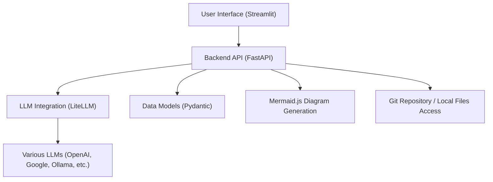

*   **Frontend:** [Streamlit](https://streamlit.io/) for the interactive user interface.
*   **Backend:** [FastAPI](https://fastapi.tiangolo.com/) for the REST API and managing background tasks.
*   **LLM Integration:** [LiteLLM](https://docs.litelllm.ai/) provides a unified interface to over 100 LLMs.
*   **Data Models:** [Pydantic](https://docs.pydantic.dev/) ensures type safety and structured output validation.
*   **Diagrams:** [Mermaid.js](https://mermaid.js.org/) is used for generating visual representations of architecture.

Sources: [README.md](Architecture)

## Getting Started with Development

For developers looking to contribute, setting up a local Python development environment is the recommended approach.

### Prerequisites

*   Python 3.12+
*   [uv](https://github.com/astral-sh/uv) (a fast Python package installer and resolver)

### Setup Steps

1.  **Clone the Repository:**
    ```bash
    git clone https://github.com/catuscio/wiki-as-readme.git
    cd wiki-as-readme
    ```
2.  **Install Dependencies:**
    ```bash
    uv sync
    ```
3.  **Activate Virtual Environment:**
    ```bash
    source .venv/bin/activate
    ```
4.  **Configure Environment Variables:**
    Copy the example environment file and populate it with your LLM API keys and other settings.
    ```bash
    cp .env.example .env
    # Edit .env with your preferred text editor
    ```
5.  **Run Backend Server:**
    ```bash
    uv run uvicorn src.server:app --reload --port 8000
    ```
6.  **Run Frontend UI:**
    ```bash
    uv run streamlit run src/app.py
    ```

Sources: [README.md](Local Python Development)

### Configuration Reference

When developing or deploying, the application's behavior is controlled via environment variables, typically set in a `.env` file.

| Category | Variable | Description | Example |
|---|---|---|---|
| **LLM Provider** | `LLM_PROVIDER` | Specifies the LLM service to use. Options include `google`, `openai`, `anthropic`, `xai`, `openrouter`, `ollama`. | `google` |
| | `MODEL_NAME` | The specific identifier for the chosen LLM model. | `gemini-2.0-flash-exp` |
| **Auth** | `OPENAI_API_KEY` | API key for OpenAI services. | `sk-...` |
| | `GCP_PROJECT_NAME` | Project ID for Google Cloud Vertex AI. | `my-genai-project` |
| **Advanced** | `USE_STRUCTURED_OUTPUT` | Boolean flag to enable native JSON mode for LLM interactions. | `true` |
| **Filtering** | `IGNORED_PATTERNS` | A JSON array of glob patterns to exclude files or directories from analysis. | `'["*.log", "node_modules/*"]'` |

Sources: [README.md](Configuration Reference (.env))

## Contribution Guidelines

Contributions are highly encouraged. Please follow these steps to contribute:

1.  **Fork the Project:** Create a fork of the `wiki-as-readme` repository on GitHub.
2.  **Create a Feature Branch:**
    ```bash
    git checkout -b feature/YourAmazingFeature
    ```
3.  **Commit Your Changes:** Make your changes and commit them with a descriptive message.
    ```bash
    git commit -m 'feat: Add Your Amazing Feature'
    ```
4.  **Push to the Branch:** Push your local branch to your forked repository.
    ```bash
    git push origin feature/YourAmazingFeature
    ```
5.  **Open a Pull Request:** Submit a Pull Request from your feature branch to the `main` branch of the original repository.

Sources: [README.md](Contributing)

## License

This project is licensed under the MIT License. By contributing, you agree that your contributions will be licensed under the same terms.

Sources: [README.md](License), [LICENSE](file start)

## Conclusion

Contributing to Wiki As Readme offers an opportunity to enhance a versatile AI documentation tool. By following the development setup and contribution guidelines, developers can help improve its universal compatibility, core features, and overall robustness. The project's modular architecture and clear contribution path aim to make the process straightforward and rewarding.

---
