# Wiki As Readme Documentation

Comprehensive documentation for Wiki As Readme, a flexible AI documentation tool that transforms codebases into detailed wikis.

## Table of Contents

- [Project Overview](#project-overview)
- [Core Features](#core-features)
- [Universal Compatibility](#universal-compatibility)
- [Using as GitHub Action](#using-as-github-action)
- [Local Deployment (Docker & Python)](#local-deployment-(docker-&-python))
- [Server Deployment & Webhooks](#server-deployment-&-webhooks)
- [Configuration Reference](#configuration-reference)
- [API Endpoints](#api-endpoints)
- [System Architecture](#system-architecture)
- [Core Codebase Components](#core-codebase-components)
- [Generated Wiki Examples](#generated-wiki-examples)
- [Contributing to Wiki As Readme](#contributing-to-wiki-as-readme)

---

<a name="project-overview"></a>

<details>
<summary>Relevant source files</summary>

The following files were used as context for generating this wiki page:

- [README.md](README.md)
- [action.yml](action.yml)
- [pyproject.toml](pyproject.toml)
</details>

# Project Overview

## Introduction

**Wiki As Readme** is a versatile AI-powered documentation tool designed to transform any codebase into a comprehensive wiki or `README.md` file rapidly. It aims to be the most flexible solution available, adapting to various LLM providers, code platforms, and deployment environments. The project emphasizes "universal compatibility," allowing users to choose their preferred models (local or commercial), integrate with any Git platform or local folders, and deploy in diverse ways such as CI/CD pipelines, Docker containers, or as a standalone API service. Its core mission is to provide a "drop-in" documentation solution that understands project architecture and generates detailed, structured, and visually enhanced documentation.
Sources: [README.md](Introduction section)

## Core Capabilities

Wiki As Readme provides a robust set of features to automate and enhance documentation generation:

*   **🧠 Deep Context Analysis:** The tool analyzes the project's file structure and inter-file relationships to build a comprehensive understanding of the codebase's architecture before generating content.
    Sources: [README.md](Core Features)
*   **📦 Smart Structure Generation:** It automatically determines a logical hierarchy for the documentation, organizing content into sections and pages for clarity and navigability.
    Sources: [README.md](Core Features)
*   **🔍 Comprehensive Content:** Generated pages include detailed information such as architecture overviews, installation guides, and API references, ensuring thorough coverage of the project.
    Sources: [README.md](Core Features)
*   **📊 Automatic Diagrams:** To visualize complex architectures, the tool generates diagrams using **Mermaid.js**, including Flowcharts, Sequence diagrams, and Class diagrams.
    Sources: [README.md](Core Features)
*   **🚗 Hybrid Output:** It can produce both individual Markdown files suitable for a wiki and a single, consolidated `README.md` file, offering flexibility in documentation format.
    Sources: [README.md](Core Features)
*   **⚡ Async & Scalable:** Built with **FastAPI** and **AsyncIO**, the backend is designed for non-blocking, efficient generation, capable of handling large documentation tasks.
    Sources: [README.md](Core Features)

## System Architecture

The Wiki As Readme project is structured into distinct components, leveraging modern web and AI technologies to deliver its functionality.

### High-Level Component Diagram

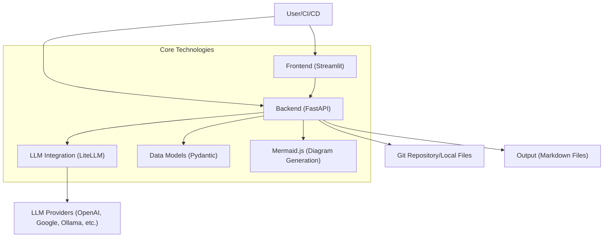
```mermaid
graph TD
    User["User/CI/CD"] --> Frontend["Frontend (Streamlit)"]
    User --> Backend["Backend (FastAPI)"]

    Frontend --> Backend
    Backend --> LLM_Integration["LLM Integration (LiteLLM)"]
    Backend --> Data_Models["Data Models (Pydantic)"]
    LLM_Integration --> LLM_Providers["LLM Providers (OpenAI, Google, Ollama, etc.)"]
    Backend --> Git_Repo["Git Repository/Local Files"]
    Backend --> Mermaid_JS["Mermaid.js (Diagram Generation)"]
    Backend --> Output_MD["Output (Markdown Files)"]

    subgraph Core Technologies
        Frontend
        Backend
        LLM_Integration
        Data_Models
        Mermaid_JS
    end
```

### Technology Stack

*   **Frontend:** [Streamlit](https://streamlit.io/) is used for building the interactive user interface, allowing users to configure and trigger documentation generation.
    Sources: [README.md](Architecture)
*   **Backend:** [FastAPI](https://fastapi.tiangolo.com/) powers the REST API, handles background tasks, and orchestrates the documentation generation process. It provides endpoints for wiki generation and webhook processing.
    Sources: [README.md](Architecture)
*   **LLM Integration:** [LiteLLM](https://docs.litellm.ai/) serves as a unified interface, enabling seamless connection to over 100 different Large Language Models (LLMs), including commercial APIs and local models.
    Sources: [README.md](Architecture)
*   **Data Models:** [Pydantic](https://docs.pydantic.dev/) is utilized for type safety, data validation, and ensuring structured output from LLMs.
    Sources: [README.md](Architecture)
*   **Diagrams:** [Mermaid.js](https://mermaid.js.org/) is integrated to automatically generate various types of diagrams (Flowcharts, Sequence, Class) to visually represent code architecture.
    Sources: [README.md](Architecture)

## Usage and Deployment

Wiki As Readme is designed for flexibility, offering multiple modes of operation to suit different workflows and environments.

### 1. GitHub Action (Recommended)

This mode automates documentation updates directly within a CI/CD pipeline. It leverages a Dockerized GitHub Action to generate and commit documentation changes on specified events (e.g., `push` to `main`).

**Workflow Example (`.github/workflows/update-wiki.yml`):**

```yaml
name: Update Wiki README

on:
  push:
    branches:
      - main
    paths-ignore:
      - 'README.md'
      - 'WIKI.md'
      - '.github/workflows/WIKI-AS-README-AS-ACTION.yml'
  workflow_dispatch:

jobs:
  generate-and-commit:
    runs-on: ubuntu-latest
    permissions:
      contents: write
    env:
      OUTPUT_FILE: "WIKI.md"
    steps:
      - name: Checkout code
        uses: actions/checkout@v4
      - name: Generate Wiki Content
        uses: docker://ghcr.io/catuscio/wiki-as-readme-action:latest
        env:
          LANGUAGE: "en"
          OUTPUT_FILE: ${{ env.OUTPUT_FILE }}
          LLM_PROVIDER: "google"
          MODEL_NAME: "gemini-2.5-flash"
          GCP_PROJECT_NAME: ${{ secrets.GCP_PROJECT_NAME }}
          GCP_MODEL_LOCATION: ${{ secrets.GCP_MODEL_LOCATION }}
          GOOGLE_APPLICATION_CREDENTIALS: /github/workspace/gcp-key.json
          GIT_API_TOKEN: ${{ secrets.GITHUB_TOKEN }}
      - name: Commit and Push changes
        uses: stefanzweifel/git-auto-commit-action@v5
        with:
          commit_message: "docs: ✨Update ${{ env.OUTPUT_FILE }} via Wiki-As-Readme Action"
          file_pattern: ${{ env.OUTPUT_FILE }}
```
Sources: [README.md](GitHub Action (Recommended)), [action.yml](inputs)

**Key Inputs for GitHub Action:**

| Input Name | Description | Default |
|---|---|---|
| `language` | Language for generated content (e.g., `en`, `ko`) | `en` |
| `wiki_output_path` | File path to save the generated wiki content | `WIKI.md` |
| `llm_provider` | LLM provider (e.g., `google`, `openai`, `ollama`) | `google` |
| `model_name` | Specific model name to use (e.g., `gemini-2.5-flash`) | `gemini-2.5-flash` |
| `openai_api_key` | OpenAI API Key | |
| `gcp_project_name` | GCP Project Name for Vertex AI | |
| `git_api_token` | GitHub/GitLab API Token for private repos | |
| `ignored_patterns` | JSON array of glob patterns to ignore | `[]` |
Sources: [action.yml](inputs)

### 2. Docker Compose (Local)

For local execution with a UI and API, Docker Compose provides a quick setup without manual Python dependency management.

```bash
# Configure .env file first
docker-compose up --build
```
*   **Web UI:** `http://localhost:8501`
*   **API Docs:** `http://localhost:8000/docs`
Sources: [README.md](Docker Compose (Local))

### 3. Local Python Development

Developers can run the application directly from source for modification or without Docker.

**Prerequisites:** Python 3.12+, `uv` package manager.

```bash
git clone https://github.com/catuscio/wiki-as-readme.git
cd wiki-as-readme
uv sync
source .venv/bin/activate
# Configure .env file
uv run uvicorn src.server:app --reload --port 8000  # Run Backend
uv run streamlit run src/app.py                   # Run Frontend
```
Sources: [README.md](Local Python Development)

### 4. Server & Webhooks

The API server can be deployed as a long-running service, capable of handling webhooks (e.g., GitHub push events) to trigger automatic documentation generation.

*   **Endpoint:** `POST /api/v1/webhook/github`
*   **Payload:** Standard GitHub push event payload.
*   **Behavior:** Triggers a background task to generate and commit the wiki for the repository.
Sources: [README.md](Server & Webhooks)

## Configuration Reference

The application's behavior is configured primarily through environment variables, which can be set in a `.env` file or directly in the deployment environment (e.g., GitHub Actions secrets).

| Category | Variable | Description | Example |
|---|---|---|---|
| **LLM Provider** | `LLM_PROVIDER` | Specifies the LLM service to use. | `google` |
| | `MODEL_NAME` | The specific model identifier within the chosen provider. | `gemini-2.0-flash-exp` |
| **Auth** | `OPENAI_API_KEY` | API key for OpenAI services. | `sk-...` |
| | `GCP_PROJECT_NAME` | Google Cloud Project ID for Vertex AI. | `my-genai-project` |
| **Advanced** | `USE_STRUCTURED_OUTPUT` | Enables native JSON mode for LLM responses. | `true` |
| **Filtering** | `IGNORED_PATTERNS` | JSON array of glob patterns to exclude from analysis. | `'["*.log", "node_modules/*"]'` |
Sources: [README.md](Configuration Reference (`.env`)), [action.yml](inputs)

## API Reference

The backend API is built with FastAPI and provides interactive Swagger documentation at `/docs` when running.

### Wiki Generation Endpoints

*   **`POST /api/v1/wiki/generate/file`**: Initiates a background task to generate the wiki and save it as a Markdown file on the server.
    *   **Request Body Example:**
        ```json
        {
          "repo_url": "https://github.com/owner/repo",
          "repo_type": "github",
          "language": "en",
          "is_comprehensive_view": true
        }
        ```
*   **`POST /api/v1/wiki/generate/text`**: Starts a background task to generate the wiki, storing the resulting text within the task status.
*   **`GET /api/v1/wiki/status/{task_id}`**: Retrieves the current status and the final result of a specific generation task.
Sources: [README.md](API Reference)

### Webhook Endpoint

*   **`POST /api/v1/webhook/github`**: This endpoint is designed to receive GitHub Push event webhooks, triggering automatic wiki generation for the repository.
Sources: [README.md](API Reference)

## Development and Dependencies

The project is a Python-based application with specific dependencies and development tools.

### Core Dependencies

The `pyproject.toml` file outlines the primary dependencies required for the application to run:

*   `google-auth`: For Google Cloud authentication.
*   `httpx`: A modern HTTP client.
*   `jinja2`: Templating engine.
*   `litellm`: Core library for LLM integration.
*   `loguru`: For logging.
*   `pydantic`, `pydantic-settings`: For data validation and settings management.
*   `python-dotenv`: For loading environment variables.
*   `pyyaml`: For YAML parsing.
*   `requests`: HTTP library.
Sources: [pyproject.toml](project.dependencies)

### Optional Dependencies

The project also defines optional dependency groups for specific functionalities:

*   `ui`: Includes `streamlit` and `streamlit-mermaid` for the web user interface.
*   `api`: Includes `fastapi`, `uvicorn`, and `gunicorn` for the API server.
*   `notion`: Includes `notion-client` for Notion integration.
*   `all`: Combines all optional dependencies.
Sources: [pyproject.toml](project.optional-dependencies)

### Development Tools

For code quality and development workflow, the project uses:

*   `pre-commit`: For managing pre-commit hooks.
*   `ruff`: A fast Python linter and formatter.
Sources: [pyproject.toml](dependency-groups.dev)

## Conclusion

Wiki As Readme stands as a powerful, flexible, and highly adaptable solution for automated documentation. By abstracting away the complexities of LLM integration, platform specifics, and deployment environments, it empowers developers and teams to maintain up-to-date, comprehensive project documentation with minimal effort. Its modular architecture and diverse usage modes make it suitable for a wide range of projects, from small open-source initiatives to large enterprise applications.

---

<a name="core-features"></a>

<details>
<summary>Relevant source files</summary>

The following files were used as context for generating this wiki page:

- [README.md](README.md)
- [src/services/structure_analyzer.py](src/services/structure_analyzer.py)
- [src/services/wiki_generator.py](src/services/wiki_generator.py)
- [src/prompts/wiki_structure_generator.yaml](src/prompts/wiki_structure_generator.yaml)
- [src/prompts/wiki_contents_generator.yaml](src/prompts/wiki_contents_generator.yaml)
</details>

# Core Features

This page details the core functionalities that power the "Wiki As Readme" tool, enabling it to transform a codebase into comprehensive documentation. These features collectively ensure universal compatibility, intelligent content generation, and efficient operation across various environments and LLM providers.

## Overview of Core Features

"Wiki As Readme" is designed to be a highly flexible and powerful AI documentation tool. Its core features are engineered to provide a seamless and intelligent documentation generation experience, adapting to diverse project needs and technical stacks. The primary goal is to automate the creation of high-quality, structured, and visually rich technical wikis directly from source code.

The key features include:
*   **Deep Context Analysis**: Understanding the project's architecture.
*   **Smart Structure Generation**: Creating a logical documentation hierarchy.
*   **Comprehensive Content**: Generating detailed page content.
*   **Automatic Diagrams**: Visualizing complex concepts with Mermaid.js.
*   **Hybrid Output**: Producing both consolidated and individual Markdown files.
*   **Async & Scalable**: Ensuring efficient processing for large projects.

## Detailed Feature Breakdown

### 🧠 Deep Context Analysis

This feature allows "Wiki As Readme" to understand the underlying architecture and relationships within a project before generating any content. It goes beyond simple file parsing to grasp the project's intent and structure.

*   **Mechanism**: The `WikiStructureDeterminer` service is responsible for this analysis. It takes the entire file tree and the project's `README.md` as primary inputs. These inputs are then fed into a Large Language Model (LLM) via a specialized prompt.
*   **Inputs**:
    *   `file_tree`: A hierarchical representation of all files and directories in the repository.
    *   `readme`: The main `README.md` file, often containing project overview, setup instructions, and key concepts.
*   **Prompting**: The `wiki_structure_generator.yaml` prompt explicitly instructs the LLM to act as an expert technical writer and software architect, analyzing the provided `fileTree` and `readme` to determine the most logical and detailed wiki structure.

Sources:
*   [src/services/structure_analyzer.py](WikiStructureDeterminer.determine_wiki_structure)
*   [src/prompts/wiki_structure_generator.yaml](template input_variables: fileTree, readme)

### 📦 Smart Structure Generation

Following deep context analysis, the tool automatically devises a logical and navigable structure for the wiki, organizing information into sections and pages.

*   **Mechanism**: The `determine_wiki_structure` method within `WikiStructureDeterminer` orchestrates this process. It leverages the LLM, guided by the `wiki_structure_generator.yaml` prompt, to output a structured JSON object conforming to the `WikiStructure` Pydantic model. This model defines sections, pages, their relationships, and metadata.
*   **Output**: The LLM generates a `WikiStructure` object, which includes:
    *   `WikiSection` objects: Defining logical groupings of pages.
    *   `WikiPage` objects: Representing individual documentation pages, each with a title, ID, and a list of relevant source file paths.
*   **Hierarchy**: The generated structure includes `root_sections` and `subsections`, creating a clear hierarchy for the documentation.

Sources:
*   [src/services/structure_analyzer.py](WikiStructureDeterminer.determine_wiki_structure)
*   [src/prompts/wiki_structure_generator.yaml](template output schema: WikiStructure)

### 🔍 Comprehensive Content

Each page within the generated wiki is populated with detailed, accurate, and contextually relevant technical content, drawing directly from the specified source files.

*   **Mechanism**: The `generate_page_content` method in `WikiStructureDeterminer` is responsible for creating the content for individual `WikiPage` objects.
    1.  **File Fetching**: It first identifies and fetches the content of `file_paths` associated with a specific page using `_fetch_and_format_files`. This ensures that only directly relevant code is used.
    2.  **LLM Invocation**: The fetched content, along with the page title, is then passed to the LLM using the `wiki_contents_generator.yaml` prompt.
*   **Content Directives**: The `wiki_contents_generator.yaml` prompt provides strict instructions for content generation, including:
    *   Mandatory `<details>` block for source file citation.
    *   Structured content (Introduction, Detailed Sections, Conclusion).
    *   Inclusion of Mermaid diagrams and Markdown tables where appropriate.
    *   Strict citation format for claims and code snippets.

Sources:
*   [src/services/structure_analyzer.py](WikiStructureDeterminer.generate_page_content)
*   [src/services/structure_analyzer.py](WikiStructureDeterminer._fetch_and_format_files)
*   [src/prompts/wiki_contents_generator.yaml](template instructions)

### 📊 Automatic Diagrams

To enhance clarity and understanding of complex systems, the tool can automatically generate visual representations using Mermaid.js syntax.

*   **Mechanism**: The instruction to generate diagrams is embedded within the `wiki_contents_generator.yaml` prompt. The LLM is explicitly guided to create `flowchart TD`, `sequenceDiagram`, or `classDiagram` where they add significant clarity.
*   **Quality Control**: The prompt includes stringent rules for Mermaid syntax, such as:
    *   The "Universal Quote" Rule: All text labels must be wrapped in double quotes (`" "`) to prevent syntax errors.
    *   Reserved Keywords: Node IDs must not use Mermaid reserved keywords.
    *   Concise labels and appropriate diagram types.

Sources:
*   [src/prompts/wiki_contents_generator.yaml](section "3. Visuals (Mermaid Diagrams)")

### 🚗 Hybrid Output

"Wiki As Readme" offers flexibility in how the generated documentation is consumed, providing both a single consolidated document and the potential for individual page files.

*   **Mechanism**: The `WikiGenerationService` coordinates the final output. After all page contents are generated, the `WikiFormatter.consolidate_markdown` (implicitly used by `generate_wiki_with_structure`) combines the individual page contents according to the `WikiStructure` into a single, cohesive Markdown file.
*   **Output Formats**:
    *   **Consolidated Markdown**: A single `README.md` (or `WIKI.md`) file that contains the entire wiki, ideal for repository root documentation.
    *   **Individual Pages**: While the current output primarily focuses on consolidation, the internal `pages` dictionary returned by `generate_wiki_with_structure` holds individual page content, allowing for future extensions to generate separate Markdown files per page.

Sources:
*   [src/services/wiki_generator.py](WikiGenerationService.generate_wiki_with_structure)
*   [src/services/wiki_generator.py](WikiGenerationService.save_to_file)

### ⚡ Async & Scalable

The architecture is built for performance and efficiency, especially when dealing with large repositories and numerous LLM calls.

*   **Asynchronous Operations**: The entire generation pipeline leverages Python's `asyncio`. Methods in `WikiStructureDeterminer` and `WikiGenerationService` are `async def`, allowing for non-blocking I/O operations (like fetching repository files or making LLM API calls).
*   **Concurrency Control**:
    *   `asyncio.gather`: Used in `_fetch_and_format_files` to fetch multiple files in parallel, significantly speeding up I/O-bound tasks.
    *   `asyncio.Semaphore`: Implemented in `WikiStructureDeterminer` to limit the number of concurrent LLM API calls (`max_concurrency`). This prevents overwhelming LLM providers and manages rate limits effectively.
*   **Frameworks**: Built on FastAPI (for the backend API) and Streamlit (for the UI), both of which are designed for asynchronous operations and scalability.

Sources:
*   [src/services/structure_analyzer.py](async def methods, asyncio.gather, asyncio.Semaphore)
*   [src/services/wiki_generator.py](async def methods)
*   [README.md](Architecture section: FastAPI, AsyncIO)

## Wiki Generation Flow

The following diagram illustrates the high-level flow of how these core features interact to generate a wiki.

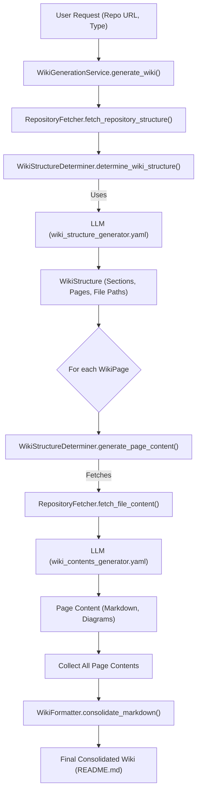
```mermaid
graph TD
    A["User Request (Repo URL, Type)"] --> B["WikiGenerationService.generate_wiki()"]
    B --> C["RepositoryFetcher.fetch_repository_structure()"]
    C --> D["WikiStructureDeterminer.determine_wiki_structure()"]
    D -- Uses --> E["LLM (wiki_structure_generator.yaml)"]
    E --> F["WikiStructure (Sections, Pages, File Paths)"]
    F --> G{"For each WikiPage"}
    G --> H["WikiStructureDeterminer.generate_page_content()"]
    H -- Fetches --> I["RepositoryFetcher.fetch_file_content()"]
    I --> J["LLM (wiki_contents_generator.yaml)"]
    J --> K["Page Content (Markdown, Diagrams)"]
    K --> L["Collect All Page Contents"]
    L --> M["WikiFormatter.consolidate_markdown()"]
    M --> N["Final Consolidated Wiki (README.md)"]
```

## Conclusion

The core features of "Wiki As Readme" are meticulously designed to provide an intelligent, automated, and flexible solution for documentation generation. By combining deep contextual understanding, smart structural organization, comprehensive content generation with visual aids, and a scalable asynchronous architecture, the tool effectively bridges the gap between codebase and high-quality, maintainable documentation.

---

<a name="universal-compatibility"></a>

<details>
<summary>Relevant source files</summary>

The following files were used as context for generating this wiki page:

- [README.md](README.md)
- [src/providers/github.py](src/providers/github.py)
- [src/providers/gitlab.py](src/providers/gitlab.py)
- [src/providers/bitbucket.py](src/providers/bitbucket.py)
- [src/providers/local.py](src/providers/local.py)
- [src/agent/llm.py](src/agent/llm.py)
</details>

# Universal Compatibility

The "Wiki As Readme" project is engineered with a core philosophy of universal compatibility, ensuring it can adapt to virtually any development environment, technology stack, and deployment strategy. This design principle makes the tool exceptionally flexible and a true "drop-in" solution for automated documentation generation. It achieves this by being agnostic across three key dimensions: the underlying Large Language Model (LLM), the code repository platform, and the deployment environment.

This page details the architectural choices and implementations that enable "Wiki As Readme" to operate seamlessly regardless of the specific models, platforms, or deployment methods chosen by the user.

## Model Agnostic (Powered by LiteLLM)

"Wiki As Readme" is designed to work with a wide array of Large Language Models, from commercial APIs to local open-source models and on-premise solutions. This flexibility is primarily achieved through the integration of `LiteLLM`, a library that provides a unified interface for over 100 LLMs.

### LLM Integration Architecture

The `LLMWikiMaker` class (`src/agent/llm.py`) serves as the primary interface for all LLM interactions. It abstracts away the complexities of different LLM providers, allowing the core logic to remain consistent regardless of the chosen model.

#### Key Components:
*   **`LLMWikiMaker` Class:** A generic wrapper around `LiteLLM` that handles model configuration, API key management, and structured output parsing.
    *   **`_configure_llm()` Method:** This method dynamically sets up the LLM model name and specific completion arguments based on the `LLM_PROVIDER` and `MODEL_NAME` environment variables. It handles provider-specific prefixes (e.g., `vertex_ai/`, `openai/`) and injects necessary credentials or base URLs.
    *   **`ainvoke()` Method:** Asynchronously invokes the configured LLM with the provided input. It supports structured output by passing a `response_schema` (Pydantic model) to `LiteLLM`, which can either leverage native JSON modes or parse JSON from the LLM's text response.
Sources: [src/agent/llm.py](LLMWikiMaker class), [src/agent/llm.py](_configure_llm method), [src/agent/llm.py](ainvoke method)

#### Supported LLM Providers

The system supports a broad spectrum of LLM providers, configured via environment variables:

| LLM Provider | Configuration Variables | Notes |
|---|---|---|
| `google` (Vertex AI) | `GCP_PROJECT_NAME`, `GCP_MODEL_LOCATION` | Uses `vertex_ai/` prefix. |
| `openai` | `OPENAI_API_KEY`, `LLM_BASE_URL` | Supports OpenAI API and compatible endpoints. |
| `anthropic` | `ANTHROPIC_API_KEY` | For Claude models. |
| `openrouter` | `OPENROUTER_API_KEY` | Unified API for various models. |
| `xai` | `XAI_API_KEY` | For Grok models. |
| `ollama` | `LLM_BASE_URL` | For local Ollama instances or other OpenAI-compatible endpoints. |
Sources: [README.md](Configuration Reference), [src/agent/llm.py](_configure_llm method)

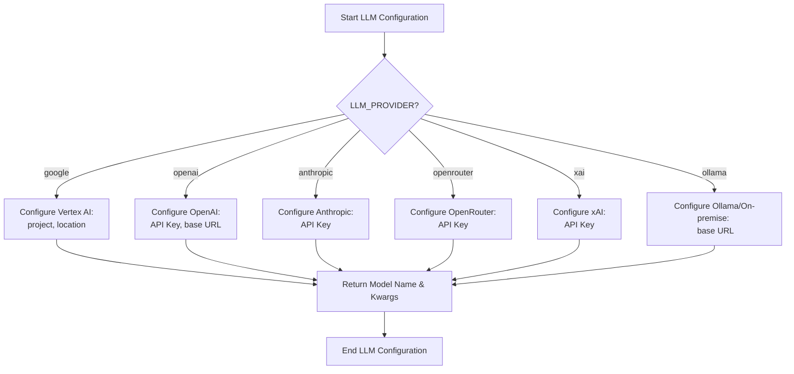
```mermaid
graph TD
    A["Start LLM Configuration"] --> B{"LLM_PROVIDER?"}
    B -- "google" --> C["Configure Vertex AI: <br/> project, location"]
    B -- "openai" --> D["Configure OpenAI: <br/> API Key, base URL"]
    B -- "anthropic" --> E["Configure Anthropic: <br/> API Key"]
    B -- "openrouter" --> F["Configure OpenRouter: <br/> API Key"]
    B -- "xai" --> G["Configure xAI: <br/> API Key"]
    B -- "ollama" --> H["Configure Ollama/On-premise: <br/> base URL"]
    C --> I["Return Model Name & Kwargs"]
    D --> I
    E --> I
    F --> I
    G --> I
    H --> I
    I --> J["End LLM Configuration"]
```

## Platform Agnostic

The project seamlessly integrates with various Git platforms and local file systems, making it adaptable to any code hosting solution. This is achieved through a modular provider system, where each platform has its own dedicated implementation for fetching repository structure and file content.

### Repository Provider Architecture

The `RepositoryProvider` base class (not explicitly provided but implied by the structure of `src/providers/*`) defines the interface for interacting with different repository types. Concrete implementations exist for GitHub, GitLab, Bitbucket, and local file systems.

#### Core Provider Methods:
*   **`fetch_structure()`:** Retrieves the repository's file tree, default branch, and README content. This method is crucial for understanding the project's layout.
*   **`fetch_file_content(file_path: str)`:** Fetches the raw content of a specific file from the repository.
Sources: [src/providers/github.py](GitHubProvider class), [src/providers/gitlab.py](GitLabProvider class), [src/providers/bitbucket.py](BitbucketProvider class), [src/providers/local.py](LocalProvider class)

#### Specific Implementations:

1.  **GitHubProvider (`src/providers/github.py`)**
    *   Utilizes the GitHub REST API (`api.github.com`).
    *   Authenticates using a `GIT_API_TOKEN` (Bearer token).
    *   Fetches file trees recursively and decodes Base64 content for files.
    *   Supports fetching READMEs via a dedicated API endpoint.
    Sources: [src/providers/github.py](GitHubProvider class)

2.  **GitLabProvider (`src/providers/gitlab.py`)**
    *   Supports both `gitlab.com` and self-hosted GitLab instances by parsing the repository URL to determine the API base.
    *   Authenticates using a `PRIVATE-TOKEN`.
    *   Handles pagination for large file trees.
    *   Requires URL encoding for project paths (e.g., `owner%2Frepo`).
    Sources: [src/providers/gitlab.py](GitLabProvider class), [src/providers/gitlab.py](_get_api_base method)

3.  **BitbucketProvider (`src/providers/bitbucket.py`)**
    *   Interacts with the Bitbucket Cloud API (`api.bitbucket.org/2.0`).
    *   Authenticates using a `GIT_API_TOKEN` (Bearer token).
    *   Fetches file lists from the `/src` endpoint, handling pagination.
    Sources: [src/providers/bitbucket.py](BitbucketProvider class)

4.  **LocalProvider (`src/providers/local.py`)**
    *   Directly scans the local file system based on a provided `local_path`.
    *   Uses `os.walk` to traverse directories and `pathlib` for file operations.
    *   Executes disk-bound operations in a separate thread (`asyncio.to_thread`) to prevent blocking the event loop.
    *   Applies `IGNORED_PATTERNS` for filtering files and directories.
    Sources: [src/providers/local.py](LocalProvider class), [src/providers/local.py](_scan_disk_sync method)

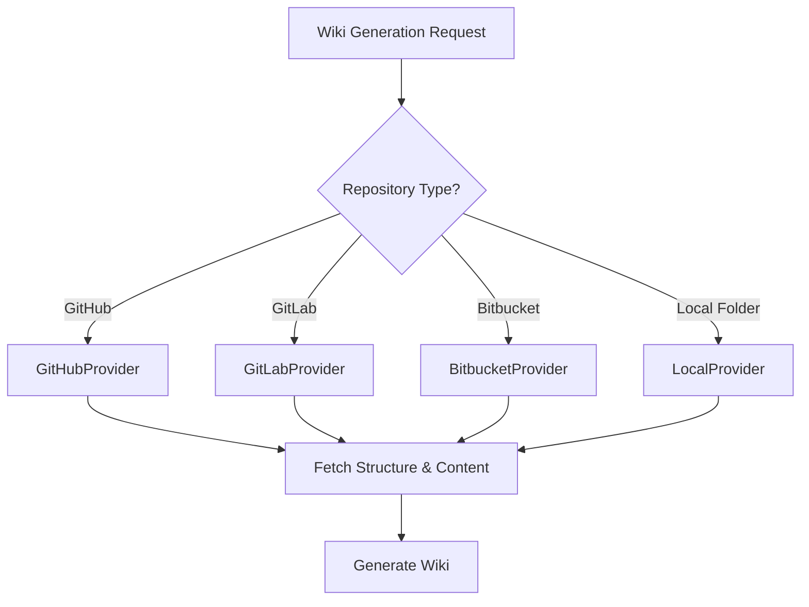
```mermaid
graph TD
    A["Wiki Generation Request"] --> B{"Repository Type?"}
    B -- "GitHub" --> C["GitHubProvider"]
    B -- "GitLab" --> D["GitLabProvider"]
    B -- "Bitbucket" --> E["BitbucketProvider"]
    B -- "Local Folder" --> F["LocalProvider"]
    C --> G["Fetch Structure & Content"]
    D --> G
    E --> G
    F --> G
    G --> H["Generate Wiki"]
```

## Deployment Agnostic

"Wiki As Readme" is designed to be deployed and used in various operational contexts, from automated CI/CD pipelines to local development and long-running services. This flexibility ensures it can fit into diverse development workflows.

#### Usage Modes:
*   **GitHub Action:** Integrates directly into GitHub CI/CD workflows to automate documentation updates on code pushes. This mode leverages a Docker image of the application.
*   **Docker Compose (Local):** Provides a simple way to run the entire application (UI and API) locally using Docker, abstracting away Python dependency management.
*   **Local Python Development:** Allows developers to run the frontend (Streamlit) and backend (FastAPI) directly from source, ideal for development and customization.
*   **Server & Webhooks:** Can be deployed as a long-running API server capable of receiving webhooks (e.g., GitHub push events) to trigger documentation generation asynchronously.
Sources: [README.md](Usage Modes)

## Conclusion

The universal compatibility of "Wiki As Readme" across LLM providers, repository platforms, and deployment environments is a cornerstone of its design. By leveraging modular architecture, unified LLM interfaces, and flexible deployment options, the project delivers a robust and adaptable solution for automated technical documentation, capable of integrating into virtually any software development ecosystem.

---

<a name="using-as-github-action"></a>

<details>
<summary>Relevant source files</summary>

The following files were used as context for generating this wiki page:

- [README.md](README.md)
- [.github/workflows/wiki-as-readme-action.yml](.github/workflows/wiki-as-readme-action.yml)
- [action.yml](action.yml)
- [Dockerfile.action](Dockerfile.action)
- [entrypoint.sh](entrypoint.sh)
</details>

# Using as GitHub Action

The `Wiki As Readme` project offers a dedicated GitHub Action to automate the generation and update of project documentation directly within a CI/CD pipeline. This integration allows developers to maintain up-to-date wiki content (typically a `WIKI.md` or `README.md` file) automatically whenever code changes are pushed to the repository, or on-demand via manual workflow dispatch. This ensures that documentation remains synchronized with the codebase without manual intervention, leveraging the power of Large Language Models (LLMs) to analyze and summarize project details.

This page details how to set up and configure the `Wiki As Readme` GitHub Action, its underlying components, and available customization options.

## Overview of the GitHub Action Workflow

The `Wiki As Readme` GitHub Action integrates into your repository's workflow to perform several key steps: checking out the code, preparing LLM credentials (if necessary), invoking the `Wiki As Readme` Docker action to generate documentation, and finally committing the updated documentation back to the repository or creating a pull request. This process is designed to be flexible, supporting various LLM providers and output configurations.

### Workflow Diagram

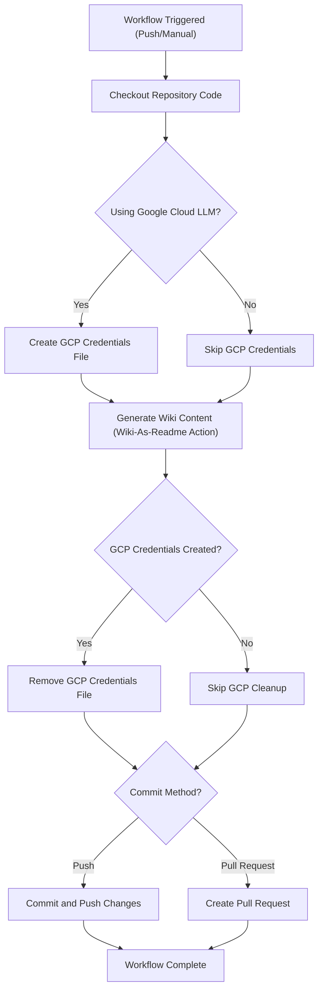
```mermaid
graph TD
    A["Workflow Triggered (Push/Manual)"] --> B["Checkout Repository Code"];
    B --> C{"Using Google Cloud LLM?"};
    C -- "Yes" --> D["Create GCP Credentials File"];
    C -- "No" --> E["Skip GCP Credentials"];
    D --> F["Generate Wiki Content (Wiki-As-Readme Action)"];
    E --> F;
    F --> G{"GCP Credentials Created?"};
    G -- "Yes" --> H["Remove GCP Credentials File"];
    G -- "No" --> I["Skip GCP Cleanup"];
    H --> J{"Commit Method?"};
    I --> J;
    J -- "Push" --> K["Commit and Push Changes"];
    J -- "Pull Request" --> L["Create Pull Request"];
    K --> M["Workflow Complete"];
    L --> M;
```
Sources: [README.md](README.md), [.github/workflows/wiki-as-readme-action.yml](.github/workflows/wiki-as-readme-action.yml)

## Setting Up the GitHub Action

To use the `Wiki As Readme` GitHub Action, you need to create a workflow file (e.g., `.github/workflows/update-wiki.yml`) in your repository. This file defines when the action runs and what parameters it uses.

### Example Workflow Configuration

The following example demonstrates a typical workflow that triggers on pushes to the `main` branch (excluding documentation files) and also allows for manual triggering via `workflow_dispatch`.

```yaml
name: Update Wiki README

on:
  push:
    branches:
      - main
    paths-ignore:
      - 'README.md'
      - 'WIKI.md'
      - '.github/workflows/WIKI-AS-README-AS-ACTION.yml'
  workflow_dispatch: # Allows manual triggering from GitHub UI

jobs:
  generate-and-commit:
    runs-on: ubuntu-latest
    permissions:
      contents: write # Required to commit changes back to the repository

    env:
      OUTPUT_FILE: "WIKI.md" # Default output file name

    steps:
      - name: Checkout code
        uses: actions/checkout@v4

      # [OPTIONAL] GCP Credentials Setup: Only if using Google Cloud (Vertex AI)
      - name: Create GCP Credentials File
        env:
          GCP_KEY: ${{ secrets.GOOGLE_APPLICATION_CREDENTIALS }}
        run: |
          echo "$GCP_KEY" > ./gcp-key.json

      # 1. Generate Wiki Content using the Wiki-As-Readme Action
      - name: Generate Wiki Content
        uses: docker://ghcr.io/catuscio/wiki-as-readme-action:latest # Official Docker image for the action
        env:
          # --- Basic Settings ---
          LANGUAGE: "en"
          OUTPUT_FILE: ${{ env.OUTPUT_FILE }}

          # --- LLM Provider and Model Settings ---
          LLM_PROVIDER: "google"   # e.g., google, openai, anthropic
          MODEL_NAME: "gemini-2.5-flash"

          # --- API Key Settings ---
          # GCP / Vertex AI (if LLM_PROVIDER is "google")
          GCP_PROJECT_NAME: ${{ secrets.GCP_PROJECT_NAME }}
          GCP_MODEL_LOCATION: ${{ secrets.GCP_MODEL_LOCATION }}
          GOOGLE_APPLICATION_CREDENTIALS: /github/workspace/gcp-key.json

          # Other Providers (uncomment as needed)
          # OPENAI_API_KEY: ${{ secrets.OPENAI_API_KEY }}
          # ANTHROPIC_API_KEY: ${{ secrets.ANTHROPIC_API_KEY }}

          # --- GitHub Token ---
          GIT_API_TOKEN: ${{ secrets.GITHUB_TOKEN }} # Used for repository access

      # [OPTIONAL] GCP Credentials Cleanup
      - name: Remove GCP Credentials File
        if: always()
        run: rm -f ./gcp-key.json

      # 2. Commit and Push Changes
      - name: Commit and Push changes
        uses: stefanzweifel/git-auto-commit-action@v5
        with:
          commit_message: "docs: ✨Update ${{ env.OUTPUT_FILE }} via Wiki-As-Readme Action"
          file_pattern: ${{ env.OUTPUT_FILE }}
```
Sources: [README.md](README.md), [.github/workflows/wiki-as-readme-action.yml](.github/workflows/wiki-as-readme-action.yml)

### Workflow Triggers

The action can be triggered in two primary ways:
*   **`push` event:** Automatically runs when changes are pushed to specified branches (e.g., `main`), with `paths-ignore` to prevent infinite loops if the generated file itself is pushed.
*   **`workflow_dispatch` event:** Allows manual execution from the GitHub Actions tab in the repository UI, often with configurable inputs.
Sources: [.github/workflows/wiki-as-readme-action.yml](.github/workflows/wiki-as-readme-action.yml)

### Permissions

The `contents: write` permission is crucial for the action to be able to commit the generated documentation back to the repository. Without this, the `git-auto-commit-action` or `create-pull-request` action will fail.
Sources: [.github/workflows/wiki-as-readme-action.yml](.github/workflows/wiki-as-readme-action.yml)

## Action Inputs and Configuration

The `Wiki As Readme` GitHub Action (`action.yml`) defines a set of inputs that control its behavior, including the language of the generated content, the LLM provider, API keys, and advanced settings. These inputs are typically passed as environment variables to the Docker container running the action.

### Core Inputs

| Input Name | Description | Default | Required |
|---|---|---|---|
| `language` | Language for the generated content (e.g., `ko`, `en`, `ja`) | `en` | No |
| `wiki_output_path` | The file path to save the generated wiki content | `WIKI.md` | No |
| `llm_provider` | LLM provider to use (`google`, `openai`, `anthropic`, `openrouter`, `xai`, `ollama`) | `google` | No |
| `model_name` | Specific model name to use (e.g., `gemini-2.5-flash`, `gpt-4o`) | `gemini-2.5-flash` | No |
| `git_api_token` | GitHub/GitLab API Token for private repositories or specific operations. Usually `GITHUB_TOKEN`. | | No |
Sources: [action.yml](action.yml)

### LLM API Key Inputs

These inputs correspond to the API keys for various LLM providers. They should typically be stored as GitHub Secrets and passed to the action.

| Input Name | Description | Required |
|---|---|---|
| `openai_api_key` | OpenAI API Key | No |
| `anthropic_api_key` | Anthropic API Key | No |
| `openrouter_api_key` | OpenRouter API Key | No |
| `xai_api_key` | xAI API Key | No |
Sources: [action.yml](action.yml)

### Google Cloud (Vertex AI) Specific Inputs

If `llm_provider` is set to `google`, these inputs are required for Vertex AI authentication and configuration.

| Input Name | Description | Required |
|---|---|---|
| `gcp_project_name` | GCP Project Name (Project ID) | No |
| `gcp_model_location` | GCP Model Location (e.g., `us-central1`) | No |
| `google_application_credentials` | GCP Service Account JSON Key (content or path). Often passed via a temporary file created in a preceding step. | No |
Sources: [action.yml](action.yml)

### Advanced LLM Configuration

| Input Name | Description | Default | Required |
|---|---|---|---|
| `llm_base_url` | Custom base URL for LLM API (e.g., for self-hosted models) | | No |
| `use_structured_output` | Whether to use structured JSON output from the LLM | `true` | No |
| `temperature` | LLM temperature (0.0 to 1.0) for creativity | `0.0` | No |
| `max_retries` | Maximum retry attempts for LLM calls | `3` | No |
| `max_concurrency` | Maximum parallel LLM calls | `5` | No |
| `ignored_patterns` | JSON array of glob patterns to ignore (e.g., `["*.log", "node_modules/*"]`) | `[]` | No |
Sources: [action.yml](action.yml)

## Action Implementation Details

The `Wiki As Readme` GitHub Action is implemented as a Docker container action.

### `action.yml`

This file defines the metadata for the GitHub Action, including its name, description, author, branding, and most importantly, its inputs and how it runs. It specifies `runs.using: 'docker'` and `runs.image: 'Dockerfile.action'`, indicating that the action executes within a Docker container built from `Dockerfile.action`. All defined inputs are mapped directly to environment variables within this Docker container.
Sources: [action.yml](action.yml)

### `Dockerfile.action`

This Dockerfile builds the image used by the GitHub Action. It employs a multi-stage build process:
1.  **Builder Stage:**
    *   Uses `python:3.12-slim-bookworm` as the base.
    *   Installs `uv` (a fast Python package installer).
    *   Copies `pyproject.toml` and `uv.lock` to leverage Docker's layer caching for dependencies.
    *   Installs project dependencies using `uv sync --frozen --no-dev --no-install-project --extra notion`.
2.  **Final Image Stage:**
    *   Also uses `python:3.12-slim-bookworm`.
    *   Copies the virtual environment (`.venv`) from the builder stage.
    *   Copies the application source code (`src`).
    *   Sets up `PATH` and `PYTHONPATH` for the virtual environment and source code.
    *   Sets the working directory to `/github/workspace`, which is the standard location where GitHub Actions check out the repository code.
    *   Defines the `ENTRYPOINT` as `["python", "/app/src/action_entrypoint.py"]`. This means when the Docker container runs, it executes the `action_entrypoint.py` script, which orchestrates the wiki generation process.
Sources: [Dockerfile.action](Dockerfile.action)

## Commit Methods

The `wiki-as-readme-action.yml` workflow demonstrates two ways to handle the generated output:
*   **Direct Push:** Uses `stefanzweifel/git-auto-commit-action@v5` to directly commit and push the updated file to the branch. This is the default for `push` events or when `commit_method` is set to `push`.
*   **Pull Request:** Uses `peter-evans/create-pull-request@v7` to create a new pull request with the changes. This is useful for review processes and is triggered when `commit_method` is set to `pull-request` via `workflow_dispatch` inputs.
Sources: [.github/workflows/wiki-as-readme-action.yml](.github/workflows/wiki-as-readme-action.yml)

## Conclusion

The `Wiki As Readme` GitHub Action provides a robust and flexible solution for automating documentation generation. By integrating directly into CI/CD pipelines, it ensures that project wikis and READMEs are always up-to-date with the latest codebase changes. Its configurability, support for various LLM providers, and different commit strategies make it a powerful tool for maintaining high-quality, comprehensive documentation with minimal manual effort.

---

<a name="local-deployment-(docker-&-python)"></a>

<details>
<summary>Relevant source files</summary>

The following files were used as context for generating this wiki page:

- [README.md](README.md)
- [docker-compose.yml](docker-compose.yml)
- [Dockerfile](Dockerfile)
- [Dockerfile.server](Dockerfile.server)
- [src/server.py](src/server.py)
- [src/app.py](src/app.py)
- [pyproject.toml](pyproject.toml)
- [.env example](.env example)
</details>

# Local Deployment (Docker & Python)

## Introduction

This document outlines the methods for deploying and running the "Wiki As Readme" application locally, catering to different user needs. Whether you prefer a containerized environment for quick setup and consistency or a direct Python development setup for code modification, this guide provides detailed instructions. The project supports local execution via Docker Compose, offering a streamlined way to run both the API backend and Streamlit UI, or directly through Python for developers.

Local deployment is crucial for development, testing, and for users who wish to process local repositories or run the application without external cloud services. It provides full control over the environment and allows for integration with local LLM providers like Ollama.

## 1. Docker Compose Deployment

Docker Compose provides an easy way to set up and run the entire "Wiki As Readme" application stack (API and UI) with a single command, abstracting away individual dependency installations.

### 1.1. Configuration

Before running, the application requires configuration via an `.env` file.
1.  **Create `.env`**: Copy the provided `.env example` to `.env` in the project root.
2.  **Set API Keys**: Populate the `.env` file with your chosen LLM provider's API keys (e.g., `OPENAI_API_KEY`, `GCP_PROJECT_NAME`, `GCP_MODEL_LOCATION`).
3.  **Local Paths (Optional)**: For analyzing local repositories or custom output paths, configure `LOCAL_REPO_PATH` and `WIKI_OUTPUT_PATH` in your `.env` file. These paths are mounted into the Docker container.

Sources: [.env example](.env%20example), [README.md](https://github.com/catuscio/wiki-as-readme/blob/main/README.md#2-docker-compose-local)

### 1.2. Running the Application

Once configured, the application can be started using Docker Compose:

```bash
docker-compose up --build
```

This command will:
*   Build the Docker image for the `wiki-as-readme` service based on the `Dockerfile`.
*   Create and start the `wiki-as-readme` container.
*   Map the container's ports to the host machine.
*   Mount specified volumes for output and credentials.

Sources: [README.md](https://github.com/catuscio/wiki-as-readme/blob/main/README.md#2-docker-compose-local)

### 1.3. Accessing the Application

After successful startup, the application components are accessible:
*   **Web UI (Streamlit)**: `http://localhost:8501`
*   **API Docs (FastAPI Swagger UI)**: `http://localhost:8000/docs`

Sources: [README.md](https://github.com/catuscio/wiki-as-readme/blob/main/README.md#2-docker-compose-local)

### 1.4. Docker Compose Architecture

The `docker-compose.yml` defines a single service, `wiki-as-readme`, which orchestrates the full application.

```yaml
services:
  wiki-as-readme:
    build: .
    container_name: wiki-as-readme
    ports:
      - "8000:8000" # API
      - "8501:8501" # Streamlit UI
    env_file:
      - .env
    environment:
      - GOOGLE_APPLICATION_CREDENTIALS=/app/credentials.json # Conditional for GCP
    volumes:
      - ${WIKI_OUTPUT_PATH:-./output}:/app/output
      - ${GOOGLE_CREDENTIALS_PATH:-./credentials.json}:/app/credentials.json # Conditional for GCP
      - ${LOCAL_REPO_PATH:-./}:/app/target_repo
    restart: always
```

**Key aspects:**
*   **`build: .`**: Instructs Docker Compose to build the image from the `Dockerfile` in the current directory.
*   **`ports`**: Exposes the FastAPI API (8000) and Streamlit UI (8501) to the host machine.
*   **`env_file: - .env`**: Loads environment variables from the `.env` file into the container.
*   **`environment`**: Allows for specific environment variables, such as `GOOGLE_APPLICATION_CREDENTIALS`, to be set directly.
*   **`volumes`**: Mounts host directories into the container for persistent output, GCP credentials, and local repository analysis.
    *   `/app/output`: For saving generated Markdown files.
    *   `/app/credentials.json`: For Google Cloud service account keys.
    *   `/app/target_repo`: For mounting a local repository to be analyzed by the application.

Sources: [docker-compose.yml](docker-compose.yml)

### 1.5. Dockerfile Structure

The `Dockerfile` uses a multi-stage build process to create an optimized image for the full application (API + UI).

```dockerfile
# Stage 1: Builder
FROM python:3.12-slim-bookworm AS builder
COPY --from=ghcr.io/astral-sh/uv:latest /uv /bin/uv
WORKDIR /app
COPY pyproject.toml uv.lock ./
RUN uv sync --frozen --no-dev --no-install-project --extra all

# Stage 2: Final Image
FROM python:3.12-slim-bookworm
# ... Labels ...
RUN useradd -m -u 1000 appuser
WORKDIR /app
COPY --from=builder /app/.venv /app/.venv
COPY src ./src
COPY entrypoint.sh .
RUN chown -R appuser:appuser /app && chmod +x entrypoint.sh
ENV PATH="/app/.venv/bin:$PATH"
ENV PYTHONPATH="/app"
EXPOSE 8000
EXPOSE 8501
USER appuser
CMD ["./entrypoint.sh"]
```

**Stages:**
1.  **`builder`**:
    *   Uses `python:3.12-slim-bookworm` as the base.
    *   Copies the `uv` package manager.
    *   Installs all project dependencies (including `ui` and `api` extras) using `uv sync`.
2.  **Final Image**:
    *   Also uses `python:3.12-slim-bookworm`.
    *   Creates a non-root `appuser` for security.
    *   Copies the virtual environment (`.venv`) from the builder stage.
    *   Copies the application source code (`src`) and `entrypoint.sh`.
    *   Sets `PATH` and `PYTHONPATH` to include the virtual environment.
    *   Exposes ports 8000 (FastAPI) and 8501 (Streamlit).
    *   Sets `appuser` as the default user.
    *   The `CMD` executes `entrypoint.sh`, which typically starts both the FastAPI server and Streamlit UI.

Sources: [Dockerfile](Dockerfile)

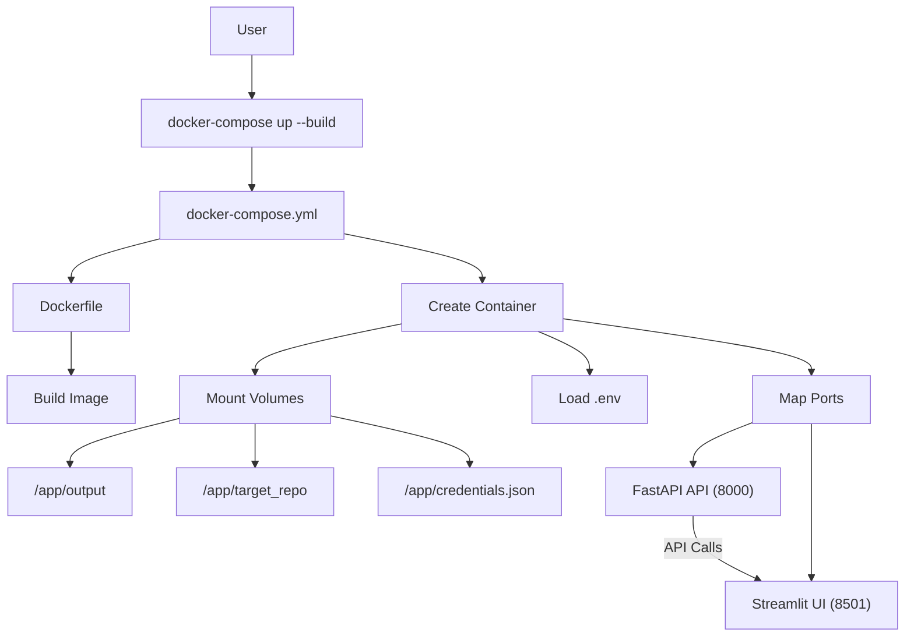
```mermaid
graph TD
    A["User"] --> B["docker-compose up --build"]
    B --> C["docker-compose.yml"]
    C --> D["Dockerfile"]
    D --> E["Build Image"]
    C --> F["Create Container"]
    F --> G["Mount Volumes"]
    F --> H["Load .env"]
    F --> I["Map Ports"]
    I --> J["FastAPI API (8000)"]
    I --> K["Streamlit UI (8501)"]
    G --> L["/app/output"]
    G --> M["/app/target_repo"]
    G --> N["/app/credentials.json"]
    J -- "API Calls" --> K
```

## 2. Local Python Development

For developers who wish to modify the source code, debug, or run the application without Docker, a direct Python setup is available.

### 2.1. Prerequisites

*   **Python**: Version 3.12 or higher.
*   **uv**: A fast Python package installer and resolver.

Sources: [README.md](https://github.com/catuscio/wiki-as-readme/blob/main/README.md#3-local-python-development), [pyproject.toml](pyproject.toml)

### 2.2. Setup and Installation

1.  **Clone the repository**:
    ```bash
    git clone https://github.com/catuscio/wiki-as-readme.git
    cd wiki-as-readme
    ```
2.  **Install dependencies**: `uv sync` installs all project dependencies into a virtual environment.
    ```bash
    uv sync
    ```
3.  **Activate virtual environment**:
    ```bash
    source .venv/bin/activate
    ```

Sources: [README.md](https://github.com/catuscio/wiki-as-readme/blob/main/README.md#3-local-python-development)

### 2.3. Configuration

Similar to Docker deployment, an `.env` file is required:
1.  **Create `.env`**: Copy `.env example` to `.env`.
2.  **Set API Keys**: Configure your LLM provider API keys and other settings as needed.

Sources: [README.md](https://github.com/catuscio/wiki-as-readme/blob/main/README.md#3-local-python-development), [.env example](.env%20example)

### 2.4. Running the Application

The backend (FastAPI) and frontend (Streamlit) are run as separate processes:

1.  **Run Backend (FastAPI)**:
    ```bash
    uv run uvicorn src.server:app --reload --port 8000
    ```
    This command starts the FastAPI server, accessible at `http://localhost:8000`. The `--reload` flag enables automatic server restarts on code changes.
    Sources: [README.md](https://github.com/catuscio/wiki-as-readme/blob/main/README.md#3-local-python-development), [src/server.py](src/server.py)

2.  **Run Frontend (Streamlit)**:
    ```bash
    uv run streamlit run src/app.py
    ```
    This command starts the Streamlit UI, accessible at `http://localhost:8501`. The Streamlit application (`src/app.py`) interacts with the FastAPI backend.
    Sources: [README.md](https://github.com/catuscio/wiki-as-readme/blob/main/README.md#3-local-python-development), [src/app.py](src/app.py)

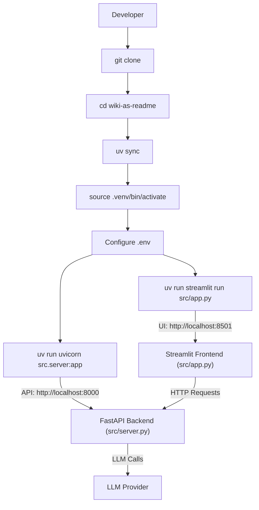
```mermaid
graph TD
    A["Developer"] --> B["git clone"]
    B --> C["cd wiki-as-readme"]
    C --> D["uv sync"]
    D --> E["source .venv/bin/activate"]
    E --> F["Configure .env"]
    F --> G["uv run uvicorn src.server:app"]
    F --> H["uv run streamlit run src/app.py"]
    G -- "API: http://localhost:8000" --> I["FastAPI Backend (src/server.py)"]
    H -- "UI: http://localhost:8501" --> J["Streamlit Frontend (src/app.py)"]
    J -- "HTTP Requests" --> I
    I -- "LLM Calls" --> K["LLM Provider"]
```

## 3. Configuration Reference (`.env`)

The `.env` file is central to configuring the application's behavior, regardless of the deployment method. Below are key variables relevant to local deployment.

| Variable | Description | Example | Source |
|---|---|---|---|
| `LLM_PROVIDER` | Specifies the LLM service to use. | `google`, `openai`, `ollama` | [.env example](.env%20example) |
| `MODEL_NAME` | The specific model identifier for the chosen provider. | `gemini-2.5-flash`, `gpt-4o` | [.env example](.env%20example) |
| `OPENAI_API_KEY` | API key for OpenAI models. | `sk-...` | [.env example](.env%20example) |
| `GCP_PROJECT_NAME` | Google Cloud Project ID for Vertex AI. | `my-genai-project` | [.env example](.env%20example) |
| `GCP_MODEL_LOCATION` | Region for Vertex AI models. | `us-central1` | [.env example](.env%20example) |
| `LLM_BASE_URL` | Optional custom base URL for LLM API (e.g., for Ollama). | `http://localhost:11434/v1` | [.env example](.env%20example) |
| `LOCAL_REPO_PATH` | **(Docker)** Host path to the local repository to analyze. | `/Users/user/my-project` | [.env example](.env%20example) |
| `WIKI_OUTPUT_PATH` | **(Docker)** Host path where generated wiki files will be saved. | `/Users/user/wiki-output` | [.env example](.env%20example) |
| `GOOGLE_CREDENTIALS_PATH` | **(Docker)** Host path to Google Cloud Service Account JSON key. | `/Users/user/downloads/key.json` | [.env example](.env%20example) |
| `IGNORED_PATTERNS` | JSON array of glob patterns to exclude files from analysis. | `'["*.log", "node_modules/*"]'` | [.env example](.env%20example) |

## Conclusion

The "Wiki As Readme" project offers flexible local deployment options to suit various user preferences and development workflows. Docker Compose provides a quick, isolated, and consistent environment for running the full application stack, ideal for users who want to get started quickly without managing Python environments. For developers, the direct Python setup offers granular control, ease of debugging, and direct access to the codebase. Both methods leverage a common `.env` configuration, ensuring consistent behavior and easy switching between deployment strategies.

---

<a name="server-deployment-&-webhooks"></a>

<details>
<summary>Relevant source files</summary>

The following files were used as context for generating this wiki page:

- [README.md](README.md)
- [src/server.py](src/server.py)
- [src/api/v1/endpoints/webhook.py](src/api/v1/endpoints/webhook.py)
- [src/models/github_webhook_schema.py](src/models/github_webhook_schema.py)
- [Dockerfile.server](Dockerfile.server)
</details>

# Server Deployment & Webhooks

## Introduction

The "Server & Webhooks" deployment mode for Wiki As Readme provides a robust, long-running service capable of automating documentation generation in response to external events, primarily Git repository changes. This mode leverages a FastAPI backend to expose API endpoints, including a dedicated webhook listener for GitHub push events. When configured, it can automatically generate or update project documentation (e.g., `WIKI.md`) directly within the repository upon code pushes, ensuring documentation remains synchronized with the codebase.

This document details the architecture, components, and operational flow of the Wiki As Readme server when deployed as a service with webhook capabilities.

## Architecture Overview

The server component of Wiki As Readme is built using FastAPI, providing a high-performance, asynchronous API. It integrates with various services and external platforms through its API endpoints and webhook listeners.

At its core, the server:
*   Exposes a RESTful API for wiki generation and status retrieval.
*   Provides a dedicated endpoint for GitHub webhooks.
*   Utilizes background tasks to handle long-running operations like wiki generation and GitHub API interactions, ensuring the API remains responsive.
*   Is designed for containerized deployment using Docker, making it portable and scalable.

### High-Level Flow

The following diagram illustrates the high-level interaction when a GitHub push event triggers a wiki update:

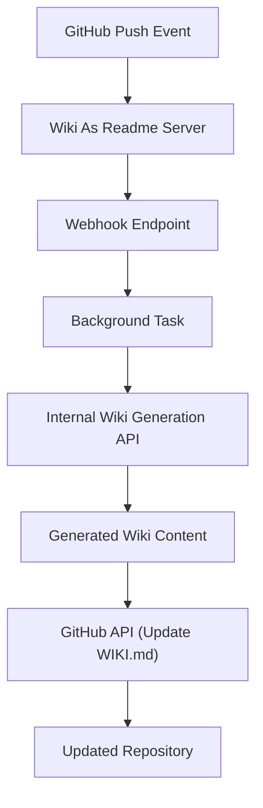
```mermaid
graph TD
    A["GitHub Push Event"] --> B["Wiki As Readme Server"];
    B --> C["Webhook Endpoint"];
    C --> D["Background Task"];
    D --> E["Internal Wiki Generation API"];
    E --> F["Generated Wiki Content"];
    F --> G["GitHub API (Update WIKI.md)"];
    G --> H["Updated Repository"];
```
Sources: [README.md](README.md), [src/server.py](src/server.py), [src/api/v1/endpoints/webhook.py](src/api/v1/endpoints/webhook.py)

## Server Components

### FastAPI Application (`src/server.py`)

The `src/server.py` file serves as the main entry point for the FastAPI application. It initializes the FastAPI instance, sets up logging, and includes various API routers.

*   **Application Instance**: `app = FastAPI(...)` defines the main application with metadata like title, description, and version.
*   **Health Check**: An endpoint `/` provides a basic health check (`{"status": "ok"}`).
*   **API Routers**:
    *   `wiki.router`: Handles wiki generation requests (e.g., `/api/v1/wiki/generate/file`).
    *   `webhook.router`: Manages webhook integrations, specifically for GitHub (`/api/v1/webhook/github`).

The server is typically run using `uvicorn` or `gunicorn` in production environments.
Sources: [src/server.py](src/server.py)

### Webhook Integration (`src/api/v1/endpoints/webhook.py`)

This module defines the logic for handling incoming webhooks, primarily from GitHub. It ensures secure reception, intelligent processing, and automated response to repository events.

#### GitHub Webhook Endpoint

*   **Endpoint**: `POST /api/v1/webhook/github`
*   **Purpose**: This endpoint is designed to receive GitHub push event payloads. Upon receiving a valid push event, it triggers a background process to generate updated documentation and commit it back to the repository.

#### Key Functions and Logic

1.  **`verify_signature(request: Request)`**:
    *   **Function**: Ensures the authenticity and integrity of incoming webhook payloads.
    *   **Mechanism**: It verifies the `X-Hub-Signature-256` header against a computed HMAC signature of the request body using a shared secret (`GITHUB_WEBHOOK_SECRET`). If the secret is not configured or the signature is invalid, a `403 Forbidden` error is raised.
    Sources: [src/api/v1/endpoints/webhook.py](verify_signature function)

2.  **Bot Commit Prevention**:
    *   To prevent infinite loops where the bot's own commits trigger new documentation generations, the webhook handler checks the `pusher.name` and `head_commit.message`.
    *   Commits made by `BOT_COMMITTER_NAME` or containing "via Wiki-As-Readme" in the message are ignored.
    Sources: [src/api/v1/endpoints/webhook.py](github_webhook function)

3.  **Branch Filtering**:
    *   The system only processes push events to the `main` branch (`payload.ref == "refs/heads/main"`). Pushes to other branches are ignored.
    Sources: [src/api/v1/endpoints/webhook.py](github_webhook function)

4.  **`process_full_cycle(...)`**:
    *   **Function**: This asynchronous background task orchestrates the entire documentation update process.
    *   **Steps**:
        1.  **Call Internal Wiki Generation API**: It makes an internal `POST` request to `/api/v1/wiki/generate/file` to initiate the wiki generation.
        2.  **Extract Result**: It retrieves the generated Markdown content from the response of the generation API.
        3.  **Upload to GitHub**: It then calls `update_github_readme` to commit the new documentation to the specified repository.
    *   **Error Handling**: Includes basic error logging for failures during the generation or upload process.
    Sources: [src/api/v1/endpoints/webhook.py](process_full_cycle function)

5.  **`update_github_readme(...)`**:
    *   **Function**: Handles the interaction with the GitHub API to update the `WIKI.md` file in a repository.
    *   **Prerequisites**: Requires `GITHUB_ACCESS_TOKEN` (a Personal Access Token with `repo` scope) to be set.
    *   **Process**:
        1.  **Fetch Existing SHA**: Retrieves the SHA of the current `WIKI.md` file (if it exists) to correctly update it via the GitHub Contents API.
        2.  **Base64 Encode Content**: Encodes the generated Markdown content to Base64, as required by the GitHub API.
        3.  **Construct Commit Data**: Prepares the JSON payload for the PUT request, including the commit message, encoded content, committer details, and the SHA (if updating an existing file).
        4.  **PUT Request**: Sends a PUT request to `https://api.github.com/repos/{owner}/{repo}/contents/WIKI.md` to create or update the file.
    Sources: [src/api/v1/endpoints/webhook.py](update_github_readme function)

### GitHub Webhook Payload Schema (`src/models/github_webhook_schema.py`)

This module defines Pydantic models for parsing the incoming GitHub push event payload. This ensures type safety and validation for the data received from GitHub.

| Model | Description | Key Fields |
|---|---|---|
| `GitHubRepositoryOwner` | Details of the repository owner. | `login` |
| `GitHubRepository` | Details of the repository. | `name`, `owner` |
| `GitHubPusher` | Details of the user who pushed the commit. | `name`, `email` |
| `GitHubCommit` | Details of a single commit. | `id`, `message`, `author` |
| `GitHubPushPayload` | The root payload for a GitHub push event. | `ref`, `repository`, `pusher`, `head_commit` |
Sources: [src/models/github_webhook_schema.py](GitHubPushPayload class)

### Detailed Webhook Processing Sequence

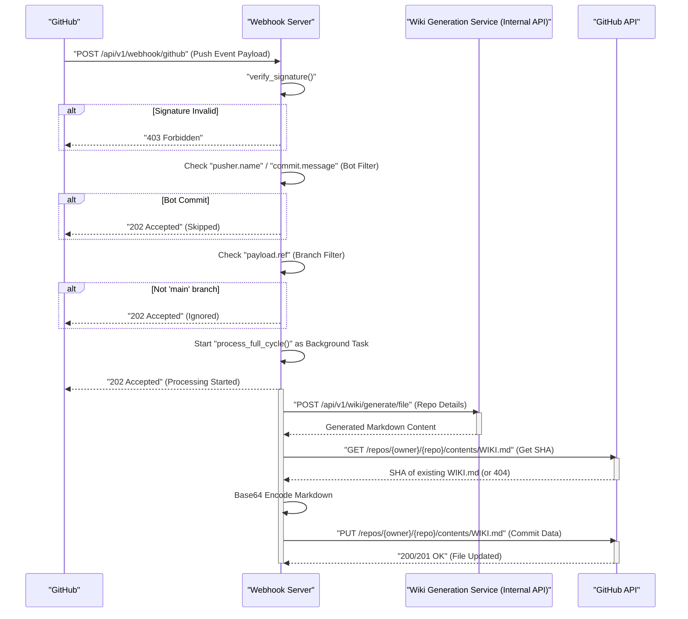
```mermaid
sequenceDiagram
    participant GH as "GitHub"
    participant WS as "Webhook Server"
    participant WGS as "Wiki Generation Service (Internal API)"
    participant GHA as "GitHub API"

    GH->>WS: "POST /api/v1/webhook/github" (Push Event Payload)
    WS->>WS: "verify_signature()"
    alt Signature Invalid
        WS-->>GH: "403 Forbidden"
    end
    WS->>WS: Check "pusher.name" / "commit.message" (Bot Filter)
    alt Bot Commit
        WS-->>GH: "202 Accepted" (Skipped)
    end
    WS->>WS: Check "payload.ref" (Branch Filter)
    alt Not 'main' branch
        WS-->>GH: "202 Accepted" (Ignored)
    end
    WS->>WS: Start "process_full_cycle()" as Background Task
    WS-->>GH: "202 Accepted" (Processing Started)

    activate WS
    WS->>WGS: "POST /api/v1/wiki/generate/file" (Repo Details)
    activate WGS
    WGS-->>WS: Generated Markdown Content
    deactivate WGS

    WS->>GHA: "GET /repos/{owner}/{repo}/contents/WIKI.md" (Get SHA)
    activate GHA
    GHA-->>WS: SHA of existing WIKI.md (or 404)
    deactivate GHA

    WS->>WS: Base64 Encode Markdown
    WS->>GHA: "PUT /repos/{owner}/{repo}/contents/WIKI.md" (Commit Data)
    activate GHA
    GHA-->>WS: "200/201 OK" (File Updated)
    deactivate GHA
    deactivate WS
```
Sources: [src/api/v1/endpoints/webhook.py](process_full_cycle function, update_github_readme function)

## Configuration

The server's behavior, especially for webhooks and GitHub interactions, is controlled via environment variables. These are typically set in a `.env` file or directly in the deployment environment.

| Variable | Description | Example | Source |
|---|---|---|---|
| `GITHUB_WEBHOOK_SECRET` | Secret key used to verify incoming GitHub webhook signatures. | `super_secret_webhook_key` | [src/api/v1/endpoints/webhook.py](verify_signature function) |
| `GITHUB_ACCESS_TOKEN` | GitHub Personal Access Token (PAT) with `repo` scope, used to commit generated documentation back to the repository. | `ghp_xxxxxxxxxxxxxxxxxxxx` | [src/api/v1/endpoints/webhook.py](update_github_readme function) |
| `BOT_COMMITTER_NAME` | The name used by the bot when committing changes. Used to prevent infinite webhook loops. | `Wiki-As-Readme-Bot` | [src/api/v1/endpoints/webhook.py](github_webhook function) |
| `LLM_PROVIDER` | Specifies the LLM provider to use for content generation. | `google`, `openai` | [README.md](Configuration Reference) |
| `MODEL_NAME` | The specific model identifier for the chosen LLM provider. | `gemini-2.5-flash`, `gpt-4o` | [README.md](Configuration Reference) |
| `OPENAI_API_KEY` | API key for OpenAI models. | `sk-...` | [README.md](Configuration Reference) |
| `GCP_PROJECT_NAME` | Google Cloud Project ID for Vertex AI. | `my-genai-project` | [README.md](Configuration Reference) |
| `IGNORED_PATTERNS` | JSON array of glob patterns to exclude files/directories from analysis. | `'["*.log", "node_modules/*"]'` | [README.md](Configuration Reference) |

## Deployment

The server is designed for containerized deployment, typically using Docker. The `Dockerfile.server` defines the build process and runtime environment.

### `Dockerfile.server` Highlights

*   **Multi-stage Build**: Uses a builder stage to install Python dependencies efficiently with `uv`, resulting in a smaller final image.
*   **Base Image**: `python:3.12-slim-bookworm` for a lean Python environment.
*   **User**: Runs as a non-root `appuser` for enhanced security.
*   **Dependencies**: Installs project dependencies into a virtual environment (`.venv`).
*   **Exposed Port**: Exposes port `8000`, which is where the FastAPI application listens.
*   **Entrypoint**: Uses `gunicorn` with `uvicorn.workers.UvicornWorker` to serve the FastAPI application (`src.server:app`). This provides a robust, production-ready WSGI server with multiple worker processes for concurrency.
    *   `--bind 0.0.0.0:8000`: Binds the server to all network interfaces on port 8000.
    *   `--workers 2`: Configures two worker processes.
    *   `--access-logfile -`, `--error-logfile -`: Directs logs to standard output/error, suitable for containerized environments.
Sources: [Dockerfile.server](Dockerfile.server)

## Conclusion

The "Server & Webhooks" deployment model for Wiki As Readme provides a powerful and automated solution for maintaining up-to-date documentation. By leveraging FastAPI, background tasks, and robust webhook handling, it seamlessly integrates with Git workflows to ensure that documentation evolves alongside the codebase, reducing manual effort and improving consistency. Its containerized nature further simplifies deployment and scaling in various environments.

---

<a name="configuration-reference"></a>

<details>
<summary>Relevant source files</summary>

The following files were used as context for generating this wiki page:

- [README.md](README.md)
- [.env example](.env example)
- [src/core/config.py](src/core/config.py)
- [src/agent/llm.py](src/agent/llm.py)
</details>

# Configuration Reference

This document provides a comprehensive reference for configuring the "Wiki As Readme" application. Proper configuration is crucial for the application to connect to Large Language Models (LLMs), access repositories, and manage output. The application primarily uses environment variables, typically loaded from a `.env` file, to manage its settings. This allows for flexible deployment across various environments, including local development, Docker containers, and CI/CD pipelines like GitHub Actions.

The configuration system is built upon Pydantic's `BaseSettings`, ensuring type safety and easy validation of settings. It supports a wide range of LLM providers, repository types, and operational parameters, making the tool highly adaptable to different project requirements and infrastructure setups.

## Core Configuration Management

The central configuration for "Wiki As Readme" is managed by the `Settings` class located in `src/core/config.py`. This class inherits from Pydantic's `BaseSettings`, which automatically loads environment variables. It is configured to read variables from a `.env` file by default, specified by `env_file=".env"`.

### `Settings` Class Overview

The `Settings` class defines all configurable parameters, their types, default values, and validation rules. This ensures that the application operates with well-defined and expected inputs.

**Key aspects:**
*   **Pydantic `BaseSettings`**: Provides robust environment variable loading and type validation.
*   **`SettingsConfigDict`**: Specifies that settings should be loaded from a `.env` file.
*   **Type Hinting**: Ensures clarity and helps prevent configuration errors.
*   **Default Values**: Many settings have sensible defaults, reducing the need for extensive initial configuration.

Sources: [src/core/config.py](Settings class)

### Configuration Loading Flow

The configuration values are loaded in a hierarchical manner:
1.  **`.env` file**: Variables defined in the `.env` file (if present) are loaded first.
2.  **Environment Variables**: System-level environment variables will override values from the `.env` file.
3.  **Default Values**: If a variable is not found in the environment or `.env` file, the default value specified in the `Settings` class is used.

This flow ensures that configurations can be easily managed and overridden as needed for different deployment scenarios.

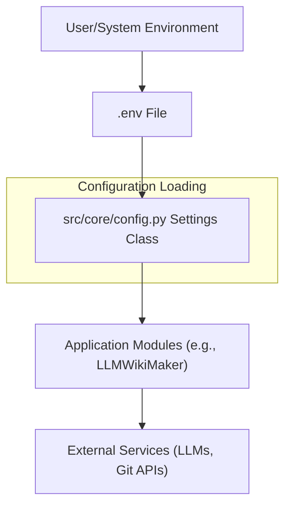
```mermaid
flowchart TD
    A["User/System Environment"] --> B[".env File"];
    B --> C["src/core/config.py Settings Class"];
    C --> D["Application Modules (e.g., LLMWikiMaker)"];
    D --> E["External Services (LLMs, Git APIs)"];

    subgraph Configuration Loading
        C
    end
```

## Environment Variable Reference

The following table details the environment variables that can be set to configure the "Wiki As Readme" application. These variables are typically defined in a `.env` file in the project root or directly as system environment variables.

| Category | Variable | Description | Example Value | Default (if applicable) |
|---|---|---|---|---|
| **LLM Provider** | `LLM_PROVIDER` | Specifies the LLM service to use. | `google`, `openai`, `anthropic`, `xai`, `openrouter`, `ollama` | `google` |
| | `MODEL_NAME` | The specific model identifier for the chosen provider. | `gemini-2.5-flash`, `gpt-4o`, `claude-3-5-sonnet-latest` | `gemini-2.5-flash` |
| **LLM API Keys** | `OPENAI_API_KEY` | API key for OpenAI models. | `sk-...` | `None` |
| | `ANTHROPIC_API_KEY` | API key for Anthropic models. | `sk-...` | `None` |
| | `OPENROUTER_API_KEY` | API key for OpenRouter. | `sk-...` | `None` |
| | `XAI_API_KEY` | API key for xAI (Grok) models. | `sk-...` | `None` |
| **LLM Configuration** | `LLM_BASE_URL` | Optional custom base URL for LLM API (e.g., for Ollama or proxy). | `http://localhost:11434/v1` | `None` |
| | `USE_STRUCTURED_OUTPUT` | Whether to request native JSON output mode from the LLM (requires model support). | `true`, `false` | `true` |
| | `temperature` | Controls randomness in LLM responses (0.0 for deterministic, 1.0 for creative). | `0.0` to `1.0` | `0.0` |
| | `max_retries` | Maximum number of retry attempts for failed LLM requests. | `3` | `3` |
| | `max_concurrency` | Limits the number of parallel LLM calls to prevent rate limits. | `5` | `5` |
| **File Filtering** | `IGNORED_PATTERNS` | **JSON array** of glob patterns to exclude from LLM context. Overrides default patterns in `src/core/config.py`. | `'["*.log", "node_modules/*"]'` | Default list (see `src/core/config.py`) |
| **Repository Access** | `GIT_API_TOKEN` | GitHub/GitLab personal access token for private repos or higher rate limits. | `ghp_...` | `None` |
| **Localization** | `language` | Target language for the generated wiki. | `en`, `ko`, `ja`, `zh`, `es`, etc. | `en` |
| **Google Cloud Platform** | `GCP_PROJECT_NAME` | Vertex AI Project ID (required for Google provider). | `my-genai-project` | `None` |
| | `GCP_MODEL_LOCATION` | Vertex AI model location (e.g., `us-central1`). | `us-central1` | `None` |
| | `GOOGLE_APPLICATION_CREDENTIALS` | Path to Google Cloud Service Account JSON key (used in GitHub Actions). | `/github/workspace/gcp-key.json` | `None` |
| **Docker & Local Paths** | `LOCAL_REPO_PATH` | Absolute path to the local repository to analyze (when running locally). | `/Users/user/my-project` | `.` (current directory) |
| | `WIKI_OUTPUT_PATH` | Absolute path where generated wiki files will be saved. | `./output/WIKI.md` | `./WIKI.md` |
| **Notion Sync** | `NOTION_SYNC_ENABLED` | Enable automatic sync to Notion after wiki generation. | `true`, `false` | `false` |
| | `NOTION_API_KEY` | Notion Integration Token. | `secret_xxx...` | `None` |
| | `NOTION_DATABASE_ID` | The Notion Database ID where each repository will be added. | `abc123...` | `None` |
| **Webhooks** | `GITHUB_WEBHOOK_SECRET` | Secret for validating GitHub webhook payloads. | `my_secret_key` | `None` |

Sources: [.env example](all variables), [README.md](Configuration Reference table), [src/core/config.py](Settings class)

### `IGNORED_PATTERNS` Special Handling

The `IGNORED_PATTERNS` variable has a special validator (`parse_ignored_patterns`) in `src/core/config.py`.
*   If provided as a string, it attempts to parse it as a JSON array.
*   If JSON parsing fails, it falls back to splitting the string by commas.
*   If the variable is empty or not provided, it defaults to `DEFAULT_IGNORED_PATTERNS`.
This flexibility allows users to define exclusion patterns either as a JSON string or a comma-separated list.

Sources: [src/core/config.py](parse_ignored_patterns method)

## LLM Configuration and Integration

The `LLMWikiMaker` class in `src/agent/llm.py` is responsible for interacting with LLMs via the LiteLLM library. It dynamically configures the LLM client based on the settings provided through the `Settings` class.

### `LLMWikiMaker` Configuration Logic

The `_configure_llm` method within `LLMWikiMaker` is central to setting up the LLM client. It reads `LLM_PROVIDER`, `MODEL_NAME`, and various API keys and specific parameters from the global `settings` object.

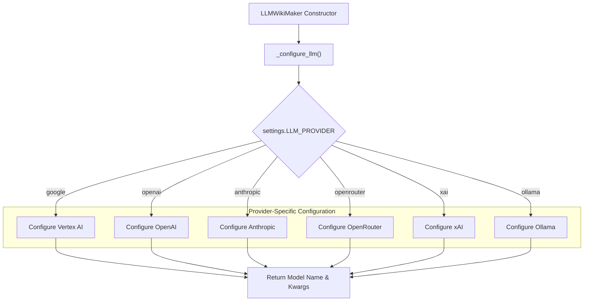
```mermaid
flowchart TD
    A["LLMWikiMaker Constructor"] --> B["_configure_llm()"];
    B --> C{"settings.LLM_PROVIDER"};
    C -- "google" --> D["Configure Vertex AI"];
    C -- "openai" --> E["Configure OpenAI"];
    C -- "anthropic" --> F["Configure Anthropic"];
    C -- "openrouter" --> G["Configure OpenRouter"];
    C -- "xai" --> H["Configure xAI"];
    C -- "ollama" --> I["Configure Ollama"];
    D --> J["Return Model Name & Kwargs"];
    E --> J; F --> J; G --> J; H --> J; I --> J;

    subgraph Provider-Specific Configuration
        D; E; F; G; H; I
    end
```

**Provider-Specific Configuration Details:**

*   **Google Vertex AI**:
    *   Prefixes `MODEL_NAME` with `vertex_ai/` if not already present.
    *   Requires `GCP_PROJECT_NAME` and `GCP_MODEL_LOCATION` from settings.
*   **OpenAI**:
    *   Requires `OPENAI_API_KEY` or `LLM_BASE_URL`.
    *   Sets `OPENAI_API_KEY` in `os.environ` if available in settings.
    *   Uses `LLM_BASE_URL` for custom endpoints (e.g., local OpenAI-compatible servers).
    *   Prefixes `MODEL_NAME` with `openai/`.
*   **Anthropic, OpenRouter, xAI**:
    *   Each requires its respective API key (`ANTHROPIC_API_KEY`, `OPENROUTER_API_KEY`, `XAI_API_KEY`).
    *   Sets the API key in `os.environ`.
    *   Prefixes `MODEL_NAME` with `anthropic/`, `openrouter/`, or `xai/` respectively.
*   **Ollama**:
    *   Primarily uses `LLM_BASE_URL` for the Ollama server endpoint.
    *   Prefixes `MODEL_NAME` with `ollama/`.

Sources: [src/agent/llm.py](LLMWikiMaker class, _configure_llm method)

### Structured Output

The `LLMWikiMaker` supports structured output using Pydantic schemas.
*   If `USE_STRUCTURED_OUTPUT` is `true` in settings and a `response_schema` is provided to `LLMWikiMaker`, LiteLLM will attempt to request JSON output directly from the LLM.
*   If the LLM does not natively support structured output or `USE_STRUCTURED_OUTPUT` is `false`, `LLMWikiMaker` includes a fallback mechanism (`_extract_json`) to parse JSON from Markdown code blocks in the LLM's response.

Sources: [src/agent/llm.py](ainvoke method, _extract_json method)

## Conclusion

The configuration system of "Wiki As Readme" is designed for flexibility, robustness, and ease of use. By centralizing settings in the `Settings` class and leveraging environment variables, the application can be adapted to a wide array of LLM providers, deployment environments, and project requirements. Understanding these configuration options is key to effectively deploying and utilizing the "Wiki As Readme" tool.

---

<a name="api-endpoints"></a>

<details>
<summary>Relevant source files</summary>

The following files were used as context for generating this wiki page:

- [README.md](README.md)
- [src/api/v1/endpoints/wiki.py](src/api/v1/endpoints/wiki.py)
- [src/api/v1/endpoints/webhook.py](src/api/v1/endpoints/webhook.py)
- [src/models/api_schema.py](src/models/api_schema.py)
- [src/models/wiki_schema.py](src/models/wiki_schema.py)
</details>

# API Endpoints

## Introduction

The API Endpoints are the primary interface for interacting with the **Wiki As Readme** application programmatically. Built with FastAPI, these endpoints enable users and automated systems to trigger wiki generation, retrieve task statuses, and integrate with external services like GitHub webhooks. The API is designed to be asynchronous and scalable, leveraging background tasks for long-running operations such as comprehensive wiki generation.

The core functionalities exposed through these endpoints include:
*   Initiating wiki generation, either saving the output to a file or returning it as text.
*   Monitoring the progress and retrieving the results of generation tasks.
*   Automating wiki updates via GitHub push event webhooks.

## Wiki Generation Endpoints

The `src/api/v1/endpoints/wiki.py` module defines the API routes responsible for initiating and managing wiki generation tasks. These endpoints leverage FastAPI's `BackgroundTasks` to ensure that long-running generation processes do not block the API server.

### Helper Function: `_init_wiki_generation`

This internal asynchronous helper function is used by both wiki generation endpoints to perform initial setup and validation.

**Responsibilities:**
*   Validates the incoming `WikiGenerationRequest`.
*   Creates a new task entry in the task store.
*   Initializes the `WikiGenerationService`.
*   Prepares the generation process by determining the wiki structure.
*   Handles validation errors and exceptions, raising `HTTPException` as appropriate.

Sources: [src/api/v1/endpoints/wiki.py](_init_wiki_generation function)

### `POST /api/v1/wiki/generate/file`

This endpoint triggers a background task to generate a wiki and saves the resulting Markdown content as a file on the server's filesystem (typically in an `output/` directory).

*   **Method:** `POST`
*   **Request Body:** `WikiGenerationRequest` (JSON)
*   **Response:** `WikiGenerationResponse`
*   **Behavior:** Returns a `task_id` immediately, allowing clients to poll for status. The actual generation and file saving happen asynchronously.

Sources: [src/api/v1/endpoints/wiki.py](generate_wiki_file function)

### `POST /api/v1/wiki/generate/text`

Similar to `/generate/file`, this endpoint also triggers a background task for wiki generation. However, instead of saving to a file, the generated Markdown content is stored directly within the task's result, which can then be retrieved via the status endpoint.

*   **Method:** `POST`
*   **Request Body:** `WikiGenerationRequest` (JSON)
*   **Response:** `WikiGenerationResponse`
*   **Behavior:** Returns a `task_id`. The generated text is accessible once the task completes.

Sources: [src/api/v1/endpoints/wiki.py](generate_wiki_text function)

### `GET /api/v1/wiki/status/{task_id}`

This endpoint allows clients to query the current status and retrieve the result of a previously initiated wiki generation task.

*   **Method:** `GET`
*   **Path Parameter:** `task_id` (string)
*   **Response:** `TaskStatusResponse`
*   **Behavior:** Returns the task's current status (`in_progress`, `completed`, `failed`) and its result if available. Raises `404 Not Found` if the `task_id` does not exist.

Sources: [src/api/v1/endpoints/wiki.py](get_wiki_generation_status function)

### Wiki Generation Flow

The following flowchart illustrates the general process for initiating a wiki generation task through the API.

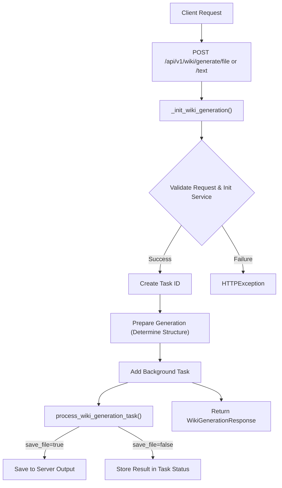
```mermaid
graph TD
    A["Client Request"] --> B["POST /api/v1/wiki/generate/file or /text"];
    B --> C["_init_wiki_generation()"];
    C --> D{"Validate Request & Init Service"};
    D -- "Success" --> E["Create Task ID"];
    E --> F["Prepare Generation (Determine Structure)"];
    F --> G["Add Background Task"];
    G --> H["process_wiki_generation_task()"];
    H -- "save_file=true" --> I["Save to Server Output"];
    H -- "save_file=false" --> J["Store Result in Task Status"];
    G --> K["Return WikiGenerationResponse"];
    D -- "Failure" --> L["HTTPException"];
```

## Webhook Endpoints

The `src/api/v1/endpoints/webhook.py` module provides an endpoint specifically designed to receive and process GitHub webhook events, enabling automated wiki updates.

### `POST /api/v1/webhook/github`

This endpoint acts as a listener for GitHub push events. When a push occurs to the `main` branch of a configured repository, it triggers a full cycle of wiki generation and subsequent commit back to the repository.

*   **Method:** `POST`
*   **Path:** `/api/v1/webhook/github`
*   **Request Body:** Standard GitHub Push Event Payload (`GitHubPushPayload`)
*   **Response:** `202 Accepted` with a message indicating processing has started or skipped.

**Key Logic:**
1.  **Signature Verification (`verify_signature`):** Ensures the request originates from GitHub by validating the `X-Hub-Signature-256` header against a configured `GITHUB_WEBHOOK_SECRET`.
2.  **Bot Commit Prevention:** Ignores commits made by the `Wiki-As-Readme-Bot` or commits containing "via Wiki-As-Readme" in their message to prevent infinite loops.
3.  **Branch Filtering:** Only processes push events to the `refs/heads/main` branch.
4.  **Background Task (`process_full_cycle`):** If all checks pass, a background task is initiated to:
    *   Call the internal `/api/v1/wiki/generate/file` endpoint to generate the wiki.
    *   Retrieve the generated Markdown content.
    *   Update the `WIKI.md` file in the GitHub repository using the GitHub API (`update_github_readme`).

Sources: [src/api/v1/endpoints/webhook.py](github_webhook function)

### `update_github_readme` Function

This asynchronous function handles the interaction with the GitHub API to commit the generated Markdown content back to the repository.

**Process:**
1.  Constructs the GitHub API URL for the `WIKI.md` file.
2.  Fetches the current SHA of `WIKI.md` (if it exists) to enable proper file updates.
3.  Base64 encodes the new Markdown content.
4.  Prepares the commit data, including a commit message and committer details.
5.  Sends a `PUT` request to the GitHub API to update or create the `WIKI.md` file.

Sources: [src/api/v1/endpoints/webhook.py](update_github_readme function)

### `process_full_cycle` Function

This function orchestrates the end-to-end process triggered by a valid GitHub webhook.

**Process:**
1.  Makes an HTTP POST request to the internal wiki generation API (`/api/v1/wiki/generate/file`).
2.  Extracts the generated Markdown content from the response.
3.  Calls `update_github_readme` to commit the content to GitHub.

Sources: [src/api/v1/endpoints/webhook.py](process_full_cycle function)

### GitHub Webhook Processing Flow

The following sequence diagram illustrates the flow of a GitHub webhook event through the system.

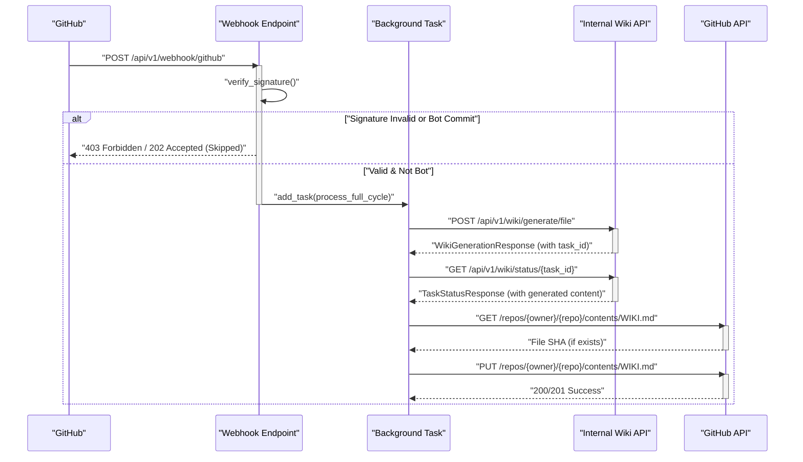
```mermaid
sequenceDiagram
    participant G as "GitHub"
    participant W as "Webhook Endpoint"
    participant B as "Background Task"
    participant I as "Internal Wiki API"
    participant GH as "GitHub API"

    G->>W: "POST /api/v1/webhook/github"
    activate W
    W->>W: "verify_signature()"
    alt "Signature Invalid or Bot Commit"
        W-->>G: "403 Forbidden / 202 Accepted (Skipped)"
    else "Valid & Not Bot"
        W->>B: "add_task(process_full_cycle)"
        deactivate W
        B->>I: "POST /api/v1/wiki/generate/file"
        activate I
        I-->>B: "WikiGenerationResponse (with task_id)"
        deactivate I
        B->>I: "GET /api/v1/wiki/status/{task_id}"
        activate I
        I-->>B: "TaskStatusResponse (with generated content)"
        deactivate I
        B->>GH: "GET /repos/{owner}/{repo}/contents/WIKI.md"
        activate GH
        GH-->>B: "File SHA (if exists)"
        deactivate GH
        B->>GH: "PUT /repos/{owner}/{repo}/contents/WIKI.md"
        activate GH
        GH-->>B: "200/201 Success"
        deactivate GH
    end
```

## API Data Models

The `src/models/api_schema.py` module defines the Pydantic models used for request and response bodies across the API endpoints, ensuring data validation and clear contract definitions.

### `WikiGenerationRequest`

This model defines the structure for requests to initiate wiki generation.

| Field | Type | Description |
|---|---|---|
| `repo_owner` | `str` \| `None` | The owner of the repository (user or organization). |
| `repo_name` | `str` \| `None` | The name of the repository. |
| `repo_type` | `Literal["github", "gitlab", "bitbucket", "local"]` | The type of the repository. Default: `github`. |
| `repo_url` | `str` \| `None` | The URL for cloning a remote repository. |
| `local_path` | `str` \| `None` | The local path to the repository if `repo_type` is 'local'. |
| `language` | `str` | The language for the generated wiki content. Default: `ko`. |
| `is_comprehensive_view` | `bool` | Whether to generate a comprehensive view of the repository. Default: `True`. |

**Validation:** Includes a `model_validator` (`derive_repo_details`) that attempts to extract `repo_owner` and `repo_name` from `repo_url` if they are not explicitly provided and `repo_type` is `github`.

Sources: [src/models/api_schema.py](WikiGenerationRequest class)

### `WikiGenerationResponse`

This model defines the structure for responses returned immediately after a wiki generation task is initiated.

| Field | Type | Description |
|---|---|---|
| `message` | `str` | A message indicating the status of the request. |
| `task_id` | `str` | The ID of the background task initiated. |
| `title` | `str` | The title of the generated wiki. |
| `description` | `str` | The description of the generated wiki. |

Sources: [src/models/api_schema.py](WikiGenerationResponse class)

### `TaskStatusResponse`

This model defines the structure for responses when querying the status of a background task.

| Field | Type | Description |
|---|---|---|
| `task_id` | `str` | The ID of the task. |
| `status` | `Literal["in_progress", "completed", "failed"]` | Current status of the task. |
| `result` | `Any` \| `None` | Result of the task, if completed or failed. |

Sources: [src/models/api_schema.py](TaskStatusResponse class)

## Supporting Data Models

While not directly part of the API request/response, the `src/models/wiki_schema.py` module defines the internal structure of the generated wiki content. These models (`WikiStructure`, `WikiSection`, `WikiPage`) are crucial for the `WikiGenerationService` to construct the documentation, and their content is what ultimately gets returned by the API or saved to files.

Sources: [src/models/wiki_schema.py](WikiStructure class), [src/models/wiki_schema.py](WikiSection class), [src/models/wiki_schema.py](WikiPage class)

## Conclusion

The API Endpoints of **Wiki As Readme** provide a robust and flexible interface for automating documentation generation. By leveraging FastAPI's asynchronous capabilities and background tasks, the system can efficiently handle complex operations like deep code analysis and wiki construction without blocking the user experience. The integration with GitHub webhooks further enhances automation, allowing for continuous documentation updates as code evolves.

---

<a name="system-architecture"></a>

<details>
<summary>Relevant source files</summary>

The following files were used as context for generating this wiki page:

- [README.md](README.md)
- [src/app.py](src/app.py)
- [src/server.py](src/server.py)
- [src/agent/llm.py](src/agent/llm.py)
</details>

# System Architecture

## Introduction

The "Wiki As Readme" project is designed as a flexible and comprehensive AI documentation tool that transforms codebase into structured wiki pages or consolidated `README.md` files. Its architecture emphasizes modularity, extensibility, and compatibility across various LLM providers, Git platforms, and deployment environments. The system is built to be "truly pluggable," allowing users to choose their preferred models, platforms, and deployment strategies.

At its core, the system leverages a modern web stack, separating concerns between a user-facing frontend, a robust backend API, and a dedicated LLM integration layer. This design facilitates scalability, maintainability, and the ability to integrate new technologies or LLM providers with minimal disruption.

## Core Architectural Components

The "Wiki As Readme" system is composed of several key components, each serving a distinct role in the documentation generation process.

*   **Frontend (Streamlit):** Provides an interactive web user interface for users to configure documentation generation requests, monitor progress, and view/download results.
*   **Backend (FastAPI):** Acts as the central API server, handling requests from the frontend, managing background tasks for wiki generation, and exposing webhook endpoints for automated triggers.
*   **LLM Integration (LiteLLM):** A dedicated module responsible for abstracting interactions with various Large Language Models (LLMs), ensuring model agnosticism and handling provider-specific configurations.
*   **Data Models (Pydantic):** Used across the system for defining data structures, ensuring type safety, and validating inputs/outputs, especially for API requests and structured LLM responses.
*   **Diagram Generation (Mermaid.js):** Integrated into the output generation process to visualize project architecture, data flows, and other complex relationships within the documentation.

Sources: [README.md](🛠️ Architecture)

## System Overview and Data Flow

The system operates through a clear separation of concerns, orchestrating interactions between the user interface, the API backend, and the LLM agent.

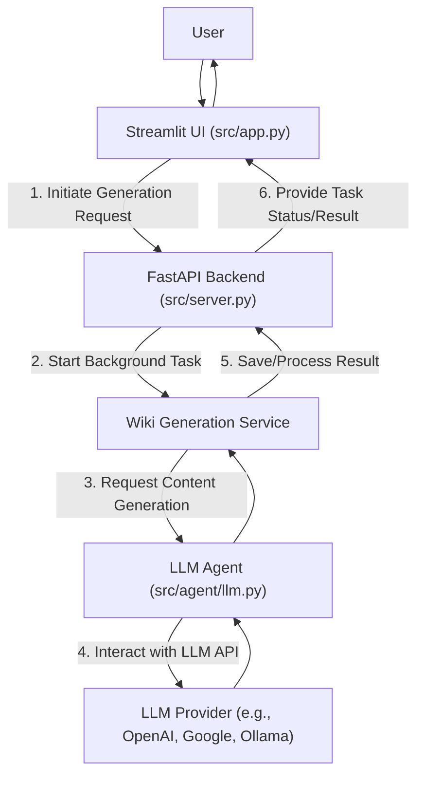
```mermaid
graph TD
    A["User"] --> B["Streamlit UI (src/app.py)"];
    B -- "1. Initiate Generation Request" --> C["FastAPI Backend (src/server.py)"];
    C -- "2. Start Background Task" --> D["Wiki Generation Service"];
    D -- "3. Request Content Generation" --> E["LLM Agent (src/agent/llm.py)"];
    E -- "4. Interact with LLM API" --> F["LLM Provider (e.g., OpenAI, Google, Ollama)"];
    F --> E;
    E --> D;
    D -- "5. Save/Process Result" --> C;
    C -- "6. Provide Task Status/Result" --> B;
    B --> A;
```

### Frontend: Streamlit Application (`src/app.py`)

The `src/app.py` file implements the Streamlit-based user interface. It serves as the primary interaction point for users to input repository details, configure generation options (language, comprehensive view), and trigger the wiki generation process.

**Key Responsibilities:**
*   **User Input Collection:** Gathers repository URLs or local paths, language preferences, and other generation parameters.
*   **API Interaction:** Asynchronously communicates with the FastAPI backend to start generation tasks (`start_generation_task`) and poll for their status (`poll_task_status`).
*   **Result Display:** Renders the generated Markdown content, including special handling for Mermaid diagrams, and provides download options.
*   **History Management:** Displays a list of previously generated wiki files from the local `output` directory.

**Core Functions:**
*   `start_generation_task(request_data: WikiGenerationRequest)`: Sends a POST request to `/api/v1/wiki/generate/file` to initiate a generation task.
*   `poll_task_status(task_id: str)`: Periodically queries `/api/v1/wiki/status/{task_id}` to update the user on the task's progress and retrieve the final result.
*   `render_markdown_with_mermaid(markdown_content: str)`: Parses Markdown content to identify and render Mermaid diagram blocks using `streamlit_mermaid`.

Sources: [src/app.py](main function), [src/app.py](start_generation_task function), [src/app.py](poll_task_status function)

### Backend: FastAPI Server (`src/server.py`)

The `src/server.py` file is the entry point for the FastAPI application, which provides the RESTful API for the system. It orchestrates the wiki generation process, manages background tasks, and handles webhook integrations.

**Key Responsibilities:**
*   **API Endpoint Management:** Defines and exposes various API endpoints for wiki generation and status retrieval.
*   **Request Handling:** Receives and validates incoming requests from the frontend or webhooks.
*   **Task Orchestration:** Initiates and manages background tasks for computationally intensive wiki generation processes.
*   **Webhook Integration:** Provides an endpoint for GitHub webhooks to trigger automated documentation updates on code pushes.

**API Endpoints:**

| Endpoint | Method | Description |
|---|---|---|
| `/` | `GET` | Health check endpoint. |
| `/api/v1/wiki/generate/file` | `POST` | Starts a background task to generate a wiki and saves it as a Markdown file on the server. |
| `/api/v1/wiki/generate/text` | `POST` | Starts a background task to generate a wiki, storing the result in the task status. |
| `/api/v1/wiki/status/{task_id}` | `GET` | Retrieves the status and result of a specific generation task. |
| `/api/v1/webhook/github` | `POST` | Endpoint for GitHub Push events, triggering automatic wiki generation. |

Sources: [src/server.py](app.include_router calls), [README.md](API Reference)

### LLM Integration: `LLMWikiMaker` (`src/agent/llm.py`)

The `src/agent/llm.py` file contains the `LLMWikiMaker` class, which serves as a unified interface for interacting with various Large Language Models. It leverages `LiteLLM` to provide model agnosticism and simplify LLM calls.

**Key Responsibilities:**
*   **Model Agnostic Configuration:** Dynamically configures LLM models based on environment settings (`LLM_PROVIDER`, `MODEL_NAME`), supporting providers like Google Vertex AI, OpenAI, Anthropic, OpenRouter, xAI, and Ollama.
*   **Provider-Specific Handling:** Manages API keys, base URLs, and other parameters specific to each LLM provider.
*   **Structured Output:** Supports generating responses conforming to a Pydantic schema, ensuring type-safe and predictable outputs from LLMs.
*   **Asynchronous Invocation:** Provides an asynchronous `ainvoke` method for non-blocking LLM calls.

**`LLMWikiMaker` Class:**
*   **`__init__(self, response_schema: type[T] | None = None)`:** Initializes the LLM wrapper, optionally with a Pydantic schema for structured output.
*   **`_configure_llm(self) -> tuple[str, dict]`:** Internal method to determine the full model name and LiteLLM completion arguments based on configured provider and model.
*   **`ainvoke(self, input_data: Any) -> T | str`:** The primary method to call the LLM. It takes input data, formats it into messages, calls `litellm.acompletion`, and parses the response, optionally validating it against the `response_schema`.

Sources: [src/agent/llm.py](LLMWikiMaker class), [src/agent/llm.py](_configure_llm method), [src/agent/llm.py](ainvoke method)

## Deployment Agnosticism

The architecture is designed to support various deployment scenarios, making it highly adaptable:

*   **CI/CD Integration:** Can be deployed as a GitHub Action to automate documentation updates within CI/CD pipelines.
*   **Containerization:** Deployable via Docker Compose for local development or containerized environments.
*   **Long-running Service:** Can be deployed as a persistent API server with webhook support for real-time updates.
*   **CLI Tool:** Usable as a local command-line tool for on-demand generation.

Sources: [README.md](Deployment Agnostic)

## Conclusion

The "Wiki As Readme" system architecture is characterized by its modularity, flexibility, and robust design. By separating the frontend, backend, and LLM integration layers, it achieves high compatibility with diverse LLM providers and deployment environments. This structure ensures that the tool remains adaptable to evolving AI technologies and user requirements, providing a powerful and versatile solution for automated documentation generation.

---

<a name="core-codebase-components"></a>

<details>
<summary>Relevant source files</summary>

The following files were used as context for generating this wiki page:

- [src/services/repo_fetcher.py](src/services/repo_fetcher.py)
- [src/services/structure_analyzer.py](src/services/structure_analyzer.py)
- [src/services/wiki_generator.py](src/services/wiki_generator.py)
- [src/providers/github.py](src/providers/github.py)
- [src/agent/llm.py](src/agent/llm.py)
- [src/api/v1/endpoints/wiki.py](src/api/v1/endpoints/wiki.py)
- [src/models/wiki_schema.py](src/models/wiki_schema.py)
- [src/utils/file_filter.py](src/utils/file_filter.py)
</details>

# Core Codebase Components

This document outlines the core components of the wiki generation system, detailing their responsibilities, interactions, and overall architecture. The system is designed to automatically generate comprehensive technical wikis from source code repositories by leveraging Large Language Models (LLMs) and various repository providers. It follows a modular service-oriented architecture, enabling flexible integration and extensibility.

The primary goal is to transform raw repository information (file trees, READMEs, file contents) into a structured, human-readable wiki, complete with pages, sections, and inter-page relationships. This process involves fetching data, analyzing structure, generating content, and formatting the final output.

## Overall Architecture and Workflow

The wiki generation process is orchestrated by the `WikiGenerationService`, which coordinates several specialized services. The typical flow begins with an API request, proceeds through repository data fetching, LLM-driven structure and content generation, and concludes with the delivery of the generated wiki.

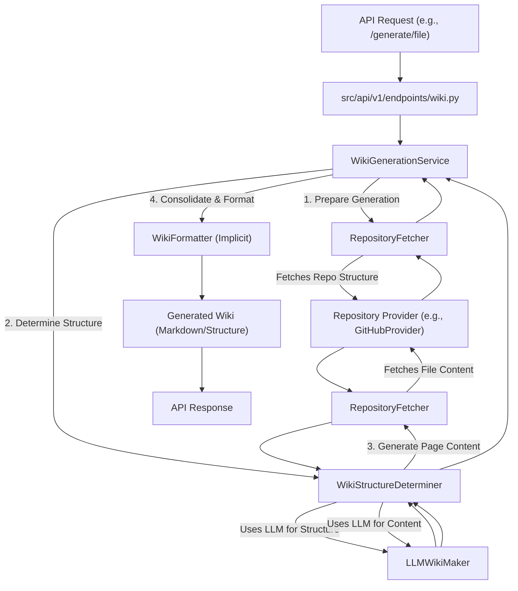
```mermaid
flowchart TD
    A["API Request (e.g., /generate/file)"] --> B["src/api/v1/endpoints/wiki.py"];
    B --> C["WikiGenerationService"];
    C -- "1. Prepare Generation" --> D["RepositoryFetcher"];
    D -- "Fetches Repo Structure" --> E["Repository Provider (e.g., GitHubProvider)"];
    E --> D;
    D --> C;
    C -- "2. Determine Structure" --> F["WikiStructureDeterminer"];
    F -- "Uses LLM for Structure" --> G["LLMWikiMaker"];
    G --> F;
    F -- "3. Generate Page Content" --> H["RepositoryFetcher"];
    H -- "Fetches File Content" --> E;
    E --> H;
    H --> F;
    F -- "Uses LLM for Content" --> G;
    G --> F;
    F --> C;
    C -- "4. Consolidate & Format" --> I["WikiFormatter (Implicit)"];
    I --> J["Generated Wiki (Markdown/Structure)"];
    J --> K["API Response"];
```
Sources: [src/api/v1/endpoints/wiki.py](generate_wiki_file function), [src/services/wiki_generator.py](generate_wiki_with_structure function), [src/services/repo_fetcher.py](RepositoryFetcher class), [src/services/structure_analyzer.py](WikiStructureDeterminer class), [src/agent/llm.py](LLMWikiMaker class)

## Core Components

### 1. WikiGenerationService

The `WikiGenerationService` acts as the central orchestrator for the entire wiki generation pipeline. It validates incoming requests, initializes and manages the lifecycle of other services (`RepositoryFetcher`, `WikiStructureDeterminer`), and coordinates the sequential steps of fetching, analyzing, generating, and formatting the wiki.

**Key Responsibilities:**
*   **Request Validation:** Ensures that the input `WikiGenerationRequest` is valid for the specified repository type.
*   **Orchestration:** Manages the flow from initial repository structure fetching to final content generation and consolidation.
*   **Resource Management:** Handles the initialization and proper closing of underlying services.
*   **Output Handling:** Consolidates generated pages into a single Markdown output and can save it to a file.

**Key Methods:**
| Method | Description |
|---|---|
| `validate_request(request)` | Static method to validate the integrity of the `WikiGenerationRequest`. |
| `prepare_generation()` | Initializes `RepositoryFetcher` and `WikiStructureDeterminer` to fetch the repository structure and determine the initial wiki outline, without generating page content. Useful for human-in-the-loop scenarios. |
| `generate_wiki_with_structure(determiner)` | Executes the full pipeline: waits for content generation, consolidates pages, and returns the complete markdown along with the `WikiStructure` and individual page contents. |
| `_initialize_and_determine()` | Internal method to fetch repository structure and then determine the wiki structure using the `WikiStructureDeterminer`. |
| `save_to_file(markdown_content)` | Saves the final markdown content to a specified file path on the server. |
Sources: [src/services/wiki_generator.py](WikiGenerationService class)

### 2. RepositoryFetcher

The `RepositoryFetcher` service is responsible for abstracting interactions with various code repository providers (e.g., GitHub, GitLab, Bitbucket, Local). It provides a unified interface to fetch repository metadata (file tree, README) and the content of specific files.

**Key Responsibilities:**
*   **Provider Abstraction:** Selects and instantiates the correct `RepositoryProvider` based on the `repo_type` specified in the request.
*   **Repository Structure Retrieval:** Fetches the hierarchical file structure of the repository.
*   **File Content Retrieval:** Fetches the raw content of individual files.
*   **Resource Management:** Manages the underlying HTTP client sessions for providers.

**Key Methods:**
| Method | Description |
|---|---|
| `__init__(request)` | Initializes the fetcher and instantiates the appropriate `RepositoryProvider` (e.g., `GitHubProvider`). |
| `fetch_repository_structure()` | Asynchronously fetches the overall structure of the repository, including the file tree and README content. |
| `fetch_file_content(file_path)` | Asynchronously fetches the content of a specific file given its path. |
| `close()` | Cleans up resources, such as closing HTTP client sessions. |
Sources: [src/services/repo_fetcher.py](RepositoryFetcher class)

#### Repository Providers (e.g., GitHubProvider)

Concrete implementations of `RepositoryProvider` handle the specifics of interacting with different version control systems. `GitHubProvider` demonstrates this by using the GitHub REST API.

**Key Aspects of `GitHubProvider`:**
*   **Authentication:** Uses `GIT_API_TOKEN` for authenticated requests.
*   **API Interaction:** Constructs URLs and makes HTTP requests to GitHub API endpoints (e.g., `/repos/{owner}/{repo}/git/trees`, `/repos/{owner}/{repo}/readme`, `/repos/{owner}/{repo}/contents`).
*   **Data Parsing:** Parses JSON responses and decodes Base64 encoded file contents.
*   **File Filtering:** Utilizes `should_ignore` from `src.utils.file_filter.py` to exclude irrelevant files from the file tree.
Sources: [src/providers/github.py](GitHubProvider class), [src/utils/file_filter.py](should_ignore function)

### 3. WikiStructureDeterminer

The `WikiStructureDeterminer` is the intelligence core of the system. It leverages LLMs to analyze the repository structure and generate both the wiki's hierarchical outline (`WikiStructure`) and the detailed content for each page. It manages concurrency for LLM calls to prevent rate limiting.

**Key Responsibilities:**
*   **Wiki Structure Generation:** Uses an LLM to analyze the file tree and README to propose a logical wiki structure (pages, sections, titles).
*   **Page Content Generation:** For each identified wiki page, it fetches relevant source files and uses an LLM to generate the page's content.
*   **Prompt Management:** Loads and renders Jinja2 templates for LLM prompts.
*   **Concurrency Control:** Uses an `asyncio.Semaphore` to limit the number of concurrent LLM requests.
*   **State Management:** Tracks the progress of page generation, loading status, and errors.

**Key Methods:**
| Method | Description |
|---|---|
| `__init__(request, max_concurrency)` | Initializes with the generation request and sets up `RepositoryFetcher` and `LLMWikiMaker`. |
| `_load_prompt_template(prompt_path)` | Cached method to load LLM prompt templates from YAML files. |
| `_fetch_and_format_files(page)` | Fetches content for all files associated with a `WikiPage` in parallel using `RepositoryFetcher` and formats them for LLM input. |
| `generate_page_content(page, language)` | Generates the content for a single `WikiPage` by constructing a prompt, invoking the LLM, and storing the result. |
| `determine_wiki_structure(file_tree, readme, ...)` | Invokes an LLM to analyze the repository's file tree and README to produce the overall `WikiStructure`. |
| `_start_content_generation_flow(language)` | Manages the asynchronous execution of all `generate_page_content` tasks. |
Sources: [src/services/structure_analyzer.py](WikiStructureDeterminer class)

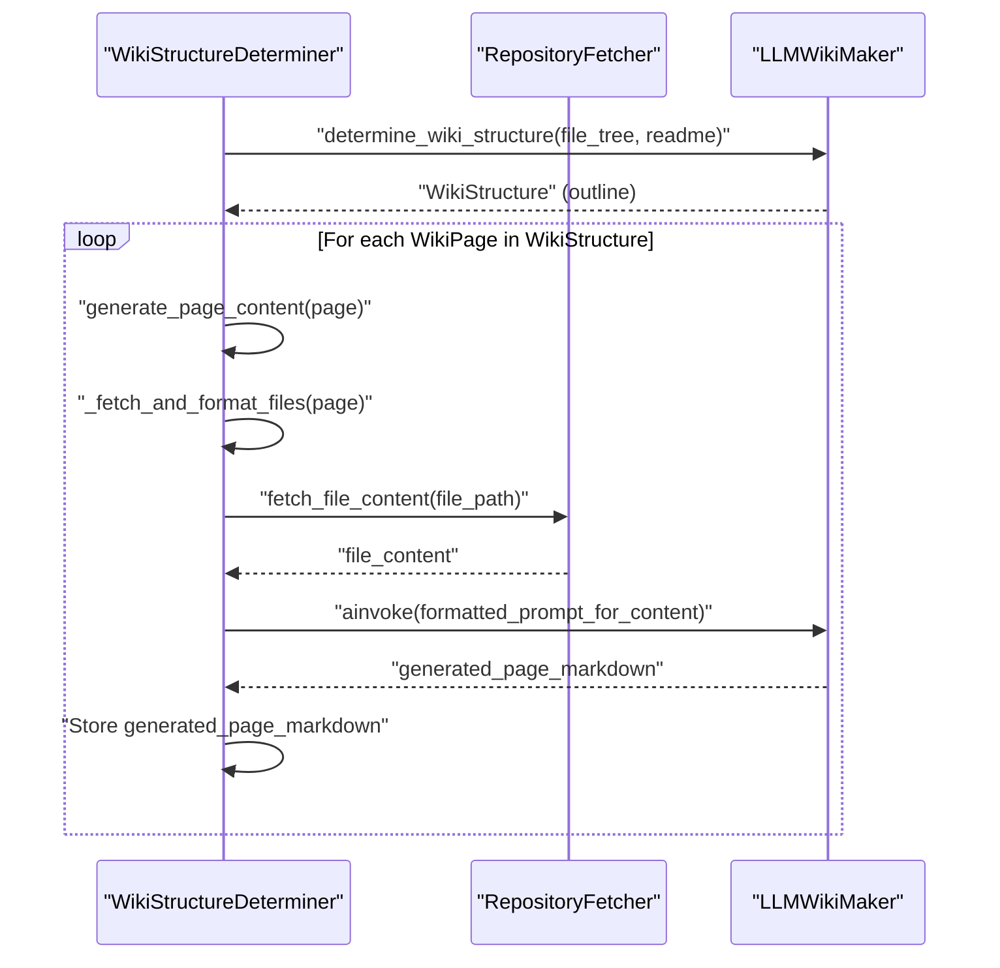
```mermaid
sequenceDiagram
    participant WSD as "WikiStructureDeterminer"
    participant RF as "RepositoryFetcher"
    participant LLM as "LLMWikiMaker"

    WSD->>LLM: "determine_wiki_structure(file_tree, readme)"
    LLM-->>WSD: "WikiStructure" (outline)

    loop For each WikiPage in WikiStructure
        WSD->>WSD: "generate_page_content(page)"
        WSD->>WSD: "_fetch_and_format_files(page)"
        WSD->>RF: "fetch_file_content(file_path)"
        RF-->>WSD: "file_content"
        WSD->>LLM: "ainvoke(formatted_prompt_for_content)"
        LLM-->>WSD: "generated_page_markdown"
        WSD->>WSD: "Store generated_page_markdown"
    end
```
Sources: [src/services/structure_analyzer.py](determine_wiki_structure function, generate_page_content function, _fetch_and_format_files function)

### 4. LLMWikiMaker

The `LLMWikiMaker` class provides a standardized interface for interacting with various Large Language Models via the LiteLLM library. It handles LLM configuration, provider-specific settings, and supports structured output using Pydantic schemas.

**Key Responsibilities:**
*   **LLM Abstraction:** Provides a consistent `ainvoke` method regardless of the underlying LLM provider.
*   **Provider Configuration:** Configures model names and API keys for different providers (OpenAI, Google Vertex AI, Anthropic, OpenRouter, Ollama, xAI).
*   **Structured Output:** Integrates with Pydantic models to request and parse structured JSON responses from LLMs, enhancing reliability and type safety.
*   **Error Handling:** Includes mechanisms for retries and parsing JSON from markdown code blocks.

**Key Methods:**
| Method | Description |
|---|---|
| `__init__(response_schema)` | Initializes with an optional Pydantic `response_schema` for structured output. |
| `_configure_llm()` | Determines the LLM model name and completion arguments based on application settings and provider. |
| `ainvoke(input_data)` | Asynchronously calls the configured LLM with the given input. Returns a Pydantic model instance if `response_schema` is provided, otherwise a string. |
| `_extract_json(text)` | Helper to extract JSON content from markdown code blocks, useful when LLMs don't natively support structured output. |
Sources: [src/agent/llm.py](LLMWikiMaker class)

### 5. API Endpoints

The `src/api/v1/endpoints/wiki.py` module defines the FastAPI endpoints that expose the wiki generation functionality. It handles incoming HTTP requests, initiates background tasks for long-running generation processes, and provides status tracking.

**Key Endpoints:**
| Endpoint | Method | Description |
|---|---|---|
| `/generate/file` | `POST` | Triggers wiki generation as a background task. The generated wiki is saved as a Markdown file on the server. Returns a `task_id` for status tracking. |
| `/generate/text` | `POST` | Triggers wiki generation as a background task. The generated wiki content is returned as text within the task status, not saved to a file. Returns a `task_id`. |
| `/status/{task_id}` | `GET` | Retrieves the current status and results of a previously initiated wiki generation task. |
Sources: [src/api/v1/endpoints/wiki.py](generate_wiki_file function, generate_wiki_text function, get_wiki_generation_status function)

### 6. Data Models (src/models/wiki_schema.py)

Pydantic models define the structure of data exchanged within the system, especially for LLM inputs/outputs and API responses. These models ensure type safety and clear data contracts.

**Key Models:**
*   `WikiSection`: Represents a section within the wiki, containing a title, ID, and lists of page/subsection IDs.
*   `WikiPage`: Represents an individual wiki page, including its title, ID, associated file paths, importance, related pages, and parent section. The `content` field is initially empty and filled during generation.
*   `WikiStructure`: The top-level model describing the entire wiki, including its title, description, a list of all `WikiPage` objects, `WikiSection` objects, and root section IDs. This is the primary structured output from the LLM for wiki structure determination.
*   `RepositoryStructure`: An internal model used to hold the raw repository information fetched by `RepositoryFetcher` (file tree, README, default branch).
Sources: [src/models/wiki_schema.py](WikiSection class, WikiPage class, WikiStructure class, RepositoryStructure class)

### 7. Utilities (src/utils/file_filter.py)

The `file_filter.py` utility provides a function to determine if a given file path should be ignored based on a list of glob patterns. This is crucial for preventing irrelevant files (e.g., build artifacts, configuration files) from being included in the analysis or content generation.

**Key Function:**
*   `should_ignore(path: str, patterns: list[str]) -> bool`: Checks if a file path matches any of the provided ignore patterns, supporting direct matches, filename matches, and directory component matches.
Sources: [src/utils/file_filter.py](should_ignore function)

## Conclusion

The core codebase components form a robust and extensible system for automated wiki generation. By clearly separating concerns into specialized services like `RepositoryFetcher`, `WikiStructureDeterminer`, and `LLMWikiMaker`, the architecture promotes modularity, testability, and maintainability. The use of Pydantic models ensures data integrity, while asynchronous programming and concurrency controls enable efficient processing of complex, I/O-bound tasks involving external APIs and LLMs.

---

<a name="generated-wiki-examples"></a>

<details>
<summary>Relevant source files</summary>

The following files were used as context for generating this wiki page:

- [README.md](README.md)
- [examples/langgraph_readme_en.md](examples/langgraph_readme_en.md)
- [examples/langgraph_readme_ko.md](examples/langgraph_readme_ko.md)
- [examples/wiki_as_README.md](examples/wiki_as_README.md)
</details>

# Generated Wiki Examples

## Introduction

This document presents a collection of example wiki pages generated by the "Wiki As Readme" tool. These examples serve as concrete demonstrations of the tool's capabilities in transforming diverse codebases into comprehensive, structured, and easily navigable documentation. By showcasing outputs from different projects and in multiple languages, these examples highlight the flexibility, accuracy, and quality of documentation that "Wiki As Readme" can produce.

The examples include a detailed wiki for the LangGraph framework (in both English and Korean) and the self-generated documentation for the "Wiki As Readme" project itself. Each example illustrates key features such as automatic table of contents generation, deep context analysis, inclusion of code snippets, and the creation of visual diagrams using Mermaid.js.

## Overview of Example Wikis

The "Wiki As Readme" project includes several generated examples to demonstrate its output quality and features. These examples are typically stored in the `examples/` directory of the project.

### Example Wiki Generation Flow

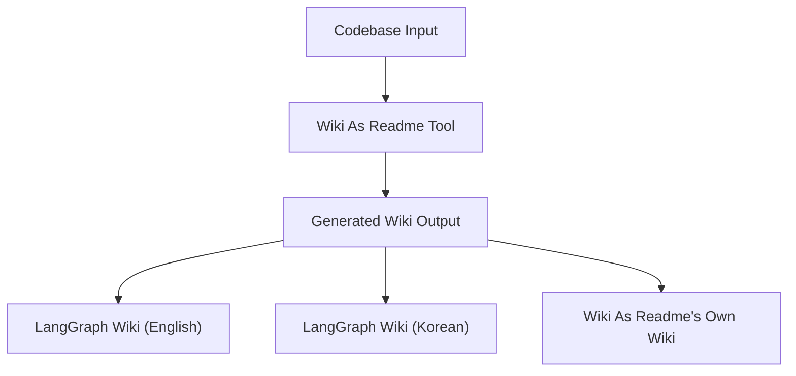
```mermaid
graph TD
    A["Codebase Input"] --> B["Wiki As Readme Tool"];
    B --> C["Generated Wiki Output"];
    C --> D1["LangGraph Wiki (English)"];
    C --> D2["LangGraph Wiki (Korean)"];
    C --> D3["Wiki As Readme's Own Wiki"];
```

### 1. LangGraph Wiki Example (English)

This example showcases a comprehensive wiki generated from the LangGraph framework's codebase, presented in English. It demonstrates the tool's ability to extract and structure complex technical information into a readable format.

**Key Sections and Content:**
The English LangGraph Wiki is highly structured, featuring a detailed Table of Contents that covers various aspects of the framework:
*   **Introduction to LangGraph**: Provides an overview, core benefits, and ecosystem integration.
*   **Core Concepts**: Explains fundamental ideas, components, and application structure.
*   **Quickstart Guide**: Offers step-by-step instructions for building a basic chatbot.
*   **Graph Structure and Components**: Delves into the `StateGraph` and `CompiledStateGraph` classes, and channel mechanisms.
*   **Durable Execution and Checkpointing**: Details persistence, determinism, and recovery mechanisms.
*   **Pregel Algorithm Implementation**: Describes the underlying execution model.
*   **Configuration and Customization**: Covers runtime and CLI configuration.
*   **Runtime and Execution**: Explains the `Runtime` class and background executors.
*   **Persistence and Memory**: Discusses checkpointers, threads, and memory stores.
*   **Tracing and Debugging with LangSmith**: Explains observability tools.
*   **Examples and Use Cases**: References practical demonstrations.
*   **LangGraph CLI**: Details the command-line interface.

**Visuals and Code:**
This example frequently incorporates Mermaid diagrams to visualize concepts (e.g., "Workflow Diagram", "Graph Building Flow", "Channel Communication", "Data Flow Diagram for Postgres Checkpoint Saver", "Pregel `prepare_next_tasks` Function", "CLI Configuration Update Path"). It also includes numerous Python and JavaScript code snippets to illustrate usage.
Sources: [examples/langgraph_readme_en.md](Table of Contents)

### 2. LangGraph Wiki Example (Korean)

This example is the Korean translation of the LangGraph Wiki, demonstrating the "Wiki As Readme" tool's multi-language generation capabilities. The content mirrors the English version in structure and depth, adapted for Korean technical audiences.

**Key Sections and Content:**
The Korean LangGraph Wiki also features a comprehensive Table of Contents:
*   **소개 ("Introduction")**: Overview, core benefits, and ecosystem.
*   **빠른 시작 ("Quickstart")**: Installation and simple workflow creation.
*   **핵심 이점 ("Core Benefits")**: Detailed explanation of durable execution, human-in-the-loop, comprehensive memory, etc.
*   **지속적인 실행 ("Durable Execution")**: Requirements, determinism, durability modes.
*   **사람 개입 ("Human-in-the-loop")**: Key features and common patterns.
*   **메모리 ("Memory")**: Short-term and long-term memory management.
*   **예제 ("Examples")**: Overview of available examples.
*   **LangGraph CLI**: Command-line interface details.
*   **아키텍처 ("Architecture")**: Application structure and core classes.
*   **기여 ("Contributing")**: How to contribute to the project.
*   **문제 해결 ("Troubleshooting")**: Common errors and solutions.
*   **LangGraph Cloud**: Deployment and management on LangGraph Cloud.

**Visuals and Code:**
Similar to the English version, this example includes Mermaid diagrams (e.g., "워크플로우 시각화", "Dockerfile 생성 흐름") and code snippets, all presented within the Korean context.
Sources: [examples/langgraph_readme_ko.md](Table of Contents)

### 3. Wiki As Readme's Own Wiki

This example is particularly notable as it represents the documentation for the "Wiki As Readme" project itself, generated by the tool. This self-documentation capability serves as a powerful testament to the tool's effectiveness and accuracy.

**Key Sections and Content:**
The self-generated wiki for "Wiki As Readme" provides a detailed overview of the project:
*   **Introduction to Wiki As Readme**: Core philosophy, universal compatibility (model, platform, deployment agnostic).
*   **Core Features**: Deep context analysis, smart structure generation, comprehensive content, automatic diagrams, hybrid output, async & scalable.
*   **Universal Compatibility**: Detailed explanation of how it achieves model, platform, and deployment agnosticism.
*   **Using as a GitHub Action**: Configuration, workflow integration, Docker image structure.
*   **Docker Compose & Local Development**: Setup for local development, Docker Compose configuration, Dockerfiles, application entry points.
*   **Deploying as a Server with Webhooks**: Server architecture, GitHub webhook integration, wiki generation API, Docker deployment.
*   **Configuration Reference**: Comprehensive guide to environment variables.
*   **API Endpoints**: Details on wiki generation and webhook endpoints.
*   **System Architecture**: Overall architecture, frontend (Streamlit), backend (FastAPI).
*   **Core Components Overview**: Detailed breakdown of `WikiGenerationService`, `RepositoryFetcher`, `WikiStructureDeterminer`, `LLMWikiMaker`, `WikiFormatter`.
*   **Contributing to Wiki As Readme**: Guidelines for contributions.

**Visuals and Code:**
This example extensively uses Mermaid diagrams to illustrate system architecture, workflow flows, configuration loading, API interaction sequences, and component relationships. It also includes code snippets for configuration, API requests, and Docker setups.
Sources: [examples/wiki_as_README.md](Table of Contents)

## Demonstrative Capabilities

Collectively, these generated wiki examples highlight several key capabilities of the "Wiki As Readme" tool:

*   **Structured Output**: All examples feature a clear Table of Contents, hierarchical headings, and logical organization, making the documentation easy to navigate.
*   **Comprehensive Content**: The tool can generate detailed explanations covering various technical aspects, from high-level introductions to specific API details and architectural components.
*   **Code Snippet Integration**: Relevant code examples are seamlessly integrated into the documentation, enhancing clarity and practical understanding.
*   **Mermaid Diagram Generation**: The tool effectively generates various types of Mermaid diagrams (flowcharts, sequence diagrams, class diagrams) to visually represent complex logic, workflows, and system architectures.
*   **Multi-language Support**: The LangGraph examples demonstrate the tool's ability to generate documentation in different languages, catering to diverse user bases.
*   **Self-Documentation**: The "Wiki As Readme's Own Wiki" example proves the tool's robustness and accuracy by successfully documenting its own codebase.
*   **Source Citation**: Within the generated wikis, claims and explanations are often cited back to their original source files, providing traceability and verification.

## Conclusion

The provided generated wiki examples serve as compelling evidence of the "Wiki As Readme" tool's effectiveness. They showcase its ability to produce high-quality, structured, and comprehensive technical documentation across different projects and languages. These examples underscore the tool's value as an automated solution for maintaining up-to-date and accessible project documentation, significantly reducing manual effort and improving developer productivity.

---

<a name="contributing-to-wiki-as-readme"></a>

<details>
<summary>Relevant source files</summary>

The following files were used as context for generating this wiki page:

- [README.md](README.md)
- [LICENSE](LICENSE)
- [.pre-commit-config.yaml](.pre-commit-config.yaml)
- [pyproject.toml](pyproject.toml)
</details>

# Contributing to Wiki As Readme

## Introduction

**Wiki As Readme** is an innovative AI documentation tool designed to transform codebases into comprehensive wikis and READMEs. It boasts universal compatibility across various LLM models, Git platforms, and deployment environments, making it a highly flexible solution for automated documentation. The project actively welcomes contributions from the community to enhance its features, integrations, and overall robustness. This guide outlines the process and best practices for contributing to the Wiki As Readme project.

Sources: [README.md](Introduction), [README.md](Note about contributions)

## Getting Started with Contributions

Contributing to Wiki As Readme involves a standard open-source workflow, coupled with specific local development setup instructions and adherence to code quality standards.

### General Contribution Workflow

The typical contribution flow involves forking the repository, making your changes, and submitting a pull request.

1.  **Fork the Project**: Start by forking the `wiki-as-readme` repository on GitHub to your personal account.
2.  **Clone Your Fork**: Clone your forked repository to your local machine.
    ```bash
    git clone https://github.com/your-username/wiki-as-readme.git
    cd wiki-as-readme
    ```
3.  **Create a Feature Branch**: Create a new branch for your feature or bug fix.
    ```bash
    git checkout -b feature/your-amazing-feature
    ```
4.  **Implement Your Changes**: Make your desired code modifications, additions, or bug fixes.
5.  **Commit Your Changes**: Commit your changes with a clear and concise message.
    ```bash
    git commit -m 'feat: Add some AmazingFeature'
    ```
6.  **Push to the Branch**: Push your local branch to your forked repository on GitHub.
    ```bash
    git push origin feature/your-amazing-feature
    ```
7.  **Open a Pull Request**: Navigate to the original `wiki-as-readme` repository on GitHub and open a Pull Request from your feature branch. Ensure your PR description clearly explains the changes and their purpose.

Sources: [README.md](Contributing section)

### Local Development Setup

For developers looking to modify the source code, setting up a local Python development environment is recommended.

#### Prerequisites

*   **Python**: Version 3.12 or higher.
*   **uv**: A fast Python package installer and resolver.

#### Installation Steps

1.  **Clone the Repository**: If you haven't already, clone the project.
    ```bash
    git clone https://github.com/catuscio/wiki-as-readme.git
    cd wiki-as-readme
    ```
2.  **Install Dependencies**: Use `uv` to synchronize dependencies and create a virtual environment.
    ```bash
    uv sync
    ```
3.  **Activate Virtual Environment**: Activate the newly created virtual environment.
    ```bash
    source .venv/bin/activate
    ```

#### Environment Configuration

Copy the `.env example` file to `.env` and configure your LLM provider API keys and other settings. This file is crucial for the application to interact with LLMs.

Sources: [README.md](Local Python Development section), [README.md](Configuration Reference)

#### Running Components Locally

*   **Run Backend (FastAPI)**:
    ```bash
    uv run uvicorn src.server:app --reload --port 8000
    ```
*   **Run Frontend (Streamlit)**:
    ```bash
    uv run streamlit run src/app.py
    ```

Sources: [README.md](Local Python Development section)

### Contribution Workflow Diagram

The following flowchart illustrates the typical steps involved in contributing to the project:

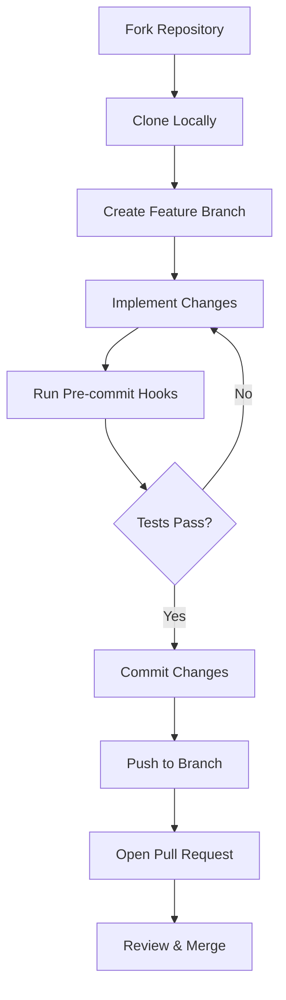
```mermaid
graph TD
    A["Fork Repository"] --> B["Clone Locally"];
    B --> C["Create Feature Branch"];
    C --> D["Implement Changes"];
    D --> E["Run Pre-commit Hooks"];
    E --> F{"Tests Pass?"};
    F -- "No" --> D;
    F -- "Yes" --> G["Commit Changes"];
    G --> H["Push to Branch"];
    H --> I["Open Pull Request"];
    I --> J["Review & Merge"];
```

## Code Quality and Standards

Maintaining high code quality is essential for the project's sustainability and collaborative development.

### Linting and Formatting

The project uses `ruff` for code linting and formatting, enforced via pre-commit hooks.

*   **Pre-commit Hooks**: The `.pre-commit-config.yaml` file defines hooks that run `ruff` to automatically fix common issues and format code before each commit. This ensures consistent code style across the project.
    ```yaml
    # .pre-commit-config.yaml snippet
    repos:
      - repo: https://github.com/astral-sh/ruff-pre-commit
        rev: v0.11.13
        hooks:
          - id: ruff
            args: [--fix]
          - id: ruff-format
    ```
*   **Ruff Configuration**: The `pyproject.toml` file specifies `ruff`'s configuration, including line length, target Python version, selected linting rules, and formatting preferences.
    *   `line-length = 88`
    *   `target-version = "py312"`
    *   `quote-style = "double"`
    *   `indent-style = "space"`

Sources: [.pre-commit-config.yaml](all content), [pyproject.toml](tool.ruff section)

### Python Version

The project explicitly requires Python 3.12 or newer. Ensure your development environment uses a compatible Python version.

Sources: [pyproject.toml](project.requires-python)

### Dependencies

Key dependencies are managed in `pyproject.toml`. When adding new features, ensure any new dependencies are added to the appropriate section (`dependencies`, `optional-dependencies`, or `dependency-groups`).

| Category | Example Dependencies |
|---|---|
| **Core** | `litellm`, `pydantic`, `httpx`, `loguru`, `python-dotenv` |
| **UI (Optional)** | `streamlit`, `streamlit-mermaid` |
| **API (Optional)** | `fastapi`, `uvicorn`, `gunicorn` |
| **Dev (Optional)** | `pre-commit`, `ruff` |

Sources: [pyproject.toml](project.dependencies, project.optional-dependencies, dependency-groups)

## Project Architecture for Contributors

Understanding the high-level architecture helps contributors identify where their changes fit within the system.

### Core Components

*   **Frontend**: Built with [Streamlit](https://streamlit.io/) for the user interface.
*   **Backend**: Powered by [FastAPI](https://fastapi.tiangolo.com/) for REST APIs and handling background tasks.
*   **LLM Integration**: Uses [LiteLLM](https://docs.litelllm.ai/) to provide a unified interface for over 100 different Large Language Models.
*   **Data Models**: Leverages [Pydantic](https://docs.pydantic.dev/) for type safety and structured output validation.
*   **Diagrams**: Generates visualizations using [Mermaid.js](https://mermaid.js.org/).

Sources: [README.md](Architecture section)

### High-Level Architecture Diagram

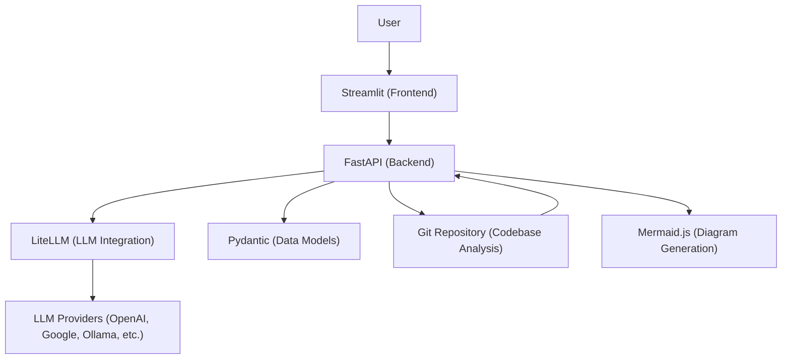
```mermaid
graph TD
    User["User"] --> Streamlit_UI["Streamlit (Frontend)"];
    Streamlit_UI --> FastAPI_Backend["FastAPI (Backend)"];
    FastAPI_Backend --> LiteLLM_Integration["LiteLLM (LLM Integration)"];
    LiteLLM_Integration --> LLM_Providers["LLM Providers (OpenAI, Google, Ollama, etc.)"];
    FastAPI_Backend --> Pydantic_Models["Pydantic (Data Models)"];
    FastAPI_Backend --> Git_Repo_Access["Git Repository (Codebase Analysis)"];
    FastAPI_Backend --> Mermaid_Generation["Mermaid.js (Diagram Generation)"];
    Git_Repo_Access --> FastAPI_Backend;
```

## License Information

This project is licensed under the MIT License. By contributing, you agree that your contributions will be licensed under the same terms.

Sources: [LICENSE](all content), [README.md](License section)

## Conclusion

Contributions are vital to the growth and improvement of Wiki As Readme. By following these guidelines, you can effectively contribute to the project, helping to make it an even more powerful and flexible documentation tool. We appreciate your efforts and look forward to your pull requests!

---
