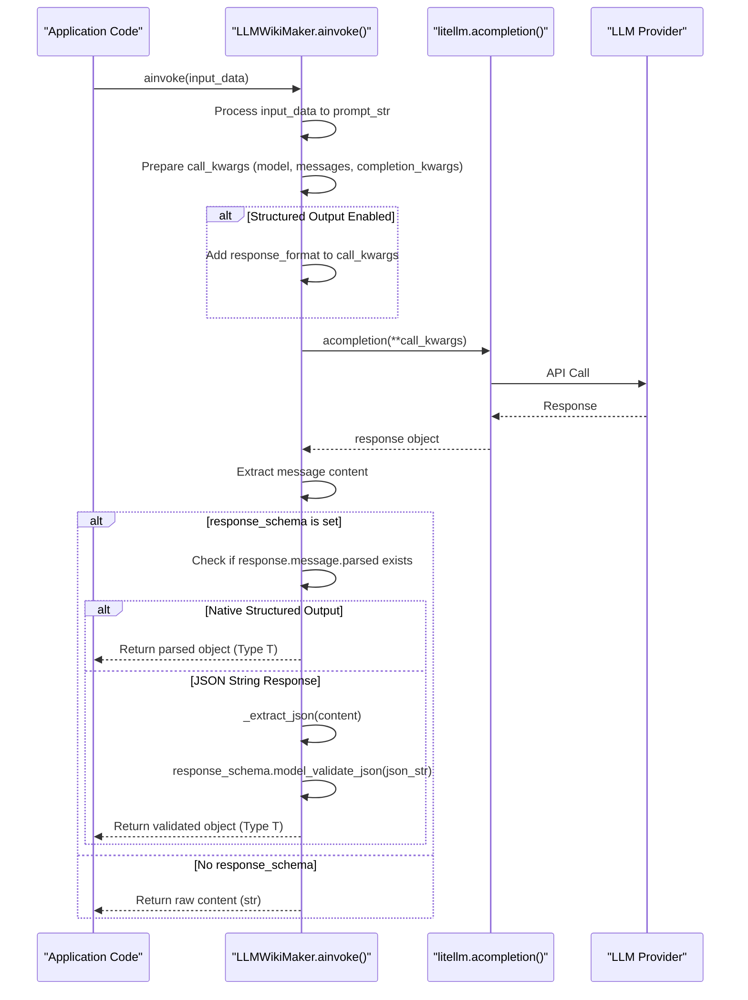

# Wiki As Readme Project Wiki

Comprehensive documentation for the Wiki As Readme project, covering its features, usage, architecture, and integrations.

## Table of Contents

- [Introduction to Wiki As Readme](#introduction-to-wiki-as-readme)
- [Core Features Overview](#core-features-overview)
- [GitHub Action Usage](#github-action-usage)
- [Local Development & Docker](#local-development-&-docker)
- [API Server & Webhooks](#api-server-&-webhooks)
- [Configuration Reference](#configuration-reference)
- [LLM & Provider Integration](#llm-&-provider-integration)
- [Git & Notion Integrations](#git-&-notion-integrations)
- [Project Architecture](#project-architecture)
- [API Reference](#api-reference)
- [Contributing Guide](#contributing-guide)
- [Examples & Demos](#examples-&-demos)

---

<a name="project-overview"></a>

<details>
<summary>Relevant source files</summary>

The following files were used as context for generating this wiki page:

- [README.md](README.md)
- [README_ko.md](README_ko.md)
- [CLAUDE.md](CLAUDE.md)
- [WIKI.md](WIKI.md)
- [pyproject.toml](pyproject.toml)
</details>

# Project Overview

**Wiki As Readme** is an AI-powered documentation tool designed to transform any codebase into a comprehensive wiki or `README.md` file within minutes. It serves as a "drop-in" solution for automated, high-quality technical documentation by emphasizing universal compatibility across various Large Language Models (LLMs), Git platforms, and deployment environments. The project's core purpose is to reduce the manual effort associated with maintaining up-to-date project documentation by leveraging AI for deep context analysis and structured content generation.
Sources: [README.md](Introduction section), [CLAUDE.md](Project Overview)

## Architecture & Design

The project employs a modular, Python-based architecture designed for scalability and flexibility, separating concerns into distinct layers for repository interaction, LLM orchestration, and service management. It utilizes a FastAPI backend for core logic and API exposure, and a Streamlit frontend for user interaction.
Sources: [README.md](Architecture section), [CLAUDE.md](Architecture)

### High-Level Architecture

The system operates on a client-server model, where the FastAPI server orchestrates complex wiki generation tasks, and the Streamlit application provides an interactive user interface.


Sources: [CLAUDE.md](Architecture), [README.md](Architecture section)

### Generation Pipeline

The core wiki generation process follows a structured, asynchronous pipeline:

1.  **RepositoryFetcher:** Selects a provider (GitHub, GitLab, Bitbucket, or Local) to fetch the file tree and `README.md` content, producing a `RepositoryStructure`.
2.  **WikiStructureDeterminer:** Renders a Jinja2 prompt (`wiki_structure_generator.yaml`) and calls the LLM via `LLMWikiMaker` to determine the `WikiStructure` (sections and pages).
3.  **Page Content Generation:** For each page in the determined `WikiStructure`, the system fetches relevant file contents, renders another Jinja2 prompt (`wiki_contents_generator.yaml`), and calls the LLM to generate the page's Markdown content. This step can run in parallel for multiple pages, limited by `max_concurrency` (default 5) using `asyncio.Semaphore`.
4.  **WikiFormatter:** Consolidates all generated pages into a single Markdown document with a Table of Contents.
Sources: [CLAUDE.md](Generation Pipeline)

### Key Layers and Components

*   **`src/agent/llm.py` (LLM Agent):** Contains `LLMWikiMaker[T]`, a generic asynchronous wrapper around LiteLLM. It handles structured output (Pydantic models) with fallback to JSON extraction from Markdown code blocks, abstracting LLM interactions.
*   **`src/providers/` (Repository Access):** Provides an abstraction layer for repository access. All providers (GitHub, GitLab, Bitbucket, Local) extend `RepositoryProvider`, which uses `httpx.AsyncClient` for remote interactions and `asyncio.to_thread` for local file system operations.
*   **`src/services/` (Orchestration):** Includes `WikiGenerationService` which orchestrates the entire pipeline, coordinating `RepositoryFetcher`, `WikiStructureDeterminer`, and `WikiFormatter`. Background tasks are managed via an in-memory `task_store`.
*   **`src/prompts/` (LLM Prompts):** Stores YAML files with Jinja2 templates used as prompts for the LLMs, guiding both structure determination and content generation.
*   **`src/core/config.py` (Configuration):** Manages all application configuration via Pydantic Settings, loading values from environment variables.
Sources: [CLAUDE.md](Key Layers)

### Deployment Modes

The project supports multiple deployment strategies:

*   **GitHub Action:** Uses `Dockerfile.action` and `src/action_entrypoint.py`. It always uses `LocalProvider` on the checked-out repository.
*   **Docker Compose:** `entrypoint.sh` starts Gunicorn and Streamlit. The Streamlit UI polls the FastAPI `/api/v1/wiki/status/{task_id}` endpoint.
*   **Webhook Server:** The `POST /api/v1/webhook/github` endpoint verifies HMAC signatures, filters bot commits, and triggers background generation, then updates the repository via the GitHub Contents API.
Sources: [CLAUDE.md](Deployment Modes)

## Core Logic & Data Flow

The wiki generation process is an asynchronous, multi-step workflow orchestrated by various services.


### 1. Request Initiation
A user initiates a wiki generation request via the Streamlit app, which triggers an asynchronous HTTP POST request to the FastAPI backend's `/api/v1/wiki/generate/file` endpoint.
Sources: [README.md](2. Docker Compose (Local) section), [README.md](API Reference section)

### 2. Task Creation and Asynchronous Execution
The FastAPI server receives the request, creates a unique `task_id` using `src/services/task_store.py`, and returns this ID to the client. The actual wiki generation is offloaded to a background task (`process_wiki_generation_task` in `src/services/wiki_worker.py`) to prevent blocking the API.
Sources: [CLAUDE.md](Key Layers), [README.md](API Reference section)

### 3. Repository Fetching
The `RepositoryFetcher` service abstracts access to different repository types (GitHub, GitLab, Bitbucket, local). It uses a provider map to instantiate the correct `RepositoryProvider` based on the `repo_type` specified in the request, fetching the repository's file tree and README content.
Sources: [CLAUDE.md](Generation Pipeline), [CLAUDE.md](Key Layers)

### 4. Wiki Structure Determination
The `WikiStructureDeterminer` uses an LLM (via `LLMWikiMaker`) to analyze the repository's file tree and README, determining the overall `WikiStructure` (logical organization into sections and pages). It then initiates concurrent generation of content for each `WikiPage`, fetching relevant file contents and invoking the LLM again to generate Markdown content. A `semaphore` limits concurrent LLM calls to prevent API rate limits.
Sources: [README.md](Core Features section), [CLAUDE.md](Generation Pipeline)

### 5. Content Consolidation
After all page contents are generated, the `WikiFormatter` consolidates the `WikiStructure` and individual page Markdown contents into a single, cohesive Markdown string, generating a Table of Contents and ensuring proper anchoring for navigation.
Sources: [README.md](Core Features section), [CLAUDE.md](Generation Pipeline)

### 6. Task Status Update and Polling
Throughout the process, `src/services/task_store.py` is updated with the task's status (`in_progress`, `completed`, `failed`) and results. The Streamlit frontend continuously polls the FastAPI server's `/api/v1/wiki/status/{task_id}` endpoint to retrieve the latest status and, upon completion, the final generated Markdown content.
Sources: [README.md](2. Docker Compose (Local) section), [README.md](API Reference section)

## Key Classes & Functions

### `LLMWikiMaker[T]` (`src/agent/llm.py`)
This class acts as a generic asynchronous wrapper around LiteLLM, handling LLM interactions. It supports structured output using Pydantic models and includes logic for fallback JSON extraction from Markdown code blocks.
```python
class LLMWikiMaker[T: BaseModel]:
    """
    Wrapper for LiteLLM to perform wiki generation tasks.
    Supports Structured Output with Type Safety via Generics.
    """

    def __init__(self, response_schema: type[T] | None = None):
        self.response_schema = response_schema
        self.model_name, self.completion_kwargs = self._configure_llm()

    async def ainvoke(self, input_data: Any) -> T | str:
        # ... LLM invocation logic ...
```
Sources: [CLAUDE.md](Key Layers), [src/agent/llm.py](LLMWikiMaker class)

### `RepositoryProvider` (`src/providers/base.py`)
An abstract base class defining the interface for fetching repository structure and file content. Concrete implementations exist for GitHub, GitLab, Bitbucket, and local file systems.
```python
class RepositoryProvider(ABC):
    def __init__(self, request: WikiGenerationRequest):
        self.request = request
        self.client = httpx.AsyncClient(timeout=10.0)

    @abstractmethod
    async def fetch_structure(self) -> RepositoryStructure:
        """Method to fetch the file tree and README"""
        pass

    @abstractmethod
    async def fetch_file_content(self, file_path: str) -> str | None:
        """Method to fetch the content of a specific file."""
        pass
```
Sources: [CLAUDE.md](Key Layers), [src/providers/base.py](RepositoryProvider class)

### `Settings` (`src/core/config.py`)
Manages all application-wide configurations, loaded from environment variables or a `.env` file using Pydantic's `BaseSettings`.
```python
class Settings(BaseSettings):
    LLM_PROVIDER: Literal[...] = "google"
    MODEL_NAME: str = "gemini-2.5-flash"
    OPENAI_API_KEY: str | None = None
    # ... other settings ...
    IGNORED_PATTERNS: Any = DEFAULT_IGNORED_PATTERNS
    # ...
```
Sources: [CLAUDE.md](Key Layers), [CLAUDE.md](Environment), [src/core/config.py](Settings class)

### `WikiGenerationRequest` (`src/models/api_schema.py`)
The primary input model for requesting wiki generation, defining parameters like repository type, URL, language, and view preferences.
```python
class WikiGenerationRequest(BaseModel):
    repo_owner: str | None = Field(...)
    repo_name: str | None = Field(...)
    repo_type: Literal["github", "gitlab", "bitbucket", "local"] = Field(...)
    repo_url: str | None = Field(...)
    local_path: str | None = Field(...)
    language: str = Field(...)
    is_comprehensive_view: bool = Field(...)
    # ... model_validator for deriving repo details ...
```
Sources: [README.md](API Reference section), [src/models/api_schema.py](WikiGenerationRequest)

### `Task Store` functions (`src/services/task_store.py`)
Provides a simple in-memory mechanism for managing asynchronous task states, including creation, retrieval, and status updates.
```python
def create_task(initial_message: str = "Task started.") -> Task:
    # ...
def get_task(task_id: TaskId) -> Task | None:
    # ...
def update_task_status(task_id: TaskId, status: TaskStatus, result: Any = None):
    # ...
```
Sources: [CLAUDE.md](Key Layers)

### `should_ignore` (`src/utils/file_filter.py`)
A utility function that determines if a given file path should be excluded from analysis based on configured glob patterns, optimizing LLM context.
```python
def should_ignore(path: str, patterns: list[str]) -> bool:
    """
    Determines if a file path should be ignored based on a list of patterns.
    """
    # ... logic using fnmatch and pathlib ...
```
Sources: [CLAUDE.md](Code Style)

## Configuration & Extension Points

The system's behavior is highly configurable through environment variables, typically defined in a `.env` file. This allows users to specify LLM providers, API keys, output paths, and other operational parameters without modifying the source code.
Sources: [README.md](Configuration Reference section), [CLAUDE.md](Environment)

| Category | Variable | Description | Default |
|---|---|---|---|
| **LLM** | `LLM_PROVIDER` | `google`, `openai`, `anthropic`, `xai`, `openrouter`, `ollama` | `google` |
| | `MODEL_NAME` | Specific model identifier | `gemini-2.5-flash` |
| | `LLM_BASE_URL` | Custom base URL (e.g., for Ollama or proxies) | — |
| | `USE_STRUCTURED_OUTPUT` | Use native JSON mode (requires model support) | `true` |
| | `temperature` | LLM randomness (0.0 = deterministic, 1.0 = creative) | `0.0` |
| | `max_retries` | Retry count for failed LLM requests | `3` |
| | `max_concurrency` | Max parallel LLM calls (prevents rate limits) | `5` |
| | `llm_timeout` | Timeout in seconds for each LLM request | `300` |
| **Auth** | `OPENAI_API_KEY` | OpenAI API Key | — |
| | `ANTHROPIC_API_KEY` | Anthropic API Key | — |
| | `GIT_API_TOKEN` | GitHub/GitLab PAT for private repos | — |
| **Output** | `language` | Wiki language (`ko`, `en`, `ja`, etc.) | `en` |
| | `WIKI_OUTPUT_PATH` | Path to save generated wiki | `./WIKI.md` |
| | `IGNORED_PATTERNS` | **JSON array** of glob patterns to exclude from analysis | (see `config.py`) |
| **Notion** | `NOTION_SYNC_ENABLED` | Sync to Notion after generation | `false` |
| | `NOTION_API_KEY` | Notion Integration Token | — |
| | `NOTION_DATABASE_ID` | Target Notion Database ID | — |
| **Webhook** | `GITHUB_WEBHOOK_SECRET` | HMAC secret for webhook signature verification | — |
Sources: [README.md](Configuration Reference section)

The `pyproject.toml` file defines project dependencies and `ruff` linting/formatting rules, ensuring consistent code style and maintainability. Optional dependency groups (`ui`, `api`, `notion`) allow for selective installation based on deployment needs.
Sources: [pyproject.toml](project.optional-dependencies), [pyproject.toml](tool.ruff)

## Error Handling & Edge Cases

The architecture incorporates several mechanisms for handling errors and ensuring robustness:

*   **LLM API Errors:** `LLMWikiMaker` includes `max_retries` and `timeout` settings for LLM calls to handle transient network issues or slow responses. It also raises `ValueError` for missing API keys.
*   **Webhook Loop Prevention:** For GitHub webhooks, the system explicitly ignores commits made by its own bot or containing specific commit messages to prevent infinite loops of documentation updates.
*   **Asynchronous Task Failure:** Any exception during background task execution leads to the task status being updated to "failed" in the `Task Store`, with the error message recorded.
*   **Structured Output Parsing:** `LLMWikiMaker` attempts to parse LLM responses into Pydantic schemas. If parsing fails, it raises a `ValueError`, indicating an issue with the LLM's output format.
Sources: [README.md](1. GitHub Action (Recommended) section), [README.md](POST /api/v1/webhook/github endpoint), [CLAUDE.md](Key Layers)

---

<a name="universal-compatibility"></a>

<details>
<summary>Relevant source files</summary>

The following files were used as context for generating this wiki page:

- [src/services/wiki_generator.py](src/services/wiki_generator.py)
- [src/services/structure_analyzer.py](src/services/structure_analyzer.py)
- [src/services/wiki_formatter.py](src/services/wiki_formatter.py)
- [src/prompts/wiki_contents_generator.yaml](src/prompts/wiki_contents_generator.yaml)
- [src/prompts/wiki_structure_generator.yaml](src/prompts/wiki_structure_generator.yaml)
</details>

# Universal Compatibility

This document outlines the core features and architectural components of the wiki generation system. The system automates the creation of technical documentation by analyzing a software repository, determining a logical wiki structure, and generating detailed page content using Large Language Models (LLMs). It addresses the challenge of producing comprehensive, accurate, and engineer-friendly documentation from source code.

## Overall Architecture and Data Flow

The wiki generation process is orchestrated by the `WikiGenerationService`, which coordinates several specialized services to transform a repository into a structured Markdown wiki. The pipeline involves fetching repository data, determining the wiki's logical structure, generating content for individual pages, and finally consolidating all components into a single output.


Sources: [src/services/wiki_generator.py](WikiGenerationService.generate_wiki_with_structure), [src/services/structure_analyzer.py](determine_wiki_structure)

## Key Services

The system is composed of distinct services, each responsible for a specific phase of the wiki generation pipeline.

### WikiGenerationService: The Orchestrator

The `WikiGenerationService` acts as the primary entry point and coordinator for the entire wiki generation process. It handles initial request validation, manages the lifecycle of other services, and consolidates the final output. It supports both fully automated (auto-pilot) and human-in-the-loop workflows, where the structure can be reviewed before content generation.

**Core Responsibilities:**
*   **Request Validation:** Ensures that input parameters in `WikiGenerationRequest` are valid for the specified repository type (e.g., `local_path` for "local" repos, `repo_owner` and `repo_name` for "github" repos).
*   **Pipeline Coordination:** Sequences calls to `RepositoryFetcher`, `WikiStructureDeterminer`, and `WikiFormatter`.
*   **Asynchronous Execution:** Manages the asynchronous nature of the generation process, including waiting for content generation to complete.
*   **Output Management:** Returns the consolidated Markdown string and can save it to a file.

```python
class WikiGenerationService:
    def __init__(self, request: WikiGenerationRequest):
        self.request = request

    async def generate_wiki_with_structure(
        self, determiner: WikiStructureDeterminer | None = None
    ) -> dict:
        # ... (initialization and structure determination) ...
        if not (determiner.is_loading or determiner.pages_in_progress) and not determiner.generated_pages:
            await determiner.generate_contents(language=self.request.language)
        # ... (wait for completion, verify structure) ...
        return {
            "markdown": WikiFormatter.consolidate_markdown(structure, pages),
            "structure": structure,
            "pages": pages,
        }
```
Sources: [src/services/wiki_generator.py](WikiGenerationService.generate_wiki_with_structure)

### WikiStructureDeterminer: Structure and Content Generation

The `WikiStructureDeterminer` is central to the LLM-driven aspects of the system. It leverages LLMs to first define the wiki's logical structure (pages and sections) and then to generate the detailed Markdown content for each page. It manages concurrency for LLM calls to optimize performance.

**Core Responsibilities:**
*   **Wiki Structure Determination:** Analyzes the repository's file tree and README to propose a `WikiStructure` (a hierarchy of `WikiSection`s and `WikiPage`s). This involves an LLM call guided by `wiki_structure_generator.yaml`.
*   **Page Content Generation:** For each `WikiPage` in the determined structure, it fetches relevant source files and uses an LLM (guided by `wiki_contents_generator.yaml`) to generate the page's Markdown content.
*   **Concurrency Control:** Uses an `asyncio.Semaphore` to limit the number of simultaneous LLM requests, preventing API rate limit issues and managing resource usage.
*   **State Management:** Tracks the loading status, pages in progress, and any errors encountered during generation, providing feedback on the process.
*   **Resource Management:** Manages an internal `RepositoryFetcher` instance and ensures its proper closure.

```python
class WikiStructureDeterminer:
    def __init__(self, request: WikiGenerationRequest, max_concurrency: int = settings.max_concurrency):
        self.request = request
        # ... state management variables ...
        self.fetcher = RepositoryFetcher(self.request)
        self.llm_maker = LLMWikiMaker
        self.semaphore = asyncio.Semaphore(max_concurrency)

    async def determine_wiki_structure(self, file_tree: str, readme: str, default_branch: str | None = None, generate_contents: bool = True) -> WikiStructure | None:
        # ... LLM invocation with wiki_structure_generator.yaml ...
        wiki_structure = await llm.ainvoke(formatted_prompt)
        # ... (triggers content generation if generate_contents is True) ...

    async def generate_page_content(self, page: WikiPage, language: str = "en") -> None:
        async with self.semaphore: # Limits concurrent LLM calls
            # ... fetches files, formats prompt with wiki_contents_generator.yaml ...
            generated_content = await llm.ainvoke(formatted_prompt)
            self.generated_pages[page.id] = generated_content
```
Sources: [src/services/structure_analyzer.py](WikiStructureDeterminer.__init__), [src/services/structure_analyzer.py](WikiStructureDeterminer.determine_wiki_structure), [src/services/structure_analyzer.py](WikiStructureDeterminer.generate_page_content)

### WikiFormatter: Markdown Consolidation

The `WikiFormatter` is a utility class responsible for assembling the generated `WikiStructure` and individual page contents into a single, coherent Markdown document. It ensures proper formatting, including a Table of Contents and anchor links for navigation.

**Core Responsibilities:**
*   **Filename Sanitization:** Cleans strings to create valid filenames, used for output files and internal anchors.
*   **Markdown Consolidation:** Takes a `WikiStructure` object and a dictionary of page IDs to their Markdown content, then combines them. It generates a main title, description, a Table of Contents with internal links, and then appends each page's content, separated by horizontal rules.

```python
class WikiFormatter:
    @staticmethod
    def consolidate_markdown(structure: WikiStructure, pages: dict[str, str]) -> str:
        content = [
            f"# {structure.title}\n",
            f"{structure.description}\n",
            "## Table of Contents\n",
        ]
        # ... (generates TOC and page content with anchors) ...
        return "\n".join(content)
```
Sources: [src/services/wiki_formatter.py](WikiFormatter.consolidate_markdown)

## LLM Interaction and Prompt Engineering

The system's intelligence is derived from its interaction with LLMs, which are carefully guided by specific prompt templates defined in YAML files. This approach allows for flexible and precise control over the LLM's behavior for different tasks.


Sources: [src/services/structure_analyzer.py](determine_wiki_structure), [src/services/structure_analyzer.py](generate_page_content), [src/services/structure_analyzer.py](_load_prompt_template)

### Wiki Structure Generation Prompt (`wiki_structure_generator.yaml`)

This prompt instructs the LLM to act as a technical writer and software architect, analyzing the provided file tree and README to propose a `WikiStructure` in a strict JSON format. It includes guidelines for selecting page topics, assigning relevant file paths, and structuring sections. The prompt emphasizes creating a comprehensive or concise view based on the `isComprehensiveView` flag.

**Key Directives:**
*   Analyze `fileTree` and `readme`.
*   Generate 4-12 distinct `WikiPage` objects.
*   Assign relevant `file_paths` to each page, ensuring coverage and relevance.
*   Populate `WikiStructure` fields (`id`, `title`, `description`, `pages`, `sections`, `root_sections`) according to Pydantic schema.
Sources: [src/prompts/wiki_structure_generator.yaml](template)

### Wiki Contents Generation Prompt (`wiki_contents_generator.yaml`)

This prompt defines the persona and rules for the LLM when generating the actual Markdown content for individual wiki pages. It enforces strict principles for technical writing, such as being source-grounded, providing insight over mere description, and maintaining conciseness.

**Key Directives:**
*   **Source-grounded:** All claims must be traceable to provided `relevant_source_files_content`.
*   **Insight over Description:** Explain *why* design choices were made and *what problems* they solve.
*   **Formatting Rules:** Strict guidelines for Markdown output, including a `<details>` block for source files, section headers, code snippets, Mermaid diagrams, and tables.
*   **Citations:** Requires citing sources for significant claims using absolute file URLs and function/class names.
Sources: [src/prompts/wiki_contents_generator.yaml](template)

## Concurrency and State Management

The `WikiStructureDeterminer` employs `asyncio` and a `Semaphore` to manage concurrent operations, particularly for I/O-bound tasks like fetching file contents and making multiple LLM API calls. This prevents resource exhaustion and improves overall generation speed.

**Concurrency Control:**
*   `asyncio.Semaphore(max_concurrency)`: Limits the number of concurrent `generate_page_content` calls, ensuring that the system does not overwhelm the LLM API or local resources.
*   `asyncio.gather()`: Used to fetch multiple file contents in parallel within `_fetch_and_format_files` and to run all page generation tasks concurrently.

**State Management:**
The `WikiStructureDeterminer` maintains several internal state variables to provide real-time feedback on the generation process:
*   `is_loading`: A boolean indicating if any part of the generation process is active.
*   `loading_message`: A string providing context on the current operation (e.g., "Determining wiki structure...", "Generating content for X pages...").
*   `pages_in_progress`: A set of `page.id`s for which content generation is currently underway.
*   `error`: Stores any error message that occurred during the process.
Sources: [src/services/structure_analyzer.py](WikiStructureDeterminer.__init__), [src/services/structure_analyzer.py](generate_page_content), [src/services/structure_analyzer.py](_fetch_and_format_files), [src/services/structure_analyzer.py](run_page_generation_tasks)

## Error Handling

The system incorporates error handling at various stages to ensure robustness and provide informative feedback.

*   **Request Validation:** `WikiGenerationService.validate_request` raises `ValueError` for invalid input parameters, preventing the pipeline from starting with malformed requests.
*   **Repository Fetching:** Errors during `RepositoryFetcher.fetch_repository_structure` are caught and propagated as `ValueError` by `_initialize_and_determine`.
*   **Structure Determination:** `WikiStructureDeterminer.determine_wiki_structure` catches exceptions during LLM invocation and sets an `error` message, preventing crashes and allowing for graceful failure.
*   **Content Generation:** `WikiStructureDeterminer.generate_page_content` wraps LLM calls in a `try-except` block. If content generation for a page fails, it inserts an error placeholder message into `generated_pages` instead of halting the entire process, allowing the rest of the wiki to be generated.
*   **File Saving:** `WikiGenerationService.save_to_file` includes a `try-except` block to handle potential `OSError` during file system operations.
Sources: [src/services/wiki_generator.py](validate_request), [src/services/wiki_generator.py](_initialize_and_determine), [src/services/structure_analyzer.py](determine_wiki_structure), [src/services/structure_analyzer.py](generate_page_content), [src/services/structure_analyzer.py](_build_error_placeholder), [src/services/wiki_generator.py](save_to_file)

    B -- "OpenRouter" --> K["Prefix: openrouter/"]
    K --> L["Set OPENROUTER_API_KEY"]
    L --> E

<a name="github-action-usage"></a>

    B -- "Ollama" --> O["Prefix: ollama/"]
    O --> P{"LLM_BASE_URL?"}
    P -- "Yes" --> Q["Set api_base"]
    Q --> E

    B -- "Unsupported" --> R["Raise ValueError"]
```

- [.github/workflows/wiki-as-readme-action.yml](.github/workflows/wiki-as-readme-action.yml)
- [.github/workflows/version-sync.yml](.github/workflows/version-sync.yml)
- [action.yml](action.yml)
- [src/action_entrypoint.py](src/action_entrypoint.py)
- [WIKI-AS-README-AS-ACTION.yml](WIKI-AS-README-AS-ACTION.yml)
</details>

# GitHub Action Usage

GitHub Actions provide a powerful way to automate software development workflows directly within a GitHub repository. This document details the usage patterns for defining and executing GitHub Actions, focusing on the `wiki-as-readme` action and illustrating general principles through other workflow examples. These actions automate tasks such as generating documentation, syncing content to external platforms, and managing version numbers.
Sources: [.github/workflows/wiki-as-readme-action.yml](name: Wiki-As-Readme As Action), [.github/workflows/version-sync.yml](name: Version Sync)

## Workflow Triggers and Inputs

GitHub Actions workflows are initiated by specific events or manual triggers. The provided workflows demonstrate two primary trigger types: `push` and `workflow_dispatch`.

### Push Event Trigger

The `push` event trigger automatically starts a workflow when code is pushed to specified branches. It can be configured to ignore certain file paths, preventing unnecessary runs for changes to documentation or other non-code assets.
Sources: [.github/workflows/wiki-as-readme-action.yml](push:), [WIKI-AS-README-AS-ACTION.yml](push:)

```yaml
on:
  push:
    branches:
      - main
    paths-ignore:
      - 'README.md'
      - 'WIKI.md'
      - '.github/workflows/WIKI-AS-README-AS-ACTION.yml'
```
This configuration ensures the workflow runs only when changes are pushed to the `main` branch, excluding modifications to `README.md`, `WIKI.md`, or the workflow file itself.

### Workflow Dispatch Trigger

The `workflow_dispatch` trigger allows manual execution of a workflow directly from the GitHub UI. This trigger supports custom `inputs`, enabling users to provide parameters at runtime, which is crucial for flexible automation.
Sources: [.github/workflows/wiki-as-readme-action.yml](workflow_dispatch:), [WIKI-AS-README-AS-ACTION.yml](workflow_dispatch:)

The `wiki-as-readme-action.yml` workflow defines several inputs for manual execution:

| Input Name | Description | Type | Required | Default | Options |
|---|---|---|---|---|---|
| `language` | Language code (e.g., ko, en, ja, etc.) | `string` | `false` | `en` | |
| `llm_provider` | LLM Provider (google, openai, anthropic, etc.) | `string` | `false` | `google` | |
| `model_name` | Model Name | `string` | `false` | `gemini-2.5-flash` | |
| `sync_to_notion` | Sync to Notion? | `boolean` | `false` | `false` | |
| `is_comprehensive_view` | Generate comprehensive wiki with more pages | `boolean` | `false` | `true` | |
| `commit_method` | How to apply changes | `choice` | `false` | `pull-request` | `push`, `pull-request` |
Sources: [.github/workflows/wiki-as-readme-action.yml](workflow_dispatch.inputs)

## The `wiki-as-readme` GitHub Action

The `wiki-as-readme` action is a reusable component designed to generate documentation from a codebase using a Large Language Model (LLM). It is defined by `action.yml` and executed via a Docker container.
Sources: [action.yml](name: 'Wiki-As-Readme')

### Action Definition (`action.yml`)

The `action.yml` file specifies the action's metadata, branding, and the inputs it accepts. These inputs are then mapped to environment variables within the Docker container that executes the action's core logic.

| Input Name | Description | Required | Default |
|---|---|---|---|
| `language` | Language for the generated content | `false` | `en` |
| `wiki_output_path` | File path to save the generated wiki content | `false` | `WIKI.md` |
| `llm_provider` | LLM provider | `false` | `google` |
| `model_name` | Specific model name to use | `false` | `gemini-2.5-flash` |
| `openai_api_key` | OpenAI API Key | `false` | |
| `anthropic_api_key` | Anthropic API Key | `false` | |
| `openrouter_api_key` | OpenRouter API Key | `false` | |
| `xai_api_key` | xAI API Key | `false` | |
| `git_api_token` | GitHub/GitLab API Token for private repos | `false` | |
| `gcp_project_name` | GCP Project Name | `false` | |
| `gcp_model_location` | GCP Model Location | `false` | |
| `google_application_credentials` | GCP Service Account JSON Key (Content or Path) | `false` | |
| `llm_base_url` | Custom base URL for LLM API | `false` | |
| `use_structured_output` | Whether to use structured JSON output | `false` | `true` |
| `temperature` | LLM temperature (0.0 to 1.0) | `false` | `0.0` |
| `max_retries` | Max retry attempts | `false` | `3` |
| `max_concurrency` | Max parallel LLM calls | `false` | `5` |
| `ignored_patterns` | JSON array of glob patterns to ignore | `false` | `[]` |
Sources: [action.yml](inputs:)

The action runs using a Docker image specified by `Dockerfile.action`. All inputs are passed as environment variables to this Docker container.
Sources: [action.yml](runs:)

### Action Execution Logic (`src/action_entrypoint.py`)

The `src/action_entrypoint.py` script is the core implementation of the `wiki-as-readme` action. It orchestrates the documentation generation process.

```python
# src/action_entrypoint.py
async def main():
    """
    Entrypoint for GitHub Action to generate Wiki/README.
    """
    # 1. Inputs from Settings (pydantic-settings reads environment variables automatically)
    local_path = settings.LOCAL_REPO_PATH
    output_path = Path(settings.WIKI_OUTPUT_PATH)
    language = settings.language
    # ... (Notion settings)

    # 2. Construct Request
    request = WikiGenerationRequest(
        repo_type="local",
        local_path=local_path,
        repo_owner="action", # Placeholder
        repo_name="action",  # Placeholder
        language=language,
        is_comprehensive_view=settings.IS_COMPREHENSIVE_VIEW,
    )

    # 3. Initialize Service and Generate
    service = WikiGenerationService(request)
    result = await service.generate_wiki_with_structure()
    markdown = result["markdown"]
    wiki_structure = result["structure"]
    generated_pages = result["pages"]

    # 4. Write Output
    os.makedirs(output_path.parent, exist_ok=True)
    with open(output_path, "w", encoding="utf-8") as f:
        f.write(markdown)

    # 5. Notion Sync (optional)
    if notion_sync_enabled and wiki_structure and generated_pages:
        # ... (Notion sync logic)
```
Sources: [src/action_entrypoint.py](main function)

The script performs the following steps:
1.  **Reads Configuration:** It retrieves action inputs and other settings from environment variables, which are automatically loaded by `pydantic-settings`.
2.  **Constructs Request:** A `WikiGenerationRequest` object is created, specifying the repository type as "local" (since the action checks out the code locally) and other parameters like language and comprehensive view setting.
3.  **Generates Wiki Content:** It initializes `WikiGenerationService` with the request and calls `generate_wiki_with_structure()` to produce the Markdown content, wiki structure, and individual generated pages.
4.  **Writes Output:** The generated Markdown content is written to the specified `WIKI_OUTPUT_PATH`.
5.  **Notion Synchronization (Optional):** If Notion sync is enabled and configured, it calls `sync_wiki_to_notion` to push the generated content to a Notion database. This step handles potential `ImportError` if the Notion client is not installed and logs warnings if API keys are missing.
Sources: [src/action_entrypoint.py](main function)


## Workflow Job Structure and Steps

GitHub Actions workflows are composed of one or more `jobs`, each running on a specified `runs-on` environment. Jobs consist of `steps` that execute commands or use pre-defined actions.

### Job Configuration

The `wiki-time` job in the `wiki-as-readme-action.yml` workflow defines its execution environment and permissions:

```yaml
jobs:
  wiki-time:
    runs-on: ubuntu-latest
    permissions:
      contents: write
      pull-requests: write
    env:
      WIKI_OUTPUT_PATH: "examples/wiki_as_README.md"
```
-   `runs-on: ubuntu-latest`: Specifies that the job will run on the latest Ubuntu virtual machine.
-   `permissions`: Grants the workflow necessary permissions to write to the repository's contents and create pull requests. This is essential for updating documentation files.
-   `env`: Defines job-level environment variables, such as `WIKI_OUTPUT_PATH`, which can be overridden by step-level `env` or action inputs.
Sources: [.github/workflows/wiki-as-readme-action.yml](jobs.wiki-time)

### Common Steps

1.  **Checkout Code:** The `actions/checkout@v4` action is used to clone the repository's code into the runner's workspace, making it available for subsequent steps.
    Sources: [.github/workflows/wiki-as-readme-action.yml](name: Checkout code)

2.  **GCP Credentials Setup and Cleanup:**
    If the LLM provider is Google, a temporary `gcp-key.json` file is created from the `GOOGLE_APPLICATION_CREDENTIALS` secret. This file is then referenced by the `wiki-as-readme` action. A cleanup step ensures the sensitive file is removed regardless of job success or failure (`if: always()`).
    Sources: [.github/workflows/wiki-as-readme-action.yml](name: Create GCP Credentials File), [.github/workflows/wiki-as-readme-action.yml](name: Remove GCP Credentials File)

3.  **Generate Content and Sync:** This step invokes the `catuscio/wiki-as-readme@v1.4.1` action. It passes various parameters as environment variables, prioritizing `workflow_dispatch` inputs if available, otherwise falling back to defaults.
    Sources: [.github/workflows/wiki-as-readme-action.yml](name: Generate Content (and Sync to Notion if enabled))

    ```yaml
    - name: Generate Content (and Sync to Notion if enabled)
      uses: catuscio/wiki-as-readme@v1.4.1
      env:
        LANGUAGE: ${{ inputs.language || 'en' }}
        WIKI_OUTPUT_PATH: ${{ env.WIKI_OUTPUT_PATH }}
        IS_COMPREHENSIVE_VIEW: ${{ inputs.is_comprehensive_view == '' && 'true' || inputs.is_comprehensive_view }}
        LLM_PROVIDER: ${{ inputs.llm_provider || 'google' }}
        MODEL_NAME: ${{ inputs.model_name || 'gemini-2.5-flash' }}
        GCP_PROJECT_NAME: ${{ secrets.GCP_PROJECT_NAME }}
        GOOGLE_APPLICATION_CREDENTIALS: /github/workspace/gcp-key.json
        NOTION_SYNC_ENABLED: ${{ inputs.sync_to_notion || 'false' }}
        NOTION_API_KEY: ${{ secrets.NOTION_API_KEY }}
        NOTION_DATABASE_ID: ${{ secrets.NOTION_DATABASE_ID }}
    ```
    This demonstrates how workflow inputs (`inputs.language`) and job-level environment variables (`env.WIKI_OUTPUT_PATH`) are combined with secrets (`secrets.GCP_PROJECT_NAME`) to configure the action.

4.  **Commit and Push Changes:**
    The workflow offers two methods for applying changes:
    *   **Direct Push:** Uses `stefanzweifel/git-auto-commit-action@v5` to directly commit and push changes to the current branch. This is the default for `push` events or when `commit_method` is 'push'.
    *   **Create Pull Request:** Uses `peter-evans/create-pull-request@v7` to create a new pull request with the generated changes. This is used when `commit_method` is 'pull-request'.
    Sources: [.github/workflows/wiki-as-readme-action.yml](name: Commit and Push changes), [.github/workflows/wiki-as-readme-action.yml](name: Create Pull Request)

## Version Synchronization Workflow Example

The `version-sync.yml` workflow provides another example of GitHub Action usage, specifically for maintaining version consistency across files.
Sources: [.github/workflows/version-sync.yml](name: Version Sync)

```yaml
on:
  push:
    branches:
      - develop
    paths:
      - "pyproject.toml"
  workflow_dispatch:

jobs:
  sync-version:
    runs-on: ubuntu-latest
    steps:
      - name: Checkout code
        uses: actions/checkout@v4
        with:
          token: ${{ secrets.GITHUB_TOKEN }}

      - name: Set up Python
        uses: actions/setup-python@v5
        with:
          python-version: "3.12"

      - name: Sync versions
        run: python .github/scripts/sync_version.py

      - name: Check for changes
        id: git-check
        run: |
          git diff --exit-code || echo "changes=true" >> $GITHUB_OUTPUT

      - name: Commit and push changes
        if: steps.git-check.outputs.changes == 'true'
        run: |
          git config --global user.name "github-actions[bot]"
          git config --global user.email "github-actions[bot]@users.noreply.github.com"
          VERSION=$(grep -m 1 'version =' pyproject.toml | cut -d '"' -f 2)
          git add src/server.py Dockerfile Dockerfile.action Dockerfile.server
          git commit -m "chore: sync version to $VERSION"
          git push
```
This workflow is triggered by pushes to the `develop` branch affecting `pyproject.toml` or by manual dispatch. It sets up a Python environment, executes a script to synchronize versions, checks for changes using `git diff`, and conditionally commits and pushes any updates. This demonstrates using custom scripts within a workflow and conditional step execution.
Sources: [.github/workflows/version-sync.yml](jobs.sync-version)

---

<a name="local-development-&-docker"></a>

<details>
<summary>Relevant source files</summary>

The following files were used as context for generating this wiki page:

- [Dockerfile](Dockerfile)
- [Dockerfile.action](Dockerfile.action)
- [Dockerfile.server](Dockerfile.server)
- [docker-compose.yml](docker-compose.yml)
- [entrypoint.sh](entrypoint.sh)
- [.dockerignore](.dockerignore)
- [.python-version](.python-version)
- [pyproject.toml](pyproject.toml)
- [src/app.py](src/app.py)
- [src/server.py](src/server.py)
- [.github/workflows/docker-publish.yml](.github/workflows/docker-publish.yml)
</details>

# Local Development & Docker

This document outlines the Docker-based infrastructure for the `wiki-as-readme` project, covering local development, API-only deployment, GitHub Actions, and the build/deployment pipeline. Docker is used to provide consistent, isolated environments for running the application, its API, and related tools, ensuring portability and ease of setup across different environments.

## Docker Architecture

The project utilizes a multi-stage Docker build pattern across three distinct `Dockerfile` variants, each tailored for a specific use case:

1.  **`Dockerfile`**: Builds the full application, including both the FastAPI API and the Streamlit UI. This is the primary image for local development and full deployments.
2.  **`Dockerfile.server`**: Builds an image containing only the FastAPI API server. This is suitable for API-only deployments where the UI is not required or is hosted separately.
3.  **`Dockerfile.action`**: Builds an image specifically for the GitHub Action, containing only the necessary dependencies for the action's logic.

All Dockerfiles share common elements:
*   **Base Image**: `python:3.12-slim-bookworm` for a lightweight Python environment.
*   **Dependency Management**: `uv` is copied into the builder stage and used to manage Python dependencies, leveraging `pyproject.toml` and `uv.lock` for reproducible builds. `UV_COMPILE_BYTECODE=1` and `UV_LINK_MODE=copy` environment variables are set for performance.
*   **Multi-stage Build**: Dependencies are installed in a `builder` stage, and only the `.venv` (virtual environment) and application source code are copied to the final, smaller image.
*   **User Isolation**: The final images run as a non-root `appuser` (UID 1000) for enhanced security, with appropriate ownership (`chown`) and permissions (`chmod`) set for the application directory and entrypoint script.
*   **Labels**: Standard OCI image labels are applied for metadata, including maintainer, description, source, and version.

Sources: [Dockerfile](Dockerfile), [Dockerfile.server](Dockerfile.server), [Dockerfile.action](Dockerfile.action)

### Dependency Management with `uv`

The `pyproject.toml` defines project metadata and dependencies, categorized into `project.dependencies` and `project.optional-dependencies`. The `uv sync` command is used in the Docker builds to install these dependencies efficiently.

*   `Dockerfile` installs `all` optional dependencies (`ui`, `api`, `notion`).
*   `Dockerfile.server` installs `api` optional dependencies.
*   `Dockerfile.action` installs `notion` optional dependencies.

```toml
[project.optional-dependencies]
ui = [
    "streamlit>=1.51.0",
    "streamlit-mermaid",
]
api = [
    "fastapi>=0.128.0",
    "uvicorn>=0.40.0",
    "gunicorn>=23.0.0",
]
notion = [
    "notion-client>=2.7.0",
]
all = [
    "wiki-as-readme[ui,api,notion]",
]
```
Sources: [pyproject.toml](pyproject.toml), [Dockerfile](Dockerfile), [Dockerfile.server](Dockerfile.server), [Dockerfile.action](Dockerfile.action)

## Local Development with Docker Compose

The `docker-compose.yml` file orchestrates the `wiki-as-readme` service, simplifying local setup and execution of the full application (API + UI).

```yaml
services:
  wiki-as-readme:
    build: .
    container_name: wiki-as-readme
    ports:
      - "8000:8000" # API
      - "8501:8501" # Streamlit UI
    env_file:
      - .env
    environment:
      - GOOGLE_APPLICATION_CREDENTIALS=/app/credentials.json
    volumes:
      - ${WIKI_OUTPUT_PATH:-./output}:/app/output # Save generated files to host
      - ${GOOGLE_CREDENTIALS_PATH:-./credentials.json}:/app/credentials.json # Google Cloud Credentials
      - ${LOCAL_REPO_PATH:-./}:/app/target_repo # Mount local directory (Default: current dir)
    restart: always
```

Key configurations in `docker-compose.yml`:
*   **`build: .`**: Instructs Docker Compose to build the image using the `Dockerfile` in the current directory.
*   **`ports`**: Maps container ports 8000 (FastAPI) and 8501 (Streamlit) to the host machine.
*   **`env_file: .env`**: Loads environment variables from a `.env` file, allowing for easy configuration of API keys, credentials, etc.
*   **`environment`**: Explicitly sets `GOOGLE_APPLICATION_CREDENTIALS` within the container.
*   **`volumes`**: Mounts host directories into the container:
    *   `${WIKI_OUTPUT_PATH:-./output}:/app/output`: Persists generated wiki files to the host.
    *   `${GOOGLE_CREDENTIALS_PATH:-./credentials.json}:/app/credentials.json`: Provides Google Cloud credentials to the container.
    *   `${LOCAL_REPO_PATH:-./}:/app/target_repo`: Mounts a local repository for analysis by the application. The Streamlit UI advises using paths like `/app/target_repo/your-project` for local analysis within the Docker container.

Sources: [docker-compose.yml](docker-compose.yml), [src/app.py](src/app.py)

### Application Entrypoint

The `entrypoint.sh` script serves as the primary command executed when the `wiki-as-readme` Docker container starts. It orchestrates the launch of both the FastAPI API and the Streamlit UI.

```bash
#!/bin/bash
set -e

echo "Starting API server..."
gunicorn -k uvicorn.workers.UvicornWorker \
    --bind 0.0.0.0:8000 \
    --workers 1 \
    --access-logfile - \
    --error-logfile - \
    src.server:app &

echo "Waiting for API to initialize..."
sleep 5

echo "Starting Streamlit app..."
streamlit run src/app.py --server.address=0.0.0.0 --server.port=8501
```

The script first starts the FastAPI application using `gunicorn` on port 8000 in the background. It then waits for 5 seconds to allow the API to initialize before launching the Streamlit application on port 8501. This ensures the API is ready to receive requests from the Streamlit UI.

Sources: [entrypoint.sh](entrypoint.sh)

### API and UI Interaction

The Streamlit UI (`src/app.py`) interacts with the FastAPI API (`src/server.py`) to initiate wiki generation and poll for task status.

```python
# src/app.py snippet
API_BASE_URL = os.getenv("API_BASE_URL", "http://localhost:8000/api/v1")

async def start_generation_task(request_data: WikiGenerationRequest) -> str | None:
    start_url = f"{API_BASE_URL}/wiki/generate/file"
    # ... httpx.post to API ...

async def poll_task_status(task_id: str) -> dict[str, Any] | None:
    status_url = f"{API_BASE_URL}/wiki/status/{task_id}"
    # ... httpx.get from API ...
```

The `API_BASE_URL` is configurable via an environment variable, defaulting to `http://localhost:8000/api/v1`. The UI uses `httpx.AsyncClient` to send `POST` requests to `/api/v1/wiki/generate/file` to start a generation task and `GET` requests to `/api/v1/wiki/status/{task_id}` to monitor its progress.

```mermaid
sequenceDiagram
    participant S as "Streamlit UI (src/app.py)"
    participant F as "FastAPI API (src/server.py)"

    S->>F: POST /api/v1/wiki/generate/file ("WikiGenerationRequest")
    activate F
    F-->>S: "task_id"
    deactivate F

    loop Poll for status
        S->>F: GET /api/v1/wiki/status/{task_id}
        activate F
        F-->>S: "status" ("in progress", "completed", "failed")
        deactivate F
        alt Task completed or failed
            break
        else Task still in progress
            S->>S: "Wait 2 seconds"
        end
    end

    S->>S: "Display result or error"
```
Sources: [src/app.py](src/app.py), [src/server.py](src/server.py)

## Docker Ignore

The `.dockerignore` file specifies patterns for files and directories that should be excluded from the Docker build context. This optimizes build times and reduces image size by preventing unnecessary files (e.g., Git metadata, Python caches, local virtual environments, build outputs) from being copied into the build environment.

```
# Git
.git
.gitignore

# Python
__pycache__
*.py[cod]
*$py.class
*.so
.venv
.env
env/
venv/
.ruff_cache/
.pytest_cache/
.mypy_cache/

# Project specific
output/
.DS_Store
```
Sources: [.dockerignore](.dockerignore)

## GitHub Actions for Docker Image Publishing

The `.github/workflows/docker-publish.yml` workflow automates the building and publishing of Docker images to GitHub Container Registry (GHCR) upon new tag pushes (e.g., `v1.2.3`) or manual `workflow_dispatch`.

The workflow uses a `strategy.matrix` to build and push images for each `Dockerfile` variant (`Dockerfile`, `Dockerfile.server`, `Dockerfile.action`) in parallel.

Key steps include:
*   **Checkout repository**: Fetches the source code.
*   **Set up Docker Buildx**: Configures Docker Buildx for advanced build features.
*   **Log in to Container registry**: Authenticates with GHCR using `GITHUB_TOKEN`.
*   **Extract metadata**: Uses `docker/metadata-action` to generate image tags (semver, `latest`) and labels based on Git tags and repository information.
*   **Build and push Docker image**: Utilizes `docker/build-push-action` to build the image, push it to GHCR, and leverage GitHub Actions cache for faster subsequent builds.
*   **Create GitHub Release**: After successful image builds, a release is created with auto-generated notes, including `docker pull` commands for each published image.

Sources: [.github/workflows/docker-publish.yml](.github/workflows/docker-publish.yml)

---

<a name="api-server-&-webhooks"></a>

<details>
<summary>Relevant source files</summary>

The following files were used as context for generating this wiki page:

- [src/server.py](src/server.py)
- [src/api/v1/endpoints/webhook.py](src/api/v1/endpoints/webhook.py)
- [src/api/v1/endpoints/wiki.py](src/api/v1/endpoints/wiki.py)
- [src/models/github_webhook_schema.py](src/models/github_webhook_schema.py)
- [src/models/api_schema.py](src/models/api_schema.py)
</details>

# API Server & Webhooks

This document details the API server's architecture, focusing on its core functionalities: manual wiki generation and automated updates via webhooks. The server, built with FastAPI, acts as the central entry point for processing requests to transform codebase information into a comprehensive wiki, delivered as a single Markdown file. It addresses the problem of keeping documentation synchronized with code changes by providing both on-demand generation and event-driven updates.

Sources: [src/server.py](src/server.py), [src/api/v1/endpoints/webhook.py](src/api/v1/endpoints/webhook.py), [src/api/v1/endpoints/wiki.py](src/api/v1/endpoints/wiki.py)

## Architecture & Design

The API server is structured around a FastAPI application (`src/server.py`) that serves as the main entry point. It integrates distinct functional modules as routers, specifically for wiki generation and webhook handling, under the `/api/v1` prefix. This modular design promotes separation of concerns and allows for independent development and scaling of different API functionalities. Long-running operations, such as wiki generation and GitHub updates, are offloaded to `BackgroundTasks` to ensure the API remains responsive.

```python
# src/server.py
app = FastAPI(
    title="Wiki as Readme",
    description="Turn your codebase into a comprehensive Wiki in minutes, delivered in a single Readme.",
    version="1.3.0",
)

app.include_router(wiki.router, prefix="/api/v1/wiki", tags=["Wiki Generation"])
app.include_router(
    webhook.router, prefix="/api/v1/webhook", tags=["Webhook Integration"]
)
```

### Server Component Interaction

The server orchestrates interactions between external clients (e.g., GitHub webhooks, users) and internal services.


Sources: [src/server.py](src/server.py)

## Webhook Integration

The webhook integration module (`src/api/v1/endpoints/webhook.py`) is responsible for receiving and processing GitHub push events. Its primary goal is to automate the wiki generation and update process whenever code changes are pushed to a monitored repository.

### GitHub Webhook Endpoint

The `/api/v1/webhook/github` endpoint accepts POST requests from GitHub. It is designed to be asynchronous, immediately returning a `202 Accepted` status while processing the request in a background task.

```python
# src/api/v1/endpoints/webhook.py
@router.post("/github", status_code=status.HTTP_202_ACCEPTED)
async def github_webhook(
    payload: GitHubPushPayload, request: Request, background_tasks: BackgroundTasks
):
    # ... processing logic ...
```

Sources: [src/api/v1/endpoints/webhook.py](github_webhook function)

### Security and Filtering

To ensure secure and efficient operation, the webhook handler implements several checks:

*   **Signature Verification:** It verifies the `X-Hub-Signature-256` header using a shared secret (`GITHUB_WEBHOOK_SECRET`) to confirm the request originates from GitHub and has not been tampered with. Requests with missing or invalid signatures are rejected with a `403 Forbidden` status.
*   **Bot Commit Prevention:** To prevent infinite loops, the system ignores commits made by the `Wiki-As-Readme-Bot` or commits containing the message "via Wiki-As-Readme". This ensures the bot's own updates do not trigger new generation cycles.
*   **Branch Filtering:** Only push events to the `refs/heads/main` branch are processed; other branches are ignored.

Sources: [src/api/v1/endpoints/webhook.py](verify_signature function, github_webhook function)

### Automated Wiki Generation Workflow

Upon receiving a valid and relevant GitHub push event, the `github_webhook` endpoint initiates a background task (`process_full_cycle`) to perform the following steps:

1.  **Internal Wiki Generation:** It constructs a `WikiGenerationRequest` based on the GitHub payload and calls the internal `/api/v1/wiki/generate/file` endpoint. This call is made using `httpx.AsyncClient` with a 60-second timeout, anticipating the generation time.
2.  **Result Extraction:** The generated Markdown content is extracted from the response of the internal generation API.
3.  **GitHub Update:** The `update_github_readme` function is called to commit the generated Markdown content to the `WIKI.md` file in the specified GitHub repository.

```mermaid
sequenceDiagram
    participant G as "GitHub"
    participant W as "Webhook Endpoint"
    participant I as "Internal Wiki Generation Endpoint"
    participant H as "GitHub API"

    G->>W: POST /api/v1/webhook/github (Push Event)
    activate W
    W->>W: "verify_signature(request)"
    alt Signature Invalid
        W-->>G: 403 Forbidden
    else Signature Valid
        W->>W: Check for bot commits & main branch
        alt Bot Commit or Non-Main Branch
            W-->>G: 202 Accepted ("Skipping...")
        else Valid Push
            W->>W: Add "process_full_cycle" to BackgroundTasks
            W-->>G: 202 Accepted ("Processing started...")
            deactivate W

            activate W as "Background Task"
            W->>I: POST /api/v1/wiki/generate/file (WikiGenerationRequest)
            activate I
            I-->>W: 200 OK (WikiGenerationResponse with Markdown)
            deactivate I
            W->>H: PUT /repos/{owner}/{repo}/contents/WIKI.md (Update WIKI.md)
            activate H
            H-->>W: 200/201 OK
            deactivate H
            W->>W: Log success/failure
            deactivate W
        end
    end
```

Sources: [src/api/v1/endpoints/webhook.py](process_full_cycle function, update_github_readme function)

### GitHub File Update Mechanism

The `update_github_readme` function handles interaction with the GitHub API to commit changes. It requires a `GITHUB_ACCESS_TOKEN` (Personal Access Token) for authentication. The process involves:

1.  **Fetching SHA:** A GET request is made to retrieve the current SHA of `WIKI.md`. This SHA is required by the GitHub API for updating existing files.
2.  **Content Encoding:** The generated Markdown content is Base64 encoded, as required by the GitHub API.
3.  **Commit Data Construction:** A commit payload is prepared, including the commit message, encoded content, committer details (`BOT_COMMITTER_NAME`), and the fetched SHA (if updating an existing file).
4.  **PUT Request:** A PUT request is sent to the GitHub API to create or update `WIKI.md`.

Sources: [src/api/v1/endpoints/webhook.py](update_github_readme function)

## Wiki Generation Endpoints

The `src/api/v1/endpoints/wiki.py` module provides endpoints for initiating and monitoring wiki generation tasks. All generation tasks are executed asynchronously using FastAPI's `BackgroundTasks`.

### Generation Endpoints

Two primary endpoints are available for triggering wiki generation:

*   **`POST /api/v1/wiki/generate/file`**:
    *   **Purpose:** Generates a wiki based on the provided `WikiGenerationRequest` and saves the resulting Markdown content as a file in the server's `output/` directory.
    *   **Response:** Returns a `WikiGenerationResponse` containing a `task_id` for tracking progress.
*   **`POST /api/v1/wiki/generate/text`**:
    *   **Purpose:** Generates a wiki based on the provided `WikiGenerationRequest` but **does not save** the content to the server's filesystem. The generated Markdown text is instead stored within the task's result, accessible via the status endpoint.
    *   **Response:** Returns a `WikiGenerationResponse` with a `task_id`.

Both endpoints utilize a helper function `_init_wiki_generation` to validate the request, create a background task, and determine the initial wiki structure before offloading the actual generation to `process_wiki_generation_task`.

Sources: [src/api/v1/endpoints/wiki.py](generate_wiki_file function, generate_wiki_text function, _init_wiki_generation function)

### Task Status Endpoint

*   **`GET /api/v1/wiki/status/{task_id}`**:
    *   **Purpose:** Retrieves the current status of a previously initiated wiki generation task.
    *   **Response:** Returns a `TaskStatusResponse` object, indicating whether the task is `in_progress`, `completed`, or `failed`, and includes the `result` (e.g., generated Markdown text for `/generate/text` tasks) if available.
    *   **Error Handling:** Returns `404 Not Found` if the `task_id` does not exist.

Sources: [src/api/v1/endpoints/wiki.py](get_wiki_generation_status function)

## Data Models

The API server relies on Pydantic models to define the structure of incoming requests and outgoing responses, ensuring data validation and clear API contracts.

### `GitHubPushPayload`

This model (`src/models/github_webhook_schema.py`) defines the expected structure of a GitHub push webhook payload, including repository details, pusher information, and commit data.

| Field | Type | Description |
|---|---|---|
| `ref` | `str` | The Git ref that was pushed (e.g., `refs/heads/main`). |
| `repository` | `GitHubRepository` | Details about the repository. |
| `pusher` | `GitHubPusher` | Information about the user who pushed. |
| `head_commit` | `GitHubCommit` | Details of the latest commit in the push. |

Sources: [src/models/github_webhook_schema.py](GitHubPushPayload class)

### `WikiGenerationRequest`

This model (`src/models/api_schema.py`) specifies the parameters required to initiate a wiki generation task. It includes a `model_validator` to automatically derive `repo_owner` and `repo_name` from `repo_url` for GitHub repositories or `local_path` for local repositories if not explicitly provided.

| Field | Type | Description |
|---|---|---|
| `repo_owner` | `str | None` | The owner of the repository. |
| `repo_name` | `str | None` | The name of the repository. |
| `repo_type` | `Literal["github", "gitlab", "bitbucket", "local"]` | The type of the repository (default: `github`). |
| `repo_url` | `str | None` | The URL for cloning a remote repository. |
| `local_path` | `str | None` | The local path to the repository if `repo_type` is 'local'. |
| `language` | `str` | The language for the generated wiki content (default: `ko`). |
| `is_comprehensive_view` | `bool` | Whether to generate a comprehensive view (default: `True`). |

Sources: [src/models/api_schema.py](WikiGenerationRequest class)

### `WikiGenerationResponse`

This model (`src/models/api_schema.py`) is returned when a wiki generation task is successfully initiated.

| Field | Type | Description |
|---|---|---|
| `message` | `str` | A message indicating the status of the request. |
| `task_id` | `str` | The ID of the background task initiated. |
| `title` | `str` | The title of the generated wiki. |
| `description` | `str` | The description of the generated wiki. |

Sources: [src/models/api_schema.py](WikiGenerationResponse class)

### `TaskStatusResponse`

This model (`src/models/api_schema.py`) provides the current status and result of a background task.

| Field | Type | Description |
|---|---|---|
| `task_id` | `str` | The ID of the task. |
| `status` | `Literal["in_progress", "completed", "failed"]` | Current status of the task. |
| `result` | `Any | None` | Result of the task, if completed or failed. |

Sources: [src/models/api_schema.py](TaskStatusResponse class)

## Configuration & Environment Variables

The server's behavior is influenced by several environment variables:

*   **`GITHUB_WEBHOOK_SECRET`**: Used for HMAC signature verification of incoming GitHub webhooks. If not set, signature verification is skipped.
*   **`GITHUB_ACCESS_TOKEN`**: A GitHub Personal Access Token required for authenticating with the GitHub API to update repository files. If missing, GitHub updates will fail.
*   **`BOT_COMMITTER_NAME`**: A string (e.g., "Wiki-As-Readme-Bot") used to identify and ignore commits made by the bot itself, preventing recursive triggers.

Sources: [src/api/v1/endpoints/webhook.py](lines 19-24)

## Error Handling & Edge Cases

The API server incorporates several mechanisms for error handling:

*   **HTTP Exceptions:** `HTTPException` is raised for client-side errors such as missing webhook signatures (`403 Forbidden`) or invalid `WikiGenerationRequest` parameters (`400 Bad Request`).
*   **Logging:** `loguru` and standard `logging` are used extensively to record operational events, warnings (e.g., empty generation results), and errors (e.g., `GITHUB_ACCESS_TOKEN` missing, failures during GitHub API calls, or background task exceptions).
*   **Background Task Isolation:** Errors occurring within `BackgroundTasks` (e.g., `process_full_cycle`, `process_wiki_generation_task`) are caught and logged, preventing them from crashing the main API process and allowing the API to return an immediate `202 Accepted` status.
*   **Task Status Reporting:** The `TaskStatusResponse` model allows clients to query the outcome of asynchronous operations, including `failed` states, providing visibility into background task failures.

Sources: [src/api/v1/endpoints/webhook.py](verify_signature function, update_github_readme function, process_full_cycle function), [src/api/v1/endpoints/wiki.py](_init_wiki_generation function, get_wiki_generation_status function)

---

<a name="configuration-reference"></a>

<details>
<summary>Relevant source files</summary>

The following files were used as context for generating this wiki page:

- [.env](.env)
- [.env.example](.env.example)
- [src/core/config.py](src/core/config.py)
- [.claude/settings.local.json](.claude/settings.local.json)
- [vertex-ai-key.json](vertex-ai-key.json)
</details>

# Configuration Reference

This document outlines the configuration options for the AX Wiki Generator, detailing how settings are defined, loaded, and prioritized. The system leverages Pydantic's `BaseSettings` to manage configuration, allowing for environment variable overrides and type validation. This design centralizes configuration management, ensuring consistency and maintainability across different deployment environments.
Sources: [src/core/config.py](src/core/config.py)

## Configuration Loading and Precedence

The application's configuration is managed by the `Settings` class, which inherits from Pydantic's `BaseSettings`. This class is configured to load environment variables from a `.env` file, with these variables taking precedence over default values defined within the `Settings` class itself. This approach allows for easy customization of settings without modifying the source code, supporting both local development and production deployments.
Sources: [src/core/config.py](SettingsConfigDict), [.env](.env)

```python
# src/core/config.py
class Settings(BaseSettings):
    # ... configuration fields ...

    model_config = SettingsConfigDict(
        env_file=".env", env_file_encoding="utf-8", extra="ignore"
    )

settings = Settings()
```

The `SettingsConfigDict` specifies that `.env` is the primary source for environment variables, encoded in UTF-8. The `extra="ignore"` directive ensures that any environment variables not explicitly defined in the `Settings` class are ignored, preventing unexpected behavior.

## LLM Provider Settings

The core functionality relies on Large Language Models (LLMs), and this section details how to configure the LLM provider, model, and associated API keys and parameters. The design supports multiple LLM providers through a `Literal` type, enforcing valid choices at configuration time.
Sources: [src/core/config.py](Settings.LLM_PROVIDER)

### Provider and Model Selection

| Parameter | Type | Description |
|---|---|---|
| `LLM_PROVIDER` | `Literal` | Specifies the LLM service to use. Supported values: `"google"`, `"openai"`, `"anthropic"`, `"openrouter"`, `"xai"`, `"ollama"`. |
| `MODEL_NAME` | `str` | The specific identifier for the chosen LLM (e.g., `gemini-2.5-flash`, `gpt-4o`). |
| `LLM_BASE_URL` | `str \| None` | Optional custom base URL for the LLM API, useful for local models like Ollama or proxy services. |
Sources: [src/core/config.py](Settings.LLM_PROVIDER)

### API Keys

API keys for various LLM providers are configured as environment variables. These are optional and should only be provided for the chosen `LLM_PROVIDER`.

| Parameter | Type | Description |
|---|---|---|
| `OPENAI_API_KEY` | `str \| None` | API key for OpenAI services. |
| `ANTHROPIC_API_KEY` | `str \| None` | API key for Anthropic services. |
| `OPENROUTER_API_KEY` | `str \| None` | API key for OpenRouter services. |
| `XAI_API_KEY` | `str \| None` | API key for xAI services. |
Sources: [src/core/config.py](Settings.OPENAI_API_KEY)

### LLM Behavior Configuration

These settings control the behavior and performance of LLM interactions, such as randomness, retry mechanisms, and concurrency limits.

| Parameter | Type | Description |
|---|---|---|
| `USE_STRUCTURED_OUTPUT` | `bool` | Enables structured JSON output mode, requiring model support. Defaults to `True`. |
| `temperature` | `float` | Controls the randomness of LLM output. `0.0` for deterministic, `1.0` for creative. Defaults to `0.0`. |
| `max_retries` | `int` | Maximum number of retry attempts for failed LLM requests. Defaults to `3`. |
| `max_concurrency` | `int` | Limits the number of parallel LLM calls to prevent rate limiting. Defaults to `5`. |
| `llm_timeout` | `int` | Timeout in seconds for LLM requests. Defaults to `300`. |
Sources: [src/core/config.py](Settings.temperature)

### Google Cloud Platform (GCP) Settings

Specific settings for integrating with Google Cloud's Vertex AI.

| Parameter | Type | Description |
|---|---|---|
| `GCP_PROJECT_NAME` | `str \| None` | The Google Cloud project ID. |
| `GCP_MODEL_LOCATION` | `str \| None` | The geographic location of the Vertex AI model. |
| `GOOGLE_APPLICATION_CREDENTIALS` | `SecretStr \| None` | Path to the Google Cloud service account JSON key file. This is loaded as a `SecretStr` for security. |
Sources: [src/core/config.py](Settings.GCP_PROJECT_NAME), [.env](GOOGLE_CREDENTIALS_PATH)

The `GOOGLE_CREDENTIALS_PATH` in `.env` maps to `GOOGLE_APPLICATION_CREDENTIALS` in the `Settings` class. An example service account key file (`vertex-ai-key.json`) demonstrates the structure of these credentials.
Sources: [vertex-ai-key.json](vertex-ai-key.json)

## File Filtering Settings

The `IGNORED_PATTERNS` setting allows users to specify glob patterns for files and directories that should be excluded from the LLM context. This is crucial for saving tokens, improving focus, and preventing sensitive files from being processed.

### Default and Custom Patterns

The system defines a `DEFAULT_IGNORED_PATTERNS` list in `src/core/config.py` that includes common development artifacts and binary files. Users can override this default list by providing a `IGNORED_PATTERNS` value in their `.env` file.
Sources: [src/core/config.py](DEFAULT_IGNORED_PATTERNS)

```python
# src/core/config.py
DEFAULT_IGNORED_PATTERNS = [
    "uv.lock",
    "package-lock.json",
    # ... many more patterns ...
    "*.pdf",
    "*.doc",
    "*.docx",
    "*.xls",
    "*.xlsx",
    "*.ppt",
    "*.pptx",
]
```

### Pattern Parsing Logic

The `parse_ignored_patterns` field validator handles various input formats for `IGNORED_PATTERNS` from environment variables. It attempts to parse the input as a JSON array string. If that fails, it falls back to parsing a comma-separated string. An empty or whitespace-only string will revert to the `DEFAULT_IGNORED_PATTERNS`. This flexible parsing ensures robustness when users define patterns in `.env`.
Sources: [src/core/config.py](parse_ignored_patterns)

```python
# src/core/config.py
    @field_validator("IGNORED_PATTERNS", mode="before")
    @classmethod
    def parse_ignored_patterns(cls, v: Any) -> list[str]:
        if isinstance(v, str):
            if not v.strip():
                return DEFAULT_IGNORED_PATTERNS
            try:
                parsed = json.loads(v)
                if isinstance(parsed, list):
                    return parsed
            except (json.JSONDecodeError, TypeError):
                return [s.strip() for s in v.split(",") if s.strip()]
        return v
```

The parsing logic can be visualized as follows:


## Repository Access Settings

These settings facilitate access to private repositories or enhance rate limits for public repositories.

| Parameter | Type | Description |
|---|---|---|
| `GIT_API_TOKEN` | `str \| None` | A personal access token for GitHub/GitLab to access private repositories or increase API rate limits. |
| `GITHUB_WEBHOOK_SECRET` | `str \| None` | A secret key used for validating GitHub webhook payloads. (Not present in `.env.example`, but defined in `Settings`.) |
Sources: [src/core/config.py](Settings.GIT_API_TOKEN)

## Localization Settings

The `language` setting determines the target language for the generated wiki content.

| Parameter | Type | Description |
|---|---|---|
| `language` | `Literal` | The target language for the wiki. Supported values include `"ko"`, `"en"`, `"ja"`, `"zh"`, `"zh-tw"`, `"es"`, `"vi"`, `"pt-br"`, `"fr"`, `"ru"`. Defaults to `"en"`. |
Sources: [src/core/config.py](Settings.language)

## Path Settings

These parameters define the local file system paths for the repository to be analyzed and where the generated wiki output will be stored.

| Parameter | Type | Description |
|---|---|---|
| `LOCAL_REPO_PATH` | `str` | The absolute path to the local repository for analysis. Defaults to `.` (current directory). |
| `WIKI_OUTPUT_PATH` | `str` | The absolute path where generated wiki files will be saved. Defaults to `./WIKI.md`. |
Sources: [src/core/config.py](Settings.LOCAL_REPO_PATH)

## Notion Sync Settings

The system supports optional synchronization of generated wiki content to Notion databases.

| Parameter | Type | Description |
|---|---|---|
| `NOTION_SYNC_ENABLED` | `bool` | Enables or disables automatic synchronization to Notion after wiki generation. Defaults to `False`. |
| `NOTION_API_KEY` | `str \| None` | The Notion Integration Token required for API access. |
| `NOTION_DATABASE_ID` | `str \| None` | The ID of the Notion database where repository wikis will be added as items. |
| `IS_COMPREHENSIVE_VIEW` | `bool` | Controls the view mode for Notion sync. Defaults to `True`. (Not present in `.env.example`, but defined in `Settings`.) |
Sources: [src/core/config.py](Settings.NOTION_SYNC_ENABLED)

---

<a name="llm-&-provider-integration"></a>

<details>
<summary>Relevant source files</summary>

The following files were used as context for generating this wiki page:

- [src/agent/llm.py](src/agent/llm.py)
- [src/providers/base.py](src/providers/base.py)
- [src/core/config.py](src/core/config.py)
- [src/prompts/wiki_contents_generator.yaml](src/prompts/wiki_contents_generator.yaml)
- [src/prompts/wiki_structure_generator.yaml](src/prompts/wiki_structure_generator.yaml)
- [docs/plans/2026-02-25-llm-timeout-handling-design.md](docs/plans/2026-02-25-llm-timeout-handling-design.md)
</details>

# LLM & Provider Integration

## Introduction

The LLM & Provider Integration module, primarily encapsulated by `src/agent/llm.py`, provides a standardized and configurable interface for interacting with various Large Language Models (LLMs) within the wiki generation system. Its core purpose is to abstract away the complexities of different LLM APIs, enabling seamless switching between providers like Google Vertex AI, OpenAI, Anthropic, OpenRouter, xAI, and Ollama. This module solves the problem of managing diverse LLM integrations by centralizing configuration, invocation, and structured output parsing, ensuring that the rest of the application can interact with LLMs through a consistent API.

## Architecture & Design

The `LLMWikiMaker` class in `src/agent/llm.py` acts as a thin wrapper around the `litellm` library, which itself provides a unified interface for over 100 LLM providers. This design choice minimizes direct dependencies on individual LLM SDKs, promoting flexibility and maintainability. All LLM-related configurations, such as the chosen provider, model name, API keys, and call parameters (e.g., temperature, timeouts), are centrally managed through the `src.core.config.settings` object.

While this module focuses on LLM providers, it's important to distinguish it from `src/providers/base.py`, which defines an abstract `RepositoryProvider` for fetching source code from different repository types (e.g., GitHub, local file system). Both represent "provider" patterns, but for distinct concerns: `LLMWikiMaker` for AI models, and `RepositoryProvider` for data sources.
Sources: [src/agent/llm.py](LLMWikiMaker class), [src/core/config.py](Settings class), [src/providers/base.py](RepositoryProvider class)


## Core Logic: LLM Configuration (`_configure_llm`)

The `_configure_llm` method is responsible for dynamically setting up the LLM model name and completion arguments based on the `LLM_PROVIDER` specified in the application settings. It handles provider-specific model name prefixes (e.g., `vertex_ai/`, `openai/`) and ensures that necessary API keys are loaded into environment variables if provided in settings. This method centralizes the logic for adapting to different LLM service requirements.
Sources: [src/agent/llm.py](_configure_llm method)


## Core Logic: Asynchronous Invocation (`ainvoke`)

The `ainvoke` method is the primary entry point for making LLM calls. It processes input data, constructs the message payload, and invokes `litellm.acompletion`. A key feature is its support for structured output: if a `response_schema` (a Pydantic `BaseModel`) is provided and `USE_STRUCTURED_OUTPUT` is enabled, it attempts to parse the LLM's response into an instance of that schema. This can happen either natively if the LLM provider supports structured output, or by extracting a JSON block from the response and validating it against the schema.
Sources: [src/agent/llm.py](ainvoke method)



## Key Classes & Functions

### `LLMWikiMaker[T: BaseModel]`

This generic class wraps LiteLLM for wiki generation. It allows specifying a Pydantic `BaseModel` as `response_schema` for type-safe structured output.
Sources: [src/agent/llm.py](LLMWikiMaker class)

```python
class LLMWikiMaker[T: BaseModel]:
    def __init__(self, response_schema: type[T] | None = None):
        self.response_schema = response_schema
        self.model_name, self.completion_kwargs = self._configure_llm()

    async def ainvoke(self, input_data: Any) -> T | str:
        # ... implementation ...
```

### `_configure_llm()`

A private method that reads `settings` to determine the LLM provider and model, then constructs the appropriate `model_name` and `completion_kwargs` for LiteLLM. It handles provider-specific prefixes and API key environment variable setup.
Sources: [src/agent/llm.py](_configure_llm method)

### `ainvoke(self, input_data: Any) -> T | str`

The asynchronous method to call the LLM. It takes `input_data` (which can be converted to a string prompt), prepares the messages, and calls `litellm.acompletion`. It handles parsing the response into the specified `response_schema` if configured.
Sources: [src/agent/llm.py](ainvoke method)

### `_extract_json(self, text: str) -> str`

A utility method to extract a JSON string from a Markdown code block (e.g., ````json\n...\n````) within the LLM's raw text response. This is used as a fallback for structured output when native support is not available or desired.
Sources: [src/agent/llm.py](_extract_json method)

## Configuration & Extension Points

The behavior of the LLM integration is extensively configured through the `Settings` class in `src/core/config.py`. This central configuration allows for easy modification of LLM providers, models, and operational parameters without code changes.
Sources: [src/core/config.py](Settings class)

| Setting | Type | Default | Description |
|---|---|---|---|
| `LLM_PROVIDER` | `Literal` | `"google"` | Specifies the LLM service provider (e.g., `google`, `openai`, `anthropic`). |
| `MODEL_NAME` | `str` | `"gemini-2.5-flash"` | The specific model to use from the chosen provider. |
| `OPENAI_API_KEY` | `str | None` | `None` | API key for OpenAI. |
| `ANTHROPIC_API_KEY` | `str | None` | `None` | API key for Anthropic. |
| `OPENROUTER_API_KEY` | `str | None` | `None` | API key for OpenRouter. |
| `XAI_API_KEY` | `str | None` | `None` | API key for xAI. |
| `LLM_BASE_URL` | `str | None` | `None` | Custom base URL for OpenAI-compatible APIs (e.g., Ollama). |
| `USE_STRUCTURED_OUTPUT` | `bool` | `True` | Enables or disables structured output parsing. |
| `temperature` | `float` | `0.0` | Controls the randomness of the LLM's output. |
| `max_retries` | `int` | `3` | Maximum number of retries for failed LLM calls. |
| `llm_timeout` | `int` | `300` | Timeout in seconds for LLM API calls. |
| `GCP_PROJECT_NAME` | `str | None` | `None` | Google Cloud Project name for Vertex AI. |
| `GCP_MODEL_LOCATION` | `str | None` | `None` | Google Cloud model location for Vertex AI. |

To extend support for a new LLM provider, one would typically:
1.  Add the new provider to the `Literal` type for `LLM_PROVIDER` in `src/core/config.py`.
2.  Add any necessary API key fields to the `Settings` class.
3.  Modify the `_configure_llm` method in `src/agent/llm.py` to include a new `if` block for the provider, handling its specific model naming conventions and API key requirements.

## Error Handling & Edge Cases

The system incorporates several mechanisms for handling errors during LLM interactions:

*   **Missing API Keys**: `ValueError` is raised if a required API key for a selected provider is not set in the environment variables or `Settings`.
    Sources: [src/agent/llm.py](_configure_llm method)
*   **Unsupported Providers**: An `ValueError` is raised if `LLM_PROVIDER` is set to an unrecognized value.
    Sources: [src/agent/llm.py](_configure_llm method)
*   **Timeouts and Retries**: The `llm_timeout` setting (default 300 seconds) and `max_retries` (default 3) are passed to LiteLLM to manage network and processing delays. This prevents indefinite waits and allows for transient error recovery.
    Sources: [src/core/config.py](llm_timeout field), [src/agent/llm.py](_configure_llm method)
*   **Structured Output Parsing Failures**: If `response_schema` is set but the LLM's output cannot be parsed into the Pydantic model (either natively or via JSON extraction), a `ValueError` is raised, indicating a failure to parse structured output.
    Sources: [src/agent/llm.py](ainvoke method)
*   **User-Friendly Error Placeholders**: As per the design plan, if an LLM call fails, the raw error string is replaced with a user-friendly Markdown placeholder in the final wiki output, guiding the user on potential next steps.
    Sources: [docs/plans/2026-02-25-llm-timeout-handling-design.md](Error Placeholder Format section)

1.  **Wiki Generation:** It makes an internal HTTP POST request to the `/api/v1/wiki/generate/file` endpoint of the same application. This request includes details like `repo_owner`, `repo_name`, `repo_url`, and desired language/view options. A timeout of 60 seconds is applied to accommodate generation time.
2.  **Result Extraction:** Upon successful generation, it extracts the markdown content from the response.
3.  **GitHub Update:** It then calls `update_github_readme` to commit the newly generated markdown content to the specified GitHub repository.

<a name="git-&-notion-integrations"></a>

### Updating GitHub `WIKI.md` (`update_github_readme`)

This function handles the interaction with the GitHub API to commit the generated markdown:

- [src/providers/github.py](src/providers/github.py)
- [src/providers/gitlab.py](src/providers/gitlab.py)
- [src/providers/bitbucket.py](src/providers/bitbucket.py)
- [src/providers/local.py](src/providers/local.py)
- [src/services/repo_fetcher.py](src/services/repo_fetcher.py)
- [src/services/notion_converter.py](src/services/notion_converter.py)
- [src/services/notion_sync.py](src/services/notion_sync.py)
- [src/utils/file_filter.py](src/utils/file_filter.py)
- [src/utils/generate_file_url.py](src/utils/generate_file_url.py)
</details>

# Git & Notion Integrations

This document details the architecture and implementation of the Git repository integration and Notion synchronization services. The primary goal is to fetch repository structures and file contents from various Git providers (GitHub, GitLab, Bitbucket, local filesystem) and then convert and publish this information as structured wiki pages within a Notion database. This system addresses the challenge of automatically generating and maintaining technical documentation directly from source code repositories.

## Repository Integration Architecture

The repository integration is designed around an abstract `RepositoryProvider` interface, allowing for interchangeable implementations for different Git hosting services. The `RepositoryFetcher` service acts as the central orchestrator, dynamically selecting the appropriate provider based on the incoming request.

### Core Components

1.  **`RepositoryProvider` (Abstract Base Class):** Defines the contract for fetching repository metadata and file content. While not explicitly provided, its methods (`fetch_structure`, `fetch_file_content`, `close`) are implemented by concrete providers.
2.  **Concrete Providers:**
    *   `GitHubProvider`: Interacts with the GitHub REST API.
    *   `GitLabProvider`: Supports GitLab's API, including self-hosted instances.
    *   `BitbucketProvider`: Integrates with the Bitbucket Cloud API.
    *   `LocalProvider`: Reads directly from the local filesystem.
3.  **`RepositoryFetcher`:** A service that encapsulates the logic for selecting and utilizing the correct `RepositoryProvider` based on the `repo_type` specified in a `WikiGenerationRequest`. It maintains a `_PROVIDER_MAP` for this purpose.

Sources: [src/services/repo_fetcher.py](RepositoryFetcher class), [src/providers/github.py](GitHubProvider class), [src/providers/gitlab.py](GitLabProvider class), [src/providers/bitbucket.py](BitbucketProvider class), [src/providers/local.py](LocalProvider class)

### Provider Class Hierarchy

The system uses a clear inheritance model for repository providers.


### Repository Fetching Workflow

The `RepositoryFetcher` dispatches requests to the appropriate provider.


Sources: [src/services/repo_fetcher.py](RepositoryFetcher.__init__), [src/services/repo_fetcher.py](fetch_repository_structure method), [src/services/repo_fetcher.py](fetch_file_content method)

## Git Repository Providers

Each provider implements the `fetch_structure` and `fetch_file_content` methods, tailored to its specific API.

### GitHubProvider

*   **Authentication:** Uses `settings.GIT_API_TOKEN` for `Authorization: token` header.
*   **Structure Fetching:**
    1.  Retrieves default branch from `/repos/{owner}/{repo}`.
    2.  Fetches recursive file tree from `/repos/{owner}/{repo}/git/trees/{default_branch}?recursive=1`. Filters files using `should_ignore`.
    3.  Fetches README content from `/repos/{owner}/{repo}/readme`, which automatically handles common README filenames. Content is Base64 decoded.
*   **File Content Fetching:** Uses `/repos/{owner}/{repo}/contents/{file_path}` endpoint, also requiring Base64 decoding.

Sources: [src/providers/github.py](GitHubProvider class)

### GitLabProvider

*   **Authentication:** Uses `settings.GIT_API_TOKEN` for `PRIVATE-TOKEN` header.
*   **Self-hosted Support:** `_get_api_base` parses `repo_url` to support custom GitLab instances.
*   **Path Encoding:** `_get_encoded_project_path` URL-encodes `owner/repo` to `owner%2Frepo` as required by GitLab API.
*   **Structure Fetching:**
    1.  Retrieves default branch from `/projects/{encoded_path}`.
    2.  Fetches file tree using `/projects/{encoded_path}/repository/tree` with `recursive=true` and pagination. Filters files using `should_ignore`.
    3.  Fetches README content from `/projects/{encoded_path}/repository/files/README.md/raw`.
*   **File Content Fetching:** Uses `/projects/{encoded_path}/repository/files/{encoded_file_path}/raw` endpoint, which returns raw text content.

Sources: [src/providers/gitlab.py](GitLabProvider class)

### BitbucketProvider

*   **Authentication:** Uses `settings.GIT_API_TOKEN` for `Authorization: Bearer` header.
*   **Structure Fetching:**
    1.  Retrieves default branch (`mainbranch.name`) from `/repositories/{workspace}/{repo_slug}`.
    2.  Fetches file tree using `/repositories/{workspace}/{repo_slug}/src/{default_branch}/?recursive=true` with pagination. Filters files using `should_ignore`.
    3.  Fetches README content from `/repositories/{workspace}/{repo_slug}/src/{default_branch}/README.md`.
*   **File Content Fetching:** Uses `/repositories/{workspace}/{repo_slug}/src/{branch}/{file_path}` endpoint, which returns raw text content.

Sources: [src/providers/bitbucket.py](BitbucketProvider class)

### LocalProvider

*   **Operation:** Directly scans the local filesystem.
*   **Asynchronous Disk I/O:** `_scan_disk_sync` is a synchronous method executed in a separate thread using `asyncio.to_thread` to prevent blocking the event loop.
*   **Structure Fetching:**
    1.  Uses `os.walk` to traverse the directory.
    2.  Filters directories and files using `should_ignore` based on `settings.IGNORED_PATTERNS`.
    3.  Searches for `README.md` at the repository root.
*   **File Content Fetching:** Reads file content directly from disk using `Path.read_text`, also offloaded to a thread pool.

Sources: [src/providers/local.py](LocalProvider class), [src/providers/local.py](_scan_disk_sync method)

### Utility Functions

*   **`should_ignore`:** Located in `src/utils/file_filter.py`, this function determines if a given file path should be ignored based on a list of glob patterns (`settings.IGNORED_PATTERNS`). It handles direct matches, filename matches, and directory component matches, including wildcard patterns.
*   **`generate_file_url`:** In `src/utils/generate_file_url.py`, this utility constructs a web URL for a file within a Git repository, adapting to GitHub, GitLab, and Bitbucket URL formats. It returns the raw file path for local repositories.

Sources: [src/utils/file_filter.py](should_ignore function), [src/utils/generate_file_url.py](generate_file_url function)

## Notion Integration

The Notion integration handles the conversion of Markdown content into Notion API block format and the synchronization of wiki structures to a Notion database.

### Markdown to Notion Conversion (`NotionConverter`)

The `NotionConverter` class is responsible for transforming Markdown strings into a list of Notion API block objects. It supports various Markdown elements.

*   **`markdown_to_blocks(markdown: str)`:** The primary method that parses a Markdown string line by line.
*   **Supported Elements:**
    *   Dividers (`---`, `***`, `___`)
    *   Tables (parsed by `_parse_table_block`)
    *   Code blocks (parsed by `_parse_code_block`), with language detection and splitting for content exceeding Notion's `MAX_TEXT_LENGTH` (2000 characters).
    *   Details/Toggle blocks (`<details>...</details>`) converted to Notion toggle blocks.
    *   Headings (H1-H3)
    *   Numbered and Bullet lists
    *   Paragraphs
*   **`_parse_rich_text(text: str)`:** Converts inline Markdown formatting (bold `**`, italic `*`, inline code `` ` ``, links `[]()`) into Notion's rich text object format. It includes logic to fix common URL issues (e.g., `www.` prefixes) and validates URLs.

Sources: [src/services/notion_converter.py](NotionConverter class), [src/services/notion_converter.py](markdown_to_blocks method), [src/services/notion_converter.py](_parse_rich_text method)

### Notion Synchronization Service (`NotionSyncService`)

The `NotionSyncService` manages the interaction with the Notion API to create and update wiki pages.

*   **Initialization:** Requires `NOTION_API_KEY` and `NOTION_DATABASE_ID` (from `settings` or provided). It extracts the clean database ID.
*   **`sync_wiki` Workflow:**
    1.  **Upsert Repository Item:** Calls `_upsert_database_item` to find or create a database entry for the repository, using the database's title property.
    2.  **Clear Existing Content:** Calls `_clear_existing_content` to archive child pages and delete existing blocks within the main repository page in Notion, ensuring a clean slate for synchronization.
    3.  **Add Intro Blocks:** Appends a main heading, description, and divider to the Notion page.
    4.  **Process Sections and Pages:** Iterates through the `WikiStructure` (root sections, pages, subsections). For each page:
        *   Converts Markdown content to Notion blocks using `NotionConverter.markdown_to_blocks`.
        *   Prepends a toggle block listing relevant source files (`_create_source_files_block`).
        *   Creates a new Notion page as a child of the main repository page (`_create_page`).
        *   Appends the converted blocks to the new Notion page using `_append_blocks_safe`.
        *   Recursively handles subsections in a flat structure (pages directly under the main repo page).

Sources: [src/services/notion_sync.py](NotionSyncService class), [src/services/notion_sync.py](sync_wiki method)

### Notion Sync Sequence


Sources: [src/services/notion_sync.py](sync_wiki method), [src/services/notion_sync.py](_upsert_database_item method), [src/services/notion_sync.py](_clear_existing_content method), [src/services/notion_sync.py](_create_page method), [src/services/notion_sync.py](_append_blocks_safe method)

### Error Handling and Robustness

*   **Notion API Availability:** The `NotionSyncService` checks for the `notion-client` library at runtime and raises an `ImportError` if it's missing.
*   **API Key/Database ID Validation:** Ensures `NOTION_API_KEY` and `NOTION_DATABASE_ID` are provided during initialization.
*   **Payload Too Large:** The `_append_blocks_safe` method implements a retry mechanism for Notion API's "Payload Too Large" (HTTP 413) error by reducing the batch size of blocks sent. If a single block is too large, it is skipped.
*   **General Error Logging:** `loguru` is used extensively across all providers and services to log errors and warnings during API calls, file system operations, and Notion synchronization.

Sources: [src/services/notion_sync.py](NotionSyncService.__init__), [src/services/notion_sync.py](_append_blocks_safe method), [src/providers/github.py](fetch_structure method), [src/providers/gitlab.py](fetch_structure method), [src/providers/bitbucket.py](fetch_structure method), [src/providers/local.py](_scan_disk_sync method)

## Configuration

The behavior of the Git and Notion integrations is primarily controlled via environment variables, accessed through the `settings` object (presumably from `src.core.config`).

| Setting | Description | Used By |
|---|---|---|
| `GIT_API_TOKEN` | API token for GitHub, GitLab, or Bitbucket authentication. | `GitHubProvider`, `GitLabProvider`, `BitbucketProvider` |
| `NOTION_API_KEY` | API key for authenticating with the Notion API. | `NotionSyncService` |
| `NOTION_DATABASE_ID` | The ID of the Notion database where wiki pages will be synchronized. | `NotionSyncService` |
| `IGNORED_PATTERNS` | A list of glob patterns (e.g., `*.pyc`, `node_modules/`) to exclude files and directories during repository scanning. | `GitHubProvider`, `GitLabProvider`, `BitbucketProvider`, `LocalProvider`, `should_ignore` utility |

Sources: [src/providers/github.py](_create_headers method), [src/providers/gitlab.py](_create_headers method), [src/providers/bitbucket.py](_create_headers method), [src/services/notion_sync.py](NotionSyncService.__init__), [src/utils/file_filter.py](should_ignore function)

---

<a name="project-architecture"></a>

<details>
<summary>Relevant source files</summary>

The following files were used as context for generating this wiki page:

- [src/app.py](src/app.py)
- [src/server.py](src/server.py)
- [src/core/logger_config.py](src/core/logger_config.py)
- [src/services/task_store.py](src/services/task_store.py)
- [src/services/wiki_worker.py](src/services/wiki_worker.py)
</details>

# Project Architecture

The "Wiki As Readme" project employs a client-server architecture designed to generate comprehensive wiki documentation from source code. It separates the user interface from the core generation logic, allowing for asynchronous processing of potentially long-running tasks. The system is composed of a Streamlit-based frontend application and a FastAPI-based backend API, supported by an in-memory task management system and a centralized logging configuration. This design ensures a responsive user experience while handling complex background operations.

## Overall System Architecture

The project follows a clear separation of concerns: a user-facing Streamlit application (`src/app.py`) acts as the client, interacting with a FastAPI backend (`src/server.py`) that exposes the core wiki generation capabilities. The backend offloads the actual generation process to an asynchronous worker, managing its state through a task store.

```mermaid
sequenceDiagram
    participant "User (Browser)" as User
    participant "Streamlit App (src/app.py)" as Frontend
    participant "FastAPI Server (src/server.py)" as Backend
    participant "Task Store (src/services/task_store.py)" as Store
    participant "Wiki Worker (src/services/wiki_worker.py)" as Worker

    User->>Frontend: "1. Input Repo & Click Generate"
    Frontend->>Backend: "2. POST /api/v1/wiki/generate/file (WikiGenerationRequest)"
    activate Backend
    Backend->>Store: "3. create_task()"
    Store-->>Backend: "4. task_id"
    Backend->>Worker: "5. Start process_wiki_generation_task(task_id, request)"
    deactivate Backend
    Frontend-->>User: "6. Display 'Generating...' status"

    loop Polling Task Status
        Frontend->>Backend: "7. GET /api/v1/wiki/status/{task_id}"
        activate Backend
        Backend->>Store: "8. get_task(task_id)"
        Store-->>Backend: "9. Task Status (in_progress/completed/failed)"
        deactivate Backend
        alt Task in_progress
            Backend-->>Frontend: "10. Status: in_progress"
            Frontend-->>User: "11. Update progress bar"
        else Task completed/failed
            Backend-->>Frontend: "12. Status: completed/failed, Result"
            break
        end
    end

    Worker->>Store: "13. update_task_status(task_id, 'completed'/'failed', result)"
    Frontend-->>User: "14. Display Result (Markdown/Error)"
```
Sources: [src/app.py](start_generation_task), [src/app.py](poll_task_status), [src/server.py](app.include_router), [src/services/task_store.py](create_task), [src/services/wiki_worker.py](process_wiki_generation_task)

## Frontend Application (`src/app.py`)

The `src/app.py` file implements the Streamlit user interface, serving as the primary interaction point for users. It handles input collection, initiates backend API calls, polls for task status, and renders the generated wiki content.

### Core Functionality

*   **Configuration:** Sets `API_BASE_URL` (defaulting to `http://localhost:8000/api/v1`) and `OUTPUT_DIR` for local file storage.
*   **API Interaction:**
    *   `start_generation_task(request_data: WikiGenerationRequest)`: Asynchronously sends a `POST` request to the backend's `/wiki/generate/file` endpoint to initiate wiki generation. It returns a `task_id` upon success.
    *   `poll_task_status(task_id: str)`: Continuously polls the backend's `/wiki/status/{task_id}` endpoint to retrieve the current status and result of a generation task. It updates the UI with progress and handles completion or failure.
*   **UI Rendering:**
    *   `render_generator_page()`: Manages the main generation interface, including repository input, configuration toggles (e.g., `is_comprehensive`), language selection, and the "Generate Wiki" button. It orchestrates the API calls and result display.
    *   `render_history_page()`: Displays a grid of previously generated markdown files from the `OUTPUT_DIR`, allowing users to view or download them.
    *   `render_markdown_with_mermaid(markdown_content: str)`: A utility function that parses markdown content, identifies `mermaid` code blocks, and renders them using `streamlit_mermaid`, while rendering other markdown parts normally.
*   **Session State Management:** Utilizes `st.session_state` to maintain application state across reruns, such as `is_generating`, `task_id`, `generation_result`, and user input values.

```python
# Example of API interaction in src/app.py
async def start_generation_task(request_data: WikiGenerationRequest) -> str | None:
    """
    Starts the wiki generation task and returns the task ID.
    Uses /wiki/generate/file endpoint to save the result on the server.
    """
    start_url = f"{API_BASE_URL}/wiki/generate/file"
    payload = request_data.model_dump(exclude_none=True, mode="json")

    try:
        async with httpx.AsyncClient() as client:
            response = await client.post(start_url, json=payload, timeout=30.0)
            response.raise_for_status()
            data = response.json()
            return data.get("task_id")
    except httpx.HTTPStatusError as e:
        st.error(f"API Error: {e.response.status_code} - {e.response.text}")
    # ... error handling ...
    return None
```
Sources: [src/app.py](start_generation_task), [src/app.py](poll_task_status), [src/app.py](render_generator_page), [src/app.py](render_history_page), [src/app.py](render_markdown_with_mermaid)

## Backend API Server (`src/server.py`)

The `src/server.py` file defines the FastAPI application that serves as the backend for the wiki generator. It exposes RESTful endpoints for initiating wiki generation and checking task status.

### API Endpoints

*   **Health Check:** A simple `GET /` endpoint returns `{"status": "ok"}` to verify server availability.
*   **Wiki Generation:** The `/api/v1/wiki` prefix includes routes for wiki-related operations, managed by `src.api.v1.endpoints.wiki.router`. This is where the `generate/file` and `status/{task_id}` endpoints are defined (though their implementation is not in `src/server.py` itself).
*   **Webhook Integration:** The `/api/v1/webhook` prefix includes routes for webhook-related operations, managed by `src.api.v1.endpoints.webhook.router`.

The server uses `uvicorn` to run the FastAPI application, defaulting to `http://127.0.0.1:8000`. Logging is configured via `src.core.logger_config.setup_logging()` to ensure consistent and controlled output.

```python
# Excerpt from src/server.py
app = FastAPI(
    title="Wiki as Readme",
    description="Turn your codebase into a comprehensive Wiki in minutes, delivered in a single Readme.",
    version="1.3.0",
)

@app.get("/", tags=["Health Check"])
def health_check():
    return {"status": "ok"}

app.include_router(wiki.router, prefix="/api/v1/wiki", tags=["Wiki Generation"])
app.include_router(
    webhook.router, prefix="/api/v1/webhook", tags=["Webhook Integration"]
)
```
Sources: [src/server.py](app), [src/server.py](health_check), [src/server.py](app.include_router)

## Asynchronous Task Management

The backend employs an asynchronous task management system to handle the potentially long-running wiki generation process without blocking the API server. This system consists of an in-memory task store and a background worker.

### Task Store (`src/services/task_store.py`)

The `src/services/task_store.py` module provides a simple, in-memory mechanism for tracking the state of wiki generation tasks.

*   **`Task` Model:** A Pydantic `BaseModel` defining the structure of a task, including `task_id` (UUID string), `status` (`"in_progress"`, `"completed"`, or `"failed"`), and `result` (any data).
*   **Storage:** A global dictionary `tasks: dict[TaskId, Task]` serves as the in-memory storage.
*   **Functions:**
    *   `create_task(initial_message: str = "Task started.")`: Generates a new UUID, creates a `Task` object, and stores it.
    *   `get_task(task_id: TaskId)`: Retrieves a `Task` by its ID.
    *   `update_task_status(task_id: TaskId, status: TaskStatus, result: Any = None)`: Modifies the status and result of an existing task.

This in-memory store is noted as "not suitable for production with multiple workers," indicating its design for simplicity in a single-instance or demo environment.

```python
# Excerpt from src/services/task_store.py
class Task(BaseModel):
    task_id: TaskId
    status: TaskStatus = "in_progress"
    result: Any = None

tasks: dict[TaskId, Task] = {}

def create_task(initial_message: str = "Task started.") -> Task:
    task_id = str(uuid.uuid4())
    task = Task(task_id=task_id, result=initial_message)
    tasks[task_id] = task
    return task
```
Sources: [src/services/task_store.py](Task), [src/services/task_store.py](tasks), [src/services/task_store.py](create_task), [src/services/task_store.py](get_task), [src/services/task_store.py](update_task_status)

### Wiki Worker (`src/services/wiki_worker.py`)

The `src/services/wiki_worker.py` module contains the `process_wiki_generation_task` function, which is responsible for executing the actual wiki generation logic in a background context.

*   **`process_wiki_generation_task(task_id: str, request: WikiGenerationRequest, determiner: WikiStructureDeterminer | None = None, save_file: bool = False)`:**
    *   Initializes a `WikiGenerationService` with the provided `request`.
    *   Calls `service.generate_wiki()` to produce markdown content.
    *   Optionally calls `service.save_to_file()` if `save_file` is `True`.
    *   Updates the task status in the `task_store` to `"completed"` with the generated content or file path.
    *   Catches exceptions during generation and updates the task status to `"failed"` with an error message.
    *   Ensures `determiner.close()` is called if a `determiner` object was provided.


Sources: [src/services/wiki_worker.py](process_wiki_generation_task)

## Logging Configuration (`src/core/logger_config.py`)

The `src/core/logger_config.py` module centralizes the application's logging setup, utilizing `loguru` for enhanced logging capabilities and integrating it with standard Python logging and server frameworks.

*   **`InterceptHandler`:** A custom `logging.Handler` that redirects messages from Python's standard `logging` module to `loguru`, ensuring all logs are processed by `loguru`'s configured handlers.
*   **`setup_logging()`:**
    *   Clears default handlers from `uvicorn` and `gunicorn` loggers to prevent duplicate output.
    *   Configures `loguru` to output to `sys.stdout` with a specific format and `INFO` level.
    *   Sets the root Python logger to use `InterceptHandler`, capturing all standard log messages.
    *   Suppresses noisy logs from libraries like `litellm`, `httpx`, and `openai` by setting their log levels to `WARNING` and preventing propagation.
    *   Bridges `uvicorn` and `gunicorn` loggers to `InterceptHandler` for consistent formatting.

This configuration ensures a unified, clean, and controlled logging output across the entire application, which is crucial for monitoring and debugging.
Sources: [src/core/logger_config.py](InterceptHandler), [src/core/logger_config.py](setup_logging)

The architecture prioritizes a responsive user experience by decoupling the UI from the heavy lifting of wiki generation. The use of an in-memory task store simplifies deployment for demonstration purposes, though it implies a single-instance operational model.

---

<a name="api-reference"></a>

<details>
<summary>Relevant source files</summary>

The following files were used as context for generating this wiki page:

- [src/api/v1/endpoints/webhook.py](src/api/v1/endpoints/webhook.py)
- [src/api/v1/endpoints/wiki.py](src/api/v1/endpoints/wiki.py)
- [src/models/api_schema.py](src/models/api_schema.py)
- [src/models/github_webhook_schema.py](src/models/github_webhook_schema.py)
- [src/models/wiki_schema.py](src/models/wiki_schema.py)
</details>

# API Reference

This document provides a comprehensive reference for the public-facing API endpoints designed to automate and manage wiki generation. The API serves two primary functions: processing GitHub webhook events to automatically update repository wikis, and offering direct endpoints for on-demand wiki generation and status tracking. This architecture decouples the computationally intensive wiki generation process from immediate API responses, utilizing background tasks for efficiency and responsiveness.
Sources: [src/api/v1/endpoints/webhook.py](router), [src/api/v1/endpoints/wiki.py](router)

## Webhook API

The Webhook API provides an endpoint for GitHub to trigger automated wiki updates upon specific repository events, specifically `push` events to the `main` branch. It is designed to be resilient against bot-generated commits to prevent infinite loops and ensures secure communication via HMAC signature verification.

### Endpoint: `POST /api/v1/webhook/github`

This endpoint receives GitHub push event payloads. It initiates a background process to generate a wiki for the affected repository and commit it back to GitHub.

**Request Body:**
The request body is a JSON payload conforming to the `GitHubPushPayload` schema.

| Parameter | Type | Description |
|---|---|---|
| `ref` | `str` | The Git ref being pushed (e.g., `refs/heads/main`). |
| `repository` | `GitHubRepository` | Details about the repository. |
| `pusher` | `GitHubPusher` | Information about the user who pushed. |
| `head_commit` | `GitHubCommit` | Details of the latest commit in the push. |
Sources: [src/api/v1/endpoints/webhook.py](github_webhook), [src/models/github_webhook_schema.py](GitHubPushPayload)

**Response:**

| Status Code | Body | Description |
|---|---|---|
| `202 Accepted` | `{"message": "Processing started: Generate & Update README."}` | Indicates the request was accepted and processing began in the background. |
| `200 OK` | `{"message": "Skipping my own commit."}` | Returned if the commit was made by the bot itself, preventing an infinite loop. |
| `200 OK` | `{"message": "Ignored non-main branch"}` | Returned if the push event was not to the `main` branch. |
| `403 Forbidden` | `{"detail": "Signature missing"}` | If `X-Hub-Signature-256` header is absent. |
| `403 Forbidden` | `{"detail": "Invalid signature"}` | If the HMAC signature verification fails. |
Sources: [src/api/v1/endpoints/webhook.py](github_webhook)

### Core Logic and Data Flow

The webhook processing involves several critical steps:

1.  **Signature Verification:** The `verify_signature` function validates the `X-Hub-Signature-256` header against the request body using `GITHUB_WEBHOOK_SECRET`. This ensures the request originates from GitHub and has not been tampered with.
2.  **Bot Commit Filtering:** To prevent recursive updates, the system checks if the `pusher.name` matches `BOT_COMMITTER_NAME` or if the `head_commit.message` contains "via Wiki-As-Readme". Such commits are ignored.
3.  **Branch Filtering:** Only push events to the `refs/heads/main` branch are processed.
4.  **Background Task Initiation:** A `process_full_cycle` background task is initiated. This task is responsible for calling the internal wiki generation API and then committing the generated content back to GitHub.

```python
# src/api/v1/endpoints/webhook.py
@router.post("/github", status_code=status.HTTP_202_ACCEPTED)
async def github_webhook(
    payload: GitHubPushPayload, request: Request, background_tasks: BackgroundTasks
):
    await verify_signature(request)

    # [Important] Prevent infinite loops: ignore commits made by the bot
    pusher_name = payload.pusher.name if payload.pusher else ""
    head_commit_msg = payload.head_commit.message if payload.head_commit else ""

    if pusher_name == BOT_COMMITTER_NAME or "via Wiki-As-Readme" in head_commit_msg:
        return {"message": "Skipping my own commit."}

    if payload.ref != "refs/heads/main":
        return {"message": "Ignored non-main branch"}

    repo_owner = payload.repository.owner.login
    repo_name = payload.repository.name

    internal_request_data = WikiGenerationRequest(
        repo_type="github",
        repo_owner=repo_owner,
        repo_name=repo_name,
        repo_url=f"https://github.com/{repo_owner}/{repo_name}",
        language="ko",
        is_comprehensive_view=True,
    )

    base_url = str(request.base_url)
    generate_url = f"{base_url}api/v1/wiki/generate/file"

    # Start Background task (Generation -> Push)
    background_tasks.add_task(
        process_full_cycle,
        generate_url,
        internal_request_data.model_dump_json(),
        repo_owner,
        repo_name,
    )

    return {"message": "Processing started: Generate & Update README."}
```
Sources: [src/api/v1/endpoints/webhook.py](github_webhook)

#### Webhook Processing Sequence


Sources: [src/api/v1/endpoints/wiki.py](get_wiki_generation_status)

### GitHub Update Mechanism

The `update_github_readme` function handles the interaction with the GitHub API to commit the generated Markdown content. It requires a `GITHUB_ACCESS_TOKEN` with appropriate permissions.

1.  **Fetch Existing SHA:** Before updating, it attempts to retrieve the SHA of the existing `WIKI.md` file. This is crucial for GitHub's API to allow overwriting files.
2.  **Content Encoding:** The generated Markdown content is Base64 encoded, as required by the GitHub Contents API.
3.  **Commit Data Construction:** A commit message, the encoded content, and committer details (using `BOT_COMMITTER_NAME`) are prepared. If an existing SHA was found, it's included in the commit data.
4.  **PUT Request:** An `HTTP PUT` request is sent to the GitHub Contents API to update or create the `WIKI.md` file.
Sources: [src/api/v1/endpoints/webhook.py](update_github_readme)

## Wiki Generation API

This API provides direct control over wiki generation, allowing users to trigger the process and retrieve its status asynchronously.

### Request Model: `WikiGenerationRequest`

This Pydantic model defines the parameters for initiating a wiki generation task.

| Parameter | Type | Description | Default |
|---|---|---|---|
| `repo_owner` | `str` \| `None` | The owner of the repository (user or organization). | `None` |
| `repo_name` | `str` \| `None` | The name of the repository. | `None` |
| `repo_type` | `Literal["github", "gitlab", "bitbucket", "local"]` | The type of the repository. | `"github"` |
| `repo_url` | `str` \| `None` | The URL for cloning a remote repository. | `None` |
| `local_path` | `str` \| `None` | The local path to the repository if `repo_type` is 'local'. | `None` |
| `language` | `str` | The language for the generated wiki content. | `"ko"` |
| `is_comprehensive_view` | `bool` | Whether to generate a comprehensive view of the repository. | `True` |
Sources: [src/models/api_schema.py](WikiGenerationRequest)

**Derivation Logic:**
The `WikiGenerationRequest` model includes a `model_validator` that automatically derives `repo_owner` and `repo_name` from `repo_url` if `repo_type` is "github" and these fields are not explicitly provided. Similarly, for `repo_type="local"`, it attempts to derive `repo_name` from `local_path`.
Sources: [src/models/api_schema.py](WikiGenerationRequest.derive_repo_details)

### Endpoint: `POST /api/v1/wiki/generate/file`

Triggers an asynchronous wiki generation task. The generated Markdown content is saved as a file in the server's `output/` directory.

**Request Body:** `WikiGenerationRequest`
**Response Body:** `WikiGenerationResponse`

This model represents the immediate response after successfully initiating a wiki generation task.

| Field | Type | Description |
|---|---|---|
| `message` | `str` | A message indicating the status of the request. |
| `task_id` | `str` | The ID of the background task initiated. |
| `title` | `str` | The title of the generated wiki. |
| `description` | `str` | The description of the generated wiki. |
Sources: [src/api/v1/endpoints/wiki.py](generate_wiki_file), [src/models/api_schema.py](WikiGenerationResponse)

### Endpoint: `POST /api/v1/wiki/generate/text`

Triggers an asynchronous wiki generation task. The generated Markdown content is **not** saved to the server's filesystem but will be available in the `result` field when querying the task status.

**Request Body:** `WikiGenerationRequest`
**Response Body:** `WikiGenerationResponse` (same as `/generate/file`)
Sources: [src/api/v1/endpoints/wiki.py](generate_wiki_text)

### Endpoint: `GET /api/v1/wiki/status/{task_id}`

Retrieves the current status and, if completed, the result of a previously initiated wiki generation task.

**Path Parameters:**

| Parameter | Type | Description |
|---|---|---|
| `task_id` | `str` | The unique identifier of the background task. |
Sources: [src/api/v1/endpoints/wiki.py](get_wiki_generation_status)

**Response Body:** `TaskStatusResponse`

| Parameter | Type | Description |
|---|---|---|
| `task_id` | `str` | The ID of the task. |
| `status` | `Literal["in_progress", "completed", "failed"]` | Current status of the task. |
| `result` | `Any` \| `None` | Result of the task, if completed or failed. For `/generate/text`, this will contain the generated Markdown. |
Sources: [src/models/api_schema.py](TaskStatusResponse)

### Wiki Generation Flow

Both `/generate/file` and `/generate/text` endpoints follow a similar asynchronous pattern:

1.  **Initialization:** The `_init_wiki_generation` helper function validates the `WikiGenerationRequest`, creates a new task entry in the task store, and initializes the `WikiGenerationService`. It also performs an initial determination of the wiki structure.
2.  **Background Task:** A `process_wiki_generation_task` is added to the `BackgroundTasks` queue. This task performs the actual wiki generation, which can be a long-running operation.
3.  **Immediate Response:** The API endpoint immediately returns a `WikiGenerationResponse` containing a `task_id`, allowing the client to poll for status updates without waiting for generation to complete.


Sources: [src/api/v1/endpoints/wiki.py](generate_wiki_file), [src/api/v1/endpoints/wiki.py](generate_wiki_text), [src/api/v1/endpoints/wiki.py](_init_wiki_generation)

## Data Models

The API relies on several Pydantic models to define the structure of requests, responses, and internal data.

### `src/models/api_schema.py`

*   **`WikiGenerationRequest`**: (Described above) Defines the input parameters for wiki generation.
*   **`WikiGenerationResponse`**: (Described above) Standard response for initiating a generation task.
*   **`TaskStatusResponse`**: (Described above) Provides the status and result of an asynchronous task.
Sources: [src/models/api_schema.py](WikiGenerationRequest), [src/models/api_schema.py](WikiGenerationResponse), [src/models/api_schema.py](TaskStatusResponse)

### `src/models/github_webhook_schema.py`

*   **`GitHubPushPayload`**: (Described above) Represents the structure of a GitHub push webhook event.
*   **`GitHubRepository`**, **`GitHubRepositoryOwner`**, **`GitHubPusher`**, **`GitHubCommit`**: Nested models defining components of the `GitHubPushPayload`.
Sources: [src/models/github_webhook_schema.py](GitHubPushPayload)

### `src/models/wiki_schema.py`

These models define the internal structure of a generated wiki, which the `WikiGenerationService` produces. While not directly part of the API request/response for generation, they dictate the format of the `result` when a wiki is generated.

*   **`WikiStructure`**: The top-level model for an entire wiki, containing its title, description, pages, and sections.
*   **`WikiSection`**: Defines a logical grouping of wiki pages, potentially with subsections.
*   **`WikiPage`**: Represents a single wiki page, including its title, content (to be generated), relevant file paths, importance, and relationships.
*   **`RepositoryStructure`**: An internal model used to hold raw repository information like file tree and README content.
Sources: [src/models/wiki_schema.py](WikiStructure), [src/models/wiki_schema.py](WikiSection), [src/models/wiki_schema.py](WikiPage), [src/models/wiki_schema.py](RepositoryStructure)

## Configuration and Environment Variables

The API's behavior is influenced by several environment variables:

*   **`GITHUB_WEBHOOK_SECRET`**: Used by `verify_signature` to validate incoming GitHub webhook requests. If not set, signature verification is skipped.
*   **`GITHUB_ACCESS_TOKEN`**: A GitHub Personal Access Token (PAT) required by `update_github_readme` to authenticate with the GitHub API for committing generated wiki content. If missing, GitHub updates will fail.
*   **`BOT_COMMITTER_NAME`**: A string used to identify commits made by the bot itself, enabling the webhook to ignore its own activity and prevent infinite loops.
Sources: [src/api/v1/endpoints/webhook.py](GITHUB_WEBHOOK_SECRET), [src/api/v1/endpoints/webhook.py](GITHUB_ACCESS_TOKEN), [src/api/v1/endpoints/webhook.py](BOT_COMMITTER_NAME)

## Error Handling

The API employs specific error handling mechanisms:

*   **HTTP Exceptions:** `HTTPException` is raised for client-side errors (e.g., `403 Forbidden` for invalid signatures, `400 Bad Request` for invalid `WikiGenerationRequest` parameters, `404 Not Found` for non-existent task IDs).
*   **Logging:** Extensive logging is used to capture operational issues, such as missing `GITHUB_ACCESS_TOKEN`, empty results from the generation API, or general exceptions within background tasks. This aids in debugging and monitoring.
*   **Asynchronous Error Handling:** Errors occurring within background tasks are caught and logged, preventing them from crashing the main API process, though the task status will reflect a "failed" state.
Sources: [src/api/v1/endpoints/webhook.py](verify_signature), [src/api/v1/endpoints/webhook.py](process_full_cycle), [src/api/v1/endpoints/wiki.py](_init_wiki_generation), [src/api/v1/endpoints/wiki.py](get_wiki_generation_status)

The API design prioritizes asynchronous processing and clear separation of concerns, allowing for scalable and responsive wiki generation and deployment. This approach ensures that long-running tasks do not block the API server, providing a better user experience.

---

<a name="contributing-guide"></a>

<details>
<summary>Relevant source files</summary>

The following files were used as context for generating this wiki page:

- [.pre-commit-config.yaml](.pre-commit-config.yaml)
- [.gitignore](.gitignore)
- [LICENSE](LICENSE)
- [NOTICE.md](NOTICE.md)
- [SECURITY.md](SECURITY.md)
- [.github/scripts/sync_version.py](.github/scripts/sync_version.py)
</details>

# Contributing Guide

This guide outlines the essential practices and policies for contributing to the Wiki As Readme project. It covers code quality standards, legal considerations, security reporting procedures, and automated processes to ensure a consistent and maintainable codebase. Adhering to these guidelines helps maintain project integrity and facilitates collaborative development.

## Code Quality and Formatting

The project enforces code quality and formatting standards using `pre-commit` hooks. These hooks automatically check and format code before commits are finalized, ensuring a consistent style and catching common issues early.

The `.pre-commit-config.yaml` specifies the use of `ruff` for linting and `ruff-format` for code formatting. The `ruff` hook is configured with `--fix` to automatically resolve applicable linting issues.

```yaml
repos:
  - repo: https://github.com/astral-sh/ruff-pre-commit
    rev: v0.11.13
    hooks:
      - id: ruff
        args: [--fix]
      - id: ruff-format
```
Sources: [.pre-commit-config.yaml](.pre-commit-config.yaml)

## Legal and Licensing

The Wiki As Readme project is licensed under the MIT License. This permissive license allows for broad use, modification, and distribution, provided the original copyright notice and permission notice are included in all copies or substantial portions of the software.

```
MIT License

Copyright (c) 2026 Gyumin Choi

Permission is hereby granted, free of charge, to any person obtaining a copy
of this software and associated documentation files (the "Software"), to deal
in the Software without restriction, including without limitation the rights
to use, copy, modify, merge, publish, distribute, sublicense, and/or sell
copies of the Software, and to permit persons to whom the Software is
furnished to do so, subject to the following conditions:

The above copyright notice and this permission notice shall be included in all
copies or substantial portions of the Software.
```
Sources: [LICENSE](LICENSE)

Additionally, the project includes code derived from the Deepwiki-open project, which is also licensed under the MIT License. Contributors should be aware of this attribution and ensure any further contributions respect these existing licenses.
Sources: [NOTICE.md](NOTICE.md)

## Security Vulnerability Reporting

Security is a critical concern for Wiki As Readme. If you discover a security vulnerability, it is imperative to report it responsibly and privately. Public disclosure through GitHub issues or pull requests is strictly discouraged to prevent exploitation.

Vulnerabilities should be reported via email to `catuscio@hotmail.com`. The report should include as much detail as possible to aid reproduction and resolution. The project team aims to acknowledge reports within 48 hours and provide updates on the fix progress. Only the latest release of Wiki As Readme is officially supported for security patches.

| Version | Supported |
|---|---|
| Latest | :white_check_mark: |
| Older | :x: |
Sources: [SECURITY.md](SECURITY.md)

## Version Synchronization

The project employs an automated script, `.github/scripts/sync_version.py`, to synchronize the project version across various configuration and source files. This script ensures that the version defined in `pyproject.toml` is consistently applied to the FastAPI application, Docker images, and other relevant components.

The synchronization process involves:
1.  Reading the version from `pyproject.toml`.
2.  Updating the `version` parameter in the FastAPI application instantiation within `src/server.py`.
3.  Updating the `org.opencontainers.image.version` label in `Dockerfile`, `Dockerfile.action`, and `Dockerfile.server`.

This automation prevents version inconsistencies across different deployment artifacts and the application itself.

```python
# .github/scripts/sync_version.py
def get_version():
    """Read version from pyproject.toml"""
    with open("pyproject.toml", "rb") as f:
        data = tomllib.load(f)
    return data["project"]["version"]

def update_server_py(version):
    """Update version in src/server.py"""
    # ... (regex replacement logic) ...

def update_dockerfile(path_str, version):
    """Update version label in Dockerfile"""
    # ... (regex replacement logic) ...

def main():
    try:
        version = get_version()
        print(f"Syncing version: {version}")

        update_server_py(version)
        update_dockerfile("Dockerfile", version)
        update_dockerfile("Dockerfile.action", version)
        update_dockerfile("Dockerfile.server", version)

    except Exception as e:
        print(f"Error during version sync: {e}")
        exit(1)
```
Sources: [.github/scripts/sync_version.py](.github/scripts/sync_version.py)

The following flowchart illustrates the version synchronization process:


## Ignored Files

The project's `.gitignore` file specifies patterns for files and directories that should not be tracked by Git. This helps keep the repository clean by excluding temporary files, build artifacts, virtual environments, and sensitive configuration.

Common ignored patterns include:
*   Python-generated files: `__pycache__/`, `*.py[oc]`, `build/`, `dist/`, `wheels/`, `*.egg-info`, `*_cache`, `output/`
*   Virtual environments: `.venv`
*   Environment variables: `.env`
*   macOS-specific files: `.DS_Store`

Contributors should ensure their local development setup respects these exclusions to avoid committing unnecessary files.
Sources: [.gitignore](.gitignore)

---

<a name="examples-&-demos"></a>

<details>
<summary>Relevant source files</summary>

The following files were used as context for generating this wiki page:

- [examples/langgraph_readme_en.md](examples/langgraph_readme_en.md)
- [examples/langgraph_readme_ko.md](examples/langgraph_readme_ko.md)
- [examples/wiki_as_README.md](examples/wiki_as_README.md)
</details>

# Examples & Demos

This page provides an overview of the examples and demonstrations available for the LangGraph framework and related projects. These examples serve as practical guides, illustrating how to implement specific functionalities, understand core concepts, and showcase the capabilities of the framework in various contexts. They are designed to help developers learn by doing, providing concrete code snippets and workflow visualizations.

The examples cover a range of topics, from basic graph construction and execution to more advanced features like asynchronous operations and branching logic. They also demonstrate the framework's ability to generate documentation in multiple languages and to self-document its own processes.

## Overview of the Examples Directory

The `examples/` directory within the LangGraph project is dedicated to practical demonstrations rather than formal documentation. Its primary purpose is to provide illustrative code and usage patterns for various features. New comprehensive documentation should be added to the `docs/docs/` directory. Sources: [https://github.com/langchain-ai/langgraph/blob/main/examples/README.md](https://github.com/langchain-ai/langgraph/blob/main/examples/README.md)

## LangGraph Wiki (English)

The `examples/langgraph_readme_en.md` file presents a comprehensive English-language wiki for the LangGraph framework. It covers the framework's architecture, features, usage, and deployment, serving as a detailed introduction for new users. Sources: [https://github.com/langchain-ai/langgraph/blob/main/examples/langgraph_readme_en.md](Introduction to LangGraph)

### Structure and Content

The English LangGraph Wiki is organized into several key sections:
*   **Introduction to LangGraph:** Defines LangGraph as a low-level orchestration framework for building stateful agents, emphasizing its integration with LangChain and LangSmith. Sources: [https://github.com/langchain-ai/langgraph/blob/main/examples/langgraph_readme_en.md](Introduction to LangGraph)
*   **Core Benefits:** Highlights advantages such as durable execution, human-in-the-loop integration, comprehensive memory, debugging with LangSmith, and production-ready deployment. Sources: [https://github.com/langchain-ai/langgraph/blob/main/examples/langgraph_readme_en.md](Core Benefits)
*   **LangGraph Ecosystem:** Explains integrations with LangSmith, LangSmith Deployment, and LangChain. Sources: [https://github.com/langchain-ai/langgraph/blob/main/examples/langgraph_readme_en.md](LangGraph Ecosystem)
*   **Simple Workflow Example:** Demonstrates basic graph construction with Python code and a Mermaid diagram. Sources: [https://github.com/langchain-ai/langgraph/blob/main/examples/langgraph_readme_en.md](Simple Workflow Example)

### Simple Workflow Example

This Python example illustrates how to define a `StateGraph` with two nodes and connect them sequentially.

```python
from langgraph.graph import START, StateGraph
from typing_extensions import TypedDict


class State(TypedDict):
    text: str


def node_a(state: State) -> dict:
    return {"text": state["text"] + "a"}


def node_b(state: State) -> dict:
    return {"text": state["text"] + "b"}


graph = StateGraph(State)
graph.add_node("node_a", node_a)
graph.add_node("node_b", node_b)
graph.add_edge(START, "node_a")
graph.add_edge("node_a", "node_b")

print(graph.compile().invoke({"text": ""}))
# {'text': 'ab'}
```
Sources: [https://github.com/langchain-ai/langgraph/blob/main/examples/langgraph_readme_en.md](Simple Workflow Example)

### Workflow Diagram

```mermaid
graph TD
    A["Start"] --> B["node_a"];
    B --> C["node_b"];
    C --> D["End"];
```
Sources: [https://github.com/langchain-ai/langgraph/blob/main/examples/langgraph_readme_en.md](Workflow Diagram)

## LangGraph Wiki (Korean)

The `examples/langgraph_readme_ko.md` file provides a Korean version of the LangGraph wiki, demonstrating the framework's multi-language documentation capabilities. It mirrors the content and structure of the English version, adapted for a Korean audience. Sources: [https://github.com/langchain-ai/langgraph/blob/main/examples/langgraph_readme_ko.md](소개)

### Structure and Content

The Korean LangGraph Wiki includes:
*   **소개 ("Introduction"):** Describes LangGraph as a low-level orchestration framework for stateful agents, highlighting its core benefits and integration with the LangChain ecosystem. Sources: [https://github.com/langchain-ai/langgraph/blob/main/examples/langgraph_readme_ko.md](소개)
*   **빠른 시작 ("Quickstart"):** Provides installation instructions and a simple workflow example. Sources: [https://github.com/langchain-ai/langgraph/blob/main/examples/langgraph_readme_ko.md](빠른 시작)
*   **핵심 이점 ("Core Benefits"):** Lists key advantages such as durable execution, human-in-the-loop, comprehensive memory, debugging with LangSmith, and production-ready deployment. Sources: [https://github.com/langchain-ai/langgraph/blob/main/examples/langgraph_readme_ko.md](핵심 이점)

### Supported Versions

Only the **latest release** of "Wiki As Readme" is officially supported for security updates. Users and contributors are encouraged to always use the most recent version to benefit from the latest security patches and features.

| Version | Supported |
|---|---|
| Latest | :white_check_mark: |
| Older | :x: |

Sources: [SECURITY.md](SECURITY.md)

### How to Report a Vulnerability

To report a security vulnerability, please follow these steps:
1.  **Do NOT** report vulnerabilities through public GitHub issues or pull requests. This could expose the vulnerability before a fix is available, putting users at risk.
2.  **Email your report** directly to the project maintainer at: **catuscio@hotmail.com**.
3.  **Include comprehensive details** in your email. This should cover:
    *   A clear description of the vulnerability.
    *   Steps to reproduce the issue.
    *   The version of "Wiki As Readme" affected.
    *   Any potential impact or exploit scenarios.
    *   If possible, provide a proof-of-concept.

The project team aims to acknowledge your report within 48 hours and will keep you updated on the progress of the fix.
Sources: [SECURITY.md](SECURITY.md)

## Code Quality and Pre-commit Hooks

To maintain high code quality, consistency, and prevent common issues, "Wiki As Readme" utilizes `pre-commit` hooks. These hooks automatically run checks on your code before you commit it, ensuring that contributions adhere to project standards.

print(graph.compile().invoke({"text": ""}))
# {'text': 'ab'}
```
Sources: [https://github.com/langchain-ai/langgraph/blob/main/examples/langgraph_readme_ko.md](간단한 워크플로우 생성)

The project's pre-commit configuration is defined in `.pre-commit-config.yaml`. It currently uses `ruff` for both linting and formatting Python code.

```yaml
repos:
  - repo: https://github.com/astral-sh/ruff-pre-commit
    rev: v0.11.13
    hooks:
      - id: ruff
        args: [--fix]
      - id: ruff-format
```
Sources: [https://github.com/langchain-ai/langgraph/blob/main/examples/langgraph_readme_ko.md](워크플로우 시각화)

## Wiki As Readme Documentation

The `examples/wiki_as_README.md` file serves as a self-documenting example, showcasing the capabilities of the "Wiki As Readme" tool itself. This generated wiki details the tool's architecture, features, and various usage modes, demonstrating how it can transform codebases into comprehensive documentation. Sources: [https://github.com/langchain-ai/langgraph/blob/main/examples/wiki_as_README.md](Introduction to Wiki As Readme)

### Structure and Content

The "Wiki As Readme" documentation includes:
*   **Introduction:** Describes the tool as an AI-powered documentation tool for transforming codebases into wikis, emphasizing its universal compatibility. Sources: [https://github.com/langchain-ai/langgraph/blob/main/examples/wiki_as_README.md](Introduction to Wiki As Readme)
*   **Core Features Overview:** Details features like deep context analysis, smart structure generation, comprehensive content, automatic Mermaid.js diagrams, and hybrid output. Sources: [https://github.com/langchain-ai/langgraph/blob/main/examples/wiki_as_README.md](Core Features Overview)
*   **Universal Compatibility:** Explains its model-agnostic (LiteLLM), platform-agnostic (GitHub, GitLab, Local), and deployment-agnostic (CI/CD, Docker, Server) nature. Sources: [https://github.com/langchain-ai/langgraph/blob/main/examples/wiki_as_README.md](Universal Compatibility (Model, Platform, Deployment))
*   **Usage Modes:** Covers using the tool as a GitHub Action, with Docker Compose, for local Python development, and as a server with webhooks. Sources: [https://github.com/langchain-ai/langgraph/blob/main/examples/wiki_as_README.md](Using as a GitHub Action)
*   **Project Architecture Overview:** Provides an overview of the system's components (Streamlit Frontend, FastAPI Backend, LiteLLM, Pydantic, Mermaid.js) and their interactions. Sources: [https://github.com/langchain-ai/langgraph/blob/main/examples/wiki_as_README.md](Project Architecture Overview)

### Ruff Linting and Formatting

```mermaid
graph TD
    A["User Interface (Streamlit)"] --> B["Backend API (FastAPI)"]
    B --> C["LLM Integration (LiteLLM)"]
    C --> D["Various LLM Providers"]
    B --> E["Data Models (Pydantic)"]
    B --> F["Diagram Generation (Mermaid.js)"]
    F --> G["Markdown Output"]
    B --> H["Notion Sync (Optional)"]
```
Sources: [https://github.com/langchain-ai/langgraph/blob/main/examples/wiki_as_README.md](Project Architecture Overview)

**To set up pre-commit hooks locally:**
1.  Ensure you have `pre-commit` installed (`pip install pre-commit`).
2.  Navigate to the root of your project directory.
3.  Run `pre-commit install`.

```mermaid
sequenceDiagram
    participant GH["GitHub Push/Workflow Dispatch"]
    participant GHA["GitHub Actions Runner"]
    participant WAR["Wiki-As-Readme Action"]
    participant LLM["LLM Provider"]
    participant Repo["Repository"]

    GH->>GHA: "Trigger workflow (push/dispatch)"
    GHA->>GHA: "Checkout code"
    GHA->>WAR: "Run Wiki-As-Readme Action (Docker)"
    WAR->>Repo: "Read codebase files"
    WAR->>LLM: "Request documentation generation"
    LLM-->>WAR: "Return generated content"
    WAR->>Repo: "Write generated WIKI.md"
    GHA->>Repo: "Commit and push WIKI.md"
```
Sources: [https://github.com/langchain-ai/langgraph/blob/main/examples/wiki_as_README.md](Using as a GitHub Action)

## Types of Examples

The `examples/` directory also contains Jupyter notebooks that demonstrate specific LangGraph features:
*   **Asynchronous Operations (`async.ipynb`):** Illustrates how to perform asynchronous operations within LangGraph, useful for non-blocking, long-running tasks. This notebook has been moved to the documentation. Sources: [https://github.com/langchain-ai/langgraph/blob/main/examples/async.ipynb](https://github.com/langchain-ai/langgraph/blob/main/examples/async.ipynb)
*   **Branching (`branching.ipynb`):** Shows how to implement conditional branching logic in a LangGraph, enabling dynamic workflows based on specific conditions. This notebook has also been moved to the documentation. Sources: [https://github.com/langchain-ai/langgraph/blob/main/examples/branching.ipynb](https://github.com/langchain-ai/langgraph/blob/main/examples/branching.ipynb)

---
